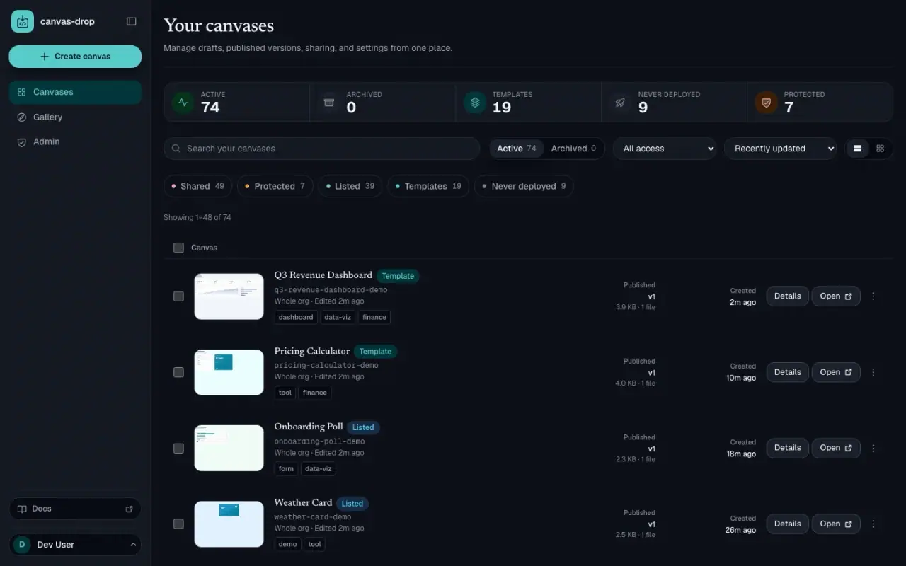

# canvas-drop

**Your org's place to ship the small web tools you build with AI. Drop a folder, get a secure URL, behind your own SSO, on infrastructure you control.**

[](LICENSE)
[](https://github.com/markpasternak/canvas-drop/actions/workflows/ci.yml)


<p align="center">
  
</p>

AI builds a working dashboard, form, or internal tool in minutes. Then it stalls, because there is nowhere safe and instant to put it: emailing a zip, or spinning up a project on someone else's cloud outside your org boundary, or waiting on a platform team. canvas-drop closes that last mile. It is the creation-and-sharing layer for AI-built tools, prototypes, dashboards, demos, and lightweight internal apps. Self-hosted inside your trust boundary, MIT-licensed, with **no telemetry and no phone-home**.

It is inspired by [Quick](https://shopify.engineering/quick), Shopify's internal "drop a folder, get a URL" platform that shifted their culture to demos over memos. Quick lives inside Shopify and there was no open way to run the same idea on your own infrastructure with a real backend, so I built canvas-drop and took it further.

Full documentation lives at **[canvas-drop.com/docs](https://canvas-drop.com/docs)**.

---

## Why canvas-drop

- **Distribution is the problem it solves.** AI build tools make the artifact. canvas-drop is where it lands: every canvas sits behind your org sign-in, on infra you control, reachable at an unguessable URL the moment it deploys. No new vendor, no data leaving the boundary.
- **Agents ship from the workflow they already use.** A keyed deploy API, an installable [agent skill](docs/site/agents/skill.md), and a connect-once [MCP server](docs/site/agents/mcp.md) let an AI agent create and ship a canvas from your editor, terminal, or CI with no human in the loop. The building happens where you already work, not inside a chat box bolted onto the tool.
- **A real backend when you need it.** Five built-in primitives (KV, files, AI, identity, realtime) added with one `<script>` tag, no provisioning, **no secrets in the browser**. Stay fully static when you do not.
- **A rich, scriptable API.** The whole lifecycle is programmable: create, deploy (including a content-addressed staged upload that sends only changed bytes), read-back and verify, versions, rollback, unpublish, sharing, and the full draft-editor loop. The agent contract is one machine-readable page at `{base}/llms.txt`.
- **Versioned, content-addressed storage.** Every publish is an immutable version; roll back to any of the last 10 in one click. Blobs are keyed by hash and versions are manifests over shared blobs, so re-deploys write only what changed.
- **A deliberate sharing ladder.** Private, Specific people (org members or email-invited guests), a Team (a self-serve group — personal *friends & family* or org-attached), Whole org, or an admin-gated Public link. Revocable and optionally time-boxed. Invites are **auth-delegated**: a brand-new person gets access on their first sign-in through your configured auth — no app-owned passwords or magic-link accounts.
- **Run anywhere.** Database, storage, URL mode, and auth all sit behind interfaces, so the same image runs on a laptop, a $5 VPS, or a corporate cloud. Swapping a driver is a config change, never a code change.
- **Rich admin and configuration, sensible defaults.** It runs the moment you clone it, with a sane default for every choice, so there is nothing to configure to start. When you want control it is all there: an admin panel (all-canvases governance, takedown and restore, the AI model allowlist, global quota defaults) plus typed env config for drivers, limits, and per-capability gates, validated at boot so a bad combination fails loud instead of silently.

> Quick is files plus a tiny API behind an identity proxy. canvas-drop keeps that simplicity and adds the rich API, the versioned storage model, the five primitives, and the sharing ladder, so the same "drop a folder" gesture also covers the parts an org actually needs.

---

## Quickstart (local dev)

Requires **Node 24** and **pnpm**. Clone to a running instance in well under five minutes:

```bash
git clone https://github.com/markpasternak/canvas-drop.git
cd canvas-drop
pnpm install
cp .env.example .env       # defaults: path mode, SQLite, local storage, dev auth
pnpm dev                   # server + dashboard in watch mode (Ctrl-C stops both)
```

| URL | What |
|-----|------|
| **http://localhost:5173** | The **dashboard** (Vite HMR). Develop here; it proxies `/api`, `/auth`, and `/v1` to the server. |
| **http://localhost:3000** | The **Hono server**: API, deploy endpoints, and hosted canvases. |

`dev` auth auto-logs-in a fake local user, so there is zero setup. `curl http://localhost:3000/healthz` confirms the server is alive. Port already in use? `CANVAS_DROP_PORT=3001 pnpm dev`.

---

## Deploy a canvas

Every publish produces the same thing: an immutable version served at an unguessable URL. The first three are in the dashboard; the fourth is for scripts and agents.

1. **Drag a folder or ZIP** with `index.html` and its assets.
2. **Paste HTML** for a single-file artifact (often what an AI just wrote).
3. **Edit in the browser**: a file manager plus CodeMirror editor work against a mutable **draft** with autosave; an explicit **Publish** snapshots it into an immutable version.
4. **Deploy API**: `PUT` a ZIP with the canvas's secret key. `deploy = live`, no draft loop.

```bash
curl -X PUT "$BASE_URL/v1/canvases/$CANVAS_ID/deploy" \
  -H "Authorization: Bearer $CANVAS_KEY" \
  --data-binary @site.zip
```

The key operates only on its own canvas and **never belongs in canvas files**. `GET /v1/canvases/:id`, `GET …/versions`, `GET …/files` (read back the live version to verify), `POST …/rollback`, and `POST …/unpublish` round out the surface. For large or frequently re-deployed canvases there is a **staged upload** (`begin` then per-blob `PUT` then `finalize`): a content-addressed manifest sends only changed files, and bytes go straight to the server instead of through an agent's context. See [canvas-drop.com/docs](https://canvas-drop.com/docs).

You can also **clone** any active canvas you own, or a gallery-listed template, as an unpublished draft with a fresh slug and key.

---

## Backend in five primitives

Add one tag, no build step, no keys, no config:

```html
<script src="/sdk/v1.js"></script>
```

The global `canvasdrop` appears. Identity rides the signed-in session; the canvas is identified from its own URL. Every method throws a typed, `instanceof`-catchable error.

```js
const me = await canvasdrop.me();                       // { id, email, name, avatarUrl, kind }
const votes = await canvasdrop.kv.increment("votes", 1);
await canvasdrop.kv.user.set("theme", "dark");          // per-viewer scope
const f = await canvasdrop.files.upload(input.files[0]); // { id, name, size, url }
for await (const delta of canvasdrop.ai.stream(messages, { model })) out.textContent += delta;
const ch = canvasdrop.realtime.channel("room"); ch.subscribe(render); ch.publish("cursor", { x, y });
```

| Primitive | What it gives a canvas |
|-----------|------------------------|
| **KV** | Shared (`kv.*`) and per-viewer (`kv.user.*`) key/value with `list` and atomic `increment`. |
| **Files** | Per-canvas upload/list/delete; served as safe, non-executable bytes. |
| **AI** | Anthropic-first proxy behind a provider abstraction: streaming, model allowlist, metered quotas. The provider key stays server-side. |
| **Identity** | `me()`: id, email, name, avatar, and `kind` (`member` or `guest`), resolved from org auth, never the client. |
| **Realtime** | Ephemeral broadcast plus presence per canvas. Revoking a share drops the socket instantly. |

The full, agent-optimized contract is served live at **`{base}/llms.txt`**. See also [`docs/sdk.md`](docs/sdk.md).

---

## For AI agents

canvas-drop treats agents as first-class authors. Three ways in, all thin clients of the same service layer:

- **Deploy API**: a per-canvas key `PUT`s files straight to a live version (above).
- **Agent skill**: an installable skill ([`docs/site/agents/skill.md`](docs/site/agents/skill.md)) with the full SDK contract, so any coding agent builds canvases out of the box.
- **MCP server** ([`docs/site/agents/mcp.md`](docs/site/agents/mcp.md)): a connect-once remote server at `{base}/mcp`, signing in through your org's own login (OAuth 2.1). It exposes identity-scoped tools at **full dashboard parity**, so anything a person can do in the UI (deploy, version, roll back, share, edit the draft, set the preview cover, clone, read usage) an agent can do over MCP. On by default; disable with `CANVAS_DROP_MCP=off`.

---

## Configuration

Everything is set by environment variables, validated at boot, with a precise message on an invalid combination. Full surface in [`.env.example`](.env.example). Swappable drivers:

| Concern | Options | Env |
|---------|---------|-----|
| Database | SQLite, Postgres | `CANVAS_DROP_DB` |
| Storage | local disk, S3-compatible (AWS S3, MinIO, Cloudflare R2) | `CANVAS_DROP_STORAGE` |
| URL mode | path, subdomain | `CANVAS_DROP_URL_MODE` |
| Auth | `proxy` (recommended prod), `oidc`, `dev` | `CANVAS_DROP_AUTH_MODE` |
| Email (guest invites) | `log`, `smtp`, `mailgun`, `noop` | `CANVAS_DROP_EMAIL_DRIVER` |
| Tenancy (org boundary, off by default) | name an org so guests can't see whole-org canvases | `CANVAS_DROP_ORG_NAME` |

The blessed production profile is **subdomain mode plus an identity-aware proxy** (e.g. Cloudflare Access) verifying a signed JWT, with Postgres and S3.

**Tenancy (optional).** Set `CANVAS_DROP_ORG_NAME` to draw a member-vs-guest boundary: members (by verified email domain) can share to the **whole org**, while brought-in guests only see canvases they're invited to. It's **inert until named** — deploy first, migrate later. Migrating an existing instance is a dry-run-first cutover; see [`docs/tenancy.md`](docs/tenancy.md).

Day-to-day operation lives in the in-app **admin panel**: the all-canvases list with usage, disable/takedown/restore, the AI model allowlist, and global quota defaults. Operator-tunable settings are editable there or via env; the auth and rate-limit hot path stays read-only.

---

## Self-host (Docker, ~5 min)

Requires **Docker** and **Docker Compose v2**. The repo ships a one-command demo stack that runs canvas-drop in its real `proxy` mode behind an identity-aware proxy (oauth2-proxy) and a bundled demo IdP (Dex), so you can try the production shape with zero external setup:

```bash
docker compose up --build          # first build takes a few minutes; add -d for background
# then open http://localhost:8080  and log in as  demo@example.com / canvasdrop
docker compose down -v             # tear down and wipe data
```

The app verifies a Dex-signed JWT against Dex's JWKS, the same cryptographic trust path you run in production, with Postgres for data and an optional MinIO profile for S3. The app is never exposed directly; only the proxy is.

> **The demo stack is for local evaluation only.** Its secrets and the `demo@example.com` login are public placeholders, and it runs on plain HTTP in path mode. Rotate every secret and follow the graduation checklist before any real use.

Going to production is a configuration change: copy [`.env.production.example`](.env.production.example), point the proxy/JWKS at your real IdP, move to subdomain mode behind real TLS, and rotate all secrets. Full walkthrough: [`docs/site/self-hosting/deploy.md`](docs/site/self-hosting/deploy.md).

---

## Security model

canvas-drop runs inside a **trusted organization**: everyone reaching it has passed org SSO, and an email-domain allowlist keeps outsiders out. That posture deletes whole problem classes (anonymous abuse, spam, public bot threats). What remains is a short list of **hard invariants that must never break** ([`BUILD_BRIEF.md` §12.0](BUILD_BRIEF.md)):

1. **No impersonation.** Identity always comes from the server-side auth context, never anything the client sends.
2. **No credential or canvas theft.** API keys and tokens are hashed at rest and shown once; canvas passwords are argon2id.
3. **No unauthorized access.** A canvas is reachable only by its owner and whoever its access rung allows. An admin gets no special access to canvases it does not own; cross-owner admin power is limited to the dedicated admin routes (list, disable/enable/restore). Everything else 404s.
4. **No cross-canvas reach in subdomain mode.** Each canvas is its own browser origin and cannot read, write, or act on another's data.
5. **Lifecycle is honored instantly.** Revoke, expiry, disable, delete, slug-regen, and key-regen take effect on the next request and drop live sockets.

**URL-mode isolation is a real choice.** Subdomain mode (`{slug}.example.com`) gives full browser-origin isolation and is recommended for any multi-user production deployment. Path mode (`host/c/{slug}/`) shares one origin and is perfect for localhost and trusted single-user hosting; multi-user path mode requires an explicit opt-in and an admin warning. No secrets ever reach the browser; every endpoint is Zod-validated; uploads are zip-slip checked and served as inert bytes; an audit log records auth, deploys, sharing, AI usage, and admin actions.

---

## Architecture

```
apps/server        Hono server, one role-routed process: API, deploy, hosted canvases
apps/dashboard     Vite + React SPA dashboard
packages/shared    zod config, dual-dialect Drizzle schema, shared types
packages/sdk       the zero-config browser SDK (the `canvasdrop` global)
docs/              BUILD_BRIEF, plans, compounding learnings, docs-site source
```

**Dual-dialect is sacred:** SQLite and Postgres stay in lockstep via shared column helpers, and the CI matrix runs the full suite on both. **Config is the only `process.env` reader.** Everything load-bearing sits behind an interface, so the four drivers swap by config alone.

---

## Status

**v1 is feature-complete and hardening toward a public release**, built unit-by-unit from [`BUILD_BRIEF.md`](BUILD_BRIEF.md) with CI green on both dialects at every merge. M1 through M9 plus a wave of post-v1 work (the sharing ladder, the MCP server at full dashboard parity, clone-as-template, staged uploads, custom slugs, optional canvas screenshots, and an admin-flippable [design-skin layer](docs/site/self-hosting/configuration.md#design-skins)) have shipped; ops/packaging (M10) is the only milestone still in progress — its Docker image/compose, **backup/restore + scheduled maintenance** ([`docs/ops.md`](docs/ops.md)), and secret-scan are in, with the single-VPS load test and the IAP colleague pilot still deferred. See [`docs/plans/`](docs/plans/).

> **Maturity, honestly:** canvas-drop is **not yet running in production anywhere serious.** It boots, passes a dual-dialect suite, and self-hosts via Docker, but it has not been battle-tested under a real org's load yet. That is exactly what is next. Self-host reports, issues, and PRs are very welcome.

---

## Commands

```bash
pnpm dev          # server + dashboard in watch mode
pnpm test         # full suite, BOTH dialects (sqlite + pglite) in-process
pnpm lint         # biome check
pnpm format       # biome check --write (also sorts imports)
pnpm typecheck    # tsc --noEmit across server, sdk, dashboard
pnpm build        # build all workspace packages
pnpm purge [days] # reclaim storage from soft-deleted canvases (dry-run supported)
pnpm backup <dir> # full instance backup (DB + storage) → a portable directory
pnpm restore <dir> # restore a backup into a fresh, empty instance
```

Deleting a canvas is a soft-delete (a tombstone row). `pnpm purge` is the maintenance sweep that reclaims the heavy data; it reads the same config as the server. **`backup`/`restore`** capture and recover the whole instance (every table + every content-addressed blob) in a driver-agnostic format — so they also migrate between drivers (SQLite↔Postgres, local↔S3). In production these are subcommands of the server binary (`node … apps/server/dist/index.js {backup,restore,purge}`), so cron runs them with the app image. Full runbook + a recommended backup/purge cron schedule: [`docs/ops.md`](docs/ops.md).

---

## Credits

Inspired by [Quick: An internal hosting platform for the AI era](https://shopify.engineering/quick) by Daniel Beauchamp and Alex Pilon, and Daniel's [thread](https://x.com/pushmatrix/status/2064722585019969727) on how a folder of files, a lightweight API, and some trust changed how Shopify builds. MIT licensed; not affiliated with Shopify.

## Contributing

canvas-drop is built by humans and AI coding agents working from the same contract, following the [compound engineering](https://every.to/guides/compound-engineering) practice from Every: plan the work, build one unit at a time with its tests, and capture every non-obvious learning so each pass (human or agent) compounds on the last. Work flows from plans in [`docs/plans/`](docs/plans/), CI green on both dialects before merge. Start with [`CONTRIBUTING.md`](CONTRIBUTING.md) and [`AGENTS.md`](AGENTS.md); institutional learnings compound in [`docs/solutions/`](docs/solutions/).

## License

MIT, see [`LICENSE`](LICENSE).
