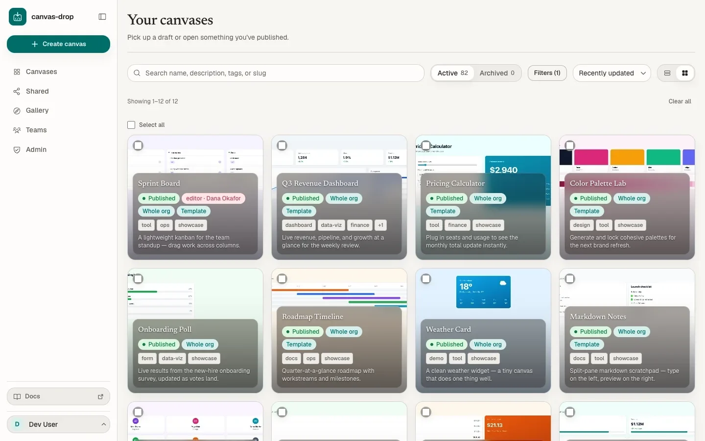

# canvas-drop

**From a working artifact to a tool your team uses. Publish files from your laptop, cloud workspace, or AI agent. Give them a stable address and decide who can open them.**

[](LICENSE)
[](https://github.com/markpasternak/canvas-drop/actions/workflows/ci.yml)


<p align="center">
  
</p>

A useful tool should not depend on who has the latest ZIP, which chat created it, or who can open its cloud workspace. canvas-drop gives those artifacts a shared home: a live URL, named viewers and editors, and a version history you can recover from. Keep building in the tools you already use; publish here when someone else needs to use the result.

Self-hosted on your infrastructure. MIT licensed. No telemetry or phone-home. Inspired by Shopify's [Quick](https://shopify.engineering/quick).

Full documentation lives at **[canvas-drop.com/docs](https://canvas-drop.com/docs)**. Every instance serves the same pages at `{base}/docs`; the source is [`docs/site/`](docs/site/).

---

## Why canvas-drop

- **A home beyond the original workspace.** Drop a folder or ZIP, paste HTML, or publish from an agent. Each canvas has one address you can share and keep updating.
- **Clear access, built in.** Start Restricted, add people and teams as viewers or editors, or open access to your org. Admins govern optional public links, which serve static content only. Added people sign in through your configured authentication.
- **Keep improving the live tool.** Edit an autosaved draft, review its file changes and audience, then publish. Every publish creates an immutable version. Make an earlier version current, or restore it to a draft for revision; each recovery action explains what will change.
- **Agents use the same capabilities.** A Deploy API, an installable [agent skill](docs/site/agents/skill.md), and a [MCP server](docs/site/agents/mcp.md) with 47 identity-scoped tools cover publishing, editing, sharing, versions, and the rest of the dashboard's owner/editor/viewer surface.
- **Backend features when the tool needs them.** KV, file storage, AI, identity, realtime, and admin-granted outbound Connections are available through one browser SDK. Keep a canvas static or enable capabilities individually. Provider keys and connection credentials stay on the server.
- **Infrastructure you control.** Choose SQLite or Postgres, local storage or S3, and proxy or OIDC authentication. Admins manage access, usage, quotas, and appearance. Configured AI providers and outbound Connections can send data to the services you choose.

---

## Quickstart (local dev)

Requires **Node 24** and **pnpm 11**. Clone to a running instance in a few minutes:

```bash
git clone https://github.com/markpasternak/canvas-drop.git
cd canvas-drop
pnpm install
cp .env.example .env       # defaults: path mode, SQLite, local storage, dev auth
pnpm dev                   # server + dashboard + SDK in watch mode
```

| URL | What |
|-----|------|
| **http://localhost:5173** | The **dashboard** (Vite HMR). Develop here; it proxies `/api`, `/auth`, `/v1`, and the docs paths to the server. |
| **http://localhost:3000** | The **server**: API, deploy endpoints, hosted canvases, `/docs`, `/mcp`. |

`dev` auth signs you in as a fixed local user (`dev@example.com`, an admin by default), so there is nothing to set up. `pnpm dev` seeds sample canvases into an empty database (`CANVAS_DROP_DEV_SEED=0` skips that). `curl http://localhost:3000/healthz` confirms the server is up. Port taken? `CANVAS_DROP_PORT=3001 pnpm dev`.

The `.env` file is read only by `pnpm dev`. In production, config comes from the process manager or container environment.

---

## Deploy a canvas

Every deploy produces an immutable version at the canvas's stable URL. Slugs are generated by default; owners can choose their own. Three paths live in the dashboard; the fourth is for scripts and agents.

1. **Drag a folder or ZIP** with `index.html` and its assets.
2. **Paste HTML** for a single-file artifact (often what an AI just wrote). It publishes in one step.
3. **Edit in the browser**: a file tree plus CodeMirror editor work against a mutable **draft** with autosave; **Review and publish** shows the saved file changes and who can open the result before making it live. A single-HTML draft also gets an on-page text-editing mode.
4. **Deploy API**: `PUT` a ZIP with the canvas's secret key. `deploy = live`, no draft loop.

Paste, folder, and ZIP also work as **Upload new version** on a canvas that already exists.

```bash
curl -X PUT "$BASE_URL/v1/canvases/$CANVAS_ID/deploy" \
  -H "Authorization: Bearer $CANVAS_KEY" \
  --data-binary @site.zip
# 200 {"url":"...","version":7,"fileCount":12,"totalBytes":48213,"warnings":[]}
```

The key (`cd_...`, shown once) operates only on its own canvas and **never belongs in canvas files**. `GET /v1/canvases/:id`, `GET .../versions`, `GET .../files` (read back the live version to verify), `POST .../rollback`, and `POST .../unpublish` round out the surface. For large or frequently re-deployed canvases there is a **staged upload**: `POST .../uploads` returns the blob hashes the server is missing, `PUT .../uploads/:uploadId/blobs/:hash` stages each one, and `POST .../uploads/:uploadId/finalize` publishes. Only changed files cross the wire.

Limits: 100 MB per canvas, 25 MB per file, 2 000 files; the last 10 versions are kept. You can also **clone** a canvas you own or edit, a gallery-listed template, or an eligible published canvas granted directly to you or through one of your teams. General access alone does not grant cloning. The copy is an unpublished, Restricted draft with an empty direct-access list and a fresh slug and key; it remains yours if the source grant is later revoked. Three starter canvases live in [`examples/`](examples/).

---

## Backend primitives + authoring

Switch on **Backend** in the canvas's Backend tab (off by default; KV, files, AI, and realtime each have their own toggle, and identity is on whenever the backend is), then add one tag. No build step, no keys, no config:

```html
<script src="/sdk/v1.js"></script>
```

The global `canvasdrop` appears. Identity rides the signed-in session; the canvas is identified from its own URL. Every method throws a typed, `instanceof`-catchable error; a primitive that is off fails with `CAPABILITY_DISABLED`.

```js
const me = await canvasdrop.me();                       // { id, email, name, avatarUrl, kind }
const votes = await canvasdrop.kv.increment("votes", 1);
await canvasdrop.kv.user.set("theme", "dark");          // per-viewer scope
const f = await canvasdrop.files.upload(input.files[0]); // { id, name, size, url }
for await (const delta of canvasdrop.ai.stream(messages, { model })) out.textContent += delta;
const ch = canvasdrop.realtime.channel("room"); ch.subscribe(render); ch.publish("cursor", { x, y });
const prices = await canvasdrop.connections.fetch("stocks", `/quote?symbol=${symbol}`);
renderQuote(await prices.json()); // exact origin + credentials were approved by an admin
```

| Capability | What it gives a canvas |
|------------|------------------------|
| **KV** | Shared (`kv.*`) and per-viewer (`kv.user.*`) key/value with `get`, `set`, `delete`, `list`, and atomic `increment`. |
| **Files** | Per-canvas `upload`, `list`, `delete`, and `url`; served as inert bytes. |
| **AI** | A server-side proxy to the provider (Anthropic by default) with streaming, a model allowlist, and metered per-user and per-canvas quotas. The provider key never leaves the server. Off until a key is configured (`CANVAS_DROP_AI_API_KEY`, or set in the admin panel). |
| **Identity** | `me()`: id, email, name, avatar, and `kind` (`member` or `guest`), resolved from org auth, never the client. |
| **Realtime** | Ephemeral publish/subscribe plus presence per canvas over one WebSocket. Revoking a share drops the socket. |
| **Connections** | `connections.fetch(profile, relativePath, init?)` forwards a bounded request to one exact HTTPS origin an admin attached to the canvas. Fixed credentials and headers stay encrypted server-side; canvas code never receives them. |
| **Authoring** | `canvasdrop.canvases.publish`, `update`, `list`, and `revoke`: signed-in viewers create and manage canvases as themselves. Off by default both instance-wide and per canvas. |

Public-link canvases are static-only: anonymous visitors get no primitives or authoring. The full, agent-optimized contract is served at **`{base}/llms.txt`**; the readable reference is [`docs/sdk.md`](docs/sdk.md), with the [authoring reference](docs/site/sdk/authoring.md) and per-capability pages under [`docs/site/sdk/`](docs/site/sdk/).

---

## For AI agents

canvas-drop treats agents as first-class authors. Three ways in, all thin clients of the same service layer:

- **Deploy API**: a per-canvas key `PUT`s files straight to a live version (above).
- **Agent skill**: an installable skill ([`docs/site/agents/skill.md`](docs/site/agents/skill.md), served as `{base}/skill.zip`) with the full SDK and deploy contract, so any coding agent builds canvases out of the box.
- **MCP server** ([`docs/site/agents/mcp.md`](docs/site/agents/mcp.md)): a connect-once remote server at `{base}/mcp` that signs in through your org's own login (OAuth 2.1). Its 47 identity-scoped tools cover the dashboard surface: anything a person can do in the UI (deploy, version, roll back, share, manage the people list and roles, transfer ownership, edit the draft, set the preview cover, clone, read usage and connection grants) an agent can do over MCP, as the owner or as an editor, with the same owner-only refusals. On by default; `CANVAS_DROP_MCP=off` disables it.

---

## Configuration

Everything is set by environment variables, validated at boot with a precise message on an invalid combination. Every key is annotated in [`.env.example`](.env.example) and documented in [`docs/site/self-hosting/configuration.md`](docs/site/self-hosting/configuration.md). The drivers:

| Concern | Options | Env |
|---------|---------|-----|
| Database | `sqlite` (default), `postgres` | `CANVAS_DROP_DB` |
| Storage | `local` (default), `s3` (AWS S3, MinIO, Cloudflare R2) | `CANVAS_DROP_STORAGE` |
| URL mode | `path` (default), `subdomain` | `CANVAS_DROP_URL_MODE` |
| Auth | `dev` (default), `proxy` (recommended for production), `oidc` | `CANVAS_DROP_AUTH_MODE` |
| Email (invite and notification mail) | `log` (default), `smtp`, `mailgun`, `noop` | `CANVAS_DROP_EMAIL_DRIVER` |
| Tenancy (org boundary) | unset (default, inert) or an org name | `CANVAS_DROP_ORG_NAME` |

The blessed production profile is **subdomain mode plus an identity-aware proxy** verifying a signed JWT against its JWKS, with Postgres and S3. [`.env.production.example`](.env.production.example) is that profile, annotated.

**Tenancy (optional).** Set `CANVAS_DROP_ORG_NAME` to draw a member-vs-guest boundary: members (by verified email domain) can share to the **whole org**, while brought-in guests only see canvases they are invited to. It is inert until named, so deploy first and migrate later. Turning it on for an existing instance is a dry-run-first cutover (`pnpm tenancy:plan`, then `--apply`); see [`docs/tenancy.md`](docs/tenancy.md).

Day-to-day operation lives in the in-app **admin panel**: every canvas across owners with usage, disable and restore, owner reassignment, gallery features, people (block, promote, public-link grants, sign-in permits), reusable outbound connection profiles and their per-canvas grants, and the DB-editable settings (AI key, models, quotas, the public-link switch, screenshots, skin, invite policy, email templates). Auth, drivers, and rate limits stay env-only and are read-only there.

---

## Self-host (Docker)

Requires **Docker** and **Docker Compose v2**. The repo ships a one-command demo stack that runs canvas-drop in its real `proxy` mode behind an identity-aware proxy (oauth2-proxy) and a bundled demo IdP (Dex), so you can try the production shape with no external setup:

```bash
docker compose up --build          # first build takes a few minutes; add -d for background
# open http://localhost:8080 and sign in as demo@example.com / canvasdrop
docker compose down -v             # tear down and wipe data
```

The app verifies a Dex-signed JWT against Dex's JWKS, the same cryptographic trust path you run in production, with Postgres for data and an optional MinIO profile (`--profile minio`) when you want to point storage at S3. Only the proxy publishes a port; the app is never exposed directly. `scripts/compose-smoke.sh` asserts that shape end to end. `docker compose build --build-arg SCREENSHOTS=1` bakes Chromium into the image for the optional preview-screenshot pipeline.

> **The demo stack is for local evaluation only.** Its secrets and the `demo@example.com` login are public placeholders, and it runs plain HTTP in path mode. Rotate every secret before any real use.

Going to production is a configuration change: start from [`.env.production.example`](.env.production.example), point the proxy and JWKS at your real IdP, move to subdomain mode behind real TLS, and rotate all secrets. Full walkthrough: [`docs/site/self-hosting/deploy.md`](docs/site/self-hosting/deploy.md).

---

## Security model

The dashboard and backend capabilities require sign-in through your configured authentication. People and teams can receive named access; admins can also allow anonymous, static-only public links. Operators control the sign-in policy and public-link availability. The implementation protects these **hard invariants** ([`BUILD_BRIEF.md` §12.0](BUILD_BRIEF.md); operator view in [`docs/site/self-hosting/security-model.md`](docs/site/self-hosting/security-model.md)):

1. **No impersonation.** Identity always comes from the server-side auth context, never anything the client sends. In `proxy` mode only the trusted proxy may assert identity: a verified JWT, or headers from a peer listed in `CANVAS_DROP_TRUSTED_PROXY_IPS`.
2. **No credential or canvas theft.** Deploy keys are SHA-256-hashed at rest and shown once; session tokens are hashed at rest too; canvas passwords are argon2id.
3. **No unauthorized access.** A canvas is reachable only by its owner, its editors, and whoever its access rung allows, re-evaluated on every request. An admin gets no special access to canvases it does not own; cross-owner admin power is limited to the dedicated admin routes. Everything else 404s.
4. **No cross-canvas reach in subdomain mode.** Each canvas is its own browser origin and cannot read, write, or act on another's data.
5. **Lifecycle is honored instantly.** Revoke, expiry, disable, delete, slug regen, and key regen take effect on the next request and drop live sockets.

**URL-mode isolation is a real choice.** Subdomain mode (`{slug}.canvases.example.com`) gives full browser-origin isolation and is the recommended multi-user production shape. Path mode (`host/c/{slug}/`) shares one origin and suits localhost and trusted single-user hosting; running it with real auth is an explicit opt-in (`CANVAS_DROP_ALLOW_MULTI_USER_PATH_MODE=true`, otherwise boot refuses), and the setting shows read-only in the admin Configuration panel. No secrets reach the browser; request bodies are Zod-validated; uploads are zip-slip checked and served as inert bytes; an audit log records sign-ins, deploys, sharing changes, and admin actions. Report a vulnerability via [`SECURITY.md`](SECURITY.md).

---

## Architecture

```
apps/server        Hono server, one role-routed process: API, deploy, hosted canvases, MCP, docs
apps/dashboard     Vite + React SPA dashboard
packages/shared    zod config, dual-dialect Drizzle schema, shared types
packages/sdk       the zero-config browser SDK (the `canvasdrop` global)
drizzle/           generated migrations for both dialects (applied at boot)
docker/            Caddy, oauth2-proxy, Dex, and maintenance-cron config for the compose stack
examples/          hello-static, kv-counter, and the primitives showcase
docs/              plans, compounding learnings (docs/solutions), ops runbook, docs-site source (docs/site)
BUILD_BRIEF.md     the product spec the units are built from
```

**Dual-dialect is sacred:** the SQLite and Postgres schemas stay in lockstep via shared column helpers, migrations run at boot, and the CI matrix runs the full suite on both. **Config is the only `process.env` reader.** Everything load-bearing sits behind an interface, so the four drivers swap by config alone.

---

## Status

**v1 is feature-complete**, built unit by unit from [`BUILD_BRIEF.md`](BUILD_BRIEF.md) with CI green on both dialects at every merge. Milestones M1 through M9 are shipped: foundation, hosting and deploy, the dashboard, canvas management, the editor and draft/publish model, the original five primitives and the SDK, admin and hardening, the gallery, and AI and realtime.

Post-v1 work merged to `main`: the sharing ladder and **Shared** discovery, usage stats, server-side list filters and search, the docs system (`/docs`, `/llms.txt`, `/skill.zip`), clone-as-template, custom slugs, the MCP server (47 tools, dashboard parity), the staged content-addressed upload, the signed-out landing page, preview covers with an optional screenshot pipeline, admin-flippable [design skins](docs/site/self-hosting/configuration.md#design-skins), the org boundary (tenancy) with teams and auth-delegated invites, the [authoring capability](docs/site/sdk/authoring.md) and managed shares, prompt caching for the AI proxy, version download and delete, the org-scoped gallery, popularity sort and bulk actions, **editor roles with ownership transfer**, the simplified **Sharing and permissions** hierarchy with direct/team viewer clone parity, and admin-granted [outbound Connections](docs/site/sdk/connections.md).

**M10 ops/packaging is the one open milestone.**

The [publishing and brand refresh](docs/plans/2026-09-04-001-feat-publishing-experience-plan.md) and [library-to-publish UX round](docs/plans/2026-09-05-001-feat-library-to-publish-ux-plan.md) add clearer library scanning, details for resuming work, audience summaries, publish review, version-recovery guidance, and keyboard/mobile polish. The marketing walkthrough, documentation screenshots, and animated tour above show the refreshed UI with example content.

| Shipped | Still deferred |
|---------|----------------|
| Docker image and compose stack | The single-VPS load test |
| Vendor-neutral deploy docs | A 10 to 15 person colleague pilot behind an IAP |
| Backup/restore tooling with a scheduled-maintenance runbook ([`docs/ops.md`](docs/ops.md)) and an automated round-trip test on both dialects | |
| Security review of the five invariants ([`docs/security/`](docs/security/)) | |
| Secret scan in CI | |
| This README, the quickstart, and three starter examples | |

> **Maturity, honestly:** canvas-drop boots, passes the dual-dialect suite, and self-hosts via Docker, but it has not been load-tested or run through a multi-user pilot yet; those are the open M10 items. Self-host reports, issues, and PRs are welcome.

Not started, and not claimed anywhere above: a CLI, DB-backed custom domains, multi-org tenancy, KV change subscriptions, and a structured-output AI helper. Plans and their status live in [`docs/plans/`](docs/plans/).

---

## Commands

```bash
pnpm dev              # server + dashboard + SDK in watch mode
pnpm dev:stop         # send SIGTERM to this worktree's recorded dev launcher
pnpm test             # full suite: BOTH dialects (sqlite + pglite) in-process, then the dashboard
pnpm test:sqlite      # sqlite leg only
pnpm test:pg          # postgres (pglite) leg only
pnpm test:file <path> # one test file, verbose
pnpm lint             # biome check
pnpm format           # biome check --write (also sorts imports)
pnpm typecheck        # tsc --noEmit across the workspace
pnpm build            # build all workspace packages
pnpm purge [days]     # reclaim storage from soft-deleted canvases (dry-run supported)
pnpm backup <dir>     # full instance backup (every table + every blob) to a portable directory
pnpm restore <dir>    # restore a backup into a fresh, empty instance
pnpm seed:showcase    # deploy examples/showcase as the `showcase` canvas with every primitive on
```

Deleting a canvas is a soft delete (a tombstone row). `pnpm purge` is the maintenance sweep that reclaims the heavy data and prunes usage events older than 90 days; it reads the same config as the server. `backup` and `restore` capture and recover the whole instance in a driver-agnostic format, so they also migrate between drivers (SQLite to Postgres, local to S3). In production all three are subcommands of the server binary (`node --conditions=node-dist apps/server/dist/index.js {backup,restore,purge}`), so cron runs them with the app image. Runbook and a recommended schedule: [`docs/ops.md`](docs/ops.md).

---

## Credits

Inspired by [Quick: An internal hosting platform for the AI era](https://shopify.engineering/quick) by Daniel Beauchamp and Alex Pilon, and Daniel's [thread](https://x.com/pushmatrix/status/2064722585019969727) on how a folder of files, a lightweight API, and some trust changed how Shopify builds. MIT licensed; not affiliated with Shopify.

## Contributing

canvas-drop is built by humans and AI coding agents working from the same contract, following the [compound engineering](https://every.to/guides/compound-engineering) practice from Every: plan the work, build one unit at a time with its tests, and capture every non-obvious learning so each pass (human or agent) compounds on the last. Work flows from plans in [`docs/plans/`](docs/plans/), CI green on both dialects before merge. Start with [`CONTRIBUTING.md`](CONTRIBUTING.md) and [`AGENTS.md`](AGENTS.md); institutional learnings compound in [`docs/solutions/`](docs/solutions/).

## License

MIT, see [`LICENSE`](LICENSE).
