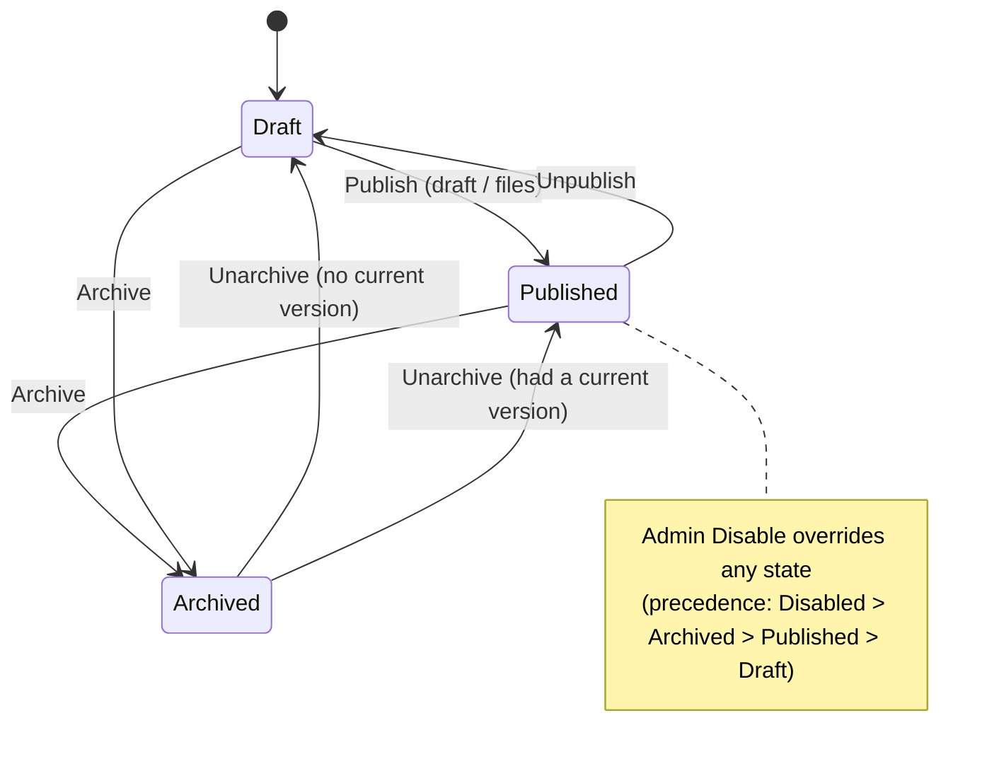

# Canvas vocabulary & state model

## Summary

Unify how a canvas's lifecycle is named and presented across the dashboard. **Publish** becomes the single UI verb for making content live; a canvas reads as **Draft → Published → Archived** with the served snapshot marked **Current**; the canvas header gains the same three axis-chips the list already uses (Publication · Visibility · Gallery); each view gets exactly one publish affordance in a consistent slot; a new **Unpublish** action returns a Published canvas to Draft; and the docs site, README, and SDK/agent docs are aligned to the result.

## Problem Frame

The same concept wears different words on nearly every screen. "Make this canvas's content live" appears as **Deploy** (header "Deploy files", "Deploy a new version", "Deploy history", the "Deploys" tab) and as **Publish** ("Publish draft", "Paste HTML and publish", "Create and deploy", "Published v1") — and the two collide on a single screen: the header's "Deploy files" persists onto the editor tab, where the sticky bar also shows "Publish draft" (two buttons, two words, one outcome), while the Versions tab shows a *third* "Deploy files". The live *state* is variously "Live" (version chip), "Published" (list), and "Deployed" (the "Deployment" column, "Never deployed"); the never-live state is both "Draft only" and "Never deployed".

Underneath, the lifecycle is actually two merged facts the UI never reconciles: `status` (`active` / `archived` / `disabled`) and whether a version is currently served (`currentVersionId != null`). The Status tab even labels a fact "Lifecycle" showing only `status`. And the canvas header surfaces a single chip — the *gallery* state ("Listed") — in the slot a reader expects a lifecycle status, even though the Your-canvases table already cleanly separates three independent axes (Visibility / Gallery / Deployment).

The cost is comprehension: owners can't reliably tell what state a canvas is in or which button changes it, and the inconsistency compounds as features (like an unpublish control) are added on top of an already-ambiguous vocabulary.

## Key Decisions

- **Publish is the only UI verb; "deploy" is the API/SDK + code-identifier term.** Every dashboard string that means "make content live" becomes Publish/Published. "deploy" remains in `/v1/.../deploy`, SDK/agent docs, and internal code identifiers (`DeployButton`, `useDeploy`, `api.deploy*`) — a deliberate UI-vs-API split, not an inconsistency for a later reviewer to "fix".
- **"Publish" means create a new version; "Make current" means re-point to an existing one.** Re-pointing the live canvas to an older version creates no new snapshot, so it gets its own verb that pairs with the "Current" state word. This keeps "Publish" honest (it always produces a new version, from the draft or an upload).
- **"Live" is retired.** The canvas-level state is **Published**; the served snapshot is **Current**. "Draft only" and "Never deployed" both collapse to **Draft**.
- **The Publication chip is a single derived lifecycle** with precedence **Disabled > Archived > Published > Draft**, merging admin/owner `status` with whether a version is currently served.
- **The header carries three axis-chips** in the list's order — **Publication · Visibility · Gallery** — replacing today's single mis-slotted gallery chip, so header and table tell the same story.
- **One publish affordance per screen.** The editor tab shows only the editor's own **Publish** (the draft); the global header action becomes **Publish files** (the upload path) on the other tabs. No screen shows two differently-worded publish buttons.
- **Unpublish (Published → Draft) is added, distinct from Archive,** and lives in Settings → Lifecycle beside Archive/Delete. Draft = off-air but still in the active list and editable; Archived = retired and hidden, editing blocked until unarchive.
- **Documentation alignment is audience-aware,** not a global find-replace: UI-facing docs adopt Publish vocabulary; API/SDK/agent docs keep "deploy".

### Canvas lifecycle (derived Publication state)

## Requirements

**Vocabulary**

- R1. Every dashboard UI string meaning "make content live" reads **Publish / Published**; "deploy" no longer appears in user-facing dashboard copy.
- R2. "deploy" is retained in API routes, SDK, agent/skill docs, and internal code identifiers — these are explicitly out of the rename.
- R3. Re-pointing the live canvas to an existing version is labelled **Make current** (not Publish); Publish is reserved for actions that create a new version.
- R4. The served snapshot is labelled **Current** wherever a version is shown (replacing the "Live" version chip).
- R5. The never-published state is labelled **Draft** everywhere (replacing "Draft only" and "Never deployed").

**State model & chips**

- R6. A single derived **Publication** state is computed with precedence **Disabled > Archived > Published > Draft** and used consistently for the header chip, the list column, and the Status tab.
- R7. The canvas header renders three chips in fixed order — **Publication · Visibility · Gallery** — mirroring the Your-canvases table columns.
- R8. The Your-canvases list column currently headed "Deployment" is renamed **Publication** and its values use the R5/R6 vocabulary.
- R9. The Status tab facts adopt the same vocabulary (e.g. "Current deploy" → "Current version") and do not duplicate a chip the header already shows.

**Information architecture / buttons**

- R10. No canvas view shows more than one publish affordance.
- R11. On the editor (Editor) tab, the only publish control is the editor's own **Publish** (publishes the draft); the global header publish button is not shown there.
- R12. On non-editor tabs, the global header publish action is labelled **Publish files** (the paste/folder/ZIP upload path).
- R13. The canvas tab row reads **Status · Editor · Versions · Settings · Backend · Usage** ("Draft" → Editor, "Deploys" → Versions).
- R14. The Versions tab (history panel, empty states, confirm dialogs, source/toast copy) uses Publish/Current/Make-current vocabulary; "Restore to draft" copy is reviewed for the overloaded "restore" reading.
- R15. The create flow uses Publish vocabulary ("Create and publish"; "Paste HTML and publish" stays; "...handles the URL, secret key, and first publish").

**Unpublish**

- R16. An **Unpublish** action transitions a Published canvas to **Draft**: it removes the current version pointer so the public URL goes offline (404), while the canvas stays in the owner's active list and remains fully editable.
- R17. Unpublish lives in **Settings → Lifecycle**, grouped with Archive/Delete.
- R18. Unpublish clears Gallery listing (and templatable) in the same write — a Draft canvas cannot remain in the gallery (existing invariant).
- R19. After Unpublish, no version is marked **Current**; the version history is retained and the canvas returns to live by publishing the draft or using **Make current** on a kept version.
- R20. An unpublished-with-history canvas presents the same **Draft** Publication state as a never-published one (one label by design).

**Documentation**

- R21. UI-facing docs and README adopt Publish vocabulary; the authoring doc `docs/site/authoring/create-and-deploy.md` is renamed to `create-and-publish.md`.
- R22. API/SDK/agent docs (`docs/site/api/deploy-api.md`, `docs/site/sdk/*`, `docs/sdk.md`, `docs/site/agents/*`, `skill/` and `examples/` READMEs) keep "deploy".
- R23. The docs-site render/integrity tests under `apps/server/src/docs/` are updated to match the new content.

## Label map (current → target)

| Location | Current | Target |
|---|---|---|
| Header action (`apps/dashboard/src/routes/canvas.tsx`) | Deploy files | Publish files |
| Editor bar (`apps/dashboard/src/components/PublishBar.tsx`) | Publish draft | Publish |
| Editor bar status | Draft behind live | Behind the published version |
| Versions tab name (`apps/dashboard/src/components/CanvasDetail.tsx`) | Deploys | Versions |
| Editor tab name | Draft | Editor |
| Versions panel (`apps/dashboard/src/routes/canvas.versions.tsx`) | Deploy history | Version history |
| Version chip | Live | Current |
| Re-point button | Make live | Make current |
| Status tab fact (`apps/dashboard/src/routes/canvas.overview.tsx`) | Current deploy | Current version |
| Status tab health | No live deploy yet / Canvas is live | Not published yet / Canvas is published |
| List column (`apps/dashboard/src/components/CanvasList.tsx`) | Deployment | Publication |
| List value | Draft only / Never deployed | Draft |
| Create flow (`apps/dashboard/src/routes/new.tsx`) | Create and deploy | Create and publish |

## Key Flows

- F1. Publish from the editor
  - **Trigger:** Owner edits the draft on the Editor tab and clicks Publish.
  - **Steps:** The draft is snapshotted into a new version; that version becomes Current; Publication state becomes Published.
  - **Covered by:** R1, R3, R11

- F2. Publish files (upload)
  - **Trigger:** Owner clicks Publish files in the header (Status/Versions tab) and provides paste/folder/ZIP.
  - **Steps:** Upload creates a new Current version directly (the draft is not the source); Publication becomes Published.
  - **Covered by:** R1, R12

- F3. Make current (re-point)
  - **Trigger:** Owner clicks Make current on a kept version in the Versions tab.
  - **Steps:** The live pointer moves to that existing version (no new version); it is marked Current.
  - **Covered by:** R3, R4, R14

- F4. Unpublish
  - **Trigger:** Owner clicks Unpublish in Settings → Lifecycle on a Published canvas.
  - **Steps:** The current version pointer is cleared; gallery listing is cleared; the public URL goes offline; Publication state becomes Draft; the canvas stays in the active list and editable.
  - **Covered by:** R16, R17, R18, R19, R20

## Acceptance Examples

- AE1. **Covers R6.** Given a canvas with a current version that an admin then disables, its Publication chip reads **Disabled** (Disabled outranks Published).
- AE2. **Covers R6, R20.** Given a Published canvas that is Unpublished, its Publication chip reads **Draft** — identical to a never-published canvas — and its version history is still listed.
- AE3. **Covers R11.** On the Editor tab, only the editor's Publish control is visible; the header's Publish files button is not rendered there.
- AE4. **Covers R18.** Given a Published canvas that is Listed in the gallery, Unpublishing it also removes it from the gallery in the same operation.
- AE5. **Covers R19.** After Unpublish, the Versions tab shows no version marked Current; choosing Make current on a kept version (or Publish on the draft) brings the canvas back to Published.

## Scope Boundaries

- No change to the underlying data model beyond what the renames and the Published → Draft transition require (e.g. the Unpublish transition clears the current-version pointer using existing mechanics).
- No new "republish exactly what was live" mechanism — returning to live reuses Publish (draft) or Make current (a kept version).
- Archive is **not** merged into Unpublish; the retire-and-hide behaviour stays a distinct state.
- "deploy" is intentionally **not** removed from the API/SDK/agent surface or internal code.

## Dependencies / Assumptions

- Assumes the existing gallery invariant (gallery listing requires a published, shared, password-free canvas) — Unpublish reuses the same clearing path that other un-publish-shaped transitions already trigger.
- Assumes Unpublish reuses the existing current-version-pointer clearing already present in the repository layer (see Sources) rather than introducing new persistence.
- The UI-vs-API vocabulary split assumes API consumers (agents, CLI) and dashboard users are distinct enough audiences that two words for the entry path is clearer than one.

## Outstanding Questions

Deferred to planning:

- Exact replacement copy for the overloaded "Restore to draft" action and its confirm dialog (R14).
- Whether the header "Publish files" affordance should also appear on the Versions tab panel or only in the header (avoiding a near-duplicate within one tab).
- Confirm dialog copy and warnings for Unpublish (offline + gallery removal).

## Sources / Research

- Header + global publish affordance: `apps/dashboard/src/routes/canvas.tsx`
- Editor publish bar + status labels: `apps/dashboard/src/components/PublishBar.tsx`
- Versions/Deploys tab (history, Make live, Restore to draft): `apps/dashboard/src/routes/canvas.versions.tsx`
- Upload-publish dialog + verbs/toasts: `apps/dashboard/src/components/DeployButton.tsx`
- Status tab facts + health copy: `apps/dashboard/src/routes/canvas.overview.tsx`
- Tab definitions: `apps/dashboard/src/components/CanvasDetail.tsx`
- List columns + Draft/Published/gallery labels: `apps/dashboard/src/components/CanvasList.tsx`
- Create flow copy: `apps/dashboard/src/routes/new.tsx`
- Lifecycle status + current-version pointer (incl. clearing): `apps/server/src/db/repositories/canvases.ts`; archive/unarchive/setStatus transitions in `apps/server/src/routes/management.ts`
- Serve behaviour for no-current-version (404 "unpublished"): `apps/server/src/canvas/serve.ts`
- Draft/publish version model (D11): `BUILD_BRIEF.md`
- Docs surfaces: `README.md`, `docs/site/**`, `docs/sdk.md`, and the docs renderer/tests under `apps/server/src/docs/`
