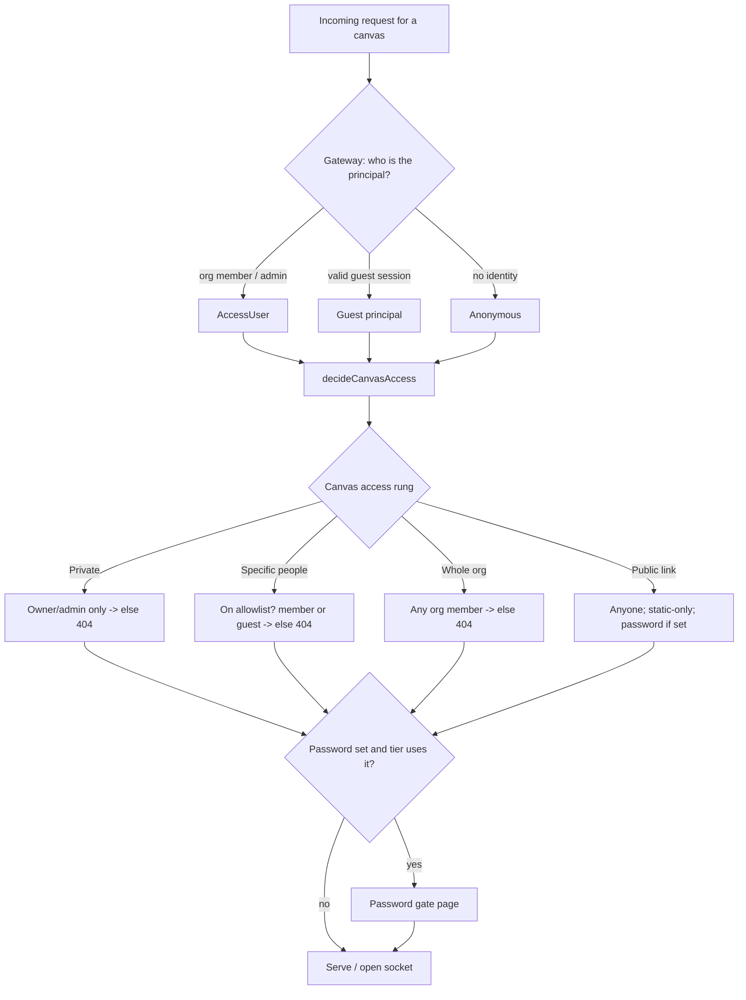

# Canvas sharing: access ladder, guest invites, and public links

## Summary

Replace today's binary owner-only / shared toggle with a per-canvas **access ladder** — Private → Specific people → Whole org → Public link. The core new capability is sharing a single canvas with a *named outsider* via email invite, backed by a new lightweight **guest identity**; the same allowlist mechanism also restricts a canvas to specific people (internal members or external guests). "Public link" is a guarded edge — static-only and only available to accounts an admin has blessed. Invited guests get the canvas's KV, files, and realtime primitives but not AI unless the owner opts a canvas in with a spend cap.

## Problem Frame

The org boundary is canvas-drop's defining trust assumption: every request is authenticated through the org-auth mode, which "deletes whole problem classes — spam, anonymous abuse, bots, public threat models" (BUILD_BRIEF §4.2). That assumption is also a wall. When the work is genuinely cross-org — showing a working prototype to a partner, a client, a collaborator who has no org account — there is no path short of giving them an org seat. The owner falls back to screenshots, screen-shares, or "trust me, it works," which is exactly the explanation-meeting tax the product set out to remove (§6, "share a working interface, not a static mockup").

The brief anticipated this: §12 lists "Share-to-specific-people allowlist" and "Team/group visibility" as *later*, and D19 lists "external users, public/anonymous sharing" as *out of v1*. The need has now arrived, and the shape that matters is the controlled one — a specific, identifiable person let into a single canvas — not the open internet. Truly-public access is a rare last resort whose blast radius must stay contained.

## Key Decisions

- **One access ladder per canvas, replacing the binary toggle.** Private (owner only) → Specific people (named principals) → Whole org (today's "shared") → Public link. A single control the owner sets per canvas; password and expiry are modifiers layered on top, not rungs.
- **Named outsiders enter via email-invited guest identity, not hand-out password links.** The owner enters an email; the app sends a magic sign-in link; the recipient becomes a named guest principal scoped to only the canvas(es) they were invited to. Chosen over the cheaper password-link approach because it yields a real per-person allowlist, individual revocation, and audit attribution — worth the new email infrastructure.
- **Guest is a fourth principal kind in the auth context.** Alongside proxy / oidc / dev, a guest is authenticated by a magic-link-issued session and is never treated as an org member — it can reach a canvas only if explicitly on that canvas's allowlist. This amends the §12.0 invariant set.
- **Invited guests get KV, files, and realtime; AI is off by default.** A named, revocable, attributable guest is trusted like a shared org viewer for bounded storage/compute primitives. AI is the metered-$ surface and stays off for guests unless the owner opts that canvas in with a cap. Public (anonymous) links are static-only — no primitives at all.
- **Public links are admin-gated per account.** The "Public link" rung is offered only to accounts an admin has granted the capability. Public is the rare last resort, kept narrow on purpose.
- **External access is an app-gated-auth-mode feature.** Guests and public links work in `oidc` / `dev` mode, where the app owns the gate. In `proxy` mode the upstream IAP authenticates every request before the app sees it, so an outsider is blocked upstream — supporting them there requires an operator-configured proxy carve-out, which is documented, not built.
- **Email sending becomes a driver behind an interface.** Like DB / storage / auth, email is config-selected: a real transport (SMTP / provider) in production, a dev driver that logs the link to the console for zero-setup localhost. No scattered transport code.

## Actors

- A1. **Owner** — the org member who created the canvas; sets its access rung, invites guests, opts a canvas into guest-AI, manages revocation/expiry.
- A2. **Org member (non-owner)** — reaches a canvas at the Whole-org rung, or when individually placed on a Specific-people allowlist.
- A3. **Invited guest** — a named outsider (by email) with a magic-link session, scoped to only the canvas(es) they were invited to; not an org member.
- A4. **Anonymous public visitor** — anyone holding a public link; no identity, static content only.
- A5. **Admin** — grants/revokes the per-account capability to publish public links; sees guest/public activity in the audit log.

## Access model

The access decision stays a pure, per-request decision table (no cached grants — revoke/expiry honored on the next request), extended for the new principal kinds and rungs.

## Requirements

### Access ladder

- R1. Each canvas has exactly one access rung: `private` (owner only), `specific_people`, `whole_org`, or `public_link`. `private` is the default for every new canvas.
- R2. The owner sets the rung from canvas settings. Changing the rung takes effect on the next request — no stale grants — and drops any live realtime sockets that the new rung no longer permits.
- R3. The owner (and admin) always reaches their own canvas regardless of rung.
- R4. Password and expiry are modifiers orthogonal to the rung. A canvas may carry an optional password and/or an optional share-expiry; both are evaluated after the rung grants access.
- R5. Sharing requires the canvas to be in a Published state (consistent with the existing "sharing requires Published" rule); leaving Published reverts the rung toward Private as it does today for the shared toggle.

### Specific-people allowlist

- R6. The `specific_people` rung carries an allowlist of principals. A principal is either an org member or an invited guest (by email).
- R7. The owner can add and remove allowlist entries at any time. Removing an entry revokes that principal's access on the next request and drops their live sockets.
- R8. An org member on the allowlist reaches the canvas with their normal org identity (no email invite needed). An external email on the allowlist is handled through the guest-invite flow (R9–R13).
- R9. The allowlist is the unifying mechanism for both narrowing (a subset of the org) and external sharing (named outsiders) — there is no separate "share with one person" surface.

### Guest identity and email invites

- R10. Inviting an external email creates a pending guest invite for that canvas and sends a magic sign-in link to that address.
- R11. Following a valid magic link establishes a guest session: a guest principal scoped to only the canvas(es) the email has been invited to. A guest is never treated as an org member and cannot enumerate, list, or reach any canvas it was not invited to.
- R12. Guest invites carry an optional per-invite expiry. After expiry, the magic link no longer establishes a session and an existing guest session for that canvas is no longer honored.
- R13. The owner sees each invited guest as a named allowlist entry (by email) with its state (pending / active / expired) and can revoke it individually; revocation invalidates the guest's session for that canvas on the next request and drops live sockets.
- R14. `me()` returns the guest's identity (their email) for an invited-guest viewer, and returns no identity for an anonymous public visitor.

### Primitives and enforcement

- R15. For an invited-guest viewer, the canvas's KV, files, and realtime primitives are available and attributed to that guest, counting against the canvas/org quotas, exactly as for a shared org viewer.
- R16. The AI primitive is unavailable to invited-guest viewers by default. The owner may opt an individual canvas into guest-AI, which carries a per-canvas spend cap; beyond the cap, AI calls from guests are refused.
- R17. For a `public_link` (anonymous) viewer, only static file serving is available — KV, file writes, realtime, and AI are all unavailable.
- R18. All guest- and public-attributable primitive use and access events are recorded in the audit log with the acting principal (guest email, or anonymous-via-public-link).

### Public links (admin-gated)

- R19. The `public_link` rung is selectable only by an owner whose account holds the admin-granted "publish public" capability. For accounts without it, the rung is unavailable in settings.
- R20. An admin can grant and revoke the publish-public capability per account. Revoking it returns any of that account's `public_link` canvases to a non-public rung (Private unless otherwise set) on the next request.
- R21. A `public_link` canvas may carry an optional password and/or expiry (R4) as additional locks.

### Auth-mode behavior

- R22. Guest and public access function in `oidc` and `dev` auth modes, where the app owns the gate. In `proxy` mode, external access requires an operator-configured upstream carve-out; absent that, guest/public rungs are documented as non-functional and the relevant UI communicates the constraint rather than silently failing.

### Spec amendments

- R23. BUILD_BRIEF D1, D4, D19, and the §12.0 invariant set are amended to admit invited-guest and admin-gated public access under the constraints above. The amendments preserve the hard invariant that a canvas is reachable only by its owner/admin, an allowed org member, an invited guest on its allowlist, or — when public and admin-permitted — an anonymous visitor to a static canvas; everything else still 404s.

## Key Flows

- F1. Invite a partner to one canvas
  - **Trigger:** Owner (A1) sets a Published canvas to Specific people and adds an external email.
  - **Steps:** App creates a pending guest invite and emails a magic link; partner (A3) clicks it; app establishes a guest session scoped to that canvas; partner uses the canvas including KV/files/realtime (not AI).
  - **Outcome:** Partner has working access to exactly one canvas, visible to the owner as a named, revocable allowlist entry.
  - **Covered by:** R6, R10, R11, R14, R15, R16.

- F2. Restrict a canvas to a few internal people
  - **Trigger:** Owner sets a canvas to Specific people and adds org members (not the whole org).
  - **Steps:** Listed members (A2) reach it with their org identity; everyone else 404s.
  - **Outcome:** A canvas narrower than Whole-org without any email/guest machinery.
  - **Covered by:** R6, R7, R8.

- F3. Revoke access
  - **Trigger:** Owner removes an allowlist entry, sets an expiry that passes, or changes the rung; or an admin revokes an account's publish-public capability.
  - **Steps:** Next request from the now-disallowed principal is denied; any live realtime socket is dropped immediately.
  - **Outcome:** Access dies on the next request with no stale grant.
  - **Covered by:** R2, R7, R12, R13, R20.

- F4. Publish a public link
  - **Trigger:** An admin-blessed owner (A1) sets a Published canvas to Public link.
  - **Steps:** App exposes the canvas as static-only to anonymous visitors (A4); optional password/expiry apply; primitives are off.
  - **Outcome:** Anyone with the link sees a static canvas; org spend and storage are never reachable from it.
  - **Covered by:** R17, R19, R21.

## Acceptance Examples

- AE1. **Covers R11.** Given a guest invited only to canvas X, when that guest requests canvas Y (not on Y's allowlist), then Y returns 404 — the guest cannot learn Y exists.
- AE2. **Covers R16.** Given a canvas not opted into guest-AI, when an invited guest's code calls the AI primitive, then the call is refused; when the owner opts the canvas in and the guest calls AI under the cap, it succeeds; when use exceeds the cap, further guest AI calls are refused.
- AE3. **Covers R17.** Given a public-link canvas, when an anonymous visitor's code calls KV/write-files/realtime/AI, then each is refused while static files continue to serve.
- AE4. **Covers R2, R13.** Given an invited guest with an open realtime socket, when the owner revokes that guest's allowlist entry, then the socket is dropped and the next HTTP request 404s.
- AE5. **Covers R19, R20.** Given an owner without the publish-public capability, when they open access settings, then the Public link rung is unavailable; when an admin grants the capability, it becomes selectable; when the admin later revokes it, the canvas reverts off public on the next request.
- AE6. **Covers R22.** Given `proxy` auth mode without a carve-out, when an owner views the guest/public rungs, then the UI communicates that external access is unavailable in this deployment rather than appearing to work.

## Scope Boundaries

### Deferred for later

- Team/group visibility (BUILD_BRIEF §12 #13) — the ladder is per-principal; group-as-principal can layer on later without reshaping the allowlist.
- Guest-AI as a default-on capability or fine-grained per-guest AI budgets — v1 is per-canvas opt-in with a single cap.
- An org-wide directory/search of shared canvases — unchanged from the brief's deferral; the opt-in gallery remains the only listing surface.

### Outside this product's identity

- Standing external accounts, guest self-signup, or any guest capability beyond the per-canvas invite — guests exist only as scoped invitees.
- Per-method/per-primitive ACLs for guests within a canvas — access stays trust-first within a canvas (a permitted viewer can use the canvas's permitted primitives); misuse is handled by audit and revocation, not a permission matrix.
- Primitives (including AI) for anonymous public visitors — public is static-only by design; this is the contained-blast-radius decision, not a gap to fill later.

## Dependencies / Assumptions

- Email transport must be configured for guest invites to send. Production uses a real transport; `dev` mode logs the link so localhost needs no setup. Without a configured transport in a non-dev deployment, the guest-invite flow cannot complete and settings should reflect that.
- Mark's production deployment runs `oidc` mode (subdomain, sqlite), so external access functions there without a proxy carve-out. The `proxy`-mode constraint (R22) is a documentation and OSS-completeness concern, not a blocker for the current prod.
- The existing per-request access decision, password gate (argon2id), share-expiry, and realtime socket-drop-on-revoke mechanisms are extended, not replaced.
- Dual-dialect (sqlite/postgres) schema parity holds for any new tables/columns (guest invites, allowlist entries, per-account capability, per-canvas guest-AI cap).

## Outstanding Questions

### Resolve before planning

- None blocking. The access model, principal set, primitive policy, and gating are pinned.

### Deferred to planning

- Exact storage shape for the allowlist, guest invites/sessions, the publish-public account capability, and the guest-AI cap (new tables vs. columns), kept in dual-dialect lockstep.
- Magic-link token format, lifetime, single-use vs. reusable-until-expiry, and session cookie scoping (subdomain vs. path mode), consistent with the existing session/password-gate cookie approach.
- Where the gateway makes the "let an unauthenticated/guest request proceed to canvas-level authorization" decision without weakening org-auth for everything else.
- Build sequencing within one branch: internal allowlist first (no trust-boundary change) → email-invited guests → public links.

## Sources / Research

- `BUILD_BRIEF.md` — D1/D4/D19 (trust boundary, visibility, out-of-v1), §4.2/§4.6 (trust posture), §12.0/§12.2 (access invariants), §12 feature list (#12 share-to-specific-people, #13 team/group — both "later").
- `apps/server/src/canvas/authorization.ts` — `decideCanvasAccess` pure decision table; the extension point for the new rungs and principal kinds.
- `apps/server/src/auth/` — gateway, factory, session, identity-mapping, proxy/oidc/dev strategies; where the guest principal and its session slot in.
- Recent `feat(share)` work (commit `eb982e0`, generic OG card for signed-out link unfurls in oidc mode) — confirms signed-out link handling already exists in oidc mode.
- No email/SMTP/mailer or magic-link code exists in the repo today (verified) — email transport is net-new.
- `docs/solutions/2026-06-13-auth-invariant-checklist.md` — required reading before implementing; this change amends §12 invariants and must run `/ce-code-review` before PR.
