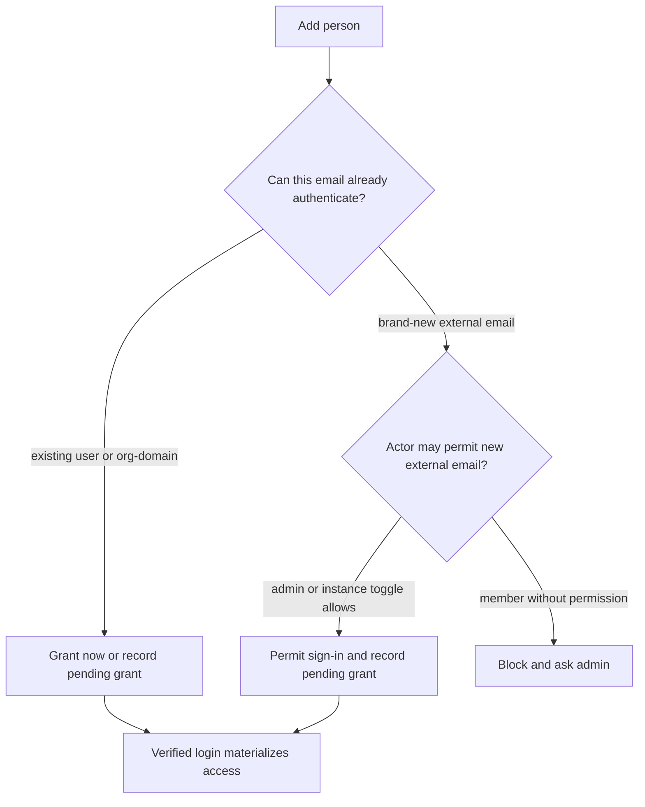

# Auth-delegated access governance cleanup

## Summary

Canvas Drop should use one person-access model: **Add person** everywhere, backed by auth-delegated invites and pending grants. Admin should get governance-first People and Canvases surfaces that make external access, pending sign-ins, public-link capability, ownership, and policy exceptions easy to review.

---

## Problem Frame

The product currently carries two person-invite models. The older canvas guest path creates app-owned magic-link guest sessions for one canvas; the newer invite path records a pending grant and lets the configured auth system verify the person before access materializes. That split leaks into product language: owners see both Add and Invite, admins have a separate add-email surface and user table, and email templates can make a private external share sound like joining the org.

The current access system is already moving toward auth-delegated invites. README copy describes no app-owned passwords or magic-link accounts, and the personal teams/invites plan made pending grants the core model. This cleanup finishes the product shape so access, email copy, admin review, and MCP behavior all tell the same story.

---

## Key Decisions

- **Retire magic-link guest sharing as a product mode.** New person-level access uses auth-delegated invites; legacy guest access is converted where possible.
- **Keep external invites gated.** Members can add existing users and org-domain people. Brand-new external emails require admin action unless the instance explicitly allows member external invites.
- **Make Admin governance-first.** Admin -> People and Admin -> Canvases optimize for reviewing access risk and policy exceptions before routine list management.
- **Default public links on at the instance level.** Public links are available while the instance setting is on, and admins can still revoke the capability for a specific user.
- **Use org language only for org access.** Email templates and UI copy distinguish "you were added to this canvas/team" from "you were invited to the org."

---

## Actors

- A1. **Owner**: a signed-in user who manages access to their own canvas or team.
- A2. **Org member**: a signed-in user whose verified email domain grants org membership.
- A3. **External person**: a signed-in no-org user, or an email pending first sign-in.
- A4. **Admin**: an operator-level user who governs People, Canvases, public-link capability, blocked users, and external sign-in permits.
- A5. **Agent**: an MCP caller acting for an owner through the per-account MCP surface. Admin-only cross-owner governance remains on dedicated admin-authenticated surfaces, not owner MCP tools.

---

## Requirements

**Access Model**

- R1. The dashboard, API, and MCP should expose one owner-facing **Add person** concept for person-level access.
- R2. New external person access should be auth-delegated: a pending grant is recorded only when the configured auth path can admit that email, the person signs in through configured auth, and the grant materializes only for the verified email.
- R3. An external email should not become an org member unless its verified email domain matches the configured org domains.
- R4. The magic-link guest path should stop being available for new sharing, including dashboard actions and MCP tools.
- R5. Existing magic-link guest access should migrate where possible into auth-delegated access: matched signed-in users get direct grants, unmatched emails become pending sign-in records, active guest sessions are revoked at cutover, and `/guest` magic-link consumption no longer remains a parallel live model.
- R6. Revocation, expiry, rung lowering, block status, and disabled canvas state should continue to take effect on the next request for external people.

**Owner Add Flow**

- R7. Canvas and team sharing should use one Add surface, not separate Add and Invite actions for the same person-access job.
- R8. The Add surface should autocomplete org members only; external people are added by exact email entry.
- R9. If a member tries to add a brand-new external email while member external invites are disabled, or while the configured proxy/IAP cannot admit that email, the product should hard-block with an admin/operator-action explanation rather than creating a request queue.
- R10. The Add flow should return and display deterministic states for granted now, pending sign-in, already added, already pending, blocked user/email, invalid email, policy-blocked, rate-limited, and mail-failed-best-effort. Pending external access should be visible in the relevant canvas/team people list with enough state for the owner to understand that access waits for first sign-in.

**Admin People**

- R11. Admin -> Users should become a unified **People** directory keyed by canonical lowercased email, including signed-in users, pending invited/permitted emails, and blocked people.
- R12. People rows should merge same-email backing records into one row and distinguish org member, external/no-org person, pending sign-in, admin, blocked, sign-in permit, and public-link capability states.
- R13. People filters should support governance review first: role/kind, pending status, blocked status, public-link capability, admin status, and search by email/name.
- R14. People rows should support usage and operations context without becoming surveillance: owned canvas count, last seen, invited-by/pending metadata where relevant, and drill-down into filtered Admin -> Canvases.
- R15. Invitation management belongs inside People, not in a separate invite-by-email island.

**Admin Canvases**

- R16. Admin -> Canvases should be a governance console for access exposure, not only a cross-owner content list.
- R17. Admin canvas filters should include access rung, public link, password, expiry, owner, org/personal/team context, status, listed/template state, and whether external people or pending invites are attached.
- R18. Admin canvas rows should make exposure legible at a glance: public, org/team, specific people, external people, password, expiry, disabled, deleted, or restored.
- R19. Admin drilldowns should connect People and Canvases in both directions: from a person to their canvases and from a canvas to the relevant people/access state.

**Public Links**

- R20. Public-link publishing should be controlled by an instance-level setting that defaults on. While it is on, eligible users can publish public links unless individually revoked; the rollout from the current per-user default-deny model should intentionally seed this allow-by-default state.
- R21. Admins should be able to globally disable public links and revoke the capability for an individual user. Global off denies the rung for everyone; individual revoke overrides global on for that user.
- R22. Public links remain static-only for non-owners: anonymous/public viewers get no backend primitives, identity, KV, files, AI, or realtime. Public-link filters and badges should make public exposure easy to audit.

**Email and Copy**

- R23. Seeded email templates should be updated so external/private canvas invites do not imply org membership.
- R24. Email template context should distinguish deployment/instance display name from true org name.
- R25. Existing staging template rows should be updated during rollout only when they still match a previous seeded default, or when no override exists. Customized rows should be preserved and surfaced with a reset/update affordance rather than overwritten silently.
- R26. UI copy should reserve "org member" for domain-derived org membership and use "external person" or "pending sign-in" for no-org access.

**Agent Parity**

- R27. Any changed owner-facing access action should have MCP parity, wrapping the same services and denials as the dashboard.
- R28. Legacy MCP guest tools should be retired or redirected to the auth-delegated Add person model.
- R29. Admin-only governance actions remain on dedicated admin surfaces/routes and should not leak into per-account owner MCP tools. If an admin agent surface is introduced later, it must wrap the same admin services with `requireAdmin` and audit events.

---

## Key Flows

- F1. **Owner adds an org member**
  - **Trigger:** Owner adds a known org member to a canvas or team.
  - **Actors:** A1, A2
  - **Steps:** Owner searches the member by autocomplete, selects them, and saves.
  - **Outcome:** Access is granted immediately and visible in the people list.
  - **Covers:** R1, R7, R8, R10

- F2. **Owner adds an external email**
  - **Trigger:** Owner types an exact external email.
  - **Actors:** A1, A3
  - **Steps:** If the email can already authenticate, the product records a pending grant and sends context-aware email. If the email is brand-new and member external invites are disabled, or the configured proxy/IAP cannot admit that email, the product blocks and points to admin/operator action.
  - **Outcome:** External access never bypasses configured auth or admin policy.
  - **Covers:** R2, R3, R9, R10, R23, R26

- F3. **Admin adds an external person**
  - **Trigger:** Admin adds a brand-new external email from People or while granting canvas/team access.
  - **Actors:** A3, A4
  - **Steps:** Admin permits the email, records any pending grant, and sends a courtesy email.
  - **Outcome:** The person appears as Pending sign-in until first verified login.
  - **Covers:** R11, R12, R15

- F4. **External person signs in**
  - **Trigger:** Pending person signs in through configured auth.
  - **Actors:** A3
  - **Steps:** The verified email is matched to pending grants.
  - **Outcome:** The pending person becomes a signed-in no-org user unless their domain grants org membership, and relevant grants materialize.
  - **Covers:** R2, R3, R10, R12

- F5. **Admin reviews exposure**
  - **Trigger:** Admin wants to audit who can see what.
  - **Actors:** A4
  - **Steps:** Admin filters People or Canvases by public-link capability, external access, pending sign-ins, access rung, owner, or status.
  - **Outcome:** Risky access states and policy exceptions are visible without reading individual canvas settings one by one.
  - **Covers:** R13, R14, R16, R17, R18, R19, R22

---

## Acceptance Examples

- AE1. **Covers R1, R7, R8.** Given an owner is adding people to a canvas, when they search by name, then org members appear in autocomplete and external emails do not appear unless typed exactly.
- AE2. **Covers R2, R3, R9.** Given member external invites are disabled, when a normal member types a brand-new Gmail address, then no sign-in permit or pending grant is created and the UI says an admin must add the person.
- AE3. **Covers R11, R12, R15.** Given an admin adds a brand-new Gmail address to a canvas, when the action succeeds, then the People directory shows that email as Pending sign-in and external/no-org.
- AE4. **Covers R2, R3, R10.** Given a pending Gmail invite exists, when that person signs in through configured auth, then access materializes for that account without making the person an org member.
- AE5. **Covers R5.** Given an existing active magic-link guest invite has an email, when the migration runs, then the equivalent auth-delegated grant exists, any active guest session is revoked, and the old guest link no longer remains the user-facing access mechanism.
- AE6. **Covers R16, R17, R18, R22.** Given an admin wants all public or externally shared canvases, when they filter Admin -> Canvases by public link or external people, then matching canvases show owner, access state, and relevant badges in the row.
- AE7. **Covers R23, R24, R26.** Given a Gmail user is invited to one private canvas on an org-named instance, when they receive email, then the copy says they were added to that canvas and does not imply they joined the org.
- AE8. **Covers R27, R28.** Given an MCP owner caller adds an external email, when the same policy would block that action in the dashboard, then MCP returns the same denial and does not create a legacy guest magic link.
- AE9. **Covers R20, R21, R22.** Given public links are globally disabled, when any owner tries to publish the public-link rung, then the action is denied. Given public links are globally enabled but the owner was individually revoked, the action is still denied. Given a public-link canvas is reachable anonymously, backend primitives return static-only denials.
- AE10. **Covers R9, R10.** Given an owner adds a person who is already pending, blocked, invalid, rate-limited, or blocked by auth-mode policy, when they submit the Add form, then the product returns the matching state without creating duplicate grants or unreachable pending access.

---

## Scope Boundaries

- No admin-review request queue for external invites; blocked members are told to ask an admin.
- No external/no-org autocomplete in the owner Add person picker.
- No new app-owned magic-link access mode.
- No per-org admin console or broader RBAC expansion.
- No redesign of the normal owner canvas list beyond what is necessary for access-state consistency.
- No full email-template WYSIWYG overhaul; the requirement is safer defaults and context-aware copy.

---

## Dependencies and Assumptions

- The existing auth-delegated invitation model remains the foundation from `docs/plans/2026-06-21-001-feat-personal-teams-and-invites-plan.md`.
- Existing `allowed_emails` and pending invitations remain the sign-in permit and pending grant mechanisms.
- Production deployments using proxy/IAP need operator guidance because the upstream auth layer must be able to admit external invited emails.
- The cleanup is auth-invariant-sensitive and should be reviewed against `docs/solutions/2026-06-13-auth-invariant-checklist.md`.
- Schema changes, if any, need dual-dialect migrations and parity tests.

---

## Sources and Current-State References

- `README.md` describes auth-delegated invites as the intended product model.
- `BUILD_BRIEF.md` still describes the legacy magic-link guest carve-out and the access invariants this cleanup changes.
- `docs/plans/2026-06-21-001-feat-personal-teams-and-invites-plan.md` defines pending grants, verified-login materialization, and admin-controlled new external email permits.
- `apps/server/src/db/repositories/guest.ts` and `apps/server/src/auth/guest-routes.ts` cover the legacy magic-link guest path.
- `apps/server/src/db/repositories/invitations.ts` covers pending auth-delegated grants.
- `apps/server/src/db/repositories/admin.ts` shows current Admin users/canvases filters and the gap between users and a fuller People directory.
- `apps/dashboard/src/components/AdminUserTable.tsx` shows the current signed-in-user-only admin table.
- `apps/dashboard/src/routes/canvas.share.tsx` contains the current share/access surface where Add and Invite language diverge.
