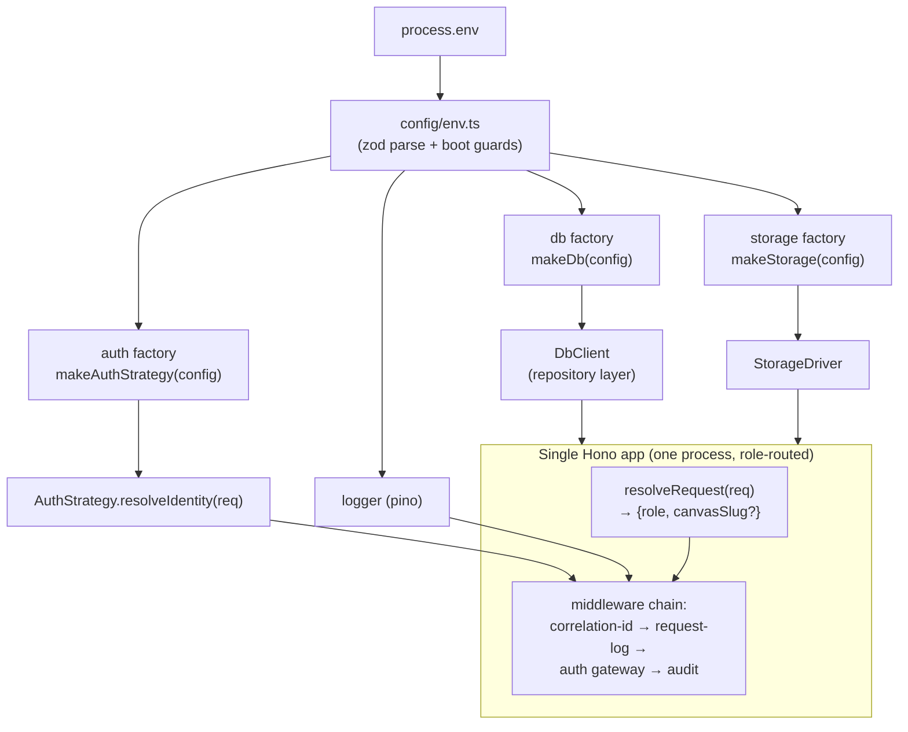

# feat: canvas-drop Foundation — config, abstractions, and auth gateway

## Summary

This is the first executable plan in the canvas-drop v1 program. It builds the **foundation layer** the entire product stands on: the monorepo, the zod-validated config surface, the four pluggable abstractions (database, storage, URL-mode, auth), structured logging, the audit log, and the auth gateway that enforces "login on every request" (the brief's invariant #1).

The success condition for this plan mirrors the brief's Weeks 1–2 result (§16): **`cp .env.example .env && npm run dev` yields a working, logged-in canvas-drop instance on localhost** (path mode, SQLite, local storage, `dev` auth) — with the same codebase able to boot in subdomain mode against Postgres + S3 + `proxy`/`oidc` auth purely by changing env. There are no canvases, deploys, or primitives yet; this plan makes the *platform* exist and proves every abstraction has at least two working drivers.

It deliberately stops before canvas hosting (area C) and the deploy pipeline (area D), which are the next plan.

---

## Problem Frame

canvas-drop is a deployment-agnostic, self-hostable platform (`BUILD_BRIEF.md` §1). Every higher-level feature — hosting, deploy, the five primitives, the dashboard — depends on a small set of foundational guarantees being correct and pluggable first:

- **Config is the contract.** Twelve-factor, zod-validated at boot, fail-loud on invalid combinations (D18, §8.1). Every downstream module reads typed config, never `process.env` directly.
- **Everything runs behind an interface** (D6, §4.7): database (SQLite ↔ Postgres, D10), storage (local ↔ S3, D17), URL mode (path ↔ subdomain, D2), auth mode (proxy ↔ oidc ↔ dev, D16). The same code serves a laptop and a corporate cloud.
- **The auth gateway is invariant-critical** (§12.0, §12.5). "Login on every request, no exceptions" and "no impersonation" live or die in this layer. It must be tiny, heavily tested, and re-derive identity per request.

Getting these wrong is expensive to retrofit. Dual-dialect portability rules and the CI matrix must exist from week one, not be bolted on later (Risk #2, §18).

### What this plan is NOT

- No canvas model, hosting, slug serving, or deploy pipeline (areas C, D — next plan).
- No platform primitives (KV, files, AI, realtime, identity `me()` endpoint) — areas F–J, R.
- No dashboard SPA, no admin panel UI (areas E, K). Admin *bootstrap* (env → `is_admin` flag) is in scope; the admin *panel* is not.
- No canvas-level authorization (owner-only / shared / password). The foundation authenticates a **user**; authorizing a user against a **canvas** arrives with hosting.

---

## Requirements Traceability

Carried forward from `BUILD_BRIEF.md`. Each maps to one or more implementation units (U-IDs).

| Source | Requirement | Units |
|--------|-------------|-------|
| D6, D9, §8 | Single Node/TS process; pnpm workspaces (`apps/server`, `apps/dashboard`, `packages/sdk`, `packages/shared`); Hono server | U1, U11 |
| D18, §8.1 | Zod-validated env config; fail-loud boot; `.env.example`; `cp .env.example && npm run dev` works | U2, U11 |
| D10, §10 | DB factory SQLite/Postgres behind one Drizzle mental model; dialect-portable schema; dual migrations | U4 |
| D17, §6.5.7 | Storage abstraction: local-disk + S3-compatible drivers behind one interface | U5 |
| D2, §8.2, §9.1 | URL-mode router: `resolveRequest(req) → {role, canvasSlug?}`; path & subdomain | U6 |
| D16, §9.2, §12.5 | Auth modes `proxy | oidc | dev`; trust proxy via signed JWT (JWKS) or trusted-hop header; built-in OIDC fallback; dev stub | U7, U8, U9 |
| D1, §12.1.1 | Login on every request; email-domain allowlist enforced by the app in every mode | U7, U8, U9 |
| D15, §6.8 | Identity shape `{id, email, name, avatarUrl}`, versioned for later directory fields; identity→`users` mapping | U7 |
| D14, §6.10 | Admin bootstrap via `CANVAS_DROP_ADMIN_EMAILS` → `is_admin` | U7 |
| §9.2, §6.3.9 | App-managed sessions (HttpOnly Secure, 14-day rolling, revocation) for `oidc`/`dev`; none in `proxy` mode | U9 |
| §6.11.1, §12.1.8 | Append-only audit log: auth events, session/key lifecycle, admin actions | U10 |
| §6.11.4, §8.5 | Structured pino logging to stdout; correlation IDs; request middleware | U3 |
| §6.11.6 | `/healthz` endpoint | U11 |
| §8 (Testing), §6.12.5, Risk #2 | Vitest run against **both** dialects in CI; lint, typecheck, image-build readiness | U12 |
| §12.5 | Boot-time guard: `proxy` mode refuses to start without JWKS URL *or* trusted-proxy IPs; reject identity headers from untrusted hops | U2, U8 |

---

## High-Level Technical Design

### Layered abstractions — everything the app touches is a factory behind an interface



The contract: **no module outside `config/` reads `process.env`; no module outside a factory knows which driver is active.** Swapping SQLite↔Postgres, local↔S3, or proxy↔oidc↔dev is a config change, never a code change.

### Auth gateway — identity resolution per mode (invariant #1)

```mermaid
sequenceDiagram
  participant C as Client
  participant P as IAP / Proxy (proxy mode only)
  participant GW as Auth gateway middleware
  participant S as AuthStrategy (mode-specific)
  participant DB as users table
  participant AU as audit_log

  C->>P: request (proxy mode: already SSO-authenticated)
  P->>GW: forwards request + identity assertion
  Note over GW: oidc/dev mode: no proxy; app owns the session
  GW->>S: resolveIdentity(req)
  alt proxy mode
    S->>S: verify signed JWT vs JWKS (iss/aud/exp) — preferred
    S->>S: else read trusted-hop header (only from TRUSTED_PROXY_IPS)
  else oidc/dev mode
    S->>S: read + validate app session cookie (token_hash)
  end
  S-->>GW: ResolvedIdentity {sub, email, name?, avatar?} | null
  GW->>GW: enforce email-domain allowlist
  alt no identity OR domain rejected
    GW->>AU: record auth_denied
    GW-->>C: 401 / redirect to login
  else allowed
    GW->>DB: upsert identity → users row (+ admin bootstrap)
    GW->>AU: record auth_ok (first-seen / login)
    GW-->>C: proceed with c.set('user', ...)
  end
```

*Diagrams render authoritative design; prose governs where they disagree.*

### Dual-dialect schema strategy (the central data-layer decision — see KTD-1)

```
packages/shared/src/db/
  columns.ts        # shared column-shape helpers (id, timestamps, json) per dialect
  schema.pg.ts      # pgTable definitions
  schema.sqlite.ts  # sqliteTable definitions (same columns, sqlite builders)
  types.ts          # shared inferred row types (the app codes against THESE)
  index.ts          # re-exports active schema based on dialect at runtime
```

Drizzle generates dialect-specific clients at **compile time** — `pgTable` and `sqliteTable` are distinct builders, so a single shared table object is impossible. The portability contract is upheld by (a) shared column helpers keeping the two schema files in lockstep, (b) a shared **inferred row type** the repository layer codes against, and (c) CI running the full suite on both dialects so drift fails the build immediately.

---

## Output Structure

Greenfield monorepo. Expected layout after this plan (foundation files only; later plans fill in hosting/primitives/dashboard):

```
canvas-drop/
├── package.json                 # pnpm workspace root, scripts (dev, build, test, lint)
├── pnpm-workspace.yaml
├── biome.json
├── tsconfig.base.json
├── .env.example                 # every config var (§8.1)
├── .github/workflows/ci.yml     # lint, typecheck, test × {sqlite, postgres}, build
├── packages/
│   ├── shared/                  # zod schemas, types, db schema, shared utils
│   │   └── src/
│   │       ├── config/env.ts    # zod env schema + boot guards
│   │       ├── db/{columns,schema.pg,schema.sqlite,types,index}.ts
│   │       └── index.ts
│   └── sdk/                     # placeholder package (built in a later plan)
└── apps/
    ├── server/
    │   └── src/
    │       ├── index.ts         # Hono app assembly, /healthz, boot
    │       ├── config/          # config consumption (re-exports shared)
    │       ├── db/factory.ts    # makeDb(config) → DbClient
    │       ├── db/repositories/ # users, sessions, audit
    │       ├── storage/{driver.ts,local.ts,s3.ts,factory.ts}
    │       ├── routing/resolve-request.ts
    │       ├── auth/{strategy.ts,dev.ts,proxy.ts,oidc.ts,factory.ts,gateway.ts}
    │       ├── audit/audit-log.ts
    │       └── log/{logger.ts,middleware.ts}
    └── dashboard/               # Vite/React placeholder (built in a later plan)
        └── index.html
```

The tree is a scope declaration, not a constraint — the implementer may adjust layout if a better one emerges. Per-unit `**Files:**` sections are authoritative.

---

## Key Technical Decisions

**KTD-1 — Dual-dialect via per-dialect schema modules + shared inferred types.**
Drizzle emits dialect-specific clients at compile time; `pgTable`/`sqliteTable` cannot be unified into one object (external research, June 2026). Decision: maintain `schema.pg.ts` and `schema.sqlite.ts` with identical column sets built from shared helpers in `columns.ts`; the app codes against shared **inferred row types** through a repository layer, never against a raw dialect table outside the factory. Two `drizzle-kit` configs (`drizzle/pg`, `drizzle/sqlite`) generate migrations per dialect. CI runs the suite on both (U12) so any drift fails immediately. *Rationale: honors D10/§10 portability while respecting Drizzle's actual compile-time model rather than the brief's simplified "one schema" phrasing.* (see origin: BUILD_BRIEF.md §10)

**KTD-2 — Auth as a strategy behind `resolveIdentity(req) → ResolvedIdentity | null`.**
`proxy`, `oidc`, and `dev` each implement one interface; the gateway middleware and every downstream module are mode-agnostic. Selected once at boot by the auth factory. *Rationale: keeps the invariant-critical surface tiny and uniformly testable (§12.0, Risk #7); adding a future mode never touches call sites.* (see origin: BUILD_BRIEF.md §9.2, D16)

**KTD-3 — Proxy-mode trust: signed JWT preferred, trusted-hop header as fallback, boot-guarded.**
Use `jose` (`createRemoteJWKSet` + `jwtVerify`) to verify the IAP's signed identity JWT — validate issuer, audience, expiry. If no JWKS configured, accept the configured identity header **only** from `CANVAS_DROP_TRUSTED_PROXY_IPS`. Boot refuses `proxy` mode with neither set (§12.5). Inbound identity headers from untrusted sources are stripped and logged. *Rationale: §12.5 is where invariant #1 lives — "only the proxy can assert identity." Cryptographic trust holds even when network boundaries are sloppy.* (see origin: BUILD_BRIEF.md §12.5)

**KTD-4 — OIDC mode uses `openid-client` v6 (functional API).**
v6 replaced the v5 class-based API with a functional one; exact call shapes are an execution-time detail (deferred per Planning Rule). The strategy stores `code_verifier` + `state` in a short-lived signed cookie across the redirect, then mints an app session on callback. *Rationale: `oidc` is the documented fallback for self-hosters without an IAP (D16, persona 5.8).* (see origin: BUILD_BRIEF.md D16)

**KTD-5 — Sessions only in `oidc`/`dev`; `proxy` mode is sessionless.**
`sessions` table holds `token_hash` (SHA-256 of a high-entropy token), 14-day rolling expiry, revocable. In `proxy` mode the IAP owns the session and identity is re-derived per request — no app cookie. *Rationale: honoring proxy-side logout instantly (§9.2) and keeping secrets hashed at rest (§12.1.3).* (see origin: BUILD_BRIEF.md §9.2, §6.3.9)

**KTD-6 — Single Hono app, role-routed by `resolveRequest`.**
One process resolves each request to a role (dashboard / auth / platform-api / canvas) via Host header (subdomain) or path prefix (path). The rest of the codebase never branches on URL mode. *Rationale: D9 single-process operability; splittable behind a proxy later without code changes (§9.1).* (see origin: BUILD_BRIEF.md §9.1)

**KTD-7 — Config is the only `process.env` reader; zod parse + cross-field boot guards.**
One `env.ts` parses and validates; invalid combinations fail loud with a precise message (subdomain mode + localhost base URL; proxy mode without JWKS *and* without trusted IPs; proxy JWT without audience; multi-user path mode without the unsafe opt-in). *Rationale: D18 twelve-factor; §8.1 fail-loud boot.* (see origin: BUILD_BRIEF.md §8.1)

**KTD-8 — pino structured JSON to stdout + correlation IDs; no app-side log files.**
Hono middleware logs every request (method, path, status, duration), attaches a per-request child logger, reads/generates `X-Correlation-ID`. `LOG_FORMAT=pretty|json`. *Rationale: §8.5 aggregator-agnostic; zero app-side config to be useful.* (see origin: BUILD_BRIEF.md §8.5)

---

## Implementation Units

Grouped into four phases. U-IDs are stable; dependencies cite U-IDs.

### Phase 1 — Repo & config foundation

### U1. Monorepo scaffold + tooling

- **Goal:** A working pnpm-workspace monorepo with shared tooling, so every later unit lands in a consistent, type-checked, linted project.
- **Requirements:** D6, D9, §8 (repo shape).
- **Dependencies:** none.
- **Files:** `package.json`, `pnpm-workspace.yaml`, `biome.json`, `tsconfig.base.json`, `packages/shared/package.json`, `packages/shared/tsconfig.json`, `apps/server/package.json`, `apps/server/tsconfig.json`, `apps/dashboard/package.json` (placeholder), `packages/sdk/package.json` (placeholder), `vitest.config.ts` (root), `.nvmrc` (Node 24).
- **Approach:** pnpm workspaces with `apps/*` and `packages/*`. Biome for lint+format (one tool). Root scripts: `dev`, `build`, `test`, `test:sqlite`, `test:pg`, `lint`, `typecheck`. `packages/shared` is the cross-cutting types/schema package depended on by server, dashboard, and sdk. Pin Node 24 LTS via `.nvmrc` + `engines`. Dashboard and sdk are minimal placeholders so the workspace resolves; they're filled in later plans.
- **Patterns to follow:** standard pnpm-workspace + Biome conventions; `tsconfig.base.json` with `paths` for workspace package resolution.
- **Test scenarios:**
  - `pnpm install` resolves the workspace graph with no errors.
  - `pnpm typecheck` passes on the empty scaffold.
  - `pnpm lint` passes on the scaffold.
  - Importing a symbol from `@canvas-drop/shared` inside `apps/server` resolves and type-checks.
- **Verification:** `pnpm install && pnpm typecheck && pnpm lint` all succeed from a clean clone.

### U2. Zod env config loader + boot guards

- **Goal:** A single typed config object parsed and validated from env at boot, with fail-loud cross-field guards — the contract every other module reads.
- **Requirements:** D18, §8.1, §12.5 (boot guard).
- **Dependencies:** U1.
- **Files:** `packages/shared/src/config/env.ts`, `packages/shared/src/config/env.test.ts`, `.env.example`.
- **Approach:** One zod schema covering every var in §8.1 (core, database, storage, auth, AI, logging — AI vars parsed/validated even though the AI primitive ships later, so config stays whole). Coerce/transform into a typed `Config`. Cross-field `superRefine` guards: (a) subdomain mode requires a non-localhost base URL; (b) `proxy` mode requires JWKS URL *or* trusted-proxy IPs; (c) proxy JWT verification requires an audience; (d) multi-user path mode requires `CANVAS_DROP_ALLOW_MULTI_USER_PATH_MODE=true`. Defaults wired so the empty `.env` resolves to `path + sqlite + local + dev`. Export a single `loadConfig()` that throws a precise, human-readable error listing every failing field. `.env.example` documents every var with comments mirroring §8.1.
- **Technical design (directional):** `loadConfig()` → `EnvSchema.safeParse(process.env)` → on failure, format issues into a multi-line message and `process.exit(1)` at the app entry (the function itself throws; the entrypoint decides to exit). Not implementation-final.
- **Patterns to follow:** zod v4 `superRefine` for cross-field validation; `@hono/zod-validator` is for routes, not this.
- **Test scenarios:**
  - Empty env (only required `SESSION_SECRET`/`ADMIN_EMAILS` defaults supplied) parses to `path + sqlite + local + dev`.
  - subdomain mode + `http://localhost:3000` base URL → boot error naming the base-URL field.
  - `proxy` mode with neither JWKS URL nor trusted-proxy IPs → boot error citing §12.5 guard.
  - `proxy` mode with JWKS URL but no audience → boot error naming the audience field.
  - Multi-user path mode (path mode + a flag implying multi-user) without `ALLOW_MULTI_USER_PATH_MODE=true` → boot error.
  - Valid Postgres + S3 + proxy(JWKS+audience) config parses cleanly.
  - Error message lists *all* failing fields at once, not just the first.
- **Verification:** config unit tests pass; a deliberately broken `.env` makes the server refuse to start with a readable message.

### U3. Structured logging (pino) + correlation IDs

- **Goal:** Aggregator-agnostic structured logging with per-request correlation IDs and an automatic request-logging middleware.
- **Requirements:** §6.11.4, §8.5.
- **Dependencies:** U1, U2 (reads `LOG_LEVEL`/`LOG_FORMAT`).
- **Files:** `apps/server/src/log/logger.ts`, `apps/server/src/log/middleware.ts`, `apps/server/src/log/middleware.test.ts`.
- **Approach:** Root pino logger configured from `LOG_LEVEL` + `LOG_FORMAT` (`pretty` via `pino-pretty` in dev, `json` otherwise). Hono middleware: read inbound `X-Correlation-ID`/`X-Request-Id` or generate one (UUIDv7), create a child logger bound with the correlation id, store it on context (`c.set('log', ...)`), log request start/end with method, path, status, duration. Exclude `/healthz` and metrics paths from request logging by default. Emit the correlation id on the response header too.
- **Patterns to follow:** pino child loggers; Hono middleware signature.
- **Test scenarios:**
  - Inbound `X-Correlation-ID` is propagated to the child logger and echoed on the response.
  - Missing correlation header → one is generated and attached.
  - A request emits a completion log line containing method, path, status, and a numeric duration.
  - `/healthz` requests produce no request-log line.
  - `LOG_FORMAT=json` emits parseable JSON lines; `pretty` does not throw.
- **Verification:** middleware test asserts log shape and header propagation; manual `npm run dev` shows readable pretty logs with correlation ids.

### Phase 2 — Data & storage abstractions

### U4. DB factory + dual-dialect schema + migrations

- **Goal:** A database client built by a factory from config, backed by one logical schema expressed in both SQLite and Postgres, with per-dialect migrations and a thin repository layer the app codes against.
- **Requirements:** D10, §10, KTD-1.
- **Dependencies:** U1, U2.
- **Files:** `packages/shared/src/db/columns.ts`, `packages/shared/src/db/schema.pg.ts`, `packages/shared/src/db/schema.sqlite.ts`, `packages/shared/src/db/types.ts`, `packages/shared/src/db/index.ts`, `apps/server/src/db/factory.ts`, `apps/server/src/db/repositories/users.ts`, `apps/server/src/db/repositories/sessions.ts`, `drizzle.sqlite.config.ts`, `drizzle.pg.config.ts`, `apps/server/src/db/migrate.ts`, `packages/shared/src/db/schema.test.ts`, `apps/server/src/db/repositories/users.test.ts`.
- **Approach:** Foundation tables only — `users`, `sessions`, `settings`, and `audit_log` (per §10; the rest land with their features). Portability rules from §10: UUIDv7 text PKs (app-generated, no DB uuid type), JSON via Drizzle json-mode columns (`jsonb` on PG, TEXT-JSON on SQLite), timestamps as integer epoch ms, no PG-only types (text + zod instead of enums/arrays). `columns.ts` provides shared helpers (`textId()`, `epochMs()`, `jsonCol()`) implemented twice (one per dialect) so the two schema files stay identical in shape. `types.ts` exports shared inferred row types; repositories accept/return those types and are the only place that touches a dialect table. `makeDb(config)` selects `better-sqlite3` (WAL) or `node-postgres` driver and returns a typed `DbClient`. Two drizzle-kit configs generate `drizzle/sqlite/*` and `drizzle/pg/*` migrations. `migrate.ts` applies the right set based on `CANVAS_DROP_DB`.
- **Patterns to follow:** Drizzle `$inferSelect`/`$inferInsert` for shared types; repository pattern wrapping queries.
- **Test scenarios:**
  - **Run against both dialects (U12 wires the matrix).** Each scenario below executes under sqlite and postgres:
  - Migrations apply cleanly to an empty database; re-running is idempotent.
  - Insert a user with a UUIDv7 id, read it back; `created_at` round-trips as integer epoch ms.
  - A JSON column (`settings.value`) stores and retrieves a nested object identically on both dialects.
  - Unique constraint on `users.email` rejects a duplicate insert.
  - `users` repository upsert-by-provider-sub returns the existing row on second call (no duplicate).
  - Session insert stores `token_hash` (not raw token); lookup by hash succeeds; revoked/expired sessions are excluded by the repository query.
  - Schema parity check: every column name/type present in `schema.pg.ts` is present in `schema.sqlite.ts` (a test that diffs the two table shapes).
- **Verification:** `pnpm test:sqlite` and `pnpm test:pg` both green for the db suite; `drizzle-kit generate` produces migrations for both dialects with no manual edits.

### U5. Storage factory (local + S3 drivers)

- **Goal:** A storage abstraction with two interchangeable drivers, selected by config.
- **Requirements:** D17, §6.5.7.
- **Dependencies:** U1, U2, U3.
- **Files:** `apps/server/src/storage/driver.ts` (interface), `apps/server/src/storage/local.ts`, `apps/server/src/storage/s3.ts`, `apps/server/src/storage/factory.ts`, `apps/server/src/storage/local.test.ts`, `apps/server/src/storage/s3.test.ts`.
- **Approach:** `StorageDriver` interface — `put(key, bytes, meta)`, `get(key)` (stream), `delete(key)`, `exists(key)`, `list(prefix)`. `LocalDriver` writes under `CANVAS_DROP_STORAGE_PATH` with path-safety (no traversal outside root). `S3Driver` wraps `@aws-sdk/client-s3` with a custom endpoint (AWS S3 / MinIO / R2 / any S3-compatible). `makeStorage(config)` returns the configured driver. This unit only proves the interface and both drivers with generic blobs — canvas asset semantics (MIME, versioning, caching) belong to area C.
- **Patterns to follow:** driver interface + factory; AWS SDK v3 client with `forcePathStyle` for MinIO.
- **Test scenarios:**
  - **Local driver:** put → get round-trips bytes exactly; delete removes; `exists` reflects state; `list(prefix)` returns matching keys.
  - **Local driver:** a key containing `../` cannot escape the storage root (path-traversal rejected).
  - **S3 driver (against a MinIO test container or mock):** put → get round-trips; delete; list-by-prefix.
  - Both drivers satisfy the same interface contract test (one shared test suite parameterized by driver).
  - Unknown/missing key `get` yields a typed not-found result, not an unhandled throw.
- **Verification:** storage suite green for both drivers (S3 against MinIO in CI per the optional profile, or a mocked client locally).

### Phase 3 — Request routing & auth gateway

### U6. URL-mode router (`resolveRequest`)

- **Goal:** A single function that classifies every request into a role (and canvas slug when applicable), so no other module branches on URL mode.
- **Requirements:** D2, §8.2, §9.1.
- **Dependencies:** U1, U2.
- **Files:** `apps/server/src/routing/resolve-request.ts`, `apps/server/src/routing/resolve-request.test.ts`.
- **Approach:** `resolveRequest(req, config) → { role: 'dashboard' | 'auth' | 'platform-api' | 'canvas', canvasSlug?: string }`. Subdomain mode: parse `Host` against the base domain — `{slug}.base` → canvas; bare `base` → dashboard/auth/platform-api by path prefix. Path mode: single host — `/c/{slug}/...` → canvas; `/api/...` → dashboard mgmt; `/auth/...` → auth; `/v1/c/{slug}/...` → platform-api. Pure function, no I/O. Canvas resolution (slug → DB row) is **not** here — this only classifies and extracts the slug string.
- **Technical design (directional):** role precedence and slug extraction differ per mode; encapsulate both in one switch on `config.urlMode`. Directional, not final.
- **Patterns to follow:** pure resolver returning a discriminated union.
- **Test scenarios:**
  - **Subdomain mode:** `quiet-otter-x7k2.canvases.example.com/index.html` → `{role:'canvas', slug:'quiet-otter-x7k2'}`.
  - **Subdomain mode:** `canvases.example.com/api/canvases` → `{role:'dashboard'}` (or platform per prefix), no slug.
  - **Subdomain mode:** `canvases.example.com/v1/c/abc/kv/x` → `{role:'platform-api', slug:'abc'}`.
  - **Path mode:** `localhost:3000/c/abc/index.html` → `{role:'canvas', slug:'abc'}`.
  - **Path mode:** `localhost:3000/api/...` → dashboard; `/auth/...` → auth; `/v1/c/abc/...` → platform-api with slug.
  - Malformed host (e.g. unexpected multi-level subdomain) classifies safely (dashboard or explicit reject), never throws.
  - Slug-shaped segment is extracted verbatim without DB lookup.
- **Verification:** resolver unit tests cover both modes and all four roles.

### U7. Auth core — strategy interface, dev mode, identity→user, domain check, admin bootstrap

- **Goal:** The mode-agnostic auth gateway: resolve identity, enforce the email-domain allowlist, map identity to a `users` row, bootstrap admins — proven end-to-end with the zero-setup `dev` strategy.
- **Requirements:** D1, D15, D16 (dev), §9.2, §12.1.1, §6.8, §6.10 (admin bootstrap).
- **Dependencies:** U2, U3, U4, U6.
- **Files:** `apps/server/src/auth/strategy.ts` (interface + `ResolvedIdentity` type), `apps/server/src/auth/dev.ts`, `apps/server/src/auth/factory.ts`, `apps/server/src/auth/gateway.ts` (middleware), `apps/server/src/auth/identity-mapping.ts`, `apps/server/src/auth/gateway.test.ts`, `apps/server/src/auth/dev.test.ts`, `apps/server/src/auth/identity-mapping.test.ts`.
- **Approach:** `AuthStrategy { resolveIdentity(req): Promise<ResolvedIdentity | null> }`; `ResolvedIdentity = { sub, email, name?, avatarUrl? }` (shape versioned per D15). `DevStrategy` returns a fixed fake local user with an allowed-domain email, zero setup. `makeAuthStrategy(config)` selects the strategy at boot. The **gateway middleware** (mode-agnostic) calls `resolveIdentity`, enforces the email-domain allowlist on the resolved email (reject → 401/redirect + audit), then `identity-mapping` upserts the `users` row keyed on `provider_sub`, applies admin bootstrap (`email ∈ CANVAS_DROP_ADMIN_EMAILS` → `is_admin = true`), updates `last_seen_at`, and sets `c.set('user', userRow)`. Blocked users (`is_blocked`) are rejected.
- **Execution note:** Auth is invariant-critical (§12.0). Implement the gateway test-first — write the failing "unauthenticated request is rejected" and "wrong-domain email is rejected" tests before the middleware.
- **Patterns to follow:** KTD-2 strategy; repository from U4 for the user upsert.
- **Test scenarios:**
  - `dev` mode: a request with no credentials resolves to the fixed dev user and proceeds (zero setup).
  - Resolved email outside `CANVAS_DROP_ALLOWED_EMAIL_DOMAINS` → 401/redirect; an audit `auth_denied` is recorded (asserted in U10 once audit lands; here assert the 401).
  - First request for a new identity creates exactly one `users` row; a second request reuses it (upsert by `provider_sub`, no duplicate).
  - An email in `CANVAS_DROP_ADMIN_EMAILS` yields `is_admin = true`; a non-listed email yields `is_admin = false`.
  - A user flagged `is_blocked` is rejected even with a valid identity.
  - `last_seen_at` advances on a subsequent request.
  - Downstream handler can read the authenticated user from context.
- **Verification:** gateway + dev-mode + identity-mapping suites green; a `dev`-mode `npm run dev` lands every request as the logged-in dev user.

### U8. Auth — proxy mode (JWT/JWKS + trusted-hop header)

- **Goal:** The recommended production auth path: trust an upstream IAP via a verified signed JWT (preferred) or a trusted-hop identity header, with the §12.5 boot guard and header-spoofing defenses.
- **Requirements:** D16 (proxy), §9.2, §12.5.
- **Dependencies:** U2 (boot guard), U7 (gateway + mapping).
- **Files:** `apps/server/src/auth/proxy.ts`, `apps/server/src/auth/proxy.test.ts`, plus the proxy-mode boot guard assertions in `packages/shared/src/config/env.ts` (extends U2).
- **Approach:** `ProxyStrategy.resolveIdentity` has two trust paths. **(a) JWT (preferred):** `jose` `createRemoteJWKSet(JWKS_URL)` + `jwtVerify(token, jwks, { issuer, audience })`, validating exp/nbf/iat; map verified claims → `ResolvedIdentity` (email claim, name claim, `hd`/domain). **(b) Trusted header:** read `CANVAS_DROP_AUTH_PROXY_EMAIL_HEADER`/name header **only** when the request's immediate hop is in `CANVAS_DROP_TRUSTED_PROXY_IPS`; otherwise ignore and treat the header's presence from an untrusted source as a logged security event. The §12.5 boot guard (in U2's schema) already forbids `proxy` mode with neither JWKS nor trusted IPs. Inbound `X-Auth-*` identity headers arriving from outside the trust zone are stripped before the strategy runs.
- **Execution note:** invariant #1 lives here — test the spoofing-rejection paths first.
- **Patterns to follow:** `jose` `createRemoteJWKSet` + `jwtVerify` with issuer/audience (confirmed current API, June 2026); KTD-3.
- **Test scenarios:**
  - Valid signed JWT (correct iss/aud, unexpired) → resolves the claims' identity.
  - JWT with wrong audience → rejected (no identity).
  - JWT with wrong issuer → rejected.
  - Expired JWT → rejected.
  - JWT signed by a key absent from the JWKS → rejected.
  - **Header trust:** identity header from an IP inside `TRUSTED_PROXY_IPS` → accepted; identical header from an IP *outside* the trusted set → ignored/rejected and logged (the core anti-impersonation test).
  - A client-supplied `X-Auth-Request-Email` reaching the app directly (no proxy hop) cannot authenticate.
  - Resolved proxy identity still passes through the U7 email-domain allowlist (out-of-domain JWT email is rejected).
  - **Boot guard (extends U2):** `proxy` mode with neither JWKS nor trusted IPs fails to start.
- **Verification:** proxy suite green including all spoofing-rejection cases; boot guard test confirms refuse-to-start.

### U9. Auth — built-in OIDC + app sessions

- **Goal:** The self-hoster fallback: built-in OIDC login (no IAP required) plus the app-managed session used by both `oidc` and `dev`-with-session flows.
- **Requirements:** D16 (oidc), §9.2, §6.3.9, KTD-5.
- **Dependencies:** U2, U4 (sessions table), U7 (gateway + mapping).
- **Files:** `apps/server/src/auth/oidc.ts`, `apps/server/src/auth/session.ts` (cookie mint/verify/revoke), `apps/server/src/auth/routes.ts` (`/auth/login`, `/auth/callback`, `/auth/logout`), `apps/server/src/auth/oidc.test.ts`, `apps/server/src/auth/session.test.ts`.
- **Approach:** `OidcStrategy` uses `openid-client` v6 (functional API — exact calls deferred to implementation, KTD-4). `/auth/login` builds the authorization URL, stashes `state` + `code_verifier` (PKCE) in a short-lived signed cookie; `/auth/callback` exchanges the code, validates state, derives `ResolvedIdentity`, runs the U7 domain check + user upsert, then mints an app session. **Session service:** generate a high-entropy token, store `SHA-256(token)` in `sessions` (14-day rolling expiry), set `__canvasdrop_session` cookie (HttpOnly, Secure in prod, SameSite=Lax; subdomain mode `Domain=.base`, path mode host-only). `resolveIdentity` for `oidc`/`dev`-session reads the cookie, hashes, looks up a live session, returns the bound identity. `/auth/logout` revokes the session row and clears the cookie. Rolling refresh extends expiry on use.
- **Patterns to follow:** `openid-client` v6 functional flow with PKCE; hashed-token sessions (§12.1.3).
- **Test scenarios:**
  - Session: mint → cookie set with HttpOnly + SameSite=Lax; stored value is the hash, never the raw token.
  - Session: valid cookie resolves to the bound user; tampered/garbage cookie → no identity.
  - Session: revoked session row → cookie no longer authenticates (logout works).
  - Session: expired session (past `expires_at`) → rejected; a use within the window rolls the expiry forward.
  - Cookie `Domain` is `.base` in subdomain mode and host-only in path mode.
  - OIDC callback with a mismatched `state` → rejected (CSRF defense).
  - OIDC callback success runs the email-domain check and creates/reuses the user (reuses U7 mapping).
  - OIDC-resolved email outside the allowlist → login rejected.
- **Verification:** session + oidc suites green; an `oidc`-mode boot can complete a login→session→logout loop against a test OIDC provider (or a mocked issuer).

### Phase 4 — Audit, integration & CI

### U10. Audit log (append-only) + auth-event wiring

- **Goal:** An append-only audit trail capturing the auth and session lifecycle events the foundation produces.
- **Requirements:** §6.11.1, §12.1.8.
- **Dependencies:** U4 (audit_log table), U7/U8/U9 (events to record).
- **Files:** `apps/server/src/audit/audit-log.ts`, `apps/server/src/db/repositories/audit.ts`, `apps/server/src/audit/audit-log.test.ts`.
- **Approach:** `recordAudit({ actorId?, action, targetType?, targetId?, meta?, ip })` appends a row (`audit_log`, §10). Append-only by convention; document that Postgres deployments may additionally `REVOKE UPDATE/DELETE`. Wire the foundation's events: `auth_ok` (first-seen/login), `auth_denied` (no identity / domain-rejected / blocked user), `session_create`, `session_revoke`, `admin_bootstrap`. Writes are best-effort and must never block or fail the request path (log-and-continue on audit write failure).
- **Patterns to follow:** repository insert from U4; correlation id from U3 carried into `meta`.
- **Test scenarios:**
  - `recordAudit` appends a row with actor, action, ip, and epoch-ms timestamp (run on both dialects).
  - A domain-rejected request (from U7) produces an `auth_denied` audit row with the rejected email in `meta`.
  - A successful first-seen login produces an `auth_ok` row; admin bootstrap produces `admin_bootstrap`.
  - Session logout produces `session_revoke`.
  - An audit write failure is swallowed (logged) and does not fail the originating request.
  - Correlation id from the request is present in the audit `meta`.
- **Verification:** audit suite green on both dialects; auth flows emit the expected rows.

### U11. App assembly — Hono wiring, `/healthz`, dev bootstrap

- **Goal:** Tie every foundation piece into one runnable Hono app so `npm run dev` produces a logged-in instance, and `/healthz` answers for uptime checks.
- **Requirements:** §9.1, §6.11.6, §16 (Weeks 1–2 result).
- **Dependencies:** U2–U10.
- **Files:** `apps/server/src/index.ts`, `apps/server/src/app.ts` (composable app builder), `apps/server/src/health.ts`, `apps/server/src/app.test.ts`, root `package.json` `dev` script, `.env.example` confirmed working.
- **Approach:** `buildApp(config, deps)` composes the middleware chain (correlation-id → request-log → auth gateway → audit context) and mounts `/healthz`, `/auth/*` (U9), and placeholder role routing via `resolveRequest` (U6) returning honest 404/"not built yet" for canvas/platform roles (those arrive in the next plan). `index.ts` = `loadConfig()` → on failure print the precise message and exit(1) → `makeDb`/`makeStorage`/`makeAuthStrategy` → run migrations (dev convenience) → `buildApp` → serve. `/healthz` returns `{ status, db: 'ok', version }` after a cheap DB ping. The `dev` script runs the server with `LOG_FORMAT=pretty` and the zero-config defaults.
- **Test scenarios:**
  - `GET /healthz` returns 200 with `db: 'ok'` when the database is reachable.
  - `/healthz` returns a degraded status (non-200) when the DB ping fails.
  - Booting with an invalid config exits non-zero with the precise U2 message (integration-level).
  - In `dev` mode, a request to a dashboard route resolves as the logged-in dev user (gateway wired correctly).
  - A canvas/platform role route returns an honest 404/not-implemented (no crash) — confirms routing is wired ahead of the hosting plan.
  - Boot wires the configured drivers: switching `CANVAS_DROP_DB`/`STORAGE`/`AUTH_MODE` via env changes the active driver with no code change (smoke test across at least sqlite+dev and a mocked postgres+proxy).
- **Verification:** `cp .env.example .env && npm run dev` serves a logged-in localhost instance (path + sqlite + local + dev); `/healthz` is green. **This is the plan's success condition.**

### U12. CI matrix — lint, typecheck, dual-dialect tests, build

- **Goal:** CI that enforces dual-dialect correctness and repo hygiene from week one, so portability drift fails the build immediately (Risk #2).
- **Requirements:** §8 (Testing), §6.12.5, Risk #2.
- **Dependencies:** U1–U11 (something to test); depends on U4 for the dialect split.
- **Files:** `.github/workflows/ci.yml`, `apps/server/vitest.config.ts` (dialect-parameterized), `docs/testing.md` (how the matrix selects a dialect).
- **Approach:** GitHub Actions: `lint` (Biome), `typecheck` (tsc), `test` as a matrix over `{sqlite, postgres}` — postgres job spins up a `postgres:16` service container and a `minio` service for the S3 driver suite; sqlite job runs in-process. `CANVAS_DROP_DB` (and storage env) select the target per matrix leg. A `build` job confirms the server builds and the Docker image build is at least invocable (full image hardening is the area-M plan; here it's a smoke build). Pinned `pnpm-lock.yaml`; dependency scanning step (e.g. `pnpm audit` / OSV) non-blocking warning in v1.
- **Test scenarios:** *(this unit is CI config; its "tests" are the pipeline behaviors)*
  - PR pipeline runs lint, typecheck, and both test legs; a SQLite-only-passing change that breaks Postgres fails the postgres leg.
  - The schema-parity test (U4) runs in both legs.
  - A lint or type error fails the pipeline before tests run.
  - The build job produces server artifacts and invokes the Docker build without error.
- **Verification:** a PR shows all matrix legs green; intentionally introducing a PG-incompatible column makes the postgres leg fail.

---

## Scope Boundaries

### In scope
Feature areas **A** (config + abstractions), **B** (auth gateway, all three modes), and the **L-start** slice (audit log, structured logging) plus the monorepo, `/healthz`, and the dual-dialect CI matrix. Outcome: a runnable, logged-in platform with every abstraction proven on two drivers.

### Deferred for later (next plans, per §16)
- **Area C — canvas hosting:** slug→canvas resolution, version model, asset streaming, MIME/caching, SPA fallback, password gate (Weeks 3–4).
- **Area D — deploy pipeline:** folder/ZIP/paste-HTML ingestion, deploy API, rollback (Weeks 3–4).
- **Area E — dashboard SPA** (Week 5); **F–J, R — primitives** (Week 6); **H — AI** (Week 7); **K, M — admin panel + OSS packaging hardening** (Week 8).

### Deferred to follow-up work (noticed while planning, intentionally out of this plan)
- Full Dockerfile + docker-compose hardening (distroless, non-root, compose with proxy/postgres/minio) — area M; U12 only smoke-builds the image.
- `.env.example` will list AI vars (U2 validates them) but the AI provider/proxy is area H.
- Sentry-compatible error reporting (env-gated, §6.11.5) — wire alongside logging in a later hardening pass.
- Metrics/latency histograms (§6.11.8) — area L continuous.

### Out of this product's identity (never, per D19)
Anonymous/public access, custom subdomain names, build pipelines, user-provided AI keys, multi-provider AI in v1.

---

## Risks & Dependencies

| Risk | Mitigation | Origin |
|------|-----------|--------|
| **Dual-dialect drift** (SQLite vs Postgres) — the top portability risk | Portable-schema rules (§10) enforced by KTD-1's shared column helpers + schema-parity test (U4) + CI matrix from week one (U12), not retrofitted | Risk #2 |
| **Auth gateway is the single point of failure / impersonation** | Tiny strategy surface (KTD-2), test-first on the invariant paths (U7/U8 execution notes), `jose` cryptographic JWT verification preferred over header trust, §12.5 boot guard prevents an unguarded "trust any header" config by construction | Risk #7, §12.5 |
| `openid-client` v6 functional API differs from prior class-based API | Treated as execution-time detail (KTD-4); `oidc` is a fallback path, not the blessed prod profile, so iteration cost is bounded | research finding |
| Library version volatility (brief dated June 2026, vs Jan-2026 knowledge) | Exact API signatures deferred to implementation per Planning Rule 3.6; `jose` JWKS API and Drizzle dual-dialect model verified current via external research | §1.4 |
| Storage S3 driver behavior varies across endpoints (AWS/MinIO/R2) | Shared interface contract test parameterized by driver (U5); MinIO service container in CI (U12) | D17 |

**External dependencies:** Node 24 LTS; pnpm; `hono`, `zod` v4, `drizzle-orm` + `drizzle-kit`, `better-sqlite3`, `pg`, `jose`, `openid-client` v6, `@aws-sdk/client-s3`, `pino`, `argon2` (password hashing arrives with the password gate in area C, but the dep may be added here), `vitest`, `biome`. A `postgres:16` and `minio` service for CI.

---

## Sources & Research

- **Drizzle dual-dialect (load-bearing → KTD-1):** Drizzle generates dialect-specific clients at compile time; `pgTable`/`sqliteTable` cannot be unified — the documented community pattern is shared schema files per dialect + separate `drizzle-kit` configs + app-level abstraction. [Drizzle config reference](https://orm.drizzle.team/kit-docs/config-reference) · [Supporting both PostgreSQL and SQLite (discussion #5269)](https://github.com/drizzle-team/drizzle-orm/discussions/5269) · [Same schema, different databases (discussion #3396)](https://github.com/drizzle-team/drizzle-orm/discussions/3396)
- **Proxy JWT verification (→ KTD-3, U8):** `jose` `createRemoteJWKSet` + `jwtVerify` with `{ issuer, audience }` is the current standard for verifying an IAP's signed identity JWT against a `jwks_uri`. [panva/jose](https://github.com/panva/jose) · [createRemoteJWKSet docs](https://github.com/panva/jose/blob/main/docs/jwks/remote/functions/createRemoteJWKSet.md) · [Cloudflare Access JWT validation](https://developers.cloudflare.com/cloudflare-one/access-controls/applications/http-apps/authorization-cookie/validating-json/)
- **OIDC fallback (→ KTD-4, U9):** `openid-client` v6 exposes a functional API for the authorization-code + PKCE flow; `code_verifier`/`state` are stashed in the user session across the redirect. [panva/openid-client](https://github.com/panva/openid-client) · [npm](https://www.npmjs.com/package/openid-client)
- **Origin:** `BUILD_BRIEF.md` (v1, locked 2026-06-13) — D1/D2/D6/D9/D10/D14/D15/D16/D17/D18; §8 (stack), §8.1 (config), §8.2 (URL layout), §9 (architecture), §10 (data model), §12 (security), §16 (build sequence).
