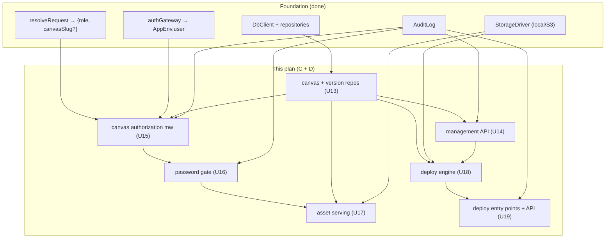
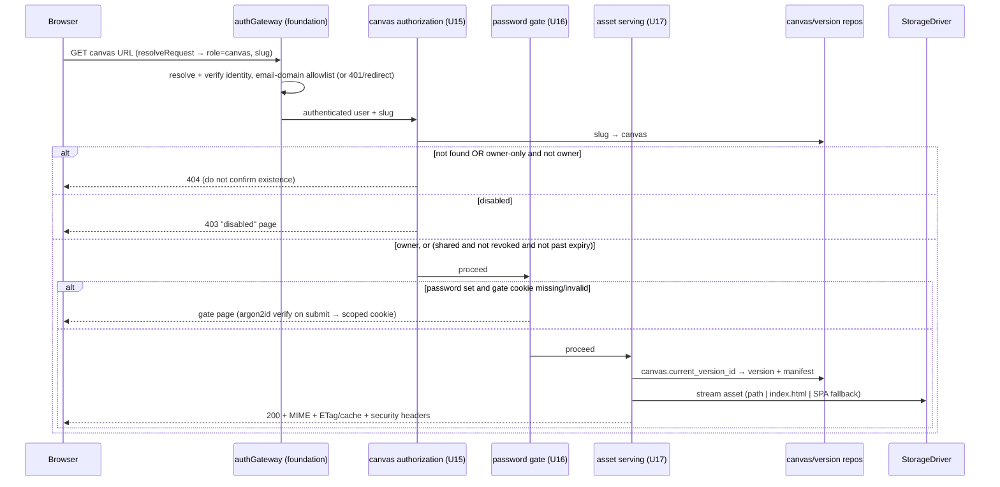
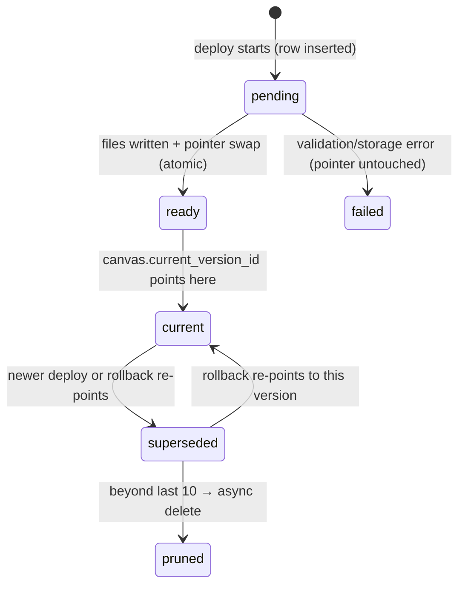

# feat: Canvas hosting + deploy pipeline (areas C + D)

## Summary

The foundation made the *platform* exist (config, DB, storage, auth gateway, audit). This plan makes **canvases** exist and become live, shareable URLs. It is the server-side half of the canvas story: a canvas can be created (random slug + once-shown API key), bytes can be deployed into it via three paths (folder/ZIP upload, paste-HTML, and the Bearer-key HTTP deploy API), each deploy produces an immutable version with one-click rollback, and the canvas serves its static content over the URL-mode router with the full §12 authorization model — owner-only by default, shared/expiring, optional argon2id password gate, and cross-canvas isolation.

The success condition mirrors the brief's Weeks 3–4 result (§16): **a canvas goes live via folder/ZIP, paste-HTML, and API deploy in path-mode dev and subdomain staging; rollback works; an owner-only canvas 404s to everyone else; a shared canvas opens for allowed members; revoking the share returns non-owners to 404 on the next request.**

It builds entirely on the foundation's abstractions — `DbClient` + the repository pattern, `StorageDriver`, `resolveRequest`, the `authGateway` / `AppEnv.user` context, and the audit log — and honors the dual-dialect rule and the canvas-authorization invariants (§12.0, §12.2). **The canvas-authorization and password-gate units are invariant-critical** and are planned test-first, per `docs/solutions/2026-06-13-auth-invariant-checklist.md`.

It deliberately stops before the dashboard SPA (area E), the five platform primitives (KV/files/AI/identity/realtime — areas F–R), and the admin panel (area K).

---

## Problem Frame

A canvas is "a folder of static files served at a secure, unguessable, org-internal URL" (`BUILD_BRIEF.md` §4.3). Today none of that exists — the foundation authenticates a *user* but has no concept of a *canvas*. To reach the brief's Weeks 3–4 milestone, four capabilities must land, in dependency order:

1. **Canvas lifecycle.** Create a canvas (generate a readable-random slug ≥64 bits entropy + a secret API key shown once, stored hashed); read it; change its settings (share toggle/expiry, password, SPA fallback, gallery opt-in); regenerate the slug (old URL dies) or key (old key dies); soft-delete (30-day purge). Hosting and deploy are meaningless without canvases to target — this is why the management API is in this plan even though its *dashboard UI* is area E.

2. **Immutable versioning.** Each deploy writes a new immutable version (per-canvas sequence number, source, file count, byte total, a path→{size,hash,mime} manifest); the canvas points at one current version; keep the last 10 and prune the rest asynchronously; rollback re-points at an older version. The pointer swap is atomic so a failed deploy never corrupts the live version (§9.5.3).

3. **Authenticated static serving (invariant-critical).** Resolve slug→canvas per URL mode, enforce the canvas-access policy on every request (owner-only 404s to others without confirming existence; shared **and** not-revoked **and** not-past-expiry; disabled/deleted states; optional password gate), then stream the current version's assets from the `StorageDriver` with correct MIME types, `index.html` + per-canvas SPA fallback, and `ETag`/cache headers. Cross-canvas isolation per mode (§12.2): subdomain mode is a real browser origin; path mode's reduced isolation is documented and opt-in (already gated by the foundation's `CANVAS_DROP_ALLOW_MULTI_USER_PATH_MODE`).

4. **The deploy pipeline.** Ingest a folder (multipart), a ZIP (zip-slip-safe, in-memory so it works with the S3 driver), or a pasted HTML string; validate (limits, blocked types, dotfile stripping, path traversal) with stable machine-readable error codes; stage the version write and swap the pointer atomically; expose the programmatic deploy API (`PUT /v1/canvases/:id/deploy`, Bearer secret key) plus version list, rollback, and deploy history.

### What this plan is NOT

- No dashboard SPA / UI (area E). This plan builds the **server endpoints** for create, settings, and the three deploy paths; the file-picker, drop-zone, paste textarea, and gallery browse are area E.
- No platform primitives (KV, files, AI, realtime, identity `me()`) — areas F–R. The canvas-facing platform API (`/v1/c/:slug/...`) is those plans; this plan owns canvas **content** serving and the **management/deploy** APIs only.
- No in-browser file manager or CodeMirror editor (v1.1).
- No admin panel (area K). Owner authorization is enforced here; an `is_admin` bypass is honored, but the admin UI and cross-user management are area K.
- No archive/clone (v1.1), malware scanning (later).

---

## Requirements Traceability

Carried forward from `BUILD_BRIEF.md`. Each maps to one or more implementation units (U-IDs continue from the foundation plan's U1–U12).

| Source | Requirement | Units |
|--------|-------------|-------|
| §10, D3 | `canvases` + `versions` tables (dialect-portable); repositories | U13 |
| §6.1.1–3, D3, §12.1.4 | Create canvas → readable-random slug ≥64 bits + secret API key shown once (hashed); regenerate slug (old dies); regenerate key (old dies) | U13, U14 |
| §6.1.14, OPEN-5 | Soft delete (30-day purge), `deleted_at`, `status` | U13, U14 |
| §6.1.17, §6.3.4/6/7/11 | Title/description; settings: shared toggle, share expiry, password, SPA fallback, gallery opt-in | U14 |
| §11.3 | Management API (same-origin, owner-authenticated): canvas CRUD, settings, slug/key regen, paste-HTML create | U14, U19 |
| D1, §9.2, §9.3, §12.0(3), §12.2 | Canvas authorization: owner-only 404s to others; shared+not-revoked+not-expired; disabled/deleted; cross-canvas isolation per mode | U15 |
| §6.3.5/6, D23 | Revoke share (instant → 404 next request); optional expiry (auto-revoke) | U15 |
| §6.3.7, §12.1.3 | Per-canvas password: argon2id, gate page, scoped cookie | U16 |
| §6.1.4–10, §13.5, §9.3.4 | URL routing per mode; static serving; MIME; `index.html` fallback; per-canvas SPA fallback; cache headers + ETags; atomic invalidation on deploy | U17 |
| D11, §6.1.11–13, §9.5.3 | Immutable versions, keep last 10, version metadata, atomic pointer swap, async prune | U13, U18 |
| §6.2.1–3, §6.1.18–19, §12.1.5 | Folder/ZIP/paste-HTML ingestion; zip-slip safe; limits (100MB/canvas, 25MB/file, 2000 files); blocked executables→plain text; dotfiles stripped | U18 |
| §6.2.6–10, §11.4, §9.5 | HTTP deploy API (`PUT /v1/canvases/:id/deploy`, Bearer key); machine-readable result + stable error codes; version list; rollback; deploy history | U19 |
| §12.1.8, §6.11.1 | Audit: canvas CRUD, key/slug regen, deploys, password attempts, share/revoke/expiry changes | U13–U19 (wired per unit) |
| §12.4 | Security headers on canvas responses (`X-Content-Type-Options: nosniff`, `Referrer-Policy`, `frame-ancestors 'none'`) | U17 |
| §13.1/3 | Asset TTFB P95 < 150 ms (local driver memory-cached); paste-HTML create < 2 s | U17, U18 (verification targets) |

---

## High-Level Technical Design

### Where this sits on the foundation



### Request flow — viewing a canvas (the invariant-critical path, §9.3)



### Deploy flow — atomic version creation (§9.5)

```mermaid
sequenceDiagram
  participant C as Client (UI route or Bearer-key API)
  participant EN as deploy engine (U18)
  participant VAL as validation
  participant ST as StorageDriver
  participant DB as repositories

  C->>EN: bytes (folder multipart | ZIP | paste-HTML) + canvas
  EN->>EN: ingest → in-memory {path: bytes} map (zip-slip-safe)
  EN->>VAL: limits, file count, blocked types, dotfiles, traversal
  alt invalid
    VAL-->>C: stable error code + message (no version written)
  else valid
    EN->>DB: insert pending version row (number = max+1)
    EN->>ST: write each file under versions/{versionId}/{path}; build manifest {path:{size,hash,mime}}
    EN->>DB: TX → set version ready + canvas.current_version_id = versionId
    EN->>DB: async: prune versions beyond last 10 (storage + rows)
    EN-->>C: { url, version, fileCount, totalBytes, warnings[] }
  end
```

### Version lifecycle / rollback state



---

## Output Structure

New server modules added under `apps/server/src/` (foundation files unchanged except `app.ts` wiring and the shared schema additions):

```
packages/shared/src/db/
  schema.pg.ts          # + canvases, versions tables (extend)
  schema.sqlite.ts      # + canvases, versions tables (extend, lockstep)
  types.ts              # + Canvas, Version row types (extend)
drizzle/{pg,sqlite}/    # + 0001 migration per dialect (generated)

apps/server/src/
  db/repositories/
    canvases.ts         # create, find-by-slug/id, settings, regen, soft-delete
    versions.ts         # insert, list, current, prune-beyond-10
  canvas/
    slug.ts             # readable-random slug generator (≥64 bits)
    api-key.ts          # generate/hash/verify canvas secret key (reuses hashToken)
    authorization.ts    # canvasAccess middleware (owner/shared/expiry/disabled)
    password-gate.ts    # argon2id verify + gate page + scoped cookie
    serve.ts            # version-pointer resolution + asset streaming + MIME/cache
    mime.ts             # extension → safe MIME map; blocked-executable handling
  deploy/
    engine.ts           # ingest → validate → staged write → atomic swap → prune
    ingest.ts           # folder (multipart), zip (fflate, zip-slip-safe), paste-html
    validate.ts         # limits, blocked types, dotfiles, traversal; error codes
    errors.ts           # stable machine-readable deploy error codes
  routes/
    management.ts       # /api/canvases/* (create, settings, regen, delete, paste)
    deploy-api.ts       # /v1/canvases/:id/* (Bearer key): deploy, versions, rollback
```

Per-unit `**Files:**` are authoritative; the tree is a scope sketch.

---

## Key Technical Decisions

**KTD-1 — Canvas password hashing uses `@node-rs/argon2` (argon2id), not pure-JS.**
The brief mandates argon2id (§12.1.3). External research (June 2026): `@node-rs/argon2` (Rust native binding) is the recommended Node library; pure-JS argon2 is ~100× slower and OWASP-discouraged. Use OWASP 2026 params (t=3, m=64 MiB, p=1, ~100ms/verify). Native build → add to `pnpm-workspace.yaml` `allowBuilds` like `better-sqlite3` (see `docs/solutions/2026-06-13-ci-and-test-infra-gotchas.md`). *Rationale: correct, fast, standard.* (see origin: BUILD_BRIEF.md §12.1.3)

**KTD-2 — ZIP is processed entry-by-entry, buffering at most one file; the archive is never fully decompressed into memory.**
The destination `StorageDriver` may be S3, but the *scratch* space is always the host's local filesystem/RAM — those are independent. The hard constraint is memory: a €15/mo VPS (D13) cannot afford to inflate a 100 MB-compressed archive (potentially gigabytes decompressed) into RAM, and concurrent deploys multiply it. So the engine streams entries, and for **each** entry: (a) reject the path if it does not resolve under a virtual root (zip-slip, same check as `LocalDriver`); (b) **check the entry's declared `uncompressedSize` against the per-file (25 MB) and running-total (100 MB) caps _before_ inflating** — this is the real zip-bomb defense (a post-inflate cap is too late); (c) inflate that one file (≤25 MB), hash it, and write it straight to the `StorageDriver` under the pending version prefix. At most one file is materialized at a time. This points the library lean at **`yauzl`** (streaming, exposes `uncompressedSize` per entry) over `fflate`'s whole-archive `unzip`. The per-file scratch may be a temp file (`os.tmpdir()`) or an in-memory buffer — an implementer choice, both valid; temp-file staging works regardless of the final storage backend. Partial writes on a late failure are already safe: writes land under the `pending` version prefix and the pointer only swaps on success (KTD-4). *Rationale: bounds memory to one file; gives correct (pre-inflate) zip-bomb defense; honors the small-VPS target.* (see origin: BUILD_BRIEF.md §6.2.2, §6.1.18, §13)

**KTD-3 — One deploy engine, three thin ingestion adapters.**
Folder/ZIP/paste-HTML differ only in how they produce the in-memory `{path: bytes}` map; validation, version write, atomic pointer swap, manifest building, and pruning are identical. The engine is the testable core; the three entry points (two management routes + the Bearer-key API) are thin adapters that call it with a `source` tag. *Rationale: the deploy invariants (atomicity, limits, pruning) are written and tested once.* (see origin: BUILD_BRIEF.md §9.5)

**KTD-4 — Atomic pointer swap; storage writes precede the DB transaction; prune is async.**
A new version's files are written to a version-scoped storage prefix *first* (under a `pending` version row); only after all writes succeed does a single DB transaction flip `canvas.current_version_id`. Pruning versions beyond the last 10 happens asynchronously after the swap, so a storage/DB failure during prune never corrupts the active version. *Rationale: §9.5.3 — a failed deploy must never break the live canvas.* (see origin: BUILD_BRIEF.md §9.5.3)

**KTD-5 — Serving defaults to `ETag` (content hash) + `Cache-Control: no-cache`; immutable only for content-hashed filenames.**
Our canvas URLs are stable paths (`/c/{slug}/{path}` or `{slug}.base/{path}`) resolved to the current version server-side, so a redeploy must be instantly visible — that means revalidation, not long-lived immutable caching, for HTML and stable names (§9.3.4, §13.5). The ETag is the per-file content hash from the version manifest, so revalidation is a cheap 304. Files whose names match a content-hash pattern (e.g. `app.a1b2c3d4.js`) may additionally get `immutable` — a heuristic optimization, directional for the implementer. *Rationale: correctness (instant redeploy) first; the brief permits immutable only for content-addressed assets.* (see origin: BUILD_BRIEF.md §9.3.4, §13.5)

**KTD-6 — Canvas authorization is one middleware, evaluated per request, no cached grants.**
`canvasAccess` resolves slug→canvas and runs the full policy (existence/owner-only→404, disabled→403, owner-always, shared+not-revoked+not-expired, then password gate) on *every* request, reusing `AppEnv.user` from the foundation gateway. There is no "already allowed" state that outlives a revoke (§12.0 invariant 5; `docs/solutions/2026-06-13-auth-invariant-checklist.md`). An `is_admin` user bypasses owner-only (admin takedown/restore UI is area K, but the check belongs here). *Rationale: revoke/expiry honored instantly; the single highest-risk surface in this plan.* (see origin: BUILD_BRIEF.md §12.0, §12.2)

**KTD-7 — Slug = curated-wordlist readable prefix + high-entropy random suffix (≥64 bits in the suffix).**
The readable part (`quiet-otter-`) is cosmetic; the unguessability (§12.1.4) comes entirely from the random suffix, so entropy is asserted on the suffix alone, independent of wordlist size. Regenerating a slug issues a new one and the old URL 404s immediately (the slug is the lookup key). *Rationale: D3 readable-random + the enumeration-resistance invariant.* (see origin: BUILD_BRIEF.md D3, §12.1.4)

**KTD-8 — Canvas API key format `cd_<base64url>`, stored as SHA-256, shown once.**
Reuse the foundation's `hashToken` (SHA-256 of a high-entropy token, §12.1.3) for `api_key_hash`. The `cd_` prefix makes keys greppable for the deploy-time lint that warns if a key-shaped string appears in canvas files (§12.1.2). Regenerating invalidates the old hash. *Rationale: consistent with session-token handling; enables the no-secrets-in-canvas lint.* (see origin: BUILD_BRIEF.md §6.9.5, §12.1.2)

---

## Implementation Units

U-IDs continue from the foundation plan (U1–U12 are done). Grouped into three phases.

### Phase 1 — Canvas data model & lifecycle

### U13. Canvas + version schema (dual-dialect) + repositories

- **Goal:** The `canvases` and `versions` tables on both dialects, their migrations, and typed repositories — the data substrate everything else builds on.
- **Requirements:** §10 (data model), D3, D11, §6.1.11–13.
- **Dependencies:** U4 (DB factory + dual-dialect pattern), U10 (audit, for write attribution helpers).
- **Files:** `packages/shared/src/db/schema.pg.ts`, `packages/shared/src/db/schema.sqlite.ts`, `packages/shared/src/db/types.ts` (modify all three in lockstep), `packages/shared/src/db/schema.test.ts` (extend parity coverage), `drizzle/pg/0001_*.sql`, `drizzle/sqlite/0001_*.sql` (generated), `apps/server/src/db/repositories/canvases.ts`, `apps/server/src/db/repositories/versions.ts`, `apps/server/src/db/repositories/canvases.test.ts`, `apps/server/src/db/repositories/versions.test.ts`.
- **Approach:** Add per `§10`: **canvases** (`id` text pk, `slug` unique, `title`, `description`, `owner_id`→users, `shared` bool default false, `shared_at`, `shared_expires_at`, `gallery_listed` bool default false, `gallery_summary`, `gallery_tags` json, `gallery_published_at`, `password_hash` nullable, `spa_fallback` bool default false, `api_key_hash`, `status` text active|disabled|deleted, `current_version_id` nullable text→versions, `created_at`, `updated_at`, `deleted_at`); **versions** (`id` text pk, `canvas_id`→canvases, `number` integer per-canvas seq, `created_by`→users, `source` text folder|zip|paste|api, `file_count` integer, `total_bytes` epoch-ms-style integer, `manifest` json, `created_at`). Follow the foundation's dual-dialect rules exactly (UUIDv7 text PKs, epoch-ms integers, json-mode columns, `status`/`source` as text+zod not enums) and the shared column helpers in `columns.ts`. Indexes: `canvases(owner_id)`, `canvases(slug)` (unique already), `versions(canvas_id, number)` unique, `versions(canvas_id, created_at)`. `current_version_id` is a nullable FK (canvas created before its first version; circular FK avoided by nullable + insert-order). Repositories return shared inferred row types through the documented `any` seam (KTD-1 from the foundation). Generate `0001` migrations for both dialects.
- **Execution note:** Extend `schema.test.ts` parity coverage (now checks columns AND indexes/uniqueness/FKs per the foundation review round) to the two new tables — a dropped `versions(canvas_id, number)` uniqueness on one dialect must fail the build.
- **Patterns to follow:** `packages/shared/src/db/schema.{pg,sqlite}.ts` and `apps/server/src/db/repositories/{users,sessions}.ts` (the `any`-seam repository pattern); `docs/solutions/2026-06-13-dual-dialect-drizzle-seam.md`.
- **Test scenarios:**
  - **Both dialects** (via `makeTestDb` / `DIALECTS`):
  - Migrations apply cleanly to a DB that already has the foundation tables; re-running is idempotent.
  - Insert a canvas (UUIDv7 id), read back; `created_at` round-trips as integer epoch ms; `gallery_tags` json round-trips.
  - `slug` uniqueness rejects a duplicate; `versions(canvas_id, number)` uniqueness rejects a duplicate number for the same canvas but allows the same number across different canvases.
  - canvases repo: create returns the row; find-by-slug and find-by-id; find-by-slug excludes `status=deleted` (or returns it flagged, implementer's choice — assert the chosen behavior).
  - versions repo: insert with a manifest; `nextNumber(canvasId)` returns max+1 (1 for a fresh canvas); list newest-first; `current(canvasId)` resolves via the canvas pointer.
  - prune helper: with 12 versions, `pruneBeyond(canvasId, 10)` returns the 2 oldest version ids to delete and removes their rows; never returns the current version even if it is old.
  - **Schema parity:** the two new tables have identical column/index/FK shape across dialects (extends the existing parity test).
- **Verification:** `pnpm test:sqlite` and `pnpm test:pg` green for the new repo + schema suites; `drizzle-kit generate` produces `0001` for both dialects with no manual edits.

### U14. Canvas lifecycle management API

- **Goal:** Owner-authenticated, same-origin endpoints to create a canvas (slug + once-shown key), read it, change settings, regenerate slug/key, and soft-delete — everything except the deploy paths (U19) and the UI (area E).
- **Requirements:** §6.1.1–3/14/17, §6.3.4/6/7/11, §11.3, §12.1.4, D3.
- **Dependencies:** U13, U7 (auth gateway / `AppEnv.user`), U10 (audit).
- **Files:** `apps/server/src/canvas/slug.ts`, `apps/server/src/canvas/api-key.ts`, `apps/server/src/routes/management.ts`, `apps/server/src/canvas/slug.test.ts`, `apps/server/src/canvas/api-key.test.ts`, `apps/server/src/routes/management.test.ts`, plus `apps/server/src/app.ts` (mount `/api/canvases`).
- **Approach:** `slug.ts` — readable-random generator (curated adjective/noun wordlist + base32 random suffix), entropy asserted on the suffix (≥64 bits, KTD-7), collision-retry against the slug index. `api-key.ts` — `generateApiKey()` → `cd_<base64url-32B>`, `hashApiKey` = foundation `hashToken`, `verifyApiKey`. Routes under `/api/canvases` (management role, same-origin; reuse the foundation gateway for the user, plus an `Origin`/`Sec-Fetch-Site` check on state-changing routes per §9.2): `POST /` (create → returns `{id, slug, url, apiKey}` with the key shown **once**), `GET /` (list caller's own canvases), `GET /:id` (owner or admin), `PATCH /:id/settings` (title/description, shared toggle, `shared_expires_at`, password set/clear, `spa_fallback`, gallery opt-in + metadata), `POST /:id/regenerate-slug`, `POST /:id/regenerate-key` (returns the new key once), `DELETE /:id` (soft delete → `status=deleted`, `deleted_at`). Every mutation is owner-or-admin gated and audited (`canvas_create`, `slug_regen`, `key_regen`, `canvas_delete`, `share_change`, `password_change`). Password set hashes via U16's argon2id helper (so U16's hashing lands first or alongside).
- **Patterns to follow:** `apps/server/src/auth/routes.ts` (Hono sub-router mounting), `apps/server/src/auth/gateway.ts` (owner check shape), foundation audit wiring.
- **Test scenarios:**
  - **Happy path:** create returns a unique slug + a `cd_`-prefixed key; the key is returned once and only its hash is stored (assert the stored value ≠ the returned key).
  - Create generates distinct slugs across many calls; a forced slug collision retries and still returns a unique slug.
  - `GET /:id` returns the canvas to its owner; **returns 404 to a different authenticated user** (not 403 — don't confirm existence to non-owners).
  - `PATCH settings`: toggling `shared` sets `shared_at`; setting `shared_expires_at` persists; setting a password stores an argon2id hash (not plaintext); clearing it nulls `password_hash`.
  - `regenerate-slug` changes the slug; the old slug no longer resolves (asserted against the repo); `regenerate-key` changes `api_key_hash` and the old key fails `verifyApiKey`.
  - `DELETE` sets `status=deleted` + `deleted_at`; a deleted canvas is excluded from the owner's list.
  - **Authorization:** every mutating route rejects a non-owner non-admin with 404/403 (assert the chosen code per route); an `is_admin` user may read/manage another user's canvas.
  - **Same-origin:** a state-changing request with a cross-origin `Origin` / `Sec-Fetch-Site: cross-site` is rejected.
  - **Audit:** create/regen/delete/share/password each append the expected audit action.
- **Verification:** management suite green on both dialects; a `dev`-mode session can create a canvas and get back a slug + key via the API.

### Phase 2 — Hosting (authenticated static serving)

### U15. Canvas authorization middleware (invariant-critical)

- **Goal:** The single middleware that turns an authenticated *user* + a *slug* into an authorized *canvas context* (or the right denial), enforcing the §12 access model on every request with no cached grants.
- **Requirements:** D1, §9.2, §9.3.3, §12.0(3,5), §12.2, §6.3.3–6, D23.
- **Dependencies:** U13, U6 (`resolveRequest` → slug), U7 (gateway → `AppEnv.user`).
- **Files:** `apps/server/src/canvas/authorization.ts`, `apps/server/src/canvas/authorization.test.ts`, `apps/server/src/http/types.ts` (add `canvas` to `AppVariables`), `apps/server/src/app.ts` (wire on the canvas + platform roles).
- **Approach:** `canvasAccess` middleware: take the `canvasSlug` from `resolveRequest` and `AppEnv.user` from the gateway. Resolve slug→canvas. Decision order (KTD-6): (1) not found → 404; (2) `status=deleted` → 404; (3) `status=disabled` → 403 "disabled" (owner still sees a reason); (4) caller is owner **or** `is_admin` → allow; (5) `shared=false` → 404 (owner-only, don't confirm existence to others); (6) `shared_expires_at` in the past → 404 (treat as revoked); (7) shared and live → allow, **then** defer to the password gate (U16). On allow, set `c.set('canvas', canvasRow)` for downstream serving. Cross-canvas isolation (§12.2): in subdomain mode the slug *is* the origin so canvas→canvas is impossible by browser design; in path mode the reduced isolation is already opt-in-gated by config — this middleware adds no extra path-mode check beyond resolving the slug from the URL segment (the platform-API Origin check is areas F–R). Record `auth_denied`-style audit for disabled/expired access attempts where practical.
- **Execution note:** Invariant-critical. **Write the rejection-path tests first** (owner-only→404-to-others, revoked→404, expired→404, disabled→403), per `docs/solutions/2026-06-13-auth-invariant-checklist.md`, before the allow path.
- **Technical design (directional):** a pure `decideCanvasAccess(canvas, user, now) → { action: 'allow'|'deny', status?, reason? }` separated from the Hono glue, so the decision table is unit-tested without HTTP. Not implementation-final.
- **Patterns to follow:** `apps/server/src/auth/gateway.ts` (middleware shape + `c.set`), the decision-table-as-pure-function seam used in `auth/proxy.ts`'s `ipAllowed`.
- **Test scenarios:**
  - **Rejection-first (write these before the allow path):**
  - Owner-only canvas → owner gets allow; **a different allowed-domain user gets 404** (not 403).
  - Shared canvas whose `shared` was just set false → non-owner gets 404 on the next request (no cached grant).
  - Shared canvas past `shared_expires_at` → non-owner gets 404; owner still gets allow.
  - `status=disabled` → non-owner 403; `status=deleted` → 404 to everyone including owner.
  - Unknown slug → 404.
  - **Allow path:** owner always allowed regardless of share state; a shared+live canvas allows any allowed-domain member; an `is_admin` non-owner is allowed on an owner-only canvas.
  - **Integration:** the resolved `canvas` is available to a downstream handler via context.
  - `decideCanvasAccess` pure-function table covers every branch without HTTP.
- **Verification:** authorization suite green; the rejection paths were committed before the allow path (visible in history); wiring into `app.ts` makes a canvas-role request hit the policy.

### U16. Password gate (argon2id, scoped cookie, gate page)

- **Goal:** The optional second lock: a shared canvas with a password shows a gate page; a correct password sets a scoped cookie that satisfies the gate until the canvas/password/share state changes.
- **Requirements:** §6.3.7, §12.1.3, D4.
- **Dependencies:** U13, U15 (runs after the access decision, before serving), U2 (session secret for cookie signing).
- **Files:** `apps/server/src/canvas/password-gate.ts`, `apps/server/src/canvas/password-gate.test.ts`, plus `pnpm-workspace.yaml` (allow `@node-rs/argon2` native build).
- **Approach:** Hashing helpers `hashPassword`/`verifyPassword` over `@node-rs/argon2` argon2id with OWASP-2026 params (KTD-1) — also used by U14's settings route. Gate middleware (runs only when `canvas.password_hash` is set and the access decision was allow): if a valid gate cookie is present → proceed; else serve the gate page (a minimal styled HTML form, system-page care per §14.5). On POST of the password: rate-limit (5/min/user with backoff, §12.3 — best-effort here, full limiter is area L), `verifyPassword`; on success set a **scoped** cookie (subdomain mode `Domain=.{base}` but path-restricted to the canvas; path mode host-only + path `/c/{slug}`), HttpOnly/Secure/SameSite=Lax, carrying a signed token bound to the canvas id + a password-version nonce so rotating the password invalidates outstanding gate cookies (D23: revocation invalidates gate cookies). Audit `password_attempt` (success/failure) per §12.1.8.
- **Execution note:** Security-bearing. Test the **failure** path (wrong password → no cookie, gate re-shown) and the **invalidation** path (password change → old gate cookie rejected) first.
- **Patterns to follow:** `apps/server/src/auth/session.ts` (signed/scoped cookie handling, secret usage), foundation cookie-flag conventions.
- **Test scenarios:**
  - Correct password → gate cookie set (HttpOnly, scoped to the canvas), subsequent request proceeds to serving.
  - Wrong password → no cookie, gate page re-shown, `password_attempt` failure audited.
  - A gate cookie for canvas A does not satisfy canvas B's gate.
  - Rotating the canvas password invalidates an outstanding gate cookie (password-version nonce mismatch → gate re-shown).
  - Turning off `shared` (revoke) also invalidates the gate (the access decision in U15 already 404s non-owners — assert the gate is never reached).
  - Cookie flags: HttpOnly always, Secure in prod, SameSite=Lax, correct `Domain`/`Path` per URL mode.
  - argon2id: `hashPassword` output verifies; a tampered hash fails; params are the configured cost.
- **Verification:** password-gate suite green; a shared+password canvas shows the gate, accepts the password, and serves; rotating the password re-locks it.

### U17. Static asset serving (version pointer, MIME, fallbacks, caching)

- **Goal:** Stream the current version's files from the `StorageDriver` with correct MIME types, `index.html` and per-canvas SPA fallback, content-hash `ETag` + cache headers, and the §12.4 security headers — making "folder → live URL" real.
- **Requirements:** §6.1.4–10, §9.3.4, §13.1/5, §12.4, D2.
- **Dependencies:** U13, U15 (authorized `canvas` in context), U16 (gate passed), U5 (`StorageDriver`).
- **Files:** `apps/server/src/canvas/serve.ts`, `apps/server/src/canvas/mime.ts`, `apps/server/src/canvas/serve.test.ts`, `apps/server/src/canvas/mime.test.ts`, `apps/server/src/app.ts` (canvas-role handler).
- **Approach:** Resolve `canvas.current_version_id` → version + manifest. Map the request path (the part after the slug, from `resolveRequest`) to a manifest entry. Resolution order: exact path → if path is a directory or root, `index.html` → if absent and `canvas.spa_fallback` is on, serve root `index.html` (SPA mode) → else 404. Stream the bytes from the `StorageDriver` at `versions/{versionId}/{path}`. `mime.ts`: extension→MIME map; **blocked executables/unknown types served as `text/plain`** (never executed/interpreted, §12.1.5/§6.1.19) and `X-Content-Type-Options: nosniff`. Caching (KTD-5): `ETag` = the manifest content hash; `Cache-Control: no-cache` for HTML/stable names (revalidate → cheap 304 on `If-None-Match`); `immutable` only for content-hash-pattern filenames. Security headers on every canvas response: `nosniff`, `Referrer-Policy: same-origin`, `frame-ancestors 'none'` (§12.4). Atomic invalidation is free — the version pointer swap (U18) means the next request resolves the new manifest, so redeploys are instantly visible. Local driver responses should be memory-cacheable to hit the §13.1 P95 < 150 ms target (note as a verification target, not a required cache layer in v1).
- **Patterns to follow:** `apps/server/src/storage/driver.ts` (`get` streaming), Hono response/header helpers, foundation middleware ordering in `app.ts`.
- **Test scenarios:**
  - Deploy a canvas with `index.html` + `app.js` + nested `assets/x.css`; GET each path returns 200 with the right MIME and body.
  - GET the canvas root (`/c/{slug}/` or `{slug}.base/`) serves `index.html`.
  - Unknown path with `spa_fallback=off` → 404; with `spa_fallback=on` → root `index.html` (200).
  - A `.php`/`.sh`/unknown-extension file is served as `text/plain` with `nosniff` (never its native type).
  - `ETag` present = content hash; a conditional GET with the matching `If-None-Match` → 304; after a redeploy, the same path returns the new bytes (pointer swap visible) with a new ETag.
  - Security headers (`nosniff`, `Referrer-Policy`, `frame-ancestors 'none'`) present on canvas responses.
  - A path-traversal request (`../../etc`) cannot escape the version prefix (storage driver already guards; assert 404/safe).
  - Serving runs only after U15 allow + U16 gate (an owner-only canvas's asset 404s to a non-owner — integration through the middleware chain).
- **Verification:** serving suite green; **end-to-end: a deployed folder is browsable at its canvas URL in path-mode dev**; redeploy is instantly visible.

### Phase 3 — Deploy pipeline

### U18. Deploy engine — ingest, validate, staged write, atomic swap, prune

- **Goal:** The shared core that turns posted bytes (from any of the three sources) into a new immutable version with an atomic pointer swap and async pruning — written and tested once.
- **Requirements:** §6.2.1–3, §6.1.11–13/18–19, §9.5.2–3, §12.1.5.
- **Dependencies:** U13 (versions repo + prune), U5 (`StorageDriver`), U17 (manifest shape it must produce for serving).
- **Files:** `apps/server/src/deploy/engine.ts`, `apps/server/src/deploy/ingest.ts`, `apps/server/src/deploy/validate.ts`, `apps/server/src/deploy/errors.ts`, `apps/server/src/deploy/engine.test.ts`, `apps/server/src/deploy/ingest.test.ts`, `apps/server/src/deploy/validate.test.ts`, plus `pnpm-workspace.yaml` if the chosen ZIP library needs a native build (`yauzl` is pure-JS; none needed).
- **Approach:** `ingest.ts` — three adapters yielding a normalized **stream of `{path, bytes}` entries** (not a fully-materialized map, KTD-2): `fromMultipart` (folder upload, preserves relative paths), `fromZip` (streaming via `yauzl`, zip-slip-safe by validating each entry path resolves under a virtual root, and checking each entry's declared `uncompressedSize` against the per-file/running-total caps **before inflating** — zip-bomb defense), `fromPasteHtml` (a single `index.html`). `validate.ts` — enforce limits (≤100 MB total, ≤25 MB/file, ≤2000 files), strip dotfiles, reject path traversal, and map blocked executable extensions to a "served as text" warning (not a rejection — §6.1.19 serves them as plain text); return structured `{code, message, path?}` using the stable codes in `errors.ts` (e.g. `CANVAS_TOO_LARGE`, `FILE_TOO_LARGE`, `TOO_MANY_FILES`, `ZIP_SLIP_REJECTED`, `ZIP_BOMB_REJECTED`, `EMPTY_DEPLOY`). `engine.ts` — `deploy(canvas, source, entries) → DeployResult`: insert a `pending` version row (`number = nextNumber`), then for each entry: validate, hash (SHA-256, reuse foundation hashing), and write to `versions/{versionId}/{path}` via the `StorageDriver`, accumulating the `manifest {path:{size,hash,mime}}` and running totals; a fatal validation error aborts before the pointer swap (the pending prefix's orphaned writes are cleaned up / left for prune, never swapped in). On full success, a single transaction marks the version ready + sets `canvas.current_version_id`; finally fire async `pruneBeyond(canvasId, 10)` (delete storage objects + rows for dropped versions, log-and-continue so prune never breaks the live version, KTD-4). Returns `{ url, version, fileCount, totalBytes, warnings[] }`. At most one file is buffered at a time (KTD-2).
- **Execution note:** Start with a failing test for the **atomicity invariant** — a storage write failure mid-deploy leaves `current_version_id` unchanged and no `ready` version — before the happy path.
- **Patterns to follow:** `apps/server/src/storage/driver.ts` (writing/streaming), `apps/server/src/db/repositories/*` (transaction usage), the audit log-and-continue pattern from `apps/server/src/audit/audit-log.ts`.
- **Test scenarios:**
  - **Happy path:** deploy a 3-file folder → a `ready` version (number 1), `current_version_id` points to it, manifest has 3 entries with sizes/hashes/mimes, files are readable from storage; a second deploy → version 2, pointer moves.
  - **ZIP:** a valid ZIP deploys; a ZIP entry named `../escape.txt` is rejected with `ZIP_SLIP_REJECTED` and no version is written.
  - **Zip-bomb:** an entry whose declared `uncompressedSize` exceeds the per-file cap is rejected with `ZIP_BOMB_REJECTED` **before** it is inflated (assert the inflate of that entry never runs / peak memory stays bounded — e.g. a crafted small archive declaring a 1 GB entry).
  - **Memory bound:** deploying an archive of many files never materializes more than one file at a time (assert via the streaming adapter shape — e.g. a spy that fails if two entries are buffered simultaneously).
  - **Paste-HTML:** a pasted string deploys as a single `index.html` version.
  - **Limits/validation:** >100 MB total → `CANVAS_TOO_LARGE`; a 30 MB file → `FILE_TOO_LARGE`; 2001 files → `TOO_MANY_FILES`; empty input → `EMPTY_DEPLOY`; each fails **before** any version row or storage write exists.
  - Dotfiles (`.git/`, `.env`) are stripped from the deploy; a `.php` file deploys but carries a "served as text" warning.
  - **Atomicity:** a simulated storage write failure on file 2 of 3 leaves `current_version_id` unchanged, no `ready` version, and surfaces an error (not a half-deployed canvas).
  - **Prune:** deploying an 11th version asynchronously drops version 1's rows and storage; the current version is never pruned; a prune storage failure is logged and does not fail the deploy.
  - **Both dialects** for the DB-touching paths.
- **Verification:** deploy-engine suite green on both dialects; the atomicity and zip-slip tests landed first; a folder deploy is then browsable via U17.

### U19. Deploy entry points — management routes + Bearer-key HTTP API

- **Goal:** Wire the engine to the outside world: the folder/ZIP/paste-HTML management routes (UI calls these later) and the programmatic deploy API authenticated by the canvas secret key, plus version list, rollback, and deploy history.
- **Requirements:** §6.2.6–10, §11.4, §9.5.1/4, §6.1.12.
- **Dependencies:** U18 (engine), U14 (canvas exists + key verify), U15 (owner authz for the management routes), U8 (no — Bearer key, not proxy).
- **Files:** `apps/server/src/routes/deploy-api.ts`, `apps/server/src/routes/management.ts` (extend with deploy routes), `apps/server/src/canvas/api-key.ts` (Bearer auth middleware), `apps/server/src/routes/deploy-api.test.ts`, `apps/server/src/routes/management-deploy.test.ts`, `apps/server/src/app.ts` (mount `/v1/canvases`).
- **Approach:** **Management deploy routes** (owner-authenticated, same-origin, under `/api/canvases/:id`): `POST /deploy/folder` (multipart), `POST /deploy/zip` (ZIP body), and the paste-HTML create flow `POST /api/canvases/paste` (creates a canvas via U14 then runs the engine with `source=paste`, returns canvas + url + key once). **Programmatic API** (under `/v1/canvases/:id`, `Authorization: Bearer cd_...`, no cookie): a Bearer-key middleware resolves the key hash → must match the target canvas (a key operates only on its own canvas, §11.4); `PUT /:id/deploy` (ZIP/tar body → engine, `source=api`); `GET /:id` (canvas metadata); `GET /:id/versions` (deploy history: number, source, who, when, file count, bytes); `POST /:id/rollback` (body `{version}` → re-point `current_version_id` to that ready version atomically). All responses use the stable machine-readable shape (`{ url, version, fileCount, totalBytes, warnings[] }` on success; `{ code, message }` on error, §9.5.4) so agents can repair from errors. `resolveRequest` currently routes `/v1/c/:slug`→platform and `/v1/canvases/...`→dashboard; mount the deploy API explicitly and (optionally) add a `programmatic-api` role to `resolveRequest` for clean classification (directional — mounting works without it). Audit `deploy` and `rollback` with attribution.
- **Execution note:** Test the **Bearer-key isolation** first — a valid key for canvas A cannot deploy to canvas B (§11.4) — before the happy deploy.
- **Patterns to follow:** `apps/server/src/auth/proxy.ts` (Bearer/credential extraction + hashed-secret comparison), `apps/server/src/routes/management.ts` (U14 owner gating), the foundation's stable-error-shape convention.
- **Test scenarios:**
  - **Programmatic API:** a `PUT /v1/canvases/:id/deploy` with a valid Bearer key for that canvas deploys (source=api) and returns the machine-readable result; an invalid/absent key → 401; **a valid key for a *different* canvas → 403/404** (key-to-canvas isolation).
  - `GET /v1/canvases/:id/versions` returns deploy history newest-first with attribution; `GET /:id` returns metadata.
  - `POST /:id/rollback` to a prior version re-points `current_version_id`; serving (U17) then returns that version's bytes; rolling back to a non-existent/pruned version → stable error code.
  - **Management routes:** an owner can deploy via folder multipart and via ZIP; a non-owner cannot (404/403); paste-HTML create returns a new canvas with a live `index.html` and the key shown once.
  - Deploy error codes surface unchanged from the engine (e.g. a zip-slip ZIP via the API → `ZIP_SLIP_REJECTED` with a 4xx, no version written).
  - **Audit:** deploy and rollback append attributed audit rows.
  - **Both dialects** for the DB-touching paths.
- **Verification:** deploy-API + management-deploy suites green on both dialects; **end-to-end success condition: a canvas goes live via all three deploy paths and rollback restores a prior version.** Bearer-key isolation test landed first.

---

## Scope Boundaries

### In scope
Areas **C** (canvas hosting: resolution, versioning, authenticated serving, caching, password gate) and **D** (deploy: folder/ZIP/paste-HTML ingestion, validation, atomic versioned deploy, the Bearer-key HTTP API, rollback, history), **plus** the canvas lifecycle **management API** (create/settings/regen/delete) that C and D depend on. Outcome: a canvas goes live and is served securely via every deploy path, with rollback.

### Deferred for later (next plans, per §16)
- **Area E — dashboard SPA** (Week 5): the UI for create/settings/deploy (drop-zone, ZIP picker, paste textarea), the canvas detail/versions/stats tabs, and **gallery browse**. This plan provides the endpoints those screens call; the gallery *columns* and the opt-in *settings* exist here, but listing/browsing shared-gallery canvases is area E.
- **Areas F–J, R — the five primitives** (Week 6): KV, files, AI, identity `me()`, realtime, and the browser SDK — the canvas-facing platform API (`/v1/c/:slug/...`) and its Origin-verified cross-canvas isolation live there, not here.
- **Area K — admin panel** (Week 8): disable/takedown/restore UI and cross-user management. The `is_admin` bypass and `status=disabled` serving are honored here; the admin *UI* is K.
- **Area L/M continuous:** the full per-class rate limiter (this plan does best-effort password-gate limiting only), metrics, and the 30-day soft-delete purge **job** (the `deleted_at` column + exclusion is here; the scheduled purge is ops).

### Deferred to follow-up work (noticed while planning, intentionally out of this plan)
- In-browser file manager + CodeMirror editor (v1.1, §6.2.4–5).
- Archive/clone canvas (v1.1, §6.1.15–16).
- Optimistic-concurrency `ifRevision` on deploy, presigned URLs for large S3 uploads, resumable uploads (v1.1/later).
- Immutable-cache heuristic for content-hashed filenames is directional in KTD-5; if it proves unreliable, default everything to `ETag`+`no-cache` and revisit.

### Out of this product's identity (never, per D19/§6.1.21)
Custom subdomain names, build pipelines (npm install/bundlers — static only), git-based deploy, public/anonymous canvas access.

---

## Risks & Dependencies

| Risk | Mitigation | Origin |
|------|-----------|--------|
| **Canvas authorization is the highest-risk surface in v1** — a bug here leaks private canvases | One per-request middleware, no cached grants (KTD-6); rejection-path-first tests (U15/U16 execution notes); the `decideCanvasAccess` pure function is exhaustively unit-tested; follows `docs/solutions/2026-06-13-auth-invariant-checklist.md`. Run `/ce-code-review` before the PR | §12.0, auth checklist |
| **Deploy atomicity** — a failed deploy corrupting the live canvas | Storage writes precede the DB pointer swap; swap is one transaction; prune is async and log-and-continue (KTD-4); atomicity test lands first (U18) | §9.5.3 |
| **Zip-slip / zip-bomb / memory exhaustion from uploads** | Stream entries; validate each path resolves under a virtual root (same pattern as `LocalDriver`); check declared `uncompressedSize` **before inflating** and buffer at most one file (KTD-2) — bounds memory on a small VPS and stops a bomb pre-inflate; dotfile strip; blocked-executable→text. Trust model is authenticated-org (§12.0), lowering threat further | §6.2.2, §12.1.5, §13 |
| **Dual-dialect drift** in the two new tables | Extend the parity test (now covers indexes/uniqueness/FKs) to `canvases`/`versions`; CI matrix on both (U13) | Risk #2, dual-dialect doc |
| `@node-rs/argon2` native build (like `better-sqlite3`) | Add to `pnpm-workspace.yaml allowBuilds`; documented in the CI-gotchas learning | `docs/solutions/…ci-and-test-infra-gotchas.md` |
| **Circular FK** (`canvases.current_version_id` ↔ `versions.canvas_id`) | `current_version_id` nullable; insert canvas → version → update pointer; no deferred-constraint reliance | §10 |
| `resolveRequest` doesn't classify `/v1/canvases/...` (deploy API) | Mount the router explicitly; optional `programmatic-api` role is directional (U19) | §8.2 |

**External dependencies:** `@node-rs/argon2` (argon2id), `yauzl` (streaming ZIP, per-entry `uncompressedSize`), a multipart parser (Hono's built-in `parseBody`/`@hono/...` or `busboy` — implementer's call, directional). Builds on the merged foundation (`DbClient`, repositories, `StorageDriver`, `resolveRequest`, `authGateway`/`AppEnv`, audit, dual-dialect CI).

---

## Sources & Research

- **argon2id library (load-bearing → KTD-1):** `@node-rs/argon2` (Rust native binding) is the recommended Node argon2id library for 2026; pure-JS is ~100× slower and OWASP-discouraged; params t=3/m=64MiB/p=1. [npm @node-rs/argon2](https://www.npmjs.com/package/@node-rs/argon2) · [OWASP Password Storage / Argon2 2026 guidance](https://guptadeepak.com/bcrypt-vs-argon2-vs-scrypt-vs-pbkdf2-password-hashing-decision-framework-2026/)
- **ZIP extraction + zip-slip/zip-bomb (load-bearing → KTD-2):** zip-slip prevention = resolve each entry path and verify it stays under the root; **stream entries and check each entry's `uncompressedSize` before inflating** for zip-bomb defense (a post-inflate cap is too late — it OOMs first). `yauzl` is streaming and exposes per-entry `uncompressedSize`, so it's the lean over `fflate`'s whole-archive `unzip` (which materializes everything in RAM). Scratch space (temp file vs in-memory one-file buffer) is independent of the final storage backend. [yauzl](https://github.com/thejoshwolfe/yauzl) · [fflate](https://www.npmjs.com/package/fflate) · [Zip Slip explainer](https://medium.com/intrinsic-blog/protecting-node-js-applications-from-zip-slip-b24a37811c10)
- **Institutional learnings (load-bearing):** `docs/solutions/2026-06-13-auth-invariant-checklist.md` (canvas authz is invariant-critical — rejection-path-first, no cached grants), `docs/solutions/2026-06-13-dual-dialect-drizzle-seam.md` (schema additions, parity test now covers indexes/FKs), `docs/solutions/2026-06-13-ci-and-test-infra-gotchas.md` (native-build approval for argon2).
- **Origin:** `BUILD_BRIEF.md` (v1, locked 2026-06-13) — D2/D3/D4/D11/D23; §6.1, §6.2, §6.3; §8.2; §9.2, §9.3, §9.5; §10; §11.3, §11.4; §12.0, §12.1, §12.2, §12.4; §13; §16.
