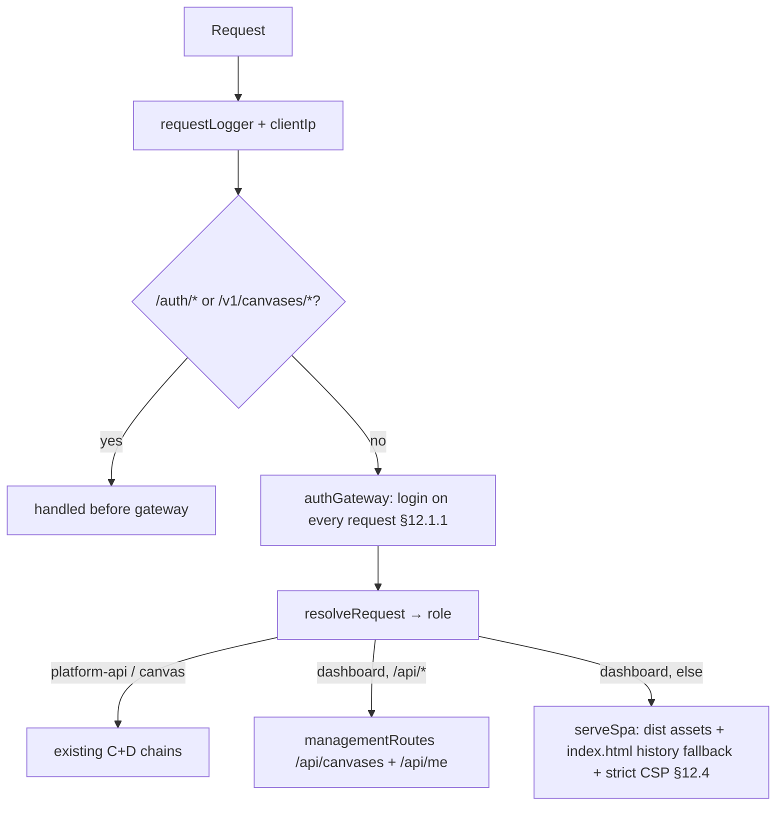

# feat: Dashboard SPA (area E) — canvas-drop management app

The Week-5 milestone (`BUILD_BRIEF.md` §16). Build the Vite + React 19.2 + TS
dashboard at `apps/dashboard`, served by the same Hono process, so an org member
can run the entire canvas lifecycle from a browser without touching the API:
see their canvases, create one (drop folder / ZIP / paste HTML / use the API),
inspect detail (overview / versions / settings / usage), manage sharing and
protection, and onboard on first run. §14 makes design quality a first-class
requirement — "the dashboard is the product's proof of taste."

This plan calls the management API already built in areas C+D
(`/api/canvases…`), extends that API with the three session-authed endpoints
the UI needs but that don't exist yet (`/api/me`, list enrichment, versions +
rollback), and deliberately scopes usage/analytics to a designed "coming soon"
state because its data substrate (area L) and event sources (the primitives,
weeks 6–7) are not built.

**Target repo:** canvas-drop. All paths below are repo-relative.

---

## Scope

**This plan builds:** the dashboard SPA (toolchain, token system, routing, data
layer, all v1 §6.9 surfaces) + the minimal server-side seam it needs (SPA
serving for the `dashboard` role, three management-API additions). Full coverage
of §6.9 items 1–11, with usage (item 6) and the list visit-sparkline (part of
item 1) shipped as a deliberate "coming soon" placeholder.

**This plan does NOT build:** the usage/analytics data model or stats endpoints
(`usage_events`/`usage_daily` — area L); the asset file manager + in-browser
editor (§6.9 items 12, search 13 — v1.1); the admin panel (§6.10 — area K); any
canvas-facing primitive (KV/files/AI/realtime — areas F–J/R). The "use the API"
create path surfaces the existing Bearer deploy API; it does not add CLI/agent
tooling (v1.1).

### Resolved scope forks (confirmed with the owner)

- **Versions tab → build the endpoints.** The session-authed management API gains
  `GET /api/canvases/:id/versions` and `POST /api/canvases/:id/rollback`, reusing
  the existing dual-dialect `versionsRepository` + `canvases.setCurrentVersion`
  and mirroring the Bearer `/v1` handlers. The Versions tab is fully real: deploy
  history (who / when / file count / size / current) + one-click rollback
  (§6.1.11–13, both v1).
- **Usage tab + list sparkline → deliberate "coming soon."** No `usage_events`/
  `usage_daily` schema and no stats endpoint in this plan. The Usage tab ships as
  a designed, §14.5-quality placeholder; the list omits the visit sparkline (no
  data source yet). Both light up when area L + the primitives land. Rationale:
  the event sources don't exist yet, so building stats now means front-running
  area L's schema for a tab that would render empty regardless.

### Deferred to Follow-Up Work

- Usage/analytics tab content + list sparkline (area L: `usage_events`,
  `usage_daily`, stats query endpoints).
- Asset file manager + in-browser CodeMirror editor (§6.9.12, §6.2.4–5 — v1.1).
- Search own canvases (§6.9.13 — v1.1).
- Org-wide directory/search of shared canvases (§6.9.14 — later).
- Admin panel (§6.10 — area K).

---

## Problem Frame

Today, every management capability exists only as an HTTP endpoint. The
`apps/dashboard` workspace is an empty placeholder (`index.html` + a bare
`package.json`); the Hono app's catch-all returns `not_implemented` for the
`dashboard` role (`apps/server/src/app.ts:140`). An org member cannot create,
deploy, configure, share, or roll back a canvas without crafting requests by
hand. Area E closes that gap with a fast, keyboard-friendly SPA whose design
quality is itself a product goal.

Two facts shape the work:

1. **The management API is close but incomplete.** `managementRoutes`
   (`apps/server/src/routes/management.ts`) covers create, list, get, settings,
   regen-slug, regen-key, delete, paste, and folder/ZIP deploy — but has **no**
   current-user identity endpoint, **no** versions list, **no** rollback, and the
   list response lacks last-deploy metadata. Versions + rollback exist only on the
   Bearer `/v1` API (`apps/server/src/routes/deploy-api.ts`), which the
   same-origin browser SPA cannot use (it has a session, not a canvas key).
2. **Usage data does not exist yet.** §6.9.6 / §6.9.1 depend on tables and event
   sources scheduled for later areas. Honest scoping beats a fake endpoint.

---

## Requirements Traceability

| Req | Source | Where addressed |
|-----|--------|-----------------|
| My-canvases-first list (title, slug, URL, status, last deploy, dominant create) | §6.9.1 | U1 (list enrichment), U5 |
| Visit sparkline (a list column) | §6.9.1 | Deferred — no data source; U5 omits the column. Separate from the Usage tab; both arrive with area L analytics |
| Create flow (name → folder / ZIP / paste / use-the-API; key shown once) | §6.9.2, §6.9.5 | U4, U6 |
| Canvas detail: overview / versions / settings / usage | §6.9.3 | U7, U8 |
| Settings (title/desc, shared+expiry, password, SPA fallback, regen slug, regen key, delete) | §6.9.4 | U8 |
| API key shown once; regenerate invalidates; hashed at rest | §6.9.5, §12.1.3 | U4, U6, U8 (server already hashes) |
| Usage/stats tab | §6.9.6 | "Coming soon" placeholder (U7); data deferred to area L |
| Copy-link / open affordances everywhere sensible | §6.9.7 | U5, U7 |
| Deliberate empty / error / loading states | §6.9.8, §14.3 | U5–U9 (each surface), U10 |
| Onboarding first-run page (3 fastest paths + agent snippet) | §6.9.9, §11.5 | U9 |
| Keyboard-friendly, SPA, optimistic where safe | §6.9.10 | U2, U4 (optimistic policy), U10 |
| Opt-in gallery listing (title/description/tags) | §6.9.11, §6.3.11 | U8 |
| Versions list + one-click rollback | §6.1.11–13 | U1 (endpoints), U7 |
| Token-first design system, one typeface, dark-mode-ready, motion ≤150ms, no CLS | §14.1–14.5 | U2 (tokens), U10 (verification) |
| Served by the same Hono process | §6.9, §9.1 | U3 |
| Login on every request honored; same-origin on mutations; no existence leak | §12.1, §12.5, §9.2 | U1, U3, U4 |
| Dual-dialect stays green; CI matrix green | §10, §18.2 | U1 (server tests both dialects), U11 |

---

## High-Level Technical Design

### Role-serving (how the SPA reaches the org member)

The SPA is static files built by Vite to `apps/dashboard/dist`; the existing Hono
process serves them for the `dashboard` role, behind the same auth gateway that
guards everything else. No new process, no second port in production.



In **dev** the SPA runs on the Vite dev server (HMR) and proxies `/api`, `/auth`,
`/v1` to the Hono server — `pnpm dev` runs both. In **prod** only Hono runs and
`serveSpa` replaces the `not_implemented` catch-all.

### Route + tab map (TanStack Router)

```
/                       → My Canvases (list)  | zero canvases → Onboarding (U9)
/new                    → Create flow (folder / ZIP / paste / use-the-API)
/c/:id                  → Canvas detail shell
  /c/:id (index)        → Overview tab
  /c/:id/versions       → Versions tab (history + rollback)
  /c/:id/settings       → Settings tab
  /c/:id/usage          → Usage tab ("coming soon")
```

(Detail routes are dashboard-internal app routes, distinct from the canvas-content
`/c/:slug` server routes — the dashboard lives on the base host / its own origin,
canvas content on `{slug}.{base}` in subdomain mode.)

### Server-state ownership + optimism policy (TanStack Query)

| Mutation | Optimistic? | Why |
|----------|-------------|-----|
| Settings toggles (shared, spaFallback, gallery, title/desc, expiry) | Yes | Reversible; instant feel; rollback-on-error |
| Password set/clear | No | Credential change, not a reversible toggle; await |
| Rollback | No | Confirm + await; changes the live canvas |
| Regenerate slug | No | Confirm (old URL dies); await + show new slug |
| Regenerate key | No | Confirm; await; key shown once in a modal |
| Delete | No | Confirm; await; removes from list |
| Create / deploy | No | Multi-step with progress; await typed result |

---

## Design Language (v1 default tokens)

The default theme, confirmed with the owner. **Token-level defaults, not
constraints** — every value below is a CSS variable a deployment re-skins (§14.1).
This is the look U2 ships and U10 verifies via screenshots.

- **Aesthetic: minimal editorial.** Calm, near-monochrome, typography-led, heavy
  restraint and generous whitespace — Linear / Vercel / Geist territory. Chrome
  recedes; content leads. This is the §14.4 "proof of taste" target; the explicit
  failure mode to avoid is a denser "admin panel / dashboard template" look.
- **Accent: indigo–violet, used sparingly.** The single chromatic note (primary
  actions, focus, selected/current markers, key links). Everything else is a
  graphite/ink neutral ramp. The accent must clear contrast in both themes
  (especially indigo-on-dark for focus rings and the version `current` marker).
- **Typeface: Geist (sans) + Geist Mono**, self-hosted (no runtime third-party
  fetch). Geist Mono for machine text — slugs, full URLs, API keys, agent
  snippet, version numbers, byte sizes — so identifiers read as identifiers.
  Tight type scale, comfortable line-height, generous section spacing.
- **Theme: system-driven, both first-class.** Follow `prefers-color-scheme`; light
  and dark are both polished and screenshot-ready (no second-class theme). A
  manual override toggle is allowed but the default tracks the OS. Both token sets
  ship in U2.
- **Motion & form:** transitions ≤150ms, ease-out, used only for state changes
  (no decorative animation); restrained radii consistent across primitives; one
  elevation/used-shadow scale; focus rings always visible (accent), never removed.
- **Re-skin contract:** components reference token vars only — no hard-coded hex,
  font names, or radii in component files. Swapping the `@theme` block re-skins the
  whole app.

### Interaction & IA conventions (cross-cutting — decided once, applied everywhere)

These resolve the interaction/IA decisions every unit shares, so the 11 units
don't drift. Confirmed with the owner where marked.

- **Viewport: desktop-first, ≥768px (confirmed).** Design and screenshot-verify
  for desktop/tablet; usable but not phone-optimized below 768px. Every unit
  assumes this; U10 verifies at desktop + tablet widths only. Not a responsive
  mobile build.
- **Navigation / IA:** list (`/`) → detail (`/c/:id`) → tab. The detail shell
  shows a **breadcrumb** "My Canvases / {title}" (sans for the crumb, the canvas
  title in sans) as the back affordance — not a bare browser-back dependency. The
  dominant "Create canvas" action lives in the list header **and** is reachable
  from the detail shell. Tab order is fixed: **Overview / Versions / Settings /
  Usage**.
- **Tabs pattern:** tabs are deep-linkable TanStack Router routes rendered as
  links with `aria-current="page"` on the active tab; the active panel is a
  landmark with an accessible heading (announce via route + document title), not
  a JS-toggled `role="tabpanel"`. Keep this pattern consistent across the shell.
- **ConfirmDialog anatomy (one component, used by rollback / regen-slug /
  regen-key / delete):** focus-trapped modal with a title, a context slot for
  action-specific copy, and a **verb-labeled** action button ("Roll back",
  "Regenerate", "Delete") — never "Confirm"/"OK". Destructive variant styles the
  action button in a **warning/red** token, **not** the indigo accent. Cancel
  restores focus to the trigger.
- **Destructive-action friction (confirmed):** Delete uses **type-to-confirm the
  slug** (Geist Mono input must match the canvas slug to enable the Delete
  button). Rollback, regenerate-slug, and regenerate-key use the simple
  ConfirmDialog (they're recoverable).
- **API-key reveal model (confirmed):** keys are hashed at rest → a once-shown key
  is genuinely unrecoverable. The reveal is a focus-trapped modal dismissed only by
  an explicit "I've saved it"; copy affordance included. If the user navigates away
  without saving, the key is **forfeit** — recovery is Settings → Regenerate key
  (the modal copy states this plainly). No false promise of re-display; no
  navigation hard-block.
- **First-deploy success moment:** after a user's first successful create+deploy
  they land on the canvas Overview with a one-time "Your canvas is live" success
  annotation (route-state-driven, not a vanishing toast) — this is the §17
  activation moment. Onboarding (`/onboarding`) remains reachable at its URL but is
  only auto-shown to zero-canvas users.
- **Empty/placeholder copy (specified, not generic — anti-slop):** Versions (no
  deploys yet) → "No versions yet — deploy this canvas to see its history here."
  Usage tab → a designed panel that **names the coming metrics** (unique + total
  viewers, last viewed, KV ops, file storage, AI tokens/cost, peak realtime
  connections) and says they arrive when usage analytics land — not a bare "coming
  soon." Voice: plain, confident, no exclamation-mark filler.
- **Focus management:** after regenerate-slug succeeds, focus moves to the new
  URL's copy button; after a modal closes, focus returns to its trigger; the copy
  confirmation and toasts use an ARIA live region.

---

## Output Structure

```
apps/dashboard/
  index.html                      # Vite entry (exists; gets a real mount)
  package.json                    # + react, react-dom, @tanstack/*, vite, tailwind v4, vitest, RTL
  vite.config.ts                  # build → dist/, dev proxy to Hono
  tsconfig.json                   # JSX + DOM lib; wired into repo typecheck via project refs
  vitest.config.ts                # jsdom; workspace-scoped (root config untouched)
                                  # (Tailwind v4 via @tailwindcss/vite — no postcss/tailwind.config; theme is the @theme block in tokens.css)
  src/
    main.tsx                      # React root + router + query client
    app.tsx                       # layout shell (nav, theme, toaster)
    styles/
      tokens.css                  # @theme: color/space/type/radius vars; light+dark
      base.css                    # resets, typography scale, focus rings
    lib/
      api.ts                      # typed management-API client (fetch, credentials, error codes)
      queries.ts                  # TanStack Query hooks (canvases, me, versions)
      mutations.ts                # mutation hooks + optimism policy
      format.ts                   # bytes, relative time, slug→url helpers
    components/                   # Button, Dialog, Tabs, Field, CopyButton, EmptyState, Skeleton, Toast …
    routes/
      index.tsx                   # My Canvases / onboarding switch
      new.tsx                     # create flow
      canvas.$id.tsx              # detail shell + tabs
      canvas.$id.overview.tsx
      canvas.$id.versions.tsx
      canvas.$id.settings.tsx
      canvas.$id.usage.tsx        # "coming soon"
      onboarding.tsx
    test/                         # *.test.tsx (jsdom project)
```

---

## Implementation Units

Build in dependency order. One local commit per unit; each unit's gates green
(`typecheck`, `lint`, full dual-dialect `test`) before the next. The whole scope
lands on one branch / one PR per the autonomous-round workflow (AGENTS.md).

### U1. Management API — identity, list enrichment, versions, rollback

**Goal:** Add the four session-authed pieces the SPA needs to the management API,
reusing existing dual-dialect repositories. No schema change.

**Requirements:** §6.9.1 (last deploy), §6.1.11–13 (versions + rollback),
§6.8.1/§11.3 (`me()` for the dashboard), §12.5/§9.2 (no existence leak,
same-origin on mutation).

**Dependencies:** none (extends C+D code already on `main`).

**Files:**
- `apps/server/src/app.ts` — mount `/api/me` as its own router (see Approach —
  it is **not** under `/api/canvases`).
- `apps/server/src/routes/management.ts` — add versions/rollback routes + list enrichment.
- `apps/server/src/routes/me.ts` (new) — the `/api/me` router.
- `apps/server/src/db/repositories/versions.ts` — add the batched `findByIds`
  lookup for list enrichment (see Approach).
- `apps/server/src/routes/management.test.ts`, `apps/server/src/app.test.ts` — extend.
- `apps/server/src/db/repositories/versions.test.ts` — extend (a repo method IS added).

**Approach:**
- `GET /api/me` → an **explicit 5-field projection** `{ id, email, name,
  avatarUrl, isAdmin }` constructed field-by-field from `c.get("user")` — never a
  spread of the user row (so future internal columns can't leak). Read-only; no
  same-origin guard (GET). **Mount it as its own route** — `managementRoutes` is
  mounted at `/api/canvases`, and its `app.get("/:id")` would match `me` as a
  canvas id (404). Add `app.route("/api/me", meRoutes(...))` in `app.ts` **after**
  the auth gateway and role middleware but **before** the SPA fallback, so the SPA
  catch-all (U3) never sees `/api/me`. (Feasibility review P0-1.)
- **List enrichment:** extend the `GET /api/canvases` items with a `lastDeploy`
  summary — `{ version, createdAt, fileCount, totalBytes }` derived from each
  canvas's `currentVersionId` (null until first deploy). Avoid an N+1: add
  `versionsRepository.findByIds(ids: string[]): Promise<Version[]>` using `inArray`
  (already imported). **Guard the empty-input case** — `if (ids.length === 0)
  return []` (Drizzle `in ()` errors on some dialects) — collect the non-null
  `currentVersionId`s, batch-fetch, map id→summary. `status` and `url` already come
  from `publicCanvas`. (Feasibility P1-3, scope review.)
- `GET /api/canvases/:id/versions` → reuse `ownedCanvas(c)` (404 on non-owner, no
  existence confirmation) then `versions.listByCanvas(cv.id)`, returning the same
  shape the Bearer handler returns (`number, source, status, createdBy, createdAt,
  fileCount, totalBytes, current`). GET — no same-origin guard.
- `POST /api/canvases/:id/rollback` → `sameOrigin` guard (mutation), `ownedCanvas`,
  parse `{ version: number }`, `versions.findReadyByNumber(cv.id, version)`
  (already canvas-scoped — a number from another canvas cannot resolve),
  `canvases.setCurrentVersion(cv.id, target.id)`, audit `rollback`. Mirror the
  Bearer handler's error codes (`INVALID_PATH` 400/404).
- Do **not** duplicate logic — factor the shared versions-list/rollback shaping
  with `deploy-api.ts` only if it reads cleanly; otherwise mirror the small
  handlers (they differ in auth: `authCanvas` vs `ownedCanvas`).

**Patterns to follow:** `ownedCanvas` + `sameOrigin` in `management.ts`;
`publicCanvas` (never leak hashes); the existing versions/rollback handlers in
`deploy-api.ts`; audit calls already in `management.ts`.

**Execution note:** Test the **rejection** paths first (auth-invariant checklist):
non-owner 404 before any happy-path assertion.

**Test scenarios** (run on both dialects via the existing `describe.each`):
- `GET /api/me` returns exactly the five projected fields; adding a column to the
  user row does not change the response (explicit projection, not a spread).
- `GET /api/me` is routed to its own handler (returns JSON), **not** swallowed by
  the `/api/canvases/:id` route or the SPA fallback (regression guard for P0-1).
- `findByIds([])` returns `[]` without hitting the DB; `findByIds([a,b])` returns
  both versions — both assertions on sqlite **and** pglite.
- List enrichment maps each canvas's `currentVersionId` to its `lastDeploy`
  summary in a single batched query (no N+1).
- Covers §6.1.13. `GET /api/canvases/:id/versions` as owner → history newest-first
  with `current: true` on the live version; correct `createdBy/createdAt/fileCount/
  totalBytes`.
- `GET /api/canvases/:id/versions` as a **non-owner** → 404 (no existence leak);
  as admin → allowed.
- List enrichment: a canvas with a deploy shows `lastDeploy`; a never-deployed
  canvas shows `lastDeploy: null`; a canvas rolled back shows the **current**
  version, not the newest.
- Covers §6.1.12. `POST /rollback` to a valid ready version → `setCurrentVersion`
  moves the pointer; serving the canvas afterward returns the rolled-back bytes;
  `rollback` audit row written.
- `POST /rollback` to a **non-existent** version number → 404 `INVALID_PATH`; to a
  **pending** version → 404; missing/invalid body → 400.
- `POST /rollback` with a version number that exists on a **different** canvas →
  404 (scoped by `findReadyByNumber`).
- `POST /rollback` **cross-origin** (forged `Sec-Fetch-Site: cross-site`) → 403;
  with `Sec-Fetch-Site: same-origin` → allowed.
- `POST /rollback` with **no `Sec-Fetch-Site` and no `Origin`** → allowed by design
  (non-browser clients; the guard blocks browser cross-site, not scripted calls).
  Owner-scoping via `ownedCanvas` is the real authz control here, not `sameOrigin`
  (security review P1 — don't describe `sameOrigin` as a total cross-origin block).
- `POST /rollback` as non-owner → 404 (the primary authz gate; assert first).

**Verification:** New endpoints behave per scenarios on sqlite + pglite; no new
columns; `pnpm test` green both legs; no leak of hashes in any response.

---

### U2. Frontend toolchain + token-first design system

**Goal:** Stand up the real Vite + React 19.2 + TS app with TanStack Router/Query,
Tailwind v4 CSS-variable token layer, one typeface, dark-mode tokens from day one,
and a jsdom test project — the foundation every UI unit builds on. No features
yet; a routable shell that renders.

**Requirements:** §6.9.10 (SPA), §14.1–14.3 (token-first, typography, refined
empty/skeleton/motion/dark-mode), §6.9, §9.1 (it's the management app).

**Dependencies:** none (independent of U1; U4 consumes U1).

**Files:**
- `apps/dashboard/package.json` — add deps with **pinned majors** (react 19.2,
  react-dom 19.2, @tanstack/react-router, @tanstack/react-query, vite 6,
  @vitejs/plugin-react, tailwindcss v4 + `@tailwindcss/vite`, typescript, vitest 3,
  jsdom, @testing-library/react, @testing-library/user-event). No
  `postcss`/`autoprefixer`/`tailwind.config` — v4 via the Vite plugin uses the CSS
  `@theme` block (feasibility P2-2). Add a concurrency runner (`concurrently`) for
  `pnpm dev` (or use `pnpm -r --parallel dev`) — see U3.
- `apps/dashboard/vite.config.ts`, `apps/dashboard/tsconfig.json` (`jsx: react-jsx`,
  `lib: ["ES2023","DOM","DOM.Iterable"]`, globs `.tsx`).
- `tsconfig.json` (root) — add a project **reference** to the dashboard tsconfig so
  `pnpm typecheck` covers `.tsx` without giving the server a DOM lib (feasibility
  P1-1); update the `typecheck` script if a second `tsc -p` invocation is simpler.
- `apps/dashboard/vitest.config.ts` — **workspace-scoped** jsdom config; the root
  `vitest.config.ts` is left untouched (scope review P1; feasibility P0 on the
  dialect split avoided by not touching root).
- `apps/dashboard/index.html` (real module entry), `apps/dashboard/src/main.tsx`,
  `apps/dashboard/src/app.tsx`.
- `apps/dashboard/src/styles/tokens.css`, `base.css`.
- `apps/dashboard/src/components/` — primitive set (Button, Dialog, ConfirmDialog
  with a **destructive variant**, Tabs, Field, EmptyState, Skeleton, CopyButton,
  Toast) styled from tokens, built to the ConfirmDialog anatomy in the Interaction
  & IA conventions (verb-labeled action button, warning-token destructive style).
- `vitest.config.ts` (root) — convert to a **projects** config so the dashboard
  runs in `jsdom` while server/shared stay `node` (see Approach).
- `apps/dashboard/src/test/smoke.test.tsx`.
- `pnpm-workspace.yaml` — add any native-build approvals if a dep needs one.

**Approach:**
- **Tailwind v4 token-first (implements the Design Language block):** define the
  palette/space/type/radius scale in `tokens.css` via `@theme { --color-…;
  --radius-…; }` CSS variables; ship a restrained near-monochrome **graphite/ink**
  ramp + a single **indigo–violet** accent; `:root` (light) + dark token set driven
  by `prefers-color-scheme` (both first-class), with an optional manual override.
  Re-skinnable via tokens only (§14.1) — components reference token vars, never
  hard-coded hex.
- **Typeface: Geist + Geist Mono**, self-hosted (no third-party fetch at runtime —
  org-agnostic, no phone-home; §6.12.7). Geist Mono is the token for machine text
  (slugs, URLs, API keys, version numbers, byte sizes, agent snippet); tight scale,
  generous whitespace. Verify the self-hosted font files satisfy the strict
  `font-src 'self'` CSP from U3 (no external font CDN).
- **Router/Query:** wire TanStack Router (route tree from `src/routes/`) and a
  QueryClient in `main.tsx`; `app.tsx` is the layout shell (top nav, theme,
  toaster outlet). Routes are placeholders this unit; real ones in U5–U9.
- **vitest (workspace-scoped, root untouched):** the root config forces
  `environment: "node"` and globs `*.test.ts`, which excludes `.tsx` already. Add a
  separate `apps/dashboard/vitest.config.ts` (`environment: "jsdom"`, globs
  `.test.tsx`) and a dashboard `test` script; the root `pnpm test` runs both legs
  (root node tests + the dashboard project). **Do not modify the root vitest config
  or the `CANVAS_DROP_DB` dialect split** — keeping them untouched removes all risk
  to the dual-dialect server suite mid-round (scope review P1). The dashboard
  project is dialect-agnostic; CI runs it once (U11), not under both dialect legs.
- **Route-level code-splitting** is configured here (toolchain concern, moved out
  of U10): lazy-load route components so LCP/route-transition budgets (§13.4) are
  met from the start.

**Patterns to follow:** the existing token-first intent in §14; biome config
already lints the workspace (imports sorted via `check`); keep the dashboard's
`type: module`.

**Execution note:** Use the `ce-frontend-design` / `design-taste-frontend` skill
guidance when shaping the token scale and primitives to avoid templated AI slop;
screenshot verification is U10.

**Test scenarios:**
- Smoke: the app mounts and renders the shell without error in jsdom.
- A primitive (Button) renders its variants and is keyboard-focusable (focus ring
  from tokens).
- Dark-mode token switch flips `--color-*` resolved values (no hard-coded colors
  in component output).
- `pnpm test` still runs the node (server/shared) project on both dialects AND the
  dashboard jsdom project; `test:sqlite`/`test:pg` still scope the node dialect.

**Verification:** `pnpm --filter @canvas-drop/dashboard build` produces `dist/`;
`pnpm typecheck` **demonstrably** type-checks a `.tsx` file (introduce a type error
in a dashboard file and confirm the root `typecheck` script fails, then fix it);
the dashboard jsdom project runs under `pnpm test` alongside the untouched node
suite; lint green.

---

### U3. Server-side SPA serving + dev/build wiring

**Goal:** Serve the built dashboard from the Hono process for the `dashboard`
role with strict CSP + security headers, wire `pnpm build` and `pnpm dev` to
include the SPA, and replace the `not_implemented` catch-all.

**Requirements:** §6.9/§9.1 (same process), §12.4 (strict CSP on dashboard),
§12.1.1 (still behind login), §13.4 (LCP/route perf — hashed immutable assets).

**Dependencies:** U2 (a real `dist/` to serve).

**Files:**
- `apps/server/src/app.ts` — replace the dashboard branch of the `app.all("*")`
  catch-all with a `serveSpa` handler (only for `role === "dashboard"`; keep the
  `not_implemented` answer for `platform-api` until area F).
- `apps/server/src/dashboard/serve-spa.ts` (new) — static asset serving + history
  fallback to `index.html` + headers.
- `apps/server/src/dashboard/serve-spa.test.ts` (new).
- `package.json` (root) — `dev` runs Hono + Vite concurrently; `build` already
  `pnpm -r build` (picks up the dashboard build script added in U2).
- `apps/dashboard/vite.config.ts` — dev `server.proxy` for `/api`, `/auth`, `/v1`.
- `packages/shared/src/config/env.ts` + `.env.example` — add an optional
  `CANVAS_DROP_DASHBOARD_DIST` override (default resolves from the server module via
  `import.meta.url`; KTD-9). Config is the only `process.env` reader (project rule).

**Approach:**
- **Mount strictly after the gateway.** `serveSpa` is wired only at the position
  of the existing post-gateway `app.all("*")` catch-all (`app.ts:140`), gated to
  `role === "dashboard"` the same way `onlyCanvas` gates canvas middleware —
  **never** mounted above the `authGateway` `app.use("*")` (`app.ts:96`) the way
  `/auth` and `/v1/canvases` are. (Security review P1: copying the pre-gateway
  mount pattern would serve the SPA shell + bundles unauthenticated, breaking
  §12.1.1.) Requests under `/api/*`, `/auth/*`, `/v1/*` already have handlers
  upstream; the SPA history fallback applies only to dashboard-role paths with no
  handler, and an unmatched `/api/*` returns 404 JSON, never `index.html`.
- `serveSpa` resolves the dist directory from the **server module's own location**
  (`import.meta.url` → resolve the dashboard `dist`), with a **config override**
  (`CANVAS_DROP_DASHBOARD_DIST` or equivalent) — **not** a cwd walk-up. The
  packaged/Docker artifact runs `node apps/server/dist/index.js` from an arbitrary
  cwd where a `resolveMigrationsDir`-style walk-up would silently 404 every asset
  (feasibility P1-2). Serve hashed assets with
  `Cache-Control: public, max-age=31536000, immutable`; serve `index.html` with
  `no-cache` (instant deploys, §13.5). Unknown app routes (`/c/:id/settings` etc.)
  fall back to `index.html` (SPA history routing) — but only for the dashboard
  role, never for `/api`, `/auth`, `/v1`, or canvas hosts.
- **Headers (§12.4):** strict CSP on dashboard responses — `default-src 'self'`,
  `script-src 'self'` (Vite emits external hashed scripts — no inline needed; if
  one inline bit is unavoidable use a hash, not `unsafe-inline`), `style-src 'self'`
  (+ a hash if Tailwind injects a critical inline style), `img-src 'self' data:`,
  `font-src 'self'` (Geist is self-hosted — no font CDN), `connect-src 'self'`,
  `frame-ancestors 'none'`, plus `X-Content-Type-Options:
  nosniff`, `Referrer-Policy: same-origin`, COOP. This matters most in **path
  mode**, where the dashboard shares an origin with canvases (§12.2) — the SPA
  must not relax it. **Scope honestly (security review P2):** the dashboard CSP is
  delivered on *dashboard document* responses; it does **not** restrict JavaScript
  inside a *canvas* document in path mode (canvas responses carry their own
  headers). Its job here is preventing XSS injection into the SPA, not blocking
  path-mode canvas→management reach — that residual is mitigated by `Sec-Fetch-Site`
  + `SameSite` session cookies (§12.2's documented, accepted residual), and is why
  multi-user path mode needs the explicit opt-in flag. Do not present CSP as a
  path-mode isolation guarantee.
- **Verify the session cookie hardening** the SPA now depends on: the gateway/OIDC
  session cookie must be `HttpOnly`, `Secure`, and `SameSite=Lax` (or `Strict`) —
  the actual path-mode CSRF defense (security review P2, auth-invariant checklist).
  If foundation (area B) already sets these, cite it and add a regression assertion;
  if not, fix it here.
- The SPA stays **behind the auth gateway** — `serveSpa` runs after `authGateway`,
  so an unauthenticated request is rejected before any asset is served. Note the
  rejection *shape* differs by mode and U4 must handle it (see U4 auth-expiry
  contract): `dev`/`proxy` → 401 JSON; `oidc` → 302 → `/auth/login`. Either way
  login-on-every-request is preserved for the SPA shell itself.
- `pnpm dev`: run the Vite dev server (HMR, port 5173) + the Hono server
  concurrently via an explicit runner — add `concurrently` (or `pnpm -r --parallel
  dev` with a `dev` script in the dashboard package). The root `dev` currently runs
  only the server filter, so this is a real change, not a no-op. Vite proxies
  API/auth/deploy calls to Hono. Document that in dev the browser hits Vite; in prod
  it hits Hono (so the prod CSP only applies on Hono — the dev/prod asymmetry that
  makes `style-src 'self'` safe even though Vite injects inline styles in dev;
  feasibility P2-1).

**Patterns to follow:** `onlyCanvas` role-gating wrapper in `app.ts`; §12.4 header
application already done for canvas responses in `serve.ts` (mirror the discipline,
including headers on non-200s); `resolveMigrationsDir` walk-up.

**Test scenarios:**
- `dashboard` role + an app route (`/`, `/c/x/settings`) → 200 `index.html` (history
  fallback); a hashed asset path → 200 with immutable cache header + correct MIME.
- `index.html` is served `no-cache`; hashed assets `immutable`.
- Strict CSP + `nosniff` + `frame-ancestors 'none'` present on dashboard responses.
- An **unauthenticated** dashboard request is rejected by the gateway before any
  asset is served (login-on-every-request preserved) — 401 in dev/proxy, 302 in
  oidc; assert `serveSpa` is reached only post-gateway (regression guard for the
  pre-gateway-mount mistake).
- `/api/*` with no upstream handler returns **404 JSON**, not `index.html`;
  `/auth/*`, `/v1/*`, and a canvas-role host do **not** get the SPA fallback.
- The session cookie carries `HttpOnly`, `Secure`, and `SameSite=Lax`/`Strict`
  (assert here, or cite the foundation test that does).

**Verification:** Built SPA served by Hono in prod mode; CSP and login enforced;
`pnpm dev` serves HMR + proxies to Hono; `pnpm build` builds server + dashboard.

---

### U4. Management-API client + query/mutation data layer

**Goal:** A typed, same-origin, credentialed client over the management API plus
TanStack Query hooks and the optimism policy, so feature units consume data
without re-deriving fetch/error handling.

**Requirements:** §6.9.10 (optimistic where safe), §6.9.5 (key shown once),
§9.2/§12.5 (same-origin, credentials), §11.5/§9.5.4 (stable error codes → human
+ agent hints).

**Dependencies:** U1 (endpoints exist), U2 (app scaffold).

**Files:**
- `apps/dashboard/src/lib/api.ts`, `queries.ts`, `mutations.ts`, `format.ts`.
- `apps/dashboard/src/lib/api.test.tsx`, `mutations.test.tsx`.

**Approach:**
- `api.ts`: `fetch` wrapper, `credentials: 'include'`, JSON; surfaces the server's
  stable error codes (`code`, `message`, `path`) as a typed `ApiError` with a
  human/agent-readable `hint`. Methods: `me`, `listCanvases`, `getCanvas`,
  `createCanvas`, `pasteHtml`, `deployZip`, `deployFolder`, `updateSettings`,
  `regenerateSlug`, `regenerateKey`, `deleteCanvas`, `listVersions`, `rollback`.
  Mutating calls are same-origin (the browser sets `Sec-Fetch-Site`; the client
  must not spoof headers).
- `queries.ts`: query hooks + sensible cache keys (`['canvases']`, `['canvas',id]`,
  `['versions',id]`, `['me']`).
- `mutations.ts`: mutation hooks implementing the optimism table in the HTD —
  optimistic + rollback-on-error for settings toggles; await-only for rollback /
  regen / delete / deploy; invalidate the right query keys on success.
- `format.ts`: bytes (KB/MB), relative time (last deploy), slug→full-URL.
- **Auth-expiry contract (feasibility P0-2):** a long-lived SPA *will* hit an
  expired session. Every query/mutation must detect the unauthenticated response —
  a 401, OR a response that was redirected to the login page / returned HTML
  instead of JSON — and respond by doing a **full-page navigation to login**
  (`window.location` to `/auth/login` in oidc, or a reload that the gateway 401 →
  login bounces in proxy/dev), never an in-SPA error toast. This is the single most
  common runtime path for the app; it is a first-class branch in `api.ts`, not an
  afterthought. (If foundation can return 401 for `Accept: application/json` /
  `Sec-Fetch-Mode: cors` instead of a 302, prefer that — flag it to U1/U3; either
  way the client handles both shapes.)
- **Key-shown-once + forfeit model:** create/regen responses carry `apiKey`
  exactly once; the client passes it straight to the focus-trapped reveal modal and
  never persists, caches, or refetches it. Per the Interaction conventions, leaving
  the modal without saving forfeits the key (recovery = regenerate); the client
  must not stash it anywhere to "recover" later.

**Patterns to follow:** the response shapes in `management.ts` (`publicCanvas`,
deploy result, paste result) and the U1 additions; the deploy error codes in
`apps/server/src/deploy/errors.ts`.

**Test scenarios:**
- Client parses a stable deploy error code into a typed `ApiError` with a hint;
  a 404 `not_found` and a 403 `cross_origin_forbidden` map to distinct typed errors.
- Optimistic settings toggle updates the cache immediately and **rolls back** when
  the request rejects.
- Rollback / delete / regen mutations are **not** optimistic — cache changes only
  after success; correct query keys invalidated.
- A 401 response, and a redirected/HTML (non-JSON) response, both trigger the
  full-page login navigation — not an in-SPA error state.
- `apiKey` from a create/regen response is exposed to the caller but never written
  to storage or a query cache.
- `format` helpers: bytes and relative-time edge cases (0 bytes, just-now, days).

**Verification:** Hooks drive UI in later units with no ad-hoc fetches; error
codes render as human/agent hints; optimism policy matches the HTD table.

---

### U5. My-canvases list + app shell

**Goal:** The default route: "my canvases first" with a dominant create action,
each row showing title, slug, URL, status, last deploy, and copy-link/open
affordances — plus deliberate empty/skeleton/error states. No sparkline.

**Requirements:** §6.9.1, §6.9.7 (copy/open), §6.9.8 (states), §14.3.

**Dependencies:** U3 (served), U4 (data layer).

**Files:**
- `apps/dashboard/src/routes/index.tsx`, `app.tsx` (nav/shell finalize).
- `apps/dashboard/src/components/CanvasRow.tsx`, `EmptyState.tsx` usage.
- `apps/dashboard/src/test/list.test.tsx`.

**Approach:**
- Dominant, always-visible "Create canvas" action (primary button / command).
- Row: title (fallback to slug when untitled), slug, full URL (copy + open-in-new),
  `status` badge (active/disabled), last-deploy relative time + version (from U1
  enrichment; "Never deployed" when null). **No** sparkline cell — leave the
  visual rhythm intact (the column simply isn't there in v1).
- Skeleton rows while loading (no layout shift into the loaded state); a typed
  error state with retry; **zero canvases → render Onboarding (U9)** instead of an
  empty table.
- Keyboard: rows reachable/activatable; copy/open are buttons, not hover-only.

**Patterns to follow:** token primitives from U2; query hooks from U4.

**Test scenarios:**
- List renders rows with title/slug/url/status/last-deploy from query data; an
  untitled canvas falls back to slug; a never-deployed canvas shows "Never
  deployed."
- Copy-link writes the canvas URL to the clipboard and confirms (toast); open
  targets the URL in a new tab.
- Loading shows skeletons sized to rows (assert no CLS); error shows the typed
  message + retry.
- Zero canvases routes to the onboarding view, not an empty table.
- Keyboard: create action and row affordances are focusable and activatable.

**Verification:** The list is the fast first screen; states are deliberate; matches
§6.9.1 minus the deferred sparkline.

---

### U6. Create flow (folder / ZIP / paste / use-the-API)

**Goal:** `/new`: name → choose a method, deploy, and reveal the API key once.

**Requirements:** §6.9.2, §6.9.5, §6.2.1–3 (folder/ZIP/paste), §6.2.8–9 (progress,
precise errors), §11.4/§11.5 ("use the API" path + agent snippet).

**Dependencies:** U4, U5.

**Files:**
- `apps/dashboard/src/routes/new.tsx`.
- `apps/dashboard/src/components/ApiKeyReveal.tsx`, `DropZone.tsx`, `DeployProgress.tsx`.
- `apps/dashboard/src/test/create.test.tsx`.

**Approach:**
- Step 1: optional name/title. Step 2: method —
  - **Drop folder:** directory picker + drag-drop; POST multipart to
    `/api/canvases/:id/deploy/folder` (each file field key = canvas-relative path,
    matching the server contract). Create the canvas first, then deploy.
  - **ZIP:** file input / drop; POST the ZIP bytes to `…/deploy/zip`.
  - **Paste HTML:** textarea → `POST /api/canvases/paste` (one-step create+deploy).
  - **Use the API:** create the canvas (no deploy), then show the copy-paste
    "Build with AI" snippet (SDK contract + `PUT /v1/canvases/:id/deploy` + this
    canvas's URL/mode) and the once-shown key.
- Deploy progress indicator; on failure surface the precise stable error code +
  hint (e.g. `ZIP_SLIP_REJECTED`, `EMPTY_DEPLOY`) and let the user retry without
  re-creating where possible.
- **API key reveal (once, forfeit model — Interaction conventions):** focus-trapped
  modal with copy + an explicit "I've saved it" dismissal; modal copy states that
  leaving without saving forfeits the key and recovery is Settings → Regenerate key.
  The key is never refetchable and never stashed client-side.
- On success → navigate to the new canvas's detail, passing route state so the
  Overview shows the one-time "Your canvas is live" annotation (the §17 activation
  moment), especially for a user's first canvas (from onboarding, U9).

**Patterns to follow:** the folder/zip/paste request shapes in `management.ts`;
the deploy error codes; the agent-snippet content in §11.5.

**Test scenarios:**
- Covers §6.9.2. Paste-HTML create → one request creates + deploys; success
  navigates to detail and reveals the key once.
- Folder create: builds the multipart body with file-path keys; ZIP create posts
  bytes; both show progress then success.
- "Use the API" creates a canvas without deploying and renders the agent snippet
  containing the canvas URL + deploy endpoint + key.
- Covers §6.9.5. The API key is shown exactly once; after acknowledge/navigation it
  is gone and cannot be refetched.
- A deploy failure (`ZIP_SLIP_REJECTED` / `EMPTY_DEPLOY`) renders the precise error
  + hint and offers retry; paste failure soft-deletes server-side (already handled)
  — UI returns to the form without a dangling canvas.
- Empty/invalid inputs are blocked client-side with clear messaging.

**Verification:** All four create paths reach a live canvas (or a created one for
the API path); key-once honored; precise errors surfaced.

---

### U7. Canvas detail — overview / versions / usage tabs

**Goal:** The detail shell with Overview, Versions (history + one-click rollback),
and Usage ("coming soon"). Settings is U8.

**Requirements:** §6.9.3, §6.1.11–13 (versions + rollback metadata), §6.9.6
(usage — placeholder), §6.9.7 (copy/open), §6.9.8 (states).

**Dependencies:** U1 (versions/rollback endpoints), U4, U5.

**Files:**
- `apps/dashboard/src/routes/canvas.$id.tsx` (shell + Tabs), `…overview.tsx`,
  `…versions.tsx`, `…usage.tsx`.
- `apps/dashboard/src/test/detail.test.tsx`.

**Approach:**
- **Shell:** breadcrumb "My Canvases / {title}" (the back affordance, per
  Interaction conventions) + title/slug header with copy-link + open; tab nav in
  the fixed order Overview / Versions / Settings / Usage as deep-linkable routed
  links with `aria-current` (the Tabs pattern from conventions).
- **Overview:** URL, status, last deploy (version, when, file count, total size),
  quick actions (open, copy, go to create-new-version). 404 → "canvas not found"
  state (also covers a deleted/again-not-owned canvas).
- **Overview:** URL, status, last-deploy summary, copy/open; the one-time "Your
  canvas is live" success annotation when arriving from a first deploy (route-state;
  Interaction conventions). 404/deleted → not-found state.
- **Versions:** history newest-first (number, source, who, when, file count, size,
  `current` marker) from `GET …/versions`; **one-click rollback** per non-current
  ready version → ConfirmDialog whose body names the target and consequence ("Roll
  back to version N — this replaces the live version for all visitors immediately"),
  action button labeled "Roll back" (not optimistic), await, then refresh versions +
  overview. Empty state copy: "No versions yet — deploy this canvas to see its
  history here."
- **Usage:** the designed "coming soon" panel from the Interaction conventions —
  **names** the coming metrics (unique + total viewers, last viewed, KV ops, file
  storage, AI tokens/cost, peak realtime); not a broken/blank tab. No data fetch.

**Patterns to follow:** Tabs primitive (U2); versions response shape (U1); the
confirm-then-await optimism policy (U4).

**Test scenarios:**
- Tabs are deep-linkable routes and keyboard-navigable; the active tab carries
  `aria-current`; the active tab reflects the URL.
- The breadcrumb "My Canvases / {title}" navigates back to the list.
- The rollback ConfirmDialog body names the target version + consequence; its
  action button reads "Roll back" (not "Confirm").
- Arriving at Overview from a first deploy shows the one-time "Your canvas is live"
  annotation; arriving normally does not.
- Covers §6.1.13. Versions tab lists history with the `current` marker and correct
  metadata; a never-deployed canvas shows the empty state.
- Covers §6.1.12. Rollback prompts a confirm dialog; on confirm it calls
  `/rollback`, awaits, and the `current` marker moves; cancel does nothing.
- A rollback error renders a typed message and leaves the current version unchanged.
- Usage tab renders the "coming soon" panel and makes **no** network request.
- Overview of a missing/not-owned canvas (404) shows the not-found state, not a crash.

**Verification:** Detail tabs work and deep-link; versions + rollback are fully
functional; usage is a deliberate placeholder.

---

### U8. Settings tab

**Goal:** All §6.9.4 settings in one tab: title/description, shared toggle +
expiry, password, SPA fallback, gallery opt-in, regenerate slug, regenerate key,
delete.

**Requirements:** §6.9.4, §6.3.4–7/11 (share/expiry/password/gallery), §6.1.3
(regen slug), §6.9.5 (regen key once), §6.1.14 (delete).

**Dependencies:** U4, U7 (shell).

**Files:**
- `apps/dashboard/src/routes/canvas.$id.settings.tsx`.
- `apps/dashboard/src/components/ConfirmDialog.tsx`, `ApiKeyReveal.tsx` (reuse).
- `apps/dashboard/src/test/settings.test.tsx`.

**Approach:**
- Title/description: debounced save → `PATCH /settings` (optimistic).
- **Shared toggle + expiry:** toggle is optimistic; when shared, an optional
  expiry timestamp with a live countdown / "expired" state (owner-visible);
  clearing share is instant (server drops grants — §6.3.5 is server-side).
- **Password:** **confirm-and-await, not optimistic** (a credential change, not a
  reversible toggle — matches the HTD optimism table and KTD-5). Set (input →
  `password`) / clear (`password: null`); show has-password state (never the
  password); changing it invalidates gate cookies server-side (`passwordVersion`).
- **SPA fallback:** toggle (optimistic).
- **Gallery opt-in:** `galleryListed` toggle + `gallerySummary` + `galleryTags`,
  **hidden until `shared: true`** and revealed with a ≤150ms motion-token
  transition when sharing is turned on (Interaction conventions) — they are only
  meaningful for shared canvases.
- **Regenerate slug:** ConfirmDialog that **warns when the canvas is currently
  shared** ("the existing link, including any shared link, will stop working") →
  await → update the displayed URL **inline** in the settings panel (not just a
  toast) and move focus to its copy button (not optimistic).
- **Regenerate key:** confirm → await → reveal new key **once** (reuse U6 reveal);
  old key invalid immediately (server-side).
- **Delete:** **type-to-confirm the slug** (Geist Mono input must match the canvas
  slug to enable Delete; Interaction conventions) → await → soft-delete → navigate
  back to the list (the row disappears).

**Patterns to follow:** `settingsSchema` field set in `management.ts` (mirror it
exactly so the client never sends unknown fields); confirm-then-await for
destructive ops; key-once reveal from U6.

**Test scenarios:**
- Title/description save is optimistic and rolls back on error.
- Shared toggle optimistic; setting an expiry shows a countdown; an elapsed expiry
  shows the "expired" state.
- Covers §6.3.7. Setting a password is **confirm-and-await** (not optimistic),
  shows has-password (never echoes it); clearing it sends `password: null`.
- SPA-fallback toggle is optimistic and rolls back on error; gallery fields are
  **hidden until shared** and appear when the shared toggle is turned on; the
  gallery toggle is optimistic.
- Covers §6.1.3. Regenerate slug confirms (with a **shared-canvas warning** when
  the canvas is shared), awaits, updates the URL inline, and moves focus to the new
  URL's copy button.
- Covers §6.9.5. Regenerate key confirms, awaits, and reveals the new key exactly
  once.
- Covers §6.1.14. Delete is gated by **type-to-confirm the slug** (a wrong/empty
  value leaves Delete disabled), then awaits and removes the canvas from the list /
  navigates away.
- The client only sends fields present in the server's `settingsSchema`.

**Verification:** Full lifecycle controllable from the UI (§16 Week-5 result);
destructive actions are confirmed and await; key-once honored.

---

### U9. Onboarding first-run page

**Goal:** The zero-canvas first-run experience: the three fastest paths to live +
the agent snippet.

**Requirements:** §6.9.9, §11.5 (agent enablement), §14.4–14.5 (proof of taste,
system pages get the same care).

**Dependencies:** U5 (renders this when the list is empty), U6 (shares create
entry points), U4.

**Files:**
- `apps/dashboard/src/routes/onboarding.tsx`.
- `apps/dashboard/src/test/onboarding.test.tsx`.

**Approach:**
- Three fastest paths, each a one-click jump into the matching create method:
  paste HTML, drop a folder/ZIP, "use the API." Lead with the fastest (paste →
  live in <2 s, §13.3).
- The **agent snippet**: the copy-paste "Build with AI" block (SDK contract +
  deploy API + how the user's instance addresses canvases) so an AI agent can
  deploy on the user's behalf (§11.5). Copy affordance with confirmation.
- Refined, generous, on-brand — this is a screenshot-that-sells-the-repo surface
  (§14.4). Shown only when the user has zero canvases (and reachable directly).

**Test scenarios:**
- Onboarding shows exactly the three paths; each routes into the right create
  method.
- The agent snippet copies a block containing the SDK contract + deploy endpoint.
- It renders for a zero-canvas user (via the U5 switch) and is keyboard-navigable.

**Verification:** First-run lands on a confident, useful page; every path leads to
a live (or created) canvas; agent snippet is copy-ready.

---

### U10. Design pass + screenshot verification (anti-slop)

**Goal:** Bring every surface to §14 quality and verify it visually before
declaring done — the explicit guardrail against templated AI output.

**Requirements:** §14.1–14.5 (token-first, typography, refined states, motion
≤150ms, no CLS, dark-mode, system-page parity), §6.9.10 (keyboard-friendly,
fast), §13.4 (LCP <1.5s, route transitions <200ms).

**Dependencies:** U5–U9 (surfaces exist to refine).

**Files:** cross-cutting — `apps/dashboard/src/styles/*`,
`apps/dashboard/src/components/*`, route files; no new server files.

**Approach:**
- Use `ce-frontend-design` / `design-taste-frontend` to audit composition,
  typography, color, motion, and copy across list / create / detail / settings /
  onboarding / empty / error / skeleton states and **light + dark**, against the
  locked Design Language (minimal editorial, indigo–violet accent, Geist + Geist
  Mono, system theme). The explicit anti-target is a dense "admin-panel template"
  look — verify the result reads as calm, typography-led, and intentional.
- Enforce: motion ≤150ms; no layout shift (skeletons match loaded dimensions;
  reserve space for async content); generous whitespace; one accent; consistent
  focus rings; full keyboard reachability; ARIA for the tab/dialog patterns; focus
  restoration after mutations (per Interaction conventions). (Route-level
  code-splitting is configured in U2, not here.)
- **Screenshot-verify** each major surface at **desktop and tablet (≥768px)** widths
  (not mobile — desktop-first per the confirmed viewport decision), in **both
  themes**, iterating until it reads as precise and intentional, not generic
  admin-panel. Verify the indigo accent clears contrast on dark (focus rings, the
  version `current` marker). Capture before/after for the PR (`ce-demo-reel`).
- Keep everything token-driven so a deployment re-skins via tokens (org-agnostic).

**Execution note:** This unit is verification + refinement; design care is applied
throughout U5–U9, not bolted on here. Do not declare the milestone done until
screenshots pass.

**Test scenarios:** `Test expectation: none — visual/refinement unit.` Behavioral
coverage lives in U5–U9. Verification is screenshot-based + the existing a11y/
keyboard assertions in those units (extend if gaps surface).

**Verification:** Screenshots of all surfaces (light+dark) read as high-craft; no
CLS; motion within budget; keyboard-complete; re-skinnable via tokens.

---

### U11. CI matrix — dashboard test + build legs

**Goal:** The CI matrix exercises the dashboard (jsdom tests + build) and keeps
the dual-dialect server legs green, so the autonomous merge is safe.

**Requirements:** §6.12.5 (CI: lint, typecheck, tests, build), §18.2 (dual-dialect
stays green), AGENTS.md (CI matrix green before merge).

**Dependencies:** U2 (test project + build script), U3 (build wiring).

**Files:**
- `.github/workflows/ci.yml` — ensure the dashboard jsdom project runs and the
  dashboard build is covered.
- `.githooks/pre-push` — confirm the local gate still runs the full suite
  (lint+typecheck+test) including the dashboard project.

**Approach (CI-YAML + pre-push hook only — toolchain gaps are U2's job, not caught
here):**
- Add a dedicated **`dashboard` CI job** that runs the dashboard jsdom project
  **once** (it's dialect-agnostic — do not run it under both the sqlite and pg legs;
  that wastes time and muddies the split). The dual-dialect `test-sqlite`/
  `test-postgres` legs stay exactly as-is (root config untouched per U2).
- The `build` job runs `pnpm build` (= `pnpm -r build`), which now builds the
  dashboard too — verify the dashboard build (Vite + Tailwind v4) succeeds in CI.
- The `lint` job already spans the workspace; the `typecheck` job must invoke the
  dashboard typecheck (project ref / second `tsc -p` from U2) — confirm a `.tsx`
  type error fails CI.
- Keep MinIO/Postgres infra exactly as-is (no change for the dashboard).
- Confirm `.githooks/pre-push` still runs the full suite (now including the
  dashboard project + build) before a push to `main`.

**Test scenarios:** `Test expectation: none — CI/config unit.` Verified by a green
matrix run on the PR: lint, typecheck, dashboard jsdom tests, both dialect server
legs, and the dashboard build all pass.

**Verification:** PR CI is green across all jobs; the pre-push hook runs the full
suite locally; `pnpm build` produces both the server and the dashboard `dist`.

---

## Key Technical Decisions

- **KTD-1 — Same Hono process serves the built SPA; Vite proxy in dev.** Honors
  §6.9/§9.1 ("served by the same Hono process"). `serveSpa` replaces the
  `dashboard`-role `not_implemented` catch-all (`app.ts:140`), serving
  `apps/dashboard/dist` behind the auth gateway with strict CSP. Dev uses the Vite
  dev server proxying to Hono for HMR. Alternative (separate static host) rejected
  — it breaks the single-process model and the login-on-every-request guarantee.
- **KTD-2 — Build session-authed versions + rollback (don't reuse Bearer).** The
  browser has a session, not a canvas key; the Bearer `/v1` API is the wrong auth
  path for same-origin UI. The repo methods (`versionsRepository`,
  `setCurrentVersion`) and the handler shapes already exist, so this is a thin,
  low-risk addition that uses `ownedCanvas` (no existence leak) + `sameOrigin` on
  the mutation. Confirmed fork.
- **KTD-3 — Usage = deliberate "coming soon"; no analytics schema here.** The
  `usage_events`/`usage_daily` model is area L and its event sources are the
  primitives (weeks 6–7). Building stats now front-runs area L for a tab that would
  render empty. Ship a §14.5-quality placeholder + omit the list sparkline.
  Confirmed fork.
- **KTD-4 — Token-first Tailwind v4 (`@theme` CSS variables).** All color/space/
  type/radius as CSS vars; near-monochrome + one accent; light+dark from day one;
  one self-hosted typeface (no runtime third-party fetch — org-agnostic, no
  phone-home). Re-skin via tokens, never a redesign (§14.1). The **v1 default
  design language** is fixed (see Design Language earlier in this document); it is the default theme,
  not a constraint — a deployment overrides every value via tokens.
- **KTD-5 — Optimism only where reversible.** Settings toggles are optimistic with
  rollback-on-error; rollback / regen-slug / regen-key / delete / deploy
  confirm-and-await. Prevents a destructive action from ever looking done before
  the server confirms.
- **KTD-6 — API key shown once, client-only-in-memory.** Create/regen responses
  carry `apiKey` once; the reveal UI surfaces it; it is never persisted, cached,
  or refetchable (§6.9.5, §12.1.3).
- **KTD-7 — vitest split via a workspace-scoped dashboard config (root untouched).**
  Server/shared keep the existing root `node` config + `CANVAS_DROP_DB` dialect
  split, entirely unmodified; the dashboard gets its own `jsdom` `vitest.config.ts`
  and a `test` script the root `pnpm test` and a dedicated CI job invoke. Not touching
  the root config removes all risk to the dual-dialect server suite during a
  frontend round (ci-and-test-infra-gotchas: keep the dialect split real).
- **KTD-8 — Auth-expiry is a first-class client branch.** A long-lived SPA will hit
  expired sessions; the gateway rejects with a 401 (dev/proxy) or a 302→login
  (oidc). `api.ts` detects both (401, or redirected/HTML-not-JSON) and does a
  full-page navigation to login — never an in-SPA error toast. This is the most
  common runtime path, not an edge case.
- **KTD-9 — `serveSpa` resolves `dist` from the server module location + config,
  not cwd.** A cwd walk-up works in the monorepo/tests but silently 404s in a
  packaged/Docker deploy (`node apps/server/dist/index.js` from an arbitrary cwd).
  Resolve via `import.meta.url` with a `CANVAS_DROP_DASHBOARD_DIST` override (12-factor).

---

## Risks & Mitigations

- **Design slop (the §14 failure mode).** A fresh SPA tends toward generic
  admin-panel. *Mitigation:* token-first system (U2), `ce-frontend-design` skill,
  and mandatory screenshot verification (U10) before "done."
- **§12 invariants on the new endpoints.** A versions/rollback addition could leak
  existence or allow cross-canvas action. *Mitigation:* **owner-scoping via
  `ownedCanvas` (404, no existence confirm) is the real authz gate**, not
  `sameOrigin` — the same-origin guard blocks browser cross-site only and passes
  header-absent/non-browser calls by design, so don't describe it as a total
  cross-origin block. `findReadyByNumber` is canvas-scoped (a rollback can't target
  another canvas's version number). Test rejection paths first; `/ce-code-review`
  before the PR.
- **Serving the SPA unauthenticated (§12.1.1).** Mounting `serveSpa` like the
  pre-gateway `/auth`//`v1` routes would serve the shell + bundles without login.
  *Mitigation:* mount strictly at the post-gateway catch-all, role-gated like
  `onlyCanvas` (U3); test that an unauthenticated dashboard request is rejected
  before any asset.
- **Path-mode origin sharing (§12.2).** In path mode the dashboard shares an origin
  with canvases. *Mitigation:* strict CSP `default-src/script-src/connect-src
  'self'`, `frame-ancestors 'none'` on dashboard responses — but **CSP is not the
  path-mode isolation guarantee** (it governs the SPA document, not canvas
  documents). The actual canvas→management defense is `Sec-Fetch-Site` +
  `SameSite` session cookies (the §12.2 documented, accepted residual gated behind
  the multi-user-path-mode opt-in). U3 verifies the session-cookie attributes; the
  plan does not over-promise CSP here.
- **Login-on-every-request for the SPA shell.** Serving static assets must not
  become an unauthenticated hole. *Mitigation:* `serveSpa` runs after
  `authGateway`; tested that an unauthenticated dashboard request is rejected
  before any asset.
- **CI/test-infra regression (dual-dialect).** Introducing a frontend test env
  could break the node dialect split. *Mitigation:* vitest **projects** keep
  `node` + `CANVAS_DROP_DB` intact; the dashboard project is dialect-agnostic
  (KTD-7); U11 verifies a green matrix.
- **Build-path resolution.** `serveSpa` must find `dist` from root (tests),
  `apps/server` (dev), **and** a packaged Docker artifact (arbitrary cwd).
  *Mitigation:* resolve from the server module via `import.meta.url` + a config
  override, not a cwd walk-up (KTD-9).
- **Tailwind v4 + Vite + React 19.2 freshness.** Newer toolchain combos can have
  config edges. *Mitigation:* U2 stands the toolchain up first behind a smoke test
  + a CI build leg (U11) so integration issues surface before feature work.

---

## Sources & Research

- `BUILD_BRIEF.md` §6.9 (dashboard features), §6.1–6.3 (lifecycle/deploy/access
  the UI drives), §11.3 (management API), §12 (invariants, same-origin, CSP, proxy
  trust), §13 (perf budgets), §14 (design principles), §16 (Week-5 milestone).
- `apps/server/src/routes/management.ts`, `apps/server/src/routes/deploy-api.ts`,
  `apps/server/src/app.ts`, `apps/server/src/routing/resolve-request.ts`,
  `apps/server/src/db/repositories/versions.ts` + `canvases.ts`,
  `apps/server/src/http/same-origin.ts` — the existing API + serving seam.
- `docs/solutions/2026-06-13-canvas-hosting-deploy-patterns.md` (API shapes,
  serving, error-code contract), `…-auth-invariant-checklist.md` (rejection-first
  testing, trust-model calibration), `…-dual-dialect-drizzle-seam.md`,
  `…-ci-and-test-infra-gotchas.md` (vitest dialect split, cwd-relative resolution,
  CI matrix).

---

## Definition of Done (milestone)

Per §16 Week-5 result: full canvas lifecycle from the UI without touching the API
directly — create (all four paths), inspect (overview + versions), roll back,
configure (share/revoke/expiry/password/SPA/gallery/slug-regen/key-regen), and
delete; onboarding on first run; usage tab present as a deliberate placeholder.
All gates green (`typecheck`, `lint`, dual-dialect `test`, dashboard jsdom tests,
build); `/ce-code-review` run and real findings fixed with regression tests;
screenshots of all surfaces (light+dark) verify §14 quality; CI matrix green on
the PR; merged (squash) with the issue closed and learnings captured.
