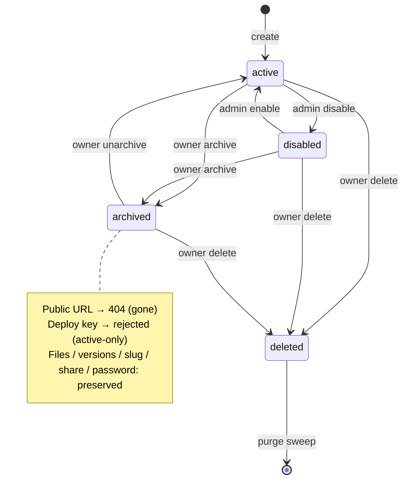

# feat: Canvas archiving / unarchiving + dashboard navigation

## Summary

Add an owner-initiated **archive** lifecycle state for canvases. Archiving takes a
canvas offline (its public/share URL returns 404 — "gone", restorable) while
preserving everything — files, versions, slug, share + password state — so
unarchiving brings it back live unchanged. Archived canvases are removed from the
main "Your canvases" list and reachable through the dashboard's **first secondary
navigation**: a top-bar nav plus a dedicated `/archived` view.

`archived` becomes a fourth value in the existing `status` enum
(`active | disabled | archived | deleted`), reusing the `disabled`/`deleted` rails
that already exist across the schema, the serve/auth decision table, and the
active-only deploy-key lookup. Because this touches the §12 auth surface, the
decision-table behavior is implemented test-first.

---

## Problem Frame

Owners accumulate canvases they're done with but don't want to delete. Today the
only lifecycle exits are `disabled` (admin takedown, 403) and `deleted` (soft
delete → purge). There is no owner-controlled, reversible "retire this" state, and
the dashboard is a single flat list with no way to file things away or navigate
between views — the top bar has no secondary navigation at all.

**Goal:** let an owner archive/unarchive their own canvases, take archived canvases
offline cleanly, keep them fully restorable, and give the dashboard real navigation
to reach them.

**Design decisions (confirmed in planning interview):**
- Archived = **offline, restorable** — public/share URL returns 404; files kept.
- Modeled as a **new `status` enum value**, not an orthogonal flag (a canvas is in
  exactly one lifecycle state).
- Reached via a **dedicated Archive view + new top-bar navigation**.
- **Deploys are blocked** while archived (the Bearer-key lookup is active-only).
- The owner's own **public URL also 404s** while archived; they manage it from the
  dashboard, not the live slug.
- Archive is a **calm, reversible control, separate from the red "Danger zone"**
  (which stays delete-only).

---

## Requirements

- **R1.** An owner (or admin) can archive their own active or disabled canvas.
- **R2.** An owner (or admin) can unarchive an archived canvas, returning it to
  `active` with all settings intact.
- **R3.** While archived, the public/share URL returns 404 for everyone, including
  the owner — consistent with `deleted`/`disabled` being evaluated before
  owner-identity.
- **R4.** While archived, deploys via the Bearer key are rejected.
- **R5.** Archived canvases are excluded from the main "Your canvases" list and from
  any public gallery/listing query.
- **R6.** Archived canvases are reachable via a dedicated `/archived` dashboard view,
  exposed through new top-bar secondary navigation.
- **R7.** Archive and unarchive actions are audit-logged.
- **R8.** Schema parity and the dual-dialect CI matrix stay green; the `status` CHECK
  constraint accepts `archived` on both dialects.

---

## High-Level Technical Design

Canvas lifecycle as a state machine. Archiving adds the `archived` state and two
owner-driven transitions; `deleted` remains the terminal soft-delete state.



Serve/auth decision table ordering (extends `decideCanvasAccess`, `authorization.ts`).
Status checks precede owner-identity, so archived (like deleted/disabled) is opaque
even to the owner on the public path:

```
1. deleted   → 404 (gone)
2. archived  → 404 (gone; restorable, but opaque on the public path)   ← NEW
3. disabled  → 403 (admin takedown)
4. owner/admin → allow
5. not shared  → 404
6. share expired → 404
7. shared & live → allow (defer to password gate)
```

The deploy path needs **no decision-table change**: `findByApiKeyHash` already
matches `status = 'active'` only (`canvases.ts:216`), so an archived canvas's key is
inert automatically. R4 is enforced by that existing filter + a regression test.

---

## Key Technical Decisions

- **KTD-A — Enum value, not orthogonal flag.** `archived` joins the `status` CHECK
  constraint. Rationale: archive is mutually exclusive with the other lifecycle
  states in practice, it mirrors the `disabled` precedent exactly (one CHECK update
  per dialect, one decision-table branch), and it avoids forcing every status query
  to reason about two axes. Trade-off accepted: a canvas cannot be both
  admin-`disabled` and owner-`archived` simultaneously; the last transition wins.
- **KTD-B — Archived is opaque on the public path (404 for everyone).** Placed
  adjacent to `deleted` in the decision table, before the owner/admin allow branch.
  Keeps the table simple and leaks nothing; the owner manages archived canvases
  through the dashboard management API (`findById`), never the live slug.
- **KTD-C — Reuse `setStatus`; add intent-named repo wrappers + guarded
  transitions.** `setStatus` already avoids touching `deletedAt` for non-deleted
  statuses. Add `archive`/`unarchive` semantics with a guard so unarchive only
  applies to a currently-archived row and archive only to a non-deleted row.
- **KTD-D — List filtering split by view.** The main list excludes `archived`; a new
  archived query returns `archived` only. Both continue to exclude `deleted`.
- **KTD-E — New navigation is additive and org-agnostic.** Secondary nav in the top
  bar (Canvases / Archived) is the first such structure; keep it re-skinnable and
  free of org-specific naming (BUILD_BRIEF org-agnostic rule).

---

## Scope Boundaries

**In scope:** the `archived` status value + constraint (both dialects), repository
archive/unarchive + list filtering, the serve/auth decision-table branch, the
owner-facing archive/unarchive management endpoints + audit logging, the deploy-block
regression coverage, the dashboard data layer (API client, queries, status badge),
the top-bar secondary navigation, the `/archived` route, and the archive/unarchive UI
controls.

### Deferred to Follow-Up Work
- **Bulk archive** (multi-select archive from the list) — single-canvas only here.
- **Auto-archive policies** (e.g. "archive canvases untouched for N days").
- **Archived retention / auto-purge** — archived canvases live indefinitely until the
  owner deletes them; no new purge behavior.
- **Public gallery archived-exclusion query** is handled defensively here (U4) only if
  a gallery listing query already exists; the gallery serve surface itself is a later
  plan (areas F/G). If no gallery query exists yet, this is a forward note for that
  plan, not work in this one.

### Non-goals
- Changing `disabled` (admin takedown) or `deleted` (soft-delete) semantics.
- Any change to how versions/files are stored or purged.

---

## Implementation Units

### U1. Add `archived` to the status enum + type

**Goal:** `archived` is a valid `status` everywhere — type, both schema dialects,
and the CHECK constraint.

**Requirements:** R8 (and enables R1–R7).

**Dependencies:** none.

**Files:**
- `packages/shared/src/db/types.ts` — extend `CanvasStatus` union with `"archived"`.
- `packages/shared/src/db/schema.sqlite.ts` — update `canvases_status_chk` to include `'archived'`; update the inline `// active | disabled | deleted` comment.
- `packages/shared/src/db/schema.pg.ts` — same CHECK + comment update, in lockstep.
- `packages/shared/src/db/schema.test.ts` — parity assertions.

**Approach:** mechanical lockstep edit across both dialect builders + the shared type.
No data migration needed (additive constraint value; no existing rows use it). Confirm
the dev/test DB is recreated from schema (no separately-applied migration file) so the
new CHECK takes effect; if a migration artifact exists, add the matching constraint
change for both dialects.

**Patterns to follow:** the existing `status` CHECK and the `disabled` value;
`docs/solutions/…dual-dialect-drizzle-seam.md`.

**Test scenarios:**
- Covers R8. Schema-parity test stays green with the new value present in both dialects.
- Inserting a canvas row with `status = 'archived'` succeeds on both sqlite and pg.
- Inserting `status = 'bogus'` is still rejected by the CHECK on both dialects.

---

### U2. Repository: archive/unarchive + list filtering

**Goal:** repository methods to transition to/from `archived` and queries that
partition the owner's canvases into active-view vs archived-view.

**Requirements:** R1, R2, R5, R7 (data layer).

**Dependencies:** U1.

**Files:**
- `apps/server/src/db/repositories/canvases.ts`
- `apps/server/src/db/repositories/canvases.test.ts`

**Approach:**
- Add `archive(id)` and `unarchive(id)` (or a single guarded `setLifecycle`) built on
  the existing `setStatus` machinery. `archive` sets `status='archived'`,
  `updatedAt=now`, and does **not** set `deletedAt`. `unarchive` sets
  `status='active'`. Guard transitions: archive only a non-`deleted` row; unarchive
  only a currently-`archived` row (return a boolean / affected-row signal so the route
  can 409/404 on an invalid transition rather than silently no-op).
- `listByOwner` (active view): exclude `archived` **and** `deleted`
  (currently only excludes `deleted` at `canvases.ts:87`).
- Add `listArchivedByOwner(ownerId)`: `status = 'archived'`, newest-first.
- Leave `findByApiKeyHash` (active-only) untouched — it already blocks archived deploys.

**Patterns to follow:** existing `setStatus`, `listByOwner`, `listDeletedBefore` query
shapes in the same file.

**Test scenarios:**
- Covers R1. `archive` on an active canvas → `status='archived'`, `deletedAt` stays null.
- `archive` on a disabled canvas → `status='archived'` (last-transition-wins, KTD-A).
- Covers R2. `unarchive` on an archived canvas → `status='active'`, settings (shared,
  passwordHash, slug, currentVersionId) unchanged.
- `unarchive` on a non-archived canvas → no-op signal (false/0 rows) so the route can reject.
- `archive` on a deleted canvas → rejected/no-op (don't resurrect a tombstone).
- Covers R5. `listByOwner` excludes archived and deleted; includes active + disabled.
- `listArchivedByOwner` returns only archived, newest-first; excludes everything else.

---

### U3. Serve/auth decision table + deploy-block coverage

**Goal:** archived canvases 404 on the public/share path for everyone; archived
deploys are proven rejected.

**Requirements:** R3, R4.

**Dependencies:** U1 (U2 not strictly required — operates on a `Canvas` row).

**Execution note:** invariant-critical (§12.0). Start with the failing
decision-table tests before editing `decideCanvasAccess`.

**Files:**
- `apps/server/src/canvas/authorization.ts` — add the `archived → 404` branch adjacent to `deleted`; update the ordered-table doc comment.
- `apps/server/src/canvas/authorization.test.ts`
- `apps/server/src/routes/deploy-api.test.ts` — archived-deploy regression (mirror the existing disabled-key test at `deploy-api.test.ts:65`).

**Approach:** insert the `archived` check between the `deleted` and `disabled`
branches so a status check precedes the owner/admin allow (KTD-B). Reason string
`"archived"` internally, but the response is the generic 404 body (don't leak the
distinction to visitors). No change to `findByApiKeyHash` — U3 adds the test proving
the active-only filter already rejects an archived canvas's key.

**Patterns to follow:** the existing `deleted`/`disabled` branches and their tests;
`docs/solutions/2026-06-13-auth-invariant-checklist.md`.

**Test scenarios:**
- Covers R3. Archived canvas + anonymous visitor → deny 404.
- Covers R3. Archived canvas + **owner** → deny 404 (status precedes owner-identity).
- Covers R3. Archived canvas + admin → deny 404.
- Archived + shared + valid share window → still 404 (archive overrides share).
- Ordering: a row that is archived is never evaluated against the share/password branches.
- Covers R4. A Bearer key for an archived canvas → deploy rejected (parity with the
  disabled-key 401/404 test).

---

### U4. Management API: archive/unarchive endpoints + list filtering + audit

**Goal:** owner-facing endpoints to archive/unarchive, the archived list endpoint, and
the main list reflecting the exclusion — all audit-logged and ownership-guarded.

**Requirements:** R1, R2, R5, R6 (data contract), R7.

**Dependencies:** U2.

**Files:**
- `apps/server/src/routes/management.ts`
- `apps/server/src/routes/management.test.ts`

**Approach:**
- `POST /:id/archive` and `POST /:id/unarchive` (both `sameOrigin`), resolving the
  canvas via the existing `ownedCanvas` guard (owner-or-admin, else 404). Invalid
  transitions (e.g. unarchive a non-archived canvas) → 409. Record audit actions
  `canvas_archive` / `canvas_unarchive` (mirror `canvas_create` /
  `canvas_delete` at `management.ts:105` / the delete route `:194`).
- List exposure for the archived view: prefer a dedicated `GET /archived` (returns the
  archived-only list, same last-deploy enrichment as `GET /`) over a query param, for a
  clean cacheable contract. The main `GET /` now returns active+disabled only (driven by
  U2's `listByOwner` change) — verify its enrichment path is unaffected.
- `publicCanvas` already serializes `status` (`management.ts:62`); no shape change.
- **Defensive gallery check:** if a public gallery/listing query exists, ensure it
  filters to `active` (excludes archived). If none exists yet, leave a code comment /
  forward note (see Scope Boundaries) — do not invent the gallery surface here.

**Patterns to follow:** `ownedCanvas`, the `app.delete("/:id")` → `setStatus("deleted")`
+ audit pattern, the `GET /` last-deploy batch enrichment (`management.ts:110`).

**Test scenarios:**
- Covers R1. Owner POSTs `/archive` on their active canvas → 200; canvas now archived;
  audit row `canvas_archive` written.
- Covers R2. Owner POSTs `/unarchive` → 200; canvas active again; audit `canvas_unarchive`.
- Non-owner (not admin) POSTs `/archive` → 404 (don't confirm existence).
- Admin POSTs `/archive` on another owner's canvas → 200.
- `/unarchive` on a non-archived canvas → 409.
- `/archive` on a deleted canvas → 404 (ownedCanvas already excludes deleted).
- Covers R5. `GET /` omits archived canvases; `GET /archived` returns only them, with
  last-deploy summaries.
- Same-origin enforcement: cross-origin archive/unarchive → rejected.

---

### U5. Dashboard data layer: API client, queries, status badge

**Goal:** typed client + React Query hooks for archive/unarchive and the archived
list, plus the `archived` status badge.

**Requirements:** R6 (client), R1/R2 (client).

**Dependencies:** U4.

**Files:**
- `apps/dashboard/src/lib/api.ts` — `archiveCanvas(id)`, `unarchiveCanvas(id)`, `listArchivedCanvases()`; extend the `status` typing if narrowed.
- `apps/dashboard/src/lib/queries.ts` — `useArchiveCanvas`, `useUnarchiveCanvas` mutations (invalidate both `keys.canvases` and the archived key), `useArchivedCanvases`, and an `archived` query key.
- `apps/dashboard/src/components/Badge.tsx` — add `archived` to the `StatusBadge` map (neutral/muted tone + label "Archived").

**Approach:** mirror `deleteCanvas` (`api.ts:270`) and `useDeleteCanvas` for the
mutation shape. Mutations must invalidate the active list **and** the archived list so
a canvas visibly moves between views. The archived query mirrors `useCanvases`.

**Patterns to follow:** existing `api` object methods, `keys`/`useQuery`/mutation
patterns in `queries.ts`, the `StatusBadge` map (`Badge.tsx:28`).

**Test scenarios:**
- Test expectation: none for the thin client wrappers beyond type-checking; behavior is
  covered by U4 (server) and U7 (UI interaction). If the repo has client-layer tests,
  add: `archiveCanvas` issues `POST /api/canvases/:id/archive`; `useArchiveCanvas`
  invalidates both list keys on success.

---

### U6. Top-bar secondary navigation + `/archived` route

**Goal:** the dashboard's first secondary nav (Canvases / Archived) and a working
`/archived` view; the main list excludes archived.

**Requirements:** R5, R6.

**Dependencies:** U5.

**Files:**
- `apps/dashboard/src/app-layout.tsx` — add a secondary nav (Canvases / Archived links) to the top bar, with active-route styling; keep "Create canvas" + theme.
- `apps/dashboard/src/router.tsx` — register the `/archived` route.
- `apps/dashboard/src/routes/archived.tsx` — **new**: archived list view (uses `useArchivedCanvases`), with its own empty state ("No archived canvases").
- `apps/dashboard/src/routes/index.tsx` — consume the now-archived-excluding list; extract the `Row`/`ListSkeleton` into a shared component reused by both views.

**Approach:** extract the existing local `Row` + `ListSkeleton` from `index.tsx` into a
shared list component so the active and archived views render identically (badges,
last-deploy line, copy/open actions), differing only in data source, heading, row
actions, and empty state. Keep the nav org-agnostic and re-skinnable (KTD-E). Active
nav state should reflect the current route.

**Patterns to follow:** existing `Link`/nav styling in `app-layout.tsx`, the `EmptyState`
component, the route registration pattern in `router.tsx`, the `Row` markup in `index.tsx`.

**Test scenarios:**
- Test expectation: none beyond rendering if the dashboard has no component test harness.
  If it does: the Archived view renders only archived canvases and shows the empty state
  when none exist; the main list no longer renders archived canvases; nav highlights the
  active route. Otherwise verify via the manual checklist in Verification.

---

### U7. Archive / unarchive UI actions

**Goal:** owners can archive from the canvas (detail/settings + row action) and
unarchive from the Archive view (and detail), with clear feedback.

**Requirements:** R1, R2.

**Dependencies:** U5, U6.

**Files:**
- `apps/dashboard/src/routes/canvas.settings.tsx` — an "Archive" control in its own section, **separate from the red Danger zone** (which stays delete-only); when the canvas is already archived, show "Unarchive" instead.
- `apps/dashboard/src/routes/archived.tsx` — per-row "Unarchive" action (+ optionally "Delete").
- `apps/dashboard/src/routes/index.tsx` (shared row component) — per-row "Archive" action.

**Approach:** wire the U5 mutations with toasts and query invalidation. Archive is a
calm, single-click reversible action (a light confirm at most — not the press-and-hold
used for delete). Unarchive is single-click. On success, the canvas moves between the
active and archived views (both lists invalidated). Reflect archived state in the
detail/settings header (badge from U5).

**Patterns to follow:** the existing settings action buttons + `toast` usage, the
delete confirm pattern in `canvas.settings.tsx` (use a *lighter* affordance for the
reversible archive), the row action layout in `index.tsx`.

**Test scenarios:**
- Test expectation: none if no UI test harness; cover via Verification checklist.
  If a harness exists: clicking Archive calls the mutation, shows a success toast, and
  the canvas leaves the active list; clicking Unarchive returns it; the settings page
  swaps Archive↔Unarchive based on current status.

---

## System-Wide Impact

- **Auth invariant surface (§12.0):** U3 modifies the canvas access decision table —
  the single highest-risk surface. Test-first; run `/ce-code-review` before the PR per
  the auth-change rule in AGENTS.md.
- **Dual-dialect (Risk #2):** U1 touches both schema builders + the CHECK constraint;
  parity test + CI matrix must stay green on sqlite and pg.
- **Deploy API:** behavior change (archived keys rejected) is implicit via the
  active-only lookup; covered by regression test, no code change to that path.
- **Dashboard IA:** introduces the first secondary navigation — a structural addition
  other future views (gallery, settings) can hang off.

---

## Risks & Mitigations

- **Decision-table ordering regression** — placing `archived` wrong could leak the
  canvas or mis-handle owner access. *Mitigation:* exhaustive ordered-branch tests
  (U3), including the owner-sees-404 case.
- **List leakage** — forgetting to exclude `archived` from a list/gallery query would
  surface archived canvases. *Mitigation:* explicit exclusion + tests in U2/U4; the
  defensive gallery check in U4.
- **Stale dashboard views** — a mutation that invalidates only one list key would leave
  a canvas appearing in both/neither view. *Mitigation:* both list keys invalidated on
  every archive/unarchive (U5), asserted where a harness exists.
- **Migration/constraint application** — if the project applies migrations separately
  from schema recreation, the new CHECK value must be applied both ways. *Mitigation:*
  U1 verifies how constraints reach the dev/test DB before assuming recreation.

---

## Verification

- `pnpm typecheck`, `pnpm lint`, and full dual-dialect `pnpm test` green.
- Manual: create a canvas, deploy, open its live URL (200) → archive it → live URL now
  404; it disappears from "Your canvases" and appears under Archived; a Bearer-key
  deploy is rejected → unarchive → live URL 200 again, back in the main list, settings
  intact.
- Audit log shows `canvas_archive` / `canvas_unarchive` rows.
- `/ce-code-review` run on the branch (auth-surface change); findings fixed.

---

## Sources & Research

- Codebase: `packages/shared/src/db/schema.{sqlite,pg}.ts`,
  `packages/shared/src/db/types.ts`, `apps/server/src/db/repositories/canvases.ts`,
  `apps/server/src/canvas/authorization.ts`, `apps/server/src/routes/management.ts`,
  `apps/server/src/routes/deploy-api.ts`, `apps/dashboard/src/app-layout.tsx`,
  `apps/dashboard/src/routes/index.tsx`, `apps/dashboard/src/lib/{api,queries}.ts`,
  `apps/dashboard/src/components/Badge.tsx`.
- Learnings: `docs/solutions/2026-06-13-auth-invariant-checklist.md`,
  `docs/solutions/…dual-dialect-drizzle-seam.md`.
- No external research required — the change reuses well-established local patterns
  (`disabled`/`deleted` status precedent, soft-delete machinery, existing route + query
  conventions).
