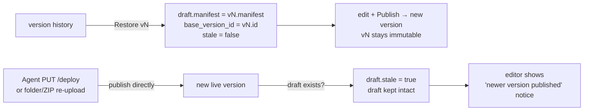

# feat: Editor + draft/publish version model on content-addressed storage

## Summary

This is milestone **M5** (BUILD_BRIEF §16): make iterating a canvas excellent. Three things land together in one branch / one PR:

1. **Content-addressed storage.** Canvas file bytes move from per-version copies (`versions/{versionId}/{path}`) to blobs keyed by content hash, namespaced per canvas (`canvases/{canvasId}/blobs/{sha256}`). A version becomes a *manifest* (`path → {size, hash, mime}`) over shared blobs, so a redeploy that changes one file writes one blob, not a full copy.
2. **Mutable draft + explicit Publish.** Each canvas has one mutable draft. The in-browser editor/file-manager mutate the draft (autosaved, **no version created**). An explicit **Publish** freezes the draft manifest into a new immutable published version and swaps the live pointer. Editing an old version = **restore it into the draft**, then republish. Agents/uploads still publish directly; a held draft is preserved and flagged **stale**.
3. **In-browser file manager + CodeMirror 6 editor** over the draft, with clear draft state (unpublished-changes indicator, Publish affordance, stale notice) and an owner-only draft preview.

**Decided forks (locked with Mark, 2026-06-13):**
- **Blob namespace: per-canvas** (`canvases/{canvasId}/blobs/{sha256}`) — dedup within a canvas, canvas-scoped mark-sweep GC, purge deletes the canvas prefix, no cross-canvas coupling.
- **Draft preview: dashboard-origin** — owner-only, same-origin management route streaming draft blobs into an editor iframe. The **public canvas origin serves only published versions**.
- **Editor scope: full per brief** — file manager (tree/add/rename/delete/replace) + CodeMirror with syntax for common web types — all this round.
- **Greenfield, breaking changes allowed** — no migration, no backfill, no re-keying of existing data; the storage layout is rebuilt from scratch and local dev data is cleared ([[greenfield-data-clearable]]).

**Target repo:** canvas-drop (this repo). All paths repo-relative.

---

## Problem Frame

Today storage is keyed per version (`versions/{versionId}/{path}` — `apps/server/src/canvas/storage-keys.ts`), so **every** version is a full copy of all its files, even though `apps/server/src/deploy/engine.ts` already computes a `sha256` per file for the manifest. The brief's old "save = new version" model (D11, §6.2.4/5) layered on top of that would produce version explosion (a version per keystroke-save) *and* storage waste (each version copies everything). M5 fixes both: content-addressing removes the duplication; the draft/publish split removes the version spam. The result is the natural next step on the canvas-management thread that #7–#11 have been building.

The hard part is **data integrity at the blob layer**: with bytes shared across versions and the draft, pruning can no longer blind-delete a version's prefix — it must delete only blobs that no surviving version *or* the draft references (R8 / AE4). This plan treats blob reclamation as a per-canvas mark-sweep and documents the narrow concurrency window, consistent with how the repo already documents the prune-vs-rollback and purge-vs-deploy races.

---

## Requirements traceability

Carried from the origin requirements doc (all R/F/AE IDs are that doc's):

| Origin ID | Where it lands |
|-----------|----------------|
| R1–R5 (brief reconciliation) | **Already done** in the brief by the resequence brainstorm (§7/§16 rewritten, archive re-tagged). Not re-done here; this plan *is* the milestone those edits named. |
| R6 (content-addressed blobs) | U1, U3 |
| R7 (version = manifest, not copy) | U1, U3 (manifest already path→{size,hash,mime}; storage stops copying) |
| R8 (refcount/mark-sweep prune) | U5 — AE4 |
| R9 (serve resolves manifest, streams by hash, caching preserved) | U4 |
| R10 (one mutable draft, based on live version or empty) | U2, U6 |
| R11 (editor mutations → draft, autosave, no version) | U6, U8 — AE1, AE2 |
| R12 (Publish freezes draft → new version, atomic swap) | U6 — AE2, AE3 |
| R13 (draft previewable without publishing) | U7, U8 |
| R14 (restore version → draft) | U6 — AE3 |
| R15 (deploy API / re-upload publish directly; held draft preserved + stale) | U6, U9 — AE5 |
| R16 (file manager: tree/add/rename/delete/replace) | U8 |
| R17 (CodeMirror 6 over draft, syntax-aware) | U8 |
| R18 (draft state: unpublished indicator, Publish, stale notice) | U8 |
| F1 (edit & publish), F2 (edit old version), F3 (agent publishes under draft) | U6 (server), U8 (UI), U9 (integration) |

---

## Key Technical Decisions

**KTD-1 — Per-canvas content-addressed blobs.** Replace `versionPrefix`/`versionStorageKey` with `canvasBlobPrefix(canvasId)` = `canvases/{canvasId}/blobs/` and `blobKey(canvasId, hash)` = that prefix + `hash`. Dedup is within a canvas, which is all AE1 requires. Refcount stays canvas-local; purge stays "delete the canvas prefix." No cross-canvas blob sharing → no global refcount, no cross-canvas data-lifecycle coupling (trust model, [[trust-model-calibration]]).

**KTD-2 — Draft is a dedicated table, versions stay published-only.** A `drafts` table holds **one row per canvas** (unique `canvas_id`): `manifest` (JSON `path→{size,hash,mime}`), `base_version_id` (nullable — the version it was derived from), `stale` (bool), `created_at`, `updated_at`. Keeping the draft out of `versions` means the per-canvas `number` sequence and keep-last-10 cap remain **published-only** (the origin's assumed-yes), and the existing rollback/prune race logic is untouched. (Alternative considered: a `versions.status='draft'` row — rejected because it pollutes the number sequence and the prune query, and complicates "exactly one draft.")

**KTD-3 — Publish is a manifest operation, not a byte copy.** Editor draft-writes upload bytes and write the blob *during editing*, so by Publish time every referenced blob already exists. Publish = create a `ready` version row whose `manifest` = the draft's current manifest, then the existing atomic `setCurrentVersion` swap, then async GC. No file copying; effectively instant (AE2/AE3). Restore = copy a chosen version's manifest into the draft row (blobs already present because that version references them).

**KTD-4 — Blob GC is a per-canvas mark-sweep, run async after publish/deploy.** Live hash set = union of `manifest` hashes across (all `ready` versions of the canvas) ∪ (the canvas's draft). GC lists `canvasBlobPrefix(canvasId)` and deletes blobs whose hash ∉ live set. This subsumes both version-row pruning *and* draft-churn orphans (a file edited h1→h2 leaves h1 unreferenced) in one sweep. Version **row** pruning (keep-last-10) stays separate and keeps its atomic live-pointer guard (`pruneBeyond`), but **no longer deletes storage** — GC owns blob deletion. Failed deploys also leave blobs for GC rather than deleting inline (a failed deploy's blob may be shared with the live version — never delete inline). The narrow race (a concurrent publish referencing a blob GC is about to sweep) is documented and accepted at D13 scale; blob puts are idempotent, so a re-publish/re-deploy heals any wrongly-swept blob, and serve already 404s a missing asset rather than crashing. See [[purge-vs-deploy-race]], [[canvas-hosting-deploy-patterns]].

**KTD-5 — Caching semantics unchanged (R9).** Serve still ETags with the file's content hash and applies `immutable` only to content-hashed filenames, `no-cache` otherwise (`apps/server/src/canvas/serve.ts`). The only change is the storage key: `blobKey(canvas.id, entry.hash)` instead of `versionStorageKey(version.id, path)`. Conditional-GET 304s are unaffected.

**KTD-6 — Draft preview is owner-only on the dashboard origin.** A same-origin management route (`GET /api/canvases/:id/preview/*`, owner-only, `ownedCanvas` guard) resolves the draft manifest and streams blobs with the same resolver as `serveCanvas` (extract the pure `resolveAsset` so both share it). Preview responses are `no-store` and never cache. The public canvas origin (`/c/{slug}/` or `{slug}.{base}`) is untouched and serves only published versions — drafts never transit the public origin.

**KTD-7 — Last-publish-wins, no locking (R15 / F3).** A direct publish (deploy API, folder/ZIP re-upload, paste) sets the canvas's draft `stale = true` if a draft exists, but never overwrites or merges it. The editor shows a "a newer version was published" notice; publishing the draft afterward proceeds and wins. No locks, no draft branching (origin "outside this milestone's identity").

---

## High-Level Technical Design

### Storage & model shift

```
BEFORE                                  AFTER
versions/{versionId}/{path}  = bytes    canvases/{canvasId}/blobs/{sha256} = bytes
version.manifest: path→{size,hash,mime} version.manifest: path→{size,hash,mime}   (unchanged shape)
                                        drafts(canvas_id PK-unique): manifest, base_version_id, stale
serve: get(versionKey(vId,path))        serve: get(blobKey(canvasId, entry.hash))
prune: delete version prefix            prune rows (keep 10) + async mark-sweep GC over canvas blobs
```

### Edit → Publish (F1)

```mermaid
sequenceDiagram
    participant U as Owner (editor)
    participant M as Management API
    participant D as drafts repo
    participant S as Storage (blobs)
    participant V as versions repo
    participant C as canvases repo
    U->>M: open editor (GET draft)
    M->>D: get-or-create draft from currentVersion manifest (or empty)
    U->>M: save file X (bytes)
    M->>S: put blobKey(canvasId, sha256(X))  (idempotent)
    M->>D: draft.manifest[X] = {size,hash,mime}; updated_at; stale=false
    Note over U,D: repeat per edit — NO version created (AE2)
    U->>M: Publish
    M->>V: create ready version (manifest = draft.manifest)
    M->>C: setCurrentVersion (atomic swap)
    M-->>U: new published version is live
    M->>S: async GC (mark-sweep unreferenced blobs, KTD-4)
```

### Restore old version (F2) / Agent publishes under draft (F3)



---

## Output Structure

New files this milestone (existing files modified in place are listed per-unit):

```
apps/server/src/
  canvas/
    storage-keys.ts            (rewritten: blobKey / canvasBlobPrefix)
    blob-gc.ts                 (new: per-canvas mark-sweep)
    asset-resolver.ts          (new: pure resolveAsset extracted from serve.ts)
  db/repositories/
    drafts.ts                  (new)
  draft/
    service.ts                 (new: get-or-create, write/rename/delete, publish, restore)
  routes/
    draft-api.ts               (new: draft CRUD + publish + restore + preview)
packages/shared/src/db/
    schema.sqlite.ts           (+drafts table)
    schema.pg.ts               (+drafts table)
    types.ts                   (+Draft types)
apps/dashboard/src/
  routes/
    canvas.editor.tsx          (new: file manager + editor route)
  components/
    FileTree.tsx               (new)
    CodeEditor.tsx             (new: CodeMirror 6 wrapper)
    PublishBar.tsx             (new: draft state, Publish, stale notice)
    DraftPreview.tsx           (new: preview iframe)
```

---

## Implementation Units

### U1. Content-addressed storage keys + `drafts` schema + shared types

**Goal:** Lay the storage + schema foundation: blob keying, the `drafts` table on both dialects, and the shared `Draft` types.
**Requirements:** R6, R7, R10.
**Dependencies:** none.
**Files:**
- `apps/server/src/canvas/storage-keys.ts` (rewrite: `canvasBlobPrefix(canvasId)`, `blobKey(canvasId, hash)`; remove `versionPrefix`/`versionStorageKey`)
- `packages/shared/src/db/schema.sqlite.ts`, `schema.pg.ts` (add `drafts` table, in lockstep)
- `packages/shared/src/db/types.ts` (add `Draft`, `NewDraft`; reuse `Manifest`/`ManifestEntry`)
- `packages/shared/src/db/schema.test.ts` (extend parity assertions to `drafts`)
- `apps/server/src/canvas/storage-keys.test.ts` (new)

**Approach:** `drafts` columns (build from `columns.ts` helpers, both dialects identical): `id` text PK, `canvasId` text notNull references `canvases.id`, `manifest` json (path→{size,hash,mime}, defaults to `{}`/empty), `baseVersionId` text nullable, `stale` bool notNull default false, `createdAt`/`updatedAt` epochMs notNull. Unique index on `canvas_id` (exactly one draft per canvas, R10). Mirror the existing `versions`/`canvases` table style (FK without cascade, app-generated UUIDv7).

**Patterns to follow:** `packages/shared/src/db/schema.sqlite.ts` `versions` table; column helpers in `columns.ts`; dual-dialect rules in [[dual-dialect-drizzle-seam]].

**Test scenarios:**
- `blobKey(canvasId, hash)` → `canvases/{canvasId}/blobs/{hash}`; `canvasBlobPrefix(canvasId)` is its prefix and `blobKey` starts with it.
- Hash with no path component never produces a nested key (blobs are flat under the prefix).
- Schema parity: `drafts` infers identical column types across sqlite/pg (extend `schema.test.ts` — the existing parity harness must stay green on both).
- `Test expectation: schema/keys only` for behavior — covered by the parity test + key unit tests; no runtime behavior yet.

---

### U2. Drafts repository + published-only version pruning

**Goal:** A repository for the single-draft-per-canvas lifecycle, and make `pruneBeyond` stop deleting storage (rows only).
**Requirements:** R10, R8 (row side).
**Dependencies:** U1.
**Files:**
- `apps/server/src/db/repositories/drafts.ts` (new)
- `apps/server/src/db/repositories/drafts.test.ts` (new)
- `apps/server/src/db/repositories/versions.ts` (modify `pruneBeyond`: keep the atomic live-pointer guard + row deletion; **remove** the storage-key collection; it now returns dropped rows for the caller's information only — GC owns storage)
- `apps/server/src/db/repositories/versions.test.ts` (update: prune deletes rows, not storage)

**Approach:** `draftsRepository` methods: `getByCanvas(canvasId)`, `upsert`/`create(canvasId, manifest, baseVersionId)`, `setManifest(canvasId, manifest)` (bumps `updatedAt`, clears `stale`), `markStale(canvasId)`, `deleteByCanvas(canvasId)` (for purge). Dual-dialect `any` seam exactly like `versionsRepository`. Enforce single-draft via the unique index + upsert-on-conflict.

**Patterns to follow:** `apps/server/src/db/repositories/versions.ts` (dialect seam, `client.dialect` table pick); `findByIds` empty-guard idiom.

**Test scenarios:**
- Create draft for a canvas, `getByCanvas` returns it; second create for the same canvas conflicts/updates (never two drafts).
- `setManifest` replaces manifest, bumps `updatedAt`, sets `stale=false`.
- `markStale` sets `stale=true` without touching `manifest`.
- `deleteByCanvas` removes the draft (purge path).
- Both dialects (sqlite + pglite) — run under the matrix.
- `pruneBeyond` deletes version **rows** beyond keep-N and never the live current row (existing race test preserved); asserts it no longer calls storage delete.

---

### U3. Deploy engine writes content-addressed blobs

**Goal:** The deploy engine writes each file to its blob key (idempotent, dedup within canvas), builds the manifest unchanged, and no longer copies per-version.
**Requirements:** R6, R7. Covers AE1 (one changed file → one new blob).
**Dependencies:** U1.
**Files:**
- `apps/server/src/deploy/engine.ts` (modify: write `blobKey(canvas.id, hash)`; skip put when the hash was already written this deploy *or* `storage.exists` is true; drop inline `cleanupPending` storage deletes — leave orphans for GC)
- `apps/server/src/deploy/engine.test.ts` (update + new scenarios)

**Approach:** In the entry loop, after computing `hash`, set `manifest[path] = {size, hash, mime}` (unchanged) and enqueue a blob put keyed by `blobKey(canvas.id, hash)`. Maintain a per-deploy `Set<hash>` so the same content in two paths uploads once. Keep the bounded-concurrency `flush` batching (PUT_CONCURRENCY) and streaming one-file-at-a-time read (KTD-2 of M2). `markReady` + `setCurrentVersion` swap unchanged. Replace the `cleanupPending` failure path with a no-op/log (blobs reclaimed by GC; never delete inline because a blob may be shared with the live version). Trigger U5's GC where prune was triggered.

**Patterns to follow:** existing `deployEngine` structure; the `flush`/`Promise.allSettled` batching; [[canvas-hosting-deploy-patterns]].

**Test scenarios:**
- Deploy 20 files; redeploy changing 1 file → exactly 1 new blob written, 19 reuse existing blob keys (AE1). Assert via storage put counts / `exists` short-circuit.
- Two files with identical bytes in one deploy → one blob put, manifest has both paths pointing at the same hash.
- Manifest entries still `{size, hash, mime}`; `index.html`-missing warning logic preserved.
- Failed deploy (oversize file mid-stream) → live version's blobs untouched; no inline storage delete of shared blobs; throws the right `DeployError` code.
- Empty deploy still throws `EMPTY_DEPLOY`.
- Concurrent-deploy number-collision retry preserved.

---

### U4. Serve canvases from blobs

**Goal:** Serving resolves the live version's manifest and streams bytes by blob hash, preserving all caching/ETag/security semantics.
**Requirements:** R9.
**Dependencies:** U1, U3.
**Files:**
- `apps/server/src/canvas/asset-resolver.ts` (new: extract the pure `assetPathFor` + `resolveAsset` so serve and preview share one resolver)
- `apps/server/src/canvas/serve.ts` (modify: import resolver; `storage.get(blobKey(canvas.id, entry.hash))`)
- `apps/server/src/canvas/serve.test.ts` (update existing serve tests for the new key)
- `apps/server/src/canvas/asset-resolver.test.ts` (move/keep the pure-resolution table tests)

**Approach:** Only the storage key changes (`blobKey(canvas.id, entry.hash)` vs `versionStorageKey(version.id, path)`). ETag stays `"${entry.hash}"`; `CONTENT_HASH_RE` immutable-vs-`no-cache` logic, 304 path, security headers, and the content-negotiated 404 page all unchanged. Extracting `resolveAsset`/`assetPathFor` into `asset-resolver.ts` is a pure refactor that U7 reuses.

**Patterns to follow:** current `serveCanvas`; keep `resolveAsset` pure and exhaustively unit-tested.

**Test scenarios:**
- Exact-file, directory-index, root-entry, single-HTML, SPA-fallback, and no-home/ambiguous resolutions all still resolve the same paths, now fetching by blob hash.
- ETag = content hash; `If-None-Match` match → 304 with cache + security headers, no body.
- Content-hashed filename → `immutable`; stable filename → `no-cache`.
- Manifest entry present but blob missing in storage → 404 `missing` (resilience, KTD-4 race).
- Never-published canvas (`currentVersionId` null) → `unpublished` 404 page.

---

### U5. Refcount-aware blob GC (prune + purge)

**Goal:** Reclaim storage by deleting only blobs no surviving version or draft references; rewire purge to the per-canvas blob prefix.
**Requirements:** R8. Covers AE4 (referenced blob retained).
**Dependencies:** U1, U2.
**Files:**
- `apps/server/src/canvas/blob-gc.ts` (new: `collectGarbage(canvasId)` mark-sweep)
- `apps/server/src/canvas/blob-gc.test.ts` (new)
- `apps/server/src/deploy/engine.ts` (call `collectGarbage` async after the pointer swap, replacing the storage side of `prune`; keep row-prune via `pruneBeyond`)
- `apps/server/src/canvas/purge.ts` (modify: delete `canvasBlobPrefix(canvas.id)` once per canvas instead of per-version prefixes; still delete version rows + draft row + clear pointer)
- `apps/server/src/canvas/purge.test.ts` (update)

**Approach:** `collectGarbage(canvasId)`: read all `ready` versions for the canvas + the draft; `liveHashes = new Set(union of manifest hashes)`; `existing = storage.list(canvasBlobPrefix(canvasId))` → map to hashes; `deleteMany(existing where hash ∉ liveHashes)`. Best-effort, log-and-continue (never blocks/fails a deploy), mirroring today's `prune`. Run **after** row-pruning so dropped versions aren't in the live set. Purge: a soft-deleted canvas dies whole, so list+delete the canvas blob prefix in one batched call (simpler than today's per-version listing) and add `drafts.deleteByCanvas`.

**Patterns to follow:** current `engine.prune` (async, `.catch`, `deleteMany`); `purgeDeletedCanvases` storage-first ordering; document the GC race in a `docs/solutions/` learning (U9).

**Test scenarios:**
- Canvas with v1{a,b,c}, v2{a,b,d}; prune drops v1; GC keeps a,b,d (a,b shared, d live), deletes c (AE4: a still-referenced blob is never deleted).
- Draft references a blob absent from every version → GC retains it; after the draft drops that file and a later sweep runs → it's deleted.
- Blob referenced only by a pruned (row-deleted) version and nothing live → deleted.
- GC on a canvas with no versions and an empty draft → deletes all stray blobs, no error.
- Storage `list`/`deleteMany` failure → logged, swallowed, deploy result unaffected.
- Purge: soft-deleted canvas → blob prefix gone, version rows gone, draft row gone, pointer cleared; re-run idempotent (reports zero).

---

### U6. Draft service + publish/restore + management API

**Goal:** Server-side draft lifecycle: get-or-create, file mutations (write/rename/delete), Publish, Restore, and stale-on-direct-deploy.
**Requirements:** R10, R11, R12, R14, R15. Covers AE2, AE3, AE5.
**Dependencies:** U2, U3, U5.
**Files:**
- `apps/server/src/draft/service.ts` (new)
- `apps/server/src/draft/service.test.ts` (new)
- `apps/server/src/routes/draft-api.ts` (new: owner-only, same-origin, mounted under management)
- `apps/server/src/routes/draft-api.test.ts` (new)
- `apps/server/src/routes/management.ts` (mount draft routes; on direct publish paths call `drafts.markStale`)

**Approach:** `draftService` over `draftsRepository` + `storage` + `versions`/`canvases` repos:
- `getOrCreate(canvas)` → existing draft, else create from `currentVersion.manifest` (or `{}` if never published); R10.
- `writeFile(canvas, path, bytes)` → validate path (reuse `normalizeEntryPath`), enforce per-file/canvas limits (reuse `LIMITS`), `mimeFor(path)`, `hash`, `storage.put(blobKey(canvas.id, hash))` idempotent, `draft.manifest[path]={size,hash,mime}`, `setManifest`. No version. R11/AE1.
- `renameFile`/`deleteFile`/`replaceFile` → manifest edits + `setManifest`; blobs left for GC.
- `publish(canvas, actorId)` → create `ready` version (`manifest = draft.manifest`, `source='editor'`), atomic `setCurrentVersion`, audit `publish`, async `pruneBeyond` + `collectGarbage`; draft kept (now equal to live, `stale=false`). R12/AE2/AE3. Empty draft → `EMPTY_DRAFT` error (no publishing nothing).
- `restore(canvas, versionNumber)` → `findReadyByNumber`, copy its manifest into the draft (`base_version_id=version.id`, `stale=false`). R14/AE3.
- `markStale` called by all **direct** publish routes (deploy API, folder/ZIP, paste) when a draft exists. R15/AE5/F3.

Add `'editor'` to the version `source` set (schema check + `DeploySource` type + the source check constraint in both dialect schemas).

**Patterns to follow:** `managementRoutes` `ownedCanvas` guard + `sameOrigin` on mutations; `deployResponse`/audit recording; `LIMITS`/`normalizeEntryPath` reuse from `deploy/`.

**Test scenarios:**
- Get-or-create: first open of a published canvas → draft manifest equals current version; brand-new canvas → empty draft (R10).
- Save several edits, no Publish → no new version row, live URL still serves prior version (AE2).
- Edit one of 20 files in the draft → one new blob, 19 reuse (AE1, at the service layer).
- Publish → new version number = prev+1, manifest = draft's, pointer swapped, audit `publish` recorded; immediately serveable (AE2/AE3).
- Restore v2 into draft, then Publish → new version (e.g. v4) from v2's contents; v2 row unchanged + immutable (AE3).
- Direct deploy API publish while a draft exists → new version live, draft preserved, `stale=true` (AE5/F3).
- Publish an empty draft → `EMPTY_DRAFT`, no version created.
- Path traversal / oversize file / too-many-files on draft write → rejected with the same stable codes as deploy.
- Non-owner hitting any draft route → 404 (owner-only); missing same-origin header on a mutation → rejected.

---

### U7. Owner-only draft preview endpoint

**Goal:** Stream the draft's files to the owner from the dashboard origin without publishing (R13).
**Requirements:** R13.
**Dependencies:** U4 (shared resolver), U6 (draft service).
**Files:**
- `apps/server/src/routes/draft-api.ts` (add `GET /:id/preview/*` — owner-only)
- `apps/server/src/routes/draft-api.test.ts` (extend)

**Approach:** Resolve the owned canvas → its draft manifest → reuse `asset-resolver.ts` `resolveAsset` (honoring `spaFallback`) → `storage.get(blobKey(canvas.id, entry.hash))` → respond with the correct MIME, **`Cache-Control: no-store`** (drafts are mutable), and the same `securityHeaders` as serve. 404 with the same reasons when the draft has no home / missing path. The route lives on the management/dashboard origin, owner-gated by `ownedCanvas`; draft bytes never touch the public canvas origin (KTD-6).

**Patterns to follow:** `serveCanvas` response shape minus caching; `ownedCanvas` guard.

**Test scenarios:**
- Owner previews draft root → draft's `index.html` (or single-HTML entry) bytes, `no-store`.
- Edited-but-unpublished file → preview shows the **draft** bytes while the public canvas URL still shows the **published** bytes (isolation).
- SPA-fallback draft → deep path resolves to the entry.
- Non-owner → 404; preview never appears on the public canvas origin.
- Draft with no home page → `no-home` 404.

---

### U8. In-browser file manager + CodeMirror editor (dashboard)

**Goal:** The editor UI over the draft: file tree (add/rename/delete/replace), CodeMirror 6 editing with autosave, draft-state surfacing, Publish, stale notice, and live preview.
**Requirements:** R11, R13, R16, R17, R18. Realizes F1/F2 in the UI.
**Dependencies:** U6, U7.
**Files:**
- `apps/dashboard/src/routes/canvas.editor.tsx` (new route + TanStack Query hooks)
- `apps/dashboard/src/components/FileTree.tsx` (new)
- `apps/dashboard/src/components/CodeEditor.tsx` (new — CodeMirror 6 wrapper)
- `apps/dashboard/src/components/PublishBar.tsx` (new — unpublished-changes indicator, Publish button, stale notice)
- `apps/dashboard/src/components/DraftPreview.tsx` (new — preview iframe pointing at U7)
- `apps/dashboard/src/routes/canvas.tsx` (add an "Edit" tab/link), `canvas.versions.tsx` (add "Restore to draft" action → U6 restore)
- dashboard tests: `apps/dashboard/src/test/editor.test.tsx`, `file-tree.test.tsx` (new)
- `apps/dashboard/package.json` (add CodeMirror 6 deps: `@codemirror/state`, `@codemirror/view`, language packages for html/css/js/json/markdown)

**Approach:** File tree from the draft manifest (paths → tree). Selecting a file loads its bytes (a draft-read endpoint or the preview route with a raw flag), opens in CodeMirror with the language extension chosen by extension (html/css/js/ts/json/md). Edits autosave (debounced) to the U6 `writeFile` endpoint; query invalidation refreshes draft state. `PublishBar` shows "unpublished changes" when the draft differs from the live version and a "newer version was published" banner when `stale`. Publish calls U6; success refetches versions + clears unpublished state. Preview iframe `src` = U7 route; refreshes on save. Restore action (from versions tab) calls U6 restore then routes into the editor. Match existing dashboard design tokens/components ([[dashboard-spa-patterns]]); reuse `Button`, `ConfirmDialog`, `Toast`, optimistic patterns already in the app.

**Patterns to follow:** existing routes (`canvas.versions.tsx`, `canvas.settings.tsx`), `DeployFiles.tsx`/`DeployButton.tsx` for upload/mutation flows, TanStack Query usage, design tokens; optimism-race learning in [[dashboard-spa-patterns]].

**Test scenarios:**
- File tree renders nested paths from a manifest; selecting a file opens its content in the editor.
- Editing + autosave fires the draft-write mutation (debounced, once per pause) and marks unpublished changes.
- Add file / rename / delete / replace update the tree and the draft (R16).
- CodeMirror loads the right language mode per extension (html/css/js/json/md) (R17).
- Publish button enabled only with unpublished changes; clicking publishes and clears the indicator (R18, F1).
- `stale` draft → "newer version was published" banner shown; publishing still proceeds (F3).
- Preview iframe loads the draft route and reflects an unsaved-then-saved edit (R13).
- "Restore to draft" from versions → routes into editor with that version's files (F2).
- Empty/loading/error states present (repo convention).

---

### U9. Assembly, agent-publish integration, end-to-end coverage, learnings

**Goal:** Wire everything into the app, prove the cross-cutting flows end-to-end, update `.env.example`/docs if needed, and capture learnings.
**Requirements:** R15 (integration), all F-flows end-to-end.
**Dependencies:** U1–U8.
**Files:**
- `apps/server/src/app.ts` (construct draft service/repo, mount draft routes, inject GC into deploy engine deps)
- `apps/server/src/deploy/deploy-api.ts` / `routes/deploy-api.ts` (ensure the Bearer-key deploy path calls `markStale` when a draft exists — F3/AE5 across the *programmatic* surface, not just management)
- `apps/server/src/app.test.ts` or a new `apps/server/src/integration/editor-flow.test.ts` (end-to-end)
- `docs/solutions/2026-06-13-content-addressed-draft-publish.md` (new learning: blob GC race + mark-sweep, draft/publish seam, per-canvas namespace rationale)
- `docs/plans/2026-06-13-005-...-plan.md` status note; brief pointers if any drift
- `.env.example` / `BUILD_BRIEF.md` only if a config var is introduced (none expected)

**Approach:** Final integration pass: dependency injection in `app.ts`, confirm the programmatic deploy API and all management publish paths mark a held draft stale (R15 is product-wide, not management-only). One end-to-end test exercising F1 (edit→publish→serve), F2 (restore→publish), F3 (agent deploy under a draft → stale), and AE1/AE4 at the integration layer. Run the full dual-dialect suite + lint + typecheck. Capture the blob-GC race decision and the content-addressed seam as a learning so it compounds.

**Patterns to follow:** `app.ts` wiring; existing integration tests; `/ce-compound` learning format; [[auth-invariant-checklist]] for the owner-only/same-origin review of the new routes.

**Test scenarios:**
- End-to-end F1: open editor → edit → publish → public canvas URL serves the new bytes; version history shows the new published version.
- End-to-end F2: restore an old version → edit → publish → new version; old version still immutable.
- End-to-end F3/AE5: hold a draft → `PUT /v1/canvases/:id/deploy` (Bearer key) → agent version live, draft intact + stale.
- AE1/AE4 at integration scale (blob counts after a one-file edit; retained-vs-swept blobs after prune).
- Full matrix green on sqlite + pglite; lint + typecheck clean.

---

## Scope Boundaries

**In scope (this milestone):** content-addressed per-canvas blob storage, draft/publish version model, blob mark-sweep GC, owner-only draft preview, in-browser file manager + CodeMirror editor, restore-to-draft, stale-draft handling.

**Deferred to follow-up work (later milestones, per §16):**
- Primitives (KV, files, `me()`, browser SDK) — M6.
- Admin panel + hardening — M7. Gallery — M8. AI proxy + realtime — M9. Deployment/OSS packaging — M10.
- In-draft undo history beyond the editor's own buffer (origin "nice-to-have, not required").
- Image preview / binary-file editing affordances in the file manager (`[v1.1]`, §6.5.8).

**Outside this milestone's identity (origin):** no draft branching/merging, no multi-draft per canvas, no collaborative/locked editing (last-publish-wins is deliberate at D13 scale); no server-side build step (static-first — the editor edits static files, it does not compile).

---

## Risks & Dependencies

- **R1 — Blob GC deletes a freshly-referenced blob (concurrency).** Mitigated by: GC runs after row-prune reading a fresh live set; idempotent blob puts; serve 404-resilience; D13 single-org scale. Documented as an accepted race (U9 learning), matching [[purge-vs-deploy-race]].
- **R2 — Dual-dialect drift on the new `drafts` table.** Mitigated by extending `schema.test.ts` parity assertions (U1) and the CI matrix on both dialects ([[dual-dialect-drizzle-seam]]).
- **R3 — New owner-only/same-origin surface (draft routes + preview).** Mitigated by reusing `ownedCanvas` + `sameOrigin` guards and a §12-style review (U9, [[auth-invariant-checklist]]); preview deliberately stays off the public canvas origin (KTD-6).
- **R4 — Editor UI is the largest unit.** Mitigated by leaning on existing dashboard components/tokens and TanStack patterns; the server contract (U6/U7) is fully specified before the UI starts.
- **Dependency:** the deploy engine already computes a per-file `sha256` (manifest), so content-addressing reuses an existing value rather than introducing new hashing.

---

## Execution posture

Feature-bearing units (U2–U9) are test-bearing — each lands with the scenarios above before moving on, full dual-dialect `test` + `lint` + `typecheck` green per unit (autonomous-round gates). U4 begins with a pure-resolver refactor under existing serve tests (characterization-preserving). The whole milestone ships as one branch → one PR → merge per the autonomous full-scope workflow ([[autonomous-round-workflow]]); a `/ce-code-review` pass with fixes precedes the PR.
