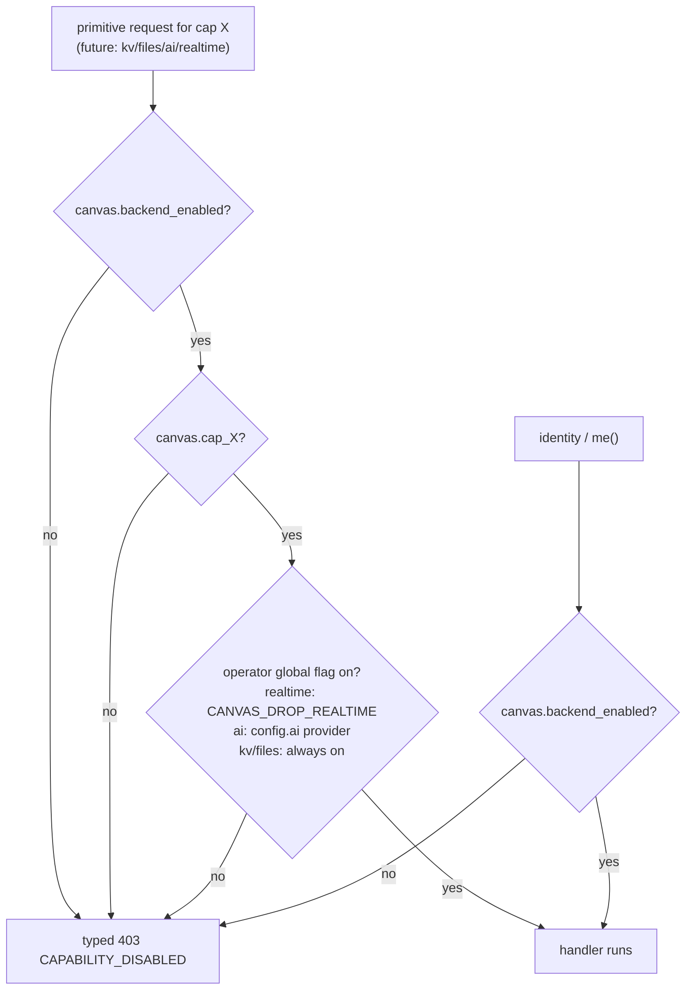
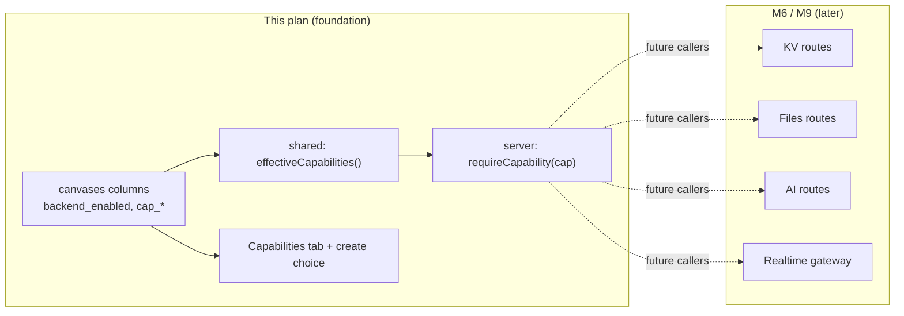

# feat: Canvas capabilities foundation (backend group + per-feature toggles)

## Summary

Introduce a per-canvas **capability model** so a creator decides whether a canvas
gets backend capability (KV, Files, AI, Realtime) and can toggle each feature
on/off — at creation **and** later in settings. The backend primitives don't
exist yet (M6/M9); this plan lays the **foundation** they slot into: the data
model, a single source-of-truth helper for "is capability X effective for this
canvas", a reusable server-side **capability guard** future primitive routes
call, and two UI surfaces (a create-time choice + a new **Capabilities** settings
tab). Identity (`me()`) is implicit-on whenever backend is enabled; it has no
separate toggle. The deploy/programmatic **API key is untouched** by this work.

This is greenfield (data clearable, no migrations — see memory: greenfield-data-clearable),
so the schema change is plain column additions on both dialects.

---

## Problem Frame

Today every canvas is implicitly "static + always gets a deploy API key." There
is no notion of *which backend capabilities a canvas exposes*. When the primitives
land (M6: KV/Files/Identity; M9: AI/Realtime), each primitive route will need to
ask "is this capability turned on for this canvas?" — and the dashboard needs a
place for owners to make that choice. Building the primitives first and bolting on
gating later would mean retrofitting auth-shaped checks across four route groups.

Instead, establish the capability seam **now**, while there's nothing to break, so
each future primitive is a thin handler behind one shared guard.

### Decisions locked during planning (interview)

- **Name:** umbrella settings surface is a **Capabilities** tab; **Backend** is one
  *group* within it (master toggle + the four feature toggles). The structure
  leaves room for future capability groups beyond Backend.
- **Not permanent:** backend availability is a normal toggle — set at creation,
  changeable in settings. (Earlier "permanent, gates the API key" framing was
  dropped once the API key's deploy-only role was clarified.)
- **Default off:** backend is **off** by default at creation; the four feature
  flags default **on** (so flipping backend on yields all-features-on with no
  extra writes).
- **Toggle set:** `kv`, `files`, `ai`, `realtime` are independently toggleable;
  `identity`/`me()` is always-on whenever backend is enabled (no column).
- **Storage:** discrete **boolean columns** (`backend_enabled`, `cap_kv`,
  `cap_files`, `cap_ai`, `cap_realtime`), not a JSON blob.
- **Enforcement:** build the **guard seam now** (`requireCapability`) so future
  primitive routes plug straight in.
- **API key:** unchanged — still issued for every canvas (deploy/programmatic per
  BUILD_BRIEF D7), decoupled from the capability choice.

---

## Prerequisites (execution setup)

Per the repo loop, execute this plan from a **fresh worktree off `main`** — the
current checkout sits on `feat/editor-draft-publish-version-model` with
uncommitted M5 work, so do not build here.

```
git worktree add ../canvas-drop-capabilities -b feat/canvas-capabilities main
```

Then enable the pre-push gate in the new worktree (`git config core.hooksPath
.githooks`) and `pnpm install`.

> This plan is a foundation that precedes/accompanies M6 (areas F/G/I/J). It does
> **not** implement any primitive — only the capability model the primitives read.

---

## Requirements Traceability

| ID | Requirement | Units |
|----|-------------|-------|
| R1 | A canvas stores whether backend is enabled + per-feature flags (kv/files/ai/realtime) | U1, U3 |
| R2 | Backend defaults off; feature flags default on; changeable at create and in settings | U3, U4, U6, U7 |
| R3 | A single helper computes *effective* capability = `backend_enabled AND cap_x AND operator global flag` | U2 |
| R4 | A reusable server guard returns a typed, catchable error when a capability is off — the seam future primitives call | U5 |
| R5 | Settings exposes a **Capabilities** tab with a **Backend** group; sub-toggles disabled while backend is off; identity shown always-on | U6 |
| R6 | The create flow offers a backend on/off choice (default off) for all create paths | U7 |
| R7 | Dual-dialect parity stays green; deploy API key behavior is unchanged | U1, U4 |

---

## High-Level Technical Design

**Effective-capability gate** — the one non-obvious rule, centralized in U2 and
consumed by the U5 guard (and mirrored read-only by the dashboard for disabling
sub-toggles):



**Data flow seam (foundation → future primitives):**



---

## Key Technical Decisions

- **KTD-1 — Boolean columns, defaults `backend_enabled=false`, `cap_*=true`.**
  Discrete columns over JSON (chosen in interview). Feature flags default true so
  enabling backend = all features live with no migration of intent. Greenfield →
  add columns directly to both dialect schemas via the shared `c.bool` helper; no
  data migration (memory: greenfield-data-clearable). Keep `schema.pg.ts` and
  `schema.sqlite.ts` in lockstep — the parity test (`schema.test.ts`) is the gate
  (see `docs/solutions/2026-06-13-dual-dialect-drizzle-seam.md`).

- **KTD-2 — Sub-toggles persist across backend off→on.** "All features on" is the
  *creation* default, not a re-enable reset. If a user disables `cap_ai`, turns
  backend off, then on again, `cap_ai` stays off (column persists). Least
  surprise; no special reset logic.

- **KTD-3 — Effective state ANDs the operator global flag.** A capability is live
  only if the operator hasn't globally disabled it. Realtime keys off
  `config.realtimeEnabled` (`CANVAS_DROP_REALTIME`); AI keys off the configured AI
  provider being present; KV/Files have no global off-switch today (always on when
  backend on). Centralized in U2 so the guard and future SDK degradation share one
  rule (BUILD_BRIEF §6.7 line 247: "typed, catchable error").

- **KTD-4 — Identity is implied, not a column.** `me()` is on iff
  `backend_enabled`. No `cap_identity` column; the guard treats `identity` as a
  capability whose only condition is backend-on. UI renders it as a non-editable
  "always on" row.

- **KTD-5 — API key stays decoupled.** `api_key_hash` remains `notNull`, generated
  for every canvas on create/regenerate exactly as today. The capability choice
  neither gates nor reveals the key. (Explicitly preventing a regression toward the
  dropped "no backend → no key" framing.)

- **KTD-6 — Guard returns a stable typed error.** `CAPABILITY_DISABLED` with the
  capability name, surfaced as 403, so the future browser SDK can throw a typed
  catchable error per the brief. Mirror the existing management error-code style
  (`NOT_ACTIVE`, `NOT_ARCHIVED` in `apps/server/src/routes/management.ts`).

---

## Output Structure

New files (repo-relative):

```
packages/shared/src/capabilities/
  index.ts            # capability taxonomy + types + effectiveCapabilities()
  index.test.ts
apps/server/src/canvas/
  capability-guard.ts  # requireCapability(cap) helper/middleware
  capability-guard.test.ts
apps/dashboard/src/routes/
  canvas.capabilities.tsx   # the Capabilities tab
apps/dashboard/src/test/
  capabilities.test.tsx
```

Modified: `schema.sqlite.ts`, `schema.pg.ts`, `schema.test.ts`,
`apps/server/src/db/repositories/canvases.ts` (+ test),
`apps/server/src/routes/management.ts` (+ test),
`apps/dashboard/src/routes/canvas.tsx` (tab nav), `new.tsx`, `lib/api.ts`,
`lib/mutations.ts`.

---

## Implementation Units

### U1. Capability columns on `canvases` (dual-dialect)

- **Goal:** Add `backendEnabled`, `capKv`, `capFiles`, `capAi`, `capRealtime`
  booleans to the canvases table on both dialects, keeping parity green.
- **Requirements:** R1, R7
- **Dependencies:** none
- **Files:** `packages/shared/src/db/schema.sqlite.ts`,
  `packages/shared/src/db/schema.pg.ts`,
  `packages/shared/src/db/schema.test.ts`
- **Approach:** Mirror the existing `shared`/`spaFallback` bool pattern via
  `c.bool(...)`. `backendEnabled` → `.notNull().default(false)`; the four `cap_*`
  → `.notNull().default(true)`. Add **identical** definitions to both files in the
  same position. No index needed (capabilities are read with the canvas row, never
  filtered on). No migration (greenfield). `Canvas`/`NewCanvas` types extend
  automatically (`$inferSelect`).
- **Patterns to follow:** the `shared`/`gallery*`/`spaFallback` columns already in
  `canvases`; shared column helpers in `packages/shared/src/db/columns.ts`.
- **Test scenarios:**
  - Parity: `schema.test.ts` asserts identical column shape across dialects with
    the five new columns present (it.each over `canvases`). Covers R7.
  - Defaults: inserting a canvas with no capability fields yields
    `backendEnabled=false`, all `cap_*=true` (assert via repository test in U3, or
    a direct insert assertion here).
- **Verification:** `pnpm test` green on both dialects; new columns visible in
  `$inferSelect`.

### U2. Capability taxonomy + `effectiveCapabilities` helper (shared)

- **Goal:** One source of truth for the capability set, the Backend grouping, and
  the effective-state computation, importable by both server and dashboard.
- **Requirements:** R3
- **Dependencies:** U1
- **Files:** `packages/shared/src/capabilities/index.ts`,
  `packages/shared/src/capabilities/index.test.ts`; export from
  `packages/shared/src/index.ts` (or the existing barrel).
- **Approach:** Define `CAPABILITY_KEYS = ["kv","files","ai","realtime"] as const`
  and a `CAPABILITY_GROUPS` structure (`{ backend: { label, capabilities: [...] } }`)
  so the UI and future groups read from one place. Export a pure
  `effectiveCapabilities(canvas, config)` returning `{ identity, kv, files, ai,
  realtime }` booleans, applying KTD-3/KTD-4: `identity = backend_enabled`; each
  feature = `backend_enabled && canvas.cap_x && globalOn(x, config)`. `globalOn`
  reads `config.realtimeEnabled` for realtime and AI-provider presence for ai;
  returns true for kv/files. Keep the config dependency narrow (accept just the
  flags it needs, not the whole Config, to stay test-friendly).
- **Patterns to follow:** existing pure helpers in `packages/shared`; config shape
  from `packages/shared/src/config/env.ts` (`realtimeEnabled`, `ai`).
- **Test scenarios:**
  - Backend off → every key (including identity) false, regardless of `cap_*`.
  - Backend on, all caps true, all global flags on → all true.
  - Backend on, `cap_ai=false` → `ai` false, others true.
  - Realtime: `cap_realtime=true` but `config.realtimeEnabled=false` → `realtime`
    false. Covers R3 global-AND.
  - AI: `cap_ai=true` but no AI provider configured → `ai` false.
  - Identity: `backend_enabled=true` → `identity` true even with all `cap_*` false.
- **Verification:** helper unit tests green; imported cleanly from server + dashboard.

### U3. Repository: create defaults + capability update

- **Goal:** Persist capability state on create and expose an update path.
- **Requirements:** R1, R2
- **Dependencies:** U1
- **Files:** `apps/server/src/db/repositories/canvases.ts`,
  `apps/server/src/db/repositories/canvases.test.ts`
- **Approach:** Extend `CreateCanvasInput` with optional `backendEnabled` (default
  applied in `create()` insert; rely on column defaults when omitted). Add
  `updateCapabilities(id, patch)` accepting any subset of `{ backendEnabled, kv,
  files, ai, realtime }` and writing the corresponding `cap_*`/`backend_enabled`
  columns + `updatedAt` (mirror the `updateSettings` undefined-skip pattern). Do
  **not** clear `cap_*` when `backendEnabled` flips false (KTD-2).
- **Patterns to follow:** existing `updateSettings`/`setPassword` methods in the
  same file (undefined-means-unchanged, `.returning()`).
- **Test scenarios:**
  - Create with no capability input → `backend_enabled=false`, `cap_*=true`.
  - Create with `backendEnabled=true` → persists true, caps true.
  - `updateCapabilities` sets `kv=false` → only `cap_kv` changes; others intact.
  - Toggle `backendEnabled=false` after a cap was off → cap value preserved (KTD-2).
  - `updatedAt` advances on update.
- **Verification:** repo tests green both dialects.

### U4. Management API: create input + capabilities endpoint + projection

- **Goal:** Wire capabilities through the HTTP boundary — create accepts the
  choice, `publicCanvas` exposes state, and a dedicated endpoint updates it.
- **Requirements:** R2, R7
- **Dependencies:** U2, U3
- **Files:** `apps/server/src/routes/management.ts`,
  `apps/server/src/routes/management.test.ts`
- **Approach:**
  - Add `backendEnabled: z.boolean().optional()` to `createSchema` and pass it
    through both create paths (`POST /` and `POST /paste`). API key generation
    stays exactly as-is (KTD-5).
  - Extend `publicCanvas` with `backendEnabled` and a `capabilities` object
    (`{ kv, files, ai, realtime }` raw flags) plus an `effective` object computed
    via U2 from `deps.config` (so the dashboard can show "off because operator
    disabled realtime"). Keep the explicit-projection discipline (never spread the
    row).
  - Add `PATCH /:id/capabilities` (`sameOrigin`, `ownedCanvas`) with a zod schema
    of optional booleans → `deps.canvases.updateCapabilities` → audit
    (`action: "capabilities_update"`, meta = changed keys) → return
    `publicCanvas`.
- **Patterns to follow:** `PATCH /:id/settings`, `publicCanvas`, `ownedCanvas`,
  `recordAudit` usage already in this file.
- **Test scenarios:**
  - `POST /` with `backendEnabled:true` → response `backendEnabled:true`,
    `capabilities` all true; `apiKey` still returned once (regression guard, KTD-5).
  - `POST /` default → `backendEnabled:false`.
  - `publicCanvas` never leaks `api_key_hash`/`password_hash` (extend existing
    assertion).
  - `effective.realtime` false when `CANVAS_DROP_REALTIME=off` even with backend +
    cap on. Covers R3 at the API boundary.
  - `PATCH /:id/capabilities` toggles a flag, persists, writes audit, returns
    updated projection.
  - `PATCH` invalid body → 400; non-owner / non-admin → 404; same-origin enforced.
- **Verification:** route tests green; manual `pnpm dev` create shows the field.

### U5. Server capability guard (`requireCapability`)

- **Goal:** The reusable seam future primitive routes call to enforce a capability,
  returning a typed catchable error when off.
- **Requirements:** R4
- **Dependencies:** U2
- **Files:** `apps/server/src/canvas/capability-guard.ts`,
  `apps/server/src/canvas/capability-guard.test.ts`
- **Approach:** Export `requireCapability(cap)` as a Hono middleware factory (and
  an underlying pure `assertCapability(canvas, cap, config)` for direct use). It
  resolves the canvas from the runtime request context (by slug — reuse the
  existing canvas resolution used by the serve/runtime path; if that helper isn't
  reachable yet, accept the canvas via context set by an upstream resolver and
  document the contract), computes effective state via U2, and on failure responds
  `403 { code: "CAPABILITY_DISABLED", capability }`. Identity guarded via
  `requireCapability("identity")` (backend-on only). **No primitive routes are
  mounted in this plan** — only the guard + its tests. Add a short doc comment
  pointing future M6/M9 routes at it.
- **Patterns to follow:** existing canvas-runtime middleware in
  `apps/server/src/canvas/` (e.g. `authorization.ts`, `password-gate.ts`); stable
  error-code shape from `management.ts`.
- **Test scenarios:**
  - Backend off → 403 `CAPABILITY_DISABLED` for `kv`.
  - Backend on, `cap_kv=false` → 403.
  - Backend on, `cap_kv=true`, globals on → passes (calls next/handler).
  - Realtime cap on but `CANVAS_DROP_REALTIME=off` → 403.
  - `identity` guard: backend on → pass; backend off → 403.
  - Error body shape is stable (`code`, `capability`) and status 403.
- **Verification:** guard tests green; a scratch route wired in a test confirms
  pass/deny end-to-end.

### U6. Dashboard: Capabilities tab

- **Goal:** Owner-facing UI to view/change backend + feature toggles, with the
  Backend grouping and an always-on identity row.
- **Requirements:** R5
- **Dependencies:** U4
- **Files:** `apps/dashboard/src/routes/canvas.capabilities.tsx`,
  `apps/dashboard/src/routes/canvas.tsx` (add tab),
  `apps/dashboard/src/lib/api.ts`, `apps/dashboard/src/lib/mutations.ts`,
  `apps/dashboard/src/test/capabilities.test.tsx`
- **Approach:**
  - Extend the dashboard `Canvas` interface with `backendEnabled`,
    `capabilities` and `effective` (matching U4's projection). Add
    `updateCapabilities(id, patch)` to the api client and a `useUpdateCapabilities`
    optimistic mutation (mirror `useUpdateSettings`, including the
    `scope: { id: \`capabilities-${id}\` }` serialization).
  - New route renders a `Section`-based layout reading `CAPABILITY_GROUPS` from
    shared (U2): a **Backend** group with a master `Toggle` ("Enable backend") and
    the four feature `Toggle`s. Feature toggles are **disabled** when backend is
    off. Each feature shows an "off (disabled by operator)" hint when
    `effective.x` is false but the flag is on (from U4's `effective`). Render a
    read-only **Identity / `me()` — always on** row.
    - Add `{ to: "/canvases/$id/capabilities", label: "Capabilities" }` to `TABS`
      in `canvas.tsx`.
- **Patterns to follow:** `canvas.settings.tsx` (Section/Row/Toggle, optimistic
  cache rewrite, `useSectionNav`), `Toggle.tsx`, `SettingsSection.tsx`.
- **Test scenarios:**
  - Renders master + four toggles reflecting canvas state.
  - Backend off → feature toggles disabled (not interactive).
  - Toggling backend on → calls `useUpdateCapabilities` with `backendEnabled:true`;
    optimistic state shows features enabled.
  - Toggling a feature off → mutation called with that key false.
  - `effective.realtime=false` while `cap_realtime=true` → shows operator-disabled
    hint.
  - Identity row present and non-interactive.
- **Verification:** `pnpm test` (dashboard) green; tab appears and toggles persist
  against a running server in `pnpm dev`.

### U7. Dashboard: backend choice in the create flow

- **Goal:** Let creators choose backend on/off at creation (default off) across
  create paths.
- **Requirements:** R6
- **Dependencies:** U4
- **Files:** `apps/dashboard/src/routes/new.tsx`,
  `apps/dashboard/src/lib/api.ts` (create body types),
  `apps/dashboard/src/test/` (extend the create-flow test, or add one)
- **Approach:** Add a single "Enable backend (KV, files, AI, realtime)" `Toggle`
  to `new.tsx`, default **off**, with a one-line explainer that it can be changed
  later in Capabilities. Thread `backendEnabled` into `createCanvas` and
  `pasteHtml` bodies (and the `/paste` server schema if not already covered by
  U4). Keep the API-key reveal flow unchanged.
- **Patterns to follow:** existing `new.tsx` state + `api.createCanvas` /
  `api.pasteHtml` calls; `Toggle.tsx`.
- **Test scenarios:**
  - Default render → backend toggle off.
  - Create with backend on → `createCanvas`/`pasteHtml` called with
    `backendEnabled:true`.
  - Create with default → no/false `backendEnabled`; canvas created static.
- **Verification:** create flow test green; manual create-with-backend lands a
  canvas whose Capabilities tab shows backend on, all features on.

---

## Scope Boundaries

**In scope:** capability columns; shared taxonomy + effective-state helper; server
capability guard seam; management create/patch/projection wiring; Capabilities
settings tab; create-time backend choice; tests for all of the above on both
dialects.

**Non-goals (this plan):**
- Implementing any primitive (KV/Files/AI/Realtime/runtime `me()`) — M6/M9. This
  plan only provides the seam they call.
- Any change to API-key issuance, reveal, or regeneration (KTD-5).
- Browser SDK changes / typed SDK degradation errors (the guard returns the stable
  server error; SDK mapping is M6).
- Mounting primitive routes or a `/v1/c/:slug/*` runtime API surface.

### Deferred to Follow-Up Work
- When a primitive lands, wire its route group behind `requireCapability(...)` and
  add the SDK's typed catchable error mapping.
- Future capability **groups** beyond Backend (the taxonomy structure anticipates
  them; none are added now).
- Data-lifecycle question: turning backend off while a future primitive holds data
  (KV/files) — inaccessible-but-retained semantics. Out of scope pre-v1 (data
  clearable).

---

## Risks & Dependencies

- **Dual-dialect drift (Risk #2).** The five columns must be byte-identical across
  `schema.pg.ts`/`schema.sqlite.ts`; the parity test is the gate. Mitigation: U1
  adds both at once and runs the full matrix. See
  `docs/solutions/2026-06-13-dual-dialect-drizzle-seam.md`.
- **Trust-model calibration.** The guard defends a real surface (capability
  off → no access) but this is a trusted-org product (memory:
  trust-model-calibration). Keep the guard simple — identity always from server
  context, no client-asserted capability state — without inventing hostile-internet
  ceremony beyond the §12 invariants.
- **Effective-vs-stored confusion.** Two notions (stored flag vs. effective after
  global AND) could confuse UI/consumers. Mitigation: U2 owns the computation; U4
  exposes both `capabilities` (stored) and `effective`; the UI shows the operator
  hint.

---

## Sources & Research

- `BUILD_BRIEF.md` — §4.4 fixed primitives; §6.4–6.8 primitive specs; §6.7 line
  247 (realtime typed catchable error on disable); D7 (API key = programmatic
  only); D22 realtime; §8 config flags; §16 milestone order (M6 = F/G/I/J).
- Code grounding: `packages/shared/src/db/schema.{sqlite,pg}.ts` (canvases table),
  `packages/shared/src/db/columns.ts` (shared bool helper),
  `packages/shared/src/db/schema.test.ts` (parity gate),
  `apps/server/src/db/repositories/canvases.ts`,
  `apps/server/src/routes/management.ts` (create/settings/`publicCanvas`/error
  codes), `apps/server/src/canvas/api-key.ts` (key stays decoupled),
  `apps/server/src/routes/me.ts` (dashboard identity — distinct from runtime
  `me()`), `packages/shared/src/config/env.ts` (`realtimeEnabled`, `ai`),
  `apps/dashboard/src/routes/{canvas.tsx,canvas.settings.tsx,new.tsx}`,
  `apps/dashboard/src/lib/{api.ts,mutations.ts}`,
  `apps/dashboard/src/components/{Toggle,SettingsSection,ApiKeyReveal}.tsx`.
- Learnings: `docs/solutions/2026-06-13-dual-dialect-drizzle-seam.md`,
  `docs/solutions/2026-06-13-auth-invariant-checklist.md`.
