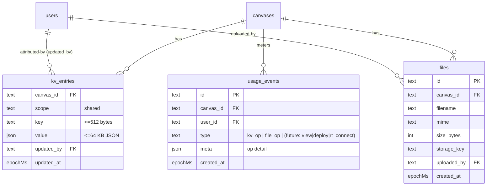
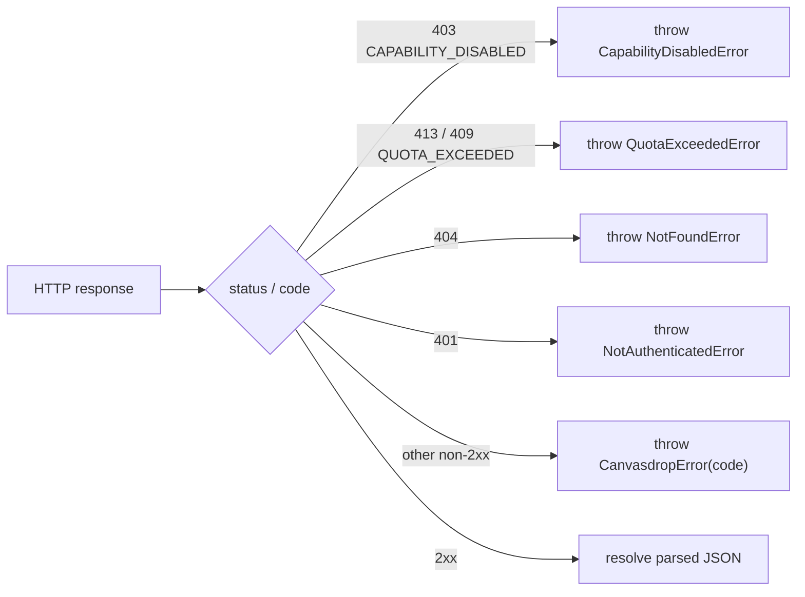

# feat: Canvas backend primitives (M6 — KV, Files, Identity, browser SDK)

## Summary

Build the **M6 milestone** (BUILD_BRIEF §16): the four backend primitives that turn
a static canvas into an app — **KV storage** (F), **File storage** (G), runtime
**Identity** `me()` (I), and the **browser SDK** (J) — plus wiring the existing
Usage tab to real metering. Everything hangs off a **new `/v1/c/:slug/*` runtime
router** that resolves the canvas, authorizes the viewer, verifies cross-canvas
isolation, and gates each primitive behind the **already-shipped
`requireCapability` guard** (plan 006). Canvas code stays static and secret-free:
the *who* comes from the proxy/session identity, the *which canvas* from the URL.

AI (H) and realtime (R) are **explicitly deferred to M9**; admin (K) to M7; gallery
to M8. This plan is the storage + SDK milestone that the capability foundation was
built to receive.

---

## Problem Frame

Canvases today are static files behind an auth gateway. The capability model (plan
006) lets an owner toggle KV/Files/AI/Realtime, and `requireCapability` is wired to
gate routes — but **no primitive routes exist**, so the toggles gate nothing yet
and canvases can't persist state, store files, or read identity. There is no
`/v1/c/:slug/*` runtime API, no `kv_entries`/`files`/`usage_events` tables, and no
SDK for canvas authors to call. The Usage tab is a designed placeholder waiting for
metering.

M6 closes that gap: implement the primitives behind the guard, ship the SDK canvas
authors load, and light up usage — without weakening the §12 isolation invariants
(no cross-canvas reach, no cross-user data theft, login on every request, no
secrets in the browser).

### Decisions locked during planning (interview)

- **SDK delivery:** a built, versioned **served `<script>`** exposing
  `window.canvasdrop`, zero build step, auto-detecting slug + URL mode from
  `location`. Source lives in `packages/sdk`; the app serves the bundle.
- **SDK error model:** **typed error classes that throw** (`CapabilityDisabledError`,
  `QuotaExceededError`, `NotFoundError`, `NotAuthenticatedError`, and a
  `CanvasdropError` base), each with a stable `code`. The `403 CAPABILITY_DISABLED`
  maps to `CapabilityDisabledError` (§6.7). **Naming note:** BUILD_BRIEF §11.1 calls
  the base `QuickDropError`, but the same brief defines the runtime global as
  `canvasdrop` — an internal brief inconsistency (likely a stale pre-rename term).
  This plan uses `CanvasdropError` to match the live `canvasdrop` global and the
  `canvas-drop` product name; reconcile BUILD_BRIEF §11.1 to match.
- **File URLs:** **proxy through the app for all drivers** in v1 — `files.url(id)`
  returns the same-origin `/v1/c/:slug/files/:id/content` path; the app streams
  bytes after the capability + identity check. Presigned S3 URLs deferred to v1.1.
- **Usage metering:** **per-op rows in `usage_events`** (every KV op incl. reads,
  every file op); the Usage tab aggregates with COUNT, and file storage is
  `SUM(size_bytes)` over `files`.
- **File serving safety (KTD):** `nosniff` + `Content-Disposition: attachment` by
  default; inline only for an **explicit safe-raster allowlist** (`image/png`,
  `image/jpeg`, `image/gif`, `image/webp`, `image/avif`) — **never** a `image/*`
  prefix match, because `image/svg+xml` is in `image/*` and is scriptable; SVG and
  any non-listed type are forced to `attachment`. Prevents stored-XSS on the canvas
  origin.
- **Cross-canvas isolation (KTD):** subdomain mode verifies request `Origin`
  matches the slug; CORS allows only the canvas wildcard origin with credentials;
  path mode is same-origin.

---

## Requirements Traceability

| ID | Requirement (BUILD_BRIEF) | Units |
|----|---------------------------|-------|
| R1 | KV: `get/set/delete/list` (shared) + `kv.user.*` (per-viewer), JSON ≤64 KB, key ≤512 B, prefix list + pagination (§6.4.1–4) | U2, U6 |
| R2 | KV: atomic `increment(key, by)` without races (§6.4.6); write attribution (§6.4.7) | U2, U6 |
| R3 | KV limits: 10,000 keys/canvas, 1,000/user-namespace (§6.4.5) | U2, U6 |
| R4 | Files: `upload/list/delete/url` (§6.5.1–4), per-canvas namespace, 1 GB/canvas, 25 MB/file (§6.5.5), upload attribution (§6.5.6), on the storage abstraction (§6.5.7) | U3, U7 |
| R5 | Identity: `me()` → `{id,email,name,avatarUrl}` from the resolved user, versioned shape, no per-request provider call (§6.8) | U5 |
| R6 | Browser SDK: `canvasdrop.{kv,files,me}` with mode/slug auto-detection, typed catchable errors (§6.9 SDK, §6.7), docs + llms.txt | U8, U9 |
| R7 | Usage tab: KV ops + file storage from `usage_events`/`files` (D24, §6.9.6). Substrate + tab in U1/U10; the metered events are emitted by U6 (kv_op) and U7 (file_op) | U1, U6, U7, U10 |
| R8 | Every primitive route gated by `requireCapability` (plan 006); identity-implies-backend | U4, U5, U6, U7 |
| R9 | §12 invariants upheld: login every request, no cross-canvas reach, no secrets in browser, no cross-user theft (§12.0) | U4, U7 |

---

## High-Level Technical Design

### Data model (new tables)



`kv_entries` primary key is composite `(canvas_id, scope, key)`. `scope = 'shared'`
for `kv.*`; `scope = <userId>` for `kv.user.*` (matches the §9 DDL). Indexes:
`kv_entries(canvas_id, scope)`, `usage_events(canvas_id, created_at)`,
`files(canvas_id)`.

### Request flow — a primitive call

```mermaid
sequenceDiagram
    participant C as Canvas JS (window.canvasdrop)
    participant A as /v1/c/:slug/* router
    participant G as gateway + canvasAccess
    participant Q as requireCapability
    participant H as primitive handler
    C->>A: fetch(/v1/c/{slug}/kv/votes, credentials: include)
    A->>G: resolve identity (proxy/session) + canvas by slug;<br/>subdomain mode: verify Origin matches slug
    G-->>A: 401 if not logged in / 404 if canvas hidden
    A->>Q: requireCapability("kv", config) reads c.get("canvas")
    Q-->>A: 403 CAPABILITY_DISABLED if off
    A->>H: handler(user, canvas)
    H->>H: enforce limits, read/write kv_entries, append usage_events row
    H-->>C: JSON result (or typed error body)
```

### SDK error mapping



---

## Key Technical Decisions

- **KTD-1 — One runtime router, capability-gated per sub-path.** A single
  `/v1/c/:slug/*` Hono router (`apps/server/src/routes/canvas-api.ts`) mounted
  before the SPA fallback. It runs the auth gateway + `canvasAccess` (resolves and
  authorizes the canvas into `c.get("canvas")`), then each sub-route adds
  `requireCapability("kv"|"files"|"identity", config)`. This is the seam plan 006
  built; primitives are thin handlers. (See
  `docs/solutions/2026-06-13-canvas-capability-model.md`.)
  - **Subdomain routing (load-bearing — feasibility review).** `resolveRequest`
    (`apps/server/src/http/resolve-request.ts`) currently classifies *any* request
    on a canvas subdomain host as role `canvas` (→ `serveCanvas`) **before** path is
    inspected, so on `foo.<base>/v1/c/foo/kv/...` the primitive request never reaches
    this router. U4 MUST resolve this: special-case the `/v1/c/` path prefix in the
    subdomain branch of `resolveRequest` to return a `platform-api` role (or mount
    the runtime router by raw path prefix ahead of the role-keyed canvas chain in
    `app.ts`). This is the *primary* path, not an edge — own it in U4.

- **KTD-1b — Credentialed CORS is a net-new component (not a `same-origin.ts`
  reuse).** `apps/server/src/http/same-origin.ts` only *rejects* cross-origin
  requests; it has no `Access-Control-Allow-Origin`/`-Allow-Credentials`/preflight
  handling. Subdomain mode needs the opposite: echo the calling canvas's own
  subdomain origin (derived from slug + `baseUrl`), `Allow-Credentials: true`,
  `Vary: Origin`, and an `OPTIONS` preflight — all new code in U4. Path mode stays
  same-origin (no CORS). The Origin↔slug equality check IS the §12.0 #4 isolation
  boundary, so treat it as a security surface, not plumbing.

- **KTD-2 — KV values stored via the shared `c.json` column.** JSON in, JSON out;
  64 KB enforced at the boundary (byte length of the serialized value). `scope`
  column carries `'shared'` or the `userId`; per-user reads/writes derive scope
  from `c.get("user").id` server-side — never from the client. Attribution =
  `updated_by` + `updated_at` on every write. (Dual-dialect JSON per
  `docs/solutions/2026-06-13-dual-dialect-drizzle-seam.md`.)

- **KTD-3 — Atomic increment (NOT "deferred to implementation").** The no-races
  requirement (R2) is the highest-risk technical item and the codebase has
  *deliberately avoided cross-dialect transactions* so far (see `canvases.ts`
  rollback-vs-prune note, `versions.ts`; and the dual-dialect doc's "prefer
  `onConflictDoUpdate` / atomic single-statement over read-then-write" addendum).
  Two complications: (a) the house single-statement pattern (`sql\`${col} + ${by}\``
  + `onConflictDoUpdate`) does **not** port cleanly because KV values live in a
  `c.json` column (SQLite stores JSON as text → needs divergent
  `json_extract`/`cast` per dialect); (b) `better-sqlite3` transactions are
  **synchronous** while `pglite`/pg are **async**, so a single `await
  db.transaction(...)` can't serve both. **Decision + execution note:** before
  building U2, spike increment on both dialects and pick one — preferred:
  store the counter so an atomic single-statement upsert works (numeric handling
  distinct from arbitrary JSON values), falling back to a `dialect`-branched
  transaction (`BEGIN IMMEDIATE` on SQLite for write-lock-at-start; async tx on PG)
  added explicitly to the `DbClient` seam if the single-statement path proves
  unworkable. The U2 concurrency test (two writers / two connections) is the gate.
  Missing key starts at 0 then applies `by`; a non-numeric existing value throws a
  typed `409 CONFLICT`.

- **KTD-4 — Quotas enforced by count/sum on write (best-effort).** KV: `COUNT` keys
  in `(canvas_id, scope)` before inserting a *new* key (10k shared / 1k per user-ns);
  updates to existing keys are exempt. Files: `SUM(size_bytes)` for the canvas
  before accepting an upload (1 GB), and reject >25 MB during the stream. Greenfield
  → no counters table; recompute cheaply. **Known TOCTOU (accepted):** check-then-
  write means concurrent ops can both pass and overshoot by up to one op (two
  600 MB uploads racing past a 1 GB gate → 1.2 GB). On the trusted-org/VPS model a
  soft quota overshoot is acceptable, not an invariant breach — documented as
  best-effort rather than transactionally enforced. U3/U6 add a concurrent-op test
  pinning the chosen behavior so it's deliberate, not accidental.

- **KTD-5 — Files proxied, served safely.** `files.url(id)` returns the same-origin
  `/v1/c/:slug/files/:id/content`; the app authorizes then serves from the storage
  driver. Always `X-Content-Type-Options: nosniff`. `Content-Disposition: attachment`
  by default; inline **only** for the explicit safe-raster set (png/jpeg/gif/webp/
  avif) — `image/svg+xml` and everything else force `attachment` (see File serving
  safety KTD). The `filename` is **sanitized/RFC-5987-encoded** before it enters the
  `Content-Disposition` header (reject/encode control chars, quotes, newlines) to
  prevent header injection. Storage key namespaced per canvas
  (`files/<canvasId>/<fileId>`). Presigned S3 URLs are v1.1.
  - **Buffer-mode bound (accepted v1 limit).** `StorageDriver.get` returns a full
    `Uint8Array` (no streaming read in the contract today), so content serving and
    multipart upload buffer the whole body in heap — fine for small static assets,
    but at 25 MB/file × N concurrent downloads this is a real memory ceiling on a
    small VPS. v1 accepts buffer-mode and **documents the budget** (max_file ×
    max_concurrent); the real fix is presigned-S3 direct download (v1.1). Do not
    claim "streaming" — adding a streaming `get` to the driver contract is out of
    scope here. Surfaced as a risk.

- **KTD-6 — SDK is a served script, authed, with a defined update contract.**
  `packages/sdk` builds a single **IIFE bundle exposing `window.canvasdrop`**; the
  app serves it. **Serving paths align to BUILD_BRIEF §11.1:** the SDK at
  `GET /sdk/v1.js` and the agent doc at `GET /llms.txt` (root, not under `/v1/`).
  Both are served **behind the auth gateway** (§12.0 #1 — "login on every request …
  SDK script"), not as public static routes. `packages/sdk` has **no bundler today**,
  so U8 owns choosing one (esbuild/tsup), emitting `dist/sdk.v1.js`, and the
  build-to-serve handoff (server reads the built artifact). **Update contract:** the
  stable path `/sdk/v1.js` is **additive / backward-compatible within v1** (canvas
  authors point `<script src>` at it and safely receive fixes incl. security
  patches); breaking changes get a new major path (`/sdk/v2.js`). This is how the
  SVG/security fix above reaches already-deployed canvases. It auto-detects slug +
  URL mode from `location` (subdomain vs `/c/:slug/` path), calls the API with
  `credentials: "include"`, and throws typed errors. Same source can be published as
  an npm package later without changing canvas code.

- **KTD-7 — Per-op metering, derived stats, with a retention bound.** Each handler
  appends a `usage_events` row (`type`, `meta.op`) for every op including reads (per
  the interview decision); writes are best-effort and must never fail the request
  (mirror the audit-log fire-and-forget pattern). The owner usage endpoint
  aggregates COUNT by type over a window + `SUM(size_bytes)`. **Retention (added
  post-review):** because the SDK's canonical pattern is a poll loop (e.g. `increment`
  every second ≈ 86k rows/canvas/day) and rate limiting is deferred to M7,
  `usage_events` must not grow unbounded. U1 ships a `created_at`-keyed prune (drop
  rows older than a configurable window, default ~30–90 days — long enough for the
  30-day stats) run by the existing purge sweep. If volume still bites, switch reads
  to writes-only or sampled metering (noted in Deferred). The usage endpoint
  identity comes from the **dashboard session, owner-or-admin only** — it lives on
  the management API router, NOT the canvas runtime router (see U10).

- **KTD-8 — Identity `me()` is a distinct, minimal projection.** Runtime
  `GET /v1/c/:slug/me` returns exactly `{id,email,name,avatarUrl}` — **no `isAdmin`**
  (unlike the dashboard `/api/me`). Gated by `requireCapability("identity")` so a
  backend-off canvas's `me()` 403s. Explicit projection, never a row spread (mirror
  `apps/server/src/routes/me.ts`).

---

## Output Structure

```
apps/server/src/
  routes/
    canvas-api.ts            # /v1/c/:slug/* runtime router (mount + CORS + Origin verify)
    canvas-api.test.ts
    canvas-kv.ts             # KV sub-routes
    canvas-kv.test.ts
    canvas-files.ts          # Files sub-routes (upload/list/delete/content)
    canvas-files.test.ts
    canvas-me.ts             # runtime me()
    canvas-me.test.ts
    canvas-usage.ts          # owner usage-stats endpoint (dashboard-facing)
  db/repositories/
    kv.ts  kv.test.ts
    files.ts  files.test.ts
    usage-events.ts  usage-events.test.ts
  canvas/
    file-serving.ts          # safe content-type/disposition helper
packages/shared/src/db/
  schema.sqlite.ts  schema.pg.ts   # + kv_entries, files, usage_events (both dialects)
packages/sdk/src/
  index.ts                   # window.canvasdrop entry + mode/slug detection
  kv.ts  files.ts  me.ts  errors.ts  http.ts
  *.test.ts
  llms.txt                   # agent-facing usage doc
docs/
  sdk.md                     # human SDK docs
apps/dashboard/src/
  routes/canvas.usage.tsx    # wire real stats (modify)
  lib/api.ts  lib/queries.ts # usage query (modify)
drizzle/{sqlite,pg}/0004_*.sql  # usage_events (U1) — both dialects
drizzle/{sqlite,pg}/0005_*.sql  # kv_entries (U2) — both dialects
drizzle/{sqlite,pg}/0006_*.sql  # files (U3) — both dialects
```

---

## Implementation Units

### U1. `usage_events` table + metering helper

- **Goal:** The append-only metering substrate every primitive writes to, plus a
  fire-and-forget recorder.
- **Requirements:** R7
- **Dependencies:** none
- **Files:** `packages/shared/src/db/schema.sqlite.ts`, `schema.pg.ts`,
  `schema.test.ts`, `apps/server/src/db/repositories/usage-events.ts` (+ test),
  `drizzle/{sqlite,pg}/0004_*.sql`
- **Approach:** Add `usage_events(id, canvas_id, user_id, type, meta json,
  created_at)` to both dialects with index `(canvas_id, created_at)`; generate the
  **`0004`** migration for **both** dialects (see the dual-dialect gotcha doc — each
  table-adding unit generates its own sequential migration: U1=0004, U2=0005,
  U3=0006). Repository: `record({canvasId,userId,type,meta})` (fire-and-forget,
  errors logged not thrown — mirror `audit-log.ts`), `countByType(canvasId,
  sinceMs)`, and `pruneBefore(cutoffMs)` for retention (KTD-7) wired into the
  existing purge sweep.
- **Patterns to follow:** `apps/server/src/audit/audit-log.ts` (best-effort write),
  the purge sweep in `apps/server/src/canvas/purge.ts`, existing repos.
- **Test scenarios:**
  - Schema parity passes with the new table (both dialects).
  - `record` inserts a row with type + meta; a failing insert is swallowed (no throw).
  - `countByType` returns per-type counts within the window and excludes older rows.
  - `pruneBefore` deletes rows older than the cutoff, keeps newer ones.
  - Dual-dialect: counts + prune behave identically on sqlite + pglite.
- **Verification:** full suite green both dialects; metering rows queryable + prunable.

### U2. `kv_entries` table + KV repository

- **Goal:** Persistence + all KV operations behind a typed repo, including atomic
  increment, scoping, attribution, and limits.
- **Requirements:** R1, R2, R3
- **Dependencies:** U1 (not strict; metering happens in routes)
- **Files:** `schema.sqlite.ts`, `schema.pg.ts`, `schema.test.ts`,
  `apps/server/src/db/repositories/kv.ts` (+ test), `drizzle/{sqlite,pg}/0005_*.sql`
- **Approach:** `kv_entries` PK `(canvas_id, scope, key)`, `value` via `c.json`,
  `updated_by`/`updated_at`. Repo: `get(canvasId, scope, key)`,
  `set(canvasId, scope, key, value, userId)` (upsert + attribution),
  `delete(...)`, `list(canvasId, scope, prefix, cursor, limit)` (prefix filter +
  keyset pagination), `increment(canvasId, scope, key, by, userId)` (per KTD-3 —
  resolve the atomic approach in the spike, **not** a naive read-then-write),
  `countKeys(canvasId, scope)`. Enforce 64 KB value / 512 B key / key-count
  limits here or surface counts for the route to enforce (KTD-4).
- **Patterns to follow:** dual-dialect repo seam in
  `apps/server/src/db/repositories/canvases.ts`; for increment see KTD-3 (atomic
  single-statement upsert preferred; `dialect`-branched transaction with
  `BEGIN IMMEDIATE` on SQLite as the fallback) — note SQLite's transaction callback
  is sync and pg/pglite's is async.
- **Execution note:** Spike the atomic increment on both dialects (KTD-3) and write
  the failing two-writer concurrency test first; it is the gate for R2.
- **Test scenarios:**
  - set→get round-trips a JSON value; set overwrites + updates attribution.
  - delete removes; get on a missing key returns null.
  - list filters by prefix, paginates by cursor, respects limit, stable order.
  - increment: missing key starts at `by`; sequential increments accumulate;
    concurrent increments converge to the correct total (no lost update); non-numeric
    existing value rejected. Covers R2.
  - shared vs per-user scope isolation: same key in `'shared'` and a userId scope are
    independent rows.
  - countKeys reflects inserts/deletes; new-key insert past the limit is rejectable.
  - Edge: 512 B key boundary, 64 KB value boundary (just under/over).
  - Dual-dialect parity for all of the above.
- **Verification:** repo tests green both dialects.

### U3. `files` table + files service

- **Goal:** File metadata persistence + storage-backed create/list/delete with
  quota + attribution, on the existing storage abstraction.
- **Requirements:** R4
- **Dependencies:** U1
- **Files:** `schema.sqlite.ts`, `schema.pg.ts`, `schema.test.ts`,
  `apps/server/src/db/repositories/files.ts` (+ test), service wiring in
  `apps/server/src/canvas/` if needed, `drizzle/{sqlite,pg}/0006_*.sql`
- **Approach:** `files(id, canvas_id, filename, mime, size_bytes, storage_key,
  uploaded_by, created_at)`, index `(canvas_id)`. Service: `create` writes bytes via
  the storage driver under `files/<canvasId>/<fileId>` then inserts the row (clean
  up the blob if the row insert fails); `list(canvasId)`; `delete(id)` removes row +
  blob; `totalBytes(canvasId)` for the quota (KTD-4). Reuse `StorageDriver`
  (`put/get/delete/exists`).
- **Patterns to follow:** `apps/server/src/storage/contract.ts` + `local.ts`/`s3.ts`;
  blob-cleanup-on-failure mirrors the paste-create rollback in `management.ts` and
  the blob-GC patterns (`docs/solutions/2026-06-13-content-addressed-draft-publish.md`).
- **Test scenarios:**
  - create stores bytes + row with attribution; list returns metadata; delete
    removes both row and blob; deleting a missing id is a clean error/no-op.
  - quota: upload that would exceed 1 GB total is rejected; totalBytes accurate after
    create/delete.
  - quota TOCTOU: two concurrent uploads racing the 1 GB gate — assert the
    documented best-effort behavior (KTD-4), pinning it deliberately.
  - per-canvas isolation: a file id from canvas A is not listable/deletable under
    canvas B (enforced by canvas_id scoping in every query).
  - row-insert failure after blob write cleans up the orphan blob.
  - Dual-dialect parity.
- **Verification:** files repo/service tests green both dialects; bytes round-trip
  through local + mem drivers.

### U4. `/v1/c/:slug/*` runtime router (the seam)

- **Goal:** The mounted runtime API surface: resolve canvas, authorize viewer,
  enforce cross-canvas isolation + CORS, and expose the capability-guarded mount
  points the primitive units attach to.
- **Requirements:** R8, R9
- **Dependencies:** none (consumes existing gateway, `canvasAccess`,
  `requireCapability`)
- **Files:** `apps/server/src/routes/canvas-api.ts` (+ test),
  `apps/server/src/app.ts` (mount), `apps/server/src/http/resolve-request.ts`
  (subdomain `/v1/c/` recognition), new credentialed-CORS helper in
  `apps/server/src/http/` (+ test)
- **Approach:** New Hono router mounted at `/v1/c/:slug` in `app.ts` **before** the
  SPA/canvas fallback and distinct from the Bearer-key `/v1/canvases` deploy API.
  - **Routing recognition (KTD-1):** make `resolveRequest` return a `platform-api`
    role for the `/v1/c/` prefix **on canvas subdomains too** (today it short-circuits
    to role `canvas` → `serveCanvas`), or mount the runtime router by raw path prefix
    ahead of the role-keyed canvas chain. Without this the primitive call never
    reaches the router on a subdomain — the main path.
  - **Pipeline:** auth gateway (login required, §12.0 #1) → `canvasAccess` resolves
    + authorizes the canvas into `c.get("canvas")` (404s hidden/disabled) →
    **isolation layer** → per-sub-route `requireCapability(...)`.
  - **Isolation (KTD-1b, §12.0 #4):** subdomain mode — verify request `Origin` host
    equals the slug's subdomain and emit credentialed CORS (echo that origin,
    `Allow-Credentials: true`, `Vary: Origin`, handle `OPTIONS` preflight) via the
    **new** CORS helper (NOT `same-origin.ts`, which only rejects). Path mode —
    best-effort cross-canvas guard per §9.4/§12.2: require `Sec-Fetch-Site:
    same-origin` and a `Referer` matching the `/c/:slug/` prefix on state-changing
    routes; document the residual (these headers are best-effort, path mode is
    explicitly reduced-isolation).
- **Patterns to follow:** `app.ts` existing mounts + `onlyCanvas(canvasAccess(...))`;
  `resolve-request.ts` role classification; capability-guard usage. Read
  `docs/solutions/2026-06-13-auth-invariant-checklist.md` first.
- **Test scenarios:**
  - unauthenticated request → 401 (login enforced on the API too).
  - hidden/disabled/nonexistent slug → 404 (no existence leak).
  - **subdomain routing:** a `/v1/c/:slug/*` request on the canvas subdomain reaches
    the runtime router (not `serveCanvas`). Covers the KTD-1 gap.
  - subdomain isolation: request whose `Origin` ≠ slug → rejected; matching Origin →
    allowed with the credentialed CORS headers; preflight `OPTIONS` answered.
  - path-mode isolation: a state-changing request with `Sec-Fetch-Site: cross-site`
    (or a `Referer` for a different `/c/:other/`) → rejected.
  - a route behind `requireCapability("kv")` 403s when backend/kv off, passes when on.
  - the deploy API `/v1/canvases/*` (Bearer) is unaffected by the new router.
- **Verification:** router tests green; existing deploy-API + canvas-serving tests
  still pass.
- **Execution note:** Start with failing integration tests for the auth/isolation
  contract (401/404, subdomain-reaches-router, Origin match, path-mode Sec-Fetch-Site)
  before wiring handlers — this unit is a security surface, not plumbing.

### U5. Runtime Identity `me()`

- **Goal:** `GET /v1/c/:slug/me` returning the minimal identity projection, gated by
  the identity capability.
- **Requirements:** R5, R8
- **Dependencies:** U4
- **Files:** `apps/server/src/routes/canvas-me.ts` (+ test)
- **Approach:** Behind `requireCapability("identity", config)`; return exactly
  `{id,email,name,avatarUrl}` from `c.get("user")`. No provider call, no `isAdmin`.
- **Patterns to follow:** `apps/server/src/routes/me.ts` (explicit projection, no
  spread).
- **Test scenarios:**
  - backend on → 200 with the four fields, `isAdmin` absent.
  - backend off → 403 CAPABILITY_DISABLED.
  - unauthenticated → 401.
  - projection never leaks extra user columns (inject a full row, assert shape).
- **Verification:** route tests green.

### U6. KV routes

- **Goal:** The KV HTTP surface wired to the repo, with limits, attribution,
  per-user scoping, and metering.
- **Requirements:** R1, R2, R3, R7, R8
- **Dependencies:** U2, U4, U1
- **Files:** `apps/server/src/routes/canvas-kv.ts` (+ test)
- **Approach:** Behind `requireCapability("kv")`. Routes:
  `GET|PUT|DELETE /kv/:key`, `GET /kv` (list with `prefix`/cursor/limit),
  `POST /kv/:key/increment`, and the `kv/user/...` mirror that forces
  `scope = user.id`. `kv.*` uses `scope='shared'`. Enforce 64 KB/512 B/key-count
  (typed 413/409). Append a `usage_events` `kv_op` row per call (KTD-7). All
  identity/scope derived server-side.
- **Patterns to follow:** `management.ts` (zod validation, error envelopes), the
  capability error shape (`{code, ...}` from capability-guard).
- **Test scenarios:**
  - set/get/delete/list happy paths (shared); list prefix + pagination.
  - increment endpoint returns the new total; concurrent calls converge (R2).
  - `kv/user/*` writes land in the caller's scope and are invisible to another user;
    a second user gets their own value (per-user isolation).
  - oversized value (>64 KB) → 413; oversized key (>512 B) → 413/400; new key past
    the 10k/1k limit → 409.
  - backend/kv off → 403 (guard integration).
  - each successful op appends exactly one usage_events row of type kv_op.
  - cross-canvas: a key written under slug A is not readable under slug B.
- **Verification:** route tests green both dialects where dialect-sensitive (repo
  layer covers dual-dialect; routes may be sqlite-only per the management.ts
  convention).

### U7. Files routes

- **Goal:** Upload/list/delete + safe authenticated content serving, with quota and
  metering.
- **Requirements:** R4, R7, R8, R9
- **Dependencies:** U3, U4, U1
- **Files:** `apps/server/src/routes/canvas-files.ts` (+ test),
  `apps/server/src/canvas/file-serving.ts` (+ test)
- **Approach:** Behind `requireCapability("files")`. `POST /files` (multipart
  upload, ≤25 MB, quota check), `GET /files` (list metadata),
  `DELETE /files/:id`, `GET /files/:id/content` (serve bytes after auth via the
  safe-headers helper — KTD-5: `nosniff`; inline only for the safe-raster allowlist,
  **SVG and all else forced to `attachment`**; filename RFC-5987-encoded into
  `Content-Disposition`). Append `usage_events` `file_op` rows. All queries scoped by
  `canvas.id`. Serving is buffer-mode (KTD-5 bound), not true streaming.
- **Patterns to follow:** deploy ingest in `apps/server/src/deploy/` +
  `deploy-common.ts` (body limits); storage driver usage; `serve.ts` for the response
  shape.
- **Test scenarios:**
  - upload→list→content round-trips bytes; metadata correct; attribution recorded.
  - delete removes row + blob; content of a deleted id → 404.
  - >25 MB upload → 413; upload exceeding 1 GB canvas total → 409.
  - content served with `nosniff`; safe-raster (png/jpeg/…) → inline.
  - **uploaded SVG (`image/svg+xml`) → `Content-Disposition: attachment`, NOT inline**
    (stored-XSS defense, R9 — this is the must-pass security test).
  - **filename with newline/quote/semicolon → header is safe** (no header injection).
  - cross-canvas: file id from canvas A → 404 under canvas B (no cross-canvas reach).
  - backend/files off → 403.
  - each op appends a file_op usage row.
- **Verification:** route + serving tests green; the SVG-attachment + filename-safety
  tests pass.
- **Execution note:** Add failing tests for the SVG-attachment and filename-injection
  cases before implementing `file-serving.ts` — these are the §12.0 isolation gates.

### U8. Browser SDK (`packages/sdk`)

- **Goal:** The `window.canvasdrop` client canvas authors load: kv, files, me,
  mode/slug auto-detection, typed errors — built and served by the app.
- **Requirements:** R6
- **Dependencies:** U5, U6, U7 (targets their contracts)
- **Files:** `packages/sdk/src/{index,kv,files,me,errors,http}.ts` (+ tests),
  **`packages/sdk` bundler config (new — no bundler exists today)**, serving route
  `GET /sdk/v1.js` mounted **behind the auth gateway** in `app.ts`
- **Approach:** Choose a bundler (esbuild or tsup) and emit a single **IIFE** bundle
  (`dist/sdk.v1.js`) exposing `window.canvasdrop`; `pnpm build` produces it and the
  server reads/serves that artifact at `GET /sdk/v1.js` (BUILD_BRIEF §11.1 path),
  **behind the gateway** (§12.0 #1 — not a public static route), `Cache-Control`
  long-lived; the stable path is additive/back-compat within v1 (KTD-6 update
  contract). `index.ts` detects slug + URL mode from `location` (subdomain host vs
  `/c/:slug/` path) and builds the API base; `http.ts` does
  `fetch(..., {credentials:"include"})` and maps non-2xx → typed errors
  (`errors.ts`: `CanvasdropError` base + `CapabilityDisabledError`,
  `QuotaExceededError`, `NotFoundError`, `NotAuthenticatedError`, keyed off
  status/`code`). `kv`/`files`/`me` mirror the §9 signatures (`files.url(id)` is a
  synchronous string builder).
- **Patterns to follow:** the typed client `apps/dashboard/src/lib/api.ts` (error
  mapping, request helper); capability error `code` from the server; the dashboard's
  own Vite build as a bundler-config reference.
- **Test scenarios:**
  - mode detection: subdomain `foo.canvases.example.com` and path
    `localhost/c/foo/` both resolve slug `foo` + correct base.
  - kv/files/me call the right URLs with credentials; parse success JSON.
  - 403 CAPABILITY_DISABLED → throws `CapabilityDisabledError` (instanceof + code);
    413/409 → `QuotaExceededError`; 404 → `NotFoundError`; 401 →
    `NotAuthenticatedError`.
  - `files.url(id)` returns the expected same-origin content path synchronously.
  - the served bundle defines `window.canvasdrop` with kv/files/me.
  - **unauthenticated `GET /sdk/v1.js` → 401** (the script is gated, §12.0 #1).
- **Verification:** SDK unit tests green; the served script loads behind auth and
  exposes the global (smoke test against the runtime routes).

### U9. SDK docs + `llms.txt`

- **Goal:** Human + agent-facing documentation so canvas authors (and AI agents)
  can use the primitives.
- **Requirements:** R6
- **Dependencies:** U8
- **Files:** `docs/sdk.md`, `packages/sdk/src/llms.txt` served at **`GET /llms.txt`**
  (BUILD_BRIEF §11.1 root path), **behind the auth gateway** like the SDK script;
  `BUILD_BRIEF.md` §11.1 (reconcile the stale `QuickDropError` → `CanvasdropError`,
  per the locked decision)
- **Approach:** Document the `<script src="/sdk/v1.js">` include, mode
  auto-detection, every method with examples (poll/vote via increment, file upload,
  me), the typed errors + capability requirement (a method 403s if its capability is
  off), the update/compat contract (point at `/sdk/v1.js`; v1 is additive), and
  limits. `llms.txt` is a compact, copy-pasteable agent reference.
- **Patterns to follow:** the create-flow API snippet in
  `apps/dashboard/src/routes/new.tsx`; brief §6.12 packaging.
- **Test scenarios:** docs are prose; the one behavioral assertion is
  **unauthenticated `GET /llms.txt` → 401** (served behind the gateway, §12.0 #1).
- **Verification:** docs render; examples match the shipped SDK signatures; the
  llms.txt route is gated.

### U10. Usage tab wiring (dashboard)

- **Goal:** Replace the Usage placeholder with real per-canvas KV-ops + file-storage
  figures.
- **Requirements:** R7
- **Dependencies:** U1, U3, U6, U7
- **Files:** `apps/server/src/routes/canvas-usage.ts` (+ test) — owner usage endpoint
  `GET /api/canvases/:id/usage`, added to the **management API router**
  (`apps/server/src/routes/management.ts`'s mount, NOT the `/v1/c/:slug` runtime
  router); `apps/dashboard/src/lib/api.ts`, `apps/dashboard/src/lib/queries.ts`,
  `apps/dashboard/src/routes/canvas.usage.tsx`, `apps/dashboard/src/test/usage.test.tsx`
- **Approach:** The endpoint lives behind the **dashboard session gateway** and uses
  the existing `ownedCanvas` helper (owner-or-admin; 404 for others) — it must **not**
  be reachable from a canvas origin (no CORS, not on the runtime router). Returns
  `{ kvOps, fileCount, fileBytes, ... }` from `usage_events.countByType` +
  `files.totalBytes`. Dashboard query + render real numbers; keep the deliberate
  empty state when a canvas has no backend/zero activity. (View/AI/realtime tiles
  remain "coming soon" — out of scope.)
- **Patterns to follow:** `management.ts` `ownedCanvas` + projection + same-origin
  mounting; dashboard query/render in `canvas.settings.tsx`/`canvas.usage.tsx`;
  sqlite-only route test convention.
- **Test scenarios:**
  - owner → 200 with KV op count + file bytes; non-owner authenticated → 404;
    unauthenticated → 401; admin → 200.
  - dashboard renders the figures; zero-activity canvas shows the empty state.
  - figures update after KV/file ops (integration: do an op, see the count).
- **Verification:** usage endpoint + dashboard tests green; tab shows live numbers
  in `pnpm dev`.

---

## Scope Boundaries

**In scope:** KV (shared + per-user, increment, limits, attribution), Files
(upload/list/delete/proxied url, quota, safe serving), runtime `me()`, the
`/v1/c/:slug/*` router with isolation + capability gating, the served browser SDK +
docs/llms.txt, `usage_events` metering, and the Usage-tab wiring — all dual-dialect
and tested.

**Non-goals (later milestones):**
- **AI primitive (H)** and **Realtime (R)** → M9 (the router leaves room; no `ai`/
  `realtime` routes here, and their capability toggles stay inert).
- **Admin panel (K)** → M7; **gallery** → M8.
- KV optimistic concurrency (`ifRevision`), data export, TTL, change-subscriptions
  (§6.4.8–11 — v1.1/later).
- Files: dashboard file manager UI, image preview, presigned URLs, resumable uploads
  (§6.5.8–11 — v1.1/later).
- Publishing the SDK as an npm package (the served script ships now; package later).
- View metering / 30-day visit sparkline (area C/E concern; this plan meters only
  KV/file ops).

### Deferred to Follow-Up Work
- **Per-user / per-canvas rate limiting** on the API classes (§6.11.2, §12.3). Not a
  §12.0 hard invariant; belongs with the M7 hardening pass. Noted as a risk below.
- Optimizing metering (aggregate counters) if per-op rows prove heavy at scale.

---

## Risks & Dependencies

- **Atomic increment correctness (R2) — highest technical risk.** The codebase has
  *deliberately avoided cross-dialect transactions*, and the house single-statement
  pattern doesn't port to a JSON value column; SQLite's tx callback is sync vs pg's
  async. Mitigation: spike the atomic approach on both dialects before U2, prefer an
  atomic single-statement counter, fall back to a `dialect`-branched transaction
  (`BEGIN IMMEDIATE` on SQLite) added to the `DbClient` seam; the two-writer
  concurrency test is the gate. (KTD-3) — flagged by feasibility + adversarial.
- **Subdomain routing gap (§12.0, primary path).** `resolveRequest` classifies
  `/v1/c/:slug/*` on a canvas subdomain as role `canvas` → it never reaches the
  runtime router. U4 must fix the role classification (or mount by raw path prefix).
  Mitigation: the "subdomain request reaches the router" test in U4. (KTD-1) —
  flagged by feasibility (conf 100).
- **Stored-XSS via uploaded files (§12.0 #2/#4).** `image/svg+xml` is in `image/*`
  and is scriptable; an SVG served inline on the canvas origin steals session/KV via
  the SDK. Mitigation: inline only the explicit safe-raster set, **SVG forced to
  `attachment`** (KTD-5); the SVG-attachment test is a must-pass gate. Also sanitize
  the filename for `Content-Disposition` (header injection). — flagged by
  security-lens (P0) + adversarial.
- **File serving is buffer-mode, not streaming.** `StorageDriver.get` returns a full
  `Uint8Array`; 25 MB × concurrency is a heap ceiling on a small VPS. Mitigation:
  accept buffer-mode for v1 with a documented memory budget; presigned-S3 (v1.1) is
  the real fix; do not claim "streaming". (KTD-5) — flagged by adversarial.
- **Cross-canvas isolation, both modes (§12.0 #4).** Subdomain: verify `Origin`↔slug
  + credentialed CORS (net-new code, not a `same-origin.ts` reuse — KTD-1b). Path
  mode: best-effort `Sec-Fetch-Site`/`Referer` guard per §9.4/§12.2 (residual:
  best-effort, path mode is reduced-isolation). Every query scoped by `canvas.id`.
  Mitigation: U4 isolation tests (both modes) + per-unit cross-canvas tests. Read the
  auth-invariant checklist before U4/U6/U7. — flagged by security-lens + feasibility.
- **`usage_events` unbounded growth.** Metering every KV read + a poll-loop SDK
  pattern + deferred rate limiting → ~86k rows/canvas/day. Mitigation: `created_at`
  retention prune in U1 (KTD-7); fall back to writes-only/sampled metering if it
  still bites. — flagged by adversarial.
- **Quota TOCTOU (KTD-4).** Concurrent ops can overshoot by one. Accepted as
  best-effort on the trusted-org model; pinned by a concurrent-op test (U3/U6). —
  flagged by adversarial.
- **SDK auth + update contract.** The served `/sdk/v1.js` + `/llms.txt` are behind
  the gateway (§12.0 #1); the stable v1 path is additive/back-compat so security
  fixes reach deployed canvases (KTD-6). — flagged by security-lens (auth) +
  adversarial (versioning).
- **No rate limiting yet.** Authenticated (trusted org) but unthrottled; deferred to
  M7. Acceptable for the trusted-org/VPS model (memory: trust-model-calibration);
  surfaced as a conscious choice. The `usage_events` prune above bounds the worst of
  its blast radius pre-M7.
- **Dual-dialect migrations.** Three new tables → sequential `0004`/`0005`/`0006`,
  each generated for **both** dialects; the full suite (not just the parity test) is
  the gate (`docs/solutions/2026-06-13-dual-dialect-drizzle-seam.md`).
- **Dependency on plan 006.** `requireCapability` + the capability columns must be on
  `main` (they are, merged in #14) — this worktree is branched off that.

---

## Sources & Research

- `BUILD_BRIEF.md` — §6.4 (KV), §6.5 (Files), §6.8 (Identity), §6.9 (SDK/usage/D24),
  §9 (data model DDL: `kv_entries`/`files`/`usage_events`; flows + auth §9.4–9.6,
  §9 line 448 Origin verification), §11.4 (the `/v1/c/:slug/*` API surface),
  §12.0/§12.3/§12.4 (invariants, rate limiting, headers), §16 M6.
- Code grounding: `apps/server/src/app.ts` (route mounting, `onlyCanvas`/
  `canvasAccess`), `apps/server/src/canvas/capability-guard.ts` (the guard seam),
  `apps/server/src/canvas/authorization.ts` (`canvasAccess`),
  `apps/server/src/routes/{management,me,deploy-api}.ts` (Hono/zod/projection/Bearer
  patterns), `apps/server/src/storage/{contract,driver,local,s3,mem}.ts` (storage
  abstraction), `apps/server/src/audit/audit-log.ts` (fire-and-forget metering),
  `packages/shared/src/db/{schema.sqlite,schema.pg,columns,schema.test}.ts`,
  `packages/sdk` (SDK home), `apps/dashboard/src/routes/canvas.usage.tsx` +
  `lib/{api,queries}.ts` (usage tab).
- Learnings: `docs/solutions/2026-06-13-canvas-capability-model.md`,
  `…-dual-dialect-drizzle-seam.md`, `…-auth-invariant-checklist.md`,
  `…-canvas-hosting-deploy-patterns.md`, `…-content-addressed-draft-publish.md`.
