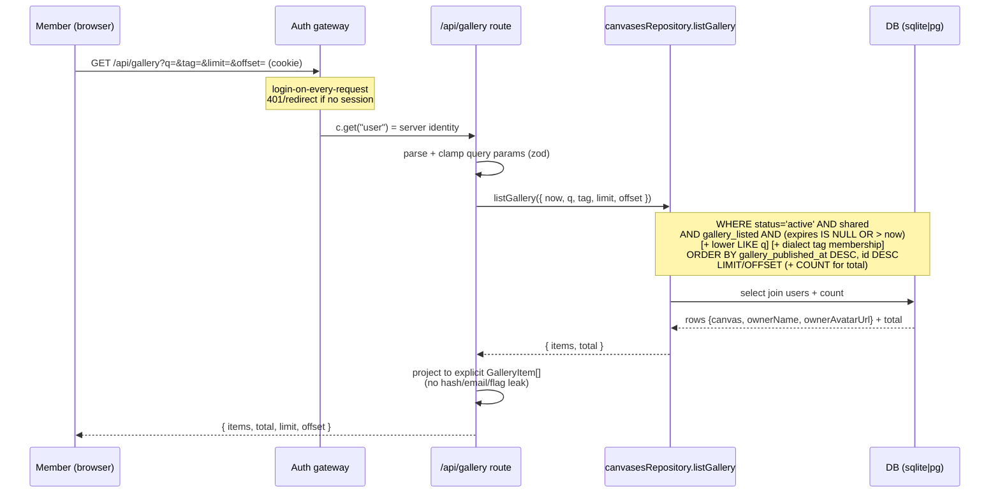
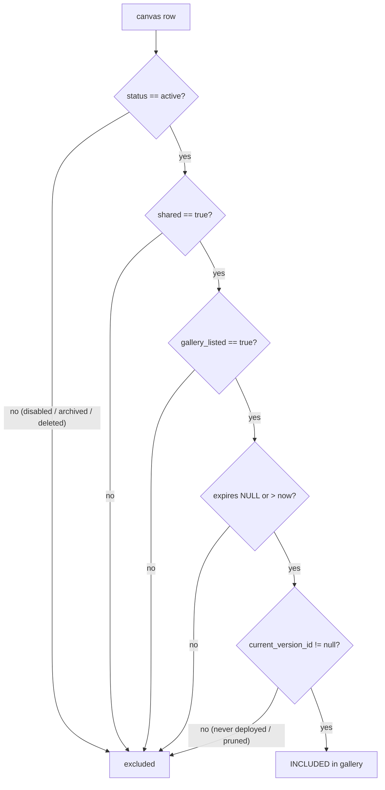

# feat: Gallery browse + listing API (M8)

## Summary

M8 delivers the **opt-in gallery**: a browse surface where any authenticated org
member can discover canvases their colleagues have explicitly shared *and* opted
into the gallery, with owner-provided title / summary / tags. It is the read side
of a feature whose write side already shipped — the `canvases` table carries
`gallery_listed` / `gallery_summary` / `gallery_tags` / `gallery_published_at`,
and the settings UI (`apps/dashboard/src/routes/canvas.settings.tsx`) already
toggles "List in the gallery" and edits the summary + tags.

The work is two seams: a **gallery listing API** (`GET /api/gallery`,
session-authed, behind the login gateway) that returns only canvases matching the
§12 visibility predicate — `status = active AND shared AND gallery_listed AND not
expired` — enriched with owner display metadata, paginated, text-searchable, and
tag-filterable; and a **dashboard gallery browse view** at `/gallery` with its own
nav entry, search box, tag chips, pagination, and deliberate empty/loading/error
states.

This plan is **purely additive**: no schema columns, no migrations, no changes to
existing routes. That keeps the integration-conflict surface small and is well
within the product's scale (an opt-in, single-org gallery is dozens — not
millions — of rows).

---

## Problem Frame

§6.3 #11 and §6.9 #11 promise an **opt-in gallery** for v1: "explicitly shared
canvases can appear with owner-provided title/description/tags." §16 M8 frames it
as "opt-in gallery browse/listing for explicitly shared canvases with owner
metadata." The write path (toggle + metadata fields) exists; **there is no read
path** — nothing surfaces listed canvases to other members. M8 builds that read
path.

The defining constraint is **§12 (auth invariants)**. A gallery is, by
definition, a place where one user sees pointers to *other users'* canvases — so
the visibility predicate is security-critical and must be evaluated **per request
with no cached grants**, exactly like `decideCanvasAccess`
(`apps/server/src/canvas/authorization.ts`). The gallery must show a canvas **iff**
it is simultaneously:

- `status = "active"` (a disabled / archived / deleted canvas never appears), and
- `shared = true` (revoke flips this → it disappears next request), and
- `gallery_listed = true` (the owner's explicit opt-in), and
- not expired (`shared_expires_at IS NULL OR shared_expires_at > now`), and
- has a published version (`current_version_id IS NOT NULL`) — a listed canvas
  that was never deployed (or whose versions were all pruned) 404s on open
  (`serve.ts` returns `notFound("unpublished")`), so listing it would be a dead
  link rather than a discoverable canvas.

Because all five are columns checked at query time, **revoke / expiry / archive /
disable / delete / un-list all remove a canvas from the gallery on the very next
request** — no separate revocation bookkeeping. This is the same
"check-at-request-time" design the canvas content path already relies on.

What the gallery is **not** (carried from the brief): not an *automatic* org-wide
directory (§6.9 #14 "Automatic org-wide directory/search of shared canvases
[later]"). Only canvases the owner *explicitly opted in* appear. M8 is the
opt-in directory, not the automatic one.

---

## Requirements

Traceability back to `BUILD_BRIEF.md`:

- **R1** — `GET /api/gallery` returns only canvases where `status=active AND shared
  AND gallery_listed AND (shared_expires_at IS NULL OR > now) AND current_version_id
  IS NOT NULL`. (§12.0 invariants 3/5; §6.3 #5/#6 revoke + expiry honored
  instantly; the published-version clause keeps the gallery free of dead links.)
- **R2** — Each gallery item carries **owner-provided metadata**: `title`,
  `gallerySummary`, `galleryTags`, plus the canvas `url` and the owner's **display
  identity** (name + avatar). Never leaks `api_key_hash`, `password_hash`, owner
  email, or any non-display user field. (§6.9 #11; OPEN-7; §12.0 invariant #1.)
- **R3** — The listing is **paginated** (stable order: most-recently-published
  first). (§6.9 #11 "browse"; task scope.)
- **R4** — The listing is **searchable** by free text over title + summary, and
  **filterable** by a single tag. Tag filtering traces to §6.9 #11 ("owner-provided
  …tags"). Free-text search is **not** named by §6.9 #11 and is a deliberate
  M8-scope decision from the milestone directive ("paginated + searchable"); it is
  distinct from §6.9 #13 "Search *own* canvases [v1.1]" (that's personal-canvas
  search, a different feature). Kept in v1 because it's a thin LIKE over a small set;
  droppable to a follow-up without disturbing the rest of the plan if the integrator
  prefers tag-only browse.
- **R5** — Login-on-every-request holds: the endpoint sits behind the auth gateway;
  an unauthenticated request never reaches it. (§12.0 invariant #1.)
- **R6** — A `hasPassword` canvas still appears in the gallery (the gallery is a
  directory of *links*; the password gate enforces on open, exactly as today). The
  gallery never exposes the password or its hash. (§6.2 #7; §12.)
- **R7** — Dashboard `/gallery` browse view: card grid of listed canvases with
  title, summary, tags, owner, and an open-canvas affordance; a search box; tag
  chips that filter; pagination control; and deliberate empty / loading / error
  states. A nav entry sits alongside "Canvases" / "Archived". (§6.9 #11, #7, #8,
  #10.)
- **R8** — No new schema columns or migrations; build on the existing
  `gallery_*` columns and the existing settings write path.

---

## Key Technical Decisions

### KTD-1 — `/api/gallery` is its own router, mounted behind the gateway, NOT under `/api/canvases`

Mirror `meRoutes` (`apps/server/src/routes/me.ts`): a standalone Hono router
mounted at `/api/gallery` in `apps/server/src/app.ts`, **after** the auth gateway
(login-on-every-request) and **after** `/api/me`, alongside `managementRoutes`.

Rationale: `/api/canvases/:id` would shadow a literal `/api/canvases/gallery`
segment (the exact trap `me.ts` documents). The gallery is also semantically
distinct from canvas *management* — it is cross-owner read, not owner-scoped CRUD —
so a separate router is the honest boundary. Its route-layer deps are just
`{ config, canvases }`: the owner-metadata JOIN to `users` is performed **inside**
`canvasesRepository.listGallery` via the shared db client (which already reaches
both tables, the codebase's repo-joins-its-own-tables convention) — the route does
**not** take a `usersRepository` dep. GET-only, so no `requireSameOrigin` guard is
needed (same-origin guards mutations; reads behind the session gateway are already
authn-gated).

### KTD-2 — The §12 visibility predicate lives in SQL, in a new repository method

Add `canvasesRepository.listGallery(opts)` to
`apps/server/src/db/repositories/canvases.ts`. The five-part predicate
(`status=active AND shared AND gallery_listed AND not-expired AND current_version_id
IS NOT NULL`) is a single `and(...)` `WHERE` clause, ordered `desc(galleryPublishedAt)`
with a stable `desc(id)` tiebreak. This keeps the security filter in one tested place and means the DB never
returns a non-listed row to the route layer (no chance of a shaping bug leaking an
un-shared canvas).

Rationale: identical philosophy to `decideCanvasAccess` and `findBySlug` (which
already excludes `deleted`). Putting the predicate in SQL — not in JS after a broad
fetch — is both correct (the route can't forget a clause) and the natural fit. The
`now` value is passed in by the route (one `Date.now()` at the call site), matching
how `decideCanvasAccess(canvas, user, now)` is structured for testability.

### KTD-3 — Owner display metadata via a JOIN to `users`, projected to display-only fields

`listGallery` joins `canvases` → `users` on `owner_id` and the repository returns
rows carrying `{ canvas, ownerName, ownerAvatarUrl }`. The route projects to an
explicit gallery-item shape — **never a spread** of the canvas or user row — so
`api_key_hash`, `password_hash`, owner `email`, `provider_sub`, `is_admin`,
`is_blocked` can never leak. This is the `meRoutes` "explicit projection" rule
applied to a second surface.

Rationale: §12.0 invariant #1 (identity/sensitive data only from the server, never
over-exposed). Owner **name + avatar** are appropriate to show in a trusted-org
gallery ("who made this"); email and internal flags are not.

Note for the integrator: OPEN-7 fixes the gallery *metadata* shape as "title,
description, tags" and does not mention owner identity. Showing owner name + avatar
is a **deliberate plan-level addition**, justified by the trust model (name/avatar
are already visible org-wide via `/api/me` and elsewhere), not something the brief
literally required — ratify it as a choice rather than an inherited requirement. It
could be reduced to name-only, or dropped, without affecting the rest of the plan.

### KTD-4 — Text search = portable `lower()` LIKE; tag filter = dialect-branched JSON membership

- **Search (`q`)**: `lower(title) LIKE %q%` OR `lower(gallery_summary) LIKE %q%`,
  with `q` lower-cased and LIKE wildcards escaped. `lower()` + `LIKE` behave
  identically on SQLite and Postgres, so this needs no dialect branch.
- **Tag filter (`tag`)**: `gallery_tags` is a JSON array (`c.json` → TEXT-json on
  SQLite, `jsonb` on Postgres), and JSON membership is the one genuinely
  dialect-divergent query. Branch on `client.dialect` (the existing seam):
  - SQLite → `EXISTS (SELECT 1 FROM json_each(gallery_tags) WHERE json_each.value =
    ${tag})`.
  - Postgres → containment, binding a **JSON string** (not a JS array — a JS array
    binds as a Postgres `text[]` literal `{tag}` and `jsonb @> text[]` is a type
    error): `sql\`${t.galleryTags} @> ${JSON.stringify([tag])}::jsonb\``.

  Both are exact-match, injection-safe via bound params. The dual-dialect repo test
  (U1) exercises both legs, catching a wrong bind.

Rationale: keep the common path dialect-free; isolate the one divergence behind the
repo's existing dual-dialect seam, with mandatory dual-dialect repo tests (the
codebase rule: dialect-sensitive SQL is tested on **both** legs at the repo level —
see `docs/solutions/2026-06-13-dual-dialect-drizzle-seam.md`). Escaping LIKE
metacharacters (`%`, `_`) in `q` avoids a colleague's literal `%` widening their
own search — an accident-class concern, right-sized per the trust model, not a
hostile-input defense.

### KTD-5 — Offset/limit pagination (not keyset)

`opts.limit` (default 24, clamped to a max of 60) + `opts.offset` (default 0).
Response: `{ items, total, limit, offset }` so the UI can render "showing N of
M" + prev/next. `total` is a second `count()` query under the same predicate
(minus limit/offset).

Rationale: at gallery scale (dozens of rows) offset pagination is simplest and
correct; the "rows shift under you" downside of offset paging is immaterial here.
Keyset/cursor paging and SQL-level relevance ranking are the documented post-v1
"gallery search/browse improvements" (§16 Post-v1) — deferred, not built.

### KTD-6 — No schema change, no index, no migration

M8 adds zero columns. It also deliberately adds **no** `(gallery_listed,
gallery_published_at)` index: at the expected row count a sequential scan is
negligible, and skipping the index keeps M8 from touching `schema.sqlite.ts` /
`schema.pg.ts` / `schema.test.ts` / `drizzle/*` — shrinking the cross-branch
integration-conflict surface to near zero. If the gallery ever grows enough to
matter, the index is a trivial isolated follow-up. (Recorded under Deferred.)

### KTD-7 — Dashboard data layer mirrors the existing `api.ts` / `queries.ts` pattern

Add `api.listGallery(params)` to `apps/dashboard/src/lib/api.ts` (reusing the
shared `request` helper → auth-expiry + ApiError handling for free), a
`GalleryItem` type, a `useGallery(params)` hook + query key in
`apps/dashboard/src/lib/queries.ts`, and a lazy route in
`apps/dashboard/src/router.tsx` at `/gallery` (a top-level path — **not** under
`/c/`, `/v1/`, `/auth/`, `/api/`, per the SPA routing rule in
`docs/solutions/2026-06-13-dashboard-spa-patterns.md`).

Rationale: the SPA already has a settled, tested shape for "list endpoint → typed
client → react-query hook → lazy route → cards." Gallery is a new instance of that
exact pattern; inventing anything new would be unjustified.

---

## High-Level Technical Design

### Request flow (gallery browse → render)

### The visibility predicate (single source of truth)

A password-gated canvas takes the **INCLUDED** branch (the gate is enforced on
open, not in the listing) — see R6. The predicate intentionally mirrors
`decideCanvasAccess`'s deny-ordering for the public-facing cases, minus the
owner/admin bypass (the gallery is a directory, not an access grant: even the owner
sees their own listed canvas through the same shared+listed predicate, so the
gallery reflects what *others* can see).

---

## Implementation Units

### U1. Gallery listing repository method (`listGallery`)

**Goal:** One tested repository method that encapsulates the §12 visibility
predicate, owner join, search, tag filter, ordering, and pagination + a total
count.

**Requirements:** R1, R2 (join), R3, R4, R6, R8 (no schema change — builds on the
existing `gallery_*` columns).

**Dependencies:** none (builds on existing `canvases` + `users` tables).

**Files:**
- `apps/server/src/db/repositories/canvases.ts` (add `listGallery` + a
  `GalleryListOptions` / `GalleryRow` type)
- `apps/server/src/db/repositories/canvases.gallery.test.ts` (new, dual-dialect)

**Approach:**
- Signature: `listGallery(opts: { now: number; q?: string; tag?: string; limit:
  number; offset: number }): Promise<{ items: GalleryRow[]; total: number }>`
  where `GalleryRow = { canvas: Canvas; ownerName: string; ownerAvatarUrl: string |
  null }`.
- Base predicate (always): `and(eq(status,'active'), eq(shared,true),
  eq(galleryListed,true), or(isNull(sharedExpiresAt), gt(sharedExpiresAt, now)),
  isNotNull(currentVersionId))`.
- `q`: when present and non-blank, AND a `(lower(title) LIKE p OR
  lower(gallery_summary) LIKE p)` where `p = '%' + escapeLike(q.toLowerCase()) +
  '%'`. Escape `%`, `_`, and the escape char.
- `tag`: when present, AND the dialect-branched JSON-membership predicate (KTD-4).
- JOIN `users` on `owner_id`; select canvas columns + `users.name` +
  `users.avatar_url` only.
- `ORDER BY gallery_published_at DESC, id DESC`; `LIMIT opts.limit OFFSET
  opts.offset`.
- `total`: a parallel `count()` with the same predicate (no limit/offset/order).
- Keep the `db as any` dual-dialect seam exactly as the rest of the file; type the
  inputs and `GalleryRow` strongly.

**Patterns to follow:** `findBySlug` / `listByOwner` (predicate + cast shape) in
the same file; the dialect-branch style in `setCurrentVersionIfReady`;
`docs/solutions/2026-06-13-dual-dialect-drizzle-seam.md` for the JSON-membership
divergence and the "test dialect-sensitive SQL on both legs" rule.

**Test scenarios** (`canvases.gallery.test.ts`, run on **both** sqlite + pglite):
- Covers R1. A canvas that is active+shared+listed+unexpired+published (has a
  `current_version_id`) **is** returned; a canvas missing each one of those
  (not-shared / not-listed / status=archived / status=disabled / status=deleted /
  expired-in-past / `current_version_id IS NULL`) is **excluded** — one case per
  excluded condition. The `current_version_id IS NULL` case (listed-but-never-
  deployed) is the dead-link guard.
- Expiry boundary: `shared_expires_at` exactly `== now` is excluded (`> now`
  required); `now + 1` is included; `NULL` is included.
- Covers R2. Returned row carries the owner's `name` + `avatar_url` and the canvas
  `gallery_summary` / `gallery_tags`; a second owner's listed canvas surfaces that
  owner's name (cross-owner join correctness).
- Covers R6. A canvas with a `password_hash` set but otherwise listed **is**
  returned (gallery lists gated canvases).
- Ordering: three canvases with distinct `gallery_published_at` come back
  newest-first; equal timestamps fall back to a deterministic `id` order.
- Pagination: with 5 listed canvases, `limit=2 offset=0` returns the first 2 and
  `total=5`; `offset=4` returns the last 1; `offset=10` returns `[]` with
  `total=5`.
- Search: `q` matching a title substring (case-insensitive) returns only matches;
  `q` matching a summary substring returns matches; `q` containing a literal `%`
  is escaped (matches only a canvas whose title literally contains `%`, not all).
- Tag filter: `tag="charts"` returns only canvases whose `gallery_tags` contains
  `charts`; a non-existent tag returns `[]`; tag match is exact (not substring).
- Combined `q` + `tag` + pagination AND together correctly.

**Verification:** `pnpm test` green on both dialects; the predicate excludes every
non-listed state and the JSON tag query works on both sqlite and pg.

---

### U2. Gallery API route (`GET /api/gallery`)

**Goal:** A session-authed, GET-only router that validates query params, calls
`listGallery`, and returns an explicit, leak-proof gallery-item projection.

**Requirements:** R1, R2, R3, R4, R5, R6.

**Dependencies:** U1.

**Files:**
- `apps/server/src/routes/gallery.ts` (new)
- `apps/server/src/app.ts` (mount `/api/gallery` after `/api/me`, before/after
  `/api/canvases` — order-independent since the base paths differ)
- `apps/server/src/routes/gallery.test.ts` (new, sqlite-only HTTP route tests)

**Approach:**
- `galleryRoutes(deps: { config; canvases; })` → `new Hono<AppEnv>()`.
- `GET /`: parse query with a zod schema — `q: string optional`, `tag: string
  optional`, `limit: coerce int, default 24, min 1, max 60`, `offset: coerce int,
  default 0, min 0`. Invalid → clamp/default rather than 400 where sensible (a
  browse URL with a junk `limit` should still render, not error); a hard-malformed
  shape falls back to defaults.
- Call `deps.canvases.listGallery({ now: Date.now(), ...parsed })`.
- Project each `GalleryRow` to: `{ id, slug, url: canvasUrl(config, slug), title,
  summary: gallerySummary, tags: galleryTags as string[] ?? [], hasPassword:
  passwordHash !== null, publishedAt: galleryPublishedAt, owner: { name, avatarUrl
  } }`. Explicit field list — no spread.
- Return `{ items, total, limit, offset }`.
- Mount in `app.ts`: `app.route("/api/gallery", galleryRoutes({ config, canvases
  }))` in the post-gateway block next to `meRoutes` / `managementRoutes`.

**Patterns to follow:** `apps/server/src/routes/me.ts` (own-router + explicit
projection + the "/:id would shadow" rationale); `publicCanvas` in
`apps/server/src/routes/management.ts` (projection discipline, `canvasUrl`, the
`galleryTags as string[] | null` cast); the query-parse-with-defaults shape from
existing routes.

**Test scenarios** (`gallery.test.ts`, sqlite-only — auth/routing/shaping is
dialect-independent, matching the `management.test.ts` rationale):
- Covers R1. Seed a mix (listed-and-deployed, not-shared, not-listed, archived,
  disabled, expired, listed-but-never-deployed) across two owners → `GET
  /api/gallery` returns exactly the listed-active-unexpired-published ones.
- Covers R2 + R5. Response items carry owner `name` + `avatarUrl`; assert against
  the **deserialized HTTP response body** (not just the TS type) that
  `body.items[0]` and `body.items[0].owner` have **no** `apiKeyHash`,
  `passwordHash`, `email`, `providerSub`, `isAdmin`, or `isBlocked` property
  (`expect(...).not.toHaveProperty(...)`). A spread-leak would pass `tsc` but must
  fail this runtime assertion — `me.ts` is the nearest pattern and it intentionally
  returns `email`, so the explicit projection + this negative test are the guard.
- Covers R3. `?limit=2` returns 2 items + correct `total`; `?offset=` walks pages;
  out-of-range offset → empty items, correct total.
- Covers R4. `?q=` filters by title/summary; `?tag=` filters by tag; both combine.
- Covers R6. A listed password-gated canvas appears with `hasPassword: true` and no
  password material.
- Param robustness: `?limit=9999` clamps to the max; `?limit=abc` falls back to
  default (renders, not 400); negative offset clamps to 0.
- The route is GET-only: a `POST /api/gallery` is 404/405 (no mutation surface).

**Verification:** `pnpm test` green; the route never emits a non-listed canvas or
any sensitive field; pagination + search + tag params behave.

---

### U3. Dashboard gallery browse view (data layer + route + nav + view)

**Goal:** The `/gallery` page end-to-end: typed client + hook, lazy route, nav
entry, and a searchable, tag-filterable, paginated card grid of listed canvases
with owner attribution and an open affordance — with deliberate, distinct empty /
loading / error states. (The data layer is folded in here rather than split out: it
is ~20 lines of typed wiring over the already-tested `request` helper, only
meaningful when this view consumes it, and is covered by this unit's view tests.)

**Requirements:** R7, R6 (password badge), R2 (owner display).

**Dependencies:** U2 (response contract).

**Files:**
- `apps/dashboard/src/lib/api.ts` (add `GalleryItem`, `GalleryPage` types +
  `api.listGallery`; export a shared `GALLERY_PAGE_SIZE` constant)
- `apps/dashboard/src/lib/queries.ts` (add `keys.gallery` + `useGallery`)
- `apps/dashboard/src/routes/gallery.tsx` (new — the view)
- `apps/dashboard/src/router.tsx` (lazy route at `/gallery`, top-level, with
  `validateSearch` for `q` / `tag` / `page`)
- `apps/dashboard/src/app-layout.tsx` (add a "Gallery" nav entry beside "Archived")
- `apps/dashboard/src/test/gallery.test.tsx` (new — jsdom view tests)

**Approach — data layer:**
- `GalleryItem = { id; slug; url; title; summary: string | null; tags: string[];
  hasPassword: boolean; publishedAt: number | null; owner: { name: string;
  avatarUrl: string | null } }`; `GalleryPage = { items: GalleryItem[]; total:
  number; limit: number; offset: number }`.
- `api.listGallery(params: { q?; tag?; limit?; offset? })` → builds a query string
  (omit empty params) → `request<GalleryPage>("/api/gallery?...")` (reuses the
  shared `request` → auth-expiry + ApiError for free).
- `keys.gallery = (params) => ["gallery", params] as const`; `useGallery(params)` →
  `useQuery` with `placeholderData: keepPreviousData` so paging/search don't flash
  empty.

**Approach — pagination contract (avoids the page↔offset desync):**
- A single exported `GALLERY_PAGE_SIZE` constant (e.g. 24) is the client's `limit`
  **and** the page→offset divisor: `offset = (page - 1) * GALLERY_PAGE_SIZE`.
- The view derives "showing X–Y of N" and the prev/next disabled bounds **from the
  response's echoed `limit` / `offset` / `total`** — never from a client-assumed
  size — so server clamping can't desync the display.
- If a refetch returns `offset >= total` and `total > 0` (e.g. an item was un-listed
  while the user was on the last page), auto-reset to page 1 rather than rendering
  an empty page with stale prev/next.

**Approach — route + view:**
- Route: lazy-load `GalleryRoute`; `validateSearch` normalizes `q?: string`, `tag?:
  string`, `page?: number` (1-based). Path `/gallery` (avoids `/c/`, `/v1/`,
  `/auth/`, `/api/` per the SPA routing learning).
- `PageHeader` ("Gallery", description). A search input bound to `q`: **debounced
  300 ms** on keystrokes, but **clearing the field updates `q` immediately** (no
  debounce delay on empty). The input writes to the route search param so it's
  shareable / back-button-able.
- Active-tag filter renders as a chip with an **X button** (`aria-label="Remove tag
  filter"`); clicking it clears the `tag` param and returns to the unfiltered
  listing. Clicking a tag chip on a card sets `?tag=`.
- Responsive **card grid**: 1 column on mobile, 2 at `sm`, 3 at `lg` (the first grid
  layout in the dashboard; existing views are single-column lists).
- Card: the **title is a direct external link to `canvas.url`** (`target=_blank
  rel="noreferrer"`) — that *is* the open affordance, so there is **one** primary
  tap target, not a duplicate "Open" link. Body shows the summary, owner name +
  avatar, and tag chips. A `CopyButton` (copy link) is the only secondary action. A
  "lock" badge appears when `hasPassword`, carrying `title`/`aria-label="Password
  required to open"` so a viewer understands what it means on someone else's canvas.
- States: `isLoading` → card skeletons; `isError` → `EmptyState` with a retry
  control; `items.length === 0` → two **distinct** empty states:
  - no search/tag active → "No canvases in the gallery yet" with a link to a
    canvas's settings explaining the "List in the gallery" toggle (never a generic
    "nothing here").
  - a `q` or `tag` is active → "No canvases match your search" with a **"Clear
    filters"** action that resets `q` + `tag`.
- Nav: copy the "Archived" `<Link>` block in `app-layout.tsx`. (Note: the section
  nav is `hidden md:flex` — the Gallery link inherits the existing mobile-nav
  behavior; this plan does not change mobile nav, matching Canvases/Archived.)
- Token-first styling only (CSS vars; no hard-coded colors) per the re-skin contract.

**Patterns to follow:** every existing entry in `api.ts` (`listCanvases`,
`getUsage`) + `queries.ts` (`useCanvases`); `apps/dashboard/src/routes/index.tsx`
and `archived.tsx` (list + states + `EmptyState`);
`apps/dashboard/src/components/CanvasList.tsx` (card + actions), `EmptyState.tsx`
(the "never a generic empty" rule); `app-layout.tsx` nav `<Link>` styling;
`router.tsx` `validateSearch` shape; the token/re-skin rules in
`docs/solutions/2026-06-13-dashboard-spa-patterns.md`.

**Test scenarios** (`gallery.test.tsx`, jsdom — mock `api.listGallery`):
- Renders a grid of returned items: title, summary, tags, owner name visible; the
  title links to `canvas.url` with `target=_blank`.
- Covers R6. An item with `hasPassword: true` shows the lock badge with its
  "Password required to open" accessible label.
- Empty result with no `q`/`tag` → "no canvases yet" empty state with the
  list-a-canvas link; empty result *with* a `q`/`tag` → "no matches" empty state
  with a working "Clear filters" action (clicking it resets both params).
- Loading → skeleton; error (rejected query) → error state with a retry control.
- Typing in search updates the `q` param (after debounce) and re-requests;
  **clearing the field resets `q` immediately** and returns to the full listing.
- Clicking a card tag chip sets `?tag=` and re-requests filtered; clicking the X on
  the active-tag chip clears `tag` and reverts to the unfiltered result.
- Pagination: next/prev advance `offset` by `GALLERY_PAGE_SIZE`; controls disable at
  first/last page; "showing X–Y of N" is derived from the response's `limit` /
  `offset` / `total`; an `offset >= total` refetch auto-resets to page 1.
- The card's copy affordance copies the canvas `url`.

**Verification:** `pnpm typecheck` + `pnpm test` (dashboard jsdom suite) green;
manual/`pnpm dev` sanity: `/gallery` lists a listed+deployed canvas, hides a
non-listed / never-deployed one, search + tag + paging work, the nav entry
highlights on the route.

---

## Scope Boundaries

**In scope (M8):** the gallery listing API, the dashboard browse view + route + nav
entry, search (title/summary), tag filter, offset pagination, owner display
metadata, and the §12 visibility predicate.

### Deferred to Follow-Up Work
- **`(gallery_listed, gallery_published_at)` index** — unneeded at current scale;
  isolated schema follow-up if the gallery grows (KTD-6).
- **Keyset/cursor pagination + SQL relevance ranking** — the §16 Post-v1 "gallery
  search/browse improvements"; offset paging suffices for v1 (KTD-5).
- **Audit-logging gallery *browse* events** — the gallery is a read surface;
  share/list *changes* are already audited on the settings write path
  (`share_change`, and the existing settings flow). Reads aren't audited elsewhere
  in the app, so adding browse-audit here would be inconsistent. (If wanted later,
  it's additive.)

### Outside this product's identity (from the brief)
- **Automatic org-wide directory / automatic search of all shared canvases** (§6.9
  #14 "[later]"). M8 is the *opt-in* directory; nothing appears without the owner's
  explicit gallery toggle.
- **External / anonymous gallery access** (§6.2 #14 "[never]"). The gallery is
  behind the org login gateway like everything else.

### Out of scope (other milestones)
- Admin panel (M7). AI / realtime (M9).

---

## System-Wide Impact

- **New public-ish surface, but same trust boundary.** `/api/gallery` is a new
  endpoint, but it sits behind the same auth gateway as everything else — it does
  not widen who can reach the server, only what an already-authenticated member can
  see. The *new* risk it introduces is **over-exposure** (showing a canvas that
  isn't listed, or leaking owner/sensitive fields) — both are closed by the
  SQL predicate (U1) and the explicit projection (U2), and asserted negatively in
  tests.
- **No write-path or schema change.** The settings write path, `canvases`
  repository's existing methods, and all migrations are untouched — lowest-risk
  integration shape.
- **Integration-conflict watch (for the human integrator):** `apps/server/src/app.ts`
  (one `app.route` line added), `apps/dashboard/src/router.tsx` (one route),
  `apps/dashboard/src/app-layout.tsx` (one nav link),
  `apps/dashboard/src/lib/api.ts` + `queries.ts` (additive),
  `apps/server/src/db/repositories/canvases.ts` (additive method). All additive;
  no shared-file *edits* to existing logic. **No** `schema.*.ts` / `schema.test.ts`
  / `drizzle/*` / `types.ts` touch.

---

## Risks & Mitigations

- **R-A — Visibility leak (showing a non-listed or revoked canvas).** *Mitigation:*
  the five-part predicate lives in one SQL `WHERE` (U1) with a per-excluded-state
  test each; the route never broad-fetches then filters. P0-class invariant
  (§12.0) — tested first.
- **R-B — Sensitive-field leak via the owner join.** *Mitigation:* explicit
  display-only projection (no row spread), with negative assertions that
  `password_hash` / `api_key_hash` / owner `email` / internal flags never appear in
  the body (U2). Mirrors the `meRoutes` rule.
- **R-C — Dual-dialect JSON tag query divergence.** *Mitigation:* dialect-branched
  predicate behind the existing seam + mandatory both-dialect repo tests (U1);
  follows `dual-dialect-drizzle-seam.md`.
- **R-D — LIKE metacharacter surprise in search.** *Mitigation:* escape `%`/`_` in
  `q` (accident-class, right-sized per trust model), tested.
- **R-E — Stale gallery after un-list/revoke.** *Mitigation:* none needed — the
  predicate is evaluated per request; react-query refetch + no server cache means
  the next load reflects reality. A canvas un-listed *between* a member's listing
  load and their click also self-heals: the canvas access path
  (`decideCanvasAccess`) re-checks `shared`/expiry per request and 404s a now-unshared
  link — the gallery hands out links, not access grants. A rendered-vs-`total`
  off-by-one under a concurrent un-list (the `count()` and the `select()` are
  separate statements) is accepted and self-corrects on the next refetch.
- **R-F — Dead link (listed-but-never-deployed canvas).** *Mitigation:* the
  `current_version_id IS NOT NULL` predicate clause (U1) keeps a never-deployed /
  fully-pruned canvas out of the gallery, with a dedicated exclusion test; SQL is the
  robust place (versions can be pruned *after* the owner toggles listing).
- **R-G — Blocked owner's listed canvas keeps appearing (inherited, cross-cutting).**
  Today `is_blocked` gates *login*, not *content* — neither `decideCanvasAccess` nor
  this predicate checks the owner's `is_blocked`, so once admin-block lands (M7) a
  blocked member's shared+listed canvases would still surface here, exactly as they
  still serve on the canvas content path. This is **not a new** invariant the gallery
  breaks (it inherits the content path's behavior), so it is out of scope for M8.
  Flagged for the M7 owner: decide once, app-wide, whether a blocked owner's shared
  content (gallery + direct URL) goes dark. No M8 code change.

---

## Test Strategy

- **U1** — dual-dialect (sqlite + pglite) repo tests: the security predicate is the
  highest-value coverage; every excluded state (including the never-deployed
  dead-link guard) + the JSON tag membership get a case on both legs.
- **U2** — sqlite-only HTTP route tests (auth/routing/shaping are
  dialect-independent, per the established `management.test.ts` split): positive
  listing + negative field-leak assertions (against the deserialized body) + param
  robustness.
- **U3** — dashboard jsdom view tests (mocked client): states, search (incl.
  immediate-clear), tag set/clear, paging, password badge, card link target. The
  data layer is trivial typed wiring over the already-tested `request` helper and is
  covered through these view tests rather than standalone.
- Gate per unit: `pnpm typecheck && pnpm lint && pnpm test` green before moving on.

---

## Sequencing

U1 → U2 → U3, strictly dependency-ordered (repo → route → dashboard view). One
local commit per unit, each unit's gates green before the next. Single branch
(`feat/m8-gallery`), single logical change set.
