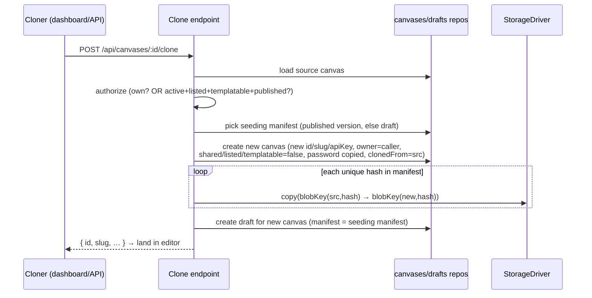
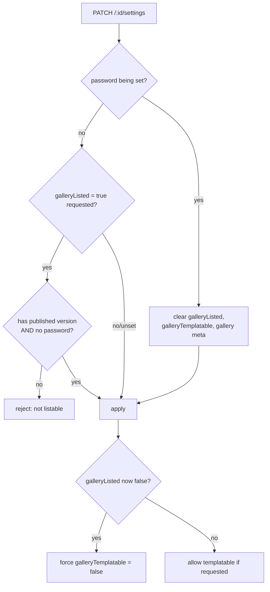

# feat: Clone a canvas as a template (+ gallery listability tightening)

## Summary

Let a member create a brand-new canvas they own from an existing one — a "Make a copy /
Use as template" action. Cloning is available on **any active canvas you own** and on **other
members' canvases in the gallery only when they're marked templatable**. The clone copies the
files (content-addressed blobs + manifest) into the new canvas's own namespace, seeds it as an
**unpublished draft** so the cloner customizes before going live, carries over the source's
password, and records lineage (`Cloned from …`).

The feature is coupled to a **tightening of gallery listability**: a canvas may be listed in
the gallery only when it is **active + published + has no password**. Setting a password on a
listed canvas auto-unlists it. "Templatable" is a second, opt-in flag that requires listing.
Listing/templatable status (and the reason a canvas *can't* be listed) is surfaced in four
places, not just Settings.

This reverses a documented M8 decision (password-gated canvases were intentionally *listed*;
the gate enforced on open — see origin: `docs/solutions/2026-06-13-gallery-listing-patterns.md`).
The plan updates that learning.

---

## Problem Frame

Today a canvas is a one-off: there is no way to start from an existing canvas's files. The
gallery (M8) lets members browse and open colleagues' shared canvases, but the only action is
"open the live URL." Members want to **fork** a good canvas into their own editable copy.

Two things make this tractable and two things make it delicate:

- **Tractable:** files are already **content-addressed per canvas** — a version/draft is a
  `path → {size, hash, mime}` manifest over blobs at `canvases/{canvasId}/blobs/{sha256}`
  (origin: `docs/solutions/2026-06-13-content-addressed-draft-publish.md`). Cloning is a
  manifest copy plus a blob byte-copy into a new per-canvas namespace — no reference rewriting.
- **Tractable:** canvas creation, slug/API-key generation, and draft seeding already exist and
  are reused wholesale.
- **Delicate:** the gallery is the product's **only cross-owner read surface**, governed by one
  SQL predicate that *is* the security boundary (origin:
  `docs/solutions/2026-06-13-gallery-listing-patterns.md`). Cloning others' canvases reads
  through that boundary and must honor it exactly.
- **Delicate:** the new listability rules touch the password/share/gallery coupling, which is
  §12 auth-invariant-adjacent. Identity and authorization always come from the server-side auth
  context (origin: `docs/solutions/2026-06-13-auth-invariant-checklist.md`).

---

## Requirements

- **R1 — Clone action (own).** A member can clone any **active** canvas they own, regardless of
  its listing/password/publish state.
- **R2 — Clone action (gallery).** A member can clone another member's canvas **only** when it
  is active, gallery-listed, **templatable**, and published.
- **R3 — Clone is owned + isolated.** The clone is a new canvas owned by the caller with a new
  id, slug, and API key. It is **not shared, not listed, not templatable**, regardless of the
  source's state ("not shared no matter original status").
- **R4 — Clone source = published, fallback draft.** The clone's draft is seeded from the
  source's **published** version manifest; only if the source was never published (own-canvas
  case) does it fall back to the source's draft.
- **R5 — Clone-to-draft.** The clone starts **unpublished** (draft only, `currentVersionId =
  null`, no version history). The cloner lands in the editor.
- **R6 — Assets copied, not referenced.** Every blob referenced by the seeding manifest is
  copied into the clone's per-canvas blob namespace; the manifest is reused verbatim (hashes are
  identical). No runtime data (KV, files-primitive, usage) is copied.
- **R7 — Password carried.** Cloning your own password-protected canvas **keeps** the password
  (`passwordHash` + `passwordVersion` copied). The new gate grant is per-canvas, so the cloner
  re-enters the password on the clone.
- **R8 — Lineage.** The clone stores `clonedFromCanvasId` and shows a subtle "Cloned from
  <title>" on its Overview (links to the source if the viewer can still see it).
- **R9 — Listable only when published.** A canvas can be gallery-listed only when it has a
  published version. Never-published canvases cannot be listed; the UI explains why.
- **R10 — Listable only when unprotected.** A canvas cannot be listed while password-protected.
  Setting a password on a listed canvas auto-unlists it (clears listing, templatable, and
  gallery metadata). Warn in the UI before saving; the server enforces regardless.
- **R11 — Templatable requires listed.** "Templatable" is an opt-in flag that can only be on
  when the canvas is listed. Un-listing (for any reason) clears templatable.
- **R12 — Status everywhere.** Listing/templatable state — and the blocker reason when a canvas
  is not listable — is surfaced on dashboard canvas cards, the canvas Overview tab, gallery
  cards (a "Template" badge), and the editor/publish bar, in addition to Settings.
- **R13 — Clone clarity.** Cloning shows a confirmation dialog explaining what is copied and
  what is reset before it happens.
- **R14 — Agent-native parity.** The clone action is exposed as an API endpoint (and SDK
  method), not only a dashboard button (per the project's agent-native parity convention).

---

## Key Technical Decisions

- **KTD1 — Copy bytes into the new namespace; do not share blobs globally.** Blobs are
  per-canvas by deliberate design (canvas-scoped dedup/refcount/GC, one-call purge). A clone
  copies each referenced blob into `canvases/{newId}/blobs/{hash}`. Global/shared CAS is
  explicitly rejected — it would force cross-canvas refcounting, break one-call purge, and turn
  serve-by-hash into a cross-canvas read (origin:
  `docs/solutions/2026-06-13-content-addressed-draft-publish.md`).
- **KTD2 — Add `StorageDriver.copy(srcKey, dstKey)`.** A first-class copy keeps the byte-copy
  cheap: S3 → server-side `CopyObject` (no download/upload round-trip), local → `copyFile`,
  mem → buffer copy. The clone service copies the *deduped set of hashes* in the manifest, not
  per-path, so a manifest with repeated content copies each blob once. Falls back conceptually
  to get+put semantics, but `copy` is the contract so every driver implements it.
- **KTD3 — Reuse the manifest verbatim.** Because content is addressed by hash and the bytes are
  identical after copy, the clone's draft manifest is the source manifest unchanged. No path or
  reference rewriting.
- **KTD4 — Authorization is computed server-side from the source row.** The clone endpoint
  re-derives eligibility (own vs. gallery-templatable-published) from the DB, never from
  client-supplied flags. The gallery-eligibility check reuses the **same predicate** as
  `listGallery` so "can I clone this" can't drift from "is this in the gallery."
- **KTD5 — Listability is one server-side guard, mirrored in the read predicate.** The settings
  route rejects listing a canvas that is unpublished or password-protected, and clears
  listing/templatable/gallery-metadata when a password is set. The `listGallery` predicate also
  gains `password_hash IS NULL` (defense in depth) alongside the existing
  `current_version_id IS NOT NULL`. The write guard is the UX driver; the read predicate is the
  backstop.
- **KTD6 — `galleryTemplatable` is a new column; templatable ⊆ listed is an invariant.** Any
  code path that clears `galleryListed` also clears `galleryTemplatable` in the same write, so
  the two can never disagree.
- **KTD7 — Greenfield schema, no migration.** Per the project's greenfield rule, add columns to
  both dialect schemas in lockstep and keep the schema-parity test green; no backfill.

---

## High-Level Technical Design

### Clone flow

### Listable-state guard (settings write)

---

## Scope Boundaries

**In scope:** the clone action (own + gallery), the storage `copy` primitive, the clone service
+ endpoint + SDK method, the listability tightening (published + no-password preconditions,
password→unlist, templatable flag), lineage, and the four status surfaces.

### Deferred to Follow-Up Work

- A dedicated `(gallery_listed, gallery_published_at)` index + keyset paging for the gallery
  (already a documented post-v1 follow-up; this plan keeps the existing two-query count).
- Bulk/template "starter gallery" curation or featured templates.
- Showing clone counts / a "forks of this canvas" view on the source.
- Carrying a chosen subset of files or letting the cloner pick published-vs-draft at clone time
  (clone source is fixed per R4).

### Outside this product's identity

- Cross-org or public (unauthenticated) cloning — the gallery is an opt-in, single-org surface.
- Copying runtime primitive data (KV/files/usage) into a clone — a template is static content,
  not another canvas's data.

---

## System-Wide Impact

- **Storage interface** gains a method — all four drivers (`local`, `s3`, `mem`, and the shared
  `contract` test) must implement/verify it. Touches the storage seam but not its callers.
- **Gallery read predicate** changes (adds `password_hash IS NULL`) — affects every gallery
  response; covered by repo-level dual-dialect tests.
- **Settings semantics** change — existing canvases that are currently listed *and*
  password-protected (possible under the old M8 rule) will drop out of the gallery on the next
  read (predicate) and on the next settings save (write guard). Acceptable under the greenfield
  rule; note in the learning update.
- **Dashboard** gains a clone mutation + dialog and status badges across four routes.

---

## Implementation Units

### U1. Schema: `gallery_templatable` + `cloned_from_canvas_id`

**Goal:** Add the two new canvas columns in both dialects, in lockstep.
**Requirements:** R8, R11.
**Dependencies:** none.
**Files:** `packages/shared/src/db/schema.sqlite.ts`, `packages/shared/src/db/schema.pg.ts`,
`packages/shared/src/db/schema.test.ts` (schema-parity), any shared column-helper file the two
schemas share.
**Approach:** `galleryTemplatable: c.bool("gallery_templatable").notNull().default(false)`.
`clonedFromCanvasId: c.text("cloned_from_canvas_id")` nullable, a **pointer not an FK** (mirror
the `currentVersionId` rationale — avoid coupling deletion lifecycles; the source may be purged).
Keep both dialect builders identical via the shared helpers. Greenfield — no migration.
**Patterns to follow:** existing `galleryListed`/`currentVersionId` column definitions; the
dual-dialect seam (`docs/solutions/2026-06-13-dual-dialect-drizzle-seam.md`).
**Test scenarios:**
- Schema-parity test passes with both new columns present and matching across dialects.
- Defaults: a freshly inserted canvas has `galleryTemplatable = false` and
  `clonedFromCanvasId = null` on both dialects.

### U2. `StorageDriver.copy(srcKey, dstKey)`

**Goal:** Add a server-side copy primitive to the storage interface and all drivers.
**Requirements:** R6.
**Dependencies:** none.
**Files:** `apps/server/src/storage/driver.ts` (interface), `apps/server/src/storage/local.ts`,
`apps/server/src/storage/s3.ts`, `apps/server/src/storage/mem.ts`,
`apps/server/src/storage/contract.ts` (shared driver contract test),
`apps/server/src/storage/local.test.ts`, `apps/server/src/storage/s3.test.ts`.
**Approach:** `copy(srcKey: string, dstKey: string): Promise<void>`. Local: `mkdir` dst dir +
`copyFile` (reuse the existing path-traversal guard `pathFor` for **both** keys). S3:
`CopyObject` with `CopySource` = bucket/srcKey. Mem: copy the bytes under the new key. Define
behavior when src is missing: throw a typed not-found (the clone service treats a missing source
blob as a hard error — a manifest referencing an absent blob is corruption, not a skip).
**Patterns to follow:** existing `put`/`get`/`deleteMany` implementations per driver; the
`storageContract` round-trip tests.
**Test scenarios (add to the shared contract so every driver is covered):**
- Copy round-trips bytes: `put(a)`, `copy(a→b)`, `get(b)` equals the original bytes; `a` still
  exists (copy, not move).
- Copy into a nested key creates intermediate structure (local dir creation).
- Copy of a missing source rejects with the typed not-found (does not silently create an empty
  object).
- Overwrite semantics: copying onto an existing dst replaces it.

### U3. Clone service

**Goal:** A server-side service that produces a clone from a source canvas + caller.
**Requirements:** R3, R4, R5, R6, R7, R8.
**Dependencies:** U1, U2.
**Files:** `apps/server/src/canvas/clone-service.ts` (new),
`apps/server/src/canvas/clone-service.test.ts` (new). Reads:
`apps/server/src/canvas/storage-keys.ts` (`blobKey`), `apps/server/src/db/repositories/canvases.ts`,
`apps/server/src/db/repositories/drafts.ts`, `apps/server/src/db/repositories/versions.ts`,
`apps/server/src/canvas/slug.ts`, `apps/server/src/canvas/api-key.ts`.
**Approach:** Given `(source: Canvas, ownerId)`:
1. Resolve the seeding manifest: source's published version manifest (`currentVersionId` →
   `versions.manifest`); if none, the source's draft manifest; if neither, empty.
2. Create the new canvas: new id, `generateSlug()`, `hashApiKey(generateApiKey())`,
   `ownerId = caller`, `title = "Copy of <source.title>"`, `description` copied,
   `passwordHash`/`passwordVersion` copied, `clonedFromCanvasId = source.id`, and explicitly
   `shared=false, galleryListed=false, galleryTemplatable=false, gallerySummary=null,
   galleryTags=null, galleryPublishedAt=null, sharedAt=null, sharedExpiresAt=null,
   currentVersionId=null, status='active', backendEnabled=false` with cap_* defaults.
3. Copy blobs: for each **unique** hash in the manifest, `storage.copy(blobKey(source.id, hash),
   blobKey(newId, hash))`.
4. Create the draft: `drafts.create({ canvasId: newId, manifest, baseVersionId: null })`.
5. Return the new canvas. Return the one-time API key to the caller (mirror create-canvas).
**Execution note:** Implement the copy + draft seeding test-first against the `mem` driver — the
hash-dedup and "draft equals source manifest" invariants are the load-bearing correctness claims.
**Patterns to follow:** canvas creation in `management.ts` `app.post("/")`; draft seeding in
`apps/server/src/draft/service.ts` `ensureDraft`; blob keying in `storage-keys.ts`.
**Test scenarios:**
- Happy: clone of a published canvas → new canvas with a draft whose manifest equals the
  source's **published** manifest; every referenced blob exists under the new canvas prefix; the
  source's blobs are untouched.
- Fallback: clone of a never-published canvas (draft only) → draft seeded from the source draft.
- Dedup: a manifest with two paths sharing one hash copies that blob exactly once.
- Reset invariants: clone has new id/slug/apiKeyHash, `owner = caller`, and
  shared/listed/templatable all false even when the source was shared+listed+templatable.
- Password carry: cloning a password-protected source copies `passwordHash` + `passwordVersion`;
  cloning an unprotected source leaves them null/0.
- Lineage: `clonedFromCanvasId === source.id`.
- No runtime data: no KV/files/usage rows are created for the clone.
- Isolation: deleting/purging the source afterward leaves the clone's blobs intact (canvas-scoped
  namespaces).

### U4. Clone endpoint + authorization

**Goal:** `POST /api/canvases/:id/clone` with correct eligibility.
**Requirements:** R1, R2, R4, R14.
**Dependencies:** U3.
**Files:** `apps/server/src/routes/management.ts`, `apps/server/src/routes/management.test.ts`,
`apps/server/src/db/repositories/canvases.ts` (a `galleryEligible(id)` read reusing the
`listGallery` predicate, or a shared predicate helper).
**Approach:** Authenticated, `sameOrigin`. Load source. Authorize: **(a)** caller owns it and it
is `active`; **or (b)** it is gallery-eligible **and** `galleryTemplatable` (reuse the exact
`listGallery` predicate so eligibility can't drift — gallery-eligible already implies active +
shared + published + (post-U5) no password). Otherwise `404` opaque (don't reveal existence of
non-eligible canvases — mirror the §12.2 opaque-404 invariant). On success call the clone
service and return the new canvas + one-time API key (`201`).
**Patterns to follow:** `ownedCanvas` helper and the opaque-404 pattern in `management.ts`; the
gallery predicate in `canvases.ts` `listGallery`; agent-native parity (expose via SDK in U8/U9).
**Test scenarios:**
- Own active canvas → 201, returns a distinct new canvas owned by caller.
- Own archived/disabled canvas → 404/conflict (only `active` is cloneable).
- Other member's listed+templatable+published canvas → 201.
- Other member's listed-but-**not**-templatable canvas → 404 (opaque).
- Other member's templatable-but-**unlisted** canvas → 404.
- Other member's templatable+listed but **unpublished** canvas → 404 (predicate excludes it).
- Unauthenticated → 401; cross-origin → blocked by `sameOrigin`.
- `Covers R2.` Eligibility uses the same predicate as the gallery (a canvas the gallery would not
  show is not cloneable by a non-owner).

### U5. Listability tightening (server)

**Goal:** Enforce published + no-password preconditions, password→unlist, templatable⊆listed,
and the read-predicate backstop.
**Requirements:** R9, R10, R11, R12 (server data for badges).
**Dependencies:** U1.
**Files:** `apps/server/src/routes/management.ts` (settings PATCH + `publicCanvas` projection),
`apps/server/src/db/repositories/canvases.ts` (`listGallery` predicate), `apps/server/src/routes/gallery.ts`
(projection adds `templatable`), `apps/server/src/routes/management.test.ts`,
`apps/server/src/routes/gallery.test.ts` (or the canvases-repo gallery test).
**Approach:**
- Extend the settings schema with `galleryTemplatable: z.boolean().optional()`.
- In the PATCH handler, compute the final state in one place: if a password is being **set**,
  force `galleryListed=false, galleryTemplatable=false` and null the gallery metadata. If
  `galleryListed=true` is requested, reject (`409`/422 with a typed reason) unless the canvas has
  a published version (`currentVersionId != null`) and no password. If the final `galleryListed`
  is false, force `galleryTemplatable=false`. Only allow `galleryTemplatable=true` when listed.
- Add `password_hash IS NULL` to the `listGallery` `WHERE` (alongside `current_version_id IS NOT
  NULL`). Add `gallery_templatable` to the gallery projection and to `publicCanvas`.
- Keep the explicit-projection / exact-key assertion discipline for gallery responses (no row
  spread — origin: `docs/solutions/2026-06-13-gallery-listing-patterns.md`).
**Patterns to follow:** the existing settings PATCH password/shared handling; the one-WHERE
gallery predicate; the exact-key body assertion test.
**Test scenarios:**
- `Covers R9.` Listing a never-published canvas → rejected; after a publish, listing succeeds.
- `Covers R10.` Setting a password on a listed canvas → response shows it unlisted +
  non-templatable + gallery meta cleared; audit/log unchanged otherwise.
- `Covers R11.` Requesting templatable while unlisted → rejected (or coerced false); un-listing a
  templatable canvas clears templatable.
- Read predicate: a canvas that is somehow listed+protected (legacy/old data) does **not** appear
  in `listGallery` (both dialects).
- Gallery projection includes `templatable` and still excludes `password_hash`/`api_key_hash`
  (exact-key assertion).
- Never-deployed listed canvas still excluded (regression-guard the existing
  `current_version_id` clause).

### U6. Settings UI: templatable toggle + listability reasons + warn-before-unlist

**Goal:** Make Settings reflect the new rules.
**Requirements:** R10, R11, R12, R13 (partial).
**Dependencies:** U5.
**Files:** `apps/dashboard/src/routes/canvas.settings.tsx`, `apps/dashboard/src/lib/api.ts`
(settings DTO + `templatable`), `apps/dashboard/src/lib/mutations.ts`,
`apps/dashboard/src/test/settings.test.tsx`.
**Approach:** "List in gallery" toggle is **disabled** with an inline reason when the canvas is
unpublished ("Publish this canvas first to list it in the gallery") or password-protected
("Remove the password to list it in the gallery"). A new "Allow others to use as a template"
toggle appears only when listed. When the user sets a password while listed, show a confirmation/
warning ("Adding a password will remove this canvas from the gallery") before saving. Reflect the
server's coerced state after save (the server is authoritative).
**Patterns to follow:** existing settings toggles and the `Dialog`/confirm patterns; the dialog
ref-deps fix (`docs/solutions/...` editor-dialog freeze — use `Dialog` as-is).
**Test scenarios:**
- Unpublished canvas → list toggle disabled with the publish reason.
- Password-protected → list toggle disabled with the password reason.
- Templatable toggle hidden when unlisted, shown when listed.
- Setting a password while listed → warning dialog appears; confirming saves and the UI shows
  unlisted afterward.
- Toggling templatable persists via the mutation and reflects server response.

### U7. Clone UX: action + confirm dialog + land in editor + lineage display

**Goal:** The "Make a copy / Use as template" flow in the dashboard.
**Requirements:** R1, R2, R8, R13.
**Dependencies:** U4.
**Files:** `apps/dashboard/src/lib/api.ts` (clone call), `apps/dashboard/src/lib/mutations.ts`
(`useCloneCanvas`), a new `apps/dashboard/src/components/CloneDialog.tsx`,
`apps/dashboard/src/routes/index.tsx` (own-canvas cards), the canvas Overview component, and
`apps/dashboard/src/routes/gallery.tsx` (gallery cards, templatable only),
`apps/dashboard/src/test/clone.test.tsx` (new).
**Approach:** A reusable confirm dialog: title "Make a copy", body explaining the copy creates a
**new canvas you own**, **starts as an unpublished draft**, **isn't shared or listed**, keeps the
password if the source had one, and is titled "Copy of <title>". On confirm, call the endpoint,
then navigate to the new canvas's **editor**, toast "Copy created — customize and publish when
ready." On the new canvas's Overview, render a subtle "Cloned from <title>" (link to source when
the viewer can still resolve it; plain text otherwise).
**Patterns to follow:** `Dialog`/`ConfirmDialog`; existing mutation + toast + navigate flows in
`mutations.ts`; `GalleryCard` action placement.
**Test scenarios:**
- Clone dialog lists the copy/reset facts (new owner, draft, not listed, "Copy of …").
- Confirm → calls the endpoint and navigates to the new canvas editor; cancel → no call.
- Gallery card shows the clone action only when the item is templatable.
- Own-canvas card shows the clone action for any active canvas.
- Overview shows "Cloned from <title>" for a clone; nothing for a non-clone.
- Error path: endpoint 404 (no longer eligible) → toast error, no navigation.

### U8. Status surfaces across the four locations

**Goal:** Surface listed/templatable status and blocker reasons beyond Settings.
**Requirements:** R12.
**Dependencies:** U5 (server fields), U7 (shared badge component if any).
**Files:** `apps/dashboard/src/routes/index.tsx` (dashboard cards), the canvas Overview
component, `apps/dashboard/src/routes/gallery.tsx` (a "Template" badge), the editor/publish bar
(`apps/dashboard/src/components/PublishBar.tsx` or `apps/dashboard/src/routes/canvas.editor.tsx`),
a shared `apps/dashboard/src/components/GalleryStatus.tsx` (or extend `Badge`),
`apps/dashboard/src/lib/api.ts` (ensure list/detail DTOs carry `galleryListed`, `templatable`,
`hasPassword`, published state), `apps/dashboard/src/test/gallery.test.tsx`,
`apps/dashboard/src/test/app.test.tsx`.
**Approach:** A small status helper maps `(galleryListed, templatable, hasPublishedVersion,
hasPassword)` → a badge/label: "Listed", "Template", or a muted "Not listed — publish first" /
"Not listed — password set". Dashboard cards and Overview show the owner-facing version
(including the blocker reason); gallery cards show only the public "Template" badge.
**Patterns to follow:** existing `Badge` usage (the gallery "Protected" badge being removed/
repurposed); the dashboard card layout in `index.tsx`.
**Test scenarios:**
- Dashboard card: listed canvas shows "Listed"; templatable shows "Template"; unpublished shows
  the publish blocker; protected shows the password blocker.
- Overview reflects the same states.
- Gallery card shows "Template" only for templatable items.
- Editor/publish bar shows current listing/template status.
- The old "Protected"-in-gallery affordance is gone (protected canvases can't be listed).

### U9. SDK method + docs/learnings update

**Goal:** Agent-native parity and capture the decisions.
**Requirements:** R14; institutional knowledge.
**Dependencies:** U4.
**Files:** `packages/sdk/src/*` (a `clone` method mirroring the endpoint),
`packages/sdk/...test`, `docs/solutions/2026-06-13-gallery-listing-patterns.md` (amend the
password-listed reversal + new predicate), a new `docs/solutions/2026-06-14-clone-as-template.md`
(clone mechanics, copy primitive, reset/keep matrix), `BUILD_BRIEF.md` only if the gallery/
listing section states the old password-listed behavior.
**Approach:** Add the SDK call with the same auth/return shape. Update the gallery-listing
learning to record that password-protected canvases are **no longer listable** (reversal), the
new `password_hash IS NULL` predicate clause, and the templatable flag. Write the clone learning.
**Patterns to follow:** existing SDK method shape; the `docs/solutions` frontmatter + `[[wiki]]`
link conventions.
**Test scenarios:** `Test expectation: SDK method` — a unit test that the SDK `clone` issues the
right request and parses the response; docs changes need no test.

---

## Risks & Dependencies

- **R-risk1 — Cross-owner read boundary.** Cloning others' canvases reads through the §12 gallery
  predicate. *Mitigation:* U4 reuses the exact `listGallery` predicate; opaque-404 for
  non-eligible; explicit test matrix (U4). Run `/ce-code-review` on U4/U5 before PR (auth-shaped).
- **R-risk2 — Templatable/listed divergence.** A code path that clears listing but not templatable
  would leave a cloneable-but-unlisted canvas. *Mitigation:* KTD6 — every un-list write also
  clears templatable; tested in U5.
- **R-risk3 — Blob copy partial failure.** A crash mid-copy could leave the clone with some blobs
  missing. *Mitigation:* create the draft **after** all blobs copy; a missing blob already
  surfaces as an explicit editor error (origin: content-addressed learning). Idempotent re-clone
  is a fresh canvas, so no partial-state cleanup is needed beyond the orphaned new canvas (rare;
  acceptable at trust-model scale).
- **R-risk4 — S3 CopyObject key/region edge cases.** *Mitigation:* the shared contract test (U2)
  runs against real S3/MinIO in CI (the matrix already provisions MinIO).
- **Dependency order:** U1 → (U2, U3) → U4 → U5 → (U6, U7, U8) → U9. U2 and U3 can proceed in
  parallel after U1; U6/U7/U8 can parallelize after U4/U5.

---

## Sources & Research

- `docs/solutions/2026-06-13-content-addressed-draft-publish.md` — blob keying, manifest model,
  per-canvas namespacing, blob-GC (KTD1–KTD3, R6).
- `docs/solutions/2026-06-13-gallery-listing-patterns.md` — the §12 gallery predicate, explicit
  projection rule, dual-dialect tag query, and the **password-listed decision this plan
  reverses** (KTD4, KTD5, U5).
- `docs/solutions/2026-06-13-auth-invariant-checklist.md` — server-authoritative identity, opaque
  404 (U4).
- `docs/solutions/2026-06-13-dual-dialect-drizzle-seam.md` — schema lockstep (U1).
- Code: `apps/server/src/canvas/storage-keys.ts`, `apps/server/src/storage/*`,
  `apps/server/src/routes/management.ts`, `apps/server/src/routes/gallery.ts`,
  `apps/server/src/db/repositories/{canvases,drafts}.ts`, `apps/server/src/draft/service.ts`,
  `apps/server/src/canvas/{password-gate,password,slug,api-key}.ts`,
  `packages/shared/src/db/schema.{sqlite,pg}.ts`, `apps/dashboard/src/routes/gallery.tsx`.
