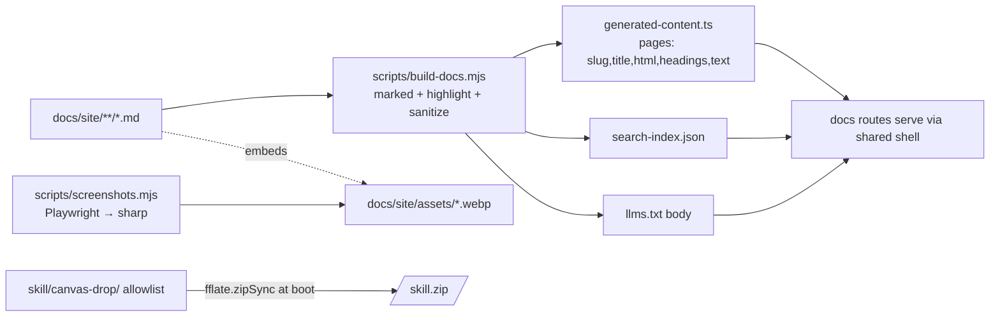

# feat: Documentation system (served docs + API reference + llms.txt + agent skill + screenshots)

## Summary

Build canvas-drop's documentation surface: a **publicly served, server-rendered, multi-page docs site** at `{base}/docs/*`, an agent-optimized `{base}/llms.txt`, a polished **API reference** for the deploy API (`/v1/canvases/*`) and runtime primitives (`/v1/c/:slug/*`), a **client-side search**, a reproducible **screenshot capture + optimization pipeline**, an **installable agent skill package**, and **in-dashboard entry points** so docs are discoverable in-product.

`/docs/*`, `/llms.txt`, and `/skill.zip` are **public** (mounted before the auth gateway, like the privacy/terms pages) so AI agents can read `/llms.txt` un-authenticated and the OSS repo is browsable without an account. Content is **hand-authored markdown** in `docs/site/`, compiled to a committed TS module by a build step, and served through one shared template that reuses the existing system-page design language.

This realizes the brief's committed served paths — `{base}/docs`, `{base}/llms.txt` (§8.2, §4.5). **Two scope corrections from the deepening review are load-bearing:**
- **`/llms.txt` already exists** in `apps/server/src/routes/serve-sdk.ts` (the `LLMS_TXT` constant) mounted **behind** the gateway. The real work is to **move and converge** it in front of the gateway, fed by the docs build — not to add a second handler (U4).
- **`/sdk/v1.js` stays behind the gateway** (§12.0 #1 — login-on-every-request includes the SDK script; it is loaded only by already-authenticated canvas pages). It is **not** part of the public band; the API reference documents its actual auth requirement rather than implying it is public.

The agent skill package is pulled forward from its penciled v1.1 slot (D19) at the owner's request. Multi-page + search is a deliberate **owner override** of the brief's "single-page human docs" wording (§11.1/§8.2) — recorded here and reflected back into the brief (U9).

---

## Problem Frame

canvas-drop ships a real backend-primitives product (deploy API, browser SDK, five primitives, self-host modes) but has **no user-facing documentation surface**. Today docs live only as repo markdown (`docs/sdk.md`, `AGENTS.md`, `BUILD_BRIEF.md`) aimed at contributors, and the one served agent page (`/llms.txt`) is private behind the gateway. The three real audiences are unserved:

1. **Canvas authors** — learn create → deploy → capabilities → editor, mostly from inside the dashboard.
2. **Self-hosters / developers** — quickstart, config reference, the honest security model (path vs subdomain, IAP per §12.2), and the SDK/API reference.
3. **AI agents** — first-class authors (§4.5). Need a single agent-readable page (`/llms.txt`) and a great machine-legible API reference, readable without a session.

**Non-goal:** rewriting any product behavior. This is a documentation/tooling plan — it adds a docs surface and its build/asset pipelines, moves one existing route across the auth boundary, and wires entry points to existing UI.

---

## Requirements & Traceability

| ID | Requirement | Origin |
|----|-------------|--------|
| R1 | A public, server-rendered multi-page docs site served at `{base}/docs/*`, un-authenticated (before the gateway). | §8.2, §4.5; owner decision (this session) |
| R2 | One agent-optimized `{base}/llms.txt`, public — converging the existing private route, not a duplicate. | §4.5, §11.1 |
| R3 | A great-format **API reference** covering the deploy API and runtime primitives — endpoints, params, request/response shapes, error codes, examples — documenting each path's actual auth requirement. | §11.1, §11.2, §11.5, §6.7-realtime |
| R4 | Docs content for all three audiences, hand-authored markdown as the single source. | Owner decision |
| R5 | Client-side search across docs pages, with defined empty/no-result/loading/failure/no-JS states. | "great format" decision |
| R6 | A reproducible screenshot capture + size-optimization pipeline producing optimized image assets. | User request |
| R7 | An installable agent skill package (Claude skill / AGENTS.md conventions). | §16 item 12 (pulled fwd from v1.1), user request |
| R8 | Dashboard UX entry points linking into the docs (top bar, capabilities → SDK section anchor, empty-state → quickstart). | User request |
| R9 | The docs surface leaks no private data and respects the §12 auth invariants; the `/llms.txt` move across the boundary is covered by an explicit auth test. | §12.0, auth-invariant-checklist |
| R10 | `/docs/*`, `/llms.txt`, `/skill.zip` answer **before** the gateway/classifier on every host; canvas content can never claim those paths. | dashboard-spa-patterns |
| R11 | Doc content is **org-agnostic**: examples and screenshots use `{base}`/placeholder/localhost values, never a hardcoded instance domain; an integrity test enforces it. | D18, CLAUDE.md org-agnostic rule |

---

## Key Technical Decisions

**KTD1 — Public band, mounted before the auth gateway; `/sdk/v1.js` excluded.** The docs router mounts in `apps/server/src/app.ts` right after `legalRoutes()` and before `authGateway(...)`, the pattern proven by `apps/server/src/http/legal-pages.ts`. The public band is exactly `/docs/*`, `/llms.txt`, `/skill.zip`. **`/sdk/v1.js` is deliberately NOT moved** — it stays behind the gateway (`apps/server/src/routes/serve-sdk.ts`, §12.0 #1); it is loaded by canvas pages that already carry a session, so its privacy is correct. The API reference (U3) states each path's auth requirement explicitly rather than implying a uniform public band.

**KTD2 — Hand-authored markdown, compiled to a committed TS module.** Doc content lives as markdown in `docs/site/`. `scripts/build-docs.mjs` (using `marked`) compiles it to `apps/server/src/docs/generated-content.ts` — a `{ slug, title, html, headings, text }[]` manifest the server imports — plus `search-index.json` and the `/llms.txt` body. **The generated module is committed** (not gitignored): `tsc`/`tsx`/`pnpm build` all import it, and CI runs `typecheck`/`test`/`build` on a clean checkout with no `docs:build` step, so a gitignored module would red the matrix. To prevent drift, `docs:build` runs as a `pretypecheck`/`prebuild` hook and CI adds a **drift check** (`pnpm docs:build` then assert `git diff --exit-code` on the generated artifacts). *(Alternative considered: gitignore + wire `docs:build` into every CI job — more wiring, easier to forget on a new job; rejected. Alternative: request-time render — adds a runtime markdown dep; rejected.)*

**KTD3 — One shared system-page chrome; extract `escapeHtml`.** Docs, legal, and error/password pages share visual DNA. `apps/server/src/http/error-pages.ts` exports `SYSTEM_PAGE_STYLES` and `SYSTEM_PAGE_BRAND`. The docs template reuses the brand mark + token palette but adds a **docs shell** (left nav, content column, search box, prev/next). As part of this work, **export `escapeHtml` from `error-pages.ts`** and drop the duplicate copies in `legal-pages.ts` and `password-gate.ts` so the docs renderer imports one shared util (a fourth copy otherwise). Note: `legal-pages.ts` inlines a light-only token subset rather than importing `SYSTEM_PAGE_STYLES`; the docs shell imports the shared constant to avoid a third divergent token set.

**KTD4 — Highlighting at build time; search served as a file; full CSP + sanitized HTML.** Code blocks are highlighted at compile time in `scripts/build-docs.mjs` (`marked` + `highlight.js`), so the request path ships no highlighter. **Because docs inject compiled markdown HTML** (unlike the hand-escaped legal pages), two hardening steps are required: (a) the build sanitizes `marked` output through an allow-list (`sanitize-html` or equivalent) — raw `<script>`/`<iframe>` in a markdown file must not reach readers; (b) the docs response sets a real CSP — `script-src 'self'; frame-ancestors 'none'` — and the search client ships as a served file `GET /docs/search.js` (not inline) so `'self'` suffices with no nonce. The search index ships as `GET /docs/search-index.json` (`{ slug, title, headings, text }[]`).

**KTD5 — Screenshot pipeline: Playwright capture → `sharp` optimize; both added as root dev deps.** `scripts/screenshots.mjs` runs from repo root, where neither `playwright` nor `sharp` resolves today (`sharp` is an `apps/dashboard` devDependency only). **Add `playwright` and `sharp` as root devDependencies.** The script drives headless Chromium against a running dev dashboard in dev auth mode, captures key screens, then `sharp` resizes to a max width and encodes WebP into `docs/site/assets/`. It is **not** in the default CI matrix (needs a browser + running server) — a manual `pnpm docs:screenshots` asset-refresh tool; optimized assets are committed. Captures must avoid operator-specific/seeded data (R11).

**KTD6 — `/skill.zip` zipped in-process with `fflate`, from an explicit allowlist.** `fflate` is already a server runtime dependency (`zipSync`, used by deploy ingest). `/skill.zip` is zipped **in-process at boot (memoized)** from `skill/canvas-drop/` — **no build artifact, no committed binary, no new dependency, no source-of-truth ambiguity**. The zip is built from an **explicit file allowlist** (`SKILL.md`, `examples/*.md`), never a recursive directory glob, so a stray `.env`/secret can never be served. Mounted public, before the gateway.

**KTD7 — Public paths short-circuit before the gateway and classifier (on every host).** `/docs/*`, `/llms.txt`, `/skill.zip` answer in the public band, before `authGateway` and before `resolveRequest` — so the role classifier never sees them, and they are served on **every** host including canvas subdomains (`{slug}.base/docs` serves docs, matching the legal-pages precedent). The guarantee for R10 is therefore "answered before gateway+classifier on all hosts," not "classified to a docs role." The U9 test proves the short-circuit (un-authed hit on a canvas-subdomain host returns docs), not a classifier branch. Defensively, add the new prefixes to `serve-spa.ts`'s `RESERVED_API_PREFIXES` note even though they are handled earlier. The dashboard SPA router (`apps/dashboard/src/router.tsx`) declares **no** `/docs` route; entry points are plain `<a>` tags.

**KTD8 — Org-agnostic content invariant.** Docs are public and shipped in the OSS repo, so every self-hoster serves this exact content. Unlike the legal pages (an explicit instance-bound exception), product docs must use `{base}`/`localhost`/placeholder values in URLs, `curl` examples, and screenshots — never a hardcoded instance domain. A U9 integrity test asserts no rendered page or asset filename contains a hardcoded instance domain.

**KTD9 — Indexing + error-code source of truth.** `/docs/*` and `/llms.txt` **allow indexing** (no `noindex`) for OSS discoverability (matching the legal pages, unlike the `noindex` error pages). The API error table and its drift guard read an **exported `ERROR_CODES` constant** added to `packages/sdk/src/index.ts` — the SDK currently exports only 5 `*Error` classes while real wire codes (`KEY_LIMIT`, `FILE_TOO_LARGE`, `CONNECTION_LIMIT`, `AI_STREAM_TRUNCATED`, …) are inline string literals, so an "exported classes" walk would miss exactly the codes the table must stay in sync with.

---

## High-Level Technical Design

Request routing — docs join the public band, before the gateway and classifier:

```mermaid
flowchart TD
  req[Incoming request] --> sec[security headers + error-page mw]
  sec --> health{/healthz/}
  sec --> legal{/privacy, /terms/}
  sec --> docs{/docs/*, /docs/search.js, /llms.txt, /skill.zip/}
  docs -->|public, no session, every host| render[docs renderer + in-proc skill.zip]
  health --> gateway
  legal --> gateway
  docs -.unmatched.-> gateway[authGateway: login on every request]
  gateway --> sdk[/sdk/v1.js — stays private]
  gateway --> roles[resolveRequest: canvas / dashboard / api]
  roles --> spa[dashboard SPA + APIs]
```

Content build pipeline (compile-time; generated module is committed + drift-checked in CI):



---

## Output Structure

```
docs/site/                         # markdown source for the served docs (NEW)
  index.md  quickstart.md
  authoring/ create-and-deploy.md  capabilities.md  editor.md
  sdk/ overview.md  kv.md  files.md  identity.md  ai.md  realtime.md
  api/ deploy-api.md  runtime-api.md  errors.md
  self-hosting/ install.md  configuration.md  security-model.md  deploy.md
  agents/ llms.md  skill.md
  assets/                          # optimized screenshots (.webp), committed (NEW)
apps/server/src/docs/              # server docs module (NEW)
  routes.ts  render.ts  search.client.ts
  generated-content.ts             # build artifact, COMMITTED + CI drift-checked
  routes.test.ts  render.test.ts  integrity.test.ts
skill/canvas-drop/                 # agent skill package (NEW)
  SKILL.md  examples/
scripts/
  build-docs.mjs  build-docs.test.mjs  screenshots.mjs   # (NEW)
```

---

## Implementation Units

### U1. Docs content (markdown source for all three audiences)

**Goal:** Author the markdown the whole surface renders from.
**Requirements:** R3, R4, R11.
**Dependencies:** none.
**Files:** `docs/site/**/*.md` per Output Structure. Adapt `docs/sdk.md` into `docs/site/sdk/*` and the existing `LLMS_TXT` prose into `docs/site/agents/llms.md`.
**Approach:** Concise, example-led pages. Cover overview + quickstart; authoring; SDK per-primitive; self-hosting (install, configuration reference sourced from `packages/shared/src/config/env.ts`, the honest security model per §12.2, deploy). All examples use `{base}`/`localhost`/placeholder hosts, never a real instance domain (R11). Embed screenshot placeholders (`assets/*.webp`) that U6 fills. Keep API-reference pages thin — U3 owns their shape.
**Patterns to follow:** tone of `docs/sdk.md`; config names verbatim from `env.ts`; security framing from `docs/solutions/2026-06-13-auth-invariant-checklist.md`.
**Test scenarios:** `Test expectation: none — pure content; correctness enforced by U9 link/asset/config-name/org-agnostic checks.`
**Verification:** every nav page exists; referenced config names exist in `env.ts`.

### U2. Server docs renderer + routes (public, before gateway)

**Goal:** Serve compiled docs as styled multi-page HTML at `/docs/*`, publicly, with a responsive shell.
**Requirements:** R1, R9, R10.
**Dependencies:** U7 (produces `generated-content.ts`; U2 may land first against a committed empty stub).
**Files:** `apps/server/src/docs/routes.ts`, `render.ts`, `render.test.ts`, `routes.test.ts`; export `escapeHtml` from `apps/server/src/http/error-pages.ts` (and drop dupes in `legal-pages.ts`, `password-gate.ts`); edit `apps/server/src/app.ts` (mount `docsRoutes()` after `legalRoutes()`, before `authGateway`).
**Approach:** `render.ts` builds the docs shell — brand header (`SYSTEM_PAGE_BRAND`), left nav from the page manifest, content column, prev/next, search box. **Mobile:** the left nav is an off-canvas drawer toggled by a hamburger below a breakpoint (specified, not improvised). **Active nav:** `render.ts` receives the current slug and sets `aria-current="page"` on the matching anchor server-side (works with JS off). **Prev/next:** order follows the manifest array, labels show the adjacent page title, controls hidden (not disabled) at the first/last page. `routes.ts` serves `GET /docs` (index), `GET /docs/:section/:slug`, `GET /docs/search.js`, `GET /docs/search-index.json`, `GET /docs/assets/:file` (allow-listed filenames → committed webp); sets `text/html`, `Cache-Control: public, max-age=3600`, the KTD4 CSP, and `baseSecurityHeaders`. Unknown slug → branded 404 via `errorResponse` (escapes the slug). Mount before the gateway.
**Patterns to follow:** `apps/server/src/http/legal-pages.ts`; `SYSTEM_PAGE_STYLES`/`SYSTEM_PAGE_BRAND`.
**Test scenarios:**
- `GET /docs` → 200 `text/html` with shell + nav.
- `GET /docs/sdk/kv` → 200, contains rendered content and the active nav anchor carries `aria-current="page"`.
- Unknown slug → branded 404 (not a 200 shell); reflected slug is HTML-escaped.
- Response carries `script-src 'self'; frame-ancestors 'none'`, `nosniff`, public `Cache-Control`.
- `GET /docs/assets/<unknown>` → 404 (allow-list, no traversal).
- **Covers R9, R10:** in proxy/non-dev mode (mirror `app.test.ts`'s proxy setup) and on a **canvas-subdomain host**, `GET /docs` returns **200 without auth** while `/api/canvases` 401s.
**Verification:** docs render at `/docs`; nav + mobile drawer work; un-authed proxy-mode request succeeds.

### U3. API reference pages (deploy API + runtime primitives)

**Goal:** The "great format" centerpiece — a precise, example-rich API reference that states each path's auth.
**Requirements:** R3.
**Dependencies:** U1, U2, U7 (heading anchors).
**Files:** `docs/site/api/deploy-api.md`, `runtime-api.md`, `errors.md`; optional endpoint-block helper in `apps/server/src/docs/render.ts`.
**Approach:** Document the deploy API (`PUT /v1/canvases/:id/deploy`, `GET /v1/canvases/:id`, `GET …/versions`, `POST …/rollback`; Bearer-key auth) and the runtime API (`/v1/c/:slug/kv|files|me|ai|realtime`; cookie/session auth via the SDK; capability gating). **State the auth model per path** — including that `/sdk/v1.js` requires a session (loaded by authed canvas pages), so agents fetch it differently than the Bearer deploy API. Each endpoint: method+path, auth, params, body, response, status/error codes, copy-pasteable `curl` (deploy) / `canvasdrop.*` (runtime) example using placeholder hosts (R11). The error table renders from the exported `ERROR_CODES` constant (KTD9).
**Patterns to follow:** endpoint list in `BUILD_BRIEF.md §11.2/§17` and actual handlers `deploy-api.ts`, `canvas-api.ts`; SDK examples in `docs/sdk.md`.
**Test scenarios:**
- `Covers R3.` Rendered `/docs/api/deploy-api` lists each documented endpoint path + ≥1 example.
- The errors page contains every code in the SDK's exported `ERROR_CODES` (drift guard).
**Verification:** every existing `/v1/*` route has a reference entry; error table matches `ERROR_CODES`.

### U4. Converge `/llms.txt` to a single public route

**Goal:** One public `/llms.txt`, fed by the docs build — replacing the existing private route, not duplicating it.
**Requirements:** R2, R9, R10.
**Dependencies:** U1, U2, U7 (build emits the body).
**Files:** edit `apps/server/src/routes/serve-sdk.ts` (remove the `GET /llms.txt` handler + `LLMS_TXT` constant; keep `/sdk/v1.js` behind the gateway); add `GET /llms.txt` to `apps/server/src/docs/routes.ts`; update `apps/server/src/routes/serve-sdk.test.ts`; test in `routes.test.ts`.
**Approach:** Build concatenates a curated, ordered subset (overview, quickstart, SDK surface, API essentials, capability model, error codes) into one `text/plain` llms.txt body following the convention. Serve from the **pre-gateway** docs router, public + cacheable. This **moves a previously-private path public** — an explicit §12 auth-boundary change, called out and tested.
**Patterns to follow:** §4.5; the existing `LLMS_TXT` content as the seed; the llms.txt community convention.
**Test scenarios:**
- `Covers R2.` Exactly **one** handler answers `/llms.txt`; `GET /llms.txt` → 200 `text/plain` containing `canvasdrop`, the deploy endpoint path, and the capability note.
- `Covers R9.` Un-authed proxy-mode `GET /llms.txt` → 200 (public); `/sdk/v1.js` un-authed proxy-mode → **401** (still private — regression guard).
**Verification:** `curl /llms.txt` returns readable text on a real proxy instance; no second handler shadows it.

### U5. Client-side docs search (served file + defined states)

**Goal:** Fast in-page search with every interaction state specified.
**Requirements:** R5.
**Dependencies:** U2 (shell hosts the box + serves the file), U7 (emits the index).
**Files:** `apps/server/src/docs/search.client.ts` (compiled/served at `/docs/search.js`), search box markup in `render.ts`, index served by `routes.ts`; tests in `render.test.ts`.
**Approach:** A small vanilla-TS client (no framework) fetches `/docs/search-index.json` once and does substring/heading match. **States:** empty query → dropdown hidden; no results → "No matches" row; loading → the input is usable, results appear on fetch resolve; fetch failure → a quiet inline "search unavailable" note, no thrown rejection. **No-JS:** the search box is hidden by default and revealed only when the client adds a `has-js` class — no dead affordance for crawlers/agents. Results link to page + heading anchor.
**Patterns to follow:** dependency-light server-rendered ethos; `script-src 'self'` (KTD4).
**Test scenarios:**
- `GET /docs/search-index.json` → 200 `application/json`, one entry per page; count equals the page-manifest count (single source — KTD2 builds both from one in-memory manifest).
- Unit test over the match function: query → expected page slugs; empty query → no results; non-matching query → empty result set.
**Verification:** typing in the box surfaces matching pages; box is absent with JS off.

### U6. Screenshot capture + optimization pipeline

**Goal:** Reproducible, size-optimized, org-agnostic screenshots.
**Requirements:** R6, R11.
**Dependencies:** running dev dashboard; U1 (asset names).
**Files:** `scripts/screenshots.mjs`; committed `docs/site/assets/*.webp`; root `package.json` script `docs:screenshots` + **root devDependencies `playwright` and `sharp`**.
**Approach:** Boot/use the dev server, navigate headless Chromium to key routes as `dev@example.com`, capture PNGs, then `sharp` → max-width resize + WebP (q~80) into `docs/site/assets/`. Deterministic filenames matching U1. Log orig-vs-optimized bytes. Avoid screens showing seeded/operator-specific data (R11). Not in CI.
**Patterns to follow:** dev auto-login; `sharp` usage in `apps/dashboard`.
**Test scenarios:** `Test expectation: none — dev-only asset tooling; extract + unit-test the filename helper if warranted. CI does not run capture.`
**Verification:** `pnpm docs:screenshots` regenerates committed `.webp`; each is meaningfully smaller than raw PNG; pages display them.

### U7. Docs build step (markdown → committed module + indexes + llms body)

**Goal:** Compile markdown to the committed server module, search index, and llms.txt body — with a dev edit loop and CI drift guard.
**Requirements:** R1–R5 (feeds them); R9 (llms body).
**Dependencies:** U1.
**Files:** `scripts/build-docs.mjs`, `scripts/build-docs.test.mjs`; **committed** `apps/server/src/docs/generated-content.ts` (+ `search-index.json`, llms body); `package.json` (`docs:build`, `pretypecheck`/`prebuild` hooks, a `docs:watch`, dev wiring in `scripts/dev.mjs`); add `marked`, `highlight.js`, `sanitize-html`; export `ERROR_CODES` from `packages/sdk/src/index.ts`; CI drift-check step in `.github/workflows/ci.yml`.
**Approach:** `marked` parses each `docs/site/**/*.md`, highlights code at build, **sanitizes** output (KTD4), extracts title + headings (emitting heading-anchor IDs for deep links) + plain text, rewrites `assets/*` links to `/docs/assets/*`, and writes one ordered page manifest from which `generated-content.ts`, `search-index.json`, and the llms body all derive (single source — U5 parity). The module is **committed**; `docs:build` runs as `pretypecheck`/`prebuild`; CI runs `pnpm docs:build` then asserts no git diff. **Dev loop:** a `docs:watch` (chokidar on `docs/site/**`) runs in parallel from `scripts/dev.mjs` so edits regenerate the module and `tsx watch` reloads — `tsx watch` alone does not see `.md` changes.
**Patterns to follow:** `scripts/test-runner.mjs` conventions; CI job shape in `.github/workflows/ci.yml`.
**Test scenarios:**
- `build-docs.test.mjs`: compiling a fixture dir yields a record with `title`, non-empty sanitized `html`, extracted `text`, heading anchors.
- A markdown `<script>` is stripped/escaped by sanitization (security regression guard).
- `assets/x.webp` rewritten to `/docs/assets/x.webp`; a fenced code block emerges highlighted.
**Verification:** `pnpm docs:build` regenerates artifacts with no diff on a clean tree; `pnpm typecheck` passes; editing markdown updates `/docs` after the watcher rebuilds.

### U8. Dashboard UX entry points

**Goal:** Make docs discoverable from inside the product.
**Requirements:** R8, R10.
**Dependencies:** U2, U3, U7 (heading anchors).
**Files:** `apps/dashboard/src/app-layout.tsx` (top-bar Docs link + mobile drawer entry), `apps/dashboard/src/routes/canvas.capabilities.tsx` (link to `/docs/sdk/<primitive>#<section>`), an empty-state quickstart link (e.g. `apps/dashboard/src/routes/index.tsx`); tests under `apps/dashboard/src/test/`.
**Approach:** **Decision:** the Docs link is a **top-bar** entry (peer of the section nav), and it also appears in the mobile sections drawer — not buried in `UserMenu`. All are plain `<a href="/docs…">` (server-served, not TanStack routes — KTD7). The capabilities tab deep-links to the relevant SDK page **and section anchor** (e.g. `/docs/sdk/kv#user-namespace`) so enabling KV lands on the right section; this relies on U7 heading anchors. Home/empty states link to `/docs/quickstart`. Calm, consistent with the top bar.
**Patterns to follow:** top bar in `app-layout.tsx`; `@phosphor-icons/react`.
**Test scenarios:**
- Top bar renders a Docs link with `href="/docs"` (a real anchor, not a client route); it appears in the mobile drawer.
- Capabilities tab renders a link to `/docs/sdk/…#…`.
- `Covers R10.` `apps/dashboard/src/router.tsx` declares no `/docs` route (assert absence).
**Verification:** clicking Docs loads the served docs; capabilities deep-link lands on the right section.

### U9. Agent skill package + integrity tests

**Goal:** Ship the installable skill and lock the surface with integrity tests.
**Requirements:** R7, R10, R11, R3/R4 drift guards.
**Dependencies:** U1–U4, U7.
**Files:** `skill/canvas-drop/SKILL.md` + `examples/`; `docs/site/agents/skill.md`; in-process zip + `GET /skill.zip` in `apps/server/src/docs/routes.ts` (using `fflate.zipSync`, memoized, allowlist); `apps/server/src/docs/integrity.test.ts`; brief update to `BUILD_BRIEF.md` §8.2/§11.1 ("single-page" → multi-page).
**Approach:** Author `SKILL.md` to Claude-skill/AGENTS.md conventions: when-to-use, obtaining a canvas API key, deploying via `PUT /v1/canvases/:id/deploy`, using the SDK primitives, the zero-secrets rule (§12.0 #2). Build `/skill.zip` in-process from the **allowlist** (`SKILL.md`, `examples/*.md`) — never a recursive glob. Record the multi-page override in the brief.
**Patterns to follow:** repo `AGENTS.md` voice; public-route pattern from U2; `fflate.zipSync` in deploy code.
**Test scenarios:**
- `Covers R7.` `GET /skill.zip` → 200 `application/zip`, public (un-authed proxy mode).
- The built zip contains only allow-listed entries (`.md`); a canary asserts **no** `.env*`/`*secret*`/`*key*`/non-`.md` entries.
- `Covers R11.` No rendered page or asset filename contains a hardcoded instance domain.
- Every internal `/docs/*` link in rendered pages resolves to a known page; every referenced `assets/*.webp` exists on disk; every referenced config name exists in `env.ts`.
- Reserved-path guard: un-authed hit on a canvas-subdomain host for `/docs`, `/llms.txt`, `/skill.zip` is answered by the docs band (pre-gateway short-circuit), not the canvas/SPA role.
**Verification:** download + inspect `/skill.zip`; integrity suite green; no dead links; brief and plan agree on multi-page.

---

## Scope Boundaries

**In scope:** public `/docs/*`, the `/llms.txt` convergence, API reference, search, screenshot pipeline, agent skill, dashboard entry points, integrity tests, the `escapeHtml`/`ERROR_CODES` extractions these require.

### Deferred to Follow-Up Work
- **Versioned docs** (per-release snapshots) — single current version for now.
- **In-docs feedback/comments.**
- **i18n / translations.**
- **Auto-generated reference from OpenAPI or TS types** — revisit if hand-authored drift becomes painful (U9 guards are the early warning).
- **CI-run visual screenshot regression** — the pipeline stays dev-opt-in.
- **Moving `/sdk/v1.js` public** — deliberately out; its login-on-every-request privacy is correct (§12.0 #1).

### Outside this product's identity
- A hosted external docs site / separate marketing site — docs are served by the app itself (self-contained, static-first).

---

## System-Wide Impact

- **Auth boundary (§12):** adds three public pre-gateway paths AND **moves `/llms.txt` from private to public** (U4) — an explicit invariant change, covered by a proxy-mode test that also pins `/sdk/v1.js` still-401. Read `docs/solutions/2026-06-13-auth-invariant-checklist.md` before editing `app.ts` ordering or `serve-sdk.ts`.
- **Reserved paths:** `/docs/*`, `/llms.txt`, `/skill.zip` answer before the gateway/classifier on every host (KTD7); add them to `serve-spa.ts`'s reserved-prefix note defensively.
- **Dependencies:** add `marked`, `highlight.js`, `sanitize-html` (build), `playwright` + `sharp` (root dev, screenshots). `fflate` is **reused** for `/skill.zip` — no new zip dep. Export `escapeHtml` + add `ERROR_CODES` to the SDK.
- **Build/CI:** `docs:build` runs as `pretypecheck`/`prebuild`; the generated module is **committed**; CI adds a drift check (`docs:build` → no git diff). Screenshot capture does **not** run in CI (documented in `docs/testing.md`).
- **Repo size:** committed `.webp` assets + the generated TS module — keep assets optimized and few; the drift check guards the module.
- **Spec:** `BUILD_BRIEF.md` §8.2/§11.1 updated from "single-page human docs" to multi-page (U9).

---

## Risks & Mitigations

| Risk | Mitigation |
|------|-----------|
| Docs drift from real API/config. | U9 integrity tests: `ERROR_CODES` parity, config-name existence vs `env.ts`, dead-link + asset checks, org-agnostic-domain check. |
| `/llms.txt` move regresses the auth boundary or leaves two handlers. | U4 tests: exactly-one-handler, un-authed public 200, `/sdk/v1.js` still-401. |
| Committed generated module reds CI on a clean checkout. | Module is committed + `pretypecheck`/`prebuild` `docs:build` + CI drift check. |
| Raw HTML / `<script>` in markdown executes for public readers. | Build-time sanitization + `script-src 'self'` CSP; search ships as a served file (KTD4). |
| `/skill.zip` leaks a stray secret. | In-process zip from an explicit allowlist + a canary test that rejects non-`.md` entries. |
| Public docs paths bypass the post-gateway rate limiter. | Optional: a generous pre-gateway IP limit on `/skill.zip` + `/docs/search-index.json` using the existing `takeToken`/`rlStore` (login-throttle infra); `Cache-Control` mitigates at any proxy. Proportionate to the trusted-org model — note, don't over-build. |
| Hand-authored security-model + skill prose drift when M7 hardening lands. | Re-review `security-model.md` + `SKILL.md` at M7 completion; integrity tests cover codes/config names but not prose. |
| `/docs` shadowing/shadowed across URL modes. | Pre-gateway short-circuit + reserved-path test on a canvas-subdomain host (U9). |

---

## Dependencies & Sequencing

```
U1 (content) ─┬─> U2 (renderer/routes, escapeHtml export) ─┬─> U3 (API ref)
              │                                             ├─> U4 (llms.txt convergence — touches serve-sdk.ts)
              │                                             ├─> U5 (search)
              │                                             └─> U8 (UX entry points)
              └─> U7 (build step, ERROR_CODES, CI drift) ──> (feeds U2,U3,U4,U5)
U6 (screenshots, root deps) ──> assets consumed by U1
U9 (skill + integrity + brief update) depends on U1–U4, U7
```

Recommended order: **U2 (committed empty stub) → U7 → U1/U3/U4 → U5 → U6 → U8 → U9.** U4 touches the auth boundary (`serve-sdk.ts`) — run the auth-invariant checklist for it. All units land on the **current branch** (no new branches), one local commit per unit.

---

## Sources & Research

- `BUILD_BRIEF.md` §4.5 (agents first-class, `/llms.txt`), §8.2 (served-paths table + URL layout), §11.1 (browser SDK + `/sdk/v1.js`), §11.2 (platform API), §11.5 (machine-readable error codes), §12.2 (mode isolation docs), §16 (M6/M10, skill item 12), D5/D18/D19.
- Existing surfaces: `apps/server/src/http/legal-pages.ts` (public pre-gateway pattern), `apps/server/src/http/error-pages.ts` (`SYSTEM_PAGE_STYLES`/`SYSTEM_PAGE_BRAND`/`escapeHtml`), `apps/server/src/routes/serve-sdk.ts` (existing private `/llms.txt` + `/sdk/v1.js` — convergence target), `apps/server/src/routes/canvas-api.ts` (shipped primitives), `packages/sdk/src/index.ts` (typed errors → `ERROR_CODES`), `packages/shared/src/config/env.ts` (config reference), `apps/dashboard/src/app-layout.tsx` + `UserMenu.tsx` (UX), `fflate` (already a server dep → `/skill.zip`), `sharp` (dashboard devDep → promote to root).
- Learnings: `docs/solutions/2026-06-13-dashboard-spa-patterns.md` (reserved paths), `…auth-invariant-checklist.md` (public-before-gateway, `/llms.txt` move), the in-session privacy/terms implementation.
- **Deepening review (2026-06-14):** 7-persona pass. Applied: `/llms.txt` already-private convergence (P0), `/sdk/v1.js` not-public correction (P1), committed-module CI policy (P1, 3 personas), corrected §8.2/§11.5 citations (P1), reserved-path reframe (P2), root `sharp`/`playwright` deps (P2, 3 personas), in-process `fflate` `/skill.zip` + secrets allowlist (P2), CSP + sanitization + served search.js (P2, 2 personas), mobile/search/active-nav/prev-next UX specs (P1–P2 design), org-agnostic content invariant (P2), `ERROR_CODES` source of truth (P2), dev-watch ergonomics (P2), `escapeHtml` extraction (P3), indexing decision, M7 prose-drift risk. Not actioned: "documenting unshipped surface" (false positive — primitives are shipped in `canvas-api.ts`).
