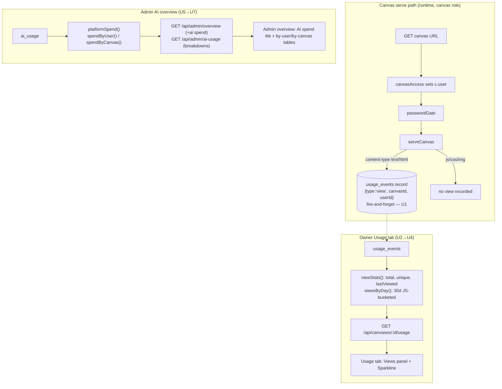

# feat: Usage statistics — canvas views + admin AI spend (API + dashboard)

## Summary

Finish the usage-statistics surface that `BUILD_BRIEF.md` specs in **D24** (owner-visible
canvas stats), **D12 / §6.10.7** (admin AI usage), and **§6.10.6** (platform overview). The
metering substrate (`usage_events`, `ai_usage`) and the primitive-op tiles already exist; the
**view** dimension and the **admin AI-spend** dimension do not.

Three gaps close here:

1. **View recording is missing entirely.** The `view` `UsageType` is declared but nothing emits
   it — `serveCanvas` never records a view. So total views, unique viewers, last-viewed, and the
   30-day sparkline have no data behind them and sit in the owner tab's `COMING_SOON` list.
2. **Owner view stats** (total views, unique viewers, last-viewed, 30-day sparkline) are not in
   the `/:id/usage` API or the Usage tab.
3. **Admin AI spend** is still stubbed `// AI spend deferred to M9` on `/overview` even though
   `ai_usage` is now populated, and there is no by-user / by-canvas AI breakdown (§6.10.7).

The work splits into two independent chains that share no data source: an **owner-views chain**
(U1→U4, sourced from `usage_events`) and an **admin-AI chain** (U5→U7, sourced from `ai_usage`).

---

## Problem Frame

`BUILD_BRIEF.md` D24 promises owners "Total views, unique viewers, last-viewed, a 30-day view
sparkline, and primitive op counts… Derived from `usage_events`; no third-party analytics, no
per-visitor tracking beyond the org identity already required." The primitive op counts shipped
in M6/M9; the **view-derived half never did**, because no code path records a `view` event.

On the admin side, §6.10.6 promised a "Platform usage overview (totals, top canvases, AI spend)"
and §6.10.7 / D12 promised admin AI usage "totals/by-user/by-canvas." The overview shipped in M7
*before* `ai_usage` existed, so AI spend was deferred with an explicit `// deferred to M9` stub
that was never picked back up after M9 landed the table.

This plan is **completion work on existing, well-patterned surfaces**, not new architecture. The
one genuinely new mechanism is recording a view on the hot canvas-serve path (U1); everything else
is read-side aggregation + dashboard rendering following established repo/route/tab patterns.

---

## Requirements Traceability

| Ref | Requirement | Units |
| --- | --- | --- |
| D24 | Owner-visible: total views, unique viewers, last-viewed, 30-day view sparkline | U1, U2, U3, U4 |
| §6.9.6 | "View recorded async for usage stats" on the canvas serve flow | U1 |
| D24 | Views derived from `usage_events`; org-identity only, no per-visitor tracking | U1, U2 |
| §6.10.6 | Platform overview includes **AI spend** | U5, U6, U7 |
| §6.10.7 / D12 | Admin AI usage **by-user** and **by-canvas** | U5, U6, U7 |
| §12.0 #3 | Cross-owner reads only behind `requireAdmin`; owner reads stay owner-scoped | U3, U6 |

---

## Key Technical Decisions

**KTD-1 — A "view" = an HTML-document response on the serve path, fire-and-forget.**
`serveCanvas` serves every asset (HTML, JS, CSS, images) through the same middleware. Recording a
view per asset request would over-count a single page-load as dozens of views. So we record a view
**only when the resolved response content-type is `text/html`** (the navigational document, incl.
SPA-fallback index.html). Recording is **fire-and-forget** (never awaited, never fails the serve)
— mirroring the existing `usageEventsRepository.record` contract and the audit-log pattern.
*Trade-off:* an HTML page that embeds an `<iframe>` of another canvas HTML doc would count twice;
acceptable at trusted-org scale. Counted against the org identity already in context
(`c.get("user").id`), satisfying D24's "no per-visitor tracking beyond org identity."

**KTD-2 — Count returning 304s and owner self-views; do not special-case them.**
A returning viewer who revalidates gets a 304 on the HTML doc — that is still a view, so the
recording hook fires before the 200/304 branch divergence (i.e., on any HTML-doc resolution, not
only full-body 200s). Owner-viewing-own-canvas counts too. D24 is an org-identity-level signal,
not a deduplicated-unique-humans analytic; keeping it simple avoids per-request exclusion logic on
the hot path. Unique-viewer count (`COUNT(DISTINCT user_id)`) already collapses repeat viewers.

**KTD-3 — Sparkline buckets are computed in JS, not dialect-specific date SQL.**
Per `docs/solutions/2026-06-13-dual-dialect-drizzle-seam.md`, sqlite and pg diverge on date
functions. `COUNT(DISTINCT)`, `MAX()`, `count(*)` are dialect-safe; `date()/date_trunc()` are not.
So `viewsByDay` selects the raw `created_at` timestamps for `view` events in the 30-day window
(small N at trusted-org scale, covered by the `usage_events(canvas_id, created_at)` index) and
**buckets them into UTC calendar days in JS**. This sidesteps the dialect split entirely — no
`as any` date-SQL branch — and the parity test stays unaffected.

**KTD-4 — No `usage_daily` rollup table.**
`BUILD_BRIEF.md` §10 floats a `usage_daily` rollup "for high-volume." At trusted-org scale (D13),
a 30-day windowed scan over the existing composite index is cheap and a rollup adds a cron/rollup
job, a migration, and a consistency surface for no current benefit (greenfield — add later if
volume demands it, per the "no premature migrations" posture). Recorded as a deferred follow-up.

**KTD-5 — Owner view stats render regardless of backend capability.**
Today the Usage tab skips the whole `/:id/usage` query when `backendEnabled` is false (`useUsage(id,
backendOn)`), because primitive ops only exist with a backend. But **every canvas gets views**,
backend or not. The API returns view stats unconditionally; the tab renders the **Views** panel
always and gates only the **primitive-ops** panel on `backendEnabled`. The `/:id/usage` query is
therefore always enabled.

**KTD-6 — Admin AI aggregations live on the `ai-usage` repo, enriched in the route.**
By-user / by-canvas AI sums are `ai_usage` reads, so they belong on `aiUsageRepository` next to
`canvasTotals` — not on `adminRepository` (which owns cross-owner *canvas* reads). The admin route
composes: repo returns `{ id, costUsd, tokens, calls }[]`; the route enriches user ids → email and
canvas ids → slug/title via direct lookups (small N, top-10). All new aggregates use
`coalesce(...) + Number()` for the pg-string / NULL-on-empty trap (documented seam gotcha).

---

## High-Level Technical Design

**Two independent data sources, two chains.** Views come from `usage_events`; AI spend from
`ai_usage`. They share the dashboard shell but no server code.

**Sequencing:** U1 must land before U2–U4 produce non-empty data, but U2/U3 can be built and
tested against seeded `view` rows independently. The admin chain (U5–U7) has no dependency on the
owner chain and can proceed in parallel.

---

## Implementation Units

### U1. Record `view` events on the canvas serve path

**Goal:** Emit a `view` `usage_event` per HTML-document serve, fire-and-forget, attributed to the
org viewer — the missing substrate behind all owner view stats.

**Requirements:** D24, §6.9.6.
**Dependencies:** none.

**Files:**
- `apps/server/src/canvas/serve.ts` — add `usage: UsageEventsRepository` to `ServeDeps`; record a
  `view` event when the resolved response is `text/html`, reading the viewer from `c.get("user")`.
- `apps/server/src/app.ts` — pass `deps.usage` into `serveCanvas({ … })` (line ~376).
- `apps/server/src/canvas/serve.test.ts` — new view-recording assertions.

**Approach:** In the serve middleware, after the asset resolves and `contentType` is known, branch:
if `contentType` starts with `text/html` and `c.get("user")` exists, call
`deps.usage.record({ canvasId: canvas.id, userId: user.id, type: "view" })` **without awaiting**
(`void deps.usage.record(...).catch(() => {})` — metering must never fail or delay the serve).
Fire it on both the 200 and 304 HTML branches (KTD-2). Do not record for sub-assets (KTD-1).

**Patterns to follow:** the fire-and-forget contract already documented on
`usageEventsRepository.record` ("best-effort… a metering write must never fail the request — mirror
the audit-log pattern"); the existing `kv_op`/`file_op` record call sites in the canvas-api routes.

**Test scenarios:**
- Covers §6.9.6. Serving an HTML document (root path → index.html) records exactly one `view`
  event with the canvas id and the authenticated viewer's user id.
- Serving a sub-asset (`app.js`, `style.css`, a png) records **no** view event.
- A 304 revalidation on the HTML doc (matching `If-None-Match`) still records a view.
- SPA-fallback navigation (non-root path resolving to index.html on a `spaFallback` canvas) records
  a view.
- A thrown/rejected `usage.record` does **not** fail or delay the serve response (inject a record
  stub that rejects; assert the asset body still returns 200).
- Non-`canvas` role requests (management/runtime-API paths) never reach this hook (existing
  `onlyCanvas` gate — one assertion that a dashboard request records nothing).

---

### U2. Owner view-stats queries on the `usage_events` repo

**Goal:** Add the read methods that turn raw `view` rows into total/unique/last-viewed + a 30-day
daily series.

**Requirements:** D24.
**Dependencies:** U1 (for live data; tests seed rows directly).

**Files:**
- `apps/server/src/db/repositories/usage-events.ts` — add `viewStats(canvasId)` and
  `viewsByDay(canvasId, sinceMs, now)`.
- `apps/server/src/db/repositories/usage-events.test.ts` — dual-dialect coverage.

**Approach:**
- `viewStats(canvasId)` → `{ totalViews, uniqueViewers, lastViewedAt }` via a single grouped
  select over `type = 'view'`: `count(*)`, `count(distinct user_id)`, `max(created_at)`. All three
  are dialect-safe; wrap counts in `Number()` and `lastViewedAt` in `Number(...) ?? null` for the
  pg-string / NULL-on-empty trap.
- `viewsByDay(canvasId, sinceMs, now)` → `Array<{ dayMs: number; count: number }>` for each of the
  ~30 UTC days in `[sinceMs, now]`. **Fetch the raw `created_at` values** for `view` events in the
  window, bucket them by UTC calendar day in JS (KTD-3), and emit a **dense** array (zero-filled
  empty days) so the sparkline x-axis is uniform. `now` is injected for testability (pure function
  of `now`, mirroring the `ai/quota.ts` window helpers).

**Patterns to follow:** existing `countByType` in the same file (dialect seam, `Number()` coercion);
`ai-usage.ts` `canvasTotals` for the `coalesce`/`Number` aggregate shape; `ai/quota.ts` for
`now`-injected window math.

**Test scenarios:**
- Covers D24. `viewStats` returns correct `totalViews` and `uniqueViewers` when one viewer has
  multiple views and a second viewer has one (e.g., 3 views / 2 unique).
- `lastViewedAt` equals the max `created_at` of view events; `null` when the canvas has no views.
- Non-`view` events (`kv_op`, `rt_connect`) are excluded from all three figures.
- `viewsByDay` returns a dense 30-entry array; days with no views are `count: 0`; a day with N
  views reports N; bucketing respects UTC day boundaries (a view at 23:59:59Z and one at 00:00:01Z
  land in different buckets).
- Both assertions pass on **sqlite and pg** legs (`describe.each(DIALECTS)`).

---

### U3. Extend `/:id/usage` API with view stats + sparkline

**Goal:** Surface the U2 figures on the owner usage endpoint and its dashboard type, returned for
every canvas regardless of backend.

**Requirements:** D24, §12.0 #3 (owner-scoped read).
**Dependencies:** U2.

**Files:**
- `apps/server/src/routes/management.ts` — extend the `/:id/usage` handler.
- `apps/dashboard/src/lib/api.ts` — extend the `CanvasUsage` interface.
- `apps/server/src/routes/management.test.ts` — endpoint shape assertions.

**Approach:** Add `deps.usage.viewStats(cv.id)` and `deps.usage.viewsByDay(cv.id, thirtyDaysAgo,
now)` to the existing `Promise.all` in the handler. Return `totalViews`, `uniqueViewers`,
`lastViewedAt`, and `viewsByDay: { dayMs, count }[]` alongside the existing fields. Stays behind
`ownedCanvas` (owner-or-admin, §12.0 #3) — no change to the auth gate. Extend the `CanvasUsage`
type to match.

**Patterns to follow:** the existing `/:id/usage` `Promise.all` composition; `ownedCanvas` guard
already in the handler.

**Test scenarios:**
- Covers D24. `/:id/usage` returns `totalViews`, `uniqueViewers`, `lastViewedAt`, and a `viewsByDay`
  array of the expected length for a canvas with seeded view events.
- A canvas with **backend off** still returns populated view fields (regression guard for KTD-5).
- A non-owner, non-admin caller gets 404 (existing `ownedCanvas` behavior — one assertion that the
  new fields don't widen the auth surface).

---

### U4. Owner Usage tab: Views panel + Sparkline component

**Goal:** Render total/unique/last-viewed + a 30-day sparkline in the Usage tab, always visible,
and retire the `COMING_SOON` viewers chip.

**Requirements:** D24.
**Dependencies:** U3.

**Files:**
- `apps/dashboard/src/components/Sparkline.tsx` — new inline-SVG sparkline (no new dependency).
- `apps/dashboard/src/routes/canvas.usage.tsx` — add the Views panel; restructure the
  `backendOn` gate (KTD-5); drop `"Unique & total viewers"` from `COMING_SOON`.
- `apps/dashboard/src/test/usage.test.tsx` — render assertions.

**Approach:** `Sparkline` takes `Array<{ dayMs: number; count: number }>` and renders a single
`<polyline>`/`<path>` inside a viewBox-scaled `<svg>` (the codebase already hand-draws SVG in
`FileTree.tsx`; no chart lib). The Views panel shows total views, unique viewers, last-viewed
(relative/formatted), and the sparkline; it renders **before** the backend check so it appears for
every canvas. The existing primitive-ops `Panel` stays gated on `backendOn`. Enable the usage query
unconditionally (`useUsage(id)` — drop the `backendOn` arg) since views are always present.
Empty-state: a canvas with zero views shows "No views yet" rather than a flat-line sparkline.

**Patterns to follow:** `FileTree.tsx` inline-SVG drawing; the existing `Metric` / `MetaGrid` /
`Panel` / `EmptyState` composition already in `canvas.usage.tsx`; `formatBytes`/`formatUsd` sibling
formatters for a `formatRelativeTime`/`lastViewed` helper.

**Test scenarios:**
- Covers D24. The Views panel renders total views, unique viewers, and last-viewed from a mocked
  `useUsage` payload.
- The sparkline renders a path/polyline with the expected number of points for a 30-entry series.
- A canvas with **backend off** still shows the Views panel (the primitive-ops panel is hidden) —
  the KTD-5 UX guard.
- A zero-views canvas shows the empty state, not a degenerate sparkline.
- `"Unique & total viewers"` no longer appears in the coming-soon chips.

---

### U5. AI-usage admin aggregations on the `ai-usage` repo

**Goal:** Add platform-total and by-user / by-canvas AI spend reads.

**Requirements:** §6.10.6, §6.10.7 / D12.
**Dependencies:** none (reads existing `ai_usage`).

**Files:**
- `apps/server/src/db/repositories/ai-usage.ts` — add `platformSpend()`, `spendByUser(limit)`,
  `spendByCanvas(limit)`.
- `apps/server/src/db/repositories/ai-usage.test.ts` — dual-dialect coverage.

**Approach:**
- `platformSpend()` → `{ costUsd, inputTokens, outputTokens, calls }` over all rows — same shape as
  `canvasTotals` minus the `canvas_id` filter.
- `spendByUser(limit)` / `spendByCanvas(limit)` → `Array<{ id, costUsd, tokens, calls }>` grouped by
  `user_id` / `canvas_id`, ordered by `sum(cost_usd) desc`, limited. `id` is the raw user/canvas id
  (route enriches it — KTD-6). All sums `coalesce(...) + Number()`.

**Patterns to follow:** `canvasTotals` (aggregate shape, coercion); `adminRepository.platformStats`
top-canvases `groupBy + orderBy(desc(...)) + limit` for the ranked breakdowns.

**Test scenarios:**
- Covers §6.10.6. `platformSpend` sums cost/tokens/calls across all canvases and users; returns
  zeros (not null) on an empty table.
- Covers §6.10.7. `spendByUser` groups and orders by spend desc, respects `limit`, and attributes
  each user's full spend across multiple canvases.
- `spendByCanvas` groups and orders by spend desc across multiple users' calls to one canvas.
- Both legs (sqlite + pg) pass.

---

### U6. Admin overview API: wire AI spend + by-user/by-canvas endpoint

**Goal:** Replace the `// deferred to M9` stub with real AI spend on `/overview`, and expose the
breakdowns enriched with email / slug-title.

**Requirements:** §6.10.6, §6.10.7, §12.0 #3.
**Dependencies:** U5.

**Files:**
- `apps/server/src/routes/admin.ts` — add AI spend to `/overview`; add `GET /ai-usage`.
- `apps/server/src/db/repositories/admin.ts` — extend `PlatformStats` (or compose in the route).
- `apps/server/src/routes/admin.test.ts` — endpoint assertions.

**Approach:** In `/overview`, call `deps.aiUsage.platformSpend()` and add `aiCostUsd`, `aiTokens`,
`aiCalls` to the response (drop the deferred comment). Add `GET /admin/ai-usage` returning
`{ byUser: [...], byCanvas: [...] }`: call `spendByUser(10)` / `spendByCanvas(10)`, then enrich —
user ids → email via the users repo, canvas ids → `{ slug, title }` via `deps.canvases.findById`
(top-10, direct lookups, no N+1 concern at this N — mirrors the existing top-canvases enrichment in
`/overview`). All admin routes already sit behind `requireAdmin` (§12.0 #3) — no new auth surface.

**Patterns to follow:** the existing `/overview` top-canvases enrichment loop (`Promise.all` +
`findById`); `requireAdmin` mounting on the admin router; `sameOrigin` is **not** needed (these are
GETs).

**Test scenarios:**
- Covers §6.10.6. `/overview` returns `aiCostUsd`/`aiTokens`/`aiCalls` reflecting seeded `ai_usage`.
- Covers §6.10.7. `/ai-usage` returns `byUser` entries carrying email + spend, ordered desc, and
  `byCanvas` entries carrying slug/title + spend, ordered desc.
- A non-admin caller is rejected on both routes (inherited `requireAdmin` — one assertion per route
  that the AI data isn't reachable without admin).
- Empty `ai_usage` yields zeroed totals and empty breakdown arrays (no nulls).

---

### U7. Admin dashboard: AI spend tile + by-user/by-canvas tables

**Goal:** Show platform AI spend in the overview and a by-user / by-canvas breakdown in the admin UI.

**Requirements:** §6.10.6, §6.10.7.
**Dependencies:** U6.

**Files:**
- `apps/dashboard/src/routes/admin.tsx` — AI spend tile in the overview; breakdown section/tables.
- `apps/dashboard/src/lib/api.ts` — extend the admin overview type; add the `ai-usage` fetcher +
  types.
- `apps/dashboard/src/test/admin.test.tsx` — render assertions.

**Approach:** Add an "AI spend" figure to the existing overview tiles (`$cost`, tokens, calls),
reusing the `formatUsd` precision helper. Add a breakdown section with two compact tables (by user
— email + spend; by canvas — title/slug + spend), following the existing `AdminCanvasTable`
presentation. Fetch via a new `getAdminAiUsage()` in `api.ts`.

**Patterns to follow:** `AdminCanvasTable.tsx` table styling; the existing overview tile grid in
`admin.tsx`; `formatUsd` from `canvas.usage.tsx` (lift to `lib/format.ts` if shared by U4 + U7).

**Test scenarios:**
- Covers §6.10.6. The overview renders the AI spend tile from a mocked overview payload.
- Covers §6.10.7. The by-user and by-canvas tables render rows with emails/titles and formatted
  spend from a mocked `ai-usage` payload.
- Empty breakdowns render an empty state, not a broken table.

---

## Scope Boundaries

**In scope:** view-event recording (U1); owner view stats API + tab + sparkline (U2–U4); admin AI
spend on `/overview` + by-user/by-canvas breakdown API + UI (U5–U7); dual-dialect coverage for all
new repo reads.

### Deferred to Follow-Up Work
- **`usage_daily` rollup table** (KTD-4) — only if view/op volume outgrows windowed scans.
- **Peak concurrent realtime connections** — not derivable from ephemeral state; already noted
  deferred in plan 009; unchanged here (connect *count* remains the surfaced figure).
- **Time-range pickers / CSV export** for owner or admin stats — D24/§6.10 spec fixed windows
  (30-day sparkline, all-time totals); ranged queries are a later enhancement.
- **Per-day AI spend sparkline for admin** — admin AI surface ships as totals + ranked breakdowns;
  a time-series is additive and not in §6.10.7.

### Outside this product's identity
- Third-party analytics, per-visitor / cross-session tracking, or any identity beyond the org
  identity already required to view a canvas (D24 explicitly forbids this).

---

## Risks & Dependencies

- **Hot-path write (U1).** Recording a view on every HTML serve adds a DB insert to the serve path.
  Mitigated by fire-and-forget (never awaited) + the existing `usage_events(canvas_id, created_at)`
  index. The HTML-only guard (KTD-1) keeps it to ~1 write per page-load, not per asset.
- **Retention vs. sparkline window — verified safe.** `USAGE_EVENTS_RETENTION_DAYS = 90`
  (`apps/server/scripts/purge-deleted.ts`) comfortably exceeds the 30-day sparkline window, so prune
  never truncates the series. If retention is ever lowered below 30, the sparkline tail goes empty —
  note for whoever tunes retention.
- **Dual-dialect drift.** New aggregates must land in `ai-usage.test.ts` / `usage-events.test.ts`
  under `describe.each(DIALECTS)`; the schema-parity test won't catch query-level dialect issues —
  the full suite is the gate (`docs/solutions/2026-06-13-dual-dialect-drizzle-seam.md`).
- **pg-string / NULL-on-empty trap.** Every new `sum()`/`count()` must `coalesce(...)` and wrap in
  `Number()` — pg returns aggregate sums as strings and `NULL` on empty sets.
- **Auth surface (§12.0 #3).** Owner reads stay behind `ownedCanvas`; admin reads behind
  `requireAdmin`. No new cross-owner read path is introduced outside `adminRepository` /
  admin-gated routes. Read `docs/solutions/2026-06-13-auth-invariant-checklist.md` before U3/U6.

---

## Verification

- `pnpm lint && pnpm typecheck && pnpm test` green on **both** dialects before pushing.
- Manually: deploy a canvas, view it as two different org users, confirm the owner Usage tab shows
  total views = N, unique viewers = 2, a non-empty 30-day sparkline, and last-viewed updating.
- As an admin with seeded AI usage, confirm `/overview` shows non-zero AI spend and the admin AI
  breakdown lists by-user (email) and by-canvas (title) rows ordered by spend.
- Run `/ce-code-review` on the branch before the PR (touches the serve hot path + admin/auth-gated
  reads); fix P0/P1 + high-value P2 with regression tests, weighted to the trust model.

---

## Sources & Research

- `BUILD_BRIEF.md` — D24 (canvas stats), D12 (AI usage dashboard), §6.9.6 (view recorded on serve),
  §6.10.6–7 (platform overview + admin AI usage), §10 (`usage_events`/`ai_usage`/`usage_daily`).
- `docs/plans/2026-06-13-009-feat-ai-realtime-plan.md` — `ai_usage` schema, the deferred peak-connections
  note, the existing usage-tab tiles this plan extends.
- `docs/solutions/2026-06-13-dual-dialect-drizzle-seam.md` — the `any` seam, the pg-string/NULL trap,
  date-function dialect divergence (basis for KTD-3).
- `docs/solutions/2026-06-13-auth-invariant-checklist.md` — §12 read for the owner/admin gates.
- Current code: `apps/server/src/canvas/serve.ts`, `apps/server/src/routes/management.ts`,
  `apps/server/src/routes/admin.ts`, `apps/server/src/db/repositories/{usage-events,ai-usage,admin}.ts`,
  `apps/dashboard/src/routes/{canvas.usage,admin}.tsx`.
