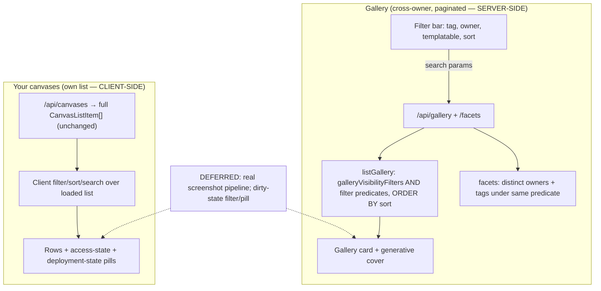

# feat: List filters, inline attribute pills & beautiful gallery cards

## Summary

Add per-surface filter and sort controls to the two member-facing list views —
the **gallery** (server-side filtering, since it is paginated and cross-owner)
and **Your canvases** (client-side, over the already-loaded owned list) — surface
the filterable attributes as inline pills on each item, and give gallery cards a
generative cover. Two §12 guardrails (owner-facet field restriction; filter/sort
params AND-onto the visibility predicate) and the owner-identity key decision are
resolved here. The real-screenshot pipeline and the dirty-state ("has unpublished
changes") filter are explicitly deferred to follow-up work.

---

## Problem Frame

The gallery offers free-text search + a single-tag filter; **Your canvases**
offers nothing — no search, filter, or sort. As canvases accumulate, both lists
become a flat scroll with no way to narrow to "my templates," "what I started but
never shipped," or a particular colleague's work. The attributes that would let
someone navigate (tags, owner, access state, deployment state) are invisible or
shown inconsistently. Separately, the gallery card is a flat bordered surface with
no per-canvas imagery, so one canvas looks like the next.

The origin requirements doc (see origin) resolved WHAT to build; this plan
resolves HOW, with the data-path split below as its central structural decision.

---

## Key Technical Decisions

- **KTD1 — Gallery filtering is server-side; Your-canvases is client-side.** The
  gallery is paginated, cross-owner, and gated by the §12 visibility predicate, so
  its filters/sort must run in SQL inside `listGallery`
  (`apps/server/src/db/repositories/canvases.ts`). `/api/canvases`
  (`management.ts` → `listByOwner`) already returns the owner's **complete** list
  with `lastDeploy`, so Your-canvases filtering/sort/search runs in the browser
  over the loaded `CanvasListItem[]` — **no new API for access-state or
  never-deployed filters** (all fields are already on the payload).

- **KTD2 — Filter/sort params AND onto the visibility predicate (§12 invariant).**
  Every gallery filter/sort param is an *additional* `AND` on top of
  `galleryVisibilityFilters` (active, shared, unprotected, listed, published). No
  param may modify, widen, or override those five constants; a missing/malformed
  param still returns only visible canvases. Tested as an invariant, not just
  prose (see origin: Key Decisions; [[2026-06-13-auth-invariant-checklist]],
  [[2026-06-13-gallery-listing-patterns]]).

- **KTD3 — Owner identity = the opaque owner id.** Filtering/labelling by owner
  needs a stable key. The gallery DTO gains `owner.id` (the existing user uuid —
  opaque, non-PII), and the owner facet returns `{ id, name, avatarUrl }`. Name is
  not used as the filter key (collisions, renames). Confirmed acceptable for a
  trusted org. The DTO still **never** exposes email or internal flags — the
  explicit projection + exact-key body assertion enforce this
  (`galleryItem()` in `apps/server/src/routes/gallery.ts`).

- **KTD4 — Facets are derived inline, not a dedicated endpoint (yet).** The
  pickable owner/tag lists are computed from the gallery set under the same
  visibility predicate (distinct owners; tag aggregation). Promote to a standalone
  facet service only if a second consumer appears (see origin: deferred review
  item).

- **KTD5 — Generative cover is a deterministic client-side component.** Seeded by
  the canvas id, rendered as SVG/CSS (gradient/mesh), no heavy runtime dependency,
  small bundle delta. The cover lives in a **fixed aspect-ratio box** so the later
  real screenshot can be `object-fit` cropped into the same region with no layout
  change (origin R13). No server work, no stored field.

- **KTD6 — Dirty-state filter is deferred.** `never-deployed` is cheap
  (`lastDeploy === null`); `has-unpublished-changes` (dirty) is **not** a stored
  column — only `stale` is. Dirty is a per-canvas draft-manifest-vs-live-manifest
  diff (`isDirty` in `apps/server/src/routes/draft-api.ts`), i.e. N draft + N
  version-manifest fetches + N diffs for a list of N. Deferred to follow-up so this
  plan ships the cheap filters now (see Scope Boundaries, Performance & Indexing).

---

## Performance & Indexing

The product runs at single-org gallery scale (dozens, low-hundreds of rows). The
plan keeps the existing "no index, two-query count" posture
([[2026-06-13-gallery-listing-patterns]]) and records the index path rather than
adding indices prematurely.

- **Gallery filters (owner, templatable, tag).** Added as `AND` predicates on the
  already-scanned, visibility-filtered set. Tag membership stays the one
  dialect-divergent query (JSON-array containment); owner (`owner_id = ?`) and
  templatable (`gallery_templatable = true`) are plain equality. At current scale
  these are sub-millisecond table scans. **Candidate index if scale grows:**
  `(gallery_listed, gallery_published_at)` for the default sort;
  `(owner_id)` if owner-filtering a large gallery. Documented, not added.
- **Gallery sort axes.** Default stays `gallery_published_at DESC, id DESC`
  (existing). New axes — `updated_at DESC` and `lower(title) ASC` — change the
  `ORDER BY` only; same candidate-index note applies. No index added now.
- **Facet derivation.** Distinct-owners + tag-aggregation are extra small queries
  under the same predicate. Acceptable unindexed at scale; cache-free so they stay
  correct on un-list/expire like the main predicate.
- **Your-canvases.** Pure client-side filtering/sort over an already-fetched list
  — **zero added DB load**. The owned-list query is unchanged.
- **Deferred dirty-state** is deferred *specifically because* its data-layer cost
  (batched manifest diff in `withLastDeploy`, or a denormalized dirty flag) is the
  one real performance question here; sizing it is part of the follow-up.
- **Schema untouched.** No `schema.*.ts` / `schema.test.ts` / `drizzle/*` changes,
  keeping cross-branch conflict near zero (same trade as M8).

---

## High-Level Technical Design

Data-path split (the load-bearing structural decision):

Pills mirror filters on both surfaces: the badge set on each item is the same
attribute set that surface can filter on (origin R9).

---

## Requirements Trace

| Origin | Covered by |
|---|---|
| R1 (gallery: tag/owner/templatable filter) | U1, U3 |
| R2 (gallery sort) | U1, U3 |
| R3 (filters compose + clearable) | U3 |
| R4 (gallery state in search params) | U3 |
| R5 (Your-canvases access-state filter) | U5 |
| R6 (Your-canvases deployment-state filter) | U5 (never-deployed); dirty → Deferred |
| R7 (Your-canvases search + sort) | U5 |
| R8 (Your-canvases state in search params) | U5 |
| R9 (inline pills mirror filters) | U4 (gallery), U6 (rows) |
| R10 (deployment-state indicator) | U6 (never-deployed); dirty → Deferred |
| R11 (generative cover) | U4 |
| R12 (card elevated, affordances preserved) | U4 |
| R13 (screenshot supersedes, fixed region) | U4 (region design); pipeline → Deferred |
| §12 AND-onto-visibility invariant | U1 |
| Owner-facet field restriction | U2 |
| Owner-identity key (resolve-before-planning) | KTD3, U1 |

AEs: AE1 → U3 tests; AE2 → U5/U6 tests (never-deployed portion; dirty deferred);
AE3 → U5/U6 tests; AE4 → U4 tests.

---

## Implementation Units

### U1. Gallery filter predicates, sort, and owner id

**Goal:** Extend the gallery query + DTO to filter by owner and templatable, sort
by a chosen axis, and expose `owner.id` — all while preserving the §12 visibility
invariant.

**Requirements:** R1, R2; §12 AND-onto-visibility invariant; KTD2, KTD3.

**Dependencies:** none.

**Files:**
- `apps/server/src/routes/gallery.ts` — extend `querySchema` (`owner`, `templatable`, `sort` enum), pass to `listGallery`, add `owner.id` to `GalleryItemDto` + `galleryItem()` projection.
- `apps/server/src/db/repositories/canvases.ts` — `listGallery`: add owner/templatable `AND` predicates onto `galleryVisibilityFilters`; sort switch (`gallery_published_at DESC` default, `updated_at DESC`, `lower(title) ASC`).
- `apps/dashboard/src/lib/api.ts` — extend `GalleryItem` (`owner.id`), `GalleryQuery` (`owner?`, `templatable?`, `sort?`).
- `apps/server/src/routes/gallery.test.ts`, `apps/server/src/db/repositories/canvases.gallery.test.ts` — tests.

**Approach:** Filters are built by pushing predicates onto the array returned by
`galleryVisibilityFilters(now)` — never replacing it. `owner` binds `owner_id = ?`
(opaque id); `templatable` binds `gallery_templatable = true`. `sort` is a closed
enum mapped to a drizzle `orderBy`; an unknown value falls back to the default
(matches the existing `.catch()` clamp posture). The DTO projection stays an
explicit field list (never a row spread) — add only `owner.id`, never email.

**Patterns to follow:** existing `listGallery` predicate array + `galleryItem()`
explicit projection; the `querySchema` `.catch()` clamp pattern in `gallery.ts`;
dual-dialect tag query already in place ([[2026-06-13-gallery-listing-patterns]]).

**Execution note:** §12-critical surface — write the spoof/leak tests first.

**Test scenarios:**
- Owner filter returns only that owner's listed canvases; unknown owner id → empty, never an error.
- Templatable filter returns only `gallery_templatable` canvases; composes with tag + owner (intersection). **Covers AE1.**
- Sort: default order unchanged; `updated_at` and `title` axes order correctly; unknown sort value falls back to default (no 400).
- **§12 invariant:** a filter/sort param cannot surface a non-shared / protected / unlisted / never-deployed / expired canvas — assert each visibility clause still holds under every new param, including a crafted `owner`/`templatable`/`sort` combination.
- DTO body exact-key assertion includes `owner.id` and still excludes `password_hash` / `api_key_hash` / owner email (`Object.keys` equals the public set).
- Run owner/templatable/sort predicate tests on **both** dialects (sqlite + pglite) per the dual-dialect rule.

**Verification:** gallery API accepts owner/templatable/sort, returns correctly
narrowed+ordered results, and no new param can breach the visibility predicate;
both dialect legs green.

---

### U2. Gallery facet source (owners + tags)

**Goal:** Provide the pickable owner and tag lists the filter UI needs, derived
under the same visibility predicate, with §12 field restriction.

**Requirements:** R1 (owner/tag filter UI needs a source); owner-facet field
restriction; KTD4.

**Dependencies:** U1 (reuses the shared visibility predicate).

**Files:**
- `apps/server/src/db/repositories/canvases.ts` — `listGalleryFacets`: distinct owners (`{ id, name, avatarUrl }`) + distinct tags under `galleryVisibilityFilters`.
- `apps/server/src/routes/gallery.ts` — expose facets (extend the gallery response or a `/api/gallery/facets` route behind the same session gateway).
- `apps/dashboard/src/lib/api.ts` — `GalleryFacets` type + fetch.
- `apps/server/src/routes/gallery.test.ts`, `apps/server/src/db/repositories/canvases.gallery.test.ts` — tests.

**Approach:** Owners come from the `innerJoin users` already used by
`listGallery`, projected to `{ id, name, avatarUrl }` only. Tags aggregate the
`gallery_tags` JSON arrays of visible canvases (dialect-divergent, mirror the
existing tag-membership branch). Facets reflect only visible canvases, so an
un-listed/expired owner drops out on the next call (no caching).

**Patterns to follow:** `listGallery` join + explicit owner projection; the
dual-dialect JSON handling ([[2026-06-13-gallery-listing-patterns]]).

**Execution note:** §12 surface — assert the owner facet never carries email.

**Test scenarios:**
- Facet owners include only owners with at least one visible canvas; a protected/unlisted/expired-only owner is absent.
- Owner facet objects expose exactly `{ id, name, avatarUrl }` — exact-key assertion; no email/internal fields.
- Tag facet lists only tags on visible canvases; deduped; both dialects.
- Facets route is behind the session gateway (unauthenticated request rejected like the gallery route).

**Verification:** the filter UI can populate owner + tag pickers from real visible
data with no PII leak; both dialect legs green.

---

### U3. Gallery filter controls + URL state

**Goal:** Filter bar on the gallery (owner select, templatable toggle, sort
select) composing with the existing tag + search, all in route search params, with
clear-all and zero-result handling. Builds the shared filter primitives reused by
Your-canvases.

**Requirements:** R1, R2, R3, R4; origin interaction-states (zero-result, default,
chip clearing).

**Dependencies:** U1, U2.

**Files:**
- `apps/dashboard/src/router.tsx` — extend `GallerySearch` (`owner?`, `templatable?`, `sort?`) + `validateSearch`.
- `apps/dashboard/src/routes/gallery.tsx` — render the filter bar; thread params into `useGallery`.
- `apps/dashboard/src/lib/queries.ts` — `GalleryQuery` key already includes the query object; extend.
- `apps/dashboard/src/components/` — shared `FilterBar` / `FilterSelect` / `FilterToggle` primitives (reused by U5).
- `apps/dashboard/src/test/gallery.test.tsx` — tests.

**Approach:** Mirror the existing search/tag URL-state handling — keep all filter
state in the route search params (shareable, back-able); merge (never replace) on
each change so one control doesn't wipe another; reset `page` to 1 on any filter
change. Honor the `keepPreviousData` / `isPlaceholderData` rule: never branch on
`data` without the placeholder guard. Preserve both existing empty states
(filtered-empty vs no-canvases) and extend the filtered-empty copy to the new
filters with clear-all.

**Patterns to follow:** existing `gallery.tsx` search debounce + tag-merge +
snap-to-page-1 effect + clear-all; admin segmented-chip filter
(`apps/dashboard/src/routes/admin.tsx`) for control styling
([[2026-06-13-dashboard-spa-patterns]], [[2026-06-13-gallery-listing-patterns]]).

**Test scenarios:**
- Selecting owner + templatable narrows the grid to the intersection; clear-all returns to the full gallery. **Covers AE1.**
- Each filter is individually clearable; clearing one preserves the others and the search term.
- Filter state round-trips through the URL (deep-link restores the filter UI; back-nav restores prior state).
- Zero-result composed filter shows the filtered-empty state (not the no-canvases state); changing/clearing filters recovers.
- No spurious page reset during paging while a filter is active (placeholder-data guard).

**Verification:** a member can compose tag/owner/templatable/sort + search, share
the URL, and clear filters; no stale-data flicker.

---

### U4. Beautiful gallery card + generative cover

**Goal:** Elevate the gallery card with a deterministic generative cover in a
fixed aspect-ratio region, preserving all existing affordances and leaving room for
the future real screenshot.

**Requirements:** R9 (gallery pills), R11, R12, R13 (region design); card-design
constraints (fixed ratio, contrast-safe text, stacking).

**Dependencies:** none (uses existing `GalleryItem.id`); independent of U1–U3.

**Files:**
- `apps/dashboard/src/components/GenerativeCover.tsx` — new seeded SVG/CSS cover.
- `apps/dashboard/src/routes/gallery.tsx` — restructure `GalleryCard` around the cover.
- `apps/dashboard/src/test/gallery.test.tsx` — tests.

**Approach:** `GenerativeCover` hashes the canvas id to a seed → deterministic
palette + gradient/mesh, rendered as inline SVG/CSS (no runtime dep). The cover
sits in a fixed aspect-ratio box (e.g. via `aspect-ratio`), so a later screenshot
`object-fit: cover`s into the same region — no layout change (R13). Card layout:
cover as the hero, then title (open-link), summary, tag pills, owner, actions
below — text never overlays the art unless a contrast-safe scrim guarantees WCAG
contrast. Decorative cover gets empty `alt` (presentation role).

**Patterns to follow:** existing `GalleryCard` affordances (title-as-open-link,
Make-a-copy, Copy-link); Badge/pill components.

**Technical design (directional, not spec):** seed = stable hash of `id`; map seed
→ 2–3 palette stops from the OKLCH design tokens; render a CSS/SVG gradient. Same
id → same art on every render.

**Test scenarios:**
- Same canvas id renders an identical cover across renders (deterministic); different ids differ.
- Card with no screenshot renders the generative cover; existing affordances (open link, tags, owner, Make-a-copy, Copy-link) all present. **Covers AE4.**
- Cover region holds a fixed aspect ratio (a swapped image of a different ratio crops, doesn't relayout). **Covers AE4.**
- Decorative cover exposes no misleading alt text; title link remains the discoverable primary target.

**Verification:** the gallery looks like a gallery of artifacts, every card has a
stable non-blank cover, and the region is screenshot-swap-ready.

---

### U5. Your-canvases client-side filter, search & sort

**Goal:** Add filter (access-state + never-deployed), search, and sort to Your
canvases — entirely client-side over the loaded list — with URL state and empty
states, reusing U3's filter primitives.

**Requirements:** R5, R6 (never-deployed only), R7, R8.

**Dependencies:** U3 (shared filter primitives).

**Files:**
- `apps/dashboard/src/router.tsx` — add `validateSearch` to the index route (filter/sort/search params).
- `apps/dashboard/src/routes/index.tsx` — apply client-side filter/sort/search over `useCanvases()` data.
- `apps/dashboard/src/components/` — reuse `FilterBar` primitives.
- `apps/dashboard/src/test/` — index/list filter tests (new or extend).

**Approach:** `useCanvases()` already returns the full owned `CanvasListItem[]`.
Derive the filtered/sorted view in the component (memoized): access-state from
`shared` / `hasPassword` / `galleryListed` / `galleryTemplatable`; never-deployed
from `lastDeploy === null`; sort default recently-updated (`updatedAt`/lastDeploy);
search over title/slug. State in the route search params (mirror gallery). Empty
states: filtered-empty (clear-all) vs the existing no-canvases/onboarding path.

**Patterns to follow:** gallery URL-state + clear-all (U3); existing `EmptyHome`
empty-state branching in `index.tsx`.

**Test scenarios:**
- Filter "shared" shows only shared canvases; "template" only templatable; composing access-state filters intersects. **Covers AE2 (access-state portion).**
- "never deployed" filter shows only `lastDeploy === null` canvases. **Covers AE3.**
- Sort default is recently-updated; alternate axis orders correctly.
- Search narrows by title/slug; clearing restores; filter state round-trips through the URL.
- Filtered-empty state vs no-canvases state are distinct; clear-all recovers.
- Note: `has-unpublished-changes` filter is intentionally absent (deferred) — assert it is not offered.

**Verification:** an owner can narrow their own list by access/deployment state,
search, and sort, with shareable URLs and no server calls added.

---

### U6. Inline pills + deployment-state indicator on rows

**Goal:** Make Your-canvas rows show the same attribute set they filter on,
including a new never-deployed indicator, with clean as the quiet default.

**Requirements:** R9, R10 (never-deployed; dirty deferred).

**Dependencies:** U5 (filter set defines the mirrored pills).

**Files:**
- `apps/dashboard/src/components/CanvasList.tsx` — extend `RowBadges` with a never-deployed indicator; confirm the access-state badge set matches the R5 filters.
- `apps/dashboard/src/components/Badge.tsx` — if a new badge tone/icon is needed.
- `apps/dashboard/src/test/` — RowBadges tests.

**Approach:** Extend `RowBadges` (which already renders Shared / Protected /
Listed / Template) with a never-deployed pill. Clean/deployed gets **no**
deployment pill (quiet default, per the existing "only badge what's notable"
rule). The filter→pill mapping is 1:1 with R5/R6's shipped values. Watch tag/badge
overflow on dense rows (wrap or `+N`).

**Patterns to follow:** existing `RowBadges` "only badge what's notable" rule and
badge components.

**Test scenarios:**
- A never-deployed canvas shows the never-deployed indicator; a clean deployed canvas shows no deployment pill. **Covers AE3.**
- Every shipped R5/R6 filter value has a corresponding row badge (mapping is 1:1); no badge exists without a matching filter.
- Many tags + multiple state badges on one row degrade gracefully (overflow handled).

**Verification:** a filtered Your-canvases result is self-evidently correct from
the inline pills without opening any canvas.

---

## Scope Boundaries

### In scope
Gallery server-side filter/sort + facets + owner id; gallery filter UI + card +
generative cover; Your-canvases client-side filter/search/sort; row pills +
never-deployed indicator; the two §12 guardrails.

### Deferred to Follow-Up Work
- **Dirty-state ("has unpublished changes") filter + pill** (origin R6/R10) —
  needs a batched draft-vs-live manifest diff in `withLastDeploy` (or a
  denormalized dirty flag). Deferred per KTD6; ships never-deployed now.
- **Real screenshot / headless-capture pipeline** (origin R13) — capture on
  publish, storage, staleness, sandboxing untrusted canvas content. The card
  (U4) is built to accept it.
- **Index tuning** — the candidate gallery indices in Performance & Indexing, if
  scale grows.

### Outside this scope (from origin)
- Backend/interactivity as a filter; multi-tag (OR) selection.
- Archived and Admin list views; live `<iframe>` embeds; owner-uploaded covers.

---

## Risks & Dependencies

- **§12 regression (highest risk).** A new filter/sort param that bypasses the
  visibility predicate would leak non-listed canvases. Mitigation: KTD2 + U1's
  invariant tests; predicates push onto the shared `galleryVisibilityFilters`
  array, never replace it. Read [[2026-06-13-auth-invariant-checklist]] before U1.
- **Owner-id exposure.** New field on the public gallery DTO. Mitigation: opaque
  uuid only, explicit projection, exact-key body assertion (U1/U2).
- **Dual-dialect drift.** New predicates/facets must pass both legs. Mitigation:
  repo-level tests on sqlite + pglite ([[2026-06-13-dual-dialect-drizzle-seam]]).
- **`keepPreviousData` reset trap.** New gallery filters interacting with paging
  can fire spurious resets. Mitigation: keep the `isPlaceholderData` guard (U3).
- **Card layout regression.** Adding a hero cover must not crowd the six existing
  affordances or break contrast. Mitigation: fixed-ratio region + contrast-safe
  text zone (U4).

---

## Open Questions

### Resolved during planning
- Owner identity key → opaque owner id (KTD3).
- Facet source → inline-derived (KTD4).
- Dirty-state → deferred (KTD6).
- Gallery filtering server-side / Your-canvases client-side → KTD1.

### Deferred to implementation
- Exact generative-cover algorithm (gradient vs mesh; palette mapping from OKLCH
  tokens) — settled when building U4 against the real design tokens.
- Whether facets ship as an extended gallery response or a separate `/facets`
  route — decide in U2 against the existing route shape.
- Exact sort-axis set beyond the default + one alternative (origin R2/R7) —
  confirm during U1/U5.

---

## Sources & Research

- Origin requirements: `docs/brainstorms/2026-06-14-list-filters-and-gallery-cards-requirements.md`.
- Gallery: `apps/server/src/routes/gallery.ts`, `apps/server/src/db/repositories/canvases.ts` (`listGallery`, `galleryVisibilityFilters`), `apps/dashboard/src/routes/gallery.tsx`.
- Your canvases: `apps/server/src/routes/management.ts` (`withLastDeploy`, `listByOwner`), `apps/dashboard/src/routes/index.tsx`, `apps/dashboard/src/components/CanvasList.tsx`, `apps/dashboard/src/lib/queries.ts`.
- Draft/dirty: `apps/server/src/routes/draft-api.ts` (`isDirty`), `apps/server/src/db/repositories/drafts.ts`.
- Routing/state: `apps/dashboard/src/router.tsx` (`GallerySearch`, `validateSearch`).
- Learnings: [[2026-06-13-gallery-listing-patterns]], [[2026-06-13-auth-invariant-checklist]], [[2026-06-13-dual-dialect-drizzle-seam]], [[2026-06-13-dashboard-spa-patterns]], [[2026-06-14-clone-as-template]].
- Card-imagery prior art (from brainstorm): GitHub identicons, Vercel OG gradients, Linear identity art; screenshot thumbnails (Dribbble/CodePen) deferred.
