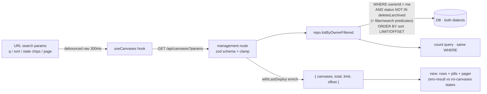

# feat: Server-side filter/search for Your canvases + richer row pills

## Summary

Move the **Your canvases** view (`/`) from in-memory filtering to a fully
server-side filter/search/sort path with pagination — mirroring the gallery's
established `listGallery` pattern (zod query schema → repo `where` predicates +
`limit`/`offset`/`total` → debounced URL-param-driven refetch + pager). Then
expand the inline pill vocabulary on each row and polish the control bar so the
list reads at a glance. The owner-scoped query is simpler than the gallery's (no
§12 cross-owner visibility predicate — every row is `ownerId = me`), so the
central new risk is query correctness across both SQL dialects, not auth.

This **reverses plan 004's KTD1** (which kept Your-canvases client-side because
the management API returns the owner's complete list) for this surface only;
the gallery stays server-side as built, and admin is untouched. The
`has-unpublished-changes` (dirty) filter remains deferred per plan 004's KTD6.

---

## Problem Frame

Plan 004 gave Your-canvases search + filter chips + sort, computed client-side
over the already-loaded owned list (`filterAndSort` in
`apps/dashboard/src/routes/index.tsx`). That is instant at small scale but does
not paginate, sends the entire owned list on every load, and diverges from the
gallery — which already filters/sorts/paginates in SQL. As an owner accumulates
canvases, the flat client-side approach loads everything up front and offers no
windowing. This plan makes the two member-facing list surfaces consistent
(both server-side, both URL-param-driven, both paginated) and uses the richer
data path as the moment to also strengthen the at-a-glance pill set on each row.

The origin requirements doc (see origin) defined WHAT to surface (R5–R10 — the
filterable attributes and inline pills); plan 004 chose a client-side HOW for
this surface. This plan re-decides that HOW as server-side and carries the
same attribute set forward.

There is in-progress, uncommitted client-side work for plan 004 in the working
tree (`apps/dashboard/src/routes/index.tsx`, `apps/dashboard/src/components/CanvasList.tsx`,
`apps/dashboard/src/router.tsx`). This plan builds on the UI scaffolding (the
`FilterBar`/`FilterChip`/`FilterSelect` components, the `CanvasesSearch` param
type, the `RowBadges` set) and replaces the in-memory `filterAndSort` data path.

---

## Key Technical Decisions

- **KTD1 — Your-canvases filtering goes server-side, mirroring `listGallery`.**
  The new repo method and route schema follow the gallery's shape exactly
  (`apps/server/src/db/repositories/canvases.ts` `listGallery`;
  `apps/server/src/routes/gallery.ts` `querySchema`) so the two surfaces share
  one mental model. This reverses plan 004 KTD1 for this surface only.

- **KTD2 — Owner-scope is the invariant, enforced in SQL on every query.** Every
  filtered query ANDs `eq(ownerId, me)` and `notInArray(status, ["deleted","archived"])`
  exactly as today's `listByOwner` does. No filter/sort/search/pagination param
  may widen beyond the caller's own active canvases; a missing or malformed param
  still returns only the owner's set. This is the Your-canvases analogue of the
  gallery's visibility predicate (KTD2 in plan 004) and is tested as an invariant,
  not just prose ([[2026-06-13-auth-invariant-checklist]]).

- **KTD3 — Column-based filters only; dirty stays deferred.** All shipped filters
  map to existing canvas columns and are pure SQL `where` predicates: `shared`
  (`eq(shared, true)`), `protected` (`isNotNull(passwordHash)`), `listed`
  (`eq(galleryListed, true)`), `template` (`eq(galleryTemplatable, true)`),
  `never-deployed` (`isNull(currentVersionId)`). Search is a portable
  case-insensitive `LIKE` over `title` + `slug` (escape LIKE metacharacters, as
  `listGallery` does). `has-unpublished-changes` is **not** a column (it is an
  N-row draft-vs-live manifest diff — see plan 004 KTD6) and stays deferred.

- **KTD4 — Page-based offset pagination, matching the gallery.** Reuse the
  gallery's `limit`/`offset`/`total` + page-in-URL convention (see
  `apps/dashboard/src/routes/gallery.tsx`) rather than admin's keyset infinite
  scroll, because Your-canvases shares the gallery's "shareable filtered view"
  posture and a finite page count reads naturally for a personal list. A small
  fixed page size (e.g. 24, matching `GALLERY_PAGE_SIZE`'s spirit).

- **KTD5 — Pills mirror filters (carried from origin R9).** The inline pills on
  each row are exactly the set the surface filters on (shared / protected /
  listed / template / never-deployed), plus tags inline — no second divergent
  badge vocabulary. `clean` (deployed, no draft) stays the quiet default with no
  pill. The look-and-feel pass enriches *rendering* (tag pills, symbol-vs-label
  rule, overflow policy, hover/spacing polish), not the attribute set.

- **KTD6 — No new index; two-query count posture.** Single-org scale (dozens to
  low-hundreds of owned rows). Mirror the gallery's existing "filtered `select`
  + `count`" two-query approach with no new DB index, consistent with plan 004's
  Performance posture.

---

## High-Level Technical Design

The request lifecycle mirrors the gallery's, with the owner-scope AND replacing
the gallery's visibility predicate as the non-negotiable base of every query:

The owner-scope clause (`ownerId = me AND status NOT IN (...)`) is the fixed base
of *both* the page query and the count query; every filter/search param is an
additional AND on top, never a replacement — the same invariant shape the gallery
enforces.

---

## Implementation Units

### U1. Server-side owned-list query in the repository

**Goal:** Add a filtered, sorted, paginated owner-scoped list query returning
`{ items, total }`, mirroring `listGallery`.

**Requirements:** origin R5, R6 (never-deployed only), R7, R8; advances KTD1–KTD4, KTD6.

**Dependencies:** none.

**Files:**
- `apps/server/src/db/repositories/canvases.ts` (add `listByOwnerFiltered`, an `OwnerListOptions` type, and a `count` companion; keep existing `listByOwner` for any other caller)
- `apps/server/src/db/repositories/canvases.test.ts` (dual-dialect)

**Approach:** Build a `filters` array seeded with the owner-scope base
(`eq(t.ownerId, ownerId)`, `notInArray(t.status, ["deleted","archived"])`), then
push optional predicates: `q` → escaped `LIKE` over `lower(title)`/`lower(slug)`
(reuse the `listGallery` escaping); `shared`/`protected`/`listed`/`template`/
`neverDeployed` → the column predicates in KTD3. Sort axis maps to
`orderBy` (`updated` → `desc(updatedAt)`, `created` → `desc(createdAt)`, `title`
→ `asc(title)`). Page query applies `limit`/`offset`; count query runs the same
`and(...filters)` with `count()`. Both dialects share the predicate array; only
keep dialect-specific SQL out of this method (no JSON-array query needed here —
unlike the gallery's tag filter).

**Patterns to follow:** `listGallery` and `galleryVisibilityFilters` in the same
file; the two-query count posture; the `Canvas[]` cast for the dual-dialect seam (KTD-1).

**Test scenarios:**
- Returns only the caller's active canvases; never another owner's row, and never archived/deleted — even when a permissive filter combination is passed. *(Covers the KTD2 invariant.)*
- `q` matches on title and on slug, case-insensitively; a `%`/`_` in the query is treated literally (escaped), not as a wildcard.
- Each state filter narrows correctly in isolation: `shared`, `protected` (password set), `listed`, `template`, `neverDeployed` (`currentVersionId IS NULL`).
- Composed filters intersect (e.g. `shared` + `template` returns only rows matching both).
- Sort axes order correctly: updated-desc, created-desc, title-asc.
- `limit`/`offset` window correctly; `total` equals the full filtered count independent of the page window.
- Empty result (filters match nothing) returns `{ items: [], total: 0 }`, not an error.
- Runs green on **both** sqlite and pglite (dual-dialect parity).

---

### U2. Management route accepts filter/search/sort/page params

**Goal:** `GET /api/canvases` parses and clamps query params and returns the paged
shape `{ canvases, total, limit, offset }`, preserving `withLastDeploy` enrichment.

**Requirements:** origin R7, R8; advances KTD1, KTD2, KTD4.

**Dependencies:** U1.

**Files:**
- `apps/server/src/routes/management.ts` (extend the `GET /` handler with a zod query schema; leave `GET /archived` and `GET /:id` unchanged)
- `apps/server/src/routes/management.test.ts`

**Approach:** Add a `querySchema` modeled on `gallery.ts`: `q` optional trimmed
string; boolean state flags coerced from `"1"`/`"true"`; `sort` enum with `.catch`
default (`updated`); `limit`/`offset` coerced ints with `.catch` defaults, then
clamped (`limit` to `[1, MAX]`, `offset` to `>= 0`). On `safeParse` failure fall
back to all-defaults so a junk query never 400s. Call
`canvases.listByOwnerFiltered({ ownerId: me, ...params })`, enrich `items` with
`withLastDeploy`, and return `{ canvases, total, limit, offset }`. The response is
additive (adds `total`/`limit`/`offset` alongside the existing `canvases` array).

**Patterns to follow:** `querySchema` + clamp + all-defaults fallback in
`apps/server/src/routes/gallery.ts`; the existing `withLastDeploy` helper in `management.ts`.

**Test scenarios:**
- No params → returns the owner's first page with defaults applied; shape includes `total`/`limit`/`offset`.
- A filter param (e.g. `?template=1`) returns only matching owned canvases; `withLastDeploy` enrichment is present on each item.
- `sort` is honored; an unknown `sort` value falls back to the default axis (no 400).
- `limit` above the max clamps to the max; negative `offset` clamps to 0; a non-numeric `limit` falls back to the default.
- A malformed/garbage query string still returns the owner's canvases (all-defaults fallback), never a 400.
- The route never returns another user's canvas regardless of params (owner-scope passes through from U1). *(Covers the KTD2 invariant at the route layer.)*

---

### U3. API client + query hook for the paged, filtered list

**Goal:** `api.listCanvases(params)` sends the query params; `useCanvases(params)`
returns the paged shape and keeps the previous page visible during refetch.

**Requirements:** origin R8; advances KTD1, KTD4.

**Dependencies:** U2.

**Files:**
- `apps/dashboard/src/lib/api.ts` (extend `listCanvases` to accept params and return `{ canvases, total, limit, offset }`; add a `CanvasesListParams` type)
- `apps/dashboard/src/lib/queries.ts` (`useCanvases` takes params, includes them in the query key, uses `placeholderData`/keep-previous so paging/filtering doesn't flash empty)
- `apps/dashboard/src/lib/queries.ts` query-key factory entry for the parameterized list

**Approach:** Serialize params to the query string (omit falsy/default values so the
URL stays clean). Mirror the gallery's hook shape. The query key must include all
params so React Query caches per filter/page combination. Use keep-previous-data
semantics so toggling a chip or page doesn't blank the list mid-fetch.

**Patterns to follow:** the gallery's query hook + key factory in
`apps/dashboard/src/lib/queries.ts`; existing `api` request helpers in `api.ts`.

**Test scenarios:** *(thin — behavior is proven at the component layer in U4)*
- `listCanvases` builds the expected query string and omits default/empty params.
- `useCanvases` includes params in its query key (distinct keys for distinct filter sets).
- Test expectation: full behavioral coverage lives in U4's component tests.

---

### U4. Wire the view to URL-param-driven server fetch + pagination

**Goal:** `index.tsx` drives all filter/search/sort/page state through URL params
→ server refetch; remove the client-side `filterAndSort`; add debounced search,
a pager, and correct empty states.

**Requirements:** origin R7, R8; advances KTD1, KTD4, KTD5.

**Dependencies:** U3.

**Files:**
- `apps/dashboard/src/routes/index.tsx`
- `apps/dashboard/src/router.tsx` (extend `CanvasesSearch` with `page`; keep the existing `q`/`sort`/state-flag params)
- `apps/dashboard/src/test/app.test.tsx` (or a dedicated `canvases.test.tsx`, mirroring `gallery.test.tsx`)

**Approach:** Replace the `useMemo(filterAndSort)` data path with
`useCanvases(searchParams)`. Debounce the search box into the `q` route param
(300ms; clear applies immediately) exactly as the gallery does. Chip toggles and
sort changes write route params (resetting `page` to 1). Add prev/next (or
load-more) pager bound to `total`/`limit`/`offset`, with the gallery's
snap-back-to-page-1 guard when a refetch lands past the last page. Preserve the
two distinct empty states: **no canvases at all** (`EmptyHome`, only when the
unfiltered owner list is truly empty) vs **zero results for the active filter
set** (the "No canvases match these filters" `EmptyState` with clear-all).
Distinguishing these now requires care because the server response is already
filtered — gate `EmptyHome` on "no active filters AND `total === 0`".

**Execution note:** Start from a failing component test for the
filter-toggle-triggers-refetch contract, since the regression risk is the
client→server data-path swap.

**Patterns to follow:** `apps/dashboard/src/routes/gallery.tsx` (debounce, page
state, snap-back, zero-result vs empty handling); the existing control-bar markup
already in `index.tsx`.

**Test scenarios:**
- Typing in the search box debounces, then refetches with `q`; clearing the box applies immediately and drops `q`.
- Toggling a state chip updates the URL param and triggers a refetch with that filter; the chip reflects active state from the URL.
- Changing sort refetches with the new axis and resets to page 1.
- Pager advances/retreats pages; `total`/`limit` drive the control's enabled/disabled state.
- *Covers AE2.* Filtering to shared + (a shipped state) returns rows that each show the corresponding badge — the filtered result is self-evidently correct.
- *Covers AE3.* The never-deployed filter returns only never-deployed canvases, each carrying the never-deployed pill; a clean deployed canvas carries no deployment pill.
- Zero-result empty state shows for an over-narrow filter set (with clear-all); the "no canvases at all" onboarding pointer shows only when the owner has no canvases AND no active filters.
- Back-navigation restores a prior filtered/paged view from the URL.
- A shared filtered URL (params present on first load) renders that filtered page directly.

---

### U5. Richer row pills + control-bar polish

**Goal:** Expand the inline pill/symbol vocabulary on each row (mirroring the
filter set) and polish the control bar, so the list reads at a glance.

**Requirements:** origin R9, R10, and the deferred "filter/pill interaction
states" question (overflow, pill-vs-symbol); advances KTD5.

**Dependencies:** U4 (so pills reflect the same attributes the surface now filters on).

**Files:**
- `apps/dashboard/src/components/CanvasList.tsx` (`RowBadges` + row layout)
- `apps/dashboard/src/components/Badge.tsx` (only if a new tone/variant is needed)
- `apps/dashboard/src/components/CanvasList.test.tsx` (or the existing test file for this component)

**Approach:** Within the existing `RowBadges` "only badge what's notable" rule,
add **tag pills** inline on the row (currently tags are not shown), keep the full
access-state set (Shared / Protected / Listed / Template) and the never-deployed
indicator, and apply the origin's deferred-question rules: a **pill-vs-symbol**
convention (labelled pill for primary states, compact symbol/icon for secondary),
a **tag + badge overflow** policy on dense rows (e.g. show first N, then a `+k`
affordance), and spacing/hover polish on the control bar and rows. No new
attribute is invented — pills mirror the filter set (KTD5). `clean` stays quiet.

**Patterns to follow:** the existing `RowBadges`/`Badge` tones in
`apps/dashboard/src/components/CanvasList.tsx` and `Badge.tsx`; the gallery card's
tag-pill rendering for visual consistency.

**Test scenarios:**
- Each active state renders its pill: shared→Shared, password→Protected, listed→Listed, templatable→Template, `currentVersionId IS NULL`→Never deployed.
- A clean deployed canvas (no draft, has a published version) renders **no** deployment pill.
- Tags render as inline pills; a row with more tags/badges than the overflow threshold shows the `+k` affordance rather than wrapping unbounded.
- A non-active status (archived/disabled, if ever rendered here) still shows its status badge.
- Verification: screenshot `/` in the running dashboard and confirm the pill set, overflow behavior, and spacing against the design tokens (no raw hex; uses `Badge` tones).

---

## Scope Boundaries

### Deferred to Follow-Up Work
- **`has-unpublished-changes` (dirty) filter** — needs a batched draft-vs-live
  manifest diff (plan 004 KTD6); not a column. Ship the cheap filters now.
- **Card grid / generative covers for Your-canvases** — the look-and-feel pass
  here stays row-based ("richer rows + more pills"). The gallery's generative
  cover (plan 004) is not brought to this surface in this plan.
- **A shared `useFilteredList` abstraction** across gallery + canvases — both
  surfaces will mirror each other after this plan, but extract a shared hook only
  if a third consumer appears (avoid premature abstraction).

### Outside this scope (from origin)
- Gallery filtering/cards (already built, server-side) — untouched here except as
  the pattern to mirror.
- Archived and Admin list views — left as-is (admin has its own status tabs).

---

## Risks & Dependencies

- **Client→server data-path swap regression (medium).** The biggest risk is the
  two empty-state cases collapsing into one once the response is pre-filtered, or
  search firing per-keystroke. Mitigation: U4's execution-note test-first on the
  refetch contract; copy the gallery's debounce + zero-result/empty split verbatim.
- **Dual-dialect query drift (medium).** New `where`/`orderBy`/`count` must pass on
  both sqlite and pglite. Mitigation: U1 tests run the full matrix; no
  dialect-specific SQL is needed for these column predicates (unlike the gallery's
  JSON tag filter).
- **In-flight working-tree code (low).** Uncommitted plan-004 client-side work
  exists in `index.tsx`/`CanvasList.tsx`/`router.tsx`. This plan replaces the
  client-side data path and extends the UI scaffolding; coordinate so the
  conversion lands cleanly rather than fighting a half-committed client-side filter.
- **Response-shape consumers (low).** Confirm no other caller depends on
  `GET /api/canvases` returning a bare `{ canvases }` without the new fields; the
  change is additive but the hook now reads `total`/`limit`/`offset`.

Greenfield/pre-v1: data is clearable and no migration/backfill is required
([[greenfield-data-clearable]]). Gate before merge with
`pnpm lint && pnpm typecheck && pnpm test` (both dialects), per AGENTS.md.

---

## Sources & Research

- Server-side pattern to mirror: `apps/server/src/routes/gallery.ts` (query schema,
  clamp, all-defaults fallback), `apps/server/src/db/repositories/canvases.ts`
  (`listGallery`, `galleryVisibilityFilters`, two-query count), and
  `apps/dashboard/src/routes/gallery.tsx` (debounce, page-in-URL, snap-back, empty states).
- Current Your-canvases surface being converted: `apps/dashboard/src/routes/index.tsx`
  (`filterAndSort`), `apps/dashboard/src/components/CanvasList.tsx` (`RowBadges`),
  `apps/dashboard/src/router.tsx` (`CanvasesSearch`), `apps/dashboard/src/lib/queries.ts`
  (`useCanvases`), `apps/server/src/routes/management.ts` (`GET /` + `withLastDeploy`).
- Origin requirements: `docs/brainstorms/2026-06-14-list-filters-and-gallery-cards-requirements.md`
  (R5–R10, AE2–AE3, deferred questions).
- Prior plan re-decided here: `docs/plans/2026-06-14-004-feat-list-filters-and-gallery-cards-plan.md` (KTD1, KTD6).
- Learnings: [[2026-06-13-auth-invariant-checklist]], [[greenfield-data-clearable]].
