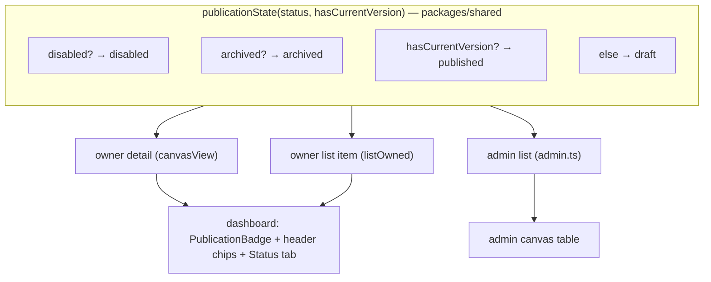
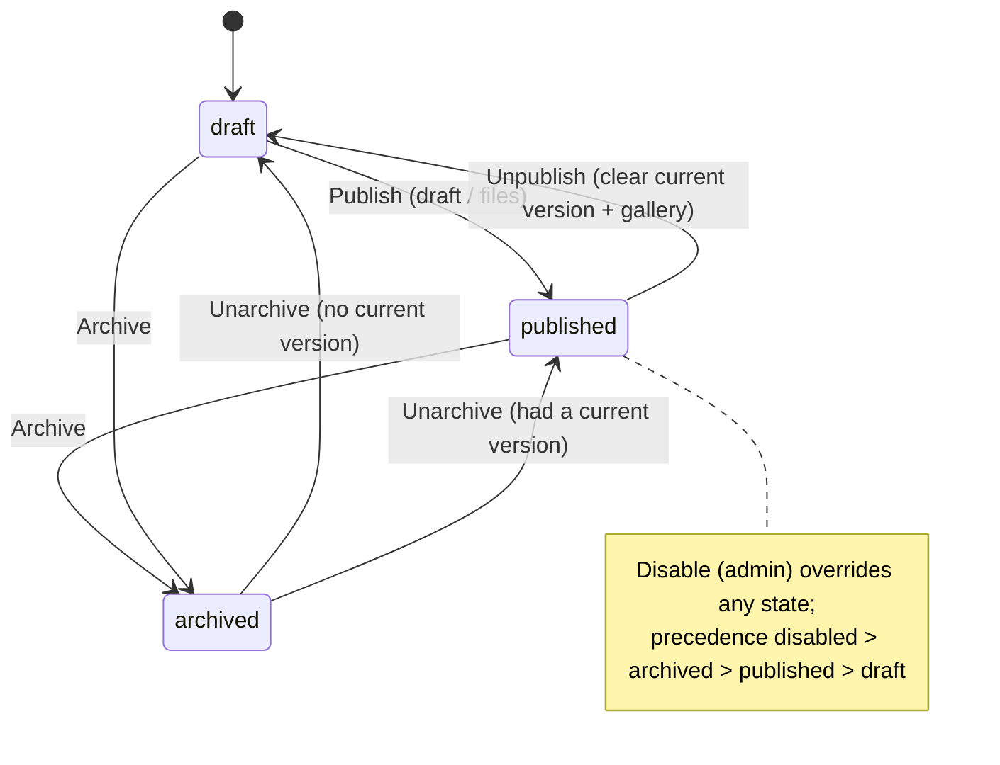

# feat: Canvas vocabulary & state model

## Summary

Unify how a canvas's lifecycle is named and presented across the dashboard, backed by a new **server-derived `publicationState` field** on the canvas projection. Publish becomes the only UI verb (with "deploy" retained as the API/SDK term); a canvas reads as **Draft → Published → Archived** (served snapshot = **Current**); the header gains three axis-chips matching the list (Publication · Visibility · Gallery); each view shows exactly one publish affordance; a new **Unpublish** transition returns a Published canvas to Draft; and the docs site, README, and API docs are aligned to the result — including documenting the new field.

**Execution posture:** Work on the current branch in the main checkout — **no new worktrees or branches** (per owner instruction and `[[work-on-current-worktree-branch]]`). Land the whole scope as one branch / one PR (autonomous-round style). Server units run the full **dual-dialect** suite (sqlite + pglite); no schema change means schema-parity stays green by construction.

---

## Problem Frame

The same concept wears different words on nearly every screen (full inventory in the origin doc). "Make content live" appears as **Deploy** (header "Deploy files", "Deploy a new version", "Deploy history", the "Deploys" tab) and as **Publish** ("Publish draft", "Create and deploy", "Published v1"), and the two collide on the editor tab where the persistent header "Deploy files" sits next to the bar's "Publish draft". The live state is variously "Live", "Published", and "Deployed"; the never-live state is both "Draft only" and "Never deployed". Underneath, the lifecycle is two unreconciled facts — `status` (`active`/`archived`/`disabled`) and whether a version is served (`currentVersionId != null`) — that no single field expresses, and the header surfaces only the *gallery* chip ("Listed") in the slot a reader expects a lifecycle status.

This plan introduces one authoritative lifecycle value (`publicationState`), unifies the vocabulary and chips on top of it, adds the missing Published→Draft transition, and aligns the docs.

---

## Key Technical Decisions

- **`publicationState` is a server-derived, authoritative field — not stored.** Computed at projection time from `status` + presence of `currentVersionId`, so there is no schema change and no migration (consistent with `[[greenfield-data-clearable]]`). A single pure helper in `packages/shared` is the only place the precedence lives; every projection (owner detail, owner list, admin list) calls it, so the value can never drift between surfaces. (see origin: `docs/brainstorms/2026-06-14-canvas-vocabulary-and-state-model-requirements.md`)
- **Precedence: `disabled > archived > published > draft`.** `deleted` canvases are never surfaced (existing 404), so the enum is the four visible states.
- **Unpublish reuses existing mechanics.** The transition clears `currentVersionId` (as `clearDanglingVersion` already does at `apps/server/src/db/repositories/canvases.ts`) **and** clears `galleryListed` + `galleryTemplatable` in the same write (mirroring the gallery-clear at `canvases.ts:203-204`), guarded to only act on a currently-published active canvas. The route mirrors `archive`/`unarchive` in `apps/server/src/routes/management.ts` — owner-only, `sameOrigin`, audit entry, and drop-live-sockets (D-RT-6).
- **Publish is the only UI verb; "deploy" stays the API/SDK + code-identifier term.** Internal identifiers (`DeployButton`, `useDeploy`, `api.deploy*`, `/api/canvases/:id/deploy*`, `/v1/.../deploy`) are intentionally NOT renamed — only user-facing dashboard strings change. "Publish" = create a new version; **"Make current"** = re-point to an existing one.
- **All header changes to `canvas.tsx` live in one unit** (U5) — chips, editor-tab suppression, and the "Publish files" label — so the vocabulary pass (U7) does not also edit that file and risk conflicts.

---

## High-Level Technical Design

Lifecycle (derived `publicationState`) and where the field fans out:

Lifecycle transitions (Unpublish is the new edge):

---

## Requirements Traceability

| Origin | Covered by |
|---|---|
| R1, R3, R4, R5 (vocabulary) | U7, U8 |
| R2 (keep "deploy" in API/code) | U7, U11 (verification) |
| R6 (derived publication state + precedence) | U1, U2 |
| R7 (header three chips) | U5 |
| R8 (list column rename) | U6 |
| R9 (Status tab vocabulary) | U6 |
| R10, R11 (one publish affordance / editor tab) | U5 |
| R12 ("Publish files" header label) | U5 |
| R13 (tab renames) | U8 |
| R14 (Versions tab copy) | U8 |
| R15 (create flow copy) | U7 |
| R16–R20 (Unpublish behavior + placement) | U3 (server), U9 (UI) |
| R18 (gallery clear on unpublish) | U3 |
| R21 (UI docs + create-and-deploy rename) | U10 |
| R22 (API/SDK/agent docs keep deploy) | U11 |
| R23 (docs render/integrity tests) | U10, U11 |

---

## Implementation Units

### Phase A — Server foundation

### U1. Shared `publicationState` type + derivation helper

- **Goal:** One authoritative definition of the derived lifecycle.
- **Requirements:** R6
- **Dependencies:** none
- **Files:** `packages/shared/src/` (new `publication-state.ts` or appropriate existing module + barrel export); `packages/shared/src/**/*.test.ts` (new test)
- **Approach:** Export a `PublicationState = "draft" | "published" | "archived" | "disabled"` type and a pure `publicationState({ status, hasCurrentVersion })` helper applying precedence `disabled > archived > published > draft`. Keep it dependency-free so both server projections and the dashboard type layer can import the type.
- **Patterns to follow:** existing shared enums/helpers and barrel export convention in `packages/shared/src`.
- **Test scenarios:**
  - Covers AE1. `status="disabled"` with a current version → `disabled` (disabled outranks published).
  - `status="archived"` with a current version → `archived`.
  - `status="active"` with a current version → `published`.
  - Covers AE2. `status="active"` without a current version → `draft`.
  - `status="archived"` without a current version → `archived` (archived outranks draft).
- **Verification:** Helper is importable from the shared barrel; unit tests green on both dialect legs (pure function, dialect-independent but runs in the shared suite).

### U2. Expose `publicationState` in server projections

- **Goal:** Every owner/admin canvas projection carries the field.
- **Requirements:** R6
- **Dependencies:** U1
- **Files:** `apps/server/src/routes/management.ts` (owner `canvasView` + list-item projection); `apps/server/src/routes/admin.ts` (admin list projection ~line 136); `apps/server/src/routes/management.test.ts`; `apps/server/src/routes/admin.test.ts`
- **Approach:** Call the U1 helper in each projection, deriving `hasCurrentVersion` from `currentVersionId != null`. Add `publicationState` to the returned objects. Do not add it to the display-only gallery projection (always published). No schema change.
- **Patterns to follow:** existing `canvasView` projection and the admin list mapping that already reads `cv.currentVersionId`.
- **Test scenarios:**
  - Owner detail of an active canvas with a current version returns `publicationState: "published"`.
  - Owner detail of an active never-published canvas returns `"draft"`.
  - Owner list includes `publicationState` per row matching each canvas's state.
  - Admin list row reflects `disabled`/`archived` precedence over published.
- **Verification:** API responses include the field across detail/list/admin; dual-dialect route tests green.

### U3. Server Unpublish transition (repo method + route)

- **Goal:** Published → Draft, offline + de-listed, reversible.
- **Requirements:** R16, R17 (server side), R18, R19, R20
- **Dependencies:** U2 (route returns the updated `canvasView` with the new field)
- **Files:** `apps/server/src/db/repositories/canvases.ts` (new `unpublish(id)`); `apps/server/src/routes/management.ts` (new `POST /:id/unpublish`); `apps/server/src/lib/api.ts` error code/hint additions if needed; `apps/server/src/db/repositories/canvases.test.ts`; `apps/server/src/routes/management.test.ts`
- **Approach:** Repo `unpublish(id)` sets `currentVersionId = null`, `galleryListed = false`, `galleryTemplatable = false`, bumps `updatedAt`, in a single guarded update that returns `false` unless the row is active with a non-null `currentVersionId`. Route mirrors `archive`/`unarchive`: owner-only via `ownedCanvas`, `sameOrigin`, returns 409 (`NOT_PUBLISHED`-style code/hint) on a non-published canvas, records `canvas_unpublish` audit, drops live sockets (D-RT-6), and returns the updated `canvasView`. An admin-disabled canvas is not owner-unpublishable (same guard shape as delete).
- **Patterns to follow:** `archive`/`unarchive` route + repo transitions in `management.ts` / `canvases.ts`; gallery-clear write at `canvases.ts:203-204`; socket-drop at the archive route.
- **Test scenarios:**
  - Covers AE2. Published active canvas → `unpublish` → `publicationState: "draft"`, `currentVersionId` null, version history retained.
  - Covers AE4. A Listed/Templatable published canvas → `unpublish` clears `galleryListed` and `galleryTemplatable` in the same operation.
  - Public URL serves 404 after unpublish (existing serve behavior for no current version).
  - 409 with the not-published code when called on a Draft canvas.
  - Non-owner → not found; admin-disabled canvas → owner cannot unpublish.
  - Audit `canvas_unpublish` recorded; live sockets dropped.
- **Verification:** Dual-dialect repo + route tests green; serve test confirms 404 post-unpublish.

### Phase B — Dashboard state model & chips

### U4. Dashboard types + Publication/Visibility/Gallery badges

- **Goal:** Render lifecycle/visibility/gallery from the field, not ad-hoc strings.
- **Requirements:** R6 (consume), foundation for R7/R8/R9
- **Dependencies:** U2
- **Files:** `apps/dashboard/src/lib/api.ts` (add `publicationState` to `Canvas` + `CanvasListItem` types, importing `PublicationState` from shared); `apps/dashboard/src/components/Badge.tsx` (new `PublicationBadge`, plus `VisibilityBadge`/`GalleryBadge` helpers or a small shared chip); `apps/dashboard/src/test/` (badge unit test)
- **Approach:** `PublicationBadge` maps `draft/published/archived/disabled` → label + tone (Draft neutral, Published success, Archived warning, Disabled danger). Add compact Visibility (Private/Shared) and Gallery (Unlisted/Listed/Template) chips reusing the existing `Badge` tones. Keep `StatusBadge` only where raw admin `status` is genuinely meant.
- **Patterns to follow:** existing `StatusBadge` in `Badge.tsx`; `galleryLabel`/`accessLabel` derivations in `canvas.overview.tsx`.
- **Test scenarios:**
  - Each `publicationState` value renders its expected label + tone.
  - Visibility chip reflects `shared`; Gallery chip reflects `galleryListed`/`galleryTemplatable`.
- **Verification:** Badges render from props; unit test green.

### U5. Header three-chip row + single publish affordance

- **Goal:** Header mirrors the list's three axes; only one publish button per screen.
- **Requirements:** R7, R10, R11, R12
- **Dependencies:** U4
- **Files:** `apps/dashboard/src/routes/canvas.tsx`; `apps/dashboard/src/components/CanvasDetail.tsx` (the `badge` slot may become a chip row); `apps/dashboard/src/test/` (affected layout tests)
- **Approach:** Replace the single gallery `badge` with a chip row `Publication · Visibility · Gallery` (list order). Detect the active route (router state / pathname): when on the editor tab (`/editor`), do **not** render the header publish action (the editor's own Publish wins, U7); on other tabs render the global action labelled **Publish files**. Unarchive button behavior unchanged.
- **Patterns to follow:** existing `actions`/`badge` wiring in `canvas.tsx` + `CanvasDetailChrome`; `useRouterState` already used in `CanvasDetail.tsx`.
- **Test scenarios:**
  - Covers AE3. On the editor tab, the header publish button is absent; the editor bar's Publish is the only publish control.
  - On Status/Versions tabs, header shows "Publish files".
  - Header renders all three chips in order, reflecting state.
- **Verification:** Editor tab shows one publish affordance; chips match the list for the same canvas.

### U6. List + Status tab adopt publication state & vocabulary

- **Goal:** List column and Status tab speak the unified vocabulary.
- **Requirements:** R8, R9
- **Dependencies:** U4
- **Files:** `apps/dashboard/src/components/CanvasList.tsx` (column "Deployment"→"Publication", values via `PublicationBadge`; "Draft only"→"Draft"); `apps/dashboard/src/routes/canvas.overview.tsx` (Lifecycle fact → `PublicationBadge`; "Current deploy"→"Current version"; health-card titles "No live deploy yet"/"Canvas is live"→publish wording; `?live` "Deploy finished."→"Published."; "Deploys" fact/link wording); `apps/dashboard/src/test/your-canvases-filters.test.tsx` and Status-tab tests (string updates)
- **Approach:** Consume `publicationState`; remove the local "Draft only"/"Never deployed" derivations. Keep the "Deploys" history count link target route (`/versions`) but update label to match U8's "Versions". Repair-action button labels become "Publish files".
- **Patterns to follow:** existing `deployment()`/`gallery()` helpers in `CanvasList.tsx`; `Fact`/`HealthCard` in `canvas.overview.tsx`.
- **Test scenarios:**
  - List column header reads "Publication"; a never-published canvas shows "Draft".
  - Status tab Lifecycle fact renders `PublicationBadge`; current-version fact uses new wording.
  - Updated existing assertions that referenced "Deployment"/"Draft only"/"Never deployed" pass.
- **Verification:** List + Status tab show unified vocabulary; affected tests green.

### Phase C — Vocabulary across actions

### U7. Publish verb pass (upload dialog, editor bar, create flow)

- **Goal:** Every remaining publish string outside `canvas.tsx` reads Publish.
- **Requirements:** R1, R3, R5, R15; R2 (do NOT rename code/API)
- **Dependencies:** U5 (owns `canvas.tsx`)
- **Files:** `apps/dashboard/src/components/DeployButton.tsx` (trigger default label, dialog title "Publish a new version", description, submit "Publish", toast "Published v{n}"); `apps/dashboard/src/components/PublishBar.tsx` ("Publish draft"→"Publish"; status "Draft behind live"→"Behind the published version"; titles/hints); `apps/dashboard/src/routes/new.tsx` ("Create and deploy"→"Create and publish"; description copy); `apps/dashboard/src/test/editor.test.tsx` + create-flow tests (string updates)
- **Approach:** Strings only; keep component/prop/function names and API calls (`useDeploy`, `api.deploy*`) unchanged. Verify no API path strings change.
- **Patterns to follow:** existing copy in these components.
- **Test scenarios:**
  - Editor bar button reads "Publish"; publishing still calls the existing publish/deploy mutation.
  - Upload dialog reads "Publish a new version" / "Publish"; success toast "Published v{n}".
  - Create flow CTA reads "Create and publish".
  - Grep check: no user-facing "Deploy" string remains in these files; `/api/.../deploy` paths intact.
- **Verification:** Updated editor/create tests green; behavior unchanged.

### U8. Versions tab + tab renames

- **Goal:** The history surface and tab labels use Versions / Current / Make current.
- **Requirements:** R13, R14, R4
- **Dependencies:** U4 (current badge), independent of U7
- **Files:** `apps/dashboard/src/components/CanvasDetail.tsx` (tab labels: "Draft"→"Editor", "Deploys"→"Versions"; routes unchanged); `apps/dashboard/src/routes/canvas.versions.tsx` ("Deploy history"→"Version history"; "Live" chip→"Current"; "Make live"→"Make current"; empty-state + panel copy; "Deploy files"→"Publish files"; confirm-dialog copy; review "Restore to draft" wording for the overloaded "restore" reading); `apps/dashboard/src/test/` versions/tab tests
- **Approach:** Strings + chip label; keep route paths (`/editor`, `/versions`) and mutation hooks (`useRollback`, `useRestoreToDraft`) unchanged. "Make current" is the re-point action; "Publish files" is the upload action. Decide "Restore to draft" replacement copy (origin Outstanding Question) — propose "Load into draft" / "Edit this version"; finalize in this unit.
- **Patterns to follow:** existing Versions tab structure and `ConfirmDialog` usage.
- **Test scenarios:**
  - Tab row reads "… Editor · Versions …"; routes still resolve.
  - Current version shows "Current" badge; older versions show "Make current".
  - Covers AE5. After unpublish, no version is marked Current; "Make current"/"Publish" returns to Published (exercised via the mutation + invalidation).
  - Confirm dialogs use new wording; updated assertions pass.
- **Verification:** Versions tab + tabs use unified vocabulary; tests green.

### U9. Unpublish UI in Settings → Lifecycle

- **Goal:** Owner-reachable Unpublish action.
- **Requirements:** R16, R17
- **Dependencies:** U3 (endpoint), U4 (field for gating)
- **Files:** `apps/dashboard/src/lib/api.ts` (`unpublish(id)` client method); `apps/dashboard/src/lib/mutations.ts` (`useUnpublish(id)` — invalidate canvas/versions/canvases); `apps/dashboard/src/routes/canvas.settings.tsx` (rename the `archive` section to a `Lifecycle` section holding Unpublish + Archive; Delete stays in Danger zone; show Unpublish only when `publicationState === "published"`; confirm dialog warning that it goes offline and leaves the gallery); `apps/dashboard/src/test/settings.test.tsx`
- **Approach:** Mirror `useArchiveCanvas`/`useUnarchiveCanvas` + `api` patterns. Confirm-and-await (not optimistic). Toast on success/failure with the API hint.
- **Patterns to follow:** archive/unarchive wiring in `canvas.settings.tsx`, `mutations.ts`, `api.ts`.
- **Test scenarios:**
  - Unpublish visible only for a Published canvas; hidden for Draft/Archived.
  - Confirming calls the endpoint and the canvas flips to Draft (state invalidated/refetched).
  - Confirm dialog surfaces the offline + gallery-removal warning.
  - Error path surfaces the API hint.
- **Verification:** Settings → Lifecycle exposes a working Unpublish; tests green.

### Phase D — Documentation

### U10. UI docs vocabulary alignment + `create-and-deploy` rename

- **Goal:** UI-facing docs match the new vocabulary.
- **Requirements:** R21, R23
- **Dependencies:** U5–U9 (final UI strings settled)
- **Files:** `README.md`; `docs/site/quickstart.md`; `docs/site/index.md`; `docs/site/authoring/editor.md`; rename `docs/site/authoring/create-and-deploy.md` → `docs/site/authoring/create-and-publish.md`; `apps/server/src/docs/generated-content.ts` (registered path/slug + nav); `apps/server/src/docs/routes.ts` (route/slug if enumerated); `apps/server/src/docs/integrity.test.ts` and `apps/server/src/docs/routes.test.ts` (update expectations)
- **Approach:** Replace UI publish/deploy/live vocabulary in these docs with Publish/Published/Current/Draft. Treat the file rename as a content-registry change: update the doc's registered slug/path and any internal links/nav, and refresh the docs render/integrity snapshots. Add a redirect from the old slug only if the docs system supports one (otherwise note the slug change).
- **Patterns to follow:** the existing doc registration in `generated-content.ts` and the integrity test shape.
- **Test scenarios:**
  - `Test expectation: docs integrity/route tests` — updated slug/nav resolves; renamed doc is reachable; no dangling link to the old slug.
- **Verification:** Docs site builds; `apps/server/src/docs` tests green; renamed page renders.

### U11. API docs: document `publicationState`, keep "deploy"

- **Goal:** API consumers see the new field; "deploy" stays the API verb.
- **Requirements:** R2, R22, R23
- **Dependencies:** U2
- **Files:** `docs/site/api/deploy-api.md` (and any sibling under `docs/site/api/` documenting the canvas object); `docs/sdk.md` / `docs/site/sdk/*` and `docs/site/agents/*` (verify, do not de-"deploy"); `apps/server/src/docs/generated-content.ts` if content is baked; `apps/server/src/docs/integrity.test.ts` (snapshot)
- **Approach:** Document `publicationState` (enum + precedence + that it is derived) wherever the canvas object's fields are listed. Explicitly leave "deploy" intact in API/SDK/agent docs. Confirm no UI-vocabulary leakage into these developer docs.
- **Patterns to follow:** existing field documentation style in `docs/site/api/deploy-api.md`.
- **Test scenarios:**
  - `Test expectation: docs integrity test` — updated API doc content matches the baked/rendered snapshot.
- **Verification:** API docs list `publicationState`; "deploy" terminology unchanged in developer docs; docs tests green.

---

## Scope Boundaries

- **In scope:** all of the origin requirements R1–R23.
- **Deferred to Follow-Up Work:**
  - A docs-system redirect for the old `create-and-deploy` slug, if the system has no built-in redirect affordance (U10 notes the slug change regardless).
- **Outside this product's identity (carried from origin):**
  - Merging Archive into Unpublish — rejected; the retire-and-hide state stays distinct.
  - Removing "deploy" from the API/SDK/agent surface or internal code identifiers.
  - A new "republish exactly what was live" mechanism — returning to live reuses Publish (draft) or Make current (a kept version).
  - Any stored lifecycle column or migration — `publicationState` is derived.

---

## Risks & Dependencies

- **Test-string churn (medium likelihood, low severity).** Renames break existing assertions across dashboard tests (`your-canvases-filters.test.tsx`, `editor.test.tsx`, settings/versions/admin tests). Mitigation: each rename unit updates its own tests; a final repo-wide grep for stale user-facing "Deploy"/"Live"/"Deploys"/"Draft only" strings before PR.
- **Docs rename fan-out (medium likelihood, medium severity).** Renaming `create-and-deploy.md` touches the content registry, nav, routes, and integrity snapshots; a missed reference fails the docs tests or 404s a page. Mitigation: U10 treats it as a registry change and refreshes snapshots.
- **Field-derivation drift (low, low).** Three projections compute the same value. Mitigation: single shared helper (U1); no per-site logic.
- **Dependencies:** U1→U2→{U3,U4}; U4→{U5,U6}; U5→U7; U3+U4→U9; U2→U11; UI units→U10.

---

## System-Wide Impact

- **Affected:** canvas owners (clearer state + Unpublish), admins (publication state in the admin table), API/SDK consumers (new read-only `publicationState` field; "deploy" verbs unchanged), and docs readers.
- **API:** additive only — a new read-only field on existing projections and one new `POST /:id/unpublish` endpoint. No breaking change; no version bump required.
- **Data:** none — derived field, no schema/migration.

---

## Acceptance Examples (carried from origin)

- AE1 → U1 tests (Disabled outranks Published).
- AE2 → U1 + U3 tests (Unpublish → Draft, history retained).
- AE3 → U5 test (one publish affordance on the editor tab).
- AE4 → U3 test (Unpublish clears gallery listing).
- AE5 → U8 test (no Current after unpublish; return to Published).

---

## Documentation Plan

- UI docs + README → Publish vocabulary; `create-and-deploy.md` → `create-and-publish.md` (U10).
- API docs → document `publicationState`; retain "deploy" (U11).
- Docs render/integrity tests updated alongside content (U10, U11).

---

## Sources & Research

- Origin requirements: `docs/brainstorms/2026-06-14-canvas-vocabulary-and-state-model-requirements.md`
- Server lifecycle + gallery-clear + version pointer: `apps/server/src/db/repositories/canvases.ts` (`setStatus`, `archive`, `unarchive`, `setCurrentVersion`, `clearDanglingVersion`; gallery-clear at lines 203-204), `apps/server/src/routes/management.ts` (archive/unarchive routes, `canvasView`, list projection), `apps/server/src/routes/admin.ts` (admin list projection)
- Serve 404 for no current version: `apps/server/src/canvas/serve.ts`
- Dashboard surfaces: `apps/dashboard/src/routes/canvas.tsx`, `components/CanvasDetail.tsx`, `routes/canvas.versions.tsx`, `routes/canvas.overview.tsx`, `routes/canvas.settings.tsx`, `routes/new.tsx`, `components/DeployButton.tsx`, `components/PublishBar.tsx`, `components/CanvasList.tsx`, `components/Badge.tsx`, `lib/api.ts`, `lib/mutations.ts`
- Docs system: `apps/server/src/docs/` (`generated-content.ts`, `routes.ts`, `integrity.test.ts`, `render.ts`), `docs/site/**`, `README.md`, `docs/sdk.md`
- Conventions: `[[work-on-current-worktree-branch]]`, `[[greenfield-data-clearable]]`, `[[autonomous-round-workflow]]`
