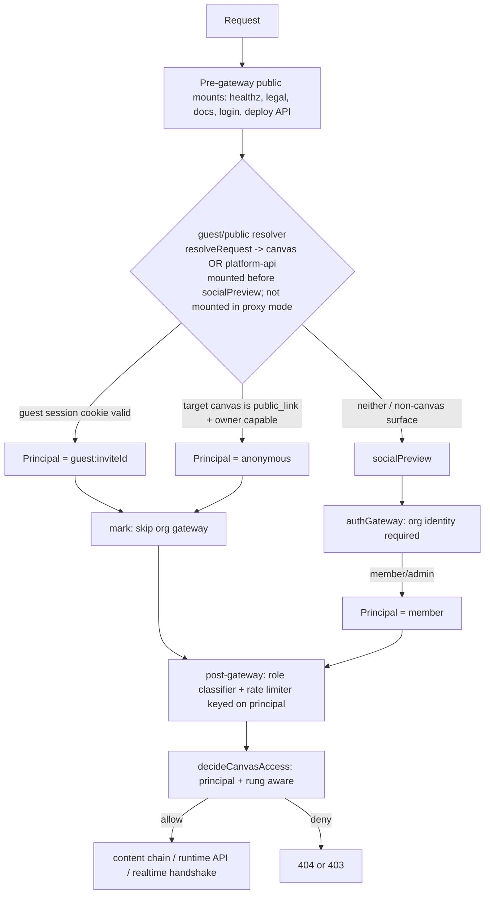
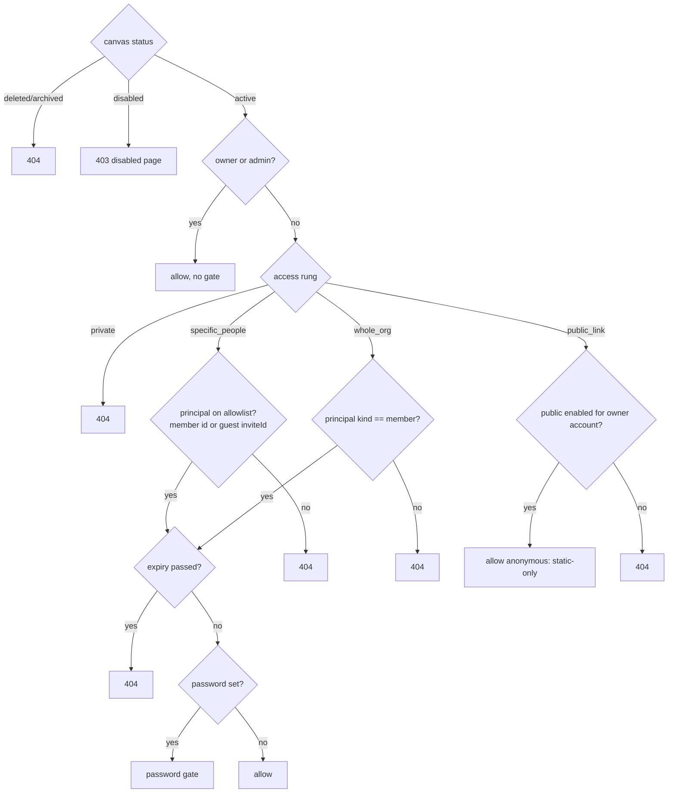

# feat: Canvas sharing — access ladder, guest invites, and public links

## Summary

Replace the binary owner-only / shared toggle with a per-canvas **access ladder** — Private → Specific people → Whole org → Public link — and add the two capabilities it unlocks: sharing a single canvas with a *named outsider* via email invite (a new lightweight **guest identity**), and restricting a canvas to specific named principals. Public links are a guarded edge: static-only and only offered to accounts an admin has blessed. Invited guests get the canvas's KV/files/realtime primitives but not AI unless the owner opts the canvas in with a spend cap. Delivered in one branch, sequenced as three phases (internal allowlist → email-invited guests → admin-gated public).

---

## Problem Frame

The org boundary is canvas-drop's defining trust assumption — every request is authenticated through the configured org-auth mode, and the auth gateway sits at `app.use("*", authGateway(...))` above everything canvas-facing (`apps/server/src/app.ts`). That boundary "deletes whole problem classes — spam, anonymous abuse, bots" (BUILD_BRIEF §4.2), but it is also a wall: there is no path to show a working canvas to a partner, client, or collaborator who has no org account short of giving them an org seat.

The brief anticipated this — §12 lists "Share-to-specific-people allowlist" and "Team/group visibility" as *later*, and D19 lists "external users, public/anonymous sharing" as *out of v1*. The need has now arrived, and the shape that matters is the controlled one: a specific, identifiable, revocable person let into a single canvas. This plan implements the access model defined in the origin requirements doc (see origin: `docs/brainstorms/2026-06-15-canvas-sharing-access-ladder-requirements.md`), which amends BUILD_BRIEF D1/D4/D19 and the §12.0 invariant set.

This is the single most security-sensitive change in the repo to date — it admits non-org principals past the trust boundary for the first time. Read `docs/solutions/2026-06-13-auth-invariant-checklist.md` before implementing, weight findings against the trust model, and run `/ce-code-review` before the PR.

---

## Requirements

Carried from the origin requirements doc; R-IDs preserved.

**Access ladder**
- R1. Each canvas has exactly one access rung: `private`, `specific_people`, `whole_org`, `public_link`; `private` is the default.
- R2. Owner sets the rung; changes take effect on the next request (no cached grants) and drop live realtime sockets the new rung no longer permits.
- R3. Owner/admin always reach their own canvas regardless of rung.
- R4. Password and expiry are modifiers orthogonal to the rung, evaluated after the rung grants access.
- R5. Sharing requires a Published canvas; leaving Published reverts the rung toward Private (existing "shared ⟹ published" invariant).

**Specific-people allowlist**
- R6. The `specific_people` rung carries an allowlist of principals (org member, or invited guest by email).
- R7. Owner adds/removes allowlist entries; removal revokes on the next request and drops live sockets.
- R8. An org member on the allowlist reaches the canvas with their org identity; an external email is handled via the guest-invite flow.
- R9. The allowlist is the single mechanism for both narrowing (org subset) and external sharing — no separate "share with one person" surface.

**Guest identity and email invites**
- R10. Inviting an external email creates a pending guest invite and emails a magic sign-in link.
- R11. A valid magic link establishes a guest session scoped to only the invited canvas(es); a guest is never an org member and cannot enumerate/reach un-invited canvases.
- R12. Guest invites carry an optional per-invite expiry; after expiry the link no longer signs in and existing guest access is no longer honored.
- R13. Owner sees each guest as a named allowlist entry (email + state pending/active/expired) and can revoke individually; revocation invalidates the session next request and drops live sockets.
- R14. `me()` returns the guest's identity (email) for a guest viewer; no identity for an anonymous public visitor.

**Primitives and enforcement**
- R15. For a guest viewer, KV/files/realtime are available and attributed to the guest, counting against canvas/org quotas, as for a shared org viewer.
- R16. AI is unavailable to guests by default; the owner may opt an individual canvas into guest-AI with a per-canvas spend cap; beyond the cap, guest AI calls are refused.
- R17. For any non-owner viewer of a `public_link` canvas — anonymous, *and* an authenticated org member who is not the owner — only static file serving is available. Every primitive is refused, reads included: KV reads and writes, file reads via the runtime API and writes, realtime, and AI are all unavailable (static assets still serve through the content chain). The `public_link` rung is static-only by principal, independent of the per-canvas capability flags.
- R18. Guest- and public-attributable primitive use and access events are recorded in the audit log with the acting principal (guest email, or anonymous-via-public-link).

**Public links (admin-gated)**
- R19. The `public_link` rung is selectable only by an owner whose account holds the admin-granted publish-public capability.
- R20. An admin grants/revokes the capability per account; revoking returns that account's public canvases to a non-public rung on the next request.
- R21. A public canvas may carry an optional password and/or expiry as additional locks.

**Auth-mode behavior**
- R22. Guest and public access function in `oidc`/`dev` modes (app owns the gate). In `proxy` mode they require an operator upstream carve-out; absent that, the rungs are documented non-functional and the UI communicates the constraint rather than silently failing.

**Spec amendments**
- R23. BUILD_BRIEF D1/D4/D19 and the §12.0 invariant set are amended to admit invited-guest and admin-gated public access under these constraints, preserving the hard invariant that a canvas is reachable only by owner/admin, an allowed org member, an invited guest on its allowlist, or — when public and admin-permitted — an anonymous visitor to a static canvas; everything else 404s.

---

## Key Technical Decisions

- KTD1. **Access rung is an explicit enum column, replacing the `shared` boolean.** The build is greenfield with clearable data (no migrations/backfills pre-v1), so `canvases.shared`/`shared_at` are replaced by an `access` enum (`private`|`specific_people`|`whole_org`|`public_link`). `whole_org` is the semantic successor of today's `shared=true`. `sharedExpiresAt`, `passwordHash`, `passwordVersion` remain as orthogonal modifiers (R4). Avoids the ambiguity of layering allowlist/public booleans onto `shared`.
- KTD2. **A guest is a non-org principal, never mapped to an org user.** Org identity flows through `authGateway` → `mapIdentityToUser` (upserts a `users` row). Guests must NOT touch that path — they get a distinct principal with id `guest:<inviteId>` so they never collide with org user ids in `kv.user.*`, audit attribution, or realtime presence. The request context carries a discriminated `Principal` (`{kind: "member", ...}` | `{kind: "guest", ...}` | `{kind: "anonymous"}`).
- KTD3. **The guest/public resolver mounts before `authGateway` AND before `socialPreview`, and derives the role itself.** The pre-gateway band runs before the role classifier (`resolveRequest` is mounted *after* `authGateway` in `app.ts`), so the resolver cannot read `c.get("role")`/`c.get("canvasSlug")` — it calls `resolveRequest(host, path, config)` (pure, no I/O) itself to determine whether the request targets a canvas surface. **Two roles count as canvas surfaces, not one:** `canvas` (static content via `/c/:slug` or `{slug}.{baseHost}`) AND `platform-api` (the `/v1/c/:slug/*` runtime API) — see `resolve-request.ts` `CANVAS_PATH_RE` vs `PLATFORM_API_RE`. The resolver must also mount **before `socialPreview`**: `socialPreview` short-circuits signed-out `text/html` GETs to `/auth/login` in oidc mode, which would otherwise bounce a real anonymous visitor away from a public canvas before the resolver runs (the primary public-link case, in prod's oidc mode). When the resolver sets a guest/anonymous principal it marks the request to bypass the org gateway; otherwise `authGateway` runs unchanged. In `proxy` mode the resolver is **not mounted at all** (conditional in `buildApp` on `config.auth.mode`), not merely inert (KTD7).
- KTD4. **`decideCanvasAccess` stays the single authorization seam, made principal- and rung-aware.** The same pure decision table feeds the content chain (`apps/server/src/canvas/authorization.ts`), the runtime API (`apps/server/src/routes/canvas-api.ts`), and the realtime live re-auth (`apps/server/src/realtime/hub.ts` → `revalidateCanvas`). Changing its signature to `(canvas, principal, now)` and adding `staticOnly` to `AccessDecision` is a breaking change that must update all three callers in the same atomic commit (U3). Default-deny on every unmatched branch (404, no existence confirmation).
- KTD9. **Every server-resolved keying that read `c.get("user").id` must move to the Principal.** Guest/anonymous requests skip `authGateway`, so `c.get("user")` is unset on the canvas/runtime path. Three existing surfaces read it and break or fail-open otherwise: the broad rate limiter (`classifyRequest` returns `null` → *unthrottled* when there is no user — guest and anonymous traffic on the newly-external surface must instead key on the principal id / client IP), the password gate (`pwgate:${user.id}` rate-limit key and the `password_attempt` audit `actorId`), and the realtime hub (`Conn.user` carries only `{id, name, isAdmin}` — it must carry the principal kind + guest inviteId so `revalidateCanvas` reconstructs the correct Principal). The AppEnv context keeps a `user: User` slot for the org dashboard/management routes and adds a distinct `principal` slot for the canvas/runtime path; `/me` and the runtime API branch on principal kind.
- KTD5. **Guest-AI is a separate per-canvas opt-in, distinct from `cap_ai`.** `cap_ai` gates AI for org viewers; new `guest_ai_enabled` + `guest_ai_cap` columns gate AI for guests independently (off by default, R16). Anonymous (`public_link`) viewers are static-only — enforced at the capability guard by principal kind, not by per-canvas flags (R17).
- KTD6. **Email is a driver behind an interface, config-selected.** A `Mailer` interface with three drivers: `mailgun` (HTTP API, the production driver Mark uses), `log` (dev — writes the magic link to the logger so localhost needs no setup), `noop`. Selected via typed config; `config` remains the only `process.env` reader (BUILD_BRIEF §8.1).
- KTD7. **External access is an `oidc`/`dev`-mode capability.** In `proxy` mode the upstream IAP authenticates before the app sees the request, so a guest/anon never reaches the resolver. The guest/public rungs are gated off in `proxy` mode and the UI states why (R22) — no silent failure.
- KTD8. **Magic-link tokens and guest sessions follow existing secret hygiene.** High-entropy tokens, hashed at rest (SHA-256, as for session tokens and API keys — `docs/solutions/...` secrets-at-rest, BUILD_BRIEF §12.6). The guest session uses its own cookie, scoped exactly like the org session cookie (subdomain `.{baseHost}` vs path-host) per `apps/server/src/auth/session.ts`.

---

## High-Level Technical Design

**Request pipeline — where the non-org principal is resolved.** The resolver sits in the pre-gateway band but **ahead of `socialPreview`** (which would otherwise bounce signed-out anonymous visitors to login), and derives the role itself via `resolveRequest` since the role classifier runs after the gateway. It covers **both** the `canvas` role (static content) and the `platform-api` role (`/v1/c/:slug/*` runtime API). Only when it establishes a guest/anonymous principal does the request skip the org gateway. The post-gateway `app.use("*")` band (role classifier, rate limiter) still runs for these requests, so the rate limiter must key on the principal (KTD9).

**Access decision — the single table (KTD4).**

---

## Implementation Units

Grouped into three phases. Build in order; each unit is one atomic commit with its gates green (typecheck, lint, dual-dialect test) before the next.

### Phase A — Access ladder foundation (internal; no trust-boundary change)

### U1. Amend the spec and invariant docs

- **Goal:** Land the BUILD_BRIEF and invariant-checklist amendments (R23) first, so the locked spec and the code never disagree mid-build.
- **Requirements:** R23.
- **Dependencies:** none.
- **Files:** `BUILD_BRIEF.md` (D1, D4, D19, §12.0), `docs/solutions/2026-06-13-auth-invariant-checklist.md` (add the guest/public principal cases).
- **Approach:** Amend D1/D4 to admit invited-guest and admin-gated public access; move the relevant D19 items out of "out of v1"; restate the §12.0 reachability invariant to enumerate the four principal/rung cases (KTD2). Add the new failure modes (guest reaching un-invited canvas, anonymous hitting a primitive, proxy-mode silent failure) to the checklist.
- **Test scenarios:** Test expectation: none — documentation only.
- **Verification:** The amended invariant text matches the access model in U3; a reviewer can map each rung/principal to an invariant clause.

### U2. Schema: access rung + allowlist

- **Goal:** Replace `shared` with the `access` enum and add the allowlist table, in dual-dialect lockstep.
- **Requirements:** R1, R4, R6.
- **Dependencies:** U1.
- **Files:** `packages/shared/src/db/schema.sqlite.ts`, `packages/shared/src/db/schema.pg.ts`, `packages/shared/src/db/schema.test.ts` (parity), `packages/shared/src/db/types.ts`, `apps/server/src/db/repositories/canvases.ts` (+ `.test.ts`). **Every existing `shared`/`shared_at` reader must migrate to `access` in this commit or it won't typecheck** — enumerate and update them all: in `canvases.ts` — `galleryVisibilityFilters` (`eq(t.shared, true)`, line ~200), the server-side list filter (`opts.shared`, ~295), the admin stats `sumCase` (~347) and its projection (~360), `updateSettings` (`set.shared`/`set.sharedAt`, ~384), and `CLEARED_PUBLICATION_FIELDS` (~36, consumed by the archive ~463 and unpublish ~584 reverts); plus the deploy-API unpublish path, `apps/server/src/routes/management.ts` (`publicCanvas` projection + settings), `apps/server/src/routes/gallery.ts`, and the dashboard (`apps/dashboard/src/lib/api.ts` `CanvasView.shared`, `mutations.ts`, `CanvasList.tsx`, `Badge.tsx`, settings/overview routes). `publicationState` is NOT affected (keyed on `currentVersionId`, not `shared`).
- **Approach:** Add `access` text column (enum-typed via shared helper, default `private`); remove `shared`/`shared_at`. Keep `shared_expires_at`, `password_hash`, `password_version`. **Map the old `shared=true` semantics onto the rungs for each consumer:** the gallery-visibility predicate and the list/stats "shared" filters become "`access IN ('whole_org','public_link')`" (a canvas is gallery-eligible when it is org-visible or public — confirm with owner if gallery should include `public_link`; default yes); the share-revert paths (`CLEARED_PUBLICATION_FIELDS`, archive, unpublish) set `access = 'private'`. New `canvas_allowlist` table: `id`, `canvas_id` (FK), `principal_kind` (`member`|`guest`), `user_id` (nullable FK), `email` (nullable), `created_at`, with a unique index on (`canvas_id`, `user_id`) and (`canvas_id`, `email`). Add repository methods: `setAccess`, `listAllowlist`, `addAllowlistEntry` (atomic upsert to avoid the concurrent-invite race), `removeAllowlistEntry`, `isPrincipalAllowed` (the single canonical lookup every call site uses before `decideCanvasAccess`). Greenfield — no migration/backfill (see the greenfield/data-clearable learning in `docs/solutions/`).
- **Patterns to follow:** Dual-dialect column helpers in `packages/shared/src/db/columns.ts`; existing canvas table + repository shape; the schema-parity test.
- **Test scenarios:**
  - Schema parity test passes for both dialects with the new column + table.
  - `setAccess` persists each of the four rung values; default is `private` on create.
  - `addAllowlistEntry`/`removeAllowlistEntry`/`listAllowlist` round-trip for both member and guest kinds; unique index rejects a duplicate member/email per canvas.
  - `isPrincipalAllowed` true for a listed member id, true for a listed guest inviteId, false otherwise.
- **Verification:** Dual-dialect `pnpm test` green; canvases repo tests cover rung + allowlist CRUD.

### U3. Principal- and rung-aware access decision

- **Goal:** Extend `decideCanvasAccess` to the four rungs and the three principal kinds, keeping it the single pure seam (KTD4).
- **Requirements:** R1, R2, R3, R4, R6, R8, R17 (static-only flag surfaced for the serve layer).
- **Dependencies:** U2.
- **Files:** `apps/server/src/canvas/authorization.ts` (+ `.test.ts`), `apps/server/src/http/types.ts` (add a discriminated `Principal` slot to AppEnv, distinct from the org-only `user: User` slot — see KTD9), and the two other `decideCanvasAccess` callers that the signature change breaks: `apps/server/src/routes/canvas-api.ts` (line ~70) and `apps/server/src/realtime/hub.ts` (`revalidateCanvas`, line ~282). All three move to the new signature in this one commit so the build stays green.
- **Approach:** Introduce a discriminated `Principal` (`member`/`guest`/`anonymous`, KTD2). Change `decideCanvasAccess(canvas, principal, now)` to branch on rung after the existing status/owner checks: `private` → owner/admin only; `specific_people` → allow if the principal is on the allowlist (member id or guest inviteId — passed in as a resolved boolean from the canonical `isPrincipalAllowed` repo lookup, so the table stays I/O-free and exhaustively unit-testable); `whole_org` → allow if principal kind is `member`; `public_link` → allow with `staticOnly: true` for **any non-owner** (anonymous OR member — R17). Preserve order (deleted/archived/disabled/owner first). Every unmatched branch denies 404. Note for callers: AppEnv keeps `user: User` for dashboard/management; the canvas/runtime path reads `principal` — `/me`, `/v1/c/:slug/me`, and realtime must branch on kind, never assume an org user row exists.
- **Technical design (directional):** `AccessDecision` gains `{ action: "allow"; needsPasswordGate: boolean; staticOnly: boolean }`. The allowlist membership is passed in as a resolved boolean (caller does the lookup) so the table stays I/O-free and exhaustively unit-testable.
- **Patterns to follow:** The existing pure-table style and exhaustive branch tests in `authorization.test.ts`; default-deny posture (§12.1.4 existence non-confirmation).
- **Test scenarios:**
  - Covers AE1. `specific_people`: a guest principal not on the allowlist → 404; the same guest on the allowlist → allow.
  - `whole_org`: member → allow; guest → 404; anonymous → 404.
  - `private`: non-owner member → 404; owner → allow.
  - `public_link`: anonymous → allow with `staticOnly: true`; member non-owner → allow (static-only too).
  - Owner/admin bypass the rung at every rung; disabled fires before owner; expiry passed → 404; password set → `needsPasswordGate` true for non-owner.
  - Order invariants unchanged (deleted/archived/disabled precede owner).
- **Verification:** All `decideCanvasAccess` branches covered for the new rung×principal matrix; dual-dialect test green.

### U4. Settings + dashboard for the internal ladder

- **Goal:** Let owners set the rung and manage the org-member allowlist from the dashboard, with revoke dropping sockets.
- **Requirements:** R2, R5, R6, R7, R8, R9.
- **Dependencies:** U2, U3.
- **Files:** `apps/server/src/routes/management.ts` (+ `.test.ts`), `apps/dashboard/src/lib/api.ts`, canvas settings UI under `apps/dashboard/src/` (settings/access section).
- **Approach:** Replace the `shared` toggle in `PATCH /:id/settings` with an `access` field; add allowlist endpoints (list/add/remove members) under the canvas. Enforce `access != private ⟹ published` (R5, extends the current "shared ⟹ published" guard). On any rung change or allowlist removal, re-authorize live sockets via the existing `hub.revalidateCanvas(canvasId)` (it re-runs `decideCanvasAccess` per socket and drops those no longer permitted — there is no `dropAffectedNonOwners` method; `dropGatedNonOwners` remains for the password-set case). Once U3's table is principal-aware, `revalidateCanvas` handles rung/allowlist changes automatically — but only after U9 threads the principal onto `Conn` (see U9). Update the owner settings projection (`publicCanvas`) to expose `access` + allowlist; keep `password_hash`/`api_key_hash` out of every projection.
- **UX states (so the implementer doesn't invent them):** The rung control is a **radio-card group** (one card per rung, each with a one-sentence trust description), not a bare `<select>` — a security-sensitive choice needs the per-rung explanation. When a rung change would drop active guests (current rung `specific_people` with active guests, or leaving any shared rung), show a **confirmation dialog** ("N active viewer(s)/guest(s) will lose access immediately") matching the existing slug-regen/delete confirm pattern; member-only socket drops keep the optimistic toggle. The allowlist **empty state** prompts how to add (org member by name, or external collaborator by email).
- **Patterns to follow:** Existing `PATCH /:id/settings` validation, `ownedCanvas` ownership guard, `hub.revalidateCanvas`/`dropGatedNonOwners`, `sameOrigin` CSRF guard, the explicit-projection rule in `management.ts`, the existing dashboard `ConfirmDialog`/`EmptyState`/`InlineNotice` components.
- **Test scenarios:**
  - Setting `access` to each rung persists; setting any non-private rung on an unpublished canvas is rejected.
  - Add/remove an org member to the allowlist; non-owner cannot modify (404 via `ownedCanvas`).
  - Covers R2. Removing a member from a `specific_people` allowlist drops that member's live sockets on the next re-auth (the guest-specific case is AE4, covered by U8/U9).
  - Leaving Published reverts the rung toward private (existing revert path extended).
  - Settings projection never includes `password_hash` or `api_key_hash`.
- **Verification:** Management tests green; dashboard renders the rung control + member allowlist; revoke drops sockets in the realtime test.

### Phase B — Email-invited guests (the trust-boundary change)

### U5. Mailer interface + Mailgun/dev/noop drivers

- **Goal:** Add config-selected email sending behind an interface, with a Mailgun production driver and a dev driver that logs the link (KTD6).
- **Requirements:** R10 (transport dependency).
- **Dependencies:** none (parallelizable with Phase A, but lands here).
- **Files:** new `apps/server/src/email/` (`mailer.ts` interface, `mailgun.ts`, `log.ts`, `noop.ts`, `factory.ts` + tests), `packages/shared/src/config/` (typed email config), `.env.example`, `apps/server/src/admin/config-fields.ts` (surface email config source labels).
- **Approach:** `Mailer.send({ to, subject, text, html })`. `mailgun` posts to the Mailgun HTTP API with the API key + domain from typed config. `log` writes the rendered message (including the magic link) to the logger for localhost. `noop` discards. Factory selects by `config.email.driver`; `config` stays the only `process.env` reader. In `dev` mode default to `log`; in production require explicit configuration (a non-dev deployment with no transport surfaces a clear startup/admin signal rather than silently dropping invites).
- **Key hygiene:** The Mailgun API key is **env-var only** (not DB-overridable like the AI key) to minimize exposure — magic-link emails are auth credentials, so a leaked sending key is a phishing vector. `config-fields.ts` surfaces the *source label* only, never the key value; the Mailgun driver must not log the key at any level. Rotation invalidates no sessions (only future sends). Also define the **magic-link email template** (subject, body, sender name) here — it's the guest's first impression of the product.
- **Patterns to follow:** The driver-behind-interface pattern used for DB/storage/auth (`apps/server/src/auth/factory.ts`, `apps/server/src/storage/driver.ts`); typed config in `packages/shared/src/config`; the AI-key source-label handling in `config-fields.ts`.
- **Test scenarios:**
  - Factory returns the configured driver; defaults to `log` in dev.
  - Mailgun driver builds the correct request and surfaces a send failure (no throw that crashes the invite flow — error is returned/logged).
  - `log` driver emits the magic link to the logger; `noop` discards.
  - Config validation rejects a `mailgun` driver missing API key/domain.
- **Verification:** Email unit tests green; `pnpm dev` logs a usable magic link with no external config.

### U6. Guest identity, sessions, and magic-link tokens

- **Goal:** Persist guest invites and sessions, mint/verify magic-link tokens, and resolve a guest principal from a guest cookie (KTD2, KTD8).
- **Requirements:** R10, R11, R12, R14.
- **Dependencies:** U2.
- **Files:** schema (`schema.sqlite.ts`/`schema.pg.ts`/`schema.test.ts`): `guest_invites` (`id`, `canvas_id`, `email`, `token_hash`, `expires_at`, `state`, `created_at`, `consumed_at`) and `guest_sessions` (`id`, `invite_id`, `canvas_id`, `token_hash`, `expires_at`, `created_at`); new `apps/server/src/auth/guest.ts` (+ tests); `apps/server/src/db/repositories/guest.ts` (+ tests).
- **Approach:** `createInvite(canvasId, email, expiresAt)` mints a high-entropy token, stores its SHA-256 hash, returns the plaintext for the link. `consumeMagicLink(token)` verifies the hash, checks expiry/state (single-use: a second consume after `consumed_at` fails), issues a guest session (own cookie, scoped like the org session cookie — `SameSite=Lax` so the email link works as a top-level navigation), returns a guest principal `{ kind: "guest", inviteId, canvasId, email }`. `resolveGuest(c)` reads the guest cookie → live session → guest principal, or null. **The guest session expiry is bounded by the invite:** `resolveGuest` cross-checks the invite's `expires_at` and `state` on every resolution (per-request, no cached grants), so a session can never outlive a revoked or expired invite (R12). A guest principal grants access to exactly the invited canvas (R11) — note that in subdomain mode the cookie is scoped to `.{baseHost}` and thus sent on sibling canvas subdomains, so cross-canvas denial relies entirely on U3's table matching the principal's `canvasId` to the requested slug (covered by an integration test in U7).
- **`me()` shape:** define a deterministic response for each principal kind — guest returns `{ kind: "guest", email }`; anonymous returns `{ kind: "anonymous" }` (not `null`/`{}`), so canvas authors can branch reliably.
- **Lifecycle on unpublish:** the publish-state revert (U2's `CLEARED_PUBLICATION_FIELDS` / archive / unpublish) does not know about guest tables — specify here that unpublish/archive must invalidate that canvas's pending invites + live guest sessions and drop their sockets, and that re-publish does NOT resurrect pre-unpublish guest grants.
- **Patterns to follow:** `apps/server/src/auth/session.ts` (cookie scoping, rolling expiry, `generateSessionToken`), secrets-at-rest hashing (SHA-256, BUILD_BRIEF §12.6), `sessions` repository shape.
- **Test scenarios:**
  - Covers AE1. A guest principal carries only its invited `canvasId`; resolving it for another canvas yields no access (enforced in U3's table via the allowlist/canvas match).
  - Magic link consumes once; a second consume after `consumed_at`/expiry fails.
  - Expired invite (R12) → no session issued; expired guest session → `resolveGuest` returns null.
  - Token is stored hashed, never in plaintext; cookie scoping matches subdomain vs path mode.
  - Revoking the invite (state) invalidates `resolveGuest` on the next call.
- **Verification:** Dual-dialect schema parity green; guest auth + repository tests green.

### U7. Pre-gateway guest/public resolver (the carve-out)

- **Goal:** Let a guest or anonymous request survive to the access decision without weakening the org gateway (KTD3). Highest-risk unit.
- **Requirements:** R11, R17, R22.
- **Dependencies:** U3, U6.
- **Files:** new `apps/server/src/auth/guest-public-resolver.ts` (+ tests), `apps/server/src/app.ts` (mount before `authGateway`; make the org gateway conditional on no non-org principal), `apps/server/src/auth/gateway.test.ts` / new integration test.
- **Approach:** A middleware mounted in the pre-gateway band, **before `socialPreview` and before `authGateway`** (KTD3). It calls `resolveRequest(host, path, config)` itself (the role classifier runs later, after the gateway, so its context values aren't set yet) and acts only when the role is `canvas` (static content) OR `platform-api` (`/v1/c/:slug/*` runtime API) — both are canvas surfaces. It then (a) resolves a guest session → guest principal, or (b) looks up the slug's canvas and, if its rung is `public_link` and the owner account is publish-capable, sets an anonymous principal. When it sets a non-org principal it marks the request to skip the org gateway (so `socialPreview` won't bounce an anonymous public visitor to login); otherwise the chain falls through to `socialPreview` then `authGateway` unchanged, which sets a `member` principal. In `proxy` mode the resolver is **not mounted at all** (conditional in `buildApp` on `config.auth.mode`), not merely inert. Default-deny: the resolver only *sets a principal*, never grants — authorization stays U3's table. The post-gateway `app.use("*")` role classifier and rate limiter still run for these requests; the rate limiter must key on the principal (KTD9), not return `null`.
- **Execution note:** Start with failing integration tests for the spoofing/bypass paths before wiring the middleware — these are the §12.0 invariant tests. Required bypass vectors as explicit test cases: (1) forged/invalid guest cookie; (2) valid guest cookie for canvas X requesting canvas Y (incl. the subdomain-mode `.{baseHost}` cookie case); (3) anonymous request to a `private`/`whole_org`/`specific_people` canvas; (4) `public_link` request whose owner lacks the capability; (5) a dashboard/management request carrying a guest cookie still hits the org gateway unchanged; (6) signed-out `text/html` GET to a `public_link` canvas in oidc mode serves static content, not the login bounce.
- **Technical design (directional):** The org gateway becomes `onlyWhenNoPrincipal(authGateway(...))` — a thin wrapper that calls `next()` when the resolver already set a guest/anonymous principal, else runs the existing gateway verbatim. Unit-test the wrapper's conditional in isolation (a wrong context-slot check would bypass the gateway for non-canvas routes).
- **Patterns to follow:** Pre-gateway mounting of the deploy API and `socialPreview` in `apps/server/src/app.ts`; `resolveRequest` (`PLATFORM_API_RE` vs `CANVAS_PATH_RE`); the `onlyCanvas` middleware wrapper.
- **Test scenarios:**
  - Covers AE1. Anonymous request to a `private`/`whole_org`/`specific_people` canvas → 404 (never reaches content); the org gateway is not bypassed for it.
  - A forged/invalid guest cookie → resolves to no principal → org gateway runs → 401/redirect; never grants guest access.
  - Valid guest cookie for canvas X → guest principal set, org gateway skipped, U3 allows X and 404s Y.
  - `public_link` canvas with a publish-capable owner → anonymous principal set, static-only allowed; same canvas after capability revoked → anonymous 404.
  - Covers AE6. In `proxy` mode the resolver is not mounted (verify a forged guest cookie on a canvas request still reaches the org gateway) and external principals never form.
  - Dashboard and management API still require an org session (gateway unaffected for non-canvas roles).
- **Verification:** Spoofing/bypass integration tests green; org-auth behavior for dashboard/management unchanged; `/ce-code-review` clean on this unit.

### U8. Invite flow + auth-mode guard

- **Goal:** Wire the owner-facing invite/revoke flow and gate the guest rung to app-gated auth modes (R22).
- **Requirements:** R7, R10, R12, R13, R22.
- **Dependencies:** U4, U5, U6, U7.
- **Files:** `apps/server/src/routes/management.ts` (+ `.test.ts`), `apps/server/src/auth/routes.ts` (magic-link consume endpoint, e.g. `/auth/guest/:token`), `apps/dashboard/src/` (allowlist UI: invite-by-email, guest state, revoke), `apps/dashboard/src/lib/api.ts`.
- **Approach:** Add management endpoints to invite an email (creates the invite via U6, sends via U5, adds a `guest` allowlist entry), list guest entries with state, revoke (removes entry + invalidates invite/session + drops sockets via `revalidateCanvas`), and **resend** (re-mint token, reset expiry, set state back to `pending`, re-send — for lost/expired/mistyped invites). Mount the magic-link consume route as its **own pre-gateway router** in `app.ts` next to `authRoutes` (independent of U7's `/v1/c` resolver scope), reachable without an org session. **Consume endpoint security:** it must not be CSRF-consumable over a cross-origin GET (prefetch/`` would burn the single-use token), so it's a GET landing page that does NOT consume + a same-origin POST that consumes and issues the session — and it returns no permissive CORS header. **Rate-limit both new external surfaces** (reuse `rlStore`/`takeToken`): the consume endpoint by client IP (token-enumeration defense), and invite issuance by owner id and by destination email (email-relay/spam defense). Surface the auth-mode constraint server-side too: the invite API rejects guest-invite calls in `proxy` mode with a clear reason, and (per KTD7) the resolver isn't even mounted there.
- **UX states:** the expired/consumed/revoked magic-link path renders a **product-branded landing page** (not a raw JSON error), distinguishing expired vs. already-used vs. revoked and prompting "ask the owner for a new invite" — matching the password-gate/disabled-canvas page style, not the org login flow. Proxy-mode: render the `specific_people`/`public_link` rungs as **disabled (not hidden)** with an operator-actionable note ("Guest invites and public links require your proxy to allow unauthenticated requests to canvas URLs — see deployment docs"). A mistyped-invite is recoverable because the invited email shows immediately as a revocable/resendable allowlist entry (R13).
- **Patterns to follow:** `management.ts` settings handlers + `sameOrigin`; the login-throttle pattern in `app.ts` (`takeToken`); the existing `authMode` exposure in `apps/server/src/routes/me.ts`; pre-gateway public route mounting (`authRoutes`).
- **Test scenarios:**
  - Inviting an email creates a pending invite, sends one email, and adds a guest allowlist entry.
  - Covers AE4. Revoking a guest entry invalidates the session and drops the guest's live sockets; next request 404s.
  - Consuming a valid magic link (same-origin POST) establishes a guest session and redirects into the canvas; an expired/consumed/revoked link renders the branded landing page, not a raw error.
  - A cross-origin GET to the consume endpoint does NOT consume the token (CSRF-safe); no permissive CORS header is returned.
  - The consume endpoint is throttled by IP; invite issuance is throttled by owner id and by destination email.
  - Resend re-mints the token, resets expiry, and returns state to `pending`; the old token no longer consumes.
  - Covers AE6. In `proxy` mode, the invite API returns the unavailability reason; in `oidc`/`dev` it succeeds.
  - Non-owner cannot invite/revoke on someone else's canvas (404).
- **Verification:** Management + auth-route tests green; dashboard shows guest state and disables controls in proxy mode.

### U9. Guest primitives enforcement

- **Goal:** Make the runtime API, capability guard, identity, KV scoping, and realtime principal-aware — guests get KV/files/realtime, AI is opt-in-with-cap, attribution is correct (R15, R16, R18).
- **Requirements:** R14, R15, R16, R18.
- **Dependencies:** U7 (+ U3).
- **Files:** schema: add `guest_ai_enabled` + `guest_ai_cap` columns to `canvases` in `packages/shared/src/db/schema.sqlite.ts`, `schema.pg.ts`, **and `schema.test.ts` (parity)**; `apps/server/src/routes/canvas-api.ts`, `apps/server/src/canvas/capability-guard.ts`, `apps/server/src/routes/canvas-kv.ts`, `apps/server/src/routes/canvas-ai.ts`, `apps/server/src/routes/canvas-realtime.ts`, `apps/server/src/routes/me.ts`, `apps/server/src/realtime/hub.ts` (thread the principal onto `Conn`/`ConnUser`), `packages/shared/src/capabilities/index.ts` (+ their tests); management capabilities endpoint for the guest-AI opt-in/cap; possibly `packages/sdk/` if an `access-revoked` event is added (see UX).
- **Approach:** Replace `c.get("user")` reads in the runtime API with the `Principal`. KV/files/realtime accept `member` and `guest` principals; `me()` returns `{kind:"guest",email}` for guests and `{kind:"anonymous"}` for anonymous (R14, U6 shape). `kv.user.*` scopes to the principal id (`guest:<inviteId>` for guests, KTD2 — verify the scope column has no length/charset constraint that rejects the prefix). The capability guard refuses **every** primitive (KV reads included) for `anonymous` (static-only, R17); refuses AI for `guest` unless `guest_ai_enabled` (R16, KTD5). **`Conn` must carry the principal kind + guest inviteId** so `revalidateCanvas` reconstructs the correct Principal — without this, guest sockets re-authorize on the member branch and revoke-on-drop (R13/AE4) silently fails. Note multi-tab guests share one `guest:<inviteId>`, so presence dedup and the per-user realtime rate window are per-guest, not per-tab — state this as accepted behavior. Audit events attribute the guest email or `anonymous-via-public-link` (R18).
- **Guest-AI cap semantics (KTD5/F1):** the existing AI route is a pre-call windowed-spend check then record-after-stream, so the cap is a **best-effort soft ceiling** — concurrent guest calls can each pass the pre-call check before any records cost, overshooting by up to one in-flight call per concurrent request. State this explicitly (mirrors the org-quota posture); AE2 is worded as soft-cap, not a hard per-call gate. If a hard cap is wanted later, it requires an atomic reserve-then-settle counter (deferred).
- **Guest revocation UX:** when the server drops a revoked guest's socket, define what the guest sees — recommended: the SDK surfaces a named `access-revoked` event canvas authors can handle, and the next runtime API call returns 404 which the canvas runtime routes to the expired-link landing (U8). Decided here because it determines whether the SDK is in scope.
- **Patterns to follow:** `requireCapability`/`capability-guard.ts`, `effectiveCapabilities` in `packages/shared/src/capabilities`, the realtime handshake comment in `canvas-realtime.ts` (auth enforced before upgrade), `hub.ts` `getCanvas`/`isUserActive` re-auth hooks, AI usage metering in `canvas-ai.ts`.
- **Test scenarios:**
  - Covers AE2. AI for a guest is refused when `guest_ai_enabled` is false; succeeds under the cap when opted in; refused once windowed spend exceeds the cap. (Soft-cap: a concurrent-request test may briefly overshoot by one in-flight call per request — assert best-effort, not hard gate.)
  - Covers AE3. Anonymous (`public_link`) viewer: KV reads AND writes, file reads/writes, realtime upgrade, and AI are each refused; static serving works (serve layer, U11).
  - A guest can read/write KV and files and connect to realtime; `kv.user.*` is scoped to the guest principal id (`guest:<inviteId>`) and never collides with an org user's namespace.
  - `me()` returns `{kind:"guest",email}` for a guest and `{kind:"anonymous"}` for anonymous.
  - Audit rows attribute the guest email / `anonymous-via-public-link` for primitive use (R18).
  - Realtime: `revalidateCanvas` reconstructs the guest principal (not the member branch) and uses the allowlist; revoking a guest mid-session drops its socket; a guest with two tabs has both dropped on revoke.
- **Verification:** Capability + primitive + realtime tests green for member/guest/anonymous; dual-dialect green.

### Phase C — Public links (admin-gated)

### U10. Per-account publish-public capability

- **Goal:** Gate the `public_link` rung behind an admin-granted per-account capability (R19, R20).
- **Requirements:** R19, R20.
- **Dependencies:** U3.
- **Files:** schema: add `can_publish_public` to `users` in `schema.sqlite.ts`, `schema.pg.ts`, and `schema.test.ts` (parity); `apps/server/src/routes/admin.ts` (+ `.test.ts`), `apps/server/src/admin/...` as needed, `apps/dashboard/src/routes/admin.users.tsx` (grant/revoke action), owner settings (rung disabled when uncapable).
- **Approach:** Add `users.can_publish_public` (default false), server-resolved, never client-asserted. Admin endpoints grant/revoke per account. **Correctness is lazy, not the sweep:** the `public_link` branch in `decideCanvasAccess` checks the owner's `can_publish_public` per request (consistent with the no-cached-grants invariant), so a revoked account's canvases stop serving on the very next request regardless of sweep timing. The optional sweep (`UPDATE canvases SET access='private' WHERE owner_id=? AND access='public_link'`) is eventual cleanup/tidiness, run in the revoke transaction — not the security mechanism. In-flight anonymous static GETs already past authorization complete (bounded by request duration; acceptable for static serves). Owner settings projection exposes rung availability; the settings API rejects setting `public_link` for an uncapable owner.
- **UX states:** the grant/revoke action is a **row-level action in the existing `AdminUserTable`** (alongside block/promote), labeled "Grant/Revoke public publishing", with a confirm on revoke (it reverts the account's public canvases). In owner settings the `public_link` rung is disabled-not-hidden when the account lacks the capability, with a note that an admin can grant it.
- **Patterns to follow:** `requireAdmin` (`apps/server/src/admin/authz.ts`, server-resolved, 404 to non-admin), admin routes + settings service, server-resolved capability (never client-asserted, §12.0 #1).
- **Test scenarios:**
  - Covers AE5. An uncapable owner cannot select `public_link` (API rejects; UI hides it); after an admin grants the capability it succeeds; after revoke the canvas reverts off public on the next request.
  - Non-admin cannot grant/revoke the capability (404).
  - `can_publish_public` is server-resolved and never read from a client field.
- **Verification:** Admin + management tests green; schema parity green.

### U11. Public static-only serving

- **Goal:** Serve `public_link` canvases as static-only to anonymous visitors with optional password/expiry, and confirm primitives stay closed (R17, R21).
- **Requirements:** R17, R18, R21.
- **Dependencies:** U3, U7, U9, U10.
- **Files:** `apps/server/src/canvas/serve.ts`, `apps/server/src/canvas/password-gate.ts`, `apps/server/src/http/social-preview.ts` (public canvases can legitimately unfurl), tests alongside.
- **Approach:** The content chain already runs `canvasAccess → passwordGate → serveCanvas`; with U3 allowing anonymous at `public_link` (with `staticOnly`), serving works. **`passwordGate` must stop assuming an org user:** it currently keys its rate-limit bucket as `pwgate:${c.get("user").id}:${canvas.id}` and sets the `password_attempt` audit `actorId` to `c.get("user").id` — both throw or mis-bucket for an anonymous visitor (KTD9/D1). Key the anonymous bucket by `clientIp` (`pwgate:anon:${clientIp}:${canvas.id}`) and record the audit `actorId` as `anonymous-via-public-link` (R18). Honor the password modifier (R21) and existing expiry. Cross-check no primitive path is reachable for anonymous (U9's guard). 
- **OG/social-preview:** confirm a genuinely `public_link` canvas unfurls its real card while a non-public canvas still returns only the generic signed-out card (the existing oidc behavior from commit `eb982e0`).
- **Patterns to follow:** `serveCanvas`, `passwordGate`/`GATE_COOKIE` (note the `clientIp` already on the context from the IP middleware), the audit/usage event recording in `serve.ts`.
- **Test scenarios:**
  - Covers AE3. Anonymous GET of a public canvas's static files succeeds; the runtime API/primitives 404/refuse.
  - A public canvas with a password shows the gate to anonymous; correct password serves; wrong password refused; the gate throttles by IP and does NOT crash with no org user in context.
  - Anonymous password attempt is audited with `actorId = anonymous-via-public-link` (R18).
  - An expired public share → 404.
  - OG: an unauthenticated unfurl of a `public_link` canvas returns its real card; a non-public canvas returns only the generic signed-out card.
- **Verification:** Serve + password-gate tests green; end-to-end public-link flow works in `oidc`/`dev`.

---

## Acceptance Examples

Carried from origin; each is linked from the test scenarios above.

- AE1. A guest invited only to canvas X requesting canvas Y → 404 (incl. the subdomain-mode shared-cookie case) (U3, U6, U7).
- AE2. Guest AI refused unless opted in; succeeds under the soft cap; refused once windowed spend exceeds it (U9; cap is best-effort, not a hard per-call gate — see U9 semantics).
- AE3. Public/anonymous viewer: every primitive refused incl. KV reads, static serves (U9, U11).
- AE4. Revoking a guest mid-session drops the socket and 404s next request (U8, U9; U4 covers the member socket-drop case under R2).
- AE5. Public rung gated by the admin-granted per-account capability (U10).
- AE6. In `proxy` mode the UI communicates external access is unavailable rather than appearing to work (U7, U8).

---

## Scope Boundaries

### Deferred for later
- Team/group visibility (BUILD_BRIEF §12 #13) — the ladder is per-principal; group-as-principal can layer on later without reshaping the allowlist.
- Guest-AI as default-on or fine-grained per-guest AI budgets — v1 is per-canvas opt-in with a single cap.
- Org-wide directory/search of shared canvases — unchanged; the opt-in gallery remains the only listing surface.

### Outside this product's identity
- Standing external accounts, guest self-signup, or any guest capability beyond the per-canvas invite.
- Per-method/per-primitive ACLs for guests within a canvas — access stays trust-first within a canvas; misuse handled by audit + revocation.
- Primitives (including AI) for anonymous public visitors — public is static-only by design.

### Deferred to Follow-Up Work
- A hosted operator proxy-mode carve-out recipe (documenting how to expose guest/public paths through an IAP) — documentation-only follow-up; not required for `oidc`/`dev`.

---

## Dependencies / Assumptions

- Email transport: Mailgun in production (KTD6); `dev` mode logs the magic link so localhost needs no setup. A non-dev deployment with no transport configured cannot complete invites — surfaced as a clear admin/startup signal, not a silent drop.
- Mark's production runs `oidc` (subdomain, sqlite), so external access functions there without a proxy carve-out; the `proxy`-mode constraint (R22) is OSS-completeness, not a prod blocker.
- Greenfield with clearable data (`docs/solutions/2026-06-15` greenfield note) — `shared` is replaced by `access` with no migration/backfill.
- Existing per-request access decision, password gate (argon2id), share-expiry, and hub socket-drop hooks are extended, not replaced.
- Dual-dialect (sqlite/pglite + real Postgres in CI) parity holds for every new table/column.

---

## Risk Analysis & Mitigation

- **Trust-boundary regression (P0).** A wrong carve-out (U7) could expose org content to anonymous/guest requests. Mitigation: the resolver only *sets a principal*, never grants; `decideCanvasAccess` remains the sole authorization seam (default-deny); the `onlyWhenNoPrincipal` wrapper is unit-tested in isolation; the six bypass vectors are written as failing tests first (U7 execution note); `/ce-code-review` before PR weighting §12.0 findings as P0.
- **Rate-limiter fails open for outsiders (P1).** `classifyRequest` returns `null` (unthrottled) with no org user, so guest/anonymous traffic on the newly-external surface would bypass the limiter entirely. Mitigation: key the limiter on the principal (KTD9, U7/U9 tests).
- **`socialPreview` shadows public links (P1).** In oidc mode it would redirect anonymous public visitors to login before the resolver runs. Mitigation: resolver mounts ahead of `socialPreview` and marks gateway-skip (KTD3, U7 test #6).
- **`shared`→`access` silent breakage (P1).** Removing the column can leave the gallery predicate / unpublish revert reading a dead column. Mitigation: U2 enumerates every consumer and maps `shared` onto the rungs in one atomic, typecheck-green commit.
- **Realtime revoke silently no-ops (P1).** If `Conn` doesn't carry the principal, `revalidateCanvas` re-auths guests on the member branch and never drops them. Mitigation: thread the principal onto `Conn` (U9).
- **Guest id namespace collision.** Mitigation: `guest:<inviteId>` prefix (KTD2), tested in U9.
- **AI spend abuse via guests.** Mitigation: guest-AI off by default + per-canvas soft cap; cap semantics documented as best-effort (KTD5, F1, AE2).
- **Proxy-mode confusion.** Mitigation: resolver **not mounted** in `proxy` mode + UI/API guard (KTD7, R22, AE6).
- **Magic-link token leakage/replay/CSRF.** Mitigation: hashed at rest, expiry + single-use, invite-bounded session, GET-landing + same-origin-POST consume, IP throttle, own scoped cookie (KTD8, U6/U8 tests).

---

## Sources & Research

- Origin: `docs/brainstorms/2026-06-15-canvas-sharing-access-ladder-requirements.md` (full access model, decisions, AEs, scope split).
- `apps/server/src/app.ts` — pre-gateway band (deploy API, `socialPreview`), global `authGateway`, canvas content chain, `/v1/c/:slug` runtime API mount.
- `apps/server/src/auth/` — `gateway.ts`, `strategy.ts`, `session.ts`, `factory.ts`, `oidc.ts` (the org identity path the guest path must not touch).
- `apps/server/src/canvas/authorization.ts` — `decideCanvasAccess` pure table (KTD4 extension point).
- `apps/server/src/routes/canvas-api.ts`, `apps/server/src/canvas/capability-guard.ts`, `packages/shared/src/capabilities/index.ts` — capability model (guest/anonymous gating, guest-AI).
- `apps/server/src/routes/canvas-realtime.ts`, `apps/server/src/realtime/hub.ts` — handshake auth (inherits the access decision) + live re-auth/socket-drop hooks.
- `apps/server/src/routes/management.ts`, `apps/server/src/routes/me.ts` — settings handlers, owner projection rules, `authMode` exposure.
- `packages/shared/src/db/` — dual-dialect column helpers (`columns.ts`), `schema.*.ts`, schema-parity test.
- `docs/solutions/2026-06-13-auth-invariant-checklist.md` — required pre-read; §12 failure modes. `docs/solutions/2026-06-13-canvas-capability-model.md`, `…-ai-realtime-primitives.md`, `…-dual-dialect-drizzle-seam.md`.
