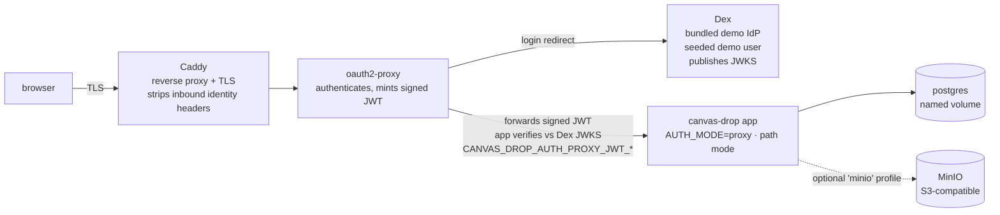
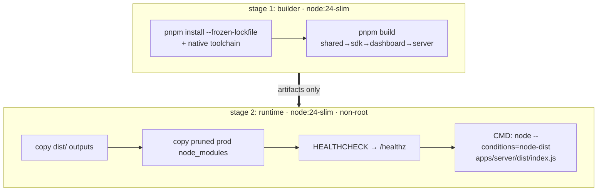
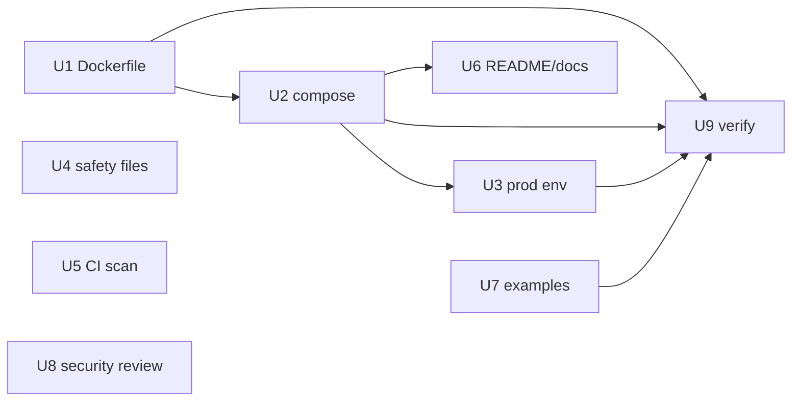

# feat: OSS launch readiness — Docker packaging, safety files, CI scanning, security review

The OSS-packaging + safety slice of milestone **M10** (BUILD_BRIEF §16, §8.3): make canvas-drop a
**quiet credible drop** — a public MIT repo that looks professional, self-hosts cleanly via Docker,
stays free of secrets/known-vulns by CI, and has had its five security invariants reviewed before the
auth-critical code goes public. The load test and backup/restore drill are deliberately deferred.

**Origin:** `docs/brainstorms/2026-06-16-oss-launch-readiness-requirements.md` (R1–R8, success criteria,
scope boundaries carried forward below).

---

## Problem Frame

canvas-drop is v1 feature-complete and merged. M10 is the one open milestone. To publish:

- There is **no Docker packaging** — `docs/site/self-hosting/deploy.md` explicitly documents the
  multi-stage image and compose stack as "a documented target, not shipped." Self-hosting today means
  running the bare Node process under a process manager.
- The repo is **missing the safety/professional-signal files** a public project is expected to carry:
  `SECURITY.md` (vuln disclosure), `CODE_OF_CONDUCT.md`, a third-party license `NOTICE`.
- CI has **no secret-scanning gate**, and its `dependency-audit` job is **advisory only**
  (`pnpm audit … || true`).
- The auth-critical code (the §12 invariants) is about to become public and has not had a focused
  pre-publication security review.

What is already good and must **not** be rebuilt: `LICENSE` (MIT), `CONTRIBUTING.md`, issue/PR
templates, the dual-dialect CI matrix, a strong `README.md`, real self-hosting docs, a pedagogical
(dev-default) `.env.example`, and a **verified-clean git history** (169 commits, no secret blob ever
committed).

---

## Scope

**In scope:** R1 Docker packaging · R2 pedagogical production config · R3 safety/legal files ·
R4 CI secret-scan (+ dep-audit posture) · R5 README + docs + org-agnostic sweep · R6 five-invariant
security review · R7 two starter examples · R8 end-to-end compose verification.

### Deferred for later (carried from origin)
- Single-VPS load test (150 users / 50 req/s + realtime broadcast).
- Backup/restore drill (scripts/docs exist; proving round-trip is the follow-up).
- Publishing a prebuilt image to GHCR (release machinery; leans "promoted").
- Promotion machinery: public demo push, Show-HN, deep contributor onboarding.
- Third-party penetration test (§16 calls for a focused internal review).

### Deferred to Follow-Up Work (plan-local sequencing)
- A `Makefile` / task-runner wrapper over the compose commands — nice ergonomics, not launch-blocking.
- CI job that builds the Docker image on PRs — valuable, but adds matrix time; the U9 manual
  verification gate covers launch confidence. Revisit alongside GHCR publishing.

---

## Key Technical Decisions

### KTD1 — Runtime base: `node:24-slim`, non-root (not distroless)
Builder and runtime both derive from a Debian-`slim` Node 24 base so the compiled native modules
(`better-sqlite3`, `@node-rs/argon2`) have a matching ABI when `node_modules` is carried across stages.
Runtime runs as a dedicated non-root user. Chosen over distroless for a real shell (simple
`HEALTHCHECK` against `/healthz`, debuggable) at the cost of a slightly larger image — BUILD_BRIEF §8.3
says "distroless-*ish*," and slim+non-root satisfies the security intent (no root, minimal packages)
without the operational friction. *(User decision.)*

**Build-toolchain note:** `better-sqlite3` compiles from source via node-gyp (it is under `allowBuilds`
in `pnpm-workspace.yaml`), and `node:24-slim` ships no compiler — the **builder** stage must
`apt-get install -y python3 make g++` (or `build-essential`) before `pnpm install`, or the install
fails with an opaque node-gyp error. `@node-rs/argon2` ships prebuilt napi binaries and needs no
toolchain. The runtime stage needs neither (it copies the compiled `.node`).

### KTD2 — Multi-stage build, run compiled JS with the `node-dist` condition
A `builder` stage runs `pnpm install --frozen-lockfile` + `pnpm build` (topo order: shared → sdk →
dashboard → server). The runtime stage copies the built `dist/` outputs and a production-pruned
`node_modules`, and starts with `node --conditions=node-dist apps/server/dist/index.js` — the same
condition `deploy.md` documents, so `@canvas-drop/shared` resolves to compiled JS, not TS source. No
`tsx` at runtime. (See origin R1; pattern source: `apps/server/package.json` `start` script +
`deploy.md` "Running the process.")

**Two copy concerns the prune mechanism does *not* cover (Feasibility-F4, Adversarial-F7):**
- **The dashboard is not a server dependency.** `@canvas-drop/dashboard` is a sibling workspace package,
  not in `apps/server`'s deps, so `pnpm deploy --filter @canvas-drop/server` will **not** include it. The
  dashboard `dist/` is copied as its own `COPY --from=builder` step into a fixed path, and
  `CANVAS_DROP_DASHBOARD_DIST` points there — independent of the node_modules prune.
- **Prefer `pnpm deploy --filter=@canvas-drop/server --prod` over `pnpm prune --prod`** for the server's
  runtime `node_modules`: it produces a *flat, copyable* tree, avoiding the broken-symlink trap of
  copying pnpm's content-addressed store across stages with native modules. U9 must smoke-test that
  `better-sqlite3` and `@node-rs/argon2` actually `import` in the runtime container (the blessed
  Postgres profile would otherwise mask a broken sqlite binary).

### KTD3 — Compose runs the app in real `proxy` mode, JWKS trust path, behind a bundled demo IdP
The default stack is `browser → Caddy (TLS) → oauth2-proxy → canvas-drop (CANVAS_DROP_AUTH_MODE=proxy)`,
with a bundled **Dex** demo IdP seeding one demo user, plus `postgres` and an optional `minio` profile.

**The app trusts identity via the cryptographic JWKS/JWT path, not the trusted-header path.** The app's
`proxy` mode has two *non-composing* trust paths (`apps/server/src/auth/proxy.ts`): JWKS-JWT (the
documented *preferred* prod path) and trusted-header + `CANVAS_DROP_TRUSTED_PROXY_IPS` (the fallback).
The compose default configures oauth2-proxy to forward a signed JWT and sets
`CANVAS_DROP_AUTH_PROXY_JWT_JWKS_URL` / `_ISSUER` / `_AUDIENCE` against Dex. This (a) exercises the
**actual recommended production path**, and (b) sidesteps the trusted-header path's fragile dependency on
Docker's dynamic bridge IPs — a subnet-wide `TRUSTED_PROXY_IPS` would trust *every container on the
network*, exactly the loose-trust shape §12.5 warns against. *(User decision, chosen after doc review:
JWKS over header-trust; both work with the same Dex + oauth2-proxy components.)*

**Graduation is config-but-not-thoughtless (Adversarial-F2).** Pointing at a real IdP is a config change,
not a code change — but it is *not* "no thought required": the operator must confirm which JWT claim
carries the verified email, set `_ISSUER`/`_AUDIENCE` to the real IdP's values, confirm
`CANVAS_DROP_ALLOWED_EMAIL_DOMAINS` covers real users, and re-run the forged-token rejection check. U6
docs ship this as an explicit graduation checklist rather than a bare "config-only" claim.

This makes the compose stack a live harness for the §12.5 invariant reviewed in U8. **Resolves the
origin's open question** on which concrete proxy is the reference (origin "Open questions" #2). *(Chosen
over a plain `oidc` stack that boots but runs a non-production code path.)*

> **URL mode for the demo (Feasibility-F1).** `subdomain` mode hard-fails config validation on a
> localhost base URL and needs real wildcard DNS + cert, so the *runnable* demo cannot default to it.
> The demo runs **`path` mode** (with `CANVAS_DROP_ALLOW_MULTI_USER_PATH_MODE=true`, or a `*.nip.io`
> base if subdomain serving is wanted without real DNS); `.env.production.example` (U3) teaches
> `subdomain` as the documented prod target with the DNS/cert caveat stated plainly.

### KTD4 — Secret-scan is a new blocking CI gate; dependency-audit stays advisory
A new secret-scanning job (gitleaks) **blocks** merges by scanning the working tree on every PR; the
full-169-commit-history sweep is a **one-time** check (run once, result recorded in the PR / a solutions
note), not on the recurring matrix (Feasibility-F9). The existing `dependency-audit` job stays
**advisory** — its sole current finding is a dev-only transitive (`esbuild` via `drizzle-kit`, a
Deno-specific advisory that does not affect our Node usage), and hard-gating it would break the build on
an unfixable false-positive. *(User decision.)*

**This is a documented deviation from origin R4** ("both run … so they block merge") and its success
criterion ("CI fails … on a known-vuln dependency above threshold"). The origin doc's R4 success
criterion is amended to record dep-audit as intentionally advisory, and the Requirements Traceability
row for R4 is annotated, so the requirement and plan do not silently contradict
(Coherence-F3/F4, Feasibility-F8, Scope-F5).

**Committed demo secrets vs. the blocking gate (Security-F3, Adversarial-F3).** U2 ships
`oauth2-proxy` + `dex` config containing a `cookie_secret` and OIDC `client_secret`. These must be
**obviously-fake, clearly-labeled** values (e.g. `demo-only-not-a-real-secret-…`) so they are not real
secrets, and `docker compose up` must source the real ones from env. If gitleaks still flags them, the
allowlist is **narrowly path/value-scoped** (never a `deploy/`-wide or rule-wide suppression that would
blind the scanner to a real future leak), with an explanatory comment. U5's failure-path test plants its
secret **outside** the demo-config paths, proving the allowlist did not defang the scanner generally.

### KTD5 — Pedagogical production config is a new example file, not new env paths
Add `.env.production.example` teaching the blessed profile (`subdomain` · `proxy` · `postgres` · `s3`)
in the same commented, grouped, "explain every knob" style as the existing `.env.example`. `config`
stays the single `process.env` reader (BUILD_BRIEF §8.1) — the example documents the surface, it does
not introduce new variables. A drift-guard test loads the example and asserts it validates. (Origin R2.)

### KTD6 — Security review is internal, agent-run, trust-model-calibrated
Run the focused five-invariant review via the existing `/security-audit` skill (and/or
`/ce-code-review`) over the §12 surfaces, not a third-party pen-test (§16). Weight findings to the trust
model per `docs/solutions/2026-06-13-auth-invariant-checklist.md`: §12.0 hard-invariant bugs are P0;
right-size hostile-internet findings on non-invariant surfaces. Every confirmed real fix lands with a
regression test. (Origin R6.)

---

## High-Level Technical Design

### Runtime topology (default compose, `proxy` mode)



The `app` service publishes **no host port** and sits on a private compose network — only Caddy is
reachable from outside (Security-F1). Graduation to production repoints oauth2-proxy / the JWKS URL at a
real IdP via env (per the U6 graduation checklist); every box and the app's code path are unchanged.

### Image build stages



---

## Output Structure (new files)

```
canvas-drop/
├── Dockerfile                         # U1
├── .dockerignore                      # U1
├── docker-compose.yml                 # U2
├── .env.production.example            # U3
├── docker/                            # U2 — bundled-stack config (NEW top-level dir; avoids the /deploy/ ignore)
│   ├── Caddyfile
│   ├── oauth2-proxy.cfg
│   └── dex/config.yaml
├── scripts/compose-smoke.sh           # U9 — committed smoke check (boot + assert)
├── .gitleaks.toml / .gitleaksignore   # U5 — narrow allowlist for the labeled demo secrets
├── SECURITY.md                        # U4
├── CODE_OF_CONDUCT.md                 # U4
├── NOTICE                             # U4
├── examples/                          # U7
│   ├── README.md
│   ├── hello-static/                  # static-only canvas
│   └── kv-counter/                    # exercises a primitive via the SDK
└── .github/workflows/security.yml     # U5 (or a job added to ci.yml)
```

> **`docker/`, not `deploy/compose/` (Feasibility-F6, Scope-F2).** `.gitignore` excludes the top-level
> `/deploy/` (DigitalOcean infra). Rather than a fragile negated rule under an anchored exclude, the
> bundled-stack config lives in a **fresh top-level `docker/` directory** that does not intersect
> `/deploy/` at all. U2 confirms `git status` / `git check-ignore` shows the files tracked. The tree
> above is directional; the per-unit Files lists are authoritative.

---

## Implementation Units

### U1. Multi-stage Dockerfile + `.dockerignore`
- **Goal:** A production image that builds the workspace and ships a slim, non-root runtime serving the
  app and dashboard.
- **Requirements:** R1 (origin).
- **Dependencies:** none.
- **Files:** `Dockerfile`, `.dockerignore`.
- **Approach:** Two stages on `node:24-slim` (KTD1, KTD2). Builder: `apt-get install -y python3 make g++`
  (so `better-sqlite3` compiles — Feasibility-F3), enable pnpm via corepack at the pinned `11.0.9`,
  `pnpm install --frozen-lockfile`, `pnpm build`. Runtime: create a non-root user; copy the built `dist/`
  for `shared`/`sdk`/`server`; copy the dashboard `dist/` as its **own** `COPY` step (it is not a server
  dep — KTD2) and set `CANVAS_DROP_DASHBOARD_DIST` to that path; copy a flat production `node_modules`
  via `pnpm deploy --filter=@canvas-drop/server --prod` (not `prune --prod` on the symlinked store —
  KTD2); `EXPOSE 3000`; add a `HEALTHCHECK` against `/healthz` with a generous `--start-period` (the
  endpoint pings the DB — Feasibility-F5); `USER` non-root; `CMD` per KTD2. `.dockerignore` excludes
  `node_modules`, `data/`, `.env*`, `dist`, `coverage`, `.git`, agent-local state, worktrees — lean,
  secret-free context.
- **Patterns to follow:** `apps/server/package.json` `start`/`build`; `pnpm-workspace.yaml`
  (`allowBuilds` for native modules); `apps/server/src/dashboard/serve-spa.ts` (SPA path resolution);
  `deploy.md` "Running the process."
- **Test scenarios:** `Test expectation: none — packaging artifact.` Verified by U9 (image builds; container
  starts; `whoami` is non-root; native modules `better-sqlite3` + `@node-rs/argon2` import; `/healthz` →
  ok) and the build job in CI (Follow-Up).
- **Verification:** `docker build` succeeds; the container starts, runs as the non-root user, the native
  modules load, and `/healthz` returns `{"status":"ok"}`.

### U2. `docker-compose.yml` — real proxy stack + bundled demo IdP
- **Goal:** `docker compose up` boots a working canvas-drop in real `proxy` mode with a demo login,
  Postgres, and an optional S3 (MinIO) profile.
- **Requirements:** R1 (origin); realizes KTD3.
- **Dependencies:** U1 (consumes the image; `build:` context or a pinned local tag).
- **Files:** `docker-compose.yml`; bundled-stack config under the committed **`docker/`** dir:
  `docker/Caddyfile`, `docker/oauth2-proxy.cfg`, `docker/dex/config.yaml` (KTD3, Output Structure).
- **Approach:** Services on a **private named network**, `app` with **no published `ports:`** (only Caddy
  is reachable from the host — Security-F1):
  - `app` — the U1 image. `CANVAS_DROP_AUTH_MODE=proxy` via the **JWKS path** (KTD3):
    `CANVAS_DROP_AUTH_PROXY_JWT_JWKS_URL` → Dex JWKS, `…_ISSUER`/`…_AUDIENCE` set to match the token
    oauth2-proxy mints. `NODE_ENV=production` (so `Secure` cookies / prod hardening engage — Security-F4),
    `CANVAS_DROP_DB=postgres`, `CANVAS_DROP_URL_MODE=path` for the runnable demo (KTD3 URL-mode note),
    `CANVAS_DROP_ALLOW_MULTI_USER_PATH_MODE=true`, `CANVAS_DROP_SESSION_SECRET` + admin emails from env.
  - `caddy` — TLS termination + reverse proxy; **strips any inbound identity/JWT headers** before
    forwarding so a client cannot inject them (Security-F6).
  - `oauth2-proxy` — authenticates against Dex and **mints a signed JWT** forwarded to the app; secrets
    (`cookie_secret`, `client_secret`) are **obviously-fake labeled placeholders** sourced from env
    (KTD4).
  - `dex` — bundled OIDC issuer publishing JWKS, one seeded demo user.
  - `postgres` — named volume; healthcheck. App declares `depends_on: { postgres: { condition:
    service_healthy } }` (Feasibility-F5).
  - **optional `minio` profile** — S3-compatible storage for `CANVAS_DROP_STORAGE=s3`.

  Confirm the config files are tracked (`git check-ignore -v docker/Caddyfile` → not ignored). Document
  graduation in U6 docs.
- **Patterns to follow:** `deploy.md` "Auth at the edge" (the JWKS/JWT path specifically); the prod-profile
  env surface in `docs/site/self-hosting/configuration.md`; the JWT config keys in
  `packages/shared/src/config/env.ts`.
- **Test scenarios:** `Test expectation: none — orchestration artifact.` Behavior verified end-to-end in U9.
- **Verification:** stack comes up; visiting the app redirects to Dex; the demo user logs in and lands in
  the dashboard; an unauthenticated request is refused; a request carrying a forged JWT/identity header
  sent straight to the `app` container (bypassing oauth2-proxy) resolves **anonymous** (covered in U9).

### U3. Pedagogical production config (`.env.production.example`) + compose env wiring
- **Goal:** A self-hoster can read one annotated file and understand the production profile and why each
  value is set; the compose env is self-documenting.
- **Requirements:** R2 (origin); realizes KTD5.
- **Dependencies:** U2 (the example and compose env must agree).
- **Files:** `.env.production.example`; inline comments in `docker-compose.yml`; a drift-guard test
  (e.g. `apps/server/src/integration/env-example.test.ts` or extend an existing config test).
- **Approach:** Mirror `.env.example`'s structure and tone but default to the prod profile: `subdomain` ·
  `proxy` (**JWKS** trust path) · `postgres` · `s3`, with the load-bearing prod vars explained:
  `NODE_ENV=production`, `CANVAS_DROP_SESSION_SECRET` (generation + "required in production"),
  `CANVAS_DROP_BASE_URL`, the `CANVAS_DROP_AUTH_PROXY_JWT_*` JWKS settings (preferred) with the
  trusted-header path noted as the fallback, `CANVAS_DROP_ALLOWED_EMAIL_DOMAINS`, DB/S3 credentials, AI
  key (off until set). State the `subdomain` DNS/cert requirement plainly and that the *demo* compose runs
  `path` mode (KTD3). **Add inline comments to the `docker-compose.yml` env section** covering session
  secret, base URL, JWT/JWKS settings, and DB/S3 credentials — an explicit U3 deliverable, not a U2
  side-effect (Coherence-F7). Keep `config` as the single env reader — documentation of the existing
  surface, not a new path.
- **Patterns to follow:** `.env.example` (the pedagogical bar); the config schema/validator messages in
  `packages/shared/src/config/env.ts`.
- **Test scenarios:**
  - Happy path: loading `.env.production.example`'s values through the config validator **passes**
    (catches drift between the example and the real schema). Placeholder secrets must be
    **validator-valid** — a ≥32-char session secret, well-formed DB URL, etc. — so the example both
    parses and is obviously-fake (Security-F7).
  - Edge: every `CANVAS_DROP_*` key present in the example is a key the config schema recognizes (no
    stale/renamed vars); flag any example key the schema does not consume. (Consider iterating the test
    over *all* `*example*` env files so the existing `.env.example` is covered too — Scope-F4, optional.)
  - `Covers R2.`
- **Verification:** the drift-guard test is green; a reviewer can follow the file to a working prod
  config without reading source.

### U4. Repo safety / legal files
- **Goal:** The repo carries the disclosure, conduct, and attribution files a public project is expected
  to have.
- **Requirements:** R3 (origin).
- **Dependencies:** none.
- **Files:** `SECURITY.md`, `CODE_OF_CONDUCT.md`, `NOTICE`.
- **Approach:** `SECURITY.md` — private disclosure path (how to report, scope, response expectation),
  naming the five invariants as the security-critical surface and linking
  `docs/site/self-hosting/security-model.md`. `CODE_OF_CONDUCT.md` — standard Contributor Covenant with
  a real contact. `NOTICE` — third-party attribution generated from a **concrete, reproducible** audit:
  run `pnpm licenses list --prod` (direct + transitive prod deps), flag every non-MIT/ISC/BSD/Apache-2
  license for manual review before finalizing (Scope-F3). **State the redistribution boundary
  explicitly:** `NOTICE` covers npm deps *bundled into the image* (the pruned `node_modules`), **not**
  the compose-referenced images (Dex, oauth2-proxy, Caddy, Postgres, MinIO, `node:24-slim`) that are
  pulled at runtime and not redistributed (Adversarial-F6). Cross-link from `README.md`/`CONTRIBUTING.md`
  where natural.
- **Patterns to follow:** existing `CONTRIBUTING.md` tone; `LICENSE`.
- **Test scenarios:** `Test expectation: none — documentation.` Verification is the license audit, below.
- **Verification:** all three files present and accurate; `pnpm licenses list --prod` run and its output
  reconciled — no non-permissive license unaccounted for in `NOTICE`; the redistribution-boundary
  sentence is present.

### U5. CI hardening — blocking secret-scan, advisory dependency-audit
- **Goal:** A committed secret fails CI; known-vuln dependencies are surfaced without breaking the build
  on the known false-positive.
- **Requirements:** R4 (origin); realizes KTD4.
- **Dependencies:** none.
- **Files:** `.github/workflows/security.yml` (new) **or** a new job in `.github/workflows/ci.yml`;
  `.gitleaks.toml` / `.gitleaksignore` (narrow allowlist for the labeled demo secrets); a committed
  failure-path fixture (see below); leave the existing advisory `dependency-audit` job in place.
- **Approach:** Add a **gitleaks** job that scans the **working tree** on every PR and **blocks** on a
  finding. The full-169-commit-history sweep is a **one-time** check, run once and its clean result
  recorded in the PR / a `docs/solutions/` note — not on the recurring matrix (KTD4, Feasibility-F9).
  Coordinate with U2's committed demo secrets (KTD4): a **narrow path/value-scoped** allowlist for the
  obviously-fake `docker/oauth2-proxy.cfg` + `docker/dex/config.yaml` values, with an explanatory comment
  — never a `docker/`-wide or rule-wide suppression. Keep `dependency-audit` advisory per KTD4 (the
  esbuild exception is already commented in the current job).
- **Patterns to follow:** `.github/workflows/ci.yml` job shape (checkout → pnpm/setup-node → run);
  `permissions: contents: read`.
- **Test scenarios:**
  - Happy path: gitleaks blocking job passes on the current clean tree.
  - Failure path: a committed fixture secret placed **outside** the demo-config paths is detected and
    the job **fails** — this both proves the gate bites *and* proves the demo-secret allowlist did not
    blind the scanner generally (Security-F5, Adversarial-F3). Wire this as a dedicated `--no-git`
    invocation expected to return non-zero (so it is a repeatable artifact, not a throwaway-branch
    observation — Scope-F1).
  - `Covers R4` (secret-scan half; dep-audit intentionally advisory per KTD4).
- **Verification:** CI shows a green blocking secret-scan on a clean tree, the fixture-detection check is
  red-by-design and asserted in CI, the one-time history sweep is recorded, and dep-audit still runs
  advisory.

### U6. README Docker quickstart + docs alignment + org-agnostic sweep
- **Goal:** The README offers a Docker self-host path; existing docs no longer say "no Dockerfile yet";
  nothing public-facing carries org-specific naming.
- **Requirements:** R5 (origin).
- **Dependencies:** U1, U2, U3 (docs reference real files).
- **Files:** `README.md`; `docs/site/self-hosting/deploy.md` (replace the "no Dockerfile/compose yet"
  paragraph and reconcile "Running the process" / "Backups" with the shipped stack);
  `docs/site/self-hosting/install.md` as needed.
- **Approach:** Add a **"Self-host with Docker (~5 min)"** README section driving `docker compose up`,
  linking `.env.production.example` and `deploy.md`. In `deploy.md`, add a **production graduation
  checklist** for moving off the bundled demo IdP (Adversarial-F2, KTD3): repoint the JWKS URL /
  oauth2-proxy at the real IdP, confirm which JWT claim carries the verified email, set `_ISSUER` /
  `_AUDIENCE`, confirm `CANVAS_DROP_ALLOWED_EMAIL_DOMAINS` covers real users, switch `subdomain` mode on
  with real wildcard DNS + cert, and re-run the forged-token rejection check — framed as "config, but not
  thoughtless," not a bare "config-only." State that production should prefer the JWKS path. Verify all
  badges/links resolve (CI badge → real workflow). Run an **org-agnostic sweep** across README, `docs/`,
  `examples/`, and the `docker/` configs — confirm no organization-specific naming, branding, internal
  hostnames, or emails leaked (BUILD_BRIEF: MIT, org-agnostic, no telemetry/phone-home).
- **Patterns to follow:** existing README voice; the landing/quickstart structure already present.
- **Test scenarios:** `Test expectation: none — documentation.` Verification below.
- **Verification:** README Docker path is accurate against the U2 stack; `deploy.md` no longer contradicts
  reality; a grep-based org-agnostic sweep over public-facing files is clean; links/badges resolve.

### U7. Two starter example canvases
- **Goal:** An evaluator can see what a canvas is and what the SDK does, from in-repo examples.
- **Requirements:** R7 (origin).
- **Dependencies:** none (deployed during U9).
- **Files:** `examples/README.md`, `examples/hello-static/` (static-only), `examples/kv-counter/`
  (exercises a primitive via the browser SDK).
- **Approach:** Keep both minimal and self-explanatory. `hello-static` = a single `index.html`
  demonstrating "drop a folder → live URL." `kv-counter` = one page using the KV primitive (e.g.
  `kv.increment`) via the one `<script>` SDK tag, no secrets in the browser. `examples/README.md`
  explains how to deploy each (drag-folder, paste-HTML, or the deploy API).
- **Patterns to follow:** the SDK contract on `/llms.txt`; the primitives showcase already seeded in
  prod (`deploy/scripts/seed-showcase`), as a content reference only.
- **Test scenarios:** `Test expectation: none — static example content.` Functional coverage: both examples
  deploy and serve in U9.
- **Verification:** each example deploys to a live canvas in the U9 stack and renders; `kv-counter`
  increments across reloads.

### U8. Five-invariant security review + fixes
- **Goal:** The five §12 invariants are reviewed before publication; real findings are fixed with
  regression tests.
- **Requirements:** R6 (origin); realizes KTD6.
- **Dependencies:** none (reviews existing app code); run late, before the PR.
- **Files:** determined by findings — likely `apps/server/src/auth/**`, `apps/server/src/routing/**`,
  `apps/server/src/realtime/**`, `apps/server/src/deploy/**` (upload/zip-slip), plus new/updated tests
  alongside each.
- **Approach:** Run `/security-audit` (and/or `/ce-code-review`) focused on the §16 surfaces:
  auth-gateway bypass; the realtime handshake taking the **same** authorization path as HTTP; share
  revoke/expiry honored **live**; cross-canvas access in **both** URL modes over **HTTP and WebSocket**;
  API-key handling; the upload pipeline (zip-slip); SSRF (should be none — the server makes no
  user-directed fetches); and audit usefulness. **Add the compose-introduced trust boundary**
  (Security-F6): verify `docker/oauth2-proxy.cfg` *overwrites* (not appends) the identity assertion and
  that `docker/Caddyfile` strips any client-supplied identity/JWT headers before they reach oauth2-proxy.
  Triage with trust-model calibration (KTD6): §12.0 hard-invariant bugs are P0; right-size non-invariant
  hostile-internet findings. **Record the review scope + findings as a committed `docs/solutions/` note**
  so "review run" is a reviewable artifact, not a claim (Adversarial-F4).
- **Execution note:** Adversarial/characterization posture — for each confirmed invariant gap, write a
  failing regression test that asserts the closed behavior **before** fixing.
- **Patterns to follow:** `docs/solutions/2026-06-13-auth-invariant-checklist.md` (the exact §12 traps
  and fix shapes); existing auth/realtime tests.
- **Test scenarios:** (one regression test per confirmed real finding; representative shapes —)
  - In `proxy`/JWKS mode, an identity header or token **without a valid JWT** resolves to **anonymous**
    (the `strayIdentityHeader` path in `apps/server/src/auth/proxy.ts`) — the test aligned to the demo's
    actual trust path (Feasibility-F7). `Covers R6.`
  - A realtime socket attempting to join a channel of a canvas it was not served by is **refused**
    (cross-canvas, WebSocket).
  - After a share is revoked, an open realtime socket is **dropped** and subsequent HTTP 404s (revoke
    honored live).
  - A zip-slip path in an uploaded archive is **rejected** by the deploy pipeline.
  - (Add others as findings dictate; if the review finds nothing on a surface, note it — no fabricated
    fixes.)
- **Verification:** review run and its scope recorded; every confirmed real finding has a regression
  test that fails before the fix and passes after; full dual-dialect suite green.

### U9. End-to-end compose verification (launch gate)
- **Goal:** Prove the shipped Docker stack actually works — not just that the files exist.
- **Requirements:** R8 (origin).
- **Dependencies:** U1, U2, U3 (and U7 examples for the deploy check).
- **Files:** `scripts/compose-smoke.sh` — a **committed** smoke script that boots the stack, runs the
  assertions below, and exits non-zero on any failure (so the launch gate is a runnable artifact, not an
  unenforced doc checklist — Adversarial-F4); reference it from `docs/site/self-hosting/deploy.md`.
- **Approach:** Bring up the default compose stack and confirm the full path works, via the smoke script.
- **Test scenarios / checklist:**
  - `docker compose up` reaches healthy: app `/healthz` → ok (after Postgres is `service_healthy`); all
    services up.
  - **Native modules load:** `better-sqlite3` and `@node-rs/argon2` import in the running container
    (Feasibility-F4/F7).
  - **Exposure:** a direct TCP connection to the `app` container from outside the compose network is
    refused (no published port — Security-F1). `Covers R8.`
  - **Forged-credential rejection (JWKS path):** a request carrying a hand-crafted identity header / an
    unsigned-or-wrong JWT sent past Caddy resolves **anonymous**, not the forged identity.
  - **Lateral trust:** a *second container on the same compose network* cannot assert identity to the app
    (proves trust is pinned to oauth2-proxy, not the subnet — Adversarial-F5).
  - The demo user logs in via Dex and reaches the dashboard.
  - Deploy `examples/hello-static` and `examples/kv-counter` (drag/paste/API) → both serve at their
    URLs; `kv-counter` increments persist.
  - Restart the `app` and Postgres containers → canvases and data **survive** (volume persistence).
  - Optional `minio` profile: with `CANVAS_DROP_STORAGE=s3`, a file upload round-trips.
- **Verification:** `scripts/compose-smoke.sh` exits 0 on a clean machine; every assertion passes; the
  script is committed and referenced from the docs.

---

## Requirements Traceability

| Origin requirement | Unit(s) |
|---|---|
| R1 Docker packaging | U1, U2 |
| R2 Pedagogical configuration for self-hosters | U3 |
| R3 Safety / legal files | U4 |
| R4 CI hardening | U5 — secret-scan: **blocking**; dependency-audit: **advisory** (KTD4, user decision — current finding is an unfixable dev-only false-positive) |
| R5 README + docs + org-agnostic sweep | U6 |
| R6 Five-invariant security review | U8 |
| R7 Two starter examples | U7 |
| R8 End-to-end compose verification | U9 |

---

## Sequencing



U4, U5, U7, U8 are independent and can land in any order. U8 (security review) and U9 (verification)
run **late**, before the PR. This is an autonomous full-scope round per AGENTS.md: one branch, one PR,
each unit's gates green (`typecheck`, `lint`, full dual-dialect `test`) before the next; `/ce-code-review`
before the PR; CI matrix green authorizes the merge.

---

## Risks & Mitigations

- **Native modules in the image.** `better-sqlite3` (source-compiled) + `@node-rs/argon2` (prebuilt) must
  work in the runtime stage. *Mitigation:* `build-essential` in the builder (KTD1); identical
  `node:24-slim` base for ABI match; `pnpm deploy` for a flat copyable `node_modules` (KTD2); U9 imports
  both modules in the running container. The blessed prod profile uses Postgres + S3, so sqlite is not on
  the hot path, but the module must still import cleanly.
- **oauth2-proxy ↔ Dex ↔ app wiring is the fiddly part.** *Mitigation:* use the **JWKS/JWT** trust path
  (KTD3) — cryptographic, and independent of Docker's dynamic bridge IPs; follow `deploy.md` "Auth at the
  edge" JWKS section; U9 tests the success path, the forged-token rejection, and lateral (same-network)
  trust.
- **Compose config tracked despite `.gitignore` `/deploy/`.** *Mitigation:* the config lives in a fresh
  top-level `docker/` dir, not under `/deploy/` (KTD3/Output Structure); U2 verifies with
  `git check-ignore`.
- **Demo secrets vs. blocking gitleaks gate.** *Mitigation:* obviously-fake labeled placeholders +
  narrow path-scoped allowlist; U5's failure-path fixture lives outside demo paths to prove the scanner
  still bites (KTD4).
- **Security review surfaces a P0 late.** *Mitigation:* U8 runs before the PR with time to fix +
  regression-test; trust-model calibration keeps non-invariant findings right-sized so the round isn't
  derailed by hostile-internet noise.
- **org-agnostic leak in examples/compose.** *Mitigation:* U6 sweep covers `examples/` and compose
  configs, not just README/docs.

---

## Open Questions (deferred to implementation)
- Whether the demo IdP is Dex or a lighter static OIDC issuer that still **publishes JWKS** (required for
  the JWKS trust path, KTD3) — Dex is the assumed default; swap only if a simpler issuer covers JWKS-based
  demo login with less config (U2).
- Whether oauth2-proxy mints the JWT directly or the app verifies Dex's ID token against Dex's JWKS — pick
  whichever wiring is cleanest while keeping the app on the JWKS path; align `_ISSUER`/`_AUDIENCE`
  accordingly (U2).

*(Resolved during doc review: `node:24-slim` non-root base; JWKS over header-trust; `path` mode for the
runnable demo; `pnpm deploy --filter` for the prune; `docker/` for the committed config.)*

---

## Sources & Research
- `docs/brainstorms/2026-06-16-oss-launch-readiness-requirements.md` — origin (R1–R8).
- `BUILD_BRIEF.md` §8.3 (Docker packaging), §12.0/§12.5 (invariants), §16 (M10).
- `docs/site/self-hosting/deploy.md` — existing prod docs; the "no Dockerfile yet" target to replace.
- `docs/site/self-hosting/configuration.md` — the env surface U3 teaches.
- `docs/solutions/2026-06-13-auth-invariant-checklist.md` — the §12 traps for U8.
- `.github/workflows/ci.yml` — the matrix U5 extends (advisory `dependency-audit` already present).
- `apps/server/package.json`, `pnpm-workspace.yaml`, `package.json` — build/run shape for U1/U2.
