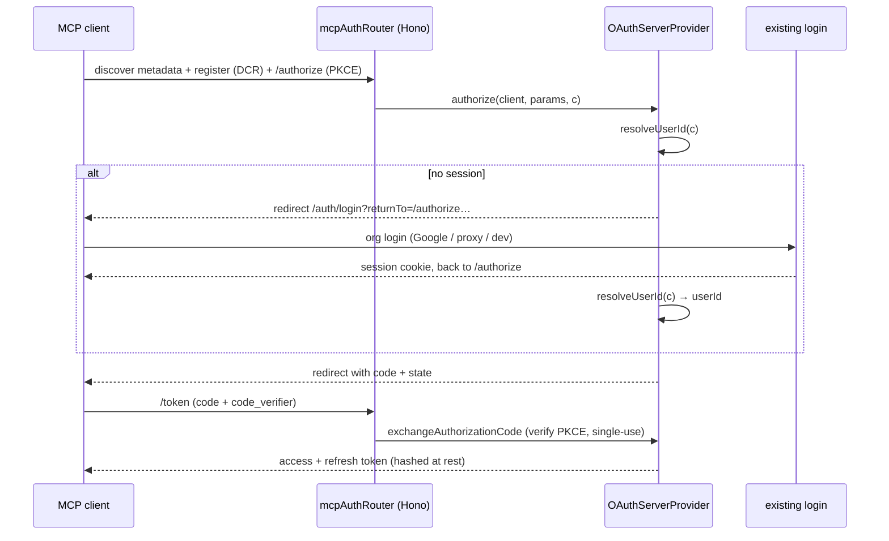

# feat: Agent MCP server + skill extension

## Summary

Add a remote **MCP server** at `/mcp` on each instance, authenticated by full
OAuth 2.1 that reuses the instance's existing login, built on `@hono/mcp` +
`@modelcontextprotocol/sdk` so the only bespoke code is a thin `OAuthServerProvider`
over the current session and a small token/client store. Extend the already-shipped
agent skill to cover the connect-once MCP path, and refresh every agent-facing and
marketing surface (`/llms.txt`, the skill, docs, landing page) to advertise both.
MCP ships **on by default**, with an operator config switch to disable it.

---

## Problem Frame

Every agent path canvas-drop ships today is per-canvas-key, single-action HTTP: an
agent can `PUT` a ZIP to a canvas it was handed a key for, nothing more. There is no
identity-scoped, multi-tool surface an agent connects to *once* and then uses to
create, list, deploy, and manage canvases across the user's account — and no path a
non-curl client (ChatGPT, Claude desktop) adopts with a single connect-and-consent.
MCP is the cross-vendor standard both speak, and the deploy API is already the thin
contract a richer client wraps (README: "the future CLI and agent skills are thin
clients of exactly this"). The pieces exist; nothing assembles them into a
connect-once, identity-scoped agent control plane.

A spike (2026-06-16, recorded in origin) retired the one load-bearing unknown: the
existing login *can* be the OAuth authorize step, and `@hono/mcp` makes the whole
surface Hono-native (no Express). What remains is a bounded build.

---

## Requirements

Carried from origin (`docs/brainstorms/2026-06-16-agent-mcp-server-and-skill-requirements.md`),
R-IDs preserved.

**MCP server & tools**
- R1. The instance exposes a remote MCP endpoint at `/mcp` using `@hono/mcp`'s
  `StreamableHTTPTransport` (`transport.handleRequest(c.req.raw)`), mounted as a
  native Hono route before the session gateway, with its own auth.
- R2. The MCP tool surface mirrors and extends the programmatic API: deploy (ZIP),
  get canvas state, list versions, rollback, unpublish, create canvas, list the
  caller's canvases, and identity (`me`). Each tool is a thin wrapper over the same
  service layer the HTTP API uses — no parallel logic.
- R3. Every tool call is authorized by the OAuth-established identity, never a
  client-asserted one. A tool acts only on canvases the caller owns (or is entitled
  to per the access model); cross-owner access is refused with the existing error codes.
- R4. MCP exposure is governed by a config switch. **Default on**; an operator can
  disable it, in which case `/mcp` and its OAuth/metadata endpoints are not served.

**OAuth / authorization server**
- R5. canvas-drop acts as an OAuth 2.1 authorization server for MCP via `@hono/mcp`'s
  `mcpAuthRouter` + a custom `OAuthServerProvider`, advertising protected-resource
  metadata (RFC 9728) and authorization-server metadata (RFC 8414), and supporting
  PKCE and Dynamic Client Registration (RFC 7591) so unknown clients self-register.
- R6. The OAuth user-authentication step reuses the existing login (`proxy` / `oidc`
  / `dev`) — the human authenticates exactly as for the dashboard; no second IdP.
- R7. MCP access/refresh tokens are minted, stored hashed, scoped to the caller, and
  revocable, reusing the existing hashed-token pattern.
- R8. The OAuth/MCP surface honors the §12 auth invariants: identity comes only from
  the server-side auth context; spoofing and cross-canvas paths are rejected; the
  spoof-rejection paths are tested first.

**Skill & agent-facing surfaces**
- R9. The packaged skill (`skill/canvas-drop/SKILL.md` + `examples/`) gains an MCP
  section: connect-once via `/mcp` as the preferred path when supported, curl/HTTP
  retained for keyed sessionless agents. The zip allowlist still excludes secrets.
- R10. `/llms.txt` and its source (`docs/site/agents/llms.md`) advertise the MCP
  endpoint and the connect flow alongside the existing deploy guidance.
- R11. A new docs page (`docs/site/agents/mcp.md` → `/docs/agents/mcp`) documents the
  endpoint, the OAuth connect flow, the tool surface, and the config switch, cross-linked
  from the skill, llms, and deploy-API pages.

**Marketing & status surfaces**
- R12. The marketing landing page (`apps/server/src/http/landing-page.ts`) surfaces
  the MCP + skill capability in its agent story.
- R13. README Status + agent section reflect MCP as shipped; BUILD_BRIEF records the
  new surface and config; `.env.example` documents the new config key.

---

## Key Technical Decisions

- **Build on `@hono/mcp` (v0.3+) + `@modelcontextprotocol/sdk` (v1.29+, peer), not the
  SDK's Express router.** `@hono/mcp` ships a Hono-native `mcpAuthRouter` (returns a
  `Hono`), `StreamableHTTPTransport`, DCR/token/revoke handlers, `bearerAuth`, and
  `createOAuthMetadata`. Its provider variant's `authorize(client, params, c)` receives
  a Hono `Context`, so no Express, no Node-http bridge, one framework. (see origin: spike)
- **canvas-drop is its own thin authorization server, not a proxy to the IdP.** Google
  (prod IdP) lacks Dynamic Client Registration, so a proxy provider breaks for the most
  likely deployment. We implement `OAuthServerProvider`; its `authorize` does
  `sessionSvc.resolveUserId(c)` → on miss `c.redirect('/auth/login?returnTo=…')`, on hit
  mints an auth code bound to the resolved user.
- **MCP defaults on; operators disable via config.** Maximizes the "first-class agent"
  promise. Because it is exposed by default, the OAuth hardening (R8) and rejection-path
  tests are treated as P0, and the disable switch must remove the routes entirely (not
  merely 403), mirroring how `proxy` mode declines to mount the guest resolver.
- **New persistence for OAuth clients / auth codes / tokens, not overloading `sessions`.**
  Three concerns with distinct lifecycles (long-lived client registrations, single-use
  short-TTL codes, revocable access/refresh tokens). New dual-dialect tables + repositories
  mirror the `sessions` hashed-token pattern (`hashToken` / `generateSessionToken`).
- **Tools wrap the existing service layer, never re-implement it.** Deploy reuses
  `DeployEngine`; get/versions/rollback/unpublish/create/list reuse the canvases/versions
  services; `me` resolves from the OAuth identity. This keeps one authorization path and
  avoids dual-dialect/logic drift.
- **Calibrate hardening to the trusted-org model.** The §12.0 hard invariants (no
  impersonation, no cross-owner access, lifecycle honored, secrets hashed) are absolute
  and P0. Beyond them, stay proportionate — standard PKCE/DCR/rate-limit, not bespoke
  anti-insider machinery. (see `docs/solutions/2026-06-13-auth-invariant-checklist.md`)

---

## High-Level Technical Design

Two views: component topology and the OAuth connect sequence (origin F1).

**Component topology.** The MCP surface mounts in the pre-gateway band next to
`deployApiRoutes`, with its own auth, and reaches the same service layer as the HTTP API.

```mermaid
flowchart TB
  Client[MCP client: Claude / ChatGPT] -->|OAuth dance| ASR[hono/mcp mcpAuthRouter]
  Client -->|Bearer token, tool calls| MCP[/mcp StreamableHTTPTransport]
  ASR --> Provider[OAuthServerProvider bridge]
  Provider -->|resolveUserId / redirect login| Login[existing oidc/proxy/dev login]
  Provider --> Store[(oauth_clients / oauth_codes / mcp_tokens — dual dialect)]
  MCP -->|bearerAuth: verifyAccessToken| Provider
  MCP --> Tools[MCP tools]
  Tools --> Services[DeployEngine / canvases / versions services]
  Services --> DB[(canvas data — dual dialect)]
  Config{{CANVAS_DROP_MCP=on}} -.gates mount.- ASR
  Config -.gates mount.- MCP
```

**OAuth connect sequence (F1 — connect-once, no pasted secret).**



---

## Output Structure

New server-side MCP module (per-unit `**Files:**` remain authoritative):

```text
apps/server/src/mcp/
  routes.ts          # mounts mcpAuthRouter + StreamableHTTPTransport, config-gated
  provider.ts        # OAuthServerProvider over existing session + token store
  clients-store.ts   # OAuthRegisteredClientsStore (DCR-backed)
  server.ts          # McpServer + tool registrations (thin service wrappers)
  *.test.ts          # colocated tests per file
apps/server/src/db/repositories/
  oauth.ts           # oauth_clients + oauth_codes + mcp_tokens repos (hashed)
  oauth.test.ts
docs/site/agents/mcp.md   # new docs page
```

---

## Implementation Units

Grouped into four phases. Dependency-ordered; U-IDs stable.

### Phase A — Foundation

### U1. Dependencies + config switch
- **Goal:** Add `@hono/mcp` + `@modelcontextprotocol/sdk`; introduce the `CANVAS_DROP_MCP` config (default on) and thread it into typed config.
- **Requirements:** R4.
- **Dependencies:** none.
- **Files:** `apps/server/package.json`, `packages/shared/src/config/env.ts`, `packages/shared/src/config/env.test.ts`, `.env.example`.
- **Approach:** Add a boolean-ish `mcp.enabled` to the config schema defaulting to `on`, parsed only in Config per the "Config is the only `process.env` reader" rule. No scattered env reads. Disable means the U4/U5 mounts are skipped entirely.
- **Patterns to follow:** `CANVAS_DROP_REALTIME` in `packages/shared/src/config/env.ts` (on/off capability flag with a default).
- **Test scenarios:**
  - Default (unset) parses to enabled.
  - Explicit off parses to disabled.
  - Invalid value rejected at boot with a clear zod error.
- **Verification:** Config typecheck passes on both dialects; `mcp.enabled` reads true with no env set.

### U2. OAuth/token persistence (dual dialect)
- **Goal:** Add `oauth_clients`, `oauth_codes`, `mcp_tokens` tables and repositories storing only hashes, mirroring `sessions`.
- **Requirements:** R5 (client store), R7 (tokens).
- **Dependencies:** U1.
- **Files:** `packages/shared/src/db/schema.pg.ts`, `packages/shared/src/db/schema.sqlite.ts`, `packages/shared/src/db/columns.ts`, `packages/shared/src/db/types.ts`, `packages/shared/src/db/schema.test.ts` (parity), `apps/server/src/db/repositories/oauth.ts`, `apps/server/src/db/repositories/oauth.test.ts`.
- **Approach:** Define columns once via the shared `columns.ts` helpers so both dialect builders stay in lockstep. Codes are single-use with short TTL; tokens carry `userId`, scope, `expiresAt`, `revokedAt`, hashed value; clients carry registration metadata + (hashed) secret where applicable. Reuse `hashToken` / `generateSessionToken`.
- **Patterns to follow:** `apps/server/src/db/repositories/sessions.ts` (`hashToken`, `findLiveByToken`, `revokeByToken`, `touchExpiry`); the dual-dialect seam in `docs/solutions/2026-06-13-dual-dialect-drizzle-seam.md`.
- **Test scenarios:**
  - Schema-parity test stays green across sqlite + pg for the three new tables.
  - Token stored as hash; raw value never persisted; lookup by raw value matches.
  - Auth code is single-use: second exchange of the same code finds nothing.
  - Expired code / expired token are not returned by the live lookup.
  - `revokeByToken` makes a token un-resolvable; revoke is idempotent.
- **Verification:** `pnpm test` green on both dialects; parity test covers new tables.

### Phase B — OAuth authorization server

### U3. OAuthServerProvider bridge over the existing login
- **Goal:** Implement the `@hono/mcp` `OAuthServerProvider` + `OAuthRegisteredClientsStore`, bridging to the session login and U2 store.
- **Requirements:** R5, R6, R7, R8.
- **Dependencies:** U2.
- **Files:** `apps/server/src/mcp/provider.ts`, `apps/server/src/mcp/clients-store.ts`, `apps/server/src/mcp/provider.test.ts`.
- **Approach:** `authorize(client, params, c)` calls `sessionSvc.resolveUserId(c)`; on miss redirects to `/auth/login?returnTo=<authorize-url>`; on hit mints a code bound to `userId` + PKCE `code_challenge`. `exchangeAuthorizationCode` verifies the PKCE verifier and single-use, returns hashed access+refresh tokens. `verifyAccessToken` resolves the token to `AuthInfo` carrying the user id/scope. `revokeToken` revokes. Identity is **only** the server-resolved session — never a client-supplied field.
- **Execution note:** Start with failing rejection-path tests (unauthenticated authorize, PKCE mismatch, replayed code) before the happy path.
- **Patterns to follow:** `apps/server/src/auth/session.ts` (`resolveUserId`), `apps/server/src/auth/return-to.ts` (returnTo), `docs/solutions/2026-06-16-oidc-subdomain-cookie-and-returnto.md`.
- **Test scenarios:**
  - Covers AE2. `authorize` with no session redirects to the existing `/auth/login?returnTo=…`, not a second IdP.
  - `authorize` with a live session issues a code bound to the resolved user id.
  - PKCE: exchange with a wrong `code_verifier` is rejected.
  - Replayed/expired auth code exchange is rejected.
  - `verifyAccessToken` rejects an unknown/expired/revoked token; accepts a live one and returns the correct user.
  - Identity is taken from the session, not from any client-provided id/email (spoof attempt ignored).
- **Verification:** Provider unit tests green; rejection paths covered first.

### U4. Mount the OAuth router + metadata (config-gated)
- **Goal:** Mount `@hono/mcp`'s `mcpAuthRouter` and the `.well-known` metadata in the pre-gateway band, gated by `mcp.enabled`.
- **Requirements:** R4, R5.
- **Dependencies:** U3.
- **Files:** `apps/server/src/mcp/routes.ts`, `apps/server/src/app.ts`, `apps/server/src/app.test.ts`.
- **Approach:** Mount alongside `deployApiRoutes` (before the session gateway) so the OAuth/metadata endpoints carry their own auth and never hit the org gateway. When `mcp.enabled` is false, the routes are **not mounted** (not 403). `issuerUrl`/`resourceServerUrl` derive from `config.baseUrl`; honor subdomain-mode origin rules.
- **Patterns to follow:** the `app.route("/v1/canvases", deployApiRoutes(...))` pre-gateway mount in `apps/server/src/app.ts`; the proxy-mode "not mounted vs inert" precedent for the guest resolver.
- **Test scenarios:**
  - Covers AE4. Protected-resource + authorization-server metadata are served and well-formed; a first-time client can self-register via DCR.
  - Covers AE3. With `mcp.enabled=false`, the metadata + authorize/token/register routes are absent (treated as not-present), and the gateway is unaffected.
  - Metadata `issuer`/`resource` reflect the configured base URL in both path and subdomain modes.
- **Verification:** App boots with MCP on and off; metadata routes behave per config.

### Phase C — MCP serving

### U5. MCP server + tool surface
- **Goal:** Stand up the `McpServer` with the tool set over `StreamableHTTPTransport` at `/mcp`, guarded by `bearerAuth(verifyAccessToken)`.
- **Requirements:** R1, R2, R3, R8.
- **Dependencies:** U3, U4.
- **Files:** `apps/server/src/mcp/server.ts`, `apps/server/src/mcp/routes.ts`, `apps/server/src/mcp/server.test.ts`, `apps/server/src/mcp/routes.test.ts`.
- **Approach:** Register tools — `deploy`, `get`, `versions`, `rollback`, `unpublish`, `create`, `list`, `me` — each a thin wrapper over the existing service layer, resolving the caller from `AuthInfo`. `/mcp` route does `transport.handleRequest(c.req.raw)` after `bearerAuth`. Authorization reuses the existing owner/access checks; cross-owner is refused with the existing error codes. Mounted only when `mcp.enabled`.
- **Execution note:** Write the cross-owner refusal and disabled-capability tests before the happy-path tool tests.
- **Patterns to follow:** `apps/server/src/routes/deploy-api.ts` (service wrapping + error codes), `apps/server/src/canvas/owner-guard.ts`, the official `@hono/mcp` Hono example (`app.all('/mcp', …)`).
- **Test scenarios:**
  - Each tool happy path: deploy publishes a live version; get/versions/rollback/unpublish/create/list/`me` return expected shapes.
  - Covers AE1. A tool call against a canvas owned by another user is refused (existing cross-owner error), and the attempt is audited.
  - Covers AE5. `create` then `deploy` to the returned canvas succeeds in one connected session with no per-canvas key handled by the agent.
  - A call with no/invalid bearer token is rejected by `bearerAuth` before reaching a tool.
  - A disabled backend capability surfaces the existing typed error code, not a 500.
  - Identity used by every tool is the OAuth-resolved user, not a tool argument.
- **Verification:** End-to-end: connect → create → deploy → list works against a test instance; rejection paths green.

### U6. Audit + rate limiting
- **Goal:** Record lifecycle/audit events and apply rate limiting to the OAuth + tool surface.
- **Requirements:** R8.
- **Dependencies:** U3, U5.
- **Files:** `apps/server/src/mcp/provider.ts`, `apps/server/src/mcp/server.ts`, `apps/server/src/mcp/routes.ts`, `apps/server/src/mcp/audit.test.ts`.
- **Approach:** Audit client registration, token issue/revoke, and tool actions (especially deploys) via the existing audit sink; reuse `rlStore` for the token endpoint and tool calls. Calibrate limits to the trusted-org model (abuse/accident safety, not anti-insider).
- **Patterns to follow:** `SessionAuditSink` in `apps/server/src/auth/session.ts`; rate-limit usage in `deployApiRoutes`; `docs/solutions/2026-06-13-admin-and-rate-limit-hardening.md`.
- **Test scenarios:**
  - Token issue and revoke each write an audit row attributed to the user.
  - A tool deploy writes the same audit shape as the HTTP deploy path.
  - The token endpoint is rate-limited; over-limit requests are throttled, not 500.
- **Verification:** Audit rows present for the lifecycle; rate limit observable in tests.

### Phase D — Surfaces (skill, docs, marketing)

### U7. Extend the packaged skill
- **Goal:** Add an MCP connect-once section to the skill, keeping the curl/HTTP fallback.
- **Requirements:** R9.
- **Dependencies:** U5 (tool surface stable).
- **Files:** `skill/canvas-drop/SKILL.md`, `skill/canvas-drop/examples/` (new MCP example), the skill-zip allowlist/builder + its test.
- **Approach:** Document `/mcp` as the preferred path when the client supports it (no secret to paste), HTTP key path for sessionless agents. Keep the zip built from an explicit allowlist.
- **Patterns to follow:** existing `skill/canvas-drop/SKILL.md` structure and `docs/site/agents/skill.md`.
- **Test scenarios:**
  - Skill-zip integrity test: the archive still contains only the allowlisted files and no secret.
  - The skill references the MCP endpoint and the curl fallback.
- **Verification:** `GET /skill.zip` builds; integrity test green.

### U8. Agent-facing docs (+ /llms.txt)
- **Goal:** New MCP docs page; update llms + skill docs; recompile generated content.
- **Requirements:** R10, R11.
- **Dependencies:** U5.
- **Files:** `docs/site/agents/mcp.md` (new), `docs/site/agents/llms.md`, `docs/site/agents/skill.md`, `apps/server/src/docs/generated-content.ts` (regenerated), `apps/server/src/docs/integrity.test.ts`.
- **Approach:** Author `mcp.md` (endpoint, OAuth connect flow, tool surface, config switch), cross-link from llms/skill/deploy-API. Regenerate `generated-content.ts` via the docs build so `/llms.txt` and `/docs/agents/mcp` serve the new content. Add the page to nav.
- **Patterns to follow:** existing `docs/site/agents/*.md` + the docs build pipeline that emits `generated-content.ts`.
- **Test scenarios:**
  - Docs integrity/render tests stay green with the new page and nav entry.
  - `/llms.txt` output mentions the MCP endpoint and connect flow.
  - The new page is reachable at `/docs/agents/mcp`.
- **Verification:** Docs tests green; `/llms.txt` and the new page serve updated content.

### U9. Marketing + status surfaces
- **Goal:** Surface MCP + skill on the landing page and update status docs/config.
- **Requirements:** R12, R13.
- **Dependencies:** U5, U8.
- **Files:** `apps/server/src/http/landing-page.ts` (+ its test if present), `README.md`, `BUILD_BRIEF.md`, `.env.example`.
- **Approach:** Add the MCP/skill capability to the landing page's agent story; update README Status + agent section; record the new surface + `CANVAS_DROP_MCP` config in BUILD_BRIEF and `.env.example`.
- **Patterns to follow:** existing agent/section copy in `apps/server/src/http/landing-page.ts` and README Status.
- **Test scenarios:** `Test expectation: none — copy/config; covered by any existing landing-page render/snapshot test.`
- **Verification:** Landing page renders the new section; README/BUILD_BRIEF/`.env.example` reflect MCP shipped + config.

---

## Acceptance Examples

Carried from origin; each is enforced by the linked unit's tests.

- AE1. A connected agent calls a deploy tool against another user's canvas → refused
  with the existing cross-owner error code; the attempt is audited. (U5, U6)
- AE2. During connect, the human is taken through the *same* login the dashboard uses
  — no separate credential, no second IdP. (U3)
- AE3. With MCP disabled by config, `/mcp` and the metadata endpoints are not served
  (behave as not-present); no OAuth endpoints are advertised. (U4)
- AE4. A first-time client with no prior registration completes DCR + PKCE
  automatically and connects without the operator issuing a client ID. (U4)
- AE5. A `create canvas` tool call followed by `deploy` to the returned canvas
  succeeds in one connected session, with no per-canvas key handled by the agent. (U5)

---

## Scope Boundaries

**Deferred for later**
- CIMD (Client ID Metadata Documents) — DCR suffices for v1; revisit when the MCP spec
  stabilizes (target 2026-07-28).
- Per-tool granular consent scopes beyond "this user's canvases" (read-only vs
  read-write token classes).
- A dashboard "Connected agents" management view (list/revoke MCP sessions).

**Outside this product's identity**
- A bespoke ChatGPT "custom GPT" artifact — MCP is the cross-vendor standard; one
  server serves all hosts.
- A separate OAuth server (Ory Hydra / dedicated provider service) — conflicts with the
  single-process, config-not-code ethos.
- Hand-rolling any OAuth or MCP protocol primitive — `@hono/mcp` + the SDK own those.

**Deferred to Follow-Up Work**
- Folding this into the OSS-launch-readiness track — this ships as its own milestone.

---

## System-Wide Impact

- **Auth boundary.** Adds a new pre-gateway authenticated surface. It must honor the
  §12.0 hard invariants absolutely (identity only from server context, no cross-owner
  access, lifecycle honored, secrets hashed). Because MCP is **on by default**, treat the
  rejection-path coverage as P0 and run `/ce-code-review` before the PR per the
  auth-invariant checklist.
- **Dual-dialect schema.** Three new tables must stay in lockstep across
  `schema.pg.ts` / `schema.sqlite.ts`; the parity test + CI matrix gate both legs.
- **Config surface.** One new key (`CANVAS_DROP_MCP`, default on) read only by Config.
- **Docs/llms/marketing** are derived surfaces; the docs build must be re-run so
  `generated-content.ts` and `/llms.txt` reflect the new page.

---

## Risks & Dependencies

- **`@hono/mcp` is young (v0.3.0).** Pin the version; the MCP auth spec is still moving
  (stable release targeted 2026-07-28). Mitigation: the bespoke surface is a thin
  provider — a breaking SDK change touches one module, not the tool logic.
- **DCR with public clients.** Default-on means unknown clients can self-register.
  Mitigation: standard PKCE + rate limiting + audit; calibrated to the trusted-org model
  (org SSO already gates who can complete the login step).
- **Subdomain-mode origin/cookie nuances.** The authorize redirect + session cookie must
  behave under `.{baseHost}` scoping. Mitigation: reuse the existing returnTo/cookie
  handling (`docs/solutions/2026-06-16-oidc-subdomain-cookie-and-returnto.md`).
- **proxy auth mode.** In proxy mode there is no app session cookie; confirm the
  authorize step resolves identity from the proxy-asserted context, consistent with how
  the gateway already derives identity. Resolve during U3/U4.

---

## Documentation / Operational Notes

- Run the docs build after U8 so `generated-content.ts`, `/llms.txt`, and
  `/docs/agents/mcp` are regenerated (do not hand-edit the generated file).
- `.env.example` and BUILD_BRIEF gain the `CANVAS_DROP_MCP` key with its default-on note.
- Capture a `docs/solutions/` learning: "MCP on a Hono app = `@hono/mcp`, not the SDK's
  Express router; `authorize` receives a Hono `Context`."

---

## Sources & Research

- Origin requirements + spike: `docs/brainstorms/2026-06-16-agent-mcp-server-and-skill-requirements.md`.
- Mount pattern + gateway boundary: `apps/server/src/app.ts` (`deployApiRoutes` pre-gateway mount).
- Session/login bridge: `apps/server/src/auth/session.ts`, `apps/server/src/auth/return-to.ts`, `apps/server/src/auth/routes.ts`.
- Token/hashing pattern: `apps/server/src/db/repositories/sessions.ts`.
- Dual-dialect seam: `packages/shared/src/db/columns.ts`, `schema.pg.ts`, `schema.sqlite.ts`; `docs/solutions/2026-06-13-dual-dialect-drizzle-seam.md`.
- Auth invariants + trust calibration: `docs/solutions/2026-06-13-auth-invariant-checklist.md`.
- Existing agent surfaces: `skill/canvas-drop/SKILL.md`, `docs/site/agents/{llms,skill}.md`, `apps/server/src/docs/routes.ts` (`/llms.txt`), `apps/server/src/http/landing-page.ts`.
- External: `@hono/mcp` (v0.3.0), `@modelcontextprotocol/sdk` (v1.29.0), [MCP Authorization spec](https://modelcontextprotocol.io/specification/draft/basic/authorization).
