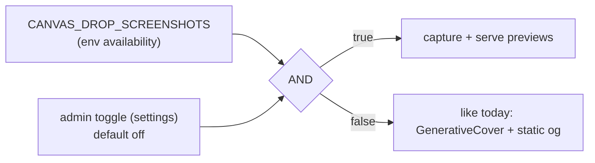

# feat: Canvas screenshot pipeline

Generate a **preview image on every publish**, for **every** canvas, stored as a
**private, access-gated asset**. Reuse that one asset for internal/personal
dashboard thumbnails, gallery covers, and (public canvases only) link-unfurl OG
images. Captured async by a single persistent headless browser driven off a DB job
queue. Two-layer enablement: an **env availability** gate (Chromium present / master
enable) **AND** an **admin runtime toggle** (default off); off behaves exactly like
today. No per-user/per-canvas opt-out.

**Origin:** `docs/brainstorms/2026-06-16-canvas-screenshots-requirements.md`.

---

## Current state — what's landed vs. what this revision plans

The foundation already shipped on `feat/canvas-screenshots` (PR #36) and is green on
both dialects. **This revision (2026-06-17) changes the worker model and the
enablement model**, so some landed units get follow-up edits and two new units are
added.

**Landed (on branch):**
- **U1** screenshot storage-key helpers.
- **U2** dual-dialect `screenshot_jobs` table + repository (coalesce, lease, reclaim, sweep).
- **U3** capture principal (`Principal` `capture` kind) + HMAC capture token, enforced in `decideCanvasAccess`.
- **U6** enqueue-on-publish (editor path only) + the `CANVAS_DROP_SCREENSHOTS` env config group.

**What changed this revision (the delta to build):**
- **Worker model simplified** to ONE persistent browser + context-per-job (was: browser-per-job). Drops the browser-per-job hedge entirely. → revises **U4/U5**.
- **Enablement is now two-layer**: env *availability* AND an *admin runtime toggle* (default off), no per-user opt-out, off == today. The env flag's meaning shifts from "feature on" to "feature available". → new **U12**; revises **U6**'s direct config read.
- **Capture on EVERY publish path**, not just the editor publish. → new **U13**.
- **ONE preview per canvas, overwritten in place** (disk + the one-per-canvas job row) — no per-version history. Simplifies the storage key (drop the versionId path segment) and the GC (overwrite replaces the per-version sweep; only delete-cleanup remains). → revises landed **U1**, and **U4/U7/U10**.
- Capture-all-canvases (incl. private) for private thumbnails — unchanged from the original plan; the capture principal (U3) is what makes it safe.

**Non-negotiable baseline (the cherry-on-top principle):** thumbnails are a *nice
extra*, not load-bearing. **Standard mode — the feature off or env-unavailable — must
be rock-solid and behave EXACTLY like today**, with zero dependency on capture: covers
render `GenerativeCover`, OG uses static `/og.png`, the preview route 404s cleanly, the
worker never starts and never touches Chromium, and publish/deploy are completely
unaffected. This path is tested first and on every surface (R10).

---

## Problem Frame

Dashboard/gallery cards use `GenerativeCover` (procedural art) and link unfurls use one
static `/og.png` — a published canvas looks generic everywhere it appears. We want a
real preview image of the published content, captured once per publish and reused as a
private asset across surfaces. Capture is slow, memory-heavy, and runs canvas-authored
JS in a browser, so it is async and platform-triggered. The architecture must respect
three hard constraints: **single-process**, **SQLite-default on one VPS**, and the
**dual-dialect SQLite↔Postgres** invariant — and must be cleanly switch-off-able to
exactly today's behavior.

---

## Requirements Traceability

- **R1** Preview captured async on **every** publish, for every canvas; coalesced to latest. (U4, U5, U13)
- **R2** DB job row + in-process worker; screenshot-specific table. *(landed: U2)*
- **R3** ONE preview per canvas, **overwritten in place** on each publish (a canvas-stable storage key + the one-per-canvas job row); no per-version history. The job row's `versionId` records which version the current preview reflects (used to cache-bust the cover URL). (U1 revision, U4, U7, U10)
- **R4** Capture ALL canvases incl. private/gated; render gated content via the capture principal. *(landed: U3; consumed by U5)*
- **R5** Preview stored as a **private, access-gated asset** — never publicly fetchable by default. (U7)
- **R6** Reuse the one asset for: personal/dashboard thumbnails, gallery covers, and OG for **public canvases only**. (U8, U9)
- **R7** Primitives neutered during capture (no AI spend, no outbound network). (U4)
- **R8** ONE persistent browser in-process; context-per-job; recycle every N; concurrency configurable (default 1); the DB table is the queue. (U4, U5)
- **R9** Internal capture credential: server-minted, scoped, never client-supplied. *(landed: U3)*
- **R10** Two-layer enablement: **env-available AND admin-enabled**; admin runtime toggle default **off**; **no per-user opt-out**; OFF == today. **Standard mode (off/unavailable) is first-class and bulletproof** — exactly today's behavior with zero dependency on capture (covers → GenerativeCover, OG → static `/og.png`, preview route → clean 404, worker never starts, publish unaffected); tested first and on every surface. (U12; consumed everywhere)
- **R11** Overwrite-in-place reclaim (no per-version sweep) + canvas-delete cleanup. (U10)
- **R12** Capture tooling is a runtime dependency; Chromium in the image; off by default. (U14)
- **R13** Dual-dialect tests green on both dialects; CI matrix green. *(landed for U2; applies to all)*
- **R14** OG for private/shared canvases (unfurls of gated content) is **deferred**. (Scope Boundaries)

---

## Key Technical Decisions

**KTD-1 — `capture` is a `Principal` kind enforced in the pure decision table.** *(landed, U3)*
Allows the owner-equivalent view of its own canvas at every rung, denies any other
canvas, never bypasses deleted/archived/disabled. Needed to render private content for
private thumbnails.

**KTD-2 — Capture credential is a server-verified HMAC token, not a session.** *(landed, U3)*

**KTD-3 — `screenshot_jobs` is one row per canvas (coalesce upsert), lease-based.** *(landed, U2)*

**KTD-4 (REVISED) — ONE persistent browser in the server process; context-per-job.**
Launch a single Chromium lazily on first job; reuse it for the process lifetime. Per
job, open a fresh isolated `BrowserContext` (clean storage), capture, close the
*context* (not the browser). Recycle the whole browser every N jobs (and on crash) to
bound memory. **Concurrency is the number of contexts processed at once — default 1,
env-configurable via the existing `CANVAS_DROP_SCREENSHOTS_CONCURRENCY`.** The
`screenshot_jobs` table is the work queue; a publish burst enqueues and drains in
order. This REPLACES the prior browser-per-job model (no per-job cold start) and drops
that hedge. *Separate worker process remains a far-future escape hatch only — not built.*

**KTD-5 — Primitives neutered during capture; capture grants canvas-read only.** *(carried)*

**KTD-6 (REVISED) — ONE preview per canvas, overwritten in place; WebP renditions.**
sharp produces an OG-size master (1200×630) + derived card/thumbnail crops. They are
stored at **canvas-stable keys** (`screenshots/<canvasId>/<rendition>.webp` — no
versionId path segment) and **overwritten** on each publish, so a canvas has exactly
one current preview set. The single `screenshot_jobs` row per canvas is the DB record:
`status='done'` ⇒ a preview exists; its `versionId` says which version it reflects and
cache-busts the cover URL (`?v=<versionId>`) so browsers refetch after a republish even
though the storage key is stable. No per-version history means no per-version GC — an
overwrite reclaims the old bytes, and only canvas-delete needs explicit cleanup. *(This
revises the landed U1 key helpers, which currently include versionId in the path.)*

**KTD-7 (NEW) — Two-layer enablement: env availability AND admin runtime toggle.**
Mirrors the existing settings pattern (`adminSettingsService.effectiveRealtimeEnabled`
= `boolOverride(key) ?? config.realtimeEnabled`):
- **Env layer** (`CANVAS_DROP_SCREENSHOTS`, renamed in meaning to *availability*): is the
  capability available at all (Chromium present / master enable)? Plus the env tuning
  knobs (concurrency, timeouts, recycle, TTLs). Shown **read-only** in the admin
  Configuration view (like `realtime.enabled`).
- **Admin layer**: a **new editable boolean** config field (the first one — exercises the
  existing forward-compat boolean branch in `setConfigOverride`) with a `settings`-table
  override key, **default off**.
- **Effective state** = `envAvailable AND adminEnabled` — a single
  `effectiveScreenshotsEnabled()` resolver on the admin settings service that every
  consumer (enqueue, worker, serving, surfaces) reads. **No per-user/per-canvas
  opt-out.** When the effective state is OFF (admin off OR env-unavailable): no capture,
  and previews are **not served anywhere** — dashboard/gallery fall back to
  `GenerativeCover`, OG to static `/og.png`. Exactly today's behavior.

---

## High-Level Technical Design

### Components & flow (single persistent browser)

```mermaid
flowchart TD
  PUB["publish (any path:\neditor / deploy-api / mcp / deploy-engine)"] -->|effective enabled?| GATE{"envAvailable\nAND adminEnabled?"}
  GATE -->|no| TODAY["no capture (behaves like today)"]
  GATE -->|yes| ENQ["screenshots.enqueue(canvasId, versionId)\ncoalesce: overwrite pending"]
  ENQ --> TBL[("screenshot_jobs (dual-dialect)\n= the work queue")]
  WK["in-process worker loop"] -->|claim N at a time\n(default 1)| TBL
  WK --> BROW["ONE persistent Chromium\n(lazy launch, recycle every N jobs)"]
  BROW --> CTX["fresh BrowserContext per job\nprimitives neutered, dialogs blocked, timeout"]
  CTX -->|header-borne capture token| SRV["canvas serve\ncapture principal -> decideCanvasAccess"]
  SRV --> CTX
  CTX --> SHARP["sharp: WebP master 1200x630 + crops"]
  SHARP --> ST[["storage.put(screenshots/<canvasId>/<rendition>.webp)\nOVERWRITE — one preview per canvas"]]
  ST --> DONE["mark job done (row records versionId); close context"]
  subgraph reads ["reads (only when effective-enabled)"]
    COV["dashboard/gallery cover route\n(access-gated re-check)"] --> ST
    OG["ogMeta() — public_link ONLY"] --> ST
  end
```

### Effective-state resolution



---

## Implementation Units

Landed units are summarized (do not re-implement); revised/new units carry full detail.

### Phase A — Foundations *(landed)*

### U1. Storage-key helpers — **LANDED (needs a small revision)**
Screenshot prefix/key helpers, disjoint from the blob prefix. **Revision (KTD-6):** drop
the versionId path segment so the key is canvas-stable and overwrites —
`screenshotKey(canvasId, rendition)` → `screenshots/<canvasId>/<rendition>.webp`. Remove
the now-unused `screenshotVersionPrefix` / `versionIdFromScreenshotKey`; update the U1
tests accordingly. `screenshotPrefix(canvasId)` stays (used by delete-cleanup).

### U2. `screenshot_jobs` table + repository (dual-dialect) — **LANDED**
One row per canvas (coalesce upsert), lease/claim/reclaim/sweep; migrations + parity test.

### U3. Capture principal + HMAC token — **LANDED**
`capture` Principal kind enforced in `decideCanvasAccess`; HMAC mint/verify; rejection-tests-first.

---

### Phase B — Capture core (revised)

### U4. Capture engine (Playwright + sharp, primitives neutered)

- **Goal:** Turn a canvas+version into stored WebP renditions, safely, given a browser context.
- **Requirements:** R1, R7, R8
- **Dependencies:** U1, U3
- **Files:** `apps/server/src/screenshots/capture.ts`, `apps/server/src/screenshots/capture.test.ts`,
  `apps/server/package.json` (promote `playwright` + `sharp` to runtime deps).
- **Approach:** `captureCanvas({ context, canvasId, versionId, internalOrigin, mintToken })` —
  takes an already-open `BrowserContext` (the worker owns the persistent browser, KTD-4),
  opens a page, registers a route interceptor / init script that **neuters outbound
  network + canvas primitives** (fail-closed → no AI spend, no internal-network reach,
  R7/KTD-5), sets the capture header (token from U3), navigates to the canvas at the
  internal origin, blocks JS dialogs, waits for load with a hard wall-clock timeout,
  screenshots at 1200×630, then sharp → WebP master + crops. Returns bytes per rendition.
  The function does NOT launch/close the browser — that's the worker's lifecycle (KTD-4).
  The worker writes the returned bytes to the **canvas-stable** keys (KTD-6),
  **overwriting** the prior preview — no versionId in the storage path.
- **Patterns to follow:** `scripts/screenshots.mjs` (Playwright+sharp capture/encode/timeout).
- **Test scenarios:**
  - Given a locally served canvas + a real/stub context, produces non-empty WebP bytes at the expected dimensions per rendition.
  - A canvas whose script calls `fetch()` / a primitive during load: the call is blocked and capture still completes (R7 — no outbound network).
  - A dialog-opening canvas does not wedge capture (auto-dismissed).
  - A canvas that hangs past the timeout → rejects within the wall-clock bound (R8).
  - sharp output is valid WebP; the card/thumbnail crop has the expected aspect.
- **Verification:** capture works against a locally served canvas; runtime deps present.

### U5. Worker loop — ONE persistent browser, context-per-job

- **Goal:** Drive the queue through the capture engine using a single recycled browser, in-process, gated by effective-enabled.
- **Requirements:** R1, R8, R10
- **Dependencies:** U2, U3, U4, U12
- **Files:** `apps/server/src/screenshots/worker.ts`, `apps/server/src/screenshots/worker.test.ts`,
  `apps/server/src/index.ts` (start/stop the loop).
- **Approach:** A worker that, when **env-available**, runs a `setInterval` tick: first
  `reclaimStuck` + `sweepFailed` (cheap), then check `effectiveScreenshotsEnabled()`
  (U12) — if the admin toggle is off, do nothing (no browser launch). When enabled and a
  job is claimable: **lazily launch the single persistent Chromium** if not already up;
  open a fresh `BrowserContext`; mint a capture token (U3); `captureCanvas` (U4);
  `storage.put` each rendition (U1 keys); `markDone`; close the context. On throw →
  `markFailedOrRetry` + close the context. Process up to **N contexts concurrently**
  (default 1, `CANVAS_DROP_SCREENSHOTS_CONCURRENCY`). **Recycle** the whole browser every
  N jobs and on crash. Clean shutdown closes the browser. Re-claim on restart is free
  (lease-based, U2). The browser handle lives only here.
- **Patterns to follow:** the `setInterval` heartbeat in `index.ts`; the best-effort
  background dispatch in `draftService.publish`; `adminSettingsService` for the resolver.
- **Test scenarios:**
  - A pending job is claimed, captured (engine stubbed), stored, marked done; the context is closed after.
  - Engine throwing → retried then `failed` at the cap; the persistent browser is reused across jobs (not relaunched per job) and IS recycled after N jobs / on simulated crash.
  - Admin toggle off (env available) → ticks run reclaim/sweep but **launch no browser** and claim nothing.
  - Env unavailable → worker never starts.
  - Restart mid-job: an expired-lease `running` row is reclaimed on a later tick.
  - Concurrency=2 (config) → two contexts run against the one browser; concurrency=1 → strictly serial.
- **Verification:** end-to-end (enqueue → worker → stored WebP) green; one browser reused; off-state launches nothing.

---

### Phase C — Enablement, trigger, serve

### U12. (NEW) Admin runtime toggle + effective-state resolver

- **Goal:** Layer an admin on/off toggle (default off) over the env availability flag, with a single effective-state resolver every consumer reads. No per-user opt-out.
- **Requirements:** R10
- **Dependencies:** U6 (env config exists)
- **Files:** `apps/server/src/admin/config-fields.ts` (new editable boolean field),
  `apps/server/src/admin/settings-service.ts` (+`effectiveScreenshotsEnabled()`) and its test,
  `packages/shared/src/config/env.ts` (clarify `CANVAS_DROP_SCREENSHOTS` semantics → *availability*; consider renaming the resolved field to `screenshots.available` for clarity),
  consumers that currently read `config.screenshots.enabled` directly (`apps/server/src/draft/service.ts` from U6, and U5/U7/U8/U9 as they land).
- **Approach:**
  - Add a `ConfigField` for the **admin toggle**: `editable: true`, `type: "boolean"`,
    `settingKey: "config.screenshots.enabled"`, default-off `fromConfig`. This is the
    first editable boolean — it exercises the existing forward-compat boolean branch in
    `setConfigOverride` (today "unreached scaffolding"); add a test that the branch
    round-trips. Add a **read-only** field for the env availability (mirrors
    `realtime.enabled`).
  - Add `effectiveScreenshotsEnabled()` to the admin settings service:
    `config.screenshots.available && (boolOverride("config.screenshots.enabled") ?? false)`.
  - Switch all consumers to read the resolver instead of the bare env flag (this is the
    edit to U6's `draftService.publish` gate, and the gate U5/U7/U8/U9 use).
- **Patterns to follow:** `effectiveRealtimeEnabled()`, `effectiveModels()` resolvers; the
  `realtime.enabled` read-only field + `ai.models` editable field in `config-fields.ts`;
  the boolean branch in `setConfigOverride`.
- **Test scenarios:**
  - `effectiveScreenshotsEnabled()` truth table: env off → false regardless of admin; env on + admin unset → false (default off); env on + admin true → true; env on + admin false → false.
  - The admin toggle appears as an **editable** boolean in `describeConfig`; `setConfigOverride("screenshots.enabled", true)` persists and flips the effective state; clearing reverts to default-off.
  - The env availability appears **read-only** in the view (no `setConfigOverride` allowed).
  - No per-user/per-canvas override path exists (there is no canvas-scoped screenshot setting).
- **Verification:** flipping the admin toggle turns capture+serving on/off at runtime; env-off makes the toggle inert; default is off.

### U13. (NEW) Enqueue on every publish path

- **Goal:** Capture on *every* publish, not just the editor path (R1 says every publish).
- **Requirements:** R1
- **Dependencies:** U2, U12
- **Files:** `apps/server/src/deploy/engine.ts`, `apps/server/src/routes/deploy-api.ts`,
  `apps/server/src/mcp/server.ts`, `apps/server/src/routes/management.ts` (the
  `setCurrentVersion` / `setCurrentVersionIfReady` sites), plus their tests.
- **Approach:** At each site where the live version pointer advances, fire the same
  best-effort, effective-gated `screenshots.enqueue(canvasId, versionId)` already used on
  the editor path (U6). Coalesce makes repeated enqueues for a canvas safe. Factor the
  enqueue+gate into one small helper so the four call sites stay consistent (avoid
  drift). Keep it best-effort — a failed enqueue never fails a publish/deploy.
- **Patterns to follow:** the U6 enqueue in `draftService.publish`; the existing
  best-effort post-publish dispatch.
- **Test scenarios:**
  - Deploy-API publish enqueues a coalesced job (effective-enabled); none when disabled.
  - MCP publish path enqueues; management restore/deploy path enqueues.
  - A failing enqueue never fails the deploy/publish on any path.
- **Verification:** every publish path schedules a capture when enabled; none when off.

### U7. Access-gated preview serving

- **Goal:** Serve a stored preview only to a requester allowed to see the canvas; never publicly by default.
- **Requirements:** R5
- **Dependencies:** U1, U2, U3, U12
- **Files:** `apps/server/src/screenshots/serve.ts` + test; route wiring on the dashboard/management host (not the public canvas host).
- **Approach:** `GET /canvases/:id/preview?rendition=card|thumb|og` resolves the
  requester's normal principal (member/guest/anonymous — NOT the capture principal),
  runs `resolveAccessContext` + `decideCanvasAccess`, and on allow streams the stored
  WebP at the **canvas-stable key** (KTD-6 — one preview per canvas, overwritten). Because
  the key is stable, the cover URL is cache-busted with `?v=<job.versionId>` and served
  with a revalidating cache header (not long-immutable). Deny → 404 (opaque).
  Effective-disabled, no `done` job row, or no stored object → **clean 404** so the client
  shows `GenerativeCover`. The storage key is never exposed directly. **A private
  canvas's preview is unreachable without authorization** (R5).
- **Patterns to follow:** `canvasAccess` + `decideCanvasAccess`; `file-serving.ts` streaming + cache headers.
- **Test scenarios:**
  - Owner / allowed member / invited guest → 200 WebP for a captured private canvas.
  - Anonymous / non-allowed member / wrong-canvas guest → 404 (R5: private preview not fetchable).
  - No preview yet, or feature effective-disabled → 404 (drives the placeholder).
  - Disabled/deleted canvas → 404. Cache headers present; bytes match what U4 stored.
- **Verification:** access matrix green; private preview unreachable without authorization.

---

### Phase D — Surfaces

### U8. Dashboard + gallery covers (personal thumbnails)

- **Goal:** Show the real preview where it exists (incl. personal/private canvases); `GenerativeCover` otherwise.
- **Requirements:** R6
- **Dependencies:** U7, U12
- **Files:** `apps/dashboard/src/components/GenerativeCover.tsx` (or a new `CanvasCover`),
  `apps/dashboard/src/components/CanvasList.tsx`, `apps/dashboard/src/routes/gallery.tsx`,
  canvas DTO if a `hasPreview` hint avoids a 404 flash.
- **Approach:** A `CanvasCover` that points an `` at the U7 preview route and falls
  back to `GenerativeCover` on error / when absent / when effective-disabled. v1 reads on
  load (no live swap; realtime ping deferred). Default `object-fit: cover` for cards.
- **Patterns to follow:** existing `GenerativeCover` usage in `CanvasList` + `gallery.tsx`.
- **Test scenarios:** renders the preview when present; falls back to `GenerativeCover` on image error / absent / disabled; dashboard list + gallery share the component.
- **Verification:** real thumbnails for captured canvases (personal incl.), generative art otherwise; no broken-image state.

### U9. Public_link per-canvas OG image

- **Goal:** Use the preview as the OG image for **public_link canvases only**.
- **Requirements:** R6, R14
- **Dependencies:** U1, U7, U12
- **Files:** `apps/server/src/http/social-meta.ts` (`ogMeta`), `apps/server/src/http/social-preview.ts` + test.
- **Approach:** In the per-canvas social-card path (already restricted to `public_link`
  reaching the `anonymous` principal), emit the preview's OG-rendition URL as `og:image`
  when present and effective-enabled, else fall back to `/og.png`. **Do not** touch the
  generic gated-card path — gated canvases keep leaking nothing. Private/shared OG/unfurls
  stay deferred (R14).
- **Patterns to follow:** the `public_link`-only anonymous carve-out in `social-preview.ts`; `ogMeta`.
- **Test scenarios:**
  - public_link canvas with a preview → `og:image` is the per-canvas URL; without one → `/og.png`.
  - gated canvas → generic card, **never** a per-canvas OG image (R5/R14 leak guard).
  - effective-disabled → `/og.png` everywhere.
- **Verification:** unfurl matrix green; no gated content reachable via OG.

---

### Phase E — Lifecycle + ops

### U10. Storage cleanup on canvas delete (simplified — no per-version sweep)

- **Goal:** Drop a canvas's single preview + job row on delete. (Republish needs no sweep — the stable key is overwritten in place, KTD-6.)
- **Requirements:** R11
- **Dependencies:** U1, U2
- **Files:** `apps/server/src/canvas/purge.ts` (hook), and a small helper near the screenshots module + test.
- **Approach:** Because previews overwrite at a canvas-stable key, republish reclaims old
  bytes automatically — **no per-version mark-sweep is needed** (this removes the bulk of
  the original U10). The only cleanup is on canvas delete/purge: remove
  `screenshotPrefix(canvasId)` from storage (best-effort, logged-not-thrown, matching
  `blob-gc`) and `screenshots.deleteByCanvas` for the job row.
- **Patterns to follow:** the purge path; `screenshots.deleteByCanvas` (U2); `blob-gc.ts` best-effort error handling.
- **Test scenarios:** republish overwrites in place (old bytes not orphaned — no extra objects accumulate); canvas delete removes the preview prefix + job row; a failed storage delete is logged, not thrown.
- **Verification:** no orphaned previews; delete is clean.

### U14. Ops/packaging — Chromium in the runtime image

- **Goal:** Make the runtime able to launch Chromium, within the VPS budget; off by default.
- **Requirements:** R12
- **Dependencies:** U4
- **Files:** production `Dockerfile` (runtime stage), `docker-compose` if present, deploy docs / README, `BUILD_BRIEF.md` §16 (M10) note.
- **Execution note:** Couples to **M10 ops/packaging** — sequence with it; changes the image build + the single-VPS memory budget the launch load-test gates on.
- **Approach:** Install Chromium + required system libraries in the runtime stage (or
  Playwright `--with-deps`), document image-size + memory footprint, note the worker's
  single-browser + concurrency cap as the memory control. Feature stays **env-available
  but admin-off by default**. Add the success-criteria load metric (serve p95 under
  concurrent capture + queue drain) to the M10 test plan.
- **Patterns to follow:** existing multi-stage `Dockerfile`.
- **Test scenarios:** `Test expectation: none — packaging/ops change.` Validated by the M10 load test + a manual built-image smoke test (worker launches Chromium).
- **Verification:** built image can run a capture; documented memory budget; admin-off by default.

---

## Scope Boundaries

### Deferred to Follow-Up Work
- A "recapture" admin button (trivial on top of `enqueue`).
- A `hasPreview` DTO hint if U8 ships without it and the 404-flash is noticeable.
- Live in-place cover swap / realtime "preview ready" ping.

### Deferred for later (from origin)
- General async-job + scheduler subsystem and admin recurring jobs.
- Author-facing `screenshot()` SDK primitive for arbitrary URLs.
- User-visible pending-vs-failed distinction.
- **OG/unfurls for private or shared (non-public_link) canvases (R14).**

### Simplified away this revision
- **Browser-per-job** model — replaced by ONE persistent browser + context-per-job (KTD-4).
- **Per-version preview history + the version-keyed GC sweep** — replaced by one
  overwrite-in-place preview per canvas (KTD-6); only canvas-delete cleanup remains (U10).
- Separate worker process — far-future escape hatch only; not built.

### Outside this product's identity (from origin)
- No phone-home / external screenshot service — capture is local, org-agnostic, MIT.

---

## Risks & Dependencies

- **Memory on the single VPS.** ONE persistent browser bounds baseline; per-job contexts
  are cheap and closed promptly; concurrency default 1; recycle every N jobs caps creep;
  wall-clock timeout bounds a wedged page. Real metric: serve p95 during capture (U14/M10).
- **Auth surface (U3, landed).** Capture principal renders gated content. Route any
  follow-up edits touching it through `/ce-code-review` + `docs/solutions/2026-06-13-auth-invariant-checklist.md`.
- **Enablement correctness (U12).** The effective gate (env AND admin) must be the single
  read every consumer uses — a consumer reading the bare env flag would bypass the admin
  off switch. Enforced by routing all reads through `effectiveScreenshotsEnabled()` and a
  truth-table test.
- **Runtime dependency / image size (U14).** Chromium is new to the runtime; hard M10
  dependency; admin-off by default so non-adopters pay nothing.
- **Capture across URL modes (open question).** The worker must drive the correct internal
  origin in path vs subdomain mode and satisfy `frame-ancestors 'self'`. Resolve in U4/U5.

---

## Open Questions (resolve in implementation)

- Internal capture origin resolution across path vs subdomain mode (and CSP).
- Whether to rename the env-resolved field `screenshots.enabled` → `screenshots.available` (recommended for clarity) or keep the name with a comment.
- Concrete tuning values (TTLs, recycle-N, timeout, lease, default concurrency 1).
- Card/thumbnail crop dimensions + `object-fit`.

---

## Verification Strategy

- `pnpm lint && pnpm typecheck && pnpm test` (both dialects) green before push; CI matrix is the authoritative merge gate.
- Auth-touching edits routed through `/ce-code-review` + the auth-invariant checklist.
- Manual: built runtime image launches ONE Chromium and captures a local canvas; private
  preview unreachable unauthenticated; gated canvas never emits a per-canvas OG; flipping
  the admin toggle turns capture+serving on/off; off behaves exactly like today.

---

## Sources & Research

- Origin: `docs/brainstorms/2026-06-16-canvas-screenshots-requirements.md`.
- Admin enablement grounded in `apps/server/src/admin/settings-service.ts`
  (`effectiveRealtimeEnabled`/`effectiveModels` resolvers; `setConfigOverride` boolean
  branch) and `apps/server/src/admin/config-fields.ts` (`realtime.enabled` read-only +
  `ai.models` editable patterns).
- Code patterns: `upload_sessions` (lease rows), `decideCanvasAccess` (principal table),
  `blob-gc.ts` (mark-sweep), `draftService.publish` (best-effort dispatch),
  `scripts/screenshots.mjs` (Playwright+sharp), `social-preview.ts` (public_link
  carve-out), `index.ts` (`setInterval`).
- `docs/solutions/2026-06-13-auth-invariant-checklist.md` (auth surface).
