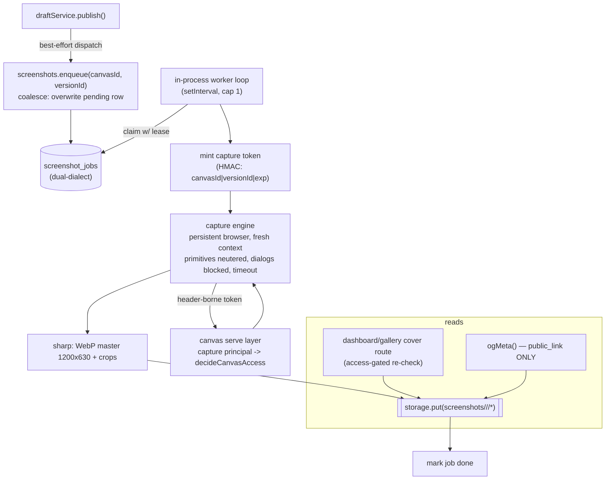
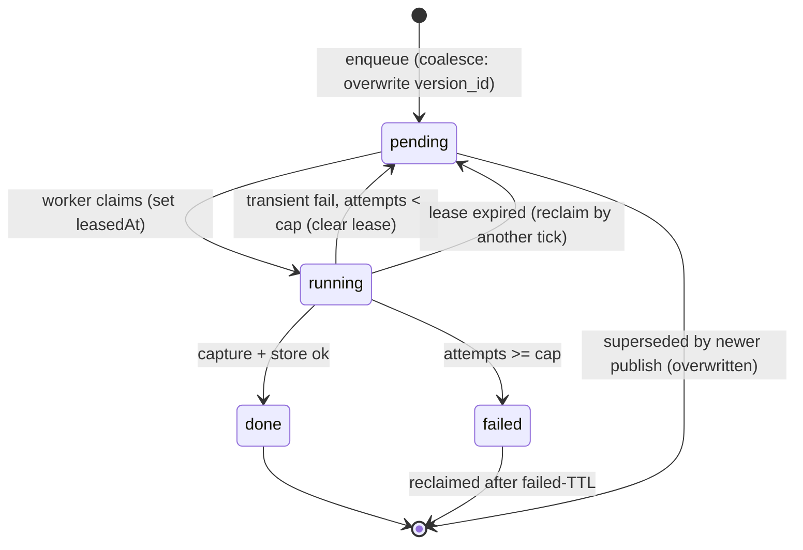

# feat: Canvas screenshot pipeline

Platform-triggered screenshots of deployed canvases, captured async on publish,
stored via the storage interface, and surfaced as real dashboard/gallery covers
and (public-only) per-canvas link-unfurl images. A DB job row + in-process worker
drives the Playwright already in the repo — no queue dependency, dual-dialect-safe.

**Origin:** `docs/brainstorms/2026-06-16-canvas-screenshots-requirements.md` (revised
post `/ce-doc-review`). All locked decisions and corrections there are carried
forward below.

---

## Problem Frame

Dashboard/gallery cards use `GenerativeCover` (procedural art) and link unfurls use
one static `/og.png` — a published canvas looks generic everywhere it appears.
Capturing a real screenshot is slow, memory-heavy, and runs canvas-authored JS in a
browser, so it must be an async, platform-triggered operation, not inline in a
request. The architecture must respect three hard constraints: **single-process**,
**SQLite-default on one VPS**, and the **dual-dialect SQLite↔Postgres** invariant.

---

## Requirements Traceability

From the origin doc (locked decisions #1–#6, in-scope list, success criteria):

- **R1** Async, platform-triggered capture; eager-on-publish, coalesced to latest. (U4, U6)
- **R2** DB job row + in-process worker; screenshot-specific table (no `job_type`). (U2, U5)
- **R3** Keyed to version identity (`versions.id`); auto-invalidates on republish. (U1, U2, U6)
- **R4** Covers for ALL canvases (incl. private/gated) on authenticated surfaces. (U3, U8)
- **R5** Per-canvas OG images for **public_link canvases ONLY** (gated-leak guard). (U9)
- **R6** Internal capture principal: server-minted, short-TTL, scoped to one
  canvas+version, header-borne, never client-supplied; enforced in
  `decideCanvasAccess`; grants no more than the owner sees; endpoint internal-only;
  mint/use audited. (U3)
- **R7** Primitives neutered during capture (no AI spend, no outbound network). (U4)
- **R8** Persistent browser + per-job context, recycled; dialog block; wall-clock
  timeout; concurrency cap 1 (config to 2). (U4, U5)
- **R9** Access-gated screenshot serving — private cover never fetchable by URL. (U7)
- **R10** Sweep-style storage reclaim + canvas-delete cleanup. (U10)
- **R11** Capture tooling becomes a runtime dependency; Chromium in the image. (U12)
- **R12** Dual-dialect tests green on both dialects; CI matrix green. (U2, all)

---

## Key Technical Decisions

**KTD-1 — `capture` is a new `Principal` kind, enforced in the pure decision table.**
`decideCanvasAccess` (`apps/server/src/canvas/authorization.ts`) is a pure,
exhaustively-tested principal→decision table. We add a 4th kind
`{ kind: "capture"; canvasId: string; versionId: string }` and a branch that allows
**iff `principal.canvasId === canvas.id`**, returning the same grant the owner gets
(`needsPasswordGate: false, staticOnly: false`). Wrong-canvas falls through to the
normal rungs and denies. This grants no capability beyond the owner's own view and
keeps every branch unit-testable with no I/O — mirroring the existing owner branch.

**KTD-2 — The capture credential is a server-verified HMAC token, not a session.**
Minted server-side (HMAC over `canvasId|versionId|exp` with the existing session
secret), short TTL, presented by the worker as an internal request header. A
serve-layer middleware verifies it server-side and sets the `capture` principal —
identity originates server-side (§12.0 #1), never from the client frame. Stored
nowhere (stateless HMAC); single canvas+version scope; the verifying route is
mounted on an internal-only path, never reachable from the public canvas host.

**KTD-3 — Screenshot jobs table mirrors `upload_sessions`' lease pattern.**
`upload_sessions` already models a leased, single-consume job row (`finalizingAt`
lease cleared on transient failure; `consumedAt` terminal). The `screenshot_jobs`
table copies that shape: `status` (pending|running|done|failed), `leasedAt`
(reclaim past a timeout), `attempts`, `lastError`. **Coalesce-to-latest** = a unique
index on `canvas_id` for non-terminal rows (one active job per canvas; a new publish
overwrites the pending row's `version_id`). No `job_type` column — a second job type
means a new table (keeps the "focused pipeline" decision honest).

**KTD-4 — Worker is an in-process poll loop, config-gated, single concurrency.**
Modeled on the `setInterval` heartbeat in `index.ts`. One job at a time (cap 1,
config to 2). A single persistent Chromium reused across jobs with a fresh context
per job, recycled every N jobs. Gated by a config flag (off → no browser launched,
no runtime cost) so self-hosters who don't want Chromium pay nothing.

**KTD-5 — Primitives neutered by capability, reusing the existing `staticOnly` seam.**
The capture grant sets `staticOnly: true`'s effect on primitives (AI/realtime/KV/
files refused) — but covers must still render the canvas's *content*. We reuse the
existing primitive-refusal path (already wired for public_link non-owners in U9/U11
of prior plans) so a captured canvas's `fetch`/AI/realtime calls fail closed, with no
quota attribution gap and no internal-network reach. Confirm during implementation
whether `staticOnly` alone suffices or a dedicated `capture` flag reads cleaner.

**KTD-6 — sharp produces an OG-size master + derived crops; WebP throughout.**
Capture at 1200×630 (OG), then sharp derives the card/gallery crop. One capture, two
(or more) stored renditions under a dedicated screenshot prefix.

---

## High-Level Technical Design

### Components & flow



### Job lifecycle (state machine)



---

## Output Structure

New server module for the pipeline; everything else extends existing files.

```
apps/server/src/screenshots/
  capture.ts          # Playwright persistent browser + sharp (U4)
  capture.test.ts
  capture-token.ts    # HMAC mint/verify (U3)
  capture-token.test.ts
  worker.ts           # poll/claim/capture/store loop (U5)
  worker.test.ts
  serve.ts            # access-gated cover serving route (U7)
  serve.test.ts
  gc.ts               # sweep-style reclaim (U10)
  gc.test.ts
apps/server/src/db/repositories/screenshots.ts        # jobs repo (U2)
apps/server/src/db/repositories/screenshots.test.ts
```

---

## Implementation Units

Grouped into phases. Dependency order within and across phases.

### Phase A — Foundations

### U1. Storage keys + version-identity helper

- **Goal:** Canonical key helpers for stored screenshots, keyed by version identity.
- **Requirements:** R3
- **Dependencies:** none
- **Files:** `apps/server/src/canvas/storage-keys.ts`, `apps/server/src/canvas/storage-keys.test.ts`
- **Approach:** Add `screenshotPrefix(canvasId)` → `screenshots/<canvasId>/` and
  `screenshotKey(canvasId, versionId, rendition)` → `screenshots/<canvasId>/<versionId>/<rendition>.webp`
  (renditions: `og`, `card`). Mirror the existing `canvasBlobPrefix` / `blobKey`
  shape exactly. The prefix is deliberately **outside** `canvasBlobPrefix` so the
  blob-GC mark-sweep never touches it (its own sweep lives in U10).
- **Patterns to follow:** `canvasBlobPrefix`, `blobKey` in the same file.
- **Test scenarios:** key/prefix composition for a canvas+version+rendition;
  prefix is a strict superpath of all its keys; screenshot prefix is disjoint from
  `canvasBlobPrefix(canvasId)`.
- **Verification:** helpers exported and used by U2/U4/U7/U10; unit tests green.

### U2. `screenshot_jobs` table + repository (dual-dialect)

- **Goal:** Durable, leased, coalesced job rows on both dialects.
- **Requirements:** R2, R3, R12
- **Dependencies:** U1
- **Files:** `packages/shared/src/db/schema.sqlite.ts`, `packages/shared/src/db/schema.pg.ts`,
  `packages/shared/src/db/schema.test.ts`, `packages/shared/src/db/index.ts`,
  `apps/server/src/db/repositories/screenshots.ts`, `apps/server/src/db/repositories/screenshots.test.ts`
- **Approach:** Define `screenshot_jobs` in BOTH schema files from the shared column
  helpers (`c.text/epochMs/int/json`), structurally identical. Columns: `id`,
  `canvasId` (FK canvases), `versionId`, `status` (pending|running|done|failed),
  `attempts` (int, default 0), `leasedAt` (epochMs, null), `lastError` (text, null),
  `createdAt`, `updatedAt`. Indexes: **partial/unique on `canvas_id` for non-terminal
  rows** to enforce coalesce-to-latest (one active job per canvas — implement as a
  filtered unique index where the dialect supports it, else enforce in the repo's
  upsert); `status, leasedAt` for the claim/reclaim scan; `status, updatedAt` for the
  failed-TTL sweep. `status` CHECK constraint. Repo methods: `enqueue(canvasId,
  versionId)` (coalesce upsert — overwrite pending row's `versionId`/reset attempts),
  `claimNext(now, leaseMs)` (atomic claim of oldest pending OR lease-expired running),
  `markDone(id)`, `markFailedOrRetry(id, err, maxAttempts)`, `reclaimStuck(now,
  leaseMs)`, `sweepFailed(now, ttlMs)`.
- **Patterns to follow:** `upload_sessions` table (lease via `finalizingAt`,
  terminal via `consumedAt`) and `apps/server/src/db/repositories/upload-sessions.ts`;
  the dual-dialect parity rule enforced by `schema.test.ts`.
- **Test scenarios (both dialects):**
  - `enqueue` inserts a pending row; a second `enqueue` for the same canvas
    **overwrites** (coalesces) rather than creating a second active row, and resets
    attempts to 0 with the new versionId.
  - `claimNext` returns and marks `running` (sets `leasedAt`) the oldest pending;
    concurrent claims never hand the same row to two callers.
  - `claimNext` reclaims a `running` row whose lease expired; ignores one whose lease
    is fresh.
  - `markFailedOrRetry` returns to `pending` (cleared lease) while `attempts < max`,
    flips to `failed` at the cap, recording `lastError`.
  - `sweepFailed` deletes `failed` rows older than TTL; leaves fresh failed + all
    non-failed rows.
  - Covers R12: schema-parity test passes with the new table on both dialects.
- **Verification:** `pnpm test:sqlite` and `pnpm test:pg` green for the repo + parity.

### Phase B — Capture core

### U3. Capture principal + HMAC capture token (auth-sensitive)

- **Goal:** Let the worker render gated/private canvas content with a scoped,
  server-verified credential — without elevating any client.
- **Requirements:** R4, R6
- **Dependencies:** U1
- **Files:** `apps/server/src/screenshots/capture-token.ts`,
  `apps/server/src/screenshots/capture-token.test.ts`,
  `apps/server/src/http/types.ts` (extend `Principal`),
  `apps/server/src/canvas/authorization.ts` + `authorization.test.ts`
  (decision-table branch), the canvas-serve middleware that resolves the principal,
  `apps/server/src/audit/audit-log.ts` (new action constants).
- **Execution note:** Auth-shaped change — **write the rejection tests first** (wrong
  canvas, wrong version, expired, tampered signature, client-supplied on the public
  host, password-gate bypass) before the happy path. Route through `/ce-code-review`
  and `docs/solutions/2026-06-13-auth-invariant-checklist.md` before the PR.
- **Approach:**
  - `mintCaptureToken(secret, canvasId, versionId, ttlMs)` / `verifyCaptureToken(secret,
    token)` — HMAC over `canvasId|versionId|exp`, constant-time compare, returns the
    scoped claims or null. No persistence.
  - Extend `Principal` with `{ kind: "capture"; canvasId; versionId }`.
  - In `decideCanvasAccess`, add a branch (after the owner branch) that allows iff
    `principal.kind === "capture" && principal.canvasId === canvas.id`, granting the
    owner-equivalent decision; any other canvas falls through to the normal rungs.
  - A middleware on the **internal capture path only** reads the capture header,
    verifies the token, and sets the `capture` principal. The public canvas host must
    NOT mount this middleware (so a client-supplied header on the public host is inert).
  - Audit `capture_token_mint` and `capture_render` (actor = system/worker, target =
    canvas) via the existing audit log.
- **Patterns to follow:** the owner branch in `decideCanvasAccess`; MCP bearer-token
  verification (`mcpAuth` in `http/types.ts`) for the "identity from a server-verified
  token, never the client" shape; `audit-log.ts` action constants.
- **Test scenarios:**
  - Token round-trips and verifies; tampering with any field, an expired `exp`, or a
    wrong secret → null.
  - `decideCanvasAccess` allows a `capture` principal for its own canvas at EVERY
    access rung (private, specific_people, whole_org, public_link) — covers R4.
  - `decideCanvasAccess` **denies** a `capture` principal whose `canvasId` ≠ the
    canvas (no cross-canvas render).
  - A `capture` principal does NOT bypass `disabled`/`deleted`/`archived` (those
    branches fire first).
  - Integration: a request to the public canvas host carrying a forged capture header
    is treated as anonymous (middleware not mounted there) — covers R6 client-supplied
    rejection.
  - Audit rows written on mint and render.
- **Verification:** rejection tests pass first; happy path renders gated content only
  via the internal path; `/ce-code-review` clean on the auth surface.

### U4. Capture engine (Playwright + sharp, primitives neutered)

- **Goal:** Turn a canvas+version into stored WebP renditions, safely.
- **Requirements:** R1, R7, R8, R11
- **Dependencies:** U1, U3
- **Files:** `apps/server/src/screenshots/capture.ts`,
  `apps/server/src/screenshots/capture.test.ts`,
  `apps/server/package.json` (promote `playwright` + `sharp` to runtime deps).
- **Approach:** A `captureCanvas({ canvasId, versionId, browser, internalOrigin })`
  function: open a fresh context on the shared persistent browser, register a route
  interceptor / init script that **neuters outbound network + the canvas primitives**
  (fail-closed) so a capture causes no AI spend and cannot reach the internal network
  (KTD-5), set the capture header (token minted in U3), navigate to the canvas at the
  internal origin, block JS dialogs (`page.on("dialog", d => d.dismiss())`), wait for
  load with a hard wall-clock timeout, screenshot at 1200×630, then sharp → WebP master
  + card crop, returning bytes per rendition. The persistent browser handle + recycle
  counter live in the worker (U5); this function takes the browser as a param so it's
  testable.
- **Patterns to follow:** `scripts/screenshots.mjs` (existing Playwright+sharp usage:
  WebP encode, settle/timeout handling) — adapt its proven capture/encode logic.
- **Test scenarios:**
  - Given a fake/local served canvas, produces non-empty WebP bytes at the expected
    dimensions for each rendition.
  - A canvas whose script calls `fetch()` / a primitive during load: the call is
    blocked/failed and capture still completes (covers R7 — no outbound network).
  - A canvas that opens a dialog does not wedge capture (dialog auto-dismissed).
  - A canvas that hangs past the timeout → the function rejects within the wall-clock
    bound (covers R8 timeout) rather than hanging.
  - sharp output is valid WebP and the card crop has the expected aspect.
- **Verification:** capture works against a locally served canvas in test; runtime
  deps present in `apps/server/package.json`.

### U5. Worker loop (claim → capture → store → finalize)

- **Goal:** Drive the table through the capture engine, in-process, config-gated.
- **Requirements:** R1, R2, R8
- **Dependencies:** U2, U3, U4
- **Files:** `apps/server/src/screenshots/worker.ts`,
  `apps/server/src/screenshots/worker.test.ts`,
  `apps/server/src/index.ts` (start/stop the loop when enabled).
- **Approach:** A worker that on each tick: `reclaimStuck` + `sweepFailed`
  (cheap), then `claimNext`; on a claim, mint a token (U3), `captureCanvas` (U4),
  `storage.put` each rendition under the U1 keys, `markDone`; on throw,
  `markFailedOrRetry`. Owns the persistent browser + recycle counter (relaunch every N
  jobs, and on browser crash). Concurrency cap 1 (config to 2). Launches the browser
  **lazily** on first claimed job. Started from `index.ts` only when the config flag is
  on; `setInterval` + a clean shutdown that closes the browser. Re-claim on restart is
  free (lease-based, U2).
- **Patterns to follow:** the `setInterval` heartbeat in `index.ts`; the best-effort
  background dispatch pattern in `draftService.publish` (errors logged, never thrown to
  a request).
- **Test scenarios:**
  - A pending job is claimed, captured (engine stubbed), stored, and marked done.
  - Engine throwing → job retried then `failed` at the cap; browser is recycled after
    N jobs and after a simulated crash.
  - Worker disabled by config → no browser launched, no claims.
  - Restart mid-job: a `running` row with an expired lease is reclaimed on a later tick
    (integration with U2 `reclaimStuck`).
  - Two ticks never double-process one row.
- **Verification:** end-to-end (enqueue → worker → stored WebP) green with a real
  local canvas; disabled-by-default config path launches no browser.

### Phase C — Trigger + serve

### U6. Enqueue on publish + config fields

- **Goal:** Every publish schedules a capture of the new version, coalesced.
- **Requirements:** R1, R3
- **Dependencies:** U2
- **Files:** `apps/server/src/draft/service.ts` + `service.test.ts`,
  `packages/shared/src/config/env.ts` + `env.test.ts`, `.env.example`,
  `apps/server/src/admin/config-fields.ts` (surface the toggle if admin-visible).
- **Approach:** In `draftService.publish`, after the version is live, **best-effort
  fire-and-forget** `screenshots.enqueue(canvas.id, newVersionId)` — mirroring the
  existing post-publish prune dispatch (never fail the publish if enqueue throws).
  Add typed config: `CANVAS_DROP_SCREENSHOTS` (on/off), and tuning
  (`..._CONCURRENCY`, `..._TIMEOUT_MS`, `..._RECYCLE_EVERY`, `..._LEASE_MS`,
  `..._FAILED_TTL_MS`, `..._TOKEN_TTL_MS`) read only by config (the only env reader).
- **Patterns to follow:** the best-effort prune dispatch in `draftService.publish`
  (lines ~242–248); existing `CANVAS_DROP_*` config in `env.ts`.
- **Test scenarios:**
  - Publishing enqueues exactly one (coalesced) pending job for the new versionId.
  - A second publish before the worker runs coalesces (still one active job, new
    versionId) — covers R3 auto-invalidation.
  - `enqueue` throwing does NOT fail `publish` (best-effort).
  - Config off → publish enqueues nothing.
  - `env.ts`: flag + tuning parse with correct defaults; invalid values rejected.
- **Verification:** publish path test green; config round-trips; `.env.example` updated.

### U7. Access-gated screenshot serving

- **Goal:** Serve a stored cover only to a requester allowed to see the canvas.
- **Requirements:** R9
- **Dependencies:** U1, U2, U3 (reuses `decideCanvasAccess`)
- **Files:** `apps/server/src/screenshots/serve.ts` + `serve.test.ts`, route wiring on
  the dashboard/management host (not the public canvas host).
- **Approach:** A route like `GET /canvases/:id/cover?rendition=card` that resolves the
  requester's principal (member/guest/anonymous — the normal resolver, NOT the capture
  principal), runs `resolveAccessContext` + `decideCanvasAccess`, and on allow streams
  the stored WebP for the canvas's `currentVersionId` (long cache headers, content-
  addressed by versionId so it's immutable); on deny → 404 (opaque); on
  not-yet-captured → 404 so the client shows `GenerativeCover`. The stored storage key
  is never exposed directly.
- **Patterns to follow:** `canvasAccess` middleware + `decideCanvasAccess`;
  `file-serving.ts` for streaming bytes from the storage driver with cache headers.
- **Test scenarios:**
  - Owner / allowed member / invited guest → 200 WebP for a captured private canvas.
  - Anonymous / non-allowed member / wrong-canvas guest → 404 (covers R9 — private
    cover not fetchable).
  - Canvas with no screenshot yet → 404 (drives the placeholder).
  - Disabled/deleted canvas → 404.
  - Cache headers present; bytes match what U4 stored.
- **Verification:** access matrix test green; private cover unreachable without
  authorization.

### Phase D — Surfaces

### U8. Dashboard + gallery covers

- **Goal:** Show the real cover where it exists; `GenerativeCover` until then.
- **Requirements:** R4
- **Dependencies:** U7
- **Files:** `apps/dashboard/src/components/GenerativeCover.tsx` (fallback wrapper or a
  new `CanvasCover` component), `apps/dashboard/src/components/CanvasList.tsx`,
  `apps/dashboard/src/routes/gallery.tsx`, and the canvas DTO if a `hasCover`/cover-URL
  hint avoids a 404 flash.
- **Approach:** A `CanvasCover` that points an `` at the U7 cover route
  (rendition=card) and falls back to `GenerativeCover` on error / when no cover exists.
  v1 reads on load (no live swap; realtime ping deferred). Decide `object-fit: cover`
  vs `contain` (open question — default `cover` for cards; revisit if white-page
  shots look poor). Optionally add a cheap `hasCover` boolean to the canvas list DTO to
  avoid an initial 404 flash.
- **Patterns to follow:** existing `GenerativeCover` usage in `CanvasList` and
  `gallery.tsx`.
- **Test scenarios:** renders the cover route image when present; falls back to
  `GenerativeCover` on image error / absent cover; both dashboard list and gallery use
  the same component. (Component tests via the dashboard test runner.)
- **Verification:** dashboard + gallery show real covers for captured canvases,
  generative art otherwise; no broken-image state.

### U9. Public_link per-canvas OG image

- **Goal:** Replace `/og.png` with the real shot — for public_link canvases ONLY.
- **Requirements:** R5
- **Dependencies:** U1, U7
- **Files:** `apps/server/src/http/social-meta.ts` (`ogMeta`),
  `apps/server/src/http/social-preview.ts` + `social-preview.test.ts`.
- **Approach:** In the per-canvas social card path (which the existing carve-out
  already restricts to `public_link` canvases reaching the `anonymous` principal),
  emit the canvas's stored OG-rendition URL as `og:image` when a shot exists, else fall
  back to `/og.png`. **Do not** touch the generic gated-card path — gated canvases must
  keep leaking nothing (the whole point of R5). The OG image must be servable to an
  unauthenticated crawler, which is safe ONLY because this path is public_link-only.
- **Patterns to follow:** the `public_link`-only anonymous carve-out in
  `social-preview.ts`; `ogMeta` building `${base}/og.png`.
- **Test scenarios:**
  - A public_link canvas with a shot → `og:image` is the per-canvas OG URL.
  - A public_link canvas without a shot yet → falls back to `/og.png`.
  - A gated (private/whole_org/specific_people) canvas → generic card, **never** a
    per-canvas OG image (covers R5 leak guard).
  - The OG image URL is fetchable unauthenticated for a public_link canvas only.
- **Verification:** unfurl card test matrix green; no gated content reachable via OG.

### Phase E — Lifecycle + ops

### U10. Storage lifecycle sweep + delete cleanup

- **Goal:** Reclaim screenshots whose version is no longer live; drop on canvas delete.
- **Requirements:** R10
- **Dependencies:** U1, U2
- **Files:** `apps/server/src/screenshots/gc.ts` + `gc.test.ts`,
  `apps/server/src/canvas/purge.ts` (hook canvas-delete cleanup).
- **Approach:** A sweep `collectScreenshots(canvasId)` that `storage.list`s the
  screenshot prefix and deletes any rendition whose `versionId` is not the canvas's
  current live version — matching `blob-gc.ts`'s best-effort mark-sweep (logs and
  swallows errors; never blocks publish). Run it opportunistically (e.g., pigg-back on
  the existing post-publish prune dispatch) and on canvas delete/purge remove the whole
  `screenshotPrefix(canvasId)`. Also clean terminal `screenshot_jobs` rows for deleted
  canvases.
- **Patterns to follow:** `collectGarbage` in `blob-gc.ts` (list-prefix mark-sweep);
  the canvas purge path.
- **Test scenarios:**
  - After republish, the previous version's renditions become reclaimable and are
    swept; the current version's are kept.
  - Canvas delete removes all renditions under its prefix and its job rows.
  - A failed storage delete is logged and does not throw (best-effort parity).
- **Verification:** no orphaned screenshots accumulate across republish/delete.

### U11. Ops/packaging — Chromium in the runtime image

- **Goal:** Make the runtime able to launch Chromium, within the VPS budget.
- **Requirements:** R11
- **Dependencies:** U4 (defines the runtime dep)
- **Files:** the production `Dockerfile` (runtime stage), `docker-compose` if present,
  deploy docs / `README` status, `BUILD_BRIEF.md` §16 (M10) note.
- **Execution note:** This couples to **M10 ops/packaging** — sequence with it; this
  changes the image build and the single-VPS memory budget the launch load-test gates
  on.
- **Approach:** Install Chromium + required system libraries in the runtime stage (or
  use Playwright's `--with-deps` install), document the added image size + memory
  footprint, and note the worker's concurrency cap as the memory control. Keep the
  feature **off by default** so an operator opts in. Add the success-criteria load
  metric (serve p95 under concurrent capture + queue drain time) to the M10 test plan.
- **Patterns to follow:** existing multi-stage `Dockerfile` (builder vs runtime).
- **Test scenarios:** `Test expectation: none — packaging/ops change.` Validation is the
  M10 load test (serve p95 within bound while captures run; queue drains) and a manual
  image smoke test (worker launches Chromium in the built image).
- **Verification:** built image can run a capture; documented memory budget; feature
  off by default.

---

## Scope Boundaries

### Deferred to Follow-Up Work
- A "recapture" admin button (trivial on top of `enqueue`).
- A `hasCover` DTO hint if U8 ships without it and the 404-flash proves noticeable.

### Deferred for later (from origin)
- General async-job + scheduler subsystem and admin recurring jobs.
- Author-facing `screenshot()` SDK primitive for arbitrary URLs.
- Realtime "cover ready" ping / live in-place swap.
- User-visible pending-vs-failed distinction.

### Outside this product's identity (from origin)
- No phone-home / external screenshot service — capture is local, org-agnostic, MIT.

---

## Risks & Dependencies

- **Memory on the single VPS (highest).** Mitigations: concurrency cap 1, persistent
  browser + per-job context with recycle, wall-clock timeout, off-by-default config.
  The real metric is concurrent serve p95 during capture (U11 / M10), not publish
  latency.
- **Auth surface (U3).** A capture principal that reads gated content is invariant-
  critical. Mitigations: pure-table branch scoped to one canvas, server-verified HMAC,
  internal-only mount, rejection-tests-first, `/ce-code-review` + auth checklist.
- **Runtime dependency / image size (U11).** Chromium is new to the runtime. Hard
  dependency on M10; off by default so non-adopters pay nothing.
- **Dual-dialect (U2).** New table must stay in lockstep — schema-parity test + CI
  matrix gate.
- **Capture across URL modes (open question).** The worker must drive the correct
  internal origin in both path-mode and subdomain-mode and satisfy `frame-ancestors
  'self'`. Resolve in U4/U5 implementation.

---

## Open Questions (resolve in implementation)

- Internal capture origin resolution across path vs subdomain mode (and CSP).
- Whether `staticOnly` alone neuters primitives correctly for capture or a dedicated
  `capture` flag reads cleaner (KTD-5).
- Concrete tuning values (TTLs, recycle-N, timeout, lease).
- Card crop dimensions + `object-fit` for non-jarring covers.

---

## Verification Strategy

- `pnpm lint && pnpm typecheck && pnpm test` (both dialects) green before push; CI
  matrix is the authoritative merge gate.
- Auth surface (U3) routed through `/ce-code-review` with the auth-invariant checklist
  before the PR.
- Manual: built runtime image launches Chromium and captures a real local canvas;
  private cover unreachable unauthenticated; gated canvas never emits a per-canvas OG.

---

## Sources & Research

- Origin: `docs/brainstorms/2026-06-16-canvas-screenshots-requirements.md`.
- Doc-review (7 personas) findings folded into the origin and this plan: runtime-dep
  correction, OG public-only leak guard, neuter-primitives default, access-gated
  serving, coalesce, sweep reclaim, capture-principal enforcement.
- Code patterns: `upload_sessions` (lease rows), `decideCanvasAccess` (principal
  table), `blob-gc.ts` (mark-sweep), `draftService.publish` (best-effort dispatch),
  `scripts/screenshots.mjs` (Playwright+sharp), `social-preview.ts` (public_link
  carve-out), `index.ts` (`setInterval`).
- `docs/solutions/2026-06-13-auth-invariant-checklist.md` (mandatory for U3).
