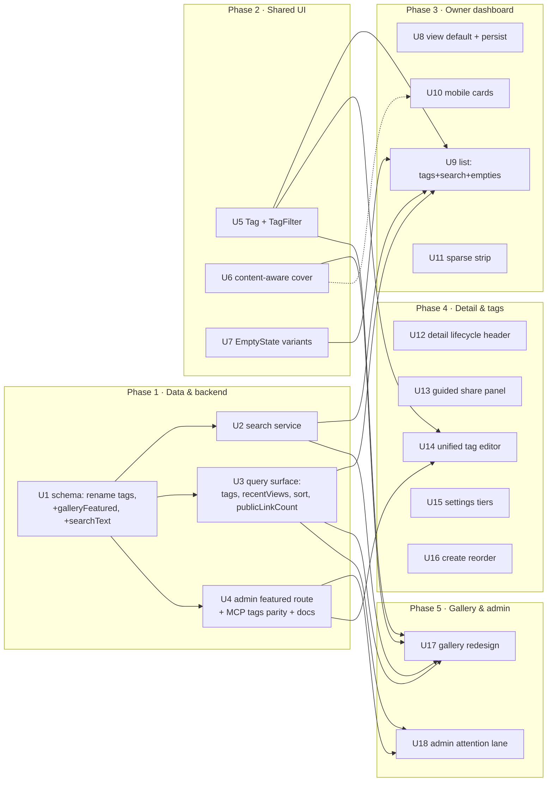

# feat: Dashboard UX Sweep — 13 Improvements (18 units)

> **Target worktree:** all work lands in the `feat/ux-sweep-top10` worktree, one autonomous sweep PR. Paths below are repo-relative. The 13 brainstorm improvements decompose into 18 implementation units.
>
> **Operating mode:** the instance is in maintenance mode with no users. Existing seed/gallery-tag data may be lost during the rename — that is acceptable; do not engineer migrations or contracts to preserve legacy data or support already-connected clients. Optimize for a clean, simple end state.

## Summary

A single dependency-ordered sweep that raises hierarchy, state clarity, mobile density, and scannability across the owner dashboard, gallery, canvas detail, create flow, and admin overview — plus three capability additions: unified canvas tags with a shared filter, a default-grid view with a persisted preference, and forgiving multi-field search. Backend changes are small and additive (one rename + two new columns, a few query/aggregate additions, one admin route, MCP/doc parity for tags). No screenshot-pipeline, trend-history, or audit-aggregation work.

Build order: **data/backend foundation → shared presentation primitives → owner dashboard → canvas detail & tags editing → gallery & admin.** The schema/query units gate everything that consumes the new fields; the shared `Tag`/`TagFilter`/cover/empty-state primitives gate the surfaces that render them.

---

## Problem Frame

The dashboard has strong foundations (semantic tokens, dark mode, deterministic generative covers, real skeleton/empty/error states, a coherent IA) but leans flat: sparse libraries get the full stats/filter chrome, empty states share one generic treatment, covers and the gallery read as undifferentiated walls, mobile cards crowd out title/context, draft canvases imply a live URL, the share tab repeats "publish first", risky settings look like routine ones, the create flow front-loads a backend toggle, and admin data is numerical rather than operational. Search matches only the title, tags live only in the gallery, and the list defaults to a dense view. This sweep addresses all of it in one pass while preserving the product's identity and the auth/access model.

See origin: `docs/brainstorms/2026-06-19-dashboard-ux-sweep-requirements.md` for the full requirements, acceptance criteria, and locked decisions.

---

## Requirements Traceability

Each brainstorm item (#1–#13) maps to one or more units below.

| Brainstorm item | Units |
|---|---|
| #1 Sparse "finish this" strip | U11 |
| #2 State-specific empty states | U7, U9 |
| #3 Content-aware fallback covers | U6 |
| #4 Gallery redesign + admin-curated featured | U3, U4, U17, U18 |
| #5 Mobile canvas cards | U10 |
| #6 Lifecycle-dominant detail header | U12 |
| #7 Guided share dependency flow | U13 |
| #8 Consequence-tiered settings (visual) | U15 |
| #9 Source-first create flow | U16 |
| #10 Operational admin "needs attention" lane | U3, U4, U18 |
| #11 Unified canvas tags + filtering | U1, U3, U4, U5, U9, U14 |
| #12 Default gallery view + persisted preference | U8 |
| #13 Smarter forgiving search | U1, U2 |

---

## Key Technical Decisions

**KTD1 — Forgiving search via a denormalized `searchText` column.** Add an additive nullable `searchText` text column = `normalize(title + summary + tags + slug)`, recomputed in the service layer on every write that touches those fields. Query = `normalize(q)` split into tokens, each matched with an **escaped** `LIKE '%token%'` (escape `\ % _` and use `ESCAPE '\'`, mirroring the existing search at `apps/server/src/db/repositories/canvases.ts`) AND-ed against `searchText`. This is the only way to get identical case/accent/spacing-forgiving matching on **both** SQLite and Postgres without dialect-specific FTS/trigram engines (see `docs/solutions/2026-06-13-dual-dialect-drizzle-seam.md`). **Pin the composition contract** so backfilled and live-maintained rows never diverge: `normalize(s) = lowercase(strip_accents(collapse_whitespace(trim(s))))`; null summary → `""`; tags joined in stored order with single spaces. Because `normalize()` is a TS util and tag-array flattening would be dialect-divergent in SQL, the migration only adds the column; a **one-time TS backfill** (a small script reusing `normalize()`) populates existing rows — not a SQL data step.

**KTD2 — Unified tags by hard-renaming `galleryTags` → `tags` everywhere.** One tag set per canvas drives both owner-list filtering and public gallery display. Rename the DB column **and** the wire/MCP field name (`apps/server` management input/output, `update_canvas` + `tool-kit` projections, dashboard `api.ts`, all consumers) in one atomic change — **no deprecated alias** (maintenance mode, no connected clients to keep working). If `drizzle-kit` emits DROP+ADD rather than `RENAME COLUMN` and existing tag data is lost, that is acceptable per the operating mode; do not hand-engineer a data-preserving migration. The migration must still apply cleanly on both dialects and keep the schema-parity test green.

**KTD3 — Featured is admin-curated; tags are owner-facing.** `galleryFeatured` (additive boolean) is set only via an admin-only route on the admin canvases surface — a cross-owner editorial action, exempt from per-account MCP parity (same model as public-link gating; see `docs/solutions/2026-06-13-auth-invariant-checklist.md`). It emits an audit event `canvas_feature` (with `meta: { featured: true|false }`) mirroring the `canvas_disable`/`canvas_enable` naming. Admin routes use **existence-404** semantics (a non-existent id → 404), the cross-owner exception — not the per-account "non-owned reads as not-found" rule. Tag editing **is** owner-facing, so it flows through the existing `update_canvas`/settings-update service wrapper and its MCP tool under the same `requireOwned` check.

**KTD4 — View-mode precedence: URL `?view=` > `localStorage` > default (grid).** Explicit toggles write `localStorage`; a URL param overrides for that visit without necessarily persisting. The stored value is read before first paint to avoid a layout flash.

**KTD5 — One `Tag` pill + one `TagFilter` control, shared everywhere.** A single pair of components renders identically in the owner list and gallery so tags look and behave the same wherever used; `TagFilter` is a compact multi-select popover (search + checkable tags) with active tags as removable chips, URL-driven (`?tag=`, multi-value).

**KTD6 — Content-aware covers keep the deterministic seed.** Extend `GenerativeCover` to overlay title/type/status text on the existing per-canvas OKLCH mesh; it stays `aria-hidden` (title remains the accessible affordance) and the access-gated real-screenshot path through `CanvasCover` is unchanged.

**KTD7 — Additive migration discipline.** All schema work generates Drizzle migrations for **both** dialects (`drizzle/pg/*` + `drizzle/sqlite/*`), keeps `schema.pg.ts`/`schema.sqlite.ts` in lockstep via shared column helpers, and keeps the schema-parity test + CI matrix green. The new columns (`galleryFeatured`, nullable `searchText`) are additive; the `tags` rename may drop legacy tag data (acceptable, per operating mode). `searchText` is populated by a one-time TS backfill (KTD1), not a SQL migration step.

---

## High-Level Technical Design

Dependency graph (phases gate left-to-right):



Search query shape (directional, not implementation spec):

```text
normalize(s) = lowercase( strip_accents( collapse_whitespace( trim(s) ) ) )   # null summary -> ""
searchText   = normalize( title + " " + summary + " " + tags.join(" ") + " " + slug )   # recomputed on every write touching these fields
esc(tok)     = tok.replace(/[\\%_]/g, ch => "\\" + ch)                          # escape LIKE metachars
match(q)     = normalize(q).split(" ").every(tok => searchText LIKE "%"+esc(tok)+"%" ESCAPE "\\")   # token AND, both dialects
```

---

## Scope Boundaries

In scope: all 13 brainstorm items, the additive backend listed, MCP/doc parity for tags, dual-dialect tests.

### Outside this sweep (from origin)
- Screenshot-capture pipeline / Chromium work — covers stay fallback-only.
- AI-spend trend history / week-over-week deltas (would need a snapshot table + job).
- Screenshot-failure tracking and audit-log aggregation in admin.
- Owner self-featuring and featured *ranking* logic (admin-curated only; a fixed display cap of 6 is in scope per U17, but no ranking beyond featured-then-recent).
- Backend behavior changes beyond the additive fields/aggregates here.

### Deferred to Follow-Up Work
- Optional DB index on `searchText` if list/gallery search shows latency at scale (low volume today).
- "See all featured" overflow view — U17 caps the featured row at 6 and silently drops the rest; the dedicated overflow/see-all view is deferred.

---

## Implementation Units

### U1. Dual-dialect schema + atomic `galleryTags`→`tags` rename, add featured + searchText
- **Goal:** Land the schema foundation and the full rename in one atomic, tree-green change — rename `galleryTags` → `tags`, add `galleryFeatured` (boolean, default false) and nullable `searchText` (text), generate both-dialect migrations, and update **every** `galleryTags` consumer so typecheck/tests stay green mid-sweep.
- **Requirements:** #4, #11, #13.
- **Dependencies:** none.
- **Files:** `schema.pg.ts`, `schema.sqlite.ts` (+ shared column helpers); generated `drizzle/pg/*`, `drizzle/sqlite/*`; the schema-parity test; **all `galleryTags` consumers** — `apps/server/src/routes/management.ts` (settings input + owner-view projection), `apps/server/src/mcp/server.ts` + `apps/server/src/mcp/tool-kit.ts` (update_canvas input/projection), `apps/server/src/canvas/settings-update.ts`, `apps/dashboard/src/lib/api.ts`, `apps/dashboard/src/components/CanvasList.tsx` (the `canvasTags()` reader), `apps/dashboard/src/routes/canvas.share.tsx`, and the ~22 dashboard + server test fixtures referencing `galleryTags`.
- **Approach:** Mirror the rename + two adds across both dialect builders via the shared helper so types stay inferred together. Generate one migration per dialect (`drizzle-kit generate` with each config). **Data-preservation is not required** — if drizzle emits DROP+ADD and legacy tag data is lost, that is acceptable (maintenance mode). Hard-rename the wire/MCP field too — **no alias**. Then sweep all consumers above to `tags` in the same commit so the build stays green. `searchText` is added as a nullable column here; population is a separate one-time TS backfill (see U2) reusing the shared `normalize()` — **not** a SQL step (migrations are pure `.sql`; tag-array flattening would be dialect-divergent).
- **Patterns to follow:** existing shared column helpers and the schema-parity test; the migration-generation workflow in AGENTS.md.
- **Test scenarios:**
  - Schema-parity test passes with the renamed column + two new columns present in both dialects.
  - Migration applies cleanly on a fresh DB in both dialects (the real-migration test path).
  - Typecheck + full suite green after the consumer sweep (no lingering `galleryTags` reference) on both dialects.
  - `Test expectation: none` for the rename's data behavior — legacy tag loss is acceptable and intentionally untested.
- **Verification:** `pnpm lint && pnpm typecheck && pnpm test` green on both legs; both migration dirs contain the new migration; no `galleryTags` identifier remains in the repo.

### U2. Forgiving search service
- **Goal:** Implement portable normalized-substring search across title + summary + tags + slug, maintained via `searchText` and matched with escaped token-AND `LIKE`, across both the owner-list/MCP path and the separate gallery path.
- **Requirements:** #13.
- **Dependencies:** U1.
- **Files:** the shared `normalize()` util; the owner-list/MCP repo method `listByOwnerFiltered` and the separate gallery method `listGallery` (`apps/server/src/db/repositories/canvases.ts`); the write paths that touch the search fields — `create()`, `updateSettings` (via `apps/server/src/canvas/settings-update.ts`), and `regenerateSlug()` (`canvases.ts`, called by `management.ts` and `mcp/server.ts` `set_canvas_slug`); a one-time `searchText` backfill script; server search tests.
- **Approach:** There is **no single shared list query** — owner-list and MCP `list_canvases` share `listByOwnerFiltered`, but the gallery uses `listGallery` (today they even search different fields: owner-list title+slug, gallery title+summary). Factor the token-AND predicate into a shared helper and apply it against `searchText` in **both** methods so both converge. Escape `\ % _` per token and use `ESCAPE '\'` (KTD1). Recompute+persist `searchText` from a single repo-level helper invoked by **create, updateSettings, and regenerateSlug** (note: deploy does NOT touch these fields — do not rely on it). Run the one-time backfill over existing rows.
- **Patterns to follow:** the existing escaped `?q=` predicate in `canvases.ts` and its dual-dialect test pattern; `deps.usage.recentViewCounts` for the rank-then-hydrate shape.
- **Test scenarios:**
  - Substring of a **title** finds the canvas; substring of **summary**, a **tag**, and the **slug** each find it.
  - Case-only, whitespace-only, and accent-only query differences still match.
  - A two-word query matches a canvas where the words live in different fields (title + tag).
  - AND semantics: a non-matching token returns nothing; partial-token matches return nothing.
  - A query containing a literal `%` or `_` matches that character literally, not as a wildcard.
  - **Slug rename keeps search correct:** rename a slug, then search by the new slug finds it and the old slug does not.
  - Editing title/tags updates `searchText`; identical results on both dialect legs; MCP `list_canvases` `q` inherits the behavior.
- **Verification:** dual-dialect search tests green; manual `?q=` in owner list + gallery behaves forgivingly; renamed-slug search verified.

### U3. Query surface: tags, recentViews, sort, publicLinkCount
- **Goal:** Add the genuinely-missing query surface for the presentation units — a `galleryFeatured` field on `GalleryItem`, an extended `GallerySort`, owner-list multi-tag filtering, the gallery's net-new trending aggregate + single→multi tag conversion, and `AdminOverview.publicLinkCount`.
- **Requirements:** #4, #10, #11.
- **Dependencies:** U1.
- **Files:** `apps/dashboard/src/lib/api.ts` (`GalleryItem`, `GallerySort`, `GalleryQuery`, `CanvasesQuery`, `AdminOverview`), `apps/dashboard/src/lib/queries.ts`; `apps/server/src/db/repositories/canvases.ts` (`listGallery`, `GallerySort`, `GalleryListOptions`, owner-list options), `apps/server/src/routes/gallery.ts`, the admin-overview query (`apps/server/src/routes/admin.ts`); server query tests.
- **Approach:** Note what already exists: `GalleryItem.tags` and `CanvasListItem.recentViews` are **already** on the dashboard types — no add needed there. The real work:
  - Add `galleryFeatured` to `GalleryItem` (so cards can show a Featured badge and the row can filter).
  - Extend `GallerySort` (client `api.ts` + server `canvases.ts`, currently `published|updated|title`) to add `featured` and `trending`; map featured = `galleryFeatured` desc then recent, trending = `recentViews` desc, recent = `publishedAt` desc.
  - **Gallery trending is net-new:** `listGallery` does not aggregate `usage_events` today — add the rank-then-hydrate aggregate reusing `deps.usage.recentViewCounts` (the owner-list pattern) and expose `recentViews` on `GalleryItem`.
  - **Owner-list tag filter is net-new:** add a multi-value `tag` to `CanvasesQuery`/owner-list options (no owner-list tag filter exists today).
  - **Gallery tag filter single→multi:** change `GalleryQuery.tag`/`GalleryListOptions.tag` from `string` to `string[]`, generate one membership clause per tag (template off the existing single-tag predicate), and update URL serialization. **Semantics: any-match** (a canvas matches if it carries any selected tag), consistent with the current single-tag membership — assert this explicitly.
  - Add `publicLinkCount` = count of **active** canvases with `access = public_link` to `AdminOverview` (align scope with the actionable `canvasCountByStatus`).
- **Patterns to follow:** existing FilterBar/URL-param filters; the gallery's existing membership tag predicate; `deps.usage.recentViewCounts`; existing `AdminOverview` aggregates.
- **Test scenarios:**
  - Owner-list `?tag=a&tag=b` returns canvases carrying **any** of the tags (asserted any-match).
  - Gallery multi-tag filter ANY-matches across selected tags and is URL-shareable.
  - Gallery `sort=trending` orders by `recentViews`; `sort=recent` by `publishedAt`; `sort=featured` puts featured first.
  - `galleryFeatured` present on `GalleryItem`; featured filter returns only listed+published+featured.
  - `publicLinkCount` equals a manual count of active public-link canvases.
  - Identical ordering/results on both dialects.
- **Verification:** dual-dialect query tests green; payloads carry the new fields; sort/tag params URL-shareable.

### U4. Admin featured route + MCP tags parity + docs
- **Goal:** Add the admin-only set-featured action, bring unified tags to MCP parity via `update_canvas`, and update docs for tags + search.
- **Requirements:** #4, #10, #11.
- **Dependencies:** U1.
- **Files:** the admin canvases route/service in `apps/server` (admin guard + audit); the `update_canvas` service + its MCP tool definition; docs sources (`/docs` content, `llms.txt`, and developer/marketing docs that describe tags or search); route/MCP tests.
- **Approach:** Admin set-featured toggles `galleryFeatured`, admin-only (behind the existing `requireAdmin` router), emitting audit event `canvas_feature` with `meta: { featured: true|false }` (mirroring `canvas_disable`/`canvas_enable`); admin routes use existence-404 (the cross-owner exception), not the owner-not-found rule. For tags, the MCP `update_canvas` and settings-update path **already accept `galleryTags`** — the work is the field-key **rename** to `tags` at the input boundary (done atomically in U1's consumer sweep), keeping the `requireOwned` owner check. Update docs to describe canvas tags + forgiving search; keep MCP/UI parity language accurate.
- **Patterns to follow:** existing admin routes + `recordAudit` events (`canvas_disable`/`enable`/`restore`); the `update_canvas` service-wrapper pattern; `docs/solutions/2026-06-13-auth-invariant-checklist.md`.
- **Test scenarios:**
  - Admin can set/unset `galleryFeatured`; a non-admin is rejected; the audit log contains a `canvas_feature` event with the actor + target + `featured` meta.
  - Setting featured on a non-existent id → 404 (existence-404 admin semantics).
  - `update_canvas` sets `tags` over MCP under `requireOwned`; a non-owner id reads as not-found.
  - `update_canvas` tag write updates `searchText` (integration with U2).
  - Docs build/lint passes; tag + search capabilities are documented.
- **Verification:** route + MCP tests green; docs updated and consistent with the parity rule.

### U5. Shared Tag + TagFilter components
- **Goal:** Reuse the existing `Tag` pill consistently and build one space-optimal `TagFilter` control, with all interaction states defined, for owner list and gallery.
- **Requirements:** #11.
- **Dependencies:** none (UI-only; consumes `?tag=` wired in U3/U9/U17).
- **Files:** `apps/dashboard/src/components/Tag.tsx` (**already exists** — reuse/extend its `xs`/`sm` + tone API only if a new use-site needs it), `apps/dashboard/src/components/TagFilter.tsx` (**new**); tokens in `apps/dashboard/src/styles/tokens.css`.
- **Approach:** `Tag` is the canonical pill, already matching the gallery visual — do not recreate it. `TagFilter` = compact multi-select popover (search field + checkable tag list) with active selections as removable chips, URL-driven `?tag=` (multi). Defined states (resolve here before U9/U17 consume it):
  - **Overflow:** popover tag list caps at ~240px height (≈8 rows) and scrolls; no virtualization.
  - **Zero tags:** when no tags exist in scope, the trigger is hidden entirely (not a disabled stub).
  - **Mobile (< 640px, matching U10's breakpoint):** the control opens as a bottom-sheet, not a floating popover, so touch targets and viewport width hold.
  - **Focus management:** opening focuses the search field; `Esc` closes and returns focus to the trigger; arrow keys navigate the checkable list; removing the last active chip returns focus to the trigger.
- **Patterns to follow:** existing `Tag` pill, `FilterChip`/`FilterSelect`, Phosphor usage, token-only colors; the aria combobox/listbox pattern for the popover.
- **Test scenarios:**
  - `TagFilter` lists available tags, filters them by its search field, toggles selection, renders removable active chips, and updates `?tag=` (multi); clearing removes them.
  - Overflow: with many tags the list scrolls within the height cap.
  - Zero-tags: the trigger is absent.
  - Keyboard: open focuses search, `Esc` returns focus to trigger, arrows navigate, last-chip removal returns focus to trigger.
  - Narrow viewport renders the bottom-sheet variant.
- **Verification:** component tests green; visual parity in list + gallery confirmed in later units.

### U6. Content-aware fallback cover
- **Goal:** Make the generative fallback cover embed title/type/status so covers aid recognition, while keeping real screenshots and the deterministic seed.
- **Requirements:** #3.
- **Dependencies:** none.
- **Files:** `apps/dashboard/src/components/GenerativeCover.tsx`, `apps/dashboard/src/components/CanvasCover.tsx`.
- **Approach:** Keep the FNV-1a-seeded OKLCH mesh; overlay legible title + a small type/status marker (mapping "type" to the existing concept badges: canvas/template/listed/protected). The title is clamped to 2 lines with ellipsis at a fixed token-sized font so long titles stay legible and don't overflow the cover. Stays `aria-hidden`; title remains the accessible affordance. `CanvasCover` still prefers the access-gated `previewCoverUrl` when `hasPreview`, falling back to the upgraded `GenerativeCover`. No new runtime image deps; no aspect-ratio/layout change.
- **Patterns to follow:** current `GenerativeCover` seed + hue logic; concept badge taxonomy.
- **Test scenarios:**
  - Two canvases differing only in title/type/status render visibly distinct fallback covers.
  - A long title clamps to 2 lines with ellipsis (no overflow past the cover bounds).
  - Cover remains deterministic for a given canvas id across renders.
  - With `hasPreview` true, the screenshot path is used; on image error it falls back to the generative cover.
  - Cover stays `aria-hidden`; no console errors; no layout shift vs. current dimensions.
- **Verification:** component tests green; gallery/list visually differentiated in later units.

### U7. State-specific empty states
- **Goal:** Extend the shared `EmptyState` so archived / search / filtered / gallery / first-run each get distinct copy and one targeted action, preserving context.
- **Requirements:** #2.
- **Dependencies:** none.
- **Files:** `apps/dashboard/src/components/EmptyState.tsx` (extend; keep the single component), consumers wired in U9 (list) and U17 (gallery).
- **Approach:** Provide per-state copy + a single action node: archived → "View active canvases"; search → "Clear search" (clears only `q`); filtered → "Clear all filters"; gallery → "Clear filters"/"Browse docs"; first-run → "Create a canvas" (+ docs link). Keep the forbidden-generic-copy guard.
- **Patterns to follow:** existing `EmptyState` API (title/description/action/icon) and its specific-copy constraint.
- **Test scenarios:**
  - Each state renders its distinct copy + correct single action.
  - The search empty action clears only `q` and preserves other active filters (asserted at integration in U9).
  - No state renders the forbidden generic strings.
- **Verification:** component tests green; integrated states verified in U9/U17.

### U8. Default gallery view with persisted preference
- **Goal:** Owner list defaults to grid; explicit switch to list persists to `localStorage`; `?view=` overrides; no layout flash.
- **Requirements:** #12.
- **Dependencies:** none.
- **Files:** `apps/dashboard/src/routes/index.tsx` (view-mode resolution + SegmentedControl).
- **Approach:** Resolve view as `urlParam ?? localStorage ?? "grid"`. On explicit toggle, write `localStorage` (per-device). Read the stored value before first paint (synchronous read in the initial state / `useLayoutEffect`) so the correct layout renders without a grid→list flash. URL param wins for the visit and is shareable.
- **Patterns to follow:** existing `?view=` SegmentedControl handling.
- **Test scenarios:**
  - No stored pref + no param → grid.
  - Toggle to list, reload without param → list (persisted).
  - `?view=grid` link wins over a stored "list" preference.
  - No flash of the wrong layout on mount (assert initial render matches resolved mode).
- **Verification:** behavior tests green; manual reload confirms persistence + no flash.

### U9. Owner list: tag filter, smarter search, per-state empties
- **Goal:** Wire the shared `TagFilter` and forgiving search into the owner list, and connect the correct per-state empty states.
- **Requirements:** #2, #11, #13.
- **Dependencies:** U2, U3, U5, U7.
- **Files:** `apps/dashboard/src/routes/index.tsx`, `apps/dashboard/src/components/CanvasList.tsx`, `apps/dashboard/src/components/Filters.tsx`.
- **Approach:** Add `TagFilter` to the owner-list controls (URL `?tag=` multi). The `?q=` search now hits the forgiving backend (U2). Render `Tag` pills on rows/cards. Select the empty-state variant by context: zero results with a search term → search empty (Clear search); with non-search filters → filtered empty (Clear all filters); archived scope empty → archived empty; truly no canvases → first-run.
- **Patterns to follow:** existing URL-driven FilterBar; `CanvasList` row/card; U5/U7 components.
- **Test scenarios:**
  - Filtering by one and multiple tags narrows the list and is URL-shareable.
  - Searching uses forgiving matching (case/accent/partial) over the new fields.
  - Zero-result with a search term shows the search empty; "Clear search" preserves other filters.
  - Zero-result with active non-search filters shows the filtered empty with "Clear all filters".
  - Archived scope with none shows the archived empty.
  - Tag pills render via the shared `Tag` component.
- **Verification:** route/component tests green; manual filter+search+empty flows correct.

### U10. Mobile canvas card redesign
- **Goal:** Stacked mobile card with full-width primary action, secondary actions in overflow, and bulk checkbox only in selection mode.
- **Requirements:** #5.
- **Dependencies:** U6 (cover) recommended for visual consistency; not strictly blocking.
- **Files:** `apps/dashboard/src/components/CanvasList.tsx`.
- **Approach:** On narrow viewports, stack cover → title/status/meta → full-width primary action, with secondary actions collapsed into an overflow menu. Hide the bulk-select checkbox until selection mode is explicitly entered. Ensure all icon-only actions have accessible names.
- **Patterns to follow:** existing `CanvasCard`/`CanvasRow`, Button sizes, Phosphor icons, BulkActionBar.
- **Test scenarios:**
  - At a narrow width, title + status are always visible and not truncated by actions.
  - Primary action is full-width; secondary actions live in the overflow menu.
  - Bulk checkbox is absent until selection mode is entered, then present.
  - Icon-only actions expose accessible names.
- **Verification:** component tests green; responsive check at mobile widths.

### U11. Sparse "finish this" strip
- **Goal:** Add an additive "finish this canvas" strip above the normal list when the library is sparse; keep stats + filters intact.
- **Requirements:** #1.
- **Dependencies:** U3 (status/data on items); does not replace the list.
- **Files:** `apps/dashboard/src/routes/index.tsx`, a new strip component under `apps/dashboard/src/components/`.
- **Approach:** Sparse trigger (default): ≤ 3 active canvases **or** the most-recently-touched canvas is a draft. Surface **one** canvas — the most recently touched unfinished/draft one — with title, status, the single next step ("Publish to get a live URL"), and primary actions (Open draft / Publish; Share when published). The strip is **condition-driven only — no user-dismiss control**; it hides automatically at the zero-state (Onboarding owns that) and once the library grows past the threshold.
- **Patterns to follow:** PublicationBadge/status, DeployButton/publish actions, PageHeader/Panel idiom.
- **Test scenarios:**
  - With ≤ 3 active canvases including a draft, the strip appears for the most-recent draft with the correct next step.
  - With many canvases, the strip is absent.
  - At zero canvases, the strip is absent (Onboarding shows).
  - Primary action matches the canvas's state (Open draft / Publish).
  - Strip is keyboard-reachable.
- **Verification:** route tests green across sparse/dense/zero states.

### U12. Lifecycle-dominant detail header
- **Goal:** Drafts lead with "Draft — not live yet" + Open draft / Publish; de-emphasize the public URL until reachable. Published unchanged.
- **Requirements:** #6.
- **Dependencies:** none.
- **Files:** `apps/dashboard/src/routes/canvas.tsx` (detail chrome), `apps/dashboard/src/routes/canvas.overview.tsx`.
- **Approach:** When `publicationState !== "published"` (`currentVersionId === null`), reframe the header around the draft state with Open draft + Publish as primaries and the public URL/external-open visually de-emphasized. Leave published canvases' emphasis as today. **Archived/disabled headers are explicitly left unchanged** — render the existing header + actions (Unarchive for archived; none for disabled/deleted) with no draft-state reframing, so the new framing applies only to the draft↔published axis.
- **Patterns to follow:** PublicationBadge, DeployButton, CanvasDetailChrome.
- **Test scenarios:**
  - An unpublished canvas header never presents the public URL as live; primaries are Open draft + Publish.
  - A published canvas header is unchanged.
  - Archived renders the existing Unarchive action; disabled/deleted render existing (no draft reframing applied).
- **Verification:** route tests green for each publication state.

### U13. Guided share dependency flow
- **Goal:** Replace repeated "publish first" notices + disabled rungs with a single locked panel when unpublished; reveal the full ladder when published.
- **Requirements:** #7.
- **Dependencies:** U12 (consistent lifecycle framing); independent files.
- **Files:** `apps/dashboard/src/routes/canvas.share.tsx`.
- **Approach:** When not published, render one locked panel that explains the blocker once with a Publish / Open-draft CTA, instead of multiple inline notices over disabled sections. When published, show the existing access ladder/people/locks/gallery sections. Preserve the existing `shareBlocker`/`listBlocker` logic as the gating source of truth. **Publish transition:** the Publish CTA fires the existing publish mutation, then invalidates/refetches the canvas-detail query; the resulting `publicationState` change re-renders the tab with the access ladder revealed in place — **no navigation or manual reload**.
- **Patterns to follow:** existing share sections, InlineNotice, the `shareBlocker`/`listBlocker` rules.
- **Test scenarios:**
  - Unpublished: one blocker explanation (not multiple) with a working CTA; access controls not shown as live.
  - Published: ladder, people, locks, gallery sections appear as today.
  - `listBlocker` (publish + shared + no password) still gates gallery listing.
- **Verification:** route tests green for unpublished/published.

### U14. Unified tag editor on canvas detail
- **Goal:** Replace the gallery-only tags input with a unified `tags` editor using the shared `Tag` component, writing via the existing canvas update mutation, with copy clarifying tags are public when listed.
- **Requirements:** #11.
- **Dependencies:** U1, U4, U5.
- **Files:** `apps/dashboard/src/routes/canvas.share.tsx` (current gallery-tags input) and/or the relevant detail section; `apps/dashboard/src/lib/queries.ts` (update mutation).
- **Approach:** Surface the unified `tags` as a first-class editable property with the shared `Tag` visual + an add/remove control; persist through the existing update path (which already carries MCP parity via U4). Defined input mechanics: a text input where **Enter or comma confirms** a tag, each tag removable via its `×`; values are **trimmed + lowercased on confirm** to match the search normalization and dedupe with the `TagFilter` vocabulary; enforce the existing limits — **max 20 tags, max 50 chars each** (matching the `update_canvas` zod schema `z.array(z.string().max(50)).max(20)`). Existing tags across the owner's canvases may be offered as autocomplete suggestions. Clarify in copy that tags appear publicly in the gallery once the canvas is listed.
- **Patterns to follow:** existing gallery-tags editing, Field/TextareaField, the canvas update mutation, the `update_canvas` tag zod limits.
- **Test scenarios:**
  - Enter and comma each confirm a tag; the `×` removes one; values are trimmed + lowercased on confirm.
  - Exceeding 20 tags or a 50-char tag is rejected/blocked consistently with the server schema.
  - Adding/removing tags persists and reflects on both the owner list and gallery.
  - The editor uses the shared `Tag` component (visual consistency).
  - Copy communicates public-when-listed; editing tags updates search (integration with U2).
- **Verification:** route/mutation tests green; tags round-trip across surfaces.

### U15. Consequence-tiered settings (visual only)
- **Goal:** Re-tier settings rows into routine / visibility-changing / credential / destructive with clearer affordance and consequence copy — no change to the confirmation flow.
- **Requirements:** #8.
- **Dependencies:** none.
- **Files:** `apps/dashboard/src/routes/canvas.settings.tsx`.
- **Approach:** Apply tiered visual treatment to the existing rows, using existing tokens/components (not novel colors): **routine** (SPA routing) = default row styling; **visibility-changing** (slug, preview mode) = a neutral/info Badge next to the label; **credential** (regenerate deploy key) = an amber/warning Badge + helper text; **destructive** (archive, delete) = the existing `danger` Button variant + a Phosphor `Warning`/`ShieldWarning` icon. Leave the existing `ConfirmDialog` states (slug/key/archive/unpublish/delete) and flow exactly as-is.
- **Patterns to follow:** existing Section/Row, Badge tones, danger Button variant, `ConfirmDialog`.
- **Test scenarios:**
  - Each tier is visually distinct; destructive/credential rows read as higher-consequence.
  - Every existing confirmation still fires with the same dialog state and behavior (no flow change).
  - `Test expectation: none` for pure styling beyond the confirmation-unchanged assertions.
- **Verification:** settings tests green; confirmations unchanged.

### U16. Source-first create flow
- **Goal:** Reorder create to source → name/slug → optional backend; surface the "Use the API" snippet earlier as a distinct path.
- **Requirements:** #9.
- **Dependencies:** none.
- **Files:** `apps/dashboard/src/routes/new.tsx`.
- **Approach:** Present the source/method choice first, then name/slug, then the now-clearly-optional `backendEnabled` toggle, then create/publish. Keep "Use the API" as a distinct agent/script path with its one-time key + curl snippet surfaced earlier. Preserve slug validation gating and all four methods (paste/folder/zip/api).
- **Patterns to follow:** existing METHODS array, SlugField validation, ApiKeyReveal, deployCurl.
- **Test scenarios:**
  - The backend toggle no longer precedes source choice.
  - Slug validation still gates submit (unavailable slug blocks).
  - The API path returns the one-time key + working curl snippet.
  - All four methods still create successfully.
- **Verification:** create-flow tests green; each method exercised.

### U17. Gallery redesign for scanning
- **Goal:** Featured row, recent row, top-tag shortcut chips, sort dropdown, clearer owner/type metadata, prominent "Use template".
- **Requirements:** #4.
- **Dependencies:** U2, U3, U5, U6, U7.
- **Files:** `apps/dashboard/src/routes/gallery.tsx`.
- **Approach:** Add a Featured row (admin-curated, listed+published only), a Recently-published row, top-tag chips (from existing tags) that filter via `?tag=`, and a sort dropdown (Featured/Trending/Recent/Title) driven by U3. Render `Tag` (U5) and the content-aware cover (U6); make "Use template" prominent on templatable items; use the gallery empty variant (U7). Forgiving search (U2) applies. **Featured row cap = 6 items** — items beyond 6 are silently dropped for now (no overflow affordance); the "see all featured" overflow view is the deferred follow-up. The Recently-published row is a horizontal strip above the main paginated grid (a separate slice of the gallery query), distinct from the Recent *sort* of the grid.
- **Patterns to follow:** existing GalleryCard, masonry layout, clone/Use-template action, `?tag=` filter.
- **Test scenarios:**
  - Featured row shows only admin-featured + listed + published; a canvas that unlists/unpublishes drops out (enforced at query time via the gallery visibility predicate, so a stale-true `galleryFeatured` never surfaces a non-visible canvas).
  - Featured row renders at most 6 items even when more are flagged.
  - Sort Trending/Recent/Featured/Title order correctly.
  - Top-tag chips reflect actual tags and filter on click.
  - Search is forgiving across fields; the gallery empty variant shows with "Clear filters".
  - Covers and tag pills render via the shared components.
- **Verification:** gallery tests green; manual scan flows correct.

### U18. Admin "needs attention" lane + featured toggle UI
- **Goal:** Add an operational attention lane from derivable signals, each linking to its admin table row/filter, plus the admin Featured toggle UI.
- **Requirements:** #4, #10.
- **Dependencies:** U3, U4.
- **Files:** `apps/dashboard/src/routes/admin.tsx`, `apps/dashboard/src/routes/admin.canvases.tsx`.
- **Approach:** Build the lane from: public-link count (U3), disabled/deleted counts (`canvasCountByStatus`), purge backlog age (`oldestDeletedAt`), top AI spenders (existing per-canvas usage), top-usage canvases (`topCanvases`) — each linking to the corresponding filtered admin canvases view. Add the admin Featured toggle action on the canvases table calling the U4 route (admin-only). No trend-delta or screenshot-failure UI.
- **Patterns to follow:** existing Metric/SpendPanel, AdminCanvasTable filters, admin route actions.
- **Test scenarios:**
  - Each attention item links to the correct filtered admin table view.
  - Public-link count matches a manual count.
  - The Featured toggle flips `galleryFeatured`, is admin-only, and reflects in the table + gallery.
  - No trend-delta/screenshot-failure UI is present.
- **Verification:** admin tests green; links resolve to the right filtered views.

---

## Risks & Dependencies

- **Atomic rename or red tree** (highest mechanical risk) — `galleryTags` has ~39 source refs + ~22 test fixtures across server and dashboard. U1 must rename *every* consumer (DB, wire/MCP field, `CanvasList.tsx` reader, `api.ts`, share tab, fixtures) in the same commit, or typecheck/tests go red mid-sweep. The U1 verification ("no `galleryTags` identifier remains") guards this.
- **Tag data loss on rename** — accepted per operating mode (maintenance, no users); if `drizzle-kit` emits DROP+ADD, legacy tags are lost and that is fine. Not mitigated by design.
- **Dual-dialect drift** on the new columns and queries — mitigated by the schema-parity test + CI matrix and shared column helpers (`docs/solutions/2026-06-13-dual-dialect-drizzle-seam.md`).
- **`searchText` write-path coverage** — must recompute on create, `updateSettings`, AND `regenerateSlug` (NOT deploy, which is a no-op for these fields); a missed path silently rots search. One repo-level helper + the slug-rename test (U2) guard this.
- **`searchText` backfill model** — populated by a one-time TS script (not a SQL migration step), since `normalize()` is TS and tag-array flattening is dialect-divergent. The fresh-DB migration test does not exercise the backfill; run/verify the backfill separately.
- **Search semantics & performance** — escaped token-AND `LIKE '%…%'` on `searchText` is fine at current volume; a `searchText` index is deferred follow-up if latency appears.
- **Admin featured authorization** — admin-only (existing `requireAdmin` router), audited as `canvas_feature`, existence-404; follow `docs/solutions/2026-06-13-auth-invariant-checklist.md`; run `/ce-code-review` before the PR (auth-shaped change — give U4 focused attention even if a large batch review rates it low).
- **View-mode hydration flash** (U8) — pure client SPA (no SSR), so reading `localStorage` synchronously before first render avoids any flash; lower-risk than a hydrated app.
- **Sweep size** — 18 units in one PR; mitigated by phase ordering, one commit per unit, gates green per unit, and the pre-PR multi-agent review.
- **CI/test infra** — see `docs/solutions/2026-06-13-ci-and-test-infra-gotchas.md` when adding the new dual-dialect tests.

---

## Documentation Impact

- Update `/docs` content + `llms.txt` (and developer/marketing docs as applicable) for unified canvas tags and forgiving search (U4). The `docs-refresh` / `docs-fact-refresh` skills can verify claims against code after the sweep.

---

## Sources & Research

- Origin requirements: `docs/brainstorms/2026-06-19-dashboard-ux-sweep-requirements.md`.
- Code dossier (this session): owner list `apps/dashboard/src/routes/index.tsx`, `components/CanvasList.tsx`; empty state `components/EmptyState.tsx`; covers `components/GenerativeCover.tsx`, `components/CanvasCover.tsx`; gallery `routes/gallery.tsx`; detail `routes/canvas.tsx`, `routes/canvas.overview.tsx`; share `routes/canvas.share.tsx`; settings `routes/canvas.settings.tsx`; create `routes/new.tsx`; admin `routes/admin.tsx`, `routes/admin.canvases.tsx`; types/queries `lib/api.ts`, `lib/queries.ts`; tokens `styles/tokens.css`.
- Learnings: `docs/solutions/2026-06-13-dual-dialect-drizzle-seam.md`, `docs/solutions/2026-06-13-auth-invariant-checklist.md`, `docs/solutions/2026-06-13-ci-and-test-infra-gotchas.md`.
- No external research — established internal stack, strong local patterns.

---

## Execution Posture

Default posture, with backend units gating UI units. For U1/U2/U4 (schema, search, auth-shaped admin/MCP), prefer writing the dual-dialect / authorization tests alongside the change. Run `pnpm lint && pnpm typecheck && pnpm test` per unit; `/ce-code-review` before the PR (fix P0/P1 + high-value P2 with regression tests); merge only on a green CI matrix.
