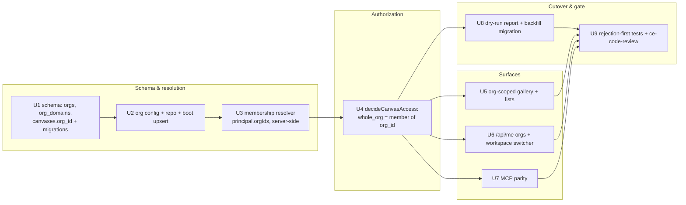

# feat: Tenancy Phase 1 — Org Boundary (9 units)

> **Target worktree:** `feat/multi-tenant-orgs`, one PR. Paths are repo-relative; line-level
> detail came from a code scan and is re-verified during implementation.
>
> **Invariant-critical (§12).** This re-scopes the `whole_org` rung of `decideCanvasAccess` — an
> authorization change on a live access path. A multi-agent `/ce-code-review` (security +
> adversarial personas at minimum) is a **required gate** before this PR merges; weight findings
> against the trust model in `docs/solutions/2026-06-13-auth-invariant-checklist.md`. Test
> **rejection paths first**.
>
> **Operating mode:** there are real users + shares on the live instance, so this is **NOT** a
> wipe-and-reseed. Migrations are additive + idempotent; the cutover (U8) ships a dry-run report.

## Summary

Introduce the **org boundary** that solves the stated leak: brought-in guests (Gmail / other
domains) can no longer see content shared "with the org." A canvas gains a **home tenant**
(`org_id`, null = the owner's personal space); the caller's **org membership** is resolved
server-side from their verified email domain; and the existing `whole_org` access rung is
re-scoped from "any signed-in principal" to "**a member of the canvas's home org**" — enforced in
the one authorization table, `decideCanvasAccess`, with no second seam. The org gallery filters to
members. The dashboard gains a Personal/Org workspace surface; `/api/me` carries the caller's orgs;
MCP inherits the scoping through the shared service layer. A dry-run report + an additive,
idempotent migration auto-scopes existing data.

Build order: **schema → org config/repo → membership resolver → authorization re-scope → gallery /
dashboard / MCP → cutover → invariant tests + review.** The schema gates everything; the resolver
gates the authorization change; the authorization change gates the surfaces.

---

## Problem Frame

Today `whole_org` resolves to "any principal that passed the org gateway." Once you allowlist a
Gmail address to collaborate on one canvas, that guest is inside the same pool, so `whole_org`
shares and the gallery leak to them. There is no per-canvas org scoping and no member/guest
distinction beyond "can you sign in." This phase draws the boundary with the **smallest** surface
that is also multi-org-ready: one new column on `canvases`, two small tables, a server-side
membership resolver, and a one-rung change to the authorization table. See origin brainstorm for
the full model, the locked decisions (D1–D11), and requirements (R1–R8, R12, R-sec).

---

## Requirements Traceability

| Requirement | Units |
|---|---|
| R1 Org + domains model | U1, U2 |
| R2 Canvas home tenant (`org_id`) | U1 |
| R3 Member/guest classification at login | U3 |
| R4 Re-scope `whole_org` | U4 |
| R5 Org-scoped gallery + lists | U5 |
| R6 Workspace surface + `/api/me` | U6 |
| R7 MCP parity | U7 |
| R8 Cutover migration (auto-scope) | U8 |
| R12 Safe cutover tooling (dry-run) | U8 |
| R-sec Invariant tests (rejection-first) | U3, U4, U9 |

---

## Key Technical Decisions

**KTD1 — Personal space = `org_id IS NULL`.** A first-class workspace in the UI, but needs no
table: a canvas with no org is personal. Keeps the schema minimal and the "every user has a
personal space" model (D9) trivially true.

**KTD2 — Membership is DERIVED from domain in Phase 1.** No `org_members` table yet. The resolver
computes membership = `lower(emailDomain(user.email)) ∈ org_domains`. Always consistent with the
operator's domain map, no stale-row reconciliation, fewer moving parts. Explicit membership rows
(needed for teams + future invited cross-domain members) arrive in **Phase 2**; the resolver
interface is shaped so P2 swaps derivation for a union of (derived ∪ explicit) without touching
callers.

**KTD3 — One authorization seam.** The isolation change lives **only** in `decideCanvasAccess`
(the §12 default-deny table). `whole_org` gains the predicate `viewer.orgIds.has(canvas.orgId)`;
personal canvases (`orgId null`) can never satisfy `whole_org`/`team`. **Do not** add a parallel
"requireTenant" guard — the checklist's lesson is that a second seam drifts from the first. Owner
editing stays `requireOwnedCanvas` (unchanged); admins remain ordinary members for others'
canvases.

**KTD4 — Config-first org, materialized at boot.** The operator defines the member org via config
(`CANVAS_DROP_ORG_NAME`, `CANVAS_DROP_ORG_DOMAINS` defaulting to `ALLOWED_EMAIL_DOMAINS`) — config
is the only `process.env` reader (§8.1). A boot step upserts the org + its domains into `orgs` /
`org_domains` (mirrors how admin emails are reconciled at boot), so config stays the source of
truth and the DB rows are a materialization. Phase 3 will let DB rows lead for additional orgs.

**KTD5 — Additive dual-dialect migration discipline.** New tables + the nullable `canvases.org_id`
are additive. Generate migrations for **both** dialects (`drizzle/pg/*` + `drizzle/sqlite/*`), keep
`schema.pg.ts` / `schema.sqlite.ts` in lockstep via shared column helpers, keep the schema-parity
test + CI matrix green. No destructive rewrite of live data (the production DB is not wiped).

**KTD6 — Auto-scope is emergent, not a per-row rewrite.** Once `canvases.org_id` is backfilled
(by owner domain) and `decideCanvasAccess` re-scopes `whole_org`, existing `whole_org` canvases
become members-only **automatically** — there is no need to rewrite each canvas's `access` value.
The backfill only sets `org_id`; `specific_people`/`private`/`public_link` rows are untouched.

**KTD7 — Sign-in gate unchanged; guests stay invite-only.** A guest is simply a signed-in user
whose email matches no org domain. The existing gate (`ALLOWED_EMAIL_DOMAINS` + `allowed_emails`
allowlist) is unchanged; open self-signup is a **deferred toggle** (D8, Phase 4). Proxy mode keeps
its current posture (external rungs disabled; guest resolver *not mounted*).

---

## High-Level Technical Design

---

## Implementation Units

### U1. Schema — `orgs`, `org_domains`, `canvases.org_id`
- **Files:** `packages/shared/src/db/schema.sqlite.ts`, `schema.pg.ts` (shared column helpers);
  generated `drizzle/sqlite/*` + `drizzle/pg/*`; `BACKUP_TABLE_ORDER` in
  `apps/server/src/ops/backup.ts` (add the two new tables, FK-ordered: `orgs` before
  `org_domains`, both before `canvases`); the schema-parity + backup-order tests.
- **Behavior:** `orgs(id, name, slug unique, created_at)`; `org_domains(id, org_id FK→orgs,
  domain unique, created_at)`; `canvases.org_id` nullable FK → orgs (null = personal). All additive.
- **Tests:** schema-parity test green on both dialects; `BACKUP_TABLE_ORDER` parity + FK-order
  tests include the new tables (note: the backup work added an FK-order assertion — extend it).
- **Acceptance:** `pnpm test` green both dialects; a generated migration exists for each dialect;
  applying it on a populated DB is additive (no data loss).

### U2. Org config + repository + boot materialization
- **Files:** `packages/shared/src/config/*` (new `CANVAS_DROP_ORG_NAME`, `CANVAS_DROP_ORG_DOMAINS`
  → typed config, defaulting domains to `ALLOWED_EMAIL_DOMAINS`); new
  `apps/server/src/db/repositories/orgs.ts`; boot wiring in `apps/server/src/index.ts` (upsert org
  + domains, beside the existing admin-email reconciliation).
- **Behavior:** `orgsRepository`: `findByDomain(domain)`, `ensureOrg({name, domains})` (idempotent
  upsert), `listDomains(orgId)`. Boot upserts the configured org + domains. Domain matching is
  case-insensitive and normalized.
- **Tests:** repo unit tests (both dialects): upsert idempotency, domain lookup, domain
  normalization; config tests for the new vars + the `ALLOWED_EMAIL_DOMAINS` default.
- **Acceptance:** booting twice yields exactly one org + the configured domains; an unknown domain
  resolves to "no org."

### U3. Membership resolver (the classifier) — server-side only
- **Files:** new `apps/server/src/auth/org-membership.ts`; session/identity resolution in
  `apps/server/src/auth/*` + the request principal type in `apps/server/src/http/types.ts`
  (attach `orgIds: Set<string>`); reuse the existing server-side identity (never client input).
- **Behavior:** given the resolved user, return their org membership set = orgs whose domains
  contain the user's verified email domain. A guest → empty set. Computed once per request and
  carried on the principal. **Derivation only** (KTD2), interface ready for P2's explicit union.
- **Tests (rejection-first):** member domain → correct org; guest domain → empty; **identity/
  membership never read from a client header/body** (spoof attempt ignored); case/subdomain-of-
  email edge cases; proxy + oidc + dev modes.
- **Acceptance:** `c.get(principal).orgIds` is correct and server-derived for every auth mode; no
  code path lets the client assert membership.

### U4. Re-scope `whole_org` in `decideCanvasAccess` + home-tenant on create
- **Files:** `apps/server/src/canvas/owner-guard.ts` / the `decideCanvasAccess` table (per the
  grep it lives near `apps/server/src/auth/guest-public-resolver.ts` — confirm); canvas create in
  `apps/server/src/routes/management.ts` (set `org_id` from the chosen workspace) + the service
  wrapper; `apps/server/src/db/repositories/canvases.ts` (carry `org_id`).
- **Behavior:** `whole_org` resolves **allow** only when `viewer.orgIds.has(canvas.org_id)` (and
  `canvas.org_id` is non-null). A non-member viewing a `whole_org` canvas gets the §12.0 **not
  found**. `team` is reserved (Phase 2) — until then it is not an accepted `access` value. On
  create, a member may set `org_id` to an org they belong to (default) or null (personal); a guest
  may only create personal; the server validates the chosen `org_id` against the caller's
  membership (never trust the client's org claim).
- **Tests (rejection-first):** guest → `whole_org` canvas = 404; member of A → `whole_org` canvas
  of org B = 404; member → own org's `whole_org` = 200; personal `whole_org` is impossible
  (rejected at write); owner always reaches their own canvas; admin is **not** a cross-org bypass;
  `specific_people`/`public_link`/`private` behavior unchanged.
- **Acceptance:** the full `decideCanvasAccess` truth table (principal × access × org-match) is
  covered, rejection paths first; no second authorization seam introduced.

### U5. Org-scoped gallery + listings
- **Files:** gallery + list queries in `apps/server/src/db/repositories/canvases.ts`; gallery
  route + admin canvases route; dashboard `gallery.tsx` (unchanged contract, org-filtered data).
- **Behavior:** the gallery (and any `whole_org` listing) returns only canvases whose `org_id` is
  in the viewer's membership set. Guests/personal-only users get an empty org gallery (their
  Personal view is separate). Admin cross-org listing stays on the dedicated admin route.
- **Tests:** member sees only their org's listed canvases; guest sees none; a second org's listed
  canvas never appears for org-A members; pagination/sort unaffected.
- **Acceptance:** no cross-org canvas appears in any org-scoped list for a non-member.

### U6. `/api/me` orgs + dashboard workspace surface
- **Files:** `apps/server/src/routes/me.ts` (add `orgs: [{id, name, role}]` + `isGuest`);
  dashboard `lib/api.ts` (restate the shape locally — no `@canvas-drop/shared` import), a workspace
  switcher (Personal / Org), the create-canvas flow (home-tenant picker, members default Org),
  list/gallery filtered by the active workspace.
- **Behavior:** members see Personal + their org and can switch; guests see only Personal and no
  org/team scope options in the share UI. The share-scope control offers `whole_org` only for an
  org-home canvas owned by a member.
- **Tests:** dashboard tests for the switcher, the guest-restricted share options, the
  member-default-Org create; `/api/me` server tests (member vs guest shape).
- **Acceptance:** a guest never sees an "org"/"team" share option or an org gallery; a member can
  create into Personal or their org and the scope options match the home tenant.

### U7. MCP parity
- **Files:** the MCP tool layer (`create_canvas`, `update_canvas`, `list_canvases`, `whoami`, and
  any gallery/list tool) — wrap the **same** service-layer functions U4–U6 use; same `requireOwned`
  / membership checks; same audit events.
- **Behavior:** an agent can pick a canvas's home tenant on create, set the re-scoped `whole_org`,
  and list org-scoped canvases — all under the caller's identity + membership, never a parallel
  path. Cross-org admin actions stay off the per-account MCP surface (admin routes only).
- **Tests:** MCP tests mirroring U4/U5 rejection paths (an agent acting as a guest can't set or
  read `whole_org`); parity check that the owner surface == the UI surface.
- **Acceptance:** anything a member can do in the UI for tenancy, an agent can do over MCP, with
  identical scoping.

### U8. Cutover — dry-run report + idempotent backfill
- **Files:** new `apps/server/scripts/tenancy-plan.ts` (dry-run) and the backfill (a migration step
  or a one-time TS backfill mirroring the `searchText` backfill precedent); `docs/ops.md` (runbook
  entry).
- **Behavior:** **dry-run (`pnpm tenancy:plan`)** reports, per user, member-vs-guest classification,
  and per canvas, the computed `org_id` + the resulting access delta (which current viewers gain/
  lose visibility) — **no writes**. **Apply** seeds the member org (idempotent, from config) and
  sets `org_id` on existing canvases by **owner domain** (member-owned → the org; guest-owned →
  null/personal); `whole_org` becomes members-only automatically (KTD6). Idempotent + additive;
  re-runnable.
- **Tests:** dry-run produces the correct deltas on a seeded fixture (member canvas org-scoped;
  guest canvas personal; a guest who currently sees a `whole_org` canvas is listed as "loses
  access"); apply is idempotent (second run is a no-op); `specific_people`/`private` untouched.
- **Acceptance:** the dry-run matches the live apply; running apply twice changes nothing the
  second time; no canvas's `access` value is rewritten.

### U9. Invariant test pass + mandatory review
- **Files:** cross-cutting integration tests under `apps/server/src/routes/*.test.ts`; this unit is
  also the **process gate**.
- **Behavior:** a focused rejection-first suite covering the U3/U4 matrix end-to-end (HTTP + MCP),
  plus the §12 checklist items relevant here (membership server-only; admin not a bypass; guest
  scoped). Then run `/ce-code-review` (security + adversarial + correctness) on the branch and fix
  every real finding with a regression test before opening the PR.
- **Tests:** the suite itself; both dialects; green CI matrix.
- **Acceptance:** rejection paths covered first and green; `/ce-code-review` run and findings
  resolved; CI matrix green on both dialects.

---

## Rollout

1. Merge behind the additive schema (orgs/domains/org_id) — inert until config names an org.
2. Run `pnpm tenancy:plan` against a **restored copy** of production (the backup/restore drill is
   the perfect vehicle) and review the access-delta report.
3. Set `CANVAS_DROP_ORG_NAME` (+ confirm `CANVAS_DROP_ORG_DOMAINS`); deploy; the boot upsert
   materializes the org; run the backfill. `whole_org` becomes members-only; guests retain only
   `specific_people` grants. Reversible: clearing `org_id` restores the prior (leaky) behavior.

## Out of scope (later phases)

Teams + the `team` rung (P2); >1 org + subdomain-per-org + per-org quotas (P3); self-serve signup +
per-org admin console (P4). No per-org RBAC matrix in P1 (D10).
