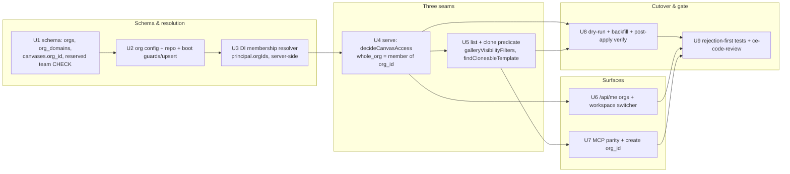

# feat: Tenancy Phase 1 — Org Boundary (9 units)

> **Target worktree:** `feat/multi-tenant-orgs`, one PR. Paths are repo-relative and were
> **verified against the code during a 5-lens plan review** (file refs below are confirmed).
>
> **Invariant-critical (§12).** This re-scopes the `whole_org` rung — an authorization change on a
> live access path, across **three** enforcement seams (serve / list / clone). A multi-agent
> `/ce-code-review` (security + adversarial) is a **required gate** before merge; weight findings
> against the trust model in `docs/solutions/2026-06-13-auth-invariant-checklist.md`. Test
> **rejection paths first**.
>
> **Operating mode:** there are real users + shares on the live instance — this is **NOT** a
> wipe-and-reseed. Migrations are additive + idempotent; the cutover (U8) ships a dry-run + a
> post-apply verification.
>
> **Branch note:** this branch is off `main`; the M10 backup work (`apps/server/src/ops/backup.ts`,
> `BACKUP_TABLE_ORDER`, `docs/ops.md`) lives on an **unmerged** PR and does **not** exist here —
> units reference `schema.test.ts` for table-parity and create `docs/tenancy.md` for the runbook.

## Summary

Introduce the **org boundary** that solves the stated leak: brought-in guests (Gmail / other
domains) can no longer see content shared "with the org." A canvas gains a **home tenant**
(`org_id`, null = personal); the caller's **org membership** is resolved server-side from their
verified email domain; and `whole_org` is re-scoped from "any signed-in member" to "**a member of
the canvas's home org**." Because list and clone queries can't run the per-row decision table, the
re-scope is enforced across **three seams** — `decideCanvasAccess` (serve), the shared
`galleryVisibilityFilters` predicate (enumerate), and `findCloneableTemplate` (clone) — each
rejection-tested. The dashboard gains a Personal/Org workspace surface; `/api/me` carries the
caller's orgs; MCP inherits the scoping through the shared service layer. A dry-run + an additive,
idempotent backfill + a post-apply verification auto-scope existing data.

Build order: **schema → org config/repo → DI membership resolver → the three-seam re-scope →
gallery/dashboard/MCP → cutover → invariant tests + review.**

---

## Problem Frame

`whole_org` resolves to "any member that passed the gateway," and the gallery + clone-template
queries take no viewer at all — so an allowlisted Gmail guest sees org content three ways. This
phase draws the boundary with the smallest multi-org-ready surface: one column on `canvases`, two
small tables, a DI server-side membership resolver, and the three-seam org-scope. See the origin
brainstorm for the model, decisions (D1–D11), identity rules, and requirements (R1–R8, R12, R-sec).

---

## Requirements Traceability

| Requirement | Units |
|---|---|
| R1 Org + domains model (+ boot guards) | U1, U2 |
| R2 Canvas home tenant + reserved `team` CHECK | U1 |
| R3 DI member/guest classification | U3 |
| R4 Re-scope `whole_org` (serve) | U4 |
| R5 Org-scope all three seams | U4 (serve), U5 (list + clone) |
| R6 Workspace surface + `/api/me` | U6 |
| R7 MCP parity (+ gallery-over-MCP decision) | U7 |
| R8 Cutover migration (auto-scope) | U8 |
| R12 Safe cutover tooling (dry-run + post-apply verify) | U8 |
| R-sec Invariant tests (rejection-first) | U3, U4, U5, U9 |

---

## Key Technical Decisions

**KTD1 — Personal space = `org_id IS NULL`** (no tenant table; the *absence* of a tenant, never a
reserved "personal org" id; per-org features key off non-null `org_id`, personal falls back to
per-user defaults).

**KTD2 — Membership is DERIVED, server-side, domain-only, via a dependency-injected resolver.**
`resolveOrgMembership(user): Promise<Set<string>>` computes membership = normalized exact domain
match against `org_domains` — **independent of** `allowed_emails`/`ADMIN_EMAILS` (those grant
sign-in, not membership; such users become **guests**, surfaced by the cutover). No `org_members`
table in P1. Inject the resolver so P2 swaps the body for `derived ∪ explicit` with zero caller
edits, and add `orgIds` to the `Principal` so `memberPrincipal(user, orgIds)` **requires** it —
the compiler then forces every fabrication site (gateway, `requestPrincipal`, the realtime hub
re-auth fallback, the MCP caller, screenshot capture) to populate it. Domain normalization:
lowercase + strip trailing dot + reject/punycode non-ASCII; **exact** match (`u@eng.acme.com` ≠
`acme.com` — operators enumerate subdomains).

**KTD3 — Three enforcement seams, not one** (the review's central correction). The serve path runs
`decideCanvasAccess`; list/clone queries **cannot** run a per-row function, so they get a shared SQL
clause. The principle is "**one serve-decision table + one shared list/clone visibility predicate**,"
both carrying `org_id ∈ viewer.orgIds`, both rejection-tested. Do **not** call this "one seam."

**KTD4 — Config-first org, materialized at boot, exactly one in P1.** Operator config
(`CANVAS_DROP_ORG_NAME`, `CANVAS_DROP_ORG_DOMAINS` defaulting to `ALLOWED_EMAIL_DOMAINS`) — config
is the only `process.env` reader (§8.1). A boot step upserts the org + domains (mirrors admin-email
reconciliation). **Boot guards:** reject a domain mapped to two orgs, and reject any config naming
>1 org (P1 supports exactly one; multi-org is Phase 3) — this forecloses active-org ambiguity.

**KTD5 — Additive dual-dialect migrations; reserve `'team'` in the CHECK now.** New tables + nullable
`canvases.org_id` are additive. **Also add `'team'` to `canvases_access_chk` in P1** (both dialects)
even though `decideCanvasAccess` rejects `team` until P2 — this converts P2's otherwise-required
SQLite **table-recreation** of the CHECK (the migration-0011 incident class; see
`migrate-populated.test.ts` and `docs/solutions/2026-06-13-dual-dialect-drizzle-seam.md`) into a
no-op. Generate migrations for both dialects, keep `schema.{pg,sqlite}.ts` in lockstep, keep the
`schema.test.ts` parity test green. No destructive rewrite of live data.

**KTD6 — Auto-scope is emergent + clamped.** Once `canvases.org_id` is backfilled (by owner domain)
and the three seams re-scope, existing `whole_org` canvases become members-only automatically. The
backfill sets `org_id` only (`WHERE org_id IS NULL`), but **must clamp** any `whole_org` canvas that
resolves to `org_id NULL` (a guest-owned one) down to `private` — a `whole_org`+null row is an
explicit-deny everywhere, but leaving it is a latent footgun.

**KTD7 — Sign-in gate unchanged; guests stay invite-only; active workspace is UX-only.** A guest is a
signed-in user whose domain matches no org. The gate (`ALLOWED_EMAIL_DOMAINS` + `allowed_emails`) is
unchanged; open signup is deferred (D8, P4). The dashboard's active workspace is a filter hint —
every endpoint re-derives `orgIds` from the session; a client-asserted org is ignored for authz.

---

## High-Level Technical Design

(U5 → U7: U7 consumes the `viewerOrgIds` parameter U5 adds to `GalleryListOptions`/clone — sequence
them. U8's dry-run reads only domains + canvases, so it can run during U4 review, before the authz
change is live.)

---

## Implementation Units

### U1. Schema — `orgs`, `org_domains`, `canvases.org_id`, reserved `team`
- **Files:** `packages/shared/src/db/schema.sqlite.ts`, `schema.pg.ts` (shared column helpers);
  generated `drizzle/sqlite/*` + `drizzle/pg/*` (latest is `0025`); the parity test
  `packages/shared/src/db/schema.test.ts` (add the two tables to its table map). **No `backup.ts` /
  `BACKUP_TABLE_ORDER` on this branch** — if the backup PR lands first, also extend its
  `BACKUP_TABLE_ORDER` + FK-order test in a follow-up.
- **Behavior:** `orgs(id, name, slug unique, created_at)`; `org_domains(id, org_id FK→orgs, domain
  unique, created_at)` (consider a nullable `verified_at` now — operator rows = trusted — so P4's
  verification is data, not a migration); `canvases.org_id` nullable FK → orgs. Add `'team'` to
  `canvases_access_chk` (both dialects) — reserved, rejected by the guard until P2 (KTD5).
- **Tests:** `schema.test.ts` parity green both dialects; a migration exists per dialect; applying
  on a populated DB is additive (extend `migrate-populated.test.ts` for the CHECK change).
- **Acceptance:** `pnpm test` green both dialects; additive migration (no data loss); no child table
  gains `org_id` (isolation is transitive via `canvas_id`).

### U2. Org config + repository + boot guards/materialization
- **Files:** `packages/shared/src/config/env.ts` (new `CANVAS_DROP_ORG_NAME`,
  `CANVAS_DROP_ORG_DOMAINS` → typed config, defaulting domains to the existing `ALLOWED_EMAIL_DOMAINS`
  csv at ~line 199); new `apps/server/src/db/repositories/orgs.ts`; boot wiring in
  `apps/server/src/index.ts` (beside the admin-email reconciliation / the search-text backfill at
  ~line 181).
- **Behavior:** `orgsRepository`: `ensureOrg({name, domains})` (idempotent upsert),
  `findByDomain(normalizedDomain)`, `listDomains(orgId)`. Boot upserts the configured org + domains.
  **Boot guards:** throw on a domain listed under two orgs; throw on a config naming >1 org (P1).
- **Tests:** repo unit tests (both dialects) — upsert idempotency, domain lookup, normalization;
  config tests for the new vars + the default; the two boot guards reject bad config.
- **Acceptance:** booting twice yields one org + the configured domains; an unknown domain → "no
  org"; multi-org / duplicate-domain config fails loudly at boot.

### U3. DI membership resolver (the classifier) — server-side only
- **Files:** new `apps/server/src/auth/org-membership.ts` (`resolveOrgMembership`, injected);
  `apps/server/src/canvas/authorization.ts` (`memberPrincipal` at ~line 31 — add a required
  `orgIds` param); `apps/server/src/http/types.ts` (~line 12 — add `orgIds: Set<string>` to the
  member `Principal`, `∅` for guests); every fabrication site: the gateway/`requestPrincipal`
  (`authorization.ts:192`), the realtime hub fallback (`realtime/hub.ts:345`), the MCP caller
  (`mcp/server.ts:84`), capture.
- **Behavior:** given the resolved user, return their org set = orgs whose normalized domains contain
  the user's normalized verified email domain (exact). Guest → ∅. Computed once per request, carried
  on the principal. Independent of `allowed_emails`/`ADMIN_EMAILS`.
- **Tests (rejection-first):** member domain → correct org; guest / allowlisted-Gmail / admin-on-non-
  org-domain → ∅; `u@eng.acme.com` vs `acme.com` (exact); trailing-dot + non-ASCII normalization;
  **client-asserted org is ignored**; proxy + oidc + dev modes; the realtime fallback populates
  `orgIds` (not ∅) so a live `whole_org` socket isn't wrongly dropped or kept.
- **Acceptance:** `principal.orgIds` is correct + server-derived in every auth mode and on the
  realtime re-auth path; no code path lets the client assert membership.

### U4. Re-scope `whole_org` in `decideCanvasAccess` (serve seam) + home-tenant on create
- **Files:** `apps/server/src/canvas/authorization.ts:85` (`decideCanvasAccess`; the `whole_org`
  branch at ~line 138). NOT `owner-guard.ts` (that's the unrelated `requireOwnedCanvas` mutation
  seam, unchanged). Canvas create in `apps/server/src/routes/management.ts` (`createSchema` ~line 93
  + handler — add `org_id`) + the service wrapper; `db/repositories/canvases.ts` (carry `org_id`).
- **Behavior:** `whole_org` allows iff `canvas.orgId != null && viewer.orgIds.has(canvas.orgId)`;
  **explicit deny when `org_id` is null** (don't rely on `Set.has(null)`); non-member → §12.0 not
  found. `team` is a reserved CHECK value but `decideCanvasAccess` **rejects** it (forward-ref guard,
  Phase 2 implements). On create: a member may set `org_id` to an org they belong to (default per
  open-item #1) or null; a guest only null; the server validates the chosen `org_id` against the
  caller's membership (never trust the client).
- **Tests (rejection-first):** guest → `whole_org` = 404; member of A → `whole_org` of B = 404;
  member → own org's `whole_org` = 200; `whole_org`+`org_id NULL` = 404 (the row the cutover can
  create); owner always reaches own; admin **not** a cross-org bypass; promote `specific_people`
  (with a guest grant) → `whole_org` → back, asserting the guest's allowlist row persists but is
  denied at `whole_org`; `private`/`public_link` unchanged.
- **Acceptance:** the full `decideCanvasAccess` truth table (principal × access × org-match × null)
  is covered, rejection-first; no second authorization seam introduced on the serve path.

### U5. Org-scope the list + clone seams
- **Files:** `apps/server/src/db/repositories/canvases.ts` — `galleryVisibilityFilters` (~line 264,
  the shared closure used by `listGallery` ~1113, facets ~1204, trending ~401) and
  `findCloneableTemplate` (~line 1245); the `GalleryListOptions` interface (+ `viewerOrgIds`);
  `apps/server/src/routes/gallery.ts` (~line 158 — must start reading the principal); the clone path
  in `management.ts` (~line 368).
- **Behavior:** both the list predicate and `findCloneableTemplate` AND `org_id IS NOT NULL AND
  org_id ∈ viewer.orgIds`. A guest/personal viewer → empty org gallery and cannot clone an org
  template. Personal `public_link` templates (org_id null) remain cloneable as today.
- **Tests (rejection-first):** an org-B member sees zero org-A canvases via browse **and** `/facets`
  **and** trending; a guest's org gallery is empty; a guest clone of an org template → 404; an org-B
  member clone of an org-A template → 404.
- **Acceptance:** no `whole_org` canvas of an org the viewer isn't a member of appears in gallery,
  facets, owner-list, trending, **or** is cloneable.

### U6. `/api/me` orgs + dashboard workspace surface
- **Files:** `apps/server/src/routes/me.ts` (add `orgs: [{id, name}]` + `isGuest`; **no `role` field
  in P1** — no role model yet); dashboard `lib/api.ts` (restate the shape locally — no
  `@canvas-drop/shared` import), a Personal/Org switcher, the create flow (home-tenant picker,
  members default Org), list/gallery filtered by the active workspace.
- **Behavior:** members see Personal + their org and can switch; guests see only Personal and no
  org/team scope options in the share UI. The active workspace is **UX state only**; the server
  re-derives `orgIds` and ignores any client-asserted org for authorization.
- **Tests:** dashboard tests for the switcher + guest-restricted share options + member-default-Org
  create; `/api/me` server tests (member vs guest shape); a request asserting `org=B` as an org-A-
  only member sees only org-A.
- **Acceptance:** a guest never sees an org/team share option or an org gallery; the active workspace
  cannot widen a query.

### U7. MCP parity
- **Files:** the MCP tool layer — `create_canvas` (add `org_id`, validated against membership, wraps
  `management.ts` `createSchema`), `update_canvas` (re-scoped `whole_org`), `list_canvases`,
  `whoami` (returns orgs/`isGuest`), `clone_canvas` (the U5 clone gate). Wrap the **same** service
  functions as U4/U5; same checks; same audit events. **Sequenced after U5** (shared `viewerOrgIds`
  interface).
- **Behavior:** an agent can pick a canvas's home tenant on create, set the re-scoped `whole_org`,
  and is subject to the same clone gate. **Decision (agent-native parity):** the UI's new org-gallery
  browse is *not* reachable via the owner-scoped `list_canvases`; either add a scoped `list_gallery`
  MCP tool (wraps `listGallery` with the caller's `orgIds`) **or** record org-gallery-browse-over-MCP
  as an explicit P2 deferral. Pick one in this unit — don't let "inherits for free" hide the gap.
- **Tests:** MCP rejection paths mirroring U4/U5 (an agent acting as a guest can't set/read/clone
  `whole_org`); parity check.
- **Acceptance:** anything a member can do in the UI for tenancy, an agent can do over MCP with
  identical scoping; the org-gallery decision is recorded.

### U8. Cutover — dry-run + idempotent backfill + post-apply verification
- **Files:** new `apps/server/scripts/tenancy-plan.ts` (dry-run) + the backfill (a one-time TS
  backfill mirroring the search-text backfill, or a migration step); new `docs/tenancy.md` runbook
  (`docs/ops.md` is on the unmerged backup PR — don't reference it).
- **Behavior:** **dry-run (`pnpm tenancy:plan`)** reports, per user, member/guest classification
  (flagging allowlisted-/admin-on-non-org-domain users now reclassified as guests), and per canvas
  the computed `org_id` + access delta (who **gains or loses** visibility) — no writes. **Apply**
  seeds the org (idempotent) and sets `org_id` by **owner domain** with `WHERE org_id IS NULL`
  (resumes after partial failure; never re-touches a corrected row), and **clamps** any guest-owned
  `whole_org` → `private`. **Post-apply verify** re-runs the classifier and asserts zero deltas vs
  the dry-run. Run the dry-run **before every apply**, including config-changed re-applies.
- **Tests:** dry-run deltas correct on a fixture (member→org, guest→personal, a guest currently
  seeing a `whole_org` canvas listed as "loses access", an allowlisted user flagged); apply
  idempotent (second run no-op); backfill sets `org_id` only to the **owner-domain-matching** org
  (never an arbitrary one); `specific_people`/`private` untouched; post-apply verify catches an
  injected mismatch.
- **Acceptance:** dry-run matches the live apply; re-apply changes nothing; no `access` value is
  rewritten **except** the guest-owned-`whole_org`→`private` clamp.

### U9. Invariant test pass + mandatory review
- **Files:** cross-cutting integration tests under `apps/server/src/routes/*.test.ts` +
  `canvas-realtime`/social-preview tests; this unit is also the **process gate**.
- **Behavior:** a rejection-first suite covering the U3/U4/U5 matrix end-to-end (HTTP + MCP), the
  realtime re-auth path (a `whole_org` socket: member stays, non-member dropped, hub fallback
  populates `orgIds`), and the OG/social-preview + `?rendition=og` paths (a `whole_org` canvas emits
  only the generic card to a crawler/anonymous; the OG image stays `private`-cached). Then run
  `/ce-code-review` (security + adversarial + correctness) and fix every real finding with a
  regression test before the PR.
- **Tests:** the suite; both dialects; green CI matrix.
- **Acceptance:** rejection paths covered first and green; `/ce-code-review` run + findings resolved;
  CI matrix green both dialects.

---

## Rollout

1. Merge behind the additive schema — inert until config names an org.
2. Run `pnpm tenancy:plan` against a **restored copy** of production and review the access-delta
   report (gains **and** losses, incl. reclassified allowlist users). The dry-run has no dependency
   on U4 being deployed, so review it during U4.
3. Set `CANVAS_DROP_ORG_NAME` (+ confirm `CANVAS_DROP_ORG_DOMAINS`); deploy; the boot upsert
   materializes the org; run the backfill; the post-apply verify confirms the live state matches the
   dry-run. `whole_org` becomes members-only; guests retain only `specific_people` grants.
   Reversible: clearing `org_id` restores the prior behavior.

## Out of scope (later phases)

Teams + the `team` rung implementation (P2; the CHECK value is reserved here); >1 org +
subdomain-per-org + host-scoped cookies + per-org quotas (P3); self-serve signup + per-org admin
console + roles (P4). No per-org RBAC matrix in P1 (D10). The member→guest / owner-leaves lifecycle
reconciliation (R13) is captured in the brainstorm and planned at depth in P2/P3; P1 only ensures
the owner-bypass keeps working and the dry-run surfaces the reclassification.
