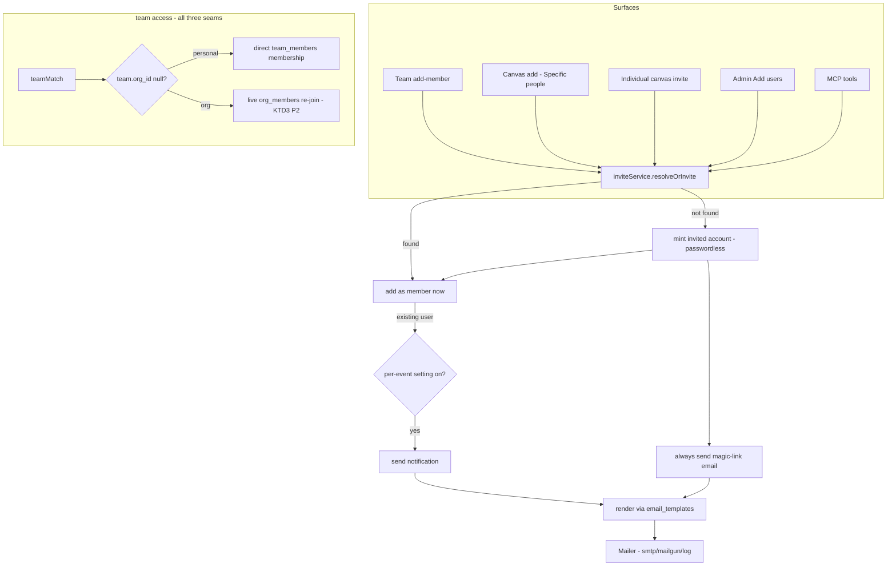

# feat: Personal teams + invited accounts + invite emails & templates

> **Builds on P2 org teams** (PR #58, the `team` access rung across the three seams). This
> phase **unifies the team model** so any user — including a guest in no org — can own a
> team and invite friends/family by email, and turns the individual sign-in allowlist into
> a real **"add users"** flow that mints persistent passwordless accounts. **Invariant-
> critical**: the `team` predicate gains a personal-vs-org branch across the same three
> seams, and a new persistent passwordless account type enters the auth context. Both gate
> the PR behind `/ce-code-review` (security + adversarial) and the §12 auth checklist
> (`docs/solutions/2026-06-13-auth-invariant-checklist.md`).

## Summary

Today teams are **strictly org-owned**: `teams.org_id` is required and only org members can
create them. This phase makes teams **user-owned with an optional org**: a team always has a
creator; it is either **personal** (no org — friends & family, for the creator's own
canvases) or **org-attached** (the existing behavior). The access check branches on that —
an org team keeps the live `org_members` re-join (KTD3); a personal team uses **direct
`team_members` membership** as the boundary (no org context to re-join).

To make "invite friends & family" real, inviting by email adds the person as a **full member
immediately**; a brand-new email mints a **persistent passwordless account** and emails them
a **magic link** (the same mechanism as today's guests, promoted from a canvas-scoped session
to a real account). The admin **individual sign-in allowlist is replaced by "Add users"**,
which creates the account, sends the invite, and grants org membership when the email matches
an org domain. A small set of **DB-controlled email settings** gates notifications, and a
**DB-seeded, admin-editable template set** (subject + HTML/text body, with `{{variables}}`)
backs every invite/notification email.

## Decisions locked (2026-06-21, owner — do not re-litigate)

1. **Unified team model.** Every team is user-owned (`created_by`); `teams.org_id` becomes
   **nullable**. Org team → live `org_members` re-join; personal team → direct `team_members`
   membership is the boundary. The serve / runtime-API / realtime `teamMatch` seams branch on
   whether the team has an org. *(KTD1 — invariant-critical.)*
2. **Org-vs-personal chosen at creation, fixed after.** Creator picks **Personal**, or — only
   if they are an org member — **attach to my org**. A guest sees only Personal. *(KTD2.)*
3. **Membership.** A personal team may include **any user**; an org team keeps the same-org
   rule. Team names stay creator-local (already shipped: `nameTakenByCreator` /
   `TEAM_NAME_TAKEN`). *(KTD2.)*
4. **Invite = immediate full member.** Adding an email adds them now; a **not-yet-a-user**
   email mints a lightweight passwordless account + magic-link email. If they never click,
   they are a member who simply can't open anything yet. *(KTD3.)*
5. **Invited accounts are persistent + passwordless.** They sign in via an **email magic link
   every time** (no password stored). Works in `oidc`/`dev` auth modes only — **not `proxy`**
   (the proxy owns identity; refuse with the existing guests-unavailable contract). *(KTD4 —
   invariant-critical.)*
6. **DB-controlled email settings.** A master "send invite/notification emails" toggle on top
   of the mailer being configured, plus **per-event notify toggles** for *admin-adds-a-user*,
   *added-to-a-canvas (Specific people)*, and *individual canvas invite*. A brand-new
   invitee's magic link **always** sends (it's the only way in); adding an **existing** user
   to a **team** does **not** notify. Settings live in the admin Configuration surface. *(KTD6.)*
7. **"Add users" replaces the allowlist.** The admin individual sign-in allowlist
   (`allowed_emails`) is replaced by **Add users**: adding an email creates the user, sends a
   magic-link invite, and makes them an org member **iff** the email domain matches an org
   domain (off-domain = a sign-in-able user, not a member). *(KTD7.)*
8. **Email templates.** A DB-seeded set (one per email type), each editable by an admin —
   **subject + HTML body + text body** — with safe `{{variable}}` interpolation and
   reset-to-default. *(KTD8.)*
9. **"deck"/"presentation" = a canvas** (terminology only; no new entity).

---

## Problem Frame

The P2 team model assumes one clean org context, so the team-canvas access invariant can
re-join `org_members`. That excludes the people most "friends & family" sharing is for:
users in no org, and outsiders who don't yet have an account. The owner wants any user to
own teams and pull people in by email, with the system creating accounts as needed and
notifying them — without weakening the access invariant or adding a password store.

The work has two invariant-critical cores (the personal-vs-org access branch, and the
persistent passwordless account in the auth context) plus three supporting surfaces
(invites, admin add-users, email settings/templates). It is **Deep**: cross-cutting,
auth-sensitive, migration-bearing, and multi-surface (server, dashboard, MCP, docs).

---

## Requirements Traceability

| Requirement | Decisions | Units |
|---|---|---|
| R1 Unified team model (org optional) + personal-vs-org access branch | KTD1, KTD2 | U1, U2 |
| R2 Persistent passwordless invited accounts (magic-link sign-in) | KTD4 | U3 |
| R3 Invite-by-email primitive (resolve-or-create, immediate member, notify) | KTD3, KTD6 | U4 |
| R4 Personal teams self-serve for any user (incl. guests) + dashboard | KTD2, KTD3 | U5 |
| R5 DB-controlled email settings (master + per-event) | KTD6 | U6 |
| R6 DB-seeded, admin-editable email templates | KTD8 | U7 |
| R7 Admin "Add users" replaces the sign-in allowlist | KTD7 | U8 |
| R8 Individual one-off canvas invite | KTD6 | U9 |
| R9 MCP agent-native parity | — | U10 |
| R10 Docs parity | — | U11 |
| R-sec Invariant tests + review | KTD1, KTD4 | U1, U3, U12 |

---

## Key Technical Decisions

- **KTD1 — `teams.org_id` nullable; `teamMatch` branches on org presence.** A `NULL` org_id
  marks a **personal** team. `teamMatch(canvasId, userId, viewerOrgIds)` and
  `listCanvasIdsForUserTeams` must split: for a canvas granted to a personal team, access =
  the viewer holds a direct `team_members` row (no org re-join); for an org team, the existing
  live `org_members` re-join (`inArray(teams.orgId, viewerOrgIds)`) stays. **This is the #1
  invariant risk** — the split must hold identically across all three seams (serve
  `resolveAccessContext`, runtime `canvas-api.ts`, realtime `hub.ts`) and stay fail-closed.
  A personal team's members are the boundary, so a stale `team_members` row IS authoritative
  there (there's no org to be revoked from) — which is correct: a personal team is the
  creator's own grant, removable only by editing the team.

- **KTD2 — Org attachment is set at creation and immutable.** `teamsService.create` takes an
  optional `orgId`: present (and the creator is a live member) → org team; absent → personal.
  A guest may only create personal teams. No "promote to org later" — flipping would have to
  reconcile non-org members; out of scope (Open Question OQ3).

- **KTD3 — One invite primitive, resolve-or-create, immediate membership.** A single
  `inviteService.resolveOrInvite({ email, context })` is the shared layer behind team-add,
  canvas-add (Specific people), individual-canvas-invite, and admin add-users (agent-native:
  routes AND MCP wrap it). It: finds the user by email (lowercased) or **creates** a persistent
  passwordless account; adds them to the target immediately; if newly-created, always sends the
  magic-link invite; otherwise sends a notification only when the per-event setting is on.
  Returns `{ userId, created }`. Never a parallel implementation.

- **KTD4 — Persistent passwordless ("invited") account type.** A new `users.account_type`
  column (`'managed'` = via IdP/proxy/dev; `'invited'` = passwordless magic-link). Invited
  rows carry a synthetic `provider_sub` (`invite:<lower-email>`) so the unique index holds and
  they never collide with a future IdP `sub`. Sign-in for invited accounts is a **persistent**
  generalization of the guest magic link: a token table + `/invite/<token>` redeem that
  establishes a normal session (not a canvas-scoped guest cookie). The gateway accepts that
  session like any other authenticated user; org membership (and thus org-team eligibility)
  is still derived server-side (an invited off-domain user resolves to **no** org). **Refused
  in `proxy` mode** — the proxy owns identity, exactly like guest invites today
  (`GUESTS_UNAVAILABLE`-shaped contract). Session lifetime + re-auth cadence is an Open
  Question (OQ2). If an invited user later signs in through the IdP with the same **verified**
  email, link by email and upgrade `account_type` to `managed`.

- **KTD5 — Personal canvas + personal team must bypass `TEAM_REQUIRED`.** `settings-update.ts`
  currently 409s `team` access when `cv.orgId === null`. A personal team is exactly the case
  where a **personal canvas** (org_id null) should be shareable. Relax: `team` is allowed when
  every granted team is one the owner may grant (validated by the shared resolver), regardless
  of the canvas's org — the grant resolver already checks owner-team membership; the org-home
  requirement drops for personal teams. An **org** team still requires the canvas to be in
  that org (KTD1's grant validation: `team.orgId === cv.orgId`); a personal team has no such
  constraint.

- **KTD6 — Email settings via the existing config-override system.** Add fields to
  `admin/config-fields.ts` + `settings-service.ts`: `emailInvitesEnabled` (master), and
  per-event `notifyOnAddUser`, `notifyOnCanvasAdd`, `notifyOnCanvasInvite`. DB-overridable like
  every other admin setting; `config` stays the only `process.env` reader. The invite primitive
  consults the effective values. The master gate AND the mailer being configured are both
  required to send; a brand-new invitee's magic link is exempt from the per-event toggles (but
  still requires the mailer + master gate — without email there's no way to onboard them, so
  the invite fails closed with a clear `EMAIL_NOT_CONFIGURED`-style error).

- **KTD7 — Add-users replaces allowed_emails.** The `allowed_emails` table currently only
  *permits* an email to sign in (account minted on first login). Replace the admin surface with
  Add users (wrapping `inviteService`): create the account now + magic-link invite + org member
  iff domain ∈ org domains. Keep `allowed_emails` as the **sign-in permit** mechanism under the
  hood (a created invited account is implicitly permitted), or fold permission into
  `account_type='invited'`; pick at U8 (OQ4). Migration must not strand existing allowlist
  entries (back-compat: existing entries keep permitting sign-in).

- **KTD8 — Email templates table + safe interpolation.** `email_templates(key PK, subject,
  body_html, body_text, updated_by, updated_at)`. Seed defaults idempotently at boot
  (`materialize`-style, like the org boot step). Render via a small allow-listed
  `{{variable}}` interpolator (HTML-escape values in the HTML body; no arbitrary expressions).
  Admin editor route + UI + reset-to-default (delete the row → re-seed). Org-agnostic copy
  (no instance domain hardcoded).

---

## High-Level Technical Design

The invite primitive is the hub every surface routes through; the access branch is the
invariant core.

---

## Implementation Units

> Phases group the units; build in order. Each feature-bearing unit lists its test file +
> scenarios. Dual-dialect migrations for every schema change (both `drizzle/pg/*` and
> `drizzle/sqlite/*`); the schema-parity test must stay green.

### Phase 1 — Model & access invariant

### U1. Teams: `org_id` nullable + the personal-vs-org access branch
**Goal:** Make a team org-optional and split `teamMatch` so a personal team grants by direct
membership while an org team keeps the live org re-join — across all three seams.
**Requirements:** R1, R-sec. **Dependencies:** none (extends P2).
**Files:** `packages/shared/src/db/schema.sqlite.ts`, `packages/shared/src/db/schema.pg.ts`,
`drizzle/{pg,sqlite}/*` (new migration `teams_org_nullable`),
`apps/server/src/db/repositories/teams.ts` (`teamMatch`, `listCanvasIdsForUserTeams`,
`create` org-optional), `apps/server/src/teams/service.ts` (create takes optional orgId;
guest may create personal), `apps/server/src/teams/sharing.ts` (grant validation: personal
teams skip the `team.orgId === cv.orgId` check), `apps/server/src/canvas/settings-update.ts`
(KTD5 relax `TEAM_REQUIRED` for personal teams), `apps/server/src/canvas/authorization.ts`
(no change if the seam consumes `teamMatch`; verify), `apps/server/src/db/repositories/teams.test.ts`,
`apps/server/src/integration/team-scenarios.test.ts`.
**Approach:** `teamMatch` LEFT-branches on `teams.org_id IS NULL`: personal → require a
`team_members` row for the canvas's granted personal team (membership is the boundary, no org
filter); org → unchanged. `listCanvasIdsForUserTeams` unions both. Grant validation in
`sharing.ts`: a personal team is grantable to any of the owner's canvases (incl. personal);
an org team only to canvases in that org. The serve/runtime/realtime seams already call
`teamMatch`, so they inherit the branch — **add an explicit test at each seam** so a future
regression can't silently widen access.
**Patterns to follow:** the existing P2 `teamMatch` re-join + the three-seam tests in
`team-scenarios.test.ts`; the dual-dialect-seam learning (`docs/solutions/2026-06-13-dual-dialect-drizzle-seam.md`).
**Test scenarios:**
- Personal team canvas (personal canvas, org_id null) serves **200** to a direct team member,
  **404** to a non-member and a guest — across serve **and** runtime-API. *(Covers R1/R-sec.)*
- Org team canvas unchanged: 200 to a same-org granted member, 404 to a non-member; a
  revoked-org-member is still dropped (the org re-join still applies to org teams).
- A personal team member who is **removed from the org** still reaches a *personal* team
  canvas (no org dependency) — but loses *org* team canvases (branch isolation).
- Grant validation: an owner may grant a personal team to a personal canvas; may NOT grant an
  org team to a canvas outside that org (TEAM_FORBIDDEN); `settings-update` no longer 409s
  `TEAM_REQUIRED` for a personal-team grant on an org-less canvas.
- Schema parity green on both dialects; migration is additive (existing org teams keep org_id).

### Phase 2 — Accounts & invites

### U2. Persistent passwordless "invited" account type
**Goal:** Introduce a real, persistent account minted from an email, signing in by magic link
each time; available in oidc/dev, refused in proxy.
**Requirements:** R2, R-sec. **Dependencies:** U1 (model) — soft; can parallelize.
**Files:** `packages/shared/src/db/schema.{sqlite,pg}.ts` (`users.account_type`; an
`invite_tokens` table or reuse/generalize the guest token store), `drizzle/{pg,sqlite}/*`
(`users_account_type` + token table migration), `apps/server/src/db/repositories/users.ts`
(create-invited; link-by-verified-email upgrade), `apps/server/src/auth/invite.ts` (NEW —
persistent magic-link service, modeled on `auth/guest.ts`), `apps/server/src/auth/invite-routes.ts`
(NEW — `/invite/<token>` redeem → real session), `apps/server/src/auth/gateway.ts` (accept the
invited-account session; refuse minting in proxy mode), `apps/server/src/auth/session.ts`
(reuse), `apps/server/src/auth/invite.test.ts`.
**Approach:** Mirror `auth/guest.ts` but issue a **normal session** (not a canvas-scoped guest
cookie) and persist the user. `provider_sub = invite:<lower-email>`; `account_type='invited'`.
Redeeming a magic link establishes the session; org membership is still derived server-side
(off-domain → no org). Proxy mode: the invite mint + redeem are refused (the IAP owns
identity) with the existing `GUESTS_UNAVAILABLE`-shaped error. Session lifetime → OQ2 (default:
mirror the normal session TTL; re-auth via a fresh magic link).
**Patterns to follow:** `auth/guest.ts` (token issue/redeem/expiry), `auth/session.ts`, the
auth-invariant checklist (identity always server-resolved; test the spoof/refusal path first).
**Test scenarios:**
- An invited account is created with `account_type='invited'`; redeeming its magic link yields
  a normal authenticated session; `/api/me` shows the user (no org for an off-domain invitee).
- A second redeem issues a fresh token; an expired/used token is refused.
- Proxy mode: minting + redeeming an invited account is refused (no account created).
- A later IdP sign-in with the same **verified** email links to the invited row and upgrades
  `account_type` to `managed` (no duplicate user).
- Identity is never read from the client; the token is the only grant. *(Covers R-sec.)*

### U3. The invite primitive (`inviteService.resolveOrInvite`)
**Goal:** One shared layer that resolves-or-creates a user, adds them to a target immediately,
sends the magic link for new users, and notifies existing users per the settings.
**Requirements:** R3, R-sec. **Dependencies:** U2.
**Files:** `apps/server/src/invites/service.ts` (NEW), `apps/server/src/invites/service.test.ts`,
plus consumers wired in U5/U8/U9. Uses `users`, `org-members`, the U2 invite service, the U6
settings, the U7 templates, the `Mailer`.
**Approach:** `resolveOrInvite({ email, target, actor })` → `{ userId, created }`. Find by
lowercased email; else create an invited account (U2). Add to `target` (team / canvas-allowlist
/ org-member) immediately. If `created`, always send the magic-link invite (fail closed with a
clear error when the mailer/master gate is off — a new user can't be onboarded silently). If
existing, send a notification only when the relevant per-event setting is on. All email goes
through the U7 template renderer.
**Patterns to follow:** `canvas/guest-invite.ts` (the existing invite-to-canvas flow it
generalizes); the agent-native parity rule (this is the SAME layer routes + MCP call).
**Test scenarios:**
- Existing user added → member immediately, no email when the per-event setting is off; email
  sent when on.
- New email → invited account created + added + magic-link email sent (always).
- New email with the mailer unconfigured → fails closed (`EMAIL_NOT_CONFIGURED`), no orphan
  membership left behind (atomic or compensated).
- Idempotent: inviting an already-member is a no-op success.
- Email is lowercased/trimmed; the same email never creates two users.

### U4. Personal teams: self-serve for any user + dashboard
**Goal:** Any user (incl. a guest) can create a personal team and invite friends; org members
additionally can attach a team to their org. Dashboard reflects Personal/Org + the invite flow.
**Requirements:** R4. **Dependencies:** U1, U3.
**Files:** `apps/server/src/teams/service.ts` (create allows guests for personal; add-member
routes through `inviteService` for personal teams, same-org rule for org teams),
`apps/server/src/routes/teams.ts`, `apps/dashboard/src/routes/teams.tsx` (works with no org;
create form offers Personal / Org), `apps/dashboard/src/routes/canvas.share.tsx` (Team rung
available to guests for personal canvases), `apps/dashboard/src/app-layout.tsx` (Teams nav
shown to everyone, not org-only), `apps/dashboard/src/lib/api.ts` (`Team.orgId: string | null`,
create takes `orgId?`), dashboard tests `apps/dashboard/src/test/teams.test.tsx`,
`apps/server/src/integration/team-scenarios.test.ts`.
**Approach:** Drop the `orgOnly` nav gate and the `me.orgs.length` Team-rung gate — replace
with "any signed-in user" for personal teams; keep the org option gated on org membership.
The create form: a Personal/Org segmented control (Org disabled / hidden for guests). Roster
add uses `inviteService` (immediate member; new users emailed).
**Patterns to follow:** the existing `teams.tsx` + `canvas.share.tsx` (this PR); the
membership rules from U1.
**Test scenarios:**
- A guest (no org) creates a personal team; the Teams nav + page are available to them.
- A guest invites a brand-new friend by email → the friend is a member + emailed (mocked).
- A guest shares a **personal** canvas with their personal team (Team rung enabled; save
  succeeds — no `TEAM_REQUIRED`).
- An org member sees Personal AND Org options at creation; a guest sees only Personal.
- Org-team add-member still enforces same-org (TARGET_NOT_MEMBER for an off-domain email).

### Phase 3 — Settings, templates, admin

### U5. DB-controlled email settings
**Goal:** A master toggle + per-event notify toggles, admin-overridable, consumed by the invite
primitive.
**Requirements:** R5. **Dependencies:** U3.
**Files:** `apps/server/src/admin/config-fields.ts` (new fields),
`apps/server/src/admin/settings-service.ts` (effective resolution), `apps/server/src/invites/service.ts`
(consume), dashboard admin config view (auto-renders from the config field list),
`apps/server/src/admin/settings-service.test.ts`.
**Approach:** Add `emailInvitesEnabled` (master, default off until a mailer is configured),
`notifyOnAddUser`, `notifyOnCanvasAdd`, `notifyOnCanvasInvite` (booleans). The invite primitive
reads effective values; new-user magic links bypass the per-event toggles but still need the
master gate + mailer.
**Test scenarios:**
- Per-event toggle off → existing-user add sends no email; on → sends.
- Master gate off → no notifications; a new-user invite fails closed (can't onboard).
- Settings are DB-overridable and reflected without a restart (effective resolution).

### U6. Email templates: table, seed, renderer, admin editor
**Goal:** DB-seeded default templates, admin-editable subject + HTML/text body with safe
interpolation + reset-to-default.
**Requirements:** R6. **Dependencies:** U3 (renderer consumed there; can land before U3 wires it).
**Files:** `packages/shared/src/db/schema.{sqlite,pg}.ts` (`email_templates`), `drizzle/{pg,sqlite}/*`,
`apps/server/src/db/repositories/email-templates.ts` (NEW), `apps/server/src/email/templates.ts`
(NEW — default set + seed-at-boot + `{{var}}` renderer with HTML-escaping),
`apps/server/src/routes/admin.ts` (get/list/update/reset routes),
`apps/dashboard/src/routes/admin.settings.tsx` (or a new admin templates view) + `lib/api.ts`,
`apps/server/src/email/templates.test.ts`, dashboard admin test.
**Approach:** One row per template key (`account_invite`, `canvas_invite`,
`individual_canvas_invite`, `team_invite`, …). Seed idempotently at boot (mirrors the org
materialize step). Renderer: allow-listed variables only; HTML-escape interpolated values in
the HTML body; plain substitution in the text body. Admin editor edits subject + both bodies;
reset = delete row → re-seed. Org-agnostic copy.
**Test scenarios:**
- Boot seeds all default templates idempotently (re-seed is a no-op).
- Admin override persists + renders; reset restores the seeded default.
- Interpolation substitutes allow-listed vars; HTML-escapes values (no injection via a name);
  an unknown `{{var}}` renders empty/literal (defined behavior), never throws.
- A missing row falls back to the seeded default (defensive).

### U7. Admin "Add users" replaces the sign-in allowlist
**Goal:** Replace the `allowed_emails` admin surface with Add users (create account + invite +
domain-based membership).
**Requirements:** R7. **Dependencies:** U3.
**Files:** `apps/server/src/routes/admin.ts` (replace allowed-emails routes with add-users,
wrapping `inviteService`), `apps/server/src/db/repositories/allowed-emails.ts` (retain for
back-compat permit OR fold into `account_type`; decide here — OQ4), `apps/dashboard/src/components/AllowedEmailsPanel.tsx`
→ `AddUsersPanel.tsx`, `apps/dashboard/src/routes/admin.users.tsx` / `admin.settings.tsx`,
`apps/dashboard/src/lib/api.ts`, `apps/server/src/routes/admin.test.ts`, dashboard admin test.
**Approach:** Adding an email calls `inviteService.resolveOrInvite` with an admin target; the
domain-match rule decides org membership (`org_domains`); off-domain → invited user, no org.
Back-compat: existing `allowed_emails` rows keep permitting sign-in (don't strand them).
**Test scenarios:**
- Add an on-domain email → user created, org member, magic-link emailed.
- Add an off-domain email → user created, NOT an org member, emailed (can be added to personal
  teams but not org teams / whole-org canvases).
- Self-protection + existing admin guards preserved; a re-add is idempotent.
- Existing allowlist entries still permit sign-in after the migration.

### U8. Individual one-off canvas invite
**Goal:** A deliberate "invite this person to this canvas" action distinct from silently adding
to the Specific-people list, with its own email (per the `notifyOnCanvasInvite` setting).
**Requirements:** R8. **Dependencies:** U3, U5, U6.
**Files:** `apps/server/src/routes/management.ts` (invite route on a canvas),
`apps/dashboard/src/routes/canvas.share.tsx` (an explicit "Invite" action in the Specific-people
inline panel), `apps/server/src/routes/management.test.ts`, dashboard share test.
**Approach:** Wraps `inviteService` with the canvas as target + the `individual_canvas_invite`
template; flips access to `specific_people` if needed (or refuses with a clear precondition).
**Test scenarios:**
- Inviting a new person to a canvas → invited account + allowlist entry + email.
- Inviting an existing org member → added + emailed only when `notifyOnCanvasInvite` is on.
- Distinct from the silent bulk add (which stays no-email for existing members unless toggled).

### Phase 4 — Parity & hardening

### U9. MCP agent-native parity
**Goal:** Every new owner-facing action over MCP, wrapping the same services.
**Requirements:** R9. **Dependencies:** U4, U8.
**Files:** `apps/server/src/mcp/server.ts` (extend `create_team` with an `orgId?`/personal
choice; `add_team_member` routes through `inviteService`; a `invite_to_canvas` tool),
`apps/server/src/mcp/server.test.ts`.
**Approach:** Reuse `teamsService` + `inviteService` (no parallel logic); same denials + audit;
admin-only add-users stays off the per-account MCP surface (admin routes only, the parity
exception).
**Test scenarios:**
- `create_team` with no org → a personal team owned by the caller (works for a guest caller).
- `add_team_member` with a brand-new email → invited account created + emailed (mocked).
- `invite_to_canvas` mirrors the HTTP individual-invite (same denials).

### U10. Docs parity
**Goal:** Update served docs + llms/mcp + README for personal teams, invited accounts, add-
users, email settings/templates.
**Requirements:** R10. **Dependencies:** U1–U9.
**Files:** `docs/site/authoring/sharing.md`, `docs/site/authoring/create-and-publish.md`
(personal teams), `docs/site/self-hosting/security-model.md` (the personal-vs-org branch + the
invited-account auth note + proxy-mode caveat), `docs/site/self-hosting/configuration.md`
(email settings), `docs/site/agents/mcp.md` + `agents/llms.md`, `README.md`; run `pnpm docs:build`
(drift gate) + the integrity test.
**Test scenarios:** Test expectation: none — docs; the `docs:build` drift gate + integrity
test are the checks.

### U11. Invariant tests + `/ce-code-review` + PR
**Goal:** End-to-end rejection-first coverage + the security/adversarial review, then ship.
**Requirements:** R-sec. **Dependencies:** all.
**Files:** `apps/server/src/integration/team-scenarios.test.ts`, a new
`apps/server/src/integration/invite-scenarios.test.ts`.
**Approach:** HTTP-level: personal-team access across serve+runtime; the invited-account
magic-link round-trip establishes a real session; proxy-mode refusal; add-users membership
matrix; email-settings gating; template render. Run `/ce-code-review` (security + adversarial),
fix everything real with regression tests, weight to the trust model.
**Test scenarios:**
- The full personal-team access matrix (member 200 / non-member 404) over a real socket.
- Invited account: invite → redeem → authenticated session → reach the personal team canvas.
- Proxy mode: invited mint/redeem refused end-to-end.
- Add-users on/off-domain membership; notify toggles; template override applied to a sent email.

---

## Open Questions / Risks

- **OQ1 (the #1 invariant risk) — the personal-vs-org `teamMatch` branch must be identical and
  fail-closed across all three seams.** A divergence (e.g. the runtime seam forgetting the
  personal branch, or the personal branch accidentally skipping the membership check) is a
  silent access leak. Mitigation: a single branched `teamMatch` consumed by all three seams +
  an explicit per-seam test (U1, U11). Resolve in implementation by routing every seam through
  the one repo method — never re-deriving the predicate.
- **OQ2 — persistent passwordless session lifetime + re-auth cadence.** Default proposal: mirror
  the normal session TTL; re-auth via a fresh magic link on expiry. Confirm whether invited
  accounts should have a shorter TTL or a "remember me". Decide at U2.
- **OQ3 — no personal↔org promotion.** A team's org attachment is fixed at creation (KTD2).
  Flipping would have to drop/relocate non-org members. Deferred unless the owner wants it.
- **OQ4 — `allowed_emails` retire vs retain.** Keep the table as the sign-in permit (created
  invited accounts are implicitly permitted) or fold permission into `account_type='invited'`.
  Decide at U7; either way existing entries must keep permitting sign-in (no strand).
- **OQ5 — abuse surface of self-serve invites.** Any signed-in user (incl. a guest) can mint
  invited accounts by inviting emails → unbounded account creation + outbound email. Mitigation
  to weigh: rate-limit invites per actor, cap pending invites, and gate on the master email
  setting. Weight to the trust model (a trusted-org instance), but a guest-reachable
  account-minting path deserves a rate limit. Resolve at U3/U11.
- **Risk — proxy mode.** Invited accounts (like guests) can't exist in proxy mode. The dashboard
  must hide/disable personal-team invites there, and the server must refuse — tested in U2/U11.
- **Risk — migration/back-compat.** `teams.org_id` nullable + `users.account_type` + the new
  tables are additive; existing org teams + managed users must be untouched. The replaced
  allowlist must not strand existing entries.

---

## Out of scope (later)

Personal↔org team promotion (OQ3) · password-based accounts (passwordless only) · cross-org /
multi-org instances (P-future) · invite analytics/quotas beyond a basic rate limit · rich
WYSIWYG template editing (subject + HTML/text source only).
