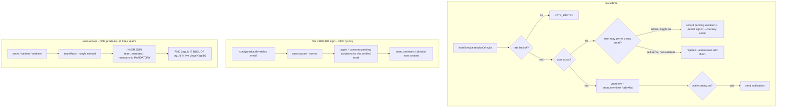

# feat: Personal teams + auth-delegated invites + invite emails & templates

> **Builds on P2 org teams** (PR #58, the `team` access rung across the three seams). This
> phase **unifies the team model** so any signed-in user — including a guest in no org — can
> own a team and invite people by email, and turns the individual sign-in allowlist into a real
> **"add users"** flow. **Invites delegate identity to the instance's configured auth** — we
> mint no app-owned credentials; an invite is a *pending grant* that materializes when the
> person signs in through OIDC/proxy (which verifies them). **Invariant-critical**: the `team`
> predicate is widened (not branched) across the same three seams. Gates the PR behind
> `/ce-code-review` + the §12 auth checklist (`docs/solutions/2026-06-13-auth-invariant-checklist.md`).

> **Design history.** v1 proposed app-owned passwordless magic-link accounts. A deepening review
> (feasibility/security/coherence/scope) flagged that as a parallel-auth surface with an
> account-takeover vector (invited→managed link-by-email). The owner then chose to **delegate to
> the configured auth instead** (2026-06-21): no magic link, no app-issued sessions. An invite is
> a sign-in permit + a pending grant; the person gets in by authenticating through the real IdP,
> and the grant materializes on that first **verified** login — exactly how every normal user is
> created today. This deletes the entire passwordless-account unit, the takeover vector, the
> proxy carve-out, and the session-lifetime question, and shrinks the abuse surface. The
> remaining security crux is **who may permit a new email to sign in** (admin by default).

## Summary

Today teams are **strictly org-owned**. This phase makes them **user-owned with an optional
org**: a team always has a creator; it is **personal** (no org — for the creator's own
canvases) or **org-attached** (existing behavior). Access is **one widened predicate** — org
team → live `org_members` re-join (P2's KTD3); personal team → direct `team_members` membership,
no org filter — never a code branch.

Inviting by email is a **pending grant**, not a new account. If the email belongs to an existing
user, the grant applies immediately; if not, a **pending invitation** is recorded (and, if the
admin permits that email to sign in, a courtesy "you've been invited — sign in" email goes out).
The person gets in by **authenticating through the configured auth** (OIDC verifies their email;
proxy asserts it); on that first verified login their user materializes and the pending grants
apply. The admin **sign-in allowlist becomes "Add users"** (permit + pending grant + courtesy
email + org membership iff the domain matches). **DB-controlled email settings** gate
notifications, **admin-configurable rate limits** bound the invite/courtesy-email surface, and a
**DB-seeded, admin-editable template set** backs every email.

## Terminology (load-bearing)

- **member** — a real `users` row authenticated through the configured auth; `principal.kind ===
  "member"`. Org membership is derived server-side (domain ∈ org domains → org member; else a
  no-org user / "guest").
- **guest** — a signed-in member with `orgIds = ∅` (no org). NOT the canvas-scoped P2 guest
  session — that pre-account concept is unchanged but unrelated here. A guest is a full
  authenticated user who simply belongs to no org.
- **pending invitation** — an `email → grant` row for someone who has **not yet signed in**. It
  holds no auth. It applies + is consumed on that email's first **verified** login. The team
  roster shows such people as **Pending** (email only, no `user_id`) until then.

## Decisions locked (2026-06-21, owner — do not re-litigate)

1. **Unified team model.** Every team is user-owned (`created_by`); `teams.org_id` nullable.
   Access is one widened predicate (KTD1): org team → live `org_members` re-join; personal team
   → direct `team_members` membership. *(Invariant-critical.)*
2. **Org-vs-personal chosen at creation, fixed after.** Creator picks Personal, or — if an org
   member — attach to their org. A no-org user sees only Personal.
3. **Membership.** A personal team may include any user; an org team keeps the same-org rule.
   Team names stay creator-local (already shipped).
4. **Invites delegate to the configured auth — no app-owned magic link.** An invite is a sign-in
   permit + a pending grant; the person authenticates through OIDC/proxy and the grant
   materializes on first **verified** login. Existing users are granted immediately; new people
   are **Pending** until they sign in. *(KTD4 — invariant-critical.)*
5. **Permitting a brand-new email to sign in is admin-controlled.** Self-serve (member/guest)
   invites only grant to people who can already authenticate (existing user / domain-matched /
   already-permitted). Permitting a **new external email** is the admin **Add users** action, or
   an admin toggle `allowMemberInvitesToNewEmails` (default OFF). This keeps non-admins from
   widening the instance's sign-in surface. *(KTD5/KTD7 — the security crux.)*
6. **DB-controlled email settings** — master toggle + per-event notify/courtesy toggles
   (admin-adds-a-user, added-to-a-canvas, individual canvas invite).
7. **"Add users" replaces the allowlist** — permit + pending grant + courtesy email + org member
   iff domain matches.
8. **Email templates** — DB-seeded, admin-editable subject + HTML + text, `{{variable}}`,
   reset-to-default.
9. **Admin-configurable invite rate limits** (KTD9) — bound the per-actor invite + courtesy-email
   surface.
10. **"deck"/"presentation" = a canvas** (terminology only).

---

## Requirements Traceability

| Requirement | Decisions | Units |
|---|---|---|
| R1 Unified team model + one widened, membership-mandatory team-access predicate | KTD1, KTD2 | U1 |
| R2 DB-controlled email settings + admin-configurable rate caps | KTD6, KTD9 | U2 |
| R3 DB-seeded, admin-editable email templates | KTD8 | U3 |
| R4 Pending invitations + materialize-on-verified-login (no app auth) | KTD4 | U4 |
| R5 The invite primitive (resolve-or-record, grant/pending, notify, rate-limited) | KTD3, KTD5, KTD6, KTD9 | U5 |
| R6 Personal teams self-serve for any signed-in user + dashboard (pending roster) | KTD2, KTD3 | U6 |
| R7 Admin "Add users" replaces the sign-in allowlist (the only new-email permit path) | KTD5, KTD7 | U7 |
| R8 Individual one-off canvas invite | KTD6 | U8 |
| R9 MCP agent-native parity | — | U9 |
| R10 Docs parity | — | U10 |
| R-sec Invariant tests + review | KTD1, KTD4, KTD5, KTD9 | U1, U4, U5, U11 |

---

## Key Technical Decisions

- **KTD1 — `teams.org_id` nullable; ONE membership-mandatory predicate, NOT a branch.**
  `teamMatch` already makes membership a mandatory `INNER JOIN team_members`. Personal teams
  widen the org `WHERE` by one clause: `inArray(teams.orgId, viewerOrgIds)` →
  `or(isNull(teams.orgId), inArray(teams.orgId, viewerOrgIds))`. The predicate is `member AND
  (personal OR org-in-scope)` — "skip membership" is structurally impossible (it's the join),
  the three seams call the same one method, org teams keep their read-time re-join. **Drop the
  `viewerOrgIds.size === 0` early return** (it would wrongly deny a no-org user their own personal
  team). **Code-fact fixes the review flagged (blocking):** `freeSlug`, `nameTakenByCreator`, and
  `resolveTeamGrant` all filter `eq(teamsT.orgId, …)` which emits `org_id = NULL` (always false)
  for personal teams — branch on `orgId == null ? isNull(...) : eq(...)`; `resolveTeamGrant`
  becomes `team.orgId !== null && team.orgId !== cv.orgId`; `resolveVisibleTeams` adds a
  `listForUser` pass so personal teams appear for a no-org user.

- **KTD2 — Org attachment set at creation, immutable.** `teamsService.create` takes optional
  `orgId`; present (creator is a live member) → org team, absent → personal. A no-org user may
  only create personal teams.

- **KTD3 — One invite primitive, resolve-or-record.** `inviteService.resolveOrInvite({ email,
  target, actor })` → `{ status: "granted" | "pending" | "rejected" }`. Shared by team-add,
  canvas-add, individual-canvas-invite, admin add-users (routes AND MCP — never a parallel
  impl). Find by lowercased email: **existing user → grant immediately** (add `team_members` /
  allowlist row) + notify per settings; **no user → record a pending invitation** keyed by email
  (no `user_id`) + courtesy email (if email is configured + the target's setting is on). A new
  external email that the actor isn't allowed to permit (KTD5) → `rejected` with a clear reason
  (or recorded pending-but-inert pending an admin permit — pick at U5).

- **KTD4 — Invites are pending grants; identity comes from the configured auth on first login.**
  An `invitations(email, target_type, target_id, role, invited_by, created_at, consumed_at)` table
  (or per-target rows). **No app-owned credential, no `account_type`, no token, no magic-link
  session.** On a successful **verified** login (the existing OIDC/proxy → `users.upsert` path),
  after the user is resolved, a single hook applies + consumes all pending invitations whose email
  equals the verified identity email, creating the `team_members` / allowlist rows. The verified
  email is the IdP's (OIDC) or the trusted proxy's — never client-asserted — so there is **no
  link-by-email takeover vector**: the user is materialized once, from a verified identity, exactly
  like every normal first login. Works uniformly across proxy/oidc/dev. The roster/allowlist UIs
  show un-consumed invitations as **Pending**.

- **KTD5 — Self-serve invites never permit a NEW email to sign in (the security crux).** In
  oidc/dev the sign-in gate is `isEmailAllowed` (domain OR `allowed_emails`). Permitting a
  brand-new external email is a **privilege change** (it widens who can authenticate), so it is
  **admin-only** (Add users, U7) — or enabled by the admin toggle `allowMemberInvitesToNewEmails`
  (default OFF). A self-serve (member/guest) invite to an email that already can authenticate
  (existing user, domain-matched, or already-permitted) is fine and records the grant; a
  self-serve invite to a not-yet-permitted external email is `rejected` (default) unless the
  toggle is on. In proxy mode the proxy owns admission, so the permit step is a no-op and invites
  are pure pending grants. *(This replaces the abuse surface that app-owned account minting had.)*

- **KTD6 — Email settings via the config-override system.** `emailInvitesEnabled` (master),
  `notifyOnAddUser`, `notifyOnCanvasAdd`, `notifyOnCanvasInvite`. DB-only fields follow the
  existing `env: "—"` + `fromConfig: () => <default>` pattern (no new `process.env` reader).
  Courtesy/notification emails are best-effort (a send failure never blocks the grant) — there's
  no credential in them, so a missing mailer is non-fatal (unlike the old magic-link flow).

- **KTD7 — Add-users replaces allowed_emails (admin UX) and is the new-email permit path.** The
  admin surface becomes Add users (wrapping `inviteService` with the admin allowance): permit the
  email to sign in (`allowed_emails`), record any pending grant, courtesy email, org member iff
  domain ∈ org domains. The `allowed_emails` table is **retained and is now the canonical permit
  store**; existing entries keep working. No schema retire needed.

- **KTD8 — Email templates + safe interpolation.** `email_templates(key PK, subject, body_html,
  body_text, updated_by, updated_at)`, seeded idempotently at boot. Allow-listed `{{variable}}`
  interpolator: HTML-escape values in the HTML body; plain in text; unknown var → empty. **The
  admin editor renders the stored HTML as escaped source / sandboxed `<iframe srcdoc>` — never
  `dangerouslySetInnerHTML`** (stored-XSS on the admin surface). Reset = delete row → re-seed.
  Org-agnostic copy.

- **KTD9 — Admin-configurable invite rate limits (resolves OQ5).** The invite primitive enforces,
  before any side effect: a per-actor **hourly** rate (`inviteMaxPerActorPerHour`) via the
  existing token bucket — note `takeToken` hardcodes a 60s window, so add an optional `windowMs`
  (default 60_000) or call `store.hit(key, limit, 3_600_000)` — and a standing
  `invitePendingCap` = `COUNT(invitations WHERE invited_by = actor AND consumed_at IS NULL)`.
  Over-limit → `RATE_LIMITED` (429 / MCP fail), nothing recorded/sent. Admin Add-users gets a
  higher ceiling. The abuse blast radius is now just pending rows + courtesy emails (no account
  minting, no sign-in permits for self-serve), so this is defense-in-depth, not the primary guard.

---

## High-Level Technical Design

---

## Implementation Units

> Phases group the units; build in order. Dual-dialect migrations for every schema change; the
> parity test stays green. **U1 is the most invariant-critical unit — land + validate it in
> isolation (own commit, green review) before the rest.**

### Phase 1 — Model & access invariant

### U1. Teams: `org_id` nullable + one widened, membership-mandatory access predicate
**Goal:** Make a team org-optional and widen the **single** `teamMatch` predicate so personal and
org teams are one membership-mandatory query — across all three seams. **No branch.**
**Requirements:** R1, R-sec. **Dependencies:** none (extends P2).
**Files:** `packages/shared/src/db/schema.{sqlite,pg}.ts`, `drizzle/{pg,sqlite}/*`
(`teams_org_nullable`), `apps/server/src/db/repositories/teams.ts` (widening +
`freeSlug`/`nameTakenByCreator` null-safety), `apps/server/src/teams/service.ts`,
`apps/server/src/teams/sharing.ts` (`resolveTeamGrant` null-safe + `resolveVisibleTeams`
personal path), `apps/server/src/canvas/settings-update.ts` (KTD5 relax `TEAM_REQUIRED`),
`apps/server/src/db/repositories/teams.test.ts`, `apps/server/src/integration/team-scenarios.test.ts`.
**Approach:** the one-clause widening of KTD1; remove the empty-orgIds early return; route all
three seams through one shared `teamMatch`/`resolveTeamMatch`. Apply the three code-fact fixes.
**Test scenarios:**
- **Cross-seam access matrix (parameterized, run against serve, runtime-API AND realtime):**
  {personal, org} × {member, non-member, no-org user, revoked-org-member} → identical allow/deny.
  *(Covers R1/R-sec — the #1 risk.)*
- **Membership invariant:** access ⇒ a `team_members` row exists, both kinds (delete → 404).
- A no-org user reaches their OWN personal team canvas (dropped early return); non-member 404s.
- Org team unchanged: revoked-org-member dropped even with a stale team row.
- **Grant authz:** a member of a personal team who does NOT own a target canvas cannot grant that
  team to it (anchored on canvas ownership).
- Grant a personal team to a personal canvas (ok); cannot grant an org team outside its org;
  `settings-update` no longer 409s `TEAM_REQUIRED` for a personal-team grant.
- Personal-team duplicate-name by the same creator rejected; different creator may reuse.
- Schema parity green; migration additive.

### Phase 2 — Foundations (settings, templates, the materialize hook)

### U2. DB-controlled email + invite-limit settings
**Goal:** master email toggle + per-event notify toggles + admin rate caps + the
`allowMemberInvitesToNewEmails` toggle, all admin-overridable.
**Requirements:** R2, R-sec, R5(KTD5). **Dependencies:** none.
**Files:** `apps/server/src/admin/config-fields.ts`, `apps/server/src/admin/settings-service.ts`,
`apps/server/src/http/rate-limit.ts` (optional `windowMs` on `takeToken`, default 60_000),
`apps/server/src/admin/settings-service.test.ts`.
**Approach:** add `emailInvitesEnabled`, `notifyOnAddUser`, `notifyOnCanvasAdd`,
`notifyOnCanvasInvite`, `inviteMaxPerActorPerHour`, `invitePendingCap`,
`allowMemberInvitesToNewEmails` (default off) + an admin-allowance knob — all DB-only fields.
**Test scenarios:**
- Each setting DB-overridable + reflected without restart.
- `takeToken` with a custom `windowMs` enforces an hourly budget; per-minute callers unchanged.
- `allowMemberInvitesToNewEmails` default OFF.

### U3. Email templates: table, seed, renderer, admin editor
**Goal:** DB-seeded defaults; admin-editable subject + HTML/text with safe interpolation + reset.
**Requirements:** R3. **Dependencies:** none.
**Files:** `packages/shared/src/db/schema.{sqlite,pg}.ts` (`email_templates`), `drizzle/{pg,sqlite}/*`,
`apps/server/src/db/repositories/email-templates.ts` (NEW), `apps/server/src/email/templates.ts`
(NEW — defaults + seed + renderer), `apps/server/src/routes/admin.ts`,
`apps/dashboard/src/routes/admin.settings.tsx` (+ `lib/api.ts`),
`apps/server/src/email/templates.test.ts`, dashboard admin test.
**Approach:** one row per key (`account_invite`, `canvas_invite`, `individual_canvas_invite`,
`team_invite`); seed idempotently; allow-listed `{{var}}` renderer with HTML-escaping; admin
editor with escaped/sandboxed preview (never `dangerouslySetInnerHTML`); reset = delete → re-seed.
**Test scenarios:**
- Boot seeds defaults idempotently; override persists + renders; reset restores default.
- Interpolation HTML-escapes values; unknown var → empty, never throws.
- Admin preview does not execute injected `<script>`.

### U4. Pending invitations + materialize-on-verified-login
**Goal:** Record pending grants and apply them when the email first authenticates — no app auth.
**Requirements:** R4, R-sec. **Dependencies:** none (the hook lives in the existing login path).
**Files:** `packages/shared/src/db/schema.{sqlite,pg}.ts` (`invitations`), `drizzle/{pg,sqlite}/*`,
`apps/server/src/db/repositories/invitations.ts` (NEW — record / list-for-email / consume /
count-pending-by-actor), `apps/server/src/auth/gateway.ts` or the login completion path
(`apps/server/src/auth/identity-mapping.ts`) — the apply-on-first-verified-login hook,
`apps/server/src/auth/invitations.test.ts`.
**Approach:** `invitations(id, email, target_type, target_id, role, invited_by, created_at,
consumed_at)`. On a verified login, after `users.upsert`, fetch un-consumed invitations for the
verified email and apply each (create the `team_members`/allowlist row), then stamp `consumed_at`
— idempotent + transactional. The verified email is the IdP/proxy identity (never client input).
**Review note:** this is deliberately small — it reuses the existing first-login user-creation
path and adds one apply step. No `account_type`, no tokens, no sessions.
**Test scenarios:**
- A pending team invitation for `x@e.com` materializes a `team_members` row on x's first verified
  login; re-login does not double-apply (consumed).
- Identity is the verified login email only; a pending invitation never grants without a login.
- Proxy mode: a pending invitation applies when the proxy admits that identity.
- Concurrent logins don't double-create the membership (transactional/idempotent).

### Phase 3 — The invite primitive & surfaces

### U5. The invite primitive (`inviteService.resolveOrInvite`)
**Goal:** One shared layer: rate-limit → resolve → grant-now-or-record-pending → notify, with the
KTD5 new-email-permit gate.
**Requirements:** R5, R-sec. **Dependencies:** U2, U3, U4.
**Files:** `apps/server/src/invites/service.ts` (NEW), `apps/server/src/invites/service.test.ts`.
Deps: `users`, `org-members`, `allowed-emails`, the U4 `invitations` repo, the U2 settings, the U3
renderer, the `Mailer`, **and `rateLimitStore: RateLimitStore`** (wired from `buildApp`).
**Approach:** `resolveOrInvite({ email, target, actor })`. First the KTD9 rate + pending-cap check
(no side effects on over-limit). Resolve by lowercased email: existing user → grant now + notify
per setting; no user → if the actor may permit (admin, or `allowMemberInvitesToNewEmails`, or the
email already authenticates) → permit (`allowed_emails`, admin path) + record pending invitation +
courtesy email; else → `rejected` (a self-serve invite can't admit a brand-new external email).
Courtesy/notify emails are best-effort (never block the grant). All mail via the U3 renderer.
**Test scenarios:**
- Existing user → granted now; email only when the per-event setting is on.
- New email, admin actor → pending invitation + permit + courtesy email.
- New external email, **self-serve actor, toggle OFF → `rejected`** (no permit, no pending, no
  mail); toggle ON → pending + courtesy.
- New email that's domain-matched (would authenticate anyway), self-serve → pending + courtesy
  (no new permit needed).
- Idempotent for an already-member; email lowercased/trimmed.
- **Rate limit:** over `inviteMaxPerActorPerHour` → `RATE_LIMITED`, nothing recorded/sent;
  `invitePendingCap` blocks beyond N un-consumed; the cap drops when an invitation is consumed;
  admin gets the higher ceiling.

### U6. Personal teams: self-serve + dashboard (pending roster)
**Goal:** Any signed-in user (incl. no-org) creates a personal team + invites people; org members
can also attach to their org. Dashboard shows Personal/Org + a Pending roster state.
**Requirements:** R6. **Dependencies:** U1, U5.
**Files:** `apps/server/src/teams/service.ts` (create allows no-org for personal; add-member →
`inviteService`), `apps/server/src/routes/teams.ts` (roster includes pending invitations),
`apps/dashboard/src/routes/teams.tsx` (Pending rows; works with no org),
`apps/dashboard/src/routes/canvas.share.tsx` (Team rung for no-org users on personal canvases),
`apps/dashboard/src/app-layout.tsx` (drop org-only nav gate), `apps/dashboard/src/lib/api.ts`
(`Team.orgId: string | null`; roster member vs pending), `apps/dashboard/src/test/teams.test.tsx`,
`apps/server/src/integration/team-scenarios.test.ts`.
**Approach:** replace the org-only gates with "any signed-in user" for personal teams; org option
gated on membership. Roster merges real `team_members` (active) + pending invitations (Pending,
email only). Add-member routes through `inviteService`.
**Test scenarios:**
- A no-org user creates a personal team; Teams nav + page work for them.
- A no-org user invites an existing/domain-matched person → granted (or Pending) + roster reflects
  it; the person reaches the personal team canvas after they sign in.
- A no-org user shares a **personal** canvas with their personal team (Team rung enabled; save
  succeeds — no `TEAM_REQUIRED`).
- Org member sees Personal AND Org at creation; a no-org user sees only Personal.
- Org-team add-member still enforces same-org.

### U7. Admin "Add users" replaces the sign-in allowlist (the new-email permit path)
**Goal:** Replace the allowlist surface with Add users — the only way to permit a brand-new email
to sign in (+ pending grant + courtesy + domain membership).
**Requirements:** R7. **Dependencies:** U5.
**Files:** `apps/server/src/routes/admin.ts`, `apps/server/src/db/repositories/allowed-emails.ts`
(now the canonical permit store), `apps/dashboard/src/components/AllowedEmailsPanel.tsx` →
`AddUsersPanel.tsx`, `apps/dashboard/src/routes/admin.users.tsx`, `apps/dashboard/src/lib/api.ts`,
`apps/server/src/routes/admin.test.ts`, dashboard admin test.
**Approach:** Add-users calls `inviteService` with the admin allowance: permit + pending grant +
courtesy email; org member iff domain. Existing allowlist entries keep working (the panel lists
them; they remain valid permits).
**Test scenarios:**
- Add on-domain email → permitted; becomes org member on first verified login; courtesy emailed.
- Add off-domain email → permitted; NOT an org member; can be on personal teams once signed in.
- Existing allowlist entries still permit sign-in; self-protection + admin guards preserved.

### U8. Individual one-off canvas invite
**Goal:** A deliberate "invite this person to this canvas" action distinct from a silent
Specific-people add, with its own courtesy email (per `notifyOnCanvasInvite`).
**Requirements:** R8. **Dependencies:** U5.
**Files:** `apps/server/src/routes/management.ts`, `apps/dashboard/src/routes/canvas.share.tsx`,
`apps/server/src/routes/management.test.ts`, dashboard share test.
**Approach:** wraps `inviteService` with the canvas target + `individual_canvas_invite` template.
**Test scenarios:**
- New person invited (admin/permit) → pending allowlist invitation + courtesy email; materializes
  on first verified login.
- Existing member invited → granted + emailed only when `notifyOnCanvasInvite` is on.

### Phase 4 — Parity & hardening

### U9. MCP agent-native parity
**Goal:** Every new owner-facing action over MCP, wrapping the same services.
**Requirements:** R9. **Dependencies:** U6, U8.
**Files:** `apps/server/src/mcp/server.ts` (`create_team` Personal/Org; `add_team_member` →
`inviteService`; `invite_to_canvas`), `apps/server/src/mcp/server.test.ts`.
**Approach:** reuse `teamsService` + `inviteService` (same denials/audit/rate-limit + the KTD5
permit gate); admin add-users stays off the per-account MCP surface.
**Test scenarios:**
- `create_team` no-org → a personal team (works for a no-org caller).
- `add_team_member` existing/domain-matched email → granted/pending; a new external email →
  rejected unless the toggle is on.
- `invite_to_canvas` mirrors the HTTP denials.

### U10. Docs parity
**Goal:** Served docs + llms/mcp + README for personal teams, auth-delegated invites, add-users,
email settings/templates.
**Requirements:** R10. **Dependencies:** U1–U9.
**Files:** `docs/site/authoring/{sharing,create-and-publish}.md`,
`docs/site/self-hosting/{security-model,configuration}.md` (the invite model + the new-email
permit gate + the no-app-auth note), `docs/site/agents/{mcp,llms}.md`, `README.md`; run
`pnpm docs:build` + integrity test.
**Test scenarios:** Test expectation: none — docs; the drift gate + integrity test are the checks.

### U11. Invariant tests + `/ce-code-review` + PR
**Goal:** End-to-end rejection-first coverage + the security/adversarial review, then ship.
**Requirements:** R-sec. **Dependencies:** all.
**Files:** `apps/server/src/integration/team-scenarios.test.ts`,
`apps/server/src/integration/invite-scenarios.test.ts` (NEW).
**Approach:** the personal-team access matrix across serve+runtime; a pending invitation
materializing on a verified login → the person reaches the personal team canvas; the KTD5 gate
(self-serve can't permit a new external email; admin can; toggle flips it); rate-limit refusal;
add-users membership matrix; email-settings gating; template override. Run `/ce-code-review`
(security + adversarial); fix everything real with regression tests.
**Test scenarios:**
- Full personal-team access matrix over a real socket.
- Invite (pending) → the invitee's first verified login materializes the membership → reaches the
  canvas; second login doesn't double-apply.
- Self-serve invite of a new external email is rejected (toggle off); admin Add-users permits it.
- Rate limit: an actor hammering invites is refused after the cap, with nothing recorded/sent
  beyond it.

---

## Open Questions / Risks

- **OQ1 — the widened predicate must stay one method across three seams** (the #1 risk, now a
  one-clause widening). Pinned by the cross-seam matrix + the membership invariant (U1, U11).
- **OQ2 — RESOLVED:** no app-owned auth; identity comes from the configured auth on first verified
  login. No session-lifetime question (normal sessions only).
- **OQ3 — no personal↔org promotion** (KTD2). Deferred.
- **OQ4 — RESOLVED:** `allowed_emails` is retained as the canonical sign-in permit store (Add
  users writes it). No retire/strand.
- **OQ5 — RESOLVED (KTD9):** admin-configurable per-actor hourly rate + a pending-invitation cap.
  Abuse blast radius is now pending rows + courtesy emails only (no account minting; self-serve
  can't permit new sign-ins).
- **Security crux (KTD5).** The one knob to get right: self-serve invites must NOT permit a
  brand-new email to sign in (default). Tested directly (U5, U11). The admin toggle is the only way
  to open it.
- **UX note.** A new invitee is **Pending** until they sign in (no instant access) — surface this
  in the roster/allowlist UIs so an owner isn't surprised the person "can't see it yet."
- **Risk — migration/back-compat.** `teams.org_id` nullable + the `invitations` table are
  additive; existing org teams + the allowlist untouched.

---

## Out of scope (later)

App-owned magic-link accounts (explicitly dropped — delegate to the configured auth) ·
personal↔org team promotion · cross-org / multi-org instances · invite analytics beyond the rate
cap · rich WYSIWYG template editing.
