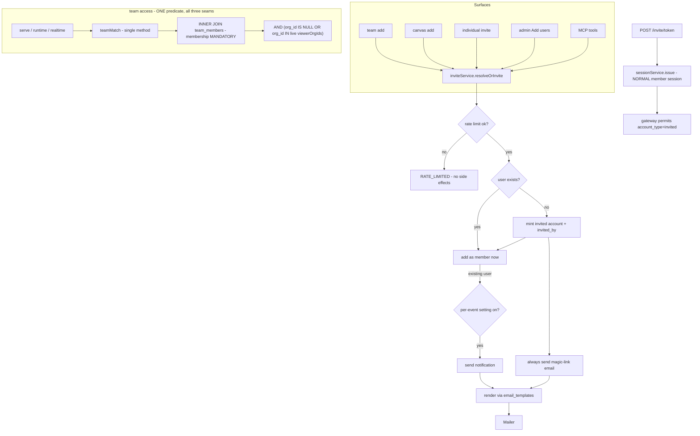

# feat: Personal teams + invited accounts + invite emails & templates

> **Builds on P2 org teams** (PR #58, the `team` access rung across the three seams). This
> phase **unifies the team model** so any user — including a guest in no org — can own a
> team and invite friends/family by email, and turns the individual sign-in allowlist into
> a real **"add users"** flow that mints persistent passwordless accounts. **Invariant-
> critical**: the `team` predicate is widened (not branched) across the same three seams, and
> a new persistent passwordless account type enters the auth context. Both gate the PR behind
> `/ce-code-review` (security + adversarial) and the §12 auth checklist
> (`docs/solutions/2026-06-13-auth-invariant-checklist.md`).

> **Deepening pass (2026-06-21, review agents).** A feasibility/security/coherence/scope review
> changed the plan materially: (1) **resequenced** to break a U3↔settings/templates cycle —
> email settings + templates now land *before* the invite primitive; (2) added the **blocking
> code-fact fixes** the original missed (`freeSlug`/`nameTakenByCreator`/`resolveTeamGrant`/
> `resolveVisibleTeams` all assume a non-null `org_id`; the gateway `isEmailAllowed` deny path;
> the `takeToken` 60s window vs an hourly cap); (3) hardened the invited-account auth model (a
> **normal member session, not a guest principal**; an `account_type='invited'` gateway permit;
> an **`email_verified:true`-gated** invited→managed link; a **POST-only** redeem); (4) gave
> `invitePendingCap` a concrete `invited_by` + unredeemed-count mechanism. See the per-unit
> "Review notes".

## Summary

Today teams are **strictly org-owned**: `teams.org_id` is required and only org members can
create them. This phase makes teams **user-owned with an optional org**: a team always has a
creator; it is either **personal** (no org — friends & family, for the creator's own
canvases) or **org-attached** (the existing behavior). The access check is **one widened
predicate** — an org team keeps the live `org_members` re-join (KTD3 of P2); a personal team
matches on **direct `team_members` membership** with no org filter — never a code branch.

To make "invite friends & family" real, inviting by email adds the person as a **full member
immediately**; a brand-new email mints a **persistent passwordless account** and emails them
a **magic link** (today's guest mechanism, promoted from a canvas-scoped session to a real
account that redeems into a normal member session). The admin **individual sign-in allowlist
is replaced by "Add users"**, which creates the account, sends the invite, and grants org
membership when the email matches an org domain. **DB-controlled email settings** gate
notifications, **admin-configurable rate limits** bound the self-serve invite abuse surface,
and a **DB-seeded, admin-editable template set** (subject + HTML/text, `{{variables}}`) backs
every email.

## Terminology (load-bearing — review fix)

- **guest** = a canvas-scoped, *pre-account* visitor (the existing `auth/guest.ts` session,
  `principal.kind === "guest"`). Never a real `users` row.
- **invited user / invited account** = a *persistent* `users` row with `account_type='invited'`
  that redeems a magic link into a **normal member session** (`principal.kind === "member"`,
  `orgIds = ∅` when off-domain). This is the new thing in this plan.
- A user "in no org" below means an **invited user or a dev user with `orgIds = ∅`** — written
  as "no-org user", never "guest", to avoid the P2 collision.

## Decisions locked (2026-06-21, owner — do not re-litigate)

1. **Unified team model.** Every team is user-owned (`created_by`); `teams.org_id` becomes
   **nullable**. Access is one widened predicate (KTD1): org team → live `org_members` re-join;
   personal team → direct `team_members` membership. *(Invariant-critical.)*
2. **Org-vs-personal chosen at creation, fixed after.** Creator picks **Personal**, or — only
   if they are an org member — **attach to my org**. A no-org user sees only Personal.
3. **Membership.** A personal team may include **any user**; an org team keeps the same-org
   rule. Team names stay creator-local (already shipped: `nameTakenByCreator`).
4. **Invite = immediate full member.** A **not-yet-a-user** email mints a passwordless account
   + magic-link email. If they never click, they're a member who can't open anything yet.
5. **Invited accounts are persistent + passwordless** (magic link every time). `oidc`/`dev`
   only — **not `proxy`** (the proxy owns identity; refuse like guest invites today).
6. **DB-controlled email settings** — a master toggle + per-event notify toggles for
   *admin-adds-a-user*, *added-to-a-canvas*, *individual canvas invite*. Team-add notifies only
   brand-new invitees (the magic link); existing users added to a team are not notified.
7. **"Add users" replaces the allowlist.** Adding an email creates the user, sends a magic-link
   invite, and makes them an org member **iff** the email domain matches an org domain.
8. **Email templates** — DB-seeded, admin-editable subject + HTML + text, `{{variable}}` interp,
   reset-to-default.
9. **Admin-configurable invite rate limits** (KTD9) — bound the self-serve abuse surface.
10. **"deck"/"presentation" = a canvas** (terminology only; no new entity).

---

## Requirements Traceability

| Requirement | Decisions | Units |
|---|---|---|
| R1 Unified team model (org optional) + one widened, membership-mandatory team-access predicate | KTD1, KTD2 | U1 |
| R2 Persistent passwordless invited accounts (member-session magic-link, gateway permit) | KTD4 | U2 |
| R3 DB-controlled email settings + admin-configurable rate caps | KTD6, KTD9 | U3 |
| R4 DB-seeded, admin-editable email templates | KTD8 | U4 |
| R5 The invite primitive (resolve-or-create, immediate member, notify, rate-limited) | KTD3, KTD6, KTD9 | U5 |
| R6 Personal teams self-serve for any user (incl. no-org) + dashboard | KTD2, KTD3 | U6 |
| R7 Admin "Add users" replaces the sign-in allowlist | KTD7 | U7 |
| R8 Individual one-off canvas invite | KTD6 | U8 |
| R9 MCP agent-native parity | — | U9 |
| R10 Docs parity | — | U10 |
| R-sec Invariant tests + review | KTD1, KTD4, KTD9 | U1, U2, U5, U11 |

---

## Key Technical Decisions

- **KTD1 — `teams.org_id` nullable; ONE membership-mandatory predicate, NOT a branch.**
  `teamMatch` already makes membership a mandatory `INNER JOIN team_members`, with the org rule
  as a `WHERE` filter. Personal teams widen that filter by one clause — from
  `teams.org_id IN (viewerOrgIds)` to `(teams.org_id IS NULL OR teams.org_id IN (viewerOrgIds))`
  — so the predicate is `member AND (personal OR org-in-scope)`. "Skip the membership check" is
  structurally impossible (membership is the join), the three seams call the **same one** method
  (one-line widening), and org teams keep their exact read-time re-join. **Also drop the
  `viewerOrgIds.size === 0` early return** (today it would wrongly deny a no-org user their own
  personal team; the `IS NULL` arm handles them, safe because membership is the join).

- **KTD2 — Org attachment set at creation, immutable.** `teamsService.create` takes an optional
  `orgId`; present (creator is a live member) → org team, absent → personal. A no-org user may
  only create personal teams. No promote-later (would have to reconcile non-org members).

- **KTD3 — One invite primitive, resolve-or-create, immediate membership.** A single
  `inviteService.resolveOrInvite({ email, target, actor })` → `{ userId, created }` is the
  shared layer behind team-add, canvas-add, individual-canvas-invite, and admin add-users
  (agent-native: routes AND MCP wrap it — never a parallel impl). Find by lowercased email or
  **create** an invited account; add to the target immediately; if newly-created, always send
  the magic link; else notify per the settings. **Signature is `{ email, target, actor }`** (the
  actor is named for rate-limiting).

- **KTD4 — Persistent passwordless "invited" account, redeeming into a NORMAL member session.**
  A new `users.account_type` (`'managed'` | `'invited'`) + an `invited_by` column (the actor who
  minted it, for the pending-cap query). Invited rows carry `provider_sub = invite:<lower-email>`.
  **Sign-in establishes a normal session via `sessionService.issue`** — NOT a guest principal —
  so subsequent requests resolve through the standard gateway as `kind:'member'` with `orgIds=∅`
  for off-domain emails (so the `team` rung, which denies non-members, admits them). **The
  gateway `isEmailAllowed` deny path must permit `account_type='invited'`** (the invite IS the
  permit) — resolved here, *not* deferred, because every post-redeem request hits it (review
  finding). The `/invite/<token>` redeem is **POST-only** (GET renders a confirm landing; only a
  same-origin POST consumes the token — no cross-origin token burn). Refused in `proxy` mode
  (the IAP owns identity). A later IdP sign-in links to the invited row + upgrades to `managed`
  **only when the claims carry `email_verified: true`** (an absent/false flag does NOT link — an
  invited account already holds memberships, so the link is account-takeover-shaped). Session
  lifetime → OQ2 (default: the normal session TTL; re-auth via a fresh link).

- **KTD5 — Personal canvas + personal team bypasses `TEAM_REQUIRED`; org teams stay org-pinned.**
  `settings-update.ts` no longer 409s `team` when `cv.orgId === null` if the granted teams are
  personal. The grant validator (`resolveTeamGrant`) changes `team.orgId !== cv.orgId` to
  `team.orgId !== null && team.orgId !== cv.orgId` — an **org** team still requires the canvas in
  that org; a **personal** team is grantable to any canvas the actor owns (incl. personal).

- **KTD6 — Email settings via the existing config-override system.** Add to
  `admin/config-fields.ts` + `settings-service.ts`: `emailInvitesEnabled` (master),
  `notifyOnAddUser`, `notifyOnCanvasAdd`, `notifyOnCanvasInvite`. DB-only fields follow the
  existing `env: "—"` + `fromConfig: () => <default>` pattern (like the KV quota fields) — no
  new `process.env` reader; `config` stays the only env reader. New-user magic links bypass the
  per-event toggles but still need the master gate + a configured mailer (else the invite fails
  closed with `EMAIL_NOT_CONFIGURED` — a new user can't be onboarded silently).

- **KTD7 — Add-users replaces allowed_emails (admin UX); the table stays a back-compat permit.**
  The admin surface becomes Add users (wrapping `inviteService`): create now + magic-link invite
  + org member iff domain ∈ org domains. `allowed_emails` is **retained** purely as a legacy
  sign-in permit so existing entries don't strand; new invited accounts are permitted via the
  `account_type='invited'` gateway path (KTD4), not a new allowlist row. (Resolves OQ4 at U2/U7.)

- **KTD8 — Email templates + safe interpolation.** `email_templates(key PK, subject, body_html,
  body_text, updated_by, updated_at)`. Seed idempotently at boot. Allow-listed `{{variable}}`
  interpolator: HTML-escape values in the HTML body; plain in text; unknown var → empty
  (defined, never throws). **The admin editor renders the stored HTML as escaped source / in a
  sandboxed `<iframe srcdoc>` — never `dangerouslySetInnerHTML`** (stored-XSS on the admin
  surface, review finding). Reset = delete row → re-seed. Org-agnostic copy.

- **KTD9 — Admin-configurable invite rate limits (resolves OQ5).** The invite primitive enforces,
  before any side effect: (a) a per-actor **rate** via the existing token bucket — but
  `takeToken` hardcodes a 60s window, so either add a `windowMs` param (default 60_000) or call
  `store.hit(key, limit, 3_600_000)` directly for the **hourly** `inviteMaxPerActorPerHour`; and
  (b) a **standing cap** `invitePendingCap` = `COUNT(users WHERE account_type='invited' AND
  invited_by = actor AND last_seen_at IS NULL)` (never-redeemed) — needs the `invited_by` column
  (KTD4) + an index. Over-limit → `RATE_LIMITED` (429 / MCP fail), no account, no mail. Admin
  add-users gets a higher ceiling (the trusted bulk path); the exact allowance is set in U3's
  config. Defense-in-depth on top of the master gate, not a replacement.

---

## High-Level Technical Design

---

## Implementation Units

> Phases group the units; build in order. Dual-dialect migrations for every schema change
> (`drizzle/{pg,sqlite}/*`); the schema-parity test stays green. **U1 and U2 are each the most
> invariant-critical unit in their phase — land + validate them in isolation (own commit, green
> security review) before the units that build on them.**

### Phase 1 — Model & accounts

### U1. Teams: `org_id` nullable + one widened, membership-mandatory access predicate
**Goal:** Make a team org-optional and widen the **single** `teamMatch` predicate so personal
and org teams are one membership-mandatory query — across all three seams. **No branch.**
**Requirements:** R1, R-sec. **Dependencies:** none (extends P2).
**Files:** `packages/shared/src/db/schema.{sqlite,pg}.ts` (org_id nullable), `drizzle/{pg,sqlite}/*`
(migration `teams_org_nullable`), `apps/server/src/db/repositories/teams.ts`
(`teamMatch`/`listCanvasIdsForUserTeams` widening + **`freeSlug` & `nameTakenByCreator`
null-safety**), `apps/server/src/teams/service.ts` (create takes optional orgId; no-org user →
personal), `apps/server/src/teams/sharing.ts` (`resolveTeamGrant` null-safe org check +
`resolveVisibleTeams` personal-team path), `apps/server/src/canvas/settings-update.ts` (KTD5),
`apps/server/src/db/repositories/teams.test.ts`, `apps/server/src/integration/team-scenarios.test.ts`.
**Approach (no branch — KTD1):** change only `teamMatch`'s org `WHERE` from
`inArray(teams.orgId, viewerOrgIds)` to `or(isNull(teams.orgId), inArray(teams.orgId, viewerOrgIds))`,
remove the `viewerOrgIds.size === 0` early return, same one-clause widening in
`listCanvasIdsForUserTeams`. Verify all three seams route through one shared `teamMatch`/
`resolveTeamMatch` (not three hand-rolled resolutions).
**Review notes — concrete code-fact fixes (blocking, found by review):**
- **`freeSlug` and `nameTakenByCreator`** filter `eq(teamsT.orgId, orgId)`. With a null orgId
  this emits `org_id = NULL` (always false) → personal teams all get the base slug (unique
  collision) and never detect a duplicate name. Branch: `orgId == null ? isNull(teamsT.orgId) :
  eq(teamsT.orgId, orgId)`.
- **`resolveTeamGrant`** currently `team.orgId !== cv.orgId` → blocks granting a personal team
  (orgId null) to an org canvas. Change to `team.orgId !== null && team.orgId !== cv.orgId`.
- **`resolveVisibleTeams`** iterates `orgIds` + `listByOrg`, so a no-org user sees zero teams.
  Add a `listForUser(actorId)` pass and merge personal teams (`t.orgId === null`) into the list.
**Test scenarios:**
- **Cross-seam access matrix (parameterized, one table run against serve, runtime-API AND
  realtime):** {personal, org} × {member, non-member, no-org user, revoked-org-member} → allow/
  deny identical at every seam. *(Covers R1/R-sec — the #1 risk.)*
- **Membership invariant:** access ⇒ a `team_members` row exists, for both kinds (delete the row
  → immediate 404).
- A no-org user reaches their OWN personal team canvas (dropped early return); a non-member 404s.
- Org team unchanged: revoked-org-member dropped even with a stale team row.
- **Grant authz (security finding):** a user who is a *member* of a personal team but does NOT
  own a target canvas cannot grant that team to it (FORBIDDEN/404, anchored on canvas ownership).
- Grant a personal team to a personal canvas (ok); cannot grant an org team to a canvas outside
  its org; `settings-update` no longer 409s `TEAM_REQUIRED` for a personal-team grant.
- Personal-team duplicate-name by the same creator is rejected; a different creator may reuse it.
- Schema parity green; migration additive.

### U2. Persistent passwordless "invited" account → NORMAL member session
**Goal:** A persistent account minted from an email, redeeming a magic link into a *normal*
session, permitted by the gateway, refused in proxy. **Land as its own commit + security pass.**
**Requirements:** R2, R-sec. **Dependencies:** U1 (soft).
**Files:** `packages/shared/src/db/schema.{sqlite,pg}.ts` (`users.account_type`, `users.invited_by`,
an `invite_tokens` table), `drizzle/{pg,sqlite}/*`, `apps/server/src/db/repositories/users.ts`
(create-invited; `email_verified`-gated link/upgrade; pending-count query),
`apps/server/src/auth/invite.ts` (NEW — token mint/redeem/expire only; returns the token),
`apps/server/src/auth/invite-routes.ts` (NEW — GET landing + **POST** redeem →
`sessionService.issue`), `apps/server/src/auth/gateway.ts` + `apps/server/src/auth/identity-mapping.ts`
(**permit `account_type='invited'` in `isEmailAllowed`**; refuse mint/redeem in proxy),
`apps/server/src/auth/invite.test.ts`.
**Approach:** Mirror `auth/guest.ts` for the token lifecycle ONLY; redeem issues a **normal
member session** (`sessionService.issue(c, userId)`), never a guest principal/context var. The
gateway's existing `isEmailAllowed` gets a fast-path: a resolved user with `account_type='invited'`
is permitted (the invite is the permit — KTD4/KTD7). Off-domain → `orgIds = ∅`, resolved
server-side as today. Proxy mode refuses both mint + redeem. `auth/invite.ts` only mints/returns
a token; **composing + sending the email belongs to the invite primitive (U5)** — U2's tests
mock the send.
**Review notes:** the gateway permit + the `email_verified` link-gate + POST-only redeem are
the three security-critical specifics (account-takeover + token-burn + dead-on-arrival risks).
**Test scenarios:**
- Invited account created (`account_type='invited'`, `invited_by` set); a POST redeem yields a
  normal authenticated session; `/api/me` shows the user (no org for off-domain).
- **An off-domain invited user makes authenticated requests after redeem** (the gateway permit).
- **GET `/invite/<token>` does NOT consume the token; only a same-origin POST does** (CSRF).
- Re-redeem issues a fresh token; expired/used token refused.
- Proxy mode: mint + redeem refused, no account created (spoof/refusal path tested first).
- **IdP sign-in with a matching email but no `email_verified:true` does NOT link/upgrade** the
  invited account; with `email_verified:true` it links (no duplicate user, upgraded to managed).

### Phase 2 — Email foundations (before the invite primitive — breaks the cycle)

### U3. DB-controlled email + invite-limit settings
**Goal:** The master email toggle + per-event notify toggles + the admin-configurable rate caps,
admin-overridable, ready for the invite primitive to consume.
**Requirements:** R3, R-sec. **Dependencies:** none.
**Files:** `apps/server/src/admin/config-fields.ts`, `apps/server/src/admin/settings-service.ts`,
`apps/server/src/http/rate-limit.ts` (add an optional `windowMs` to `takeToken`, default 60_000),
dashboard admin config view (auto-renders), `apps/server/src/admin/settings-service.test.ts`.
**Approach:** Add `emailInvitesEnabled`, `notifyOnAddUser`, `notifyOnCanvasAdd`,
`notifyOnCanvasInvite` (booleans), `inviteMaxPerActorPerHour` + `invitePendingCap` (numbers),
and an admin allowance knob — all DB-only (`env: "—"` + `fromConfig` default). Widen `takeToken`
with `windowMs` so an hourly cap is expressible without touching the per-minute callers.
**Test scenarios:**
- Each setting is DB-overridable and reflected without restart (effective resolution).
- `takeToken` with a custom `windowMs` enforces an hourly budget; existing per-minute callers
  unchanged (default window).
- Sensible defaults: master off until a mailer is configured; rate caps non-zero.

### U4. Email templates: table, seed, renderer, admin editor
**Goal:** DB-seeded defaults; admin-editable subject + HTML/text with safe interpolation +
reset-to-default; a renderer the invite primitive calls.
**Requirements:** R4. **Dependencies:** none.
**Files:** `packages/shared/src/db/schema.{sqlite,pg}.ts` (`email_templates`), `drizzle/{pg,sqlite}/*`,
`apps/server/src/db/repositories/email-templates.ts` (NEW), `apps/server/src/email/templates.ts`
(NEW — default set + seed-at-boot + `{{var}}` renderer w/ HTML-escaping),
`apps/server/src/routes/admin.ts` (get/list/update/reset), `apps/dashboard/src/routes/admin.settings.tsx`
(+ `lib/api.ts`), `apps/server/src/email/templates.test.ts`, dashboard admin test.
**Approach:** One row per key (`account_invite`, `canvas_invite`, `individual_canvas_invite`,
`team_invite`). Seed idempotently at boot. Renderer: allow-listed vars only; HTML-escape in the
HTML body; unknown var → empty. **Admin editor displays the stored HTML as escaped source /
sandboxed `<iframe srcdoc>` preview — never `dangerouslySetInnerHTML`** (KTD8 / review). Reset =
delete row → re-seed.
**Test scenarios:**
- Boot seeds all defaults idempotently; admin override persists + renders; reset restores default.
- Interpolation substitutes allow-listed vars; HTML-escapes values (no injection via a name);
  unknown `{{var}}` renders empty, never throws.
- A missing row falls back to the seeded default.
- The admin preview does not execute injected `<script>` (rendered escaped / sandboxed).

### Phase 3 — Invites & surfaces

### U5. The invite primitive (`inviteService.resolveOrInvite`)
**Goal:** One shared layer: rate-limit → resolve-or-create → add member now → email (magic link
for new, per-setting notify for existing).
**Requirements:** R5, R-sec. **Dependencies:** U2, U3, U4.
**Files:** `apps/server/src/invites/service.ts` (NEW), `apps/server/src/invites/service.test.ts`.
Deps struct receives `users`, `org-members`, the U2 invite/token service, the U3 settings, the
U4 template renderer, the `Mailer`, **and `rateLimitStore: RateLimitStore`** (wired from
`buildApp` — it's a local there, not a singleton).
**Approach:** `resolveOrInvite({ email, target, actor })` → `{ userId, created }`. **First** the
KTD9 rate check (per-actor hourly bucket + the `invitePendingCap` count) BEFORE any side effect
— over-limit → `RATE_LIMITED`, nothing created/sent; admins get the higher allowance. Then
resolve-or-create (U2); add to target immediately; new → always send the magic link (fail closed
if mailer/master off); existing → notify per setting. All mail via the U4 renderer.
**Test scenarios:**
- Existing user → member now, email only when the per-event setting is on.
- New email → invited account + member + magic-link email (always); mailer-off → fails closed,
  no orphan membership.
- Idempotent for an already-member; email lowercased/trimmed; one email never makes two users.
- **Rate limit:** a non-admin over `inviteMaxPerActorPerHour` → `RATE_LIMITED`, no account/mail;
  `invitePendingCap` blocks minting beyond N unredeemed; the cap **decreases when a pending
  account redeems**; admin/add-users gets the higher ceiling.

### U6. Personal teams: self-serve for any user + dashboard
**Goal:** Any user (incl. no-org) creates a personal team + invites friends; org members can also
attach to their org. Dashboard reflects Personal/Org + the invite flow.
**Requirements:** R6. **Dependencies:** U1, U5.
**Files:** `apps/server/src/teams/service.ts` (create allows no-org users for personal; add-member
routes through `inviteService` for personal, same-org rule for org), `apps/server/src/routes/teams.ts`,
`apps/dashboard/src/routes/teams.tsx`, `apps/dashboard/src/routes/canvas.share.tsx` (Team rung
for no-org users on personal canvases), `apps/dashboard/src/app-layout.tsx` (drop the org-only
nav gate), `apps/dashboard/src/lib/api.ts` (`Team.orgId: string | null`, create takes `orgId?`),
`apps/dashboard/src/test/teams.test.tsx`, `apps/server/src/integration/team-scenarios.test.ts`.
**Approach:** Replace the `orgOnly` nav gate + the `me.orgs.length` Team-rung gate with
"any signed-in user" for personal teams; keep the org option gated on org membership. Create
form: a Personal/Org control (Org hidden for no-org users). Roster add uses `inviteService`.
**Test scenarios:**
- A no-org user creates a personal team; the Teams nav + page work for them.
- A no-org user invites a brand-new friend → member + emailed (mocked).
- A no-org user shares a **personal** canvas with their personal team (Team rung enabled; save
  succeeds — no `TEAM_REQUIRED`).
- Org member sees Personal AND Org at creation; a no-org user sees only Personal.
- Org-team add-member still enforces same-org (TARGET_NOT_MEMBER for an off-domain email).

### U7. Admin "Add users" replaces the sign-in allowlist
**Goal:** Replace the `allowed_emails` admin surface with Add users (create + invite + domain
membership), keeping the table as a legacy permit.
**Requirements:** R7. **Dependencies:** U5.
**Files:** `apps/server/src/routes/admin.ts`, `apps/server/src/db/repositories/allowed-emails.ts`
(retain as a back-compat permit), `apps/dashboard/src/components/AllowedEmailsPanel.tsx` →
`AddUsersPanel.tsx`, `apps/dashboard/src/routes/admin.users.tsx`, `apps/dashboard/src/lib/api.ts`,
`apps/server/src/routes/admin.test.ts`, dashboard admin test.
**Approach:** Adding an email calls `inviteService` with an admin target + the admin allowance;
domain-match decides org membership; off-domain → invited user, no org. Existing `allowed_emails`
rows keep permitting sign-in (the old first-login mint path still works for them).
**Test scenarios:**
- On-domain email → user created, org member, magic-link emailed.
- Off-domain email → user created, NOT an org member, emailed (personal teams only).
- Admin allowance: an admin can add in bulk past the per-actor user cap; self-protection guards
  preserved; re-add idempotent.
- Existing allowlist entries still permit sign-in after the migration.

### U8. Individual one-off canvas invite
**Goal:** A deliberate "invite this person to this canvas" action distinct from a silent
Specific-people add, with its own email (per `notifyOnCanvasInvite`).
**Requirements:** R8. **Dependencies:** U5.
**Files:** `apps/server/src/routes/management.ts`, `apps/dashboard/src/routes/canvas.share.tsx`,
`apps/server/src/routes/management.test.ts`, dashboard share test.
**Approach:** Wraps `inviteService` with the canvas as target + the `individual_canvas_invite`
template; ensures `specific_people` access (or a clear precondition). *(Thin — could merge into
U6; kept separate for the distinct template + the per-event toggle.)*
**Test scenarios:**
- New person invited to a canvas → invited account + allowlist entry + email.
- Existing member invited → added + emailed only when `notifyOnCanvasInvite` is on.
- Distinct from the silent bulk add (no email for existing members unless toggled).

### Phase 4 — Parity & hardening

### U9. MCP agent-native parity
**Goal:** Every new owner-facing action over MCP, wrapping the same services.
**Requirements:** R9. **Dependencies:** U6, U8.
**Files:** `apps/server/src/mcp/server.ts` (`create_team` gains a Personal/Org choice;
`add_team_member` → `inviteService`; a `invite_to_canvas` tool), `apps/server/src/mcp/server.test.ts`.
**Approach:** Reuse `teamsService` + `inviteService` (same denials/audit/rate-limit). Admin
add-users stays off the per-account MCP surface (admin routes only — the parity exception).
**Test scenarios:**
- `create_team` no-org → a personal team owned by the caller (works for a no-org caller).
- `add_team_member` with a brand-new email → invited account + emailed (mocked); honors the
  rate limit.
- `invite_to_canvas` mirrors the HTTP individual-invite denials.

### U10. Docs parity
**Goal:** Served docs + llms/mcp + README for personal teams, invited accounts, add-users, email
settings/templates.
**Requirements:** R10. **Dependencies:** U1–U9.
**Files:** `docs/site/authoring/{sharing,create-and-publish}.md`,
`docs/site/self-hosting/{security-model,configuration}.md`, `docs/site/agents/{mcp,llms}.md`,
`README.md`; run `pnpm docs:build` (drift gate) + the integrity test.
**Test scenarios:** Test expectation: none — docs; the `docs:build` drift gate + integrity test
are the checks.

### U11. Invariant tests + `/ce-code-review` + PR
**Goal:** End-to-end rejection-first coverage + the security/adversarial review, then ship.
**Requirements:** R-sec. **Dependencies:** all.
**Files:** `apps/server/src/integration/team-scenarios.test.ts`,
`apps/server/src/integration/invite-scenarios.test.ts` (NEW).
**Approach:** HTTP-level: the personal-team access matrix across serve+runtime; the invited-
account POST-redeem → member-session → reach a personal team canvas; the gateway permit on every
request; proxy-mode refusal; the `email_verified` link gate; add-users membership matrix; email-
settings gating; the rate-limit refusal (no side effects); template override applied to a sent
email. Run `/ce-code-review` (security + adversarial); fix everything real with regression tests.
**Test scenarios:**
- Full personal-team access matrix over a real socket.
- Invited account: invite → POST redeem → authenticated member session → reach the personal team
  canvas → make a second authenticated request (gateway permit).
- Proxy mode: invited mint/redeem refused end-to-end.
- Rate limit: a no-org actor hammering invites is refused after the cap, with no accounts/mail
  beyond it.

---

## Open Questions / Risks

- **OQ1 — the widened predicate must stay one method across three seams** (the #1 risk, now a
  one-clause widening, not a branch). Pinned by the parameterized cross-seam matrix + the
  membership invariant (U1, U11). Rule: never re-derive the predicate in a seam.
- **OQ2 — invited-account session lifetime / re-auth cadence.** Default: the normal session TTL,
  re-auth via a fresh magic link. Decide at U2.
- **OQ3 — no personal↔org promotion** (KTD2). Deferred unless requested.
- **OQ4 — RESOLVED (KTD4/KTD7):** invited accounts are permitted at the gateway via
  `account_type='invited'`; `allowed_emails` is retained only as a legacy permit (no strand). The
  schema decision is made at U2 (the column), not deferred to U7.
- **OQ5 — RESOLVED (KTD9):** admin-configurable per-actor hourly rate + an unredeemed-invite cap
  (`invited_by` + `last_seen_at IS NULL`), enforced before side effects. Admin allowance set in
  U3's config.
- **Risk — proxy mode.** Invited accounts can't exist in proxy mode; the dashboard hides personal-
  team invites there and the server refuses (U2/U11).
- **Risk — migration/back-compat.** `teams.org_id` nullable, `users.account_type`/`invited_by`,
  and the new tables are additive; existing org teams + managed users untouched; the replaced
  allowlist keeps permitting existing entries.
- **Scope note (review).** U2 (persistent passwordless accounts) is a real auth sub-project, not
  a teams add-on. It is the most invariant-critical single unit — ship + review it in isolation
  before U5+ build on it. KTD4/5 (persistent accounts) are owner-locked; not re-opened.

---

## Out of scope (later)

Personal↔org team promotion · password-based accounts (passwordless only) · cross-org / multi-org
instances · invite analytics beyond the rate cap · rich WYSIWYG template editing (subject +
HTML/text source only).
