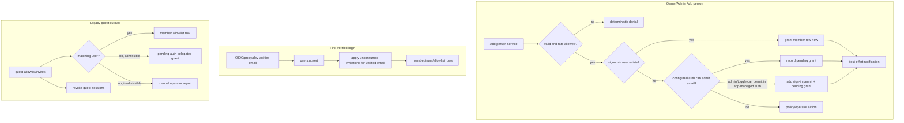

# feat: Auth-delegated access governance cleanup

> This phase finishes the access-model cleanup started by the personal teams and
> invites work. Owner-facing person access becomes one **Add person** model backed
> by auth-delegated pending grants. Legacy canvas guest magic links stop being a
> product path. Admin gets People and Canvases surfaces that make external access,
> pending sign-ins, public-link capability, and policy exceptions reviewable.
>
> **Invariant-critical:** this touches the auth boundary, canvas authorization,
> public-link exposure, MCP owner parity, and legacy guest credentials. Gate the PR
> behind `pnpm lint && pnpm typecheck && pnpm test`, `/ce-code-review`, and the
> auth checklist in `docs/solutions/2026-06-13-auth-invariant-checklist.md`.

## Summary

The product currently has two access models for people:

- the older canvas-scoped guest model, where an app-owned magic link creates a
  guest session for one canvas;
- the newer auth-delegated invite model, where a pending grant materializes only
  after the configured auth path verifies the person's email.

This plan makes the newer model the only live product model. Owners add people by
selecting an org member from autocomplete or typing an exact email. Existing users
are granted immediately. New emails become pending only when the configured auth
path can admit them. Brand-new external emails remain admin-controlled unless the
instance explicitly allows member external invites.

Admin -> Users becomes Admin -> People, keyed by canonical email and merging users,
sign-in permits, pending grants, blocked/admin/public-link states, and drilldowns.
Admin -> Canvases becomes an exposure console, with filters and row signals for
public links, password/expiry, external people, pending invites, teams, and status.
Public links move from per-user default-deny to instance default-on with global off
and per-user revoke.

## Terminology

- **member** - a real `users` row authenticated through the configured auth.
  With tenancy active, org membership comes only from verified email domains.
- **external person** - a signed-in member with no org membership, or an email
  awaiting first verified sign-in.
- **pending grant** - an `invitations` row for an email and a target. It has no
  auth power. It is applied only after the configured auth path verifies that email.
- **legacy guest** - the old `guest_invites` / `guest_sessions` / `canvas_allowlist`
  email credential model. After this phase it is migrated/inert, not a new sharing
  path.
- **sign-in permit** - an `allowed_emails` row that lets an otherwise off-domain
  email pass the app's sign-in gate in app-managed auth modes.
- **public-link capability** - the effective ability to publish `public_link`:
  global setting ON and the owner not individually revoked.

## Decisions Locked

1. **One owner Add person model.** Canvas and team people access use the same
   resolve-or-add service and deterministic result states. Dashboard/API/MCP do
   not create magic-link guests.
2. **Auth-delegated external access.** A pending grant is live only after the
   configured auth path verifies the exact email. The app never accepts an
   owner-supplied email as identity.
3. **External admission stays gated.** App-managed auth can admit by domain or
   `allowed_emails`. Proxy/IAP deployments are fail-closed for brand-new external
   emails unless that email is already admitted by the configured path; the app
   should not create unreachable pending grants and pretend upstream admission
   has happened.
4. **Legacy guest sharing is cut over.** Existing guest access is converted where
   possible, sessions are revoked, and `/guest` consumption stops being a live
   product path.
5. **Admin governance is email-keyed.** Admin People is the canonical place for
   signed-in users, pending emails, sign-in permits, blocked/admin states, and
   invitation management.
6. **Public links default on.** The rollout intentionally seeds current users into
   the new allow-by-default model. Future per-user false means revoked.
7. **Public links stay static-only.** Anonymous and non-owner public viewers get no
   identity, backend primitives, KV, files, AI, or realtime.
8. **Org language is reserved for org access.** External/private canvas or team
   emails never imply org membership.
9. **Owner MCP parity remains mandatory.** Changed owner-facing access actions
   wrap the same service layer over MCP. Admin governance remains on admin routes,
   not owner MCP tools.

## Requirements Traceability

| Requirement | Decisions | Units |
|---|---|---|
| R1 One owner-facing Add person concept across dashboard/API/MCP | 1, 9 | U1, U3, U4, U9 |
| R2 Auth-delegated external grants only when auth can admit | 2, 3 | U1, U2, U11 |
| R3 External email does not become org member unless domain-derived | 2 | U1, U6, U11 |
| R4 No new magic-link guest sharing | 1, 4 | U2, U3, U9 |
| R5 Legacy guest migration/cutover | 4 | U2, U11 |
| R6 Revocation/expiry/block/disabled still next-request effective | 2, 4, 7 | U1, U2, U5, U11 |
| R7 One Add surface for canvas/team | 1 | U3, U4 |
| R8 Autocomplete org members only; exact email for external | 1, 8 | U3, U4 |
| R9 Hard-block policy/proxy-inadmissible external adds | 3 | U1, U3, U4, U11 |
| R10 Deterministic Add result states | 1, 3 | U1, U3, U4, U9 |
| R11-R15 Admin People directory and invitation management | 5 | U6 |
| R16-R19 Admin Canvases exposure console and drilldowns | 5 | U7 |
| R20-R22 Public-link default-on, global off, revoke, static-only | 6, 7 | U5, U11 |
| R23-R26 Email/template/context/copy cleanup | 8 | U8 |
| R27-R29 MCP parity and admin boundary | 9 | U9, U11 |
| R30 Documentation clarity across repo docs and served docs site | all | U10 |

## Key Technical Decisions

- **KTD1 - Add person result model is explicit and shared.** Introduce a small
  typed result surface around the existing invite primitive:
  `granted`, `pending`, `already_added`, `already_pending`, `blocked`,
  `policy_blocked`, `auth_admission_required`, `rate_limited`,
  `mail_failed_best_effort`, and `invalid_email` at HTTP/UI boundaries. The
  service remains side-effect ordered: validate/rate-limit first, resolve
  identity/admission, then grant or record, then best-effort email.

- **KTD2 - Admission is a service, not scattered conditionals.**
  Add one admission resolver used by canvas Add person, team Add person, admin
  People, MCP, and legacy guest migration. For `oidc`/`dev`, app admission is
  domain or `allowed_emails`, and an admin/toggle may create a permit. For `proxy`,
  the app grants existing users and can record grants for already-admitted emails,
  but it must fail closed for brand-new external emails with an operator-action
  explanation. This intentionally tightens the older "proxy permit is no-op"
  language from the personal-teams plan.

- **KTD3 - Legacy guest data is migrated by an idempotent application cutover, not
  by brittle SQL-only UUID work.** Use a boot-time or CLI-invoked cutover service
  after normal Drizzle migrations. It reads legacy `canvas_allowlist` guest rows
  and non-revoked `guest_invites`, normalizes by `(canvas_id, email)`, then:
  matched signed-in user -> add a member allowlist row;
  unmatched app-admissible email -> record pending canvas invitation and, in
  app-managed auth only, preserve access by adding an `allowed_emails` permit when
  needed;
  proxy-inadmissible email -> revoke legacy sessions and report a manual
  operator action. The service is idempotent and safe to rerun.

- **KTD4 - Guest credentials become inert before route removal.** Keep the old
  tables for retention/backup compatibility in this phase, but stop creating new
  guest invites, revoke active sessions at cutover, make `/guest/:token` return a
  no-store invalid-link response, and remove only guest cookie resolution from the
  pre-gateway carve-out. Anonymous `public_link` resolution remains required and
  should move to a renamed public-canvas resolver. A later cleanup can drop the
  schema.

- **KTD5 - Owner autocomplete is bounded to org members.** Add a member-search
  endpoint that returns only live org members for the relevant canvas/team context.
  External people never appear through search; they are entered by exact email.
  In tenancy-inert dev, the search can return signed-in users because there is no
  configured org boundary.

- **KTD6 - People is an email-keyed projection over existing stores.** Build an
  admin service/repository projection keyed by lowercased email, merging `users`,
  `allowed_emails`, unconsumed `invitations`, and public-link/admin/block flags.
  Signed-in user actions still use `user_id`; email-only actions use email and
  route through the invite/admission services. No per-user behavioral history is
  added beyond existing `lastSeenAt`.

- **KTD7 - Admin Canvases exposure uses aggregates, not per-row N+1 scans.** Extend
  the admin canvas repository with exposure counts/booleans from allowlist,
  invitations, team grants, password/expiry, public-link state, and owner public
  capability. Keep search/filter semantics dialect-portable with explicit joins or
  grouped subqueries and deterministic paging.

- **KTD8 - Public-link global setting composes with per-user revoke.** Add a
  DB-backed admin setting `access.publicLinksEnabled` defaulting to true. Change
  `users.canPublishPublic` default to true and migrate existing users to true
  because previous false mostly represented the old inherited default, not an
  explicit revoke. Effective public publish = global on AND user flag true. On
  global off or per-user revoke, sweep matching `public_link` canvases back to
  private so stale public URLs are not kept live. The per-request auth decision
  still checks the effective value as defense in depth.

- **KTD9 - Seeded email templates avoid deployment/org branding.** Keep legacy
  `instanceName` and org variables renderable for customized templates, but do
  not promote them in the seeded recipient copy. Seeded templates are
  access-first and recipient-specific: inviter, recipient email, canvas/team
  name, sign-in action, and link. Rollout updates template rows only if the row
  is absent or exactly matches a known previous seeded default; custom rows are
  preserved and surfaced as overridden.

- **KTD10 - Legacy owner resend surfaces are removed, not deprecated.**
  `grant_access` and `invite_to_canvas` both call the same Add person service and
  return the same statuses as HTTP. The old `resend_guest_invite` MCP tool, the
  session-authenticated resend route, and the dashboard client wrapper are
  removed. Existing guest tables and rows remain for retention, cutover, and
  revocation; no migration destroys DB data.

## High-Level Technical Design

## Implementation Units

> Build in order. Keep one branch for the approved autonomous round, with one
> local commit per unit. Any schema change needs both dialect schemas plus
> generated migrations. Run the unit's relevant tests before moving on; run the
> full gate before PR.

### Phase 1 - Access service and guest cutover

### U1. Add person service and admission policy

**Goal:** Turn the existing invite primitive into the single Add person service with
explicit statuses and fail-closed admission behavior.

**Requirements:** R1, R2, R3, R6, R9, R10. **Dependencies:** existing personal
teams/invites plan.

**Files:** `apps/server/src/invites/service.ts`,
`apps/server/src/invites/service.test.ts`,
`apps/server/src/db/repositories/invitations.ts`, `apps/server/src/auth/identity-mapping.ts`,
`apps/server/src/admin/settings-service.ts`, `apps/server/src/admin/config-fields.ts`,
`apps/server/src/routes/management.ts`, `apps/server/src/routes/teams.ts`,
`apps/server/src/mcp/server.ts`.

**Approach:** Introduce the shared Add person result type and an auth-admission
helper. Keep `resolveOrInvite` as the side-effect owner, but make idempotent
duplicate cases visible (`already_added`, `already_pending`) and return stable
policy/admission denials. In proxy mode, allow existing users and already-admitted
emails, but block brand-new external emails with `auth_admission_required` rather
than recording pending grants that the upstream IAP may never admit.

**Test scenarios:**

- Existing signed-in user -> granted now, no pending row.
- Existing allowlist/team member -> `already_added`, no duplicate row.
- Existing unconsumed pending access -> `already_pending`, no duplicate row.
- App-managed auth, admin adds brand-new external -> `allowed_emails` permit +
  pending grant.
- App-managed auth, non-admin adds brand-new external with toggle off ->
  `policy_blocked`, no permit, no pending row.
- Proxy mode, brand-new external -> `auth_admission_required`, no permit and no
  pending row.
- Blocked signed-in user -> `blocked`, no grant.
- Rate limit and pending cap fail before any side effect.

### U2. Legacy guest cutover and guest-path retirement

**Goal:** Stop legacy guest magic links from being a live product mode while
preserving existing access where auth-delegated conversion is possible.

**Requirements:** R4, R5, R6. **Dependencies:** U1.

**Files:** `apps/server/src/access/legacy-guest-cutover.ts` (new),
`apps/server/src/db/repositories/guest.ts`,
`apps/server/src/db/repositories/canvases.ts`,
`apps/server/src/db/repositories/invitations.ts`, `apps/server/src/app.ts`,
`apps/server/src/auth/guest-routes.ts`, `apps/server/src/auth/guest-public-resolver.ts`,
`apps/server/src/auth/public-canvas-resolver.ts` (new or renamed),
`apps/server/src/index.ts`, `apps/server/src/ops/cli.ts`,
`apps/server/src/integration/invite-scenarios.test.ts`.

**Approach:** Add an idempotent cutover service and run it once at boot after DB
migrations, with an ops CLI entry for explicit drills. Convert guest email rows to
member grants or pending auth-delegated grants per KTD3. Revoke all guest sessions
for converted or unconvertible rows. Stop calling `inviteGuestToCanvas`; make
`/guest/:token` return the branded 410 invalid-link page with `Cache-Control:
no-store`; replace the guest/public mixed resolver with an anonymous public-link
resolver that preserves signed-out `public_link` access without honoring guest
cookies. Emit a structured cutover report for converted and manual-action rows.
Keep schema/tables for now so backup/restore and retention do not need destructive
migrations in the same round.

**Test scenarios:**

- Legacy guest email matching an existing user creates a member allowlist row and
  revokes sessions.
- Legacy guest email with no user but app-managed admission creates one pending
  canvas invitation and revokes sessions.
- Legacy guest email in proxy mode that cannot be admitted is reported and revoked
  without creating unreachable pending access.
- Cutover is idempotent across repeated runs.
- `/guest/:token` no longer consumes a token or sets a guest cookie.
- A stale guest cookie no longer bypasses the normal auth gateway.
- Archive/delete/unpublish still revalidates sockets and no longer depends on a
  live guest credential path.

### Phase 2 - Owner Add person surfaces

### U3. Canvas sharing: one Add person surface

**Goal:** Replace the current canvas Share tab's split Add/Invite behavior with
one Add person flow that uses the shared service and shows pending external access.

**Requirements:** R1, R4, R7, R8, R9, R10, R26. **Dependencies:** U1, U2.

**Files:** `apps/server/src/routes/management.ts`,
`apps/server/src/canvas/allowlist-view.ts`,
`apps/server/src/db/repositories/invitations.ts`, `apps/server/src/routes/people.ts` (new),
`apps/server/src/app.ts`, `apps/server/src/routes/management.test.ts`,
`apps/dashboard/src/routes/canvas.share.tsx`, `apps/dashboard/src/lib/api.ts`,
`apps/dashboard/src/lib/mutations.ts`, `apps/dashboard/src/test/canvas-share.test.tsx`.

**Approach:** Replace the legacy `/allowlist` unknown-email behavior with the Add
person service. Keep route compatibility where useful, but remove the product
distinction between silent Add and Invite. Add pending canvas invitations to the
people list projection, suppressing pending rows once the same email materializes
as a member grant. Remove Resend guest UI. Add a small org-member autocomplete
source and require exact email entry for external people.

**Test scenarios:**

- Autocomplete returns only eligible org members for an org-homed canvas.
- Exact external email submits through Add person and shows granted/pending/blocked
  status.
- Brand-new external blocked by policy or proxy admission shows the correct
  explanation and creates no row.
- Pending canvas invitation appears in the people list and disappears after verified
  login materializes the member allowlist row.
- Removing a member row or pending row revalidates access and drops sockets on the
  next request.
- No dashboard action creates a `guest_invites` row.

### U4. Team sharing: align Add person and roster states

**Goal:** Make team Add person use the same states and copy as canvas Add person,
without regressing personal/org team rules.

**Requirements:** R1, R7, R8, R9, R10, R26. **Dependencies:** U1.

**Files:** `apps/server/src/teams/service.ts`, `apps/server/src/routes/teams.ts`,
`apps/server/src/db/repositories/teams.ts`, `apps/dashboard/src/routes/teams.tsx`,
`apps/dashboard/src/lib/api.ts`, `apps/server/src/integration/team-scenarios.test.ts`,
`apps/dashboard/src/test/teams.test.tsx`.

**Approach:** Thread the shared Add person result through `teamsService`. Preserve
org-team same-org member constraints and personal-team external invite behavior, but
return the richer statuses. Use the same member autocomplete pattern for org teams;
personal teams can use exact email entry without external autocomplete. Roster rows
continue merging active members and pending access.

**Test scenarios:**

- Org team Add person grants existing same-org members and rejects non-members with
  deterministic status.
- Personal team Add person grants existing users and records pending external
  grants only when admission permits.
- Brand-new external blocked by policy/proxy creates no pending row.
- Pending roster row materializes after first verified login.
- MCP and dashboard see matching statuses for team add.

### Phase 3 - Public-link governance

### U5. Public links: instance default-on plus per-user revoke

**Goal:** Move public-link publishing to global default-on with per-user revoke and
preserve static-only enforcement.

**Requirements:** R20, R21, R22. **Dependencies:** none, but run after U1 if sharing
tests are already being touched.

**Files:** `packages/shared/src/db/schema.pg.ts`,
`packages/shared/src/db/schema.sqlite.ts`, `drizzle/pg/*`, `drizzle/sqlite/*`,
`apps/server/src/admin/config-fields.ts`, `apps/server/src/admin/settings-service.ts`,
`apps/server/src/db/repositories/users.ts`, `apps/server/src/db/repositories/canvases.ts`,
`apps/server/src/canvas/authorization.ts`, `apps/server/src/canvas/settings-update.ts`,
`apps/server/src/app.ts`, `apps/server/src/routes/me.ts`,
`apps/server/src/routes/management.ts`, `apps/server/src/routes/admin.ts`,
`apps/server/src/mcp/server.ts`, `apps/server/src/realtime/hub.ts`,
`apps/server/src/routes/canvas-api.ts`, `apps/dashboard/src/routes/canvas.share.tsx`,
`apps/dashboard/src/components/AdminUserTable.tsx`,
`apps/server/src/canvas/authorization.test.ts`,
`apps/server/src/routes/management.test.ts`, `apps/server/src/routes/admin.test.ts`.

**Approach:** Add DB-backed `access.publicLinksEnabled` default true. Change user
default/migration so existing and future users start with `can_publish_public =
true`. Compute effective public publishing as global setting AND user flag. On
global off, sweep active public-link canvases to private and deny future publish.
On per-user revoke, keep existing owner sweep. Update `/api/me`, Share UI, admin
People rows, and MCP `update_canvas` to use the effective gate and return a clear
denial reason.

**Test scenarios:**

- Fresh user can publish a public link while global setting is on.
- Existing migrated user with previous `false` is seeded to true.
- Global off denies public publish for every owner and sweeps active public links
  private.
- Global on + individual revoke denies only that owner and sweeps their public links.
- Direct stale `public_link` rows are denied by the per-request decision when the
  effective gate is false.
- Anonymous/non-owner public-link viewers remain static-only across serve, runtime
  API, AI, files, KV, and realtime.

### Phase 4 - Admin governance surfaces

### U6. Admin People directory

**Goal:** Replace the signed-in-user-only admin table with a governance-first People
directory keyed by canonical email.

**Requirements:** R11, R12, R13, R14, R15, R19. **Dependencies:** U1, U5.

**Files:** `apps/server/src/db/repositories/admin.ts`,
`apps/server/src/routes/admin.ts`, `apps/server/src/routes/admin.test.ts`,
`apps/dashboard/src/routes/admin.users.tsx` or `apps/dashboard/src/routes/admin.people.tsx`,
`apps/dashboard/src/components/AdminUserTable.tsx` or new `AdminPeopleTable.tsx`,
`apps/dashboard/src/components/AddUsersPanel.tsx`,
`apps/dashboard/src/lib/api.ts`, `apps/dashboard/src/lib/queries.ts`,
`apps/dashboard/src/lib/mutations.ts`, `apps/dashboard/src/router.ts`,
`apps/dashboard/src/test/admin-people.test.tsx`.

**Approach:** Add `/api/admin/people` returning merged email-keyed rows:
signed-in user fields, `allowed_emails` permit state, unconsumed invitation counts
and metadata, admin/blocked/public-link capability states, owned canvas count, and
last seen where available. Preserve existing signed-in user actions, but make
email-only invitation/permit management part of People, including adding/removing
sign-in permits and canceling unconsumed pending grants. The entire API remains
behind `requireAdmin`, every mutation keeps same-origin protection and audit
events, and no People governance route is exposed through owner MCP. Keep
`/admin/users` as a route alias/redirect if needed, but retitle the surface to
People. Add filters for kind, pending, blocked, public-link capability, admin,
permit, and search.

**Test scenarios:**

- Same email across user, permit, and invitations renders as one People row.
- Pending-only external email appears as Pending sign-in and external/no-org.
- Signed-in no-org user appears as external, not org member.
- Blocking/promoting/revoking public works only for signed-in user rows and keeps
  last-admin/self-protection guards.
- Removing an email permit is visible and affects next sign-in.
- Canceling a pending grant removes it from People and from the target canvas/team
  pending list without affecting already-materialized grants.
- Person -> Canvases drilldown filters owned canvases and canvases with access
  involving that email/user.

### U7. Admin Canvases exposure console

**Goal:** Make Admin -> Canvases answer exposure/governance questions without
opening each canvas.

**Requirements:** R16, R17, R18, R19, R22. **Dependencies:** U3, U5, U6.

**Files:** `apps/server/src/db/repositories/admin.ts`,
`apps/server/src/routes/admin.ts`, `apps/server/src/routes/admin.test.ts`,
`apps/dashboard/src/routes/admin.canvases.tsx`,
`apps/dashboard/src/components/AdminCanvasTable.tsx`,
`apps/dashboard/src/components/Badge.tsx`, `apps/dashboard/src/lib/api.ts`,
`apps/dashboard/src/test/admin-canvases.test.tsx`.

**Approach:** Extend admin canvas rows with exposure summary fields:
effective public-link state, has password, expiry state, team count/context,
specific people count, external people count, pending invite count, owner public
capability, and disabled/deleted/restored state. Add filters for access rung,
public, password, expiry, owner/person, org/personal/team context, status,
listed/template, external people, and pending invites. Keep admin Open behavior
honest: admins do not get content bypass for private/specific people unless they
already have normal access.

**Test scenarios:**

- Filter external people returns canvases with signed-in external allowlist rows or
  pending external invitations.
- Filter pending returns canvases with unconsumed canvas invitations.
- Filter public respects effective global/per-user public-link gate.
- Password and expiry badges reflect the stored gate without exposing hashes.
- Canvas -> People drilldown shows the relevant owner, direct members, external
  people, and pending emails.
- Sorting/pagination remains deterministic on both SQLite and Postgres.

### Phase 5 - Email, copy, and docs-visible language

### U8. Email template context and safe seeded rollout

**Goal:** Make email copy context-aware and avoid implying org membership for
private canvas/team access.

**Requirements:** R23, R24, R25, R26. **Dependencies:** U1.

**Files:** `apps/server/src/email/templates.ts`,
`apps/server/src/email/templates.test.ts`, `apps/server/src/invites/service.ts`,
`apps/server/src/admin/config-fields.ts`, `apps/server/src/admin/settings-service.ts`,
`apps/server/src/db/repositories/email-templates.ts`,
`apps/server/src/routes/admin.ts`, `apps/dashboard/src/routes/admin.settings.tsx`,
`docs/site/self-hosting/configuration.md`.

**Approach:** Keep legacy `instanceName`, `orgName`, and `orgContext` variables
renderable for existing custom templates, but update seeded defaults and admin
editor guidance so recipient copy does not depend on deployment or org branding.
Add `recipientEmail` and use it in the defaults so each email says which address
was permitted or granted access. Implement seed-default reconciliation that
updates an existing row only when it exactly matches a known previous seeded
default or does not exist. Preserve customized rows and show reset/update
affordances in Admin -> Configuration -> Email templates.

**Test scenarios:**

- External canvas invite email says access was granted to the canvas, not to the org.
- Seeded account/add-user email identifies the permitted recipient email without
  saying they joined an org.
- Legacy `instanceName`/org variables still render in customized templates, but
  seeded defaults and admin editor guidance do not promote them.
- Previous uncustomized seed rows update to the new defaults; customized rows are
  preserved.
- HTML interpolation remains escaped; unknown vars remain empty.

### U9. MCP owner parity and legacy guest tool retirement

**Goal:** Keep MCP at owner-surface parity while removing guest magic-link semantics.

**Requirements:** R27, R28, R29. **Dependencies:** U1, U3, U4.

**Files:** `apps/server/src/mcp/server.ts`, `apps/server/src/mcp/server.test.ts`,
`apps/server/src/routes/management.ts`, `apps/server/src/routes/management.test.ts`,
`apps/dashboard/src/lib/api.ts`, `docs/site/agents/mcp.md`,
`docs/site/agents/llms.md`, `README.md`.

**Approach:** Point `grant_access` and `invite_to_canvas` at the shared Add person
service. Return the same statuses and denial strings as HTTP where MCP shape
allows. Keep `list_access` in sync with the dashboard people list, including
pending entries if the owner UI shows them. Remove the legacy
`resend_guest_invite` tool and the old HTTP resend route/client wrapper rather
than keeping compatibility stubs. Do not add admin People/Canvases governance
tools to the owner MCP surface.

**Test scenarios:**

- MCP Add person to existing user -> granted and visible in `list_access`.
- MCP Add person to policy-blocked external -> same denial as dashboard, no guest
  invite row.
- MCP `list_access` shows active and pending people consistently with HTTP.
- The MCP tool list no longer exposes `resend_guest_invite`, and the dashboard/API
  resend wrapper is gone.
- A non-owned canvas still reads as not found.

### U10. Documentation clarity refresh

**Goal:** Make the new access model crystal clear everywhere readers encounter it:
repo docs, served docs, agent docs, and generated public documentation.

**Requirements:** R30 plus all access-model decisions. **Dependencies:** U1-U9.

**Files:** `README.md`, `BUILD_BRIEF.md`, `AGENTS.md` if the workflow text needs
current-state corrections, `docs/solutions/`, `docs/site/authoring/sharing.md`,
`docs/site/self-hosting/security-model.md`,
`docs/site/self-hosting/configuration.md`, `docs/site/agents/mcp.md`,
`docs/site/agents/llms.md`, generated docs content under `apps/server/src/docs/`,
and any docs integrity tests.

**Approach:** Write the docs as the source of truth for operators, authors, and
agents. Repo-facing docs must explain the migration in project terms: Add person
is auth-delegated, legacy guest magic links are inert, pending grants carry no
identity power, external people do not become org members unless domain-derived,
public links default on but remain static-only, and admin People/Canvases are the
governance surfaces. Served docs must say the same thing in user/operator terms,
including proxy/IAP admission failure modes, email-template context, public-link
default/revoke behavior, and the MCP tool changes. Regenerate the committed docs
bundle so `/docs/*` and `/llms.txt` serve the updated content, then verify docs
integrity/readback.

**Test scenarios:**

- Repo docs and served docs use the same vocabulary: Add person, external person,
  pending sign-in/grant, sign-in permit, and static-only public link.
- No normal user/operator docs describe legacy guest magic links as a live sharing
  workflow.
- `docs/site/authoring/sharing.md` explains owner Add person outcomes, pending
  sign-in, teams, whole-org, public links, password/expiry, and revocation.
- `docs/site/self-hosting/security-model.md` explains the invariant: identity is
  only server-authenticated; pending grants have no auth power; proxy/IAP cannot
  be widened by app-created email permits.
- `docs/site/self-hosting/configuration.md` documents the public-link global
  setting, external invite gates, instance display name, email-template context,
  and operator action for proxy/IAP.
- `docs/site/agents/mcp.md` and `docs/site/agents/llms.md` document the MCP Add
  person behavior, statuses, and legacy guest tool retirement.
- Generated docs output is refreshed and integrity tests/readback prove `/docs/*`
  and `/llms.txt` contain the new model.

### U11. Invariant tests, review, and ship

**Goal:** Prove the access model end to end after the docs refresh, then ship
through review and green CI.

**Requirements:** all, especially R2, R5, R20-R22, R27-R29. **Dependencies:** U1-U10.

**Files:** `apps/server/src/integration/invite-scenarios.test.ts`,
`apps/server/src/integration/capability-scenarios.test.ts`,
`apps/server/src/integration/real-infra.test.ts`.

**Approach:** Add rejection-first integration coverage over serve, runtime API,
realtime, MCP, and admin routes. Run `/ce-code-review` focused on auth/permission
invariants and fix all real findings before PR. Re-run the docs readback from U10
as part of the final gate so the shipped docs cannot drift from the shipped code.

**Test scenarios:**

- Full Add person flow: pending external -> verified login -> materialized access
  -> revoke -> next-request deny.
- Legacy guest cutover: active guest session revoked and no `/guest` link remains
  live.
- Public-link global off and individual revoke both deny stale public rows.
- Public-link anonymous/non-owner access stays static-only for all primitives and
  realtime.
- Proxy-mode brand-new external add is blocked with no pending row unless already
  admitted by the configured path.
- MCP and dashboard Add person denials match.
- Admin People and Admin Canvases drilldowns agree on external/pending exposure.

## Open Questions / Risks

- **Risk - legacy guest conversion can widen sign-in in app-managed auth.** For
  legacy external guests, adding `allowed_emails` preserves previous access under
  the new auth-delegated model. This is intentional but should be visible in the
  cutover report and People directory.
- **Risk - proxy/IAP deployments need operator action.** The app cannot know every
  upstream admission policy. The plan fails closed for brand-new external emails
  and surfaces manual operator guidance instead of creating unreachable requests.
- **Risk - public-link migration loses old "explicit revoke" intent.** There is no
  stored distinction between old inherited default-deny and explicit revoke. The
  migration treats all existing false values as inherited defaults and seeds true;
  admins can re-revoke after rollout.
- **Risk - Admin exposure filters can get expensive.** Keep query shapes bounded,
  grouped, and deterministic. At this scale, offset paging with aggregate joins is
  acceptable; if tests expose dialect issues, prefer materialized subqueries over
  ad hoc per-row reads.
- **Risk - two meanings of "guest" remain in code.** The product should stop using
  "guest" for the old credential path. Code comments/types may keep legacy names
  until a later schema cleanup, but UI/docs should use "external person" and
  "pending sign-in".

## Out of Scope

- Dropping `guest_invites`, `guest_sessions`, or `principalKind = guest` from the
  schema. This phase makes them inert; destructive cleanup can follow after a
  retention window.
- A self-serve admin review/request queue for blocked external invites.
- External/no-org autocomplete in owner Add person.
- A new admin MCP surface. Future admin agent tools must use dedicated
  `requireAdmin` routes/services and audit events.
- Broader RBAC, multi-org governance, or per-org admin consoles.
- WYSIWYG email template editing beyond safe seeded copy/context updates.
