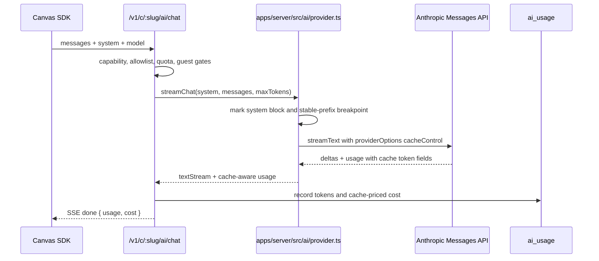

# feat: Anthropic prompt caching in the AI proxy

## Goal Capsule

**Objective.** Add Anthropic prompt caching to `POST /v1/c/:slug/ai/chat` so stable system prompts and prior conversation turns are cacheable automatically, while returning cache token usage so callers can verify hits and misses.

**Product authority.** The requested behavior is provider-specific: when forwarding to Anthropic, apply ephemeral cache control to the final system prompt block and to the last content block before the newest user turn. Preserve the current SDK request shape unless implementation proves an opt-in is required.

**Open blockers.** None. This plan chooses automatic caching by default and treats an explicit `cache?: boolean` request flag as deferred.

**Build boundary.** Server AI provider/route, AI metering, SDK result types, runtime docs, and generated docs content in this repo. No dashboard controls, provider selection redesign, or new AI endpoint.

---

## Product Contract

### Summary

The AI proxy should make repeated large prompt prefixes cheaper without asking canvas authors to change their request bodies. Follow-up turns should reuse Anthropic's prompt cache for stable context, and the terminal `done` usage should expose the cache write/read token counts alongside existing input/output usage and cost.

### Problem Frame

The current AI primitive streams through a one-file Anthropic provider seam and records one `ai_usage` row per call. It forwards the system prompt and message history without cache breakpoints, then prices the returned input/output token counts at base input/output rates. In a multi-turn chat, every follow-up can reprocess a large stable system prompt plus prior messages at full input cost even though Anthropic supports caching prompt prefixes for roughly five minutes.

### Requirements

- R1. The server enables Anthropic prompt caching automatically for AI chat calls; existing canvas code continues to call `canvasdrop.ai.chat(messages, { model, system, maxTokens })` or `stream(...)` without a new option.
- R2. The Anthropic request marks the final system prompt block with ephemeral cache control when `system` is present.
- R3. The Anthropic request marks the last cacheable block in the stable conversation prefix, defined as every message before the newest user turn, when such a prefix exists.
- R4. The newest user turn is not marked as a cache breakpoint, so each follow-up pays full price only for the new user content plus generation while prior stable content can be reused.
- R5. The terminal SSE `done` frame and SDK `chat()` result usage include cache creation and cache read input token counts, defaulting to zero when Anthropic does not return them.
- R6. AI cost and quota accounting use Anthropic prompt-cache pricing instead of charging cache reads/writes at ordinary input-token price.
- R7. `ai_usage` remains the single source of truth for AI spend and token counts, including cache token fields, across SQLite and Postgres.
- R8. Prompt bodies and provider secrets remain server-side only; only metering numbers are persisted or returned.
- R9. Runtime API docs, SDK docs, generated docs content, and the AI learning note reflect the new usage fields and cost semantics.

### Acceptance Examples

- AE1. Given a call with a `system` prompt and one newest user message, when the proxy calls the provider, the system prompt is cache-marked and the user message is not.
- AE2. Given a multi-turn transcript ending in a user message, when the proxy calls the provider, the last message before that user turn is cache-marked as the stable-prefix breakpoint.
- AE3. Given Anthropic returns cache write/read tokens, when `canvasdrop.ai.chat()` resolves, `usage.cacheCreationInputTokens` and `usage.cacheReadInputTokens` expose those values and `cost` reflects the cache pricing multipliers.
- AE4. Given an older call with no cache token fields in the DB, quota and usage summaries still treat those cache fields as zero after migration.

### Scope Boundaries

**In scope:** Anthropic prompt caching for the existing text chat primitive; cache-aware metering and pricing; additive SDK result fields; docs/learning updates; dual-dialect migrations.

**Deferred to follow-up work:** a user-facing `cache?: boolean` toggle, one-hour cache TTL selection, cache pre-warming, automatic prompt compaction, structured-output helper caching, dashboard charts that split cache reads/writes from ordinary input, and multi-provider caching abstractions.

**Outside this plan:** changing model allowlists, adding providers, logging prompt/response bodies, storing conversation transcripts, or changing authorization/capability gates.

---

## Planning Contract

### Key Technical Decisions

- KTD1. Enable caching automatically, with no request option. The feature is an internal provider optimization for Anthropic and the current SDK request body already carries the stable prompt material. Adding `cache?: boolean` would widen the canvas-facing contract without being necessary for the requested cost win.
- KTD2. Use explicit AI SDK provider options, not Anthropic top-level automatic caching. The repo already quarantines `ai` and `@ai-sdk/anthropic` inside `apps/server/src/ai/provider.ts`; AI SDK supports `providerOptions.anthropic.cacheControl` on system messages and message/message-part blocks. Explicit breakpoints also match the request's "system plus stable prefix" shape and avoid marking the newest user turn.
- KTD3. Rebuild the provider prompt as `ModelMessage[]` when caching is enabled. Convert `system` into a leading system message with `providerOptions.anthropic.cacheControl = { type: "ephemeral" }`, then append user/assistant messages and add the same provider option to the last stable-prefix message. Do not pass a duplicate top-level `system` string in that mode.
- KTD4. Keep `inputTokens` as total input tokens and add cache detail fields. AI SDK 6 normalizes Anthropic usage to `LanguageModelUsage.inputTokens` as total input plus `inputTokenDetails.cacheWriteTokens` and `cacheReadTokens`. The public `AiUsage` remains backward-compatible by keeping `inputTokens`/`outputTokens` and adding `cacheCreationInputTokens`/`cacheReadInputTokens`.
- KTD5. Price cache tokens with Anthropic's multipliers. Base uncached input tokens cost the model's existing input rate, 5-minute cache writes cost 1.25x base input, cache reads cost 0.1x base input, and output tokens keep the output rate. This preserves quota enforcement against actual billed cost rather than inflated or undercounted cost.
- KTD6. Persist cache token counts in `ai_usage`. Persisting only the terminal response would make dashboard/admin spend harder to audit and would leave quota/debugging with less evidence. Additive integer columns default to zero so existing rows remain valid.
- KTD7. Treat cache behavior as best-effort. Anthropic has model-specific minimum cacheable prompt lengths and exact-prefix matching; short prompts or changed prefixes may return zero cache fields. This is not an error and should not change response text or route status.
- KTD8. No MCP parity work is required. This changes the runtime AI primitive's behavior and SDK result contract, not a new owner-facing management action. Agents using the runtime API receive the same response fields as browser code.

### System-Wide Impact

- **Runtime API:** The terminal AI SSE `done` frame grows additively; existing consumers that read only `inputTokens`, `outputTokens`, or `cost` keep working.
- **SDK contract:** `AiUsage` gains cache detail fields while preserving the current `chat(messages, options)` request shape and the stream iterator behavior.
- **Persistent metering:** `ai_usage` gains additive cache token columns, and cost windows continue to use persisted `cost_usd` as the billing/quota source of truth.
- **Quota semantics:** Quota enforcement remains spend-based, but the spend calculation changes from base prompt-token pricing to cache-aware billed-cost pricing.
- **Docs surfaces:** Source docs and committed generated docs content must both move together so `/docs` and `/llms.txt` match the runtime response.
- **MCP:** No MCP tool changes are required because this is runtime primitive behavior, not a new owner-management capability.

### High-Level Technical Design

### Risks & Dependencies

- **AI SDK surface drift.** The installed stack is `ai@6.0.203` and `@ai-sdk/anthropic@3.0.84`; implementation should verify `streamText.providerMetadata` and `LanguageModelUsage.inputTokenDetails` against local types before editing. Keep the blast radius inside `apps/server/src/ai/provider.ts`.
- **Cache-hit side channel.** Anthropic cache entries are workspace-isolated and exact-prefix matched, but returning cache-read counts can reveal that an identical prompt prefix was recently used under the same provider workspace. Under canvas-drop's trusted-org model this is acceptable; do not persist prompt text or add user/canvas-identifying material to prompts to "solve" it.
- **Migration discipline.** Adding `ai_usage` columns requires schema changes and generated migrations for both dialects. Schema parity alone is not enough because tests apply real migrations.
- **Cost regression.** Existing `costUsd(model, inputTokens, outputTokens)` would overcharge cache reads and under-model cache writes if reused blindly. Add a new cache-aware cost function and keep tests at pricing-boundary precision.
- **Docs drift.** `docs/site/**` is the source, while `apps/server/src/docs/generated-content.ts` is committed generated output. Rebuild docs so `/docs` and `/llms.txt` reflect the usage fields.

---

## Implementation Units

### U1. Provider prompt cache breakpoints

- **Goal:** Apply Anthropic cache-control breakpoints in the provider seam without changing the route or SDK request body.
- **Requirements:** R1, R2, R3, R4, R8; covers AE1 and AE2.
- **Dependencies:** None.
- **Files:** `apps/server/src/ai/provider.ts`; `apps/server/src/ai/provider.test.ts`; `apps/server/src/ai/testing.ts`.
- **Approach:** Extend `ChatUsage` with `cacheCreationInputTokens` and `cacheReadInputTokens`. Add a small prompt-building helper in the provider seam that emits `ModelMessage[]` with Anthropic `providerOptions` on the system block and stable-prefix block. The helper should find the newest user turn by scanning backward for the last `role: "user"` and should cache the message immediately before it when present; unusual transcripts that do not end in a user turn should still cache the system prompt and avoid throwing.
- **Patterns to follow:** Keep `@ai-sdk/anthropic` and AI SDK-specific message/provider option shapes quarantined to `apps/server/src/ai/provider.ts`; tests stay offline through `fakeProvider` or pure helper tests.
- **Test scenarios:**
  - Given `system` plus one user message, the built provider prompt contains one system cache breakpoint and no user-message breakpoint.
  - Given user/assistant/user history, the assistant message before the latest user message receives the stable-prefix cache breakpoint.
  - Given user/assistant/user/assistant history, the helper does not mark the final assistant response as the newest-turn breakpoint; it chooses the stable block before the latest user turn or skips conversation-prefix caching if that would be ambiguous.
  - Given no system and a single user message, the provider sends no cache breakpoints and still streams normally.
  - Given AI SDK usage with cache-read/write details, `streamChat(...).usage` resolves all four token fields with missing details defaulted to zero.
- **Verification:** Provider tests prove prompt shaping and usage extraction without network calls; typecheck proves the AI SDK provider option shape.

### U2. Cache-aware metering, pricing, and migrations

- **Goal:** Persist cache token counts and compute billed cost using Anthropic prompt-cache rates.
- **Requirements:** R6, R7, R8; covers AE3 and AE4.
- **Dependencies:** U1 for the `ChatUsage` shape.
- **Files:** `apps/server/src/ai/pricing.ts`; `apps/server/src/ai/pricing.test.ts`; `apps/server/src/db/repositories/ai-usage.ts`; `apps/server/src/db/repositories/ai-usage.test.ts`; `packages/shared/src/db/schema.pg.ts`; `packages/shared/src/db/schema.sqlite.ts`; `packages/shared/src/db/types.ts`; `packages/shared/src/db/schema.test.ts`; `drizzle/pg/*`; `drizzle/sqlite/*`.
- **Approach:** Add `cache_creation_input_tokens` and `cache_read_input_tokens` integer columns with default zero. Extend `AiUsageInput`, `record`, `canvasTotals`, `platformSpend`, and any grouped spend/tokens projections to include the new fields where useful. Replace or overload `costUsd` with a cache-aware function that prices `noCacheInputTokens = inputTokens - cacheCreationInputTokens - cacheReadInputTokens` defensively clamped at zero, cache writes at 1.25x input, cache reads at 0.1x input, and outputs at the existing output rate.
- **Execution note:** Generate additive migrations for both dialects after schema edits; do not rely on schema parity as proof that migrated DBs have the columns.
- **Patterns to follow:** `docs/solutions/2026-06-13-dual-dialect-drizzle-seam.md`; existing `ai_usage` repository typed `any` dialect seam; pricing tests' fractional precision style.
- **Test scenarios:**
  - Cache-aware cost for Haiku, Sonnet, and Opus models prices ordinary input, cache writes, cache reads, and output at the documented multipliers.
  - Unknown/unpriced model behavior remains unchanged: route-level checks reject it before cost is used.
  - `record` writes cache token fields and spend windows continue summing `cost_usd` identically on SQLite and Postgres.
  - Existing-style rows with omitted cache fields read back as zeros after migration/defaults.
  - `canvasTotals` and `platformSpend` include total input/output as before and expose cache token totals if implementation chooses to surface them to admin/usage helpers.
- **Verification:** Dual-dialect repository tests and schema parity pass; generated `drizzle/pg` and `drizzle/sqlite` migrations are committed.

### U3. AI route SSE usage and quota accounting

- **Goal:** Thread cache-aware usage from the provider through persistence and the terminal SSE `done` frame.
- **Requirements:** R5, R6, R7, R8; covers AE3.
- **Dependencies:** U1, U2.
- **Files:** `apps/server/src/routes/canvas-ai.ts`; `apps/server/src/routes/canvas-ai.test.ts`; `apps/server/src/ai/testing.ts`.
- **Approach:** When `persist()` resolves provider usage, compute cache-aware cost, record cache token fields in `ai_usage`, and emit `done` with `usage: { inputTokens, outputTokens, cacheCreationInputTokens, cacheReadInputTokens }`. Preserve existing pre-stream errors, in-stream error frame behavior, abort handling, and server-resolved user/canvas attribution.
- **Patterns to follow:** Existing `persist()` finally path in `canvas-ai.ts`; `USAGE_SETTLE_TIMEOUT_MS` timeout behavior; current route tests around upstream failure and client abort.
- **Test scenarios:**
  - Streaming happy path emits a terminal `done` frame with the two new cache usage fields and cache-priced cost.
  - Cache fields default to zero when a provider returns only input/output tokens.
  - Recorded `ai_usage` row carries cache token fields against the server-resolved user and canvas.
  - Client-abort path still records usage once, including cache tokens when the provider usage promise settles.
  - Quota rejection still uses prior persisted `cost_usd`; a cached prior call contributes its discounted cost to the spend window.
  - Existing guest AI, capability-off, model-not-allowed, quota-exceeded, invalid-body, and upstream-error tests still pass without response-shape regressions.
- **Verification:** Route tests cover SSE shape, persistence, and cost; no prompt or provider key appears in responses/log assertions.

### U4. SDK result types and served docs

- **Goal:** Make cache usage visible to canvas code and documented in the generated docs/llms surfaces.
- **Requirements:** R1, R5, R9; covers AE3.
- **Dependencies:** U3.
- **Files:** `packages/sdk/src/index.ts`; `packages/sdk/src/index.test.ts`; `docs/site/sdk/ai.md`; `docs/site/api/runtime-api.md`; `docs/site/agents/llms.md` if needed; `apps/server/src/docs/generated-content.ts`.
- **Approach:** Extend `AiUsage` with optional-or-required numeric `cacheCreationInputTokens` and `cacheReadInputTokens`, defaulting to zero when a frame omits them. `chat()` returns the extended usage object; `stream()` continues yielding text only. Update runtime and SDK docs to show the expanded `usage` object and note that prompt caching is automatic and best-effort. Run the docs build so generated content and `/llms.txt` stay coherent.
- **Patterns to follow:** Existing SSE parser and typed-error tests in `packages/sdk/src/index.test.ts`; docs build contract in `scripts/build-docs.mjs`.
- **Test scenarios:**
  - `chat()` parses a `done` frame with cache usage and returns those values.
  - `chat()` parses an old/minimal `done` frame and returns zero cache usage values.
  - `stream()` remains unchanged and does not require callers to handle usage.
  - Docs generated content changes only as a consequence of edited source docs.
- **Verification:** SDK tests pass; docs build produces committed generated content with no drift.

### U5. Learning capture and final gates

- **Goal:** Preserve the non-obvious provider/cache accounting decisions for future AI work and run the repo's quality gates.
- **Requirements:** R9.
- **Dependencies:** U1, U2, U3, U4.
- **Files:** `docs/solutions/2026-07-07-anthropic-prompt-caching.md`; `docs/solutions/README.md`.
- **Approach:** Add a concise learning explaining the explicit-breakpoint choice, AI SDK 6 usage fields, cache-aware pricing, and the cross-workspace side-channel consideration. Update the solutions index. Run the standard repo gates and any focused tests from prior units.
- **Patterns to follow:** `docs/solutions/2026-06-13-ai-realtime-primitives.md`; `docs/solutions/README.md` index style.
- **Test scenarios:** Test expectation: none -- this unit adds documentation and runs verification gates after feature-bearing units.
- **Verification:** The learning exists, index is updated, and full lint/typecheck/test gates are green.

---

## Verification Contract

| Gate | Applies to | Done signal |
|---|---|---|
| Focused provider tests | U1 | Prompt cache breakpoint helper and usage extraction pass offline. |
| Focused pricing and AI usage repository tests | U2 | Cache-aware cost and dual-dialect persisted cache fields pass. |
| Focused AI route tests | U3 | SSE `done` usage, discounted cost, persistence, abort, and quota paths pass. |
| Focused SDK tests | U4 | `chat()` returns cache usage fields and remains backward-compatible with old frames. |
| Docs build | U4 | `apps/server/src/docs/generated-content.ts` is regenerated from source docs with no unintended drift. |
| `pnpm lint` | All units | Biome reports clean. |
| `pnpm typecheck` | All units | TypeScript passes across root, SDK, dashboard, and server workspaces. |
| `pnpm test` | All units | Full in-process SQLite and Postgres/PGlite suite passes. |

---

## Definition of Done

- Anthropic prompt caching is active by default for the AI chat proxy with explicit breakpoints on system prompt and stable conversation prefix when present.
- Existing canvas AI calls require no request-body change.
- Terminal SSE and SDK `chat()` usage expose cache creation/read token counts with zero defaults.
- `cost` and `ai_usage.cost_usd` reflect prompt-cache pricing, not ordinary input pricing for every token.
- `ai_usage` schema, types, repository, and migrations are updated in both dialects without breaking existing rows.
- Runtime API docs, SDK docs, generated docs content, and `docs/solutions` explain the new behavior and usage fields.
- Full repo gates are green, and abandoned exploratory code is removed from the final diff.

---

## Appendix

### Sources & Research

- User request in this planning turn: apply Anthropic prompt caching to `POST /v1/c/<slug>/ai/chat`, cache the system prompt plus prior conversation, and return `cache_creation_input_tokens` / `cache_read_input_tokens`.
- Existing code: `apps/server/src/ai/provider.ts` quarantines AI SDK/Anthropic imports; `apps/server/src/routes/canvas-ai.ts` streams SSE and records usage; `packages/sdk/src/index.ts` parses AI SSE frames; `apps/server/src/db/repositories/ai-usage.ts` is the single AI metering source.
- Existing learnings: `docs/solutions/2026-06-13-ai-realtime-primitives.md`, `docs/solutions/2026-06-13-dual-dialect-drizzle-seam.md`, and `docs/solutions/2026-06-14-admin-managed-config-and-sdk-dev-build.md`.
- Anthropic prompt caching docs: `https://platform.claude.com/docs/en/build-with-claude/prompt-caching`.
- AI SDK Anthropic provider docs: `https://ai-sdk.dev/providers/ai-sdk-providers/anthropic`.
- Local installed types: `ai@6.0.203` exposes `LanguageModelUsage.inputTokenDetails.cacheReadTokens/cacheWriteTokens`; `@ai-sdk/anthropic@3.0.84` maps Anthropic `cache_creation_input_tokens` and `cache_read_input_tokens` into that usage detail and provider metadata.
