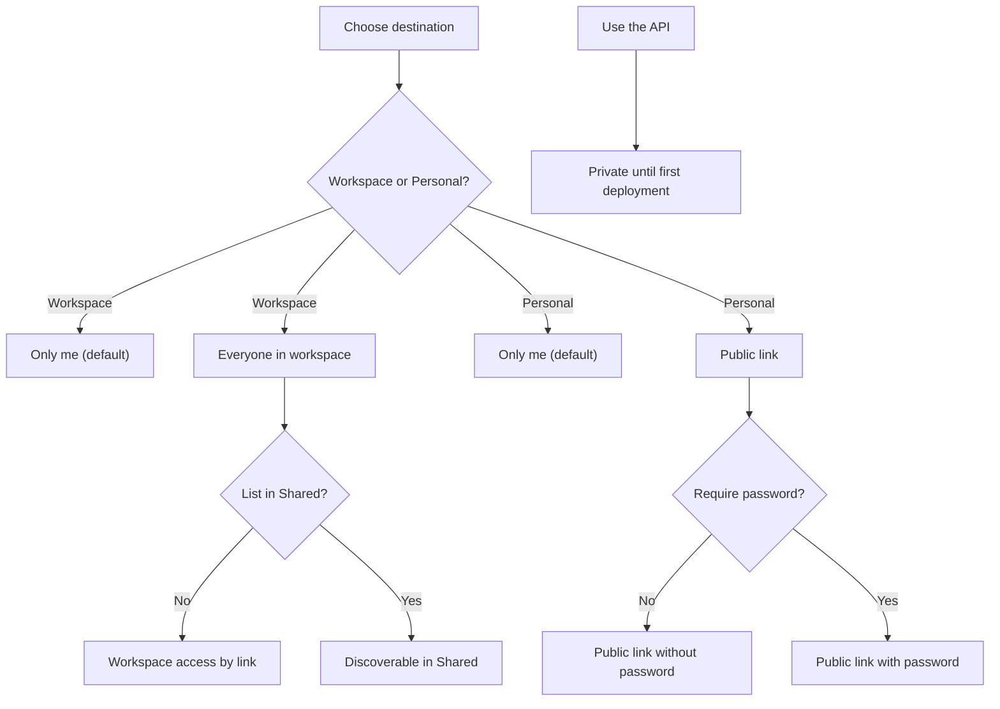
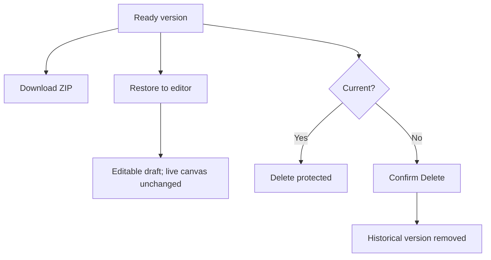
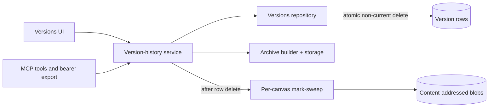

# Create-Time Audience and Version Actions - Plan

## Goal Capsule

- **Objective:** Let owners choose their common audience while creating a canvas, simplify version history to the actions owners actually use, and make the editor file tree calmer on first open.
- **Product authority:** The repo owner confirmed the destination-based audience rules, the version-action scope, and the current-version deletion protection.
- **Open blockers:** None.

---

## Product Contract

### Summary

Canvas creation gains a compact audience shortcut that follows the selected destination: Workspace canvases can stay private or open to the workspace, while Personal canvases can stay private or use a public link with an optional password.
Version history exposes Download, Restore, and safe Delete actions directly, while individual file work remains in an editor whose folders start collapsed.

### Problem Frame

Creating a canvas and sharing it are currently separate tasks even when the owner already knows the intended audience.
The common cases are private ownership and workspace-wide access; for a Personal canvas, the comparable open option is a public link, sometimes protected by a password.

Version ZIP download already exists but is hidden in an overflow menu, and restoring a version is mixed with broader version-management controls.
Owners do not need a second historical file browser when they can restore a version into the editor and work with its files there.
The editor's expanded-by-default folders add visual noise when a draft contains a deeper tree.

### Key Decisions

- **Audience follows the selected destination.** Workspace and Personal canvases receive different shorthand options because their valid sharing outcomes differ.
- **The shortcut stays narrow.** Create covers the common audience decision and its required modifier; people, teams, expiry, gallery, and other sharing controls remain in Share.
- **Visibility modifiers require an explicit choice.** `List in Shared` and `Require password` start unchecked.
- **Empty API creation stays private.** The API path does not preserve pending sharing intent before the first deployment.
- **Version history remains action-oriented.** It offers whole-version download, restore into the draft, and deletion of non-current history without becoming a historical file browser.
- **The live version is protected.** Deleting the current version never silently promotes another version or unpublishes the canvas.

The create-time decision boundary is:



### Actors

- A1. **Canvas owner.** Chooses the destination and initial audience, manages version history, and edits draft files.
- A2. **Workspace colleague.** Opens a workspace-shared canvas and may discover it in Shared when the owner opted into listing.
- A3. **Public visitor.** Opens a Personal canvas through a permitted public link and supplies its password when required.
- A4. **Agent or script.** Creates an empty API canvas privately, deploys it, and reaches the same supported sharing and version-management outcomes through the agent surface.

### Requirements

**Create-time audience**

- R1. The create flow must offer an Audience choice before completing a canvas that publishes during creation.
- R2. Audience must default to `Only me` and must never widen access without an owner choice.
- R3. A Workspace destination must offer `Only me` and `Everyone in workspace`.
- R4. Choosing `Everyone in workspace` must reveal an unchecked `List in Shared` choice that controls discovery without changing workspace access.
- R5. A Personal destination must offer `Only me` and `Public link` when public links are permitted for the instance and owner.
- R6. Choosing `Public link` must reveal an unchecked `Require password` choice and a way to enter the password when enabled.
- R7. When public links are unavailable, Personal creation must remain private-capable and explain why the public option cannot be chosen.
- R8. Changing the destination must replace incompatible audience choices and return safely to `Only me` rather than carrying wider access across destinations.
- R9. Paste, folder, and ZIP creation must finish with the selected audience and modifiers applied to the newly published canvas.
- R10. `Use the API` must omit the audience shortcut and create an empty private canvas; sharing is configured only after its first deployment.
- R11. Specific people, teams, expiry, gallery listing, and other advanced controls must remain available after creation in Share.

**Version history**

- R12. Every ready version must offer a visible Download action that downloads the complete version as a ZIP archive.
- R13. Every ready version must offer Restore, which loads that version into the editable draft and opens the editor without changing the live canvas.
- R14. Restore must retain the existing confirmation when unpublished draft changes would be discarded.
- R15. Every non-current ready version must offer Delete behind a destructive confirmation.
- R16. Deleting a historical version must remove only that version and must not damage the current version, the draft, or another retained version.
- R17. The current live version must not be deletable; the interface must make that protection understandable.
- R18. Version history must not add individual historical file browsing or per-file downloads.

The version actions and their boundaries are:



**Editor files**

- R19. Folders in the editor file tree must start collapsed on each editor mount.
- R20. Root-level files must remain visible while folders are collapsed, and owners must be able to expand folders independently.
- R21. The editor must retain an easy download action for the selected draft file after a historical version is restored.

**Permissions and agent parity**

- R22. Audience changes and version mutations must preserve the existing owner-only, no-existence-leak, disabled-canvas, public-link, and publish-first protections.
- R23. Agent workflows must be able to reach the same supported sharing outcomes and restore or delete eligible versions without requiring a browser-only workaround.
- R24. Agent export of a complete version must avoid forcing large archive bytes through model context.

### Key Flows

- F1. **Workspace create**
  - **Trigger:** A1 selects a Workspace destination in Paste HTML, Files or folder, or Upload ZIP.
  - **Steps:** A1 chooses `Only me` or `Everyone in workspace`; the latter reveals `List in Shared`; creation publishes with those choices.
  - **Outcome:** The canvas is private, workspace-link-only, or workspace-listed exactly as chosen.
  - **Covered by:** R1-R4, R8-R9

- F2. **Personal create**
  - **Trigger:** A1 selects Personal in a publishing create method.
  - **Steps:** A1 chooses `Only me` or an available `Public link`; Public link may add a password.
  - **Outcome:** The canvas publishes privately or with the chosen public access and lock.
  - **Covered by:** R1-R2, R5-R9

- F3. **API create**
  - **Trigger:** A1 or A4 chooses `Use the API`.
  - **Steps:** The canvas is created empty with no audience shortcut; its first deployment happens later.
  - **Outcome:** The canvas remains private until a post-deployment sharing change.
  - **Covered by:** R10

- F4. **Restore and work with files**
  - **Trigger:** A1 selects Restore on a ready version.
  - **Steps:** Dirty draft changes are confirmed when necessary; the selected version becomes the draft; the editor opens with folders collapsed.
  - **Outcome:** A1 can inspect, edit, and download individual draft files without changing live content until Publish.
  - **Covered by:** R13-R14, R18-R21

- F5. **Delete history safely**
  - **Trigger:** A1 selects Delete on a non-current ready version.
  - **Steps:** A destructive confirmation names the version; confirmation removes that version.
  - **Outcome:** The version disappears while the current canvas, draft, and other history remain intact.
  - **Covered by:** R15-R17, R22-R23

### Acceptance Examples

- AE1. **Covers R2-R4.** A Workspace canvas created with `Only me` is private; choosing `Everyone in workspace` with `List in Shared` off makes it link-only for workspace members.
- AE2. **Covers R3-R4.** A Workspace canvas created with `Everyone in workspace` and `List in Shared` on appears in Shared for eligible colleagues.
- AE3. **Covers R5-R7.** A Personal canvas can publish through a public link with or without a password when public links are allowed; when they are not, the public choice cannot be submitted.
- AE4. **Covers R8.** Switching from a Workspace destination with workspace access selected to Personal resets Audience to `Only me`.
- AE5. **Covers R10.** `Use the API` creates an unpublished private canvas even when another publishing method previously had a wider audience selected.
- AE6. **Covers R12-R14.** Download retrieves the selected version's ZIP; Restore loads that exact version into the draft and leaves the live version unchanged.
- AE7. **Covers R15-R17.** Deleting a non-current version removes it after confirmation, while the current version has no available destructive delete action.
- AE8. **Covers R16.** Deleting a version that shares files with another retained version does not make the retained version or restored draft unreadable.
- AE9. **Covers R18-R21.** Opening the editor after Restore shows root files and collapsed folders; expanding a folder exposes its files, and the selected file can be downloaded.
- AE10. **Covers R22-R24.** A non-owner cannot learn about or mutate another owner's versions, while an authorized agent can restore or delete eligible history and obtain a complete-version export without receiving a large inline archive.

### Scope Boundaries

- The create shortcut does not embed Specific people, Team, expiry, gallery, template, guest-AI, or other advanced Share controls.
- Workspace destinations do not add a create-time Public link shortcut; owners can choose it later in Share.
- Version history does not expose a historical file tree, per-file historical downloads, file previews, or edits in place.
- The current version cannot be deleted, and deletion never promotes another version or unpublishes the canvas automatically.
- The API path does not store pending audience intent, and this work does not change version-retention limits.

### Dependencies and Assumptions

- The existing access ladder, discovery model, password gate, public-link operator/account gates, and publish-first invariant remain authoritative.
- Restore continues to mean "load into the draft" rather than "make current"; changing the live version remains a separate action.
- Historical deletion must account for content shared across versions and drafts so retained content remains readable.
- Agent-native parity is a completion requirement, but planning chooses the token-efficient export mechanism.

### Sources

- `apps/dashboard/src/routes/new.tsx` — current source-first creation flow and API path.
- `apps/dashboard/src/routes/canvas.share.tsx` — access ladder, discovery, password, and publish-first behavior.
- `apps/dashboard/src/routes/canvas.versions.tsx` — current version rows, restore flow, and hidden ZIP download.
- `apps/dashboard/src/components/FileTree.tsx` — current expanded-by-default folder behavior.
- `apps/dashboard/src/routes/canvas.editor.tsx` — draft file download and restored-draft editing behavior.
- `apps/server/src/routes/management.ts` — management create, version listing, and ZIP export behavior.
- `apps/server/src/mcp/draft-tools.ts` — existing agent restore-to-draft behavior.
- `docs/solutions/2026-06-13-dashboard-spa-patterns.md` — create-flow key handling and orphan cleanup constraints.
- `docs/plans/2026-06-17-001-feat-mcp-user-parity-plan.md` — owner-surface agent parity contract.

---

## Planning Contract

### Product Contract Preservation

The confirmed Product Contract above is unchanged; this planning pass adds implementation sequencing, technical decisions, risks, and verification without altering its requirements, flows, examples, or scope boundaries.

### Assumptions

- A create-time audience failure after a successful publish must fail closed: preserve the published canvas as private, preserve its one-time deploy key, and tell the owner that sharing was not applied instead of deleting working content or implying that the wider audience succeeded.
- A complete agent export may be delivered as an authenticated binary download URL. The archive itself does not need to be returned inline by an MCP tool, provided the URL accepts the same verified MCP OAuth bearer and remains owner-scoped.
- Version deletion applies only to `ready` historical rows. Pending-version cleanup and the existing keep-last-ten policy remain owned by the deploy lifecycle.
- The existing `Make current` action remains in Version history; this feature makes Download, Restore, and Delete easy without removing the separate rollback capability.
- No database schema change or migration is expected: guarded deletion operates on existing version rows and content-addressed manifests.

### Key Technical Decisions

- KTD1. Apply audience only after the first publish. Paste, folder, and ZIP create paths continue to create and deploy privately, then call the existing settings service with `whole_org` plus `discoverability`, or `public_link` plus optional password. This preserves the publish-first invariant and reuses the same public-link, tenancy, password-hashing, audit, and realtime gates as Share and MCP.
- KTD2. Treat initial sharing as a fail-closed post-publish step. A deploy failure still deletes the empty orphan as today; a later audience failure does not delete the now-valid published canvas. The key reveal remains available and the owner receives a specific private-fallback notice with a path to Share.
- KTD3. Keep create-audience state destination-derived and method-gated. Workspace selection determines whether the wider choice means `whole_org`; Personal determines whether it means `public_link`; changing destination resets the state to private; switching to API hides and ignores audience state so an empty API canvas is always private.
- KTD4. Derive public availability exclusively from `/api/me.canPublishPublic`. The disabled Personal option is explanatory UI only; the server remains authoritative and re-checks both instance and owner gates when settings are applied.
- KTD5. Add an atomic repository operation for deleting one `ready`, non-current version. Its delete predicate re-reads `canvases.current_version_id` inside the statement, mirroring `pruneBeyond`, so a concurrent rollback cannot leave the live pointer dangling.
- KTD6. Reclaim bytes only through the existing per-canvas mark-sweep. After the guarded row deletion succeeds, invoke a GC-only engine operation; never delete per-version blobs inline because retained versions and the draft may share their hashes.
- KTD7. Put archive assembly and historical deletion behind one version-history service used by management routes and MCP tools. Owner/mutable guards stay at each transport boundary, while archive lookup, guarded deletion, audit, and GC behavior cannot drift. Archive assembly is all-or-nothing: if any manifest blob is missing, return a stable failure rather than silently emitting an incomplete ZIP.
- KTD8. Give MCP a token-efficient export handoff. `list_versions` returns an owner-scoped download URL for every ready version, and a pre-session-gateway GET route streams the ZIP only when the caller presents a verified live MCP OAuth access token for the owning account. The bearer stays in the `Authorization` header, never the URL or logs; the route uses the existing per-caller MCP rate limit before doing archive work. The existing dashboard download route uses the same archive service.
- KTD9. Keep version rows action-oriented. Render direct Download and Restore buttons for ready versions, retain `Make current` as a distinct live-pointer action, render destructive Delete only for non-current ready versions, and show a non-interactive protection cue on the current version.
- KTD10. Initialize the editor tree from all directory paths as collapsed on mount. Root files remain rendered; each folder expands independently through the existing per-path set without persisting expansion between editor mounts.

### System-Wide Impact

- **Dashboard create:** The publishing create methods gain compact audience controls and one post-deploy settings call; API-only creation remains unchanged and private.
- **Sharing semantics:** No new access mode is introduced. The create shortcut produces existing `private`, `whole_org`, `public_link`, `link_only`, `listed`, and password settings through the authoritative resolver.
- **Version storage:** Historical deletion removes one row, then runs content-addressed GC against surviving versions, draft, and active upload-session references. No schema or retention-policy change is required.
- **Management API:** Version history gains an owner-only DELETE action; the existing ZIP endpoint moves to a shared archive service without changing its dashboard URL or filename contract.
- **MCP:** `delete_version` is added, `list_versions` exposes download URLs, and a bearer-authenticated binary export route allows archives to bypass model context. Existing `restore_draft` and `update_canvas` continue to provide restore and sharing parity.
- **Audit and lifecycle:** Historical deletion is audited. Disabled canvases reject deletes through the existing mutable gate; reads/downloads retain owner-only behavior; blocking or de-allowlisting an MCP user invalidates export on the next bearer verification.
- **Documentation:** Authoring, editor/version, and MCP docs must describe the create shortcut, collapsed folders, deletion boundary, and OAuth download handoff; generated docs content is rebuilt from source.

### High-Level Technical Design

```mermaid
sequenceDiagram
  participant Owner as Canvas owner
  participant Create as Create UI
  participant Deploy as Existing create/deploy APIs
  participant Settings as Shared settings resolver

  Owner->>Create: Choose destination and audience
  Create->>Deploy: Create and publish privately
  Deploy-->>Create: Published canvas and one-time key
  alt Only me
    Create-->>Owner: Reveal key; canvas remains private
  else Wider audience
    Create->>Settings: Apply existing access and modifier fields
    Settings-->>Create: Authoritative shared canvas state
    Create-->>Owner: Reveal key; selected audience active
  else Audience application fails
    Settings-->>Create: Stable error
    Create-->>Owner: Reveal key + private fallback notice
  end
```



### Risks & Dependencies

- **Post-publish partial success.** The create process spans deploy and settings calls, so it cannot be transactionally atomic. The safe recovery is explicit private fallback with the key preserved; tests must distinguish deploy failure (orphan cleanup) from audience failure (published canvas retained).
- **Current-version deletion race.** A pre-read UI check is insufficient. The repository delete predicate must exclude the live pointer atomically on both SQLite and Postgres, and tests must simulate a pointer change before deletion.
- **Shared-blob data loss.** A deleted version may share hashes with another version or the draft. Only mark-sweep may reclaim bytes; dual-dialect repository tests plus storage/route scenarios must prove retained content stays readable.
- **MCP bearer boundary.** The binary route sits before the dashboard session gateway. It must reuse the provider's live-token verification, server-derived user id, owner check, account lifecycle checks, `Authorization`-header-only credential handling, per-caller rate limit, body-free GET behavior, and no-existence-leak response posture.
- **Archive memory ceiling.** The existing ZIP implementation assembles up to the canvas size limit in memory. This work extracts and reuses that behavior rather than expanding archive scope; a future streaming ZIP refactor is outside this plan.
- **Create UI state drift.** Destination, method, audience, listing, and password state interact. Pure derivation/reset tests and full route tests must cover switching Workspace to Personal, public-disabled users, and API creation after a wider prior selection.
- **Docs drift.** Source docs and committed generated content must be updated together so `/docs`, `/llms.txt`, and MCP guidance match the runtime surface.

---

## Implementation Units

### U1. Guarded historical deletion and shared version-history service

- **Goal:** Create one safe server seam for complete-version ZIP assembly and deletion of a single eligible historical version.
- **Requirements:** R12, R15-R17, R22; covers AE6-AE8.
- **Dependencies:** None.
- **Files:** `apps/server/src/db/repositories/versions.ts`; `apps/server/src/db/repositories/versions.test.ts`; `apps/server/src/deploy/engine.ts`; new `apps/server/src/canvas/version-history.ts`; new `apps/server/src/canvas/version-history.test.ts` if service-level coverage is clearer than route-only coverage.
- **Approach:** Add `deleteReadyNonCurrent(canvasId, number)` with an atomic live-pointer exclusion and a deleted-row return. Expose a GC-only method from the deploy engine and have the version-history service call it after deletion. Move manifest-to-ZIP assembly into the service and fail the whole export with a stable error when a manifest blob is missing; record the historical deletion audit event from the shared service.
- **Patterns to follow:** The atomic guard in `versionsRepository.pruneBeyond`; `collectGarbage` in `canvas/blob-gc.ts`; row-delete-then-mark-sweep sequencing in `deploy/engine.ts`; `rootEntry`/manifest scoping for owner-specific history.
- **Test scenarios:**
  - Deleting a ready non-current version removes exactly that row in both dialects.
  - Deleting the current version returns a protected/unavailable result and leaves the pointer and row intact.
  - A pointer changed to the target between selection and deletion is re-read by the DELETE predicate and survives.
  - Pending, missing, and cross-canvas version numbers are never deleted.
  - After deletion, shared hashes referenced by a surviving ready version or draft remain readable; a now-unreferenced hash is eligible for GC.
  - Archive assembly returns every manifest path with the existing slug/version filename, refuses a missing or non-ready version, and never returns a partial ZIP when one blob is absent.
- **Verification:** Focused dual-dialect repository tests and version-history service tests pass without schema changes.

### U2. Owner HTTP and MCP version-action parity

- **Goal:** Expose shared download/delete behavior to dashboard owners and authorized agents without duplicating version logic or inlining ZIP bytes into MCP responses.
- **Requirements:** R12-R18, R22-R24; covers AE6-AE8 and AE10.
- **Dependencies:** U1.
- **Files:** `apps/server/src/app.ts`; `apps/server/src/routes/management.ts`; `apps/server/src/routes/management.test.ts`; `apps/server/src/mcp/routes.ts`; `apps/server/src/mcp/routes.test.ts`; `apps/server/src/mcp/server.ts`; `apps/server/src/mcp/server.test.ts`; `apps/server/src/integration/capability-scenarios.test.ts` if the parity inventory is asserted there.
- **Approach:** Wire one version-history service into both transports. Replace the dashboard ZIP route's inline archive logic, add a same-origin owner mutation for historical delete, register `delete_version` behind `requireMutable`, add ready-version OAuth download URLs to `list_versions`, and serve those URLs through the same verified MCP bearer path and per-caller throttle as `/mcp`. Keep the bearer in the header and direct restore in the existing `restore_draft` tool.
- **Patterns to follow:** `ownedCanvas`/`mutableCanvas` and `requireSameOrigin` in management; `requireOwned`/`requireMutable` in MCP; `McpOAuthProvider.verifyAccessToken`; token lifecycle checks in `docs/solutions/2026-06-16-mcp-server-on-hono-and-token-lifecycle.md`.
- **Test scenarios:**
  - Dashboard owner downloads a complete ready version through the unchanged URL and deletes a non-current version after a same-origin request.
  - Current-version, disabled-canvas, invalid-number, missing-version, cross-origin, and non-owner deletes are rejected with the established no-leak/lifecycle posture.
  - `delete_version` deletes only an owned, mutable, non-current ready version and reports current/missing/non-owned failures without leaking existence.
  - `list_versions` includes a complete-export URL for ready versions and marks the current row.
  - The bearer export succeeds with a live OAuth token belonging to the owner, returns ZIP headers/bytes, and rejects missing, revoked, blocked, de-allowlisted, non-owner, malformed-token, or rate-limited callers without accepting credentials in the URL.
  - The MCP tool inventory and capability scenario reflect the new delete tool while existing restore/update tools remain green.
- **Verification:** Focused management, MCP route, MCP server, and parity tests pass; archive bytes are exercised over HTTP, never returned by the tool result.

### U3. Create-audience state model and fail-closed orchestration

- **Goal:** Add a small client-side model that maps destination choices to existing settings patches and safely coordinates publish-then-share across all publishing create methods.
- **Requirements:** R1-R11, R22; covers AE1-AE5.
- **Dependencies:** None; may proceed alongside U1.
- **Files:** `apps/dashboard/src/lib/api.ts`; `apps/dashboard/src/routes/new.tsx`; `apps/dashboard/src/components/ApiKeyReveal.tsx`; new focused helper/test such as `apps/dashboard/src/lib/create-audience.ts` and `apps/dashboard/src/test/create-audience.test.ts`.
- **Approach:** Model `private`, workspace-wide, and public choices separately from their optional modifiers; derive the settings patch rather than storing raw access fields. After Paste, Folder, or ZIP publishes, apply the non-private patch via `api.updateSettings`. Preserve existing empty-orphan deletion only for deploy failures. Return a structured private-fallback result when sharing fails so the one-time-key dialog can explain that the canvas stayed private and offer a direct recovery path to Share without hiding or forfeiting the key.
- **Patterns to follow:** `settingsSchema`/`resolveSettingsUpdate`; `api.updateSettings`; current key-once and orphan-cleanup behavior in `new.tsx`; explicit private defaults in `canvas.share.tsx`.
- **Test scenarios:**
  - Workspace private produces no widening patch; workspace-wide produces `whole_org` plus `link_only` or `listed` exactly as chosen.
  - Personal public produces `public_link`, `link_only`, and password only when the password modifier is enabled; private never submits a stale password.
  - Changing destination resets any wider audience and modifier state to private.
  - Switching to API ignores prior audience state and calls only private `createCanvas`.
  - Deploy failure retains current orphan cleanup; settings failure after deploy does not delete the canvas and surfaces the private fallback plus a Share recovery action inside the key reveal while preserving the one-time key.
- **Verification:** Pure mapping tests and create-route request assertions prove the exact sequence and safe failure split.

### U4. Compact audience controls in Create

- **Goal:** Make the confirmed destination-specific audience shortcut discoverable, accessible, and narrow without turning Create into the full Share screen.
- **Requirements:** R1-R11; covers AE1-AE5.
- **Dependencies:** U3.
- **Files:** `apps/dashboard/src/routes/new.tsx`; `apps/dashboard/src/components/ApiKeyReveal.tsx`; new `apps/dashboard/src/test/new.test.tsx` or equivalent create-route coverage; existing shared form/surface components only when reuse improves consistency.
- **Approach:** Place Audience after Workspace and before optional backend for Paste, Folder, and ZIP. Use clearly labeled private/wider choices; reveal unchecked `List in Shared` only for workspace-wide and unchecked `Require password` plus password input only for Personal public. Disable and explain Public link when `me.canPublishPublic` is false. Hide the entire section for API and reset on destination changes.
- **Patterns to follow:** Accessible native controls and field language in `canvas.share.tsx`; `InlineNotice`, `Field`, and token-driven styling; route-level jsdom fetch harnesses in dashboard tests.
- **Test scenarios:**
  - Workspace defaults to Only me, reveals listing only after Everyone in workspace, and submits listed/link-only correctly.
  - Personal defaults to Only me, reveals password only after Public link, and requires non-empty input only when password is enabled.
  - A public-disabled user sees a disabled choice with an explanation and can still create privately.
  - Workspace-to-Personal and Personal-to-Workspace changes visibly reset to Only me.
  - Paste, folder, and ZIP successful flows apply audience after publish; API has no Audience UI and stays private.
  - An audience failure is announced within the non-dismissable key reveal, where saving the key and opening Share are both reachable by keyboard.
  - Keyboard and accessible-name queries can select every option and modifier without relying on visual position.
- **Verification:** Focused dashboard route tests pass for destination, gate, modifier, submit, and failure states.

### U5. Direct version actions and collapsed editor folders

- **Goal:** Make whole-version Download, Restore, and eligible Delete obvious while keeping individual file work in a calmer editor tree.
- **Requirements:** R12-R21; covers AE6-AE9.
- **Dependencies:** U2 for delete API; U3/U4 are independent.
- **Files:** `apps/dashboard/src/lib/api.ts`; `apps/dashboard/src/lib/mutations.ts`; `apps/dashboard/src/routes/canvas.versions.tsx`; `apps/dashboard/src/components/FileTree.tsx`; `apps/dashboard/src/test/versions.test.tsx`; `apps/dashboard/src/test/file-tree.test.tsx`; `apps/dashboard/src/routes/canvas.editor.tsx` only if the existing selected-file download needs accessibility polish.
- **Approach:** Add a confirm-and-await delete mutation that invalidates versions and relevant canvas/draft caches. Replace the overflow-only download/restore controls with visible buttons on every ready row, including archived canvases; add destructive Delete only for non-current rows and a clear current-version protection hint. Keep live-pointer `Make current` disabled outside active canvases and keep all mutations disabled on admin-disabled canvases. Rename restore language from Edit to Restore while retaining the dirty-draft confirmation and editor navigation. Initialize the collapsed set from all directory nodes when the FileTree mounts; keep root files visible and per-path expansion independent.
- **Patterns to follow:** Confirm-and-await mutations in `mutations.ts`; `ConfirmDialog`; direct row actions and responsive button variants; current selected-file download in `canvas.editor.tsx`.
- **Test scenarios:**
  - Every ready row exposes Download and Restore directly; Download targets the selected version URL.
  - Clean draft Restore proceeds immediately; dirty draft Restore confirms before replacing the draft and navigating to Editor.
  - Non-current Delete opens a destructive version-specific confirmation, issues one DELETE, refreshes history, and shows success/failure feedback.
  - Current version renders no delete control and communicates that it must stop being current first.
  - Archived canvases retain Download, Restore, and eligible Delete while Make current remains unavailable; disabled canvases stay read-only.
  - On initial mount root files and folder rows are visible but nested files are hidden; opening one folder reveals only its subtree; remount collapses folders again.
  - After restore, the editor's selected draft file still exposes the direct download action.
- **Verification:** Focused versions and FileTree tests pass; responsive browser QA confirms actions remain usable at desktop and narrow widths.

### U6. Documentation, learning capture, and full gates

- **Goal:** Keep human and agent guidance aligned with the new create shortcut and version-management surface, capture the safe deletion/export pattern, and close the round with full verification.
- **Requirements:** R11, R18, R21-R24.
- **Dependencies:** U1-U5.
- **Files:** `docs/site/authoring/create-and-publish.md`; relevant editor/version source doc under `docs/site/authoring/`; `docs/site/agents/mcp.md`; `apps/server/src/docs/generated-content.ts`; new `docs/solutions/2026-07-10-create-audience-and-version-deletion.md`; `docs/solutions/README.md`.
- **Approach:** Document which create methods expose Audience, how destination changes its shorthand, why API remains private, and where advanced sharing lives. Document Restore-to-draft versus Make current, current-version deletion protection, collapsed folders, direct draft-file download, `delete_version`, and OAuth bearer export URLs. Rebuild committed docs and capture the atomic-delete-plus-mark-sweep and fail-closed create lessons.
- **Patterns to follow:** Source-first docs generation via `scripts/build-docs.mjs`; concise architecture learnings in `docs/solutions`; agent guidance that prefers binary HTTP transfer over inline model context.
- **Test scenarios:** Test expectation: none -- this unit updates documentation/learning artifacts and runs the feature and repo gates from the prior units.
- **Verification:** Docs generation has no unexplained drift; lint, typecheck, both-dialect tests, build, and browser QA are green.

---

## Verification Contract

| Gate | Applies to | Done signal |
|---|---|---|
| Dual-dialect version repository tests | U1 | One non-current ready row deletes atomically; current/racing targets survive on SQLite and Postgres. |
| Version-history service tests | U1 | ZIP content/filename and row-delete-then-GC preserve surviving version/draft hashes. |
| Management route tests | U2 | Owner download/delete work; current, disabled, non-owner, invalid, missing, and cross-origin paths reject correctly. |
| MCP server and route tests | U2 | Delete parity and bearer ZIP export honor owner and live-account lifecycle gates without inline archive data. |
| Create audience helper/route tests | U3-U4 | Destination mappings, resets, gates, publish-then-share sequencing, API privacy, and fail-closed partial success pass. |
| Versions and FileTree dashboard tests | U5 | Direct actions, confirmations, cache invalidation, current protection, collapsed mount state, expansion, and restored-file download pass. |
| Docs build | U6 | Generated docs content matches edited source docs. |
| `pnpm lint` | All units | Biome reports clean. |
| `pnpm typecheck` | All units | TypeScript passes across shared, SDK, dashboard, and server workspaces. |
| `pnpm test` | All units | Full SQLite and Postgres/PGlite suite passes. |
| `pnpm build` | All units | SDK, dashboard, and server production builds succeed. |
| Browser QA | U4-U5 | Create audience and version/editor flows pass in a running app at desktop and narrow viewport, with screenshots/evidence recorded by the pipeline. |

---

## Definition of Done

- Paste, folder, and ZIP creation expose destination-appropriate audience choices, default private, reset safely across destinations, and complete with the chosen existing sharing settings when successful.
- Public-link unavailability is understandable in Create, optional listing/password modifiers start unchecked, and advanced sharing remains in Share.
- API-only creation exposes no audience shorthand and always creates an unpublished private canvas regardless of prior UI state.
- A post-publish sharing failure leaves the published canvas private, preserves the one-time key, and gives the owner a clear recovery path; deploy failure still removes only the empty orphan.
- Every ready version exposes direct Download and Restore; every non-current ready version exposes confirmed Delete; the current version is visibly protected.
- Historical deletion is atomically guarded against current-pointer races, audited, and followed by mark-sweep GC that preserves blobs referenced by retained versions, drafts, or active uploads.
- Dashboard and MCP use the same version-history service. Agents can restore or delete eligible history and stream a complete ZIP through an owner-scoped OAuth bearer URL without archive bytes entering tool context.
- Editor folders start collapsed on every mount, root files remain visible, folder expansion is independent, and selected draft files remain easy to download after Restore.
- Source docs, generated docs, MCP guidance, and a compounding solution note reflect the shipped behavior.
- Focused tests, full lint/typecheck/test/build gates, plan-aware code review fixes, and browser QA are green with no unrelated work included in the diff.
