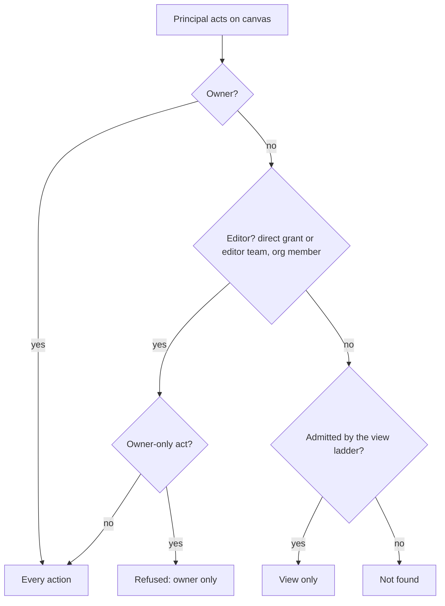
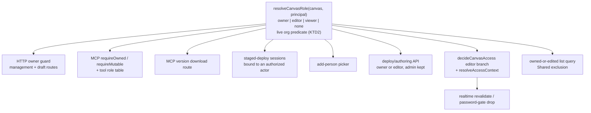
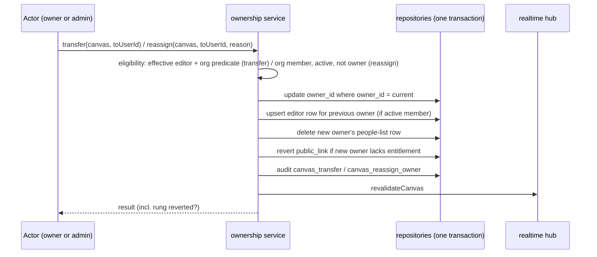
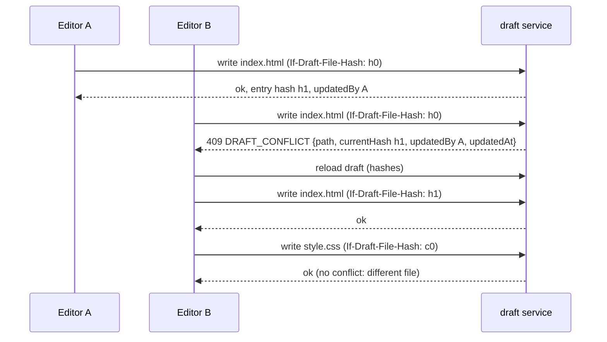
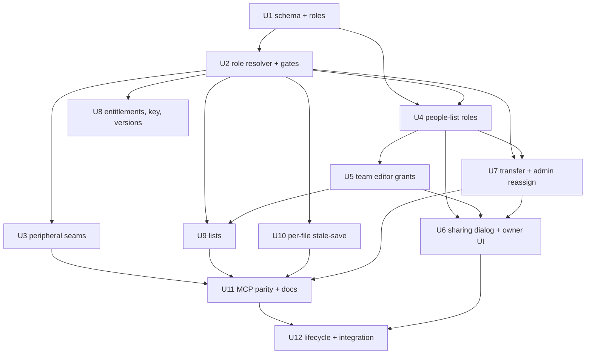

# Canvas Editor Roles and Ownership Transfer - Plan

## Goal Capsule

- **Objective.** A canvas owner can let trusted colleagues manage a canvas as fully as they do — content, deploys, settings, sharing — without relaying every change through the owner, while the owner stays protected and ownership can move when people change roles or leave the org.
- **Means.** Viewer/editor roles on each canvas's existing people list (individuals and teams), resolved by one shared role resolver that every owner gate calls (KTD1); owner-initiated transfer to an editor and an admin reassign action (KTD7).
- **Product authority.** Decisions confirmed with the repo owner in this session's brainstorm and plan synthesis. This plan amends BUILD_BRIEF §12.0 invariant #3: the principal for the owner management/editor surface becomes "owner or editor"; every other clause of §12.0 holds unchanged.
- **Execution profile.** Autonomous full-scope round per AGENTS.md: one branch, one PR, all units, `/ce-code-review` before the PR, merge on a green CI matrix. Auth-invariant work — read docs/solutions/2026-06-13-auth-invariant-checklist.md first and weight review findings against its trust-model calibration.
- **Stop conditions.** Stop and report if research at implementation time shows a settled decision cannot hold (KTD1's live org predicate cannot be resolved on this instance; the transfer cannot be made atomic on either dialect). Do not reverse the deploy/authoring API's admin allowance (KTD12) in this round.
- **Open blockers.** None. Open Questions are all deferred to implementation.

**Product Contract preservation:** changed: R17 — clarified from draft-level to file-level conflict detection (confirmed at plan synthesis; intent unchanged: no silent overwrite); R21 — clarified that promotion to editor notifies and team adds keep today's behaviour. Scope Boundaries corrected: the deploy/authoring API routes are in scope for editors (R6 already granted them); the deploy-key lifecycle gap is recorded on KTD11. Dependencies corrected: the admin canvases list already carries an owner filter. Acceptance examples AE13–AE19 added for collision cases; no existing R/A/F/AE meaning changed.

---

## Product Contract

### Summary

Each canvas's people list — individuals and teams — carries a **viewer** or **editor** role. Editors can do everything the owner can except delete the canvas, transfer it, or change the owner's standing. The owner can transfer ownership to any editor at once, admins can reassign an owner who has left, and every capability works identically over MCP. The plan builds this on one shared role resolver, additive role columns on the existing grant records, and a per-file stale-save check for concurrent editors.

### Problem Frame

Every canvas has exactly one principal who can change it. Sharing — the access ladder, people list, team grants, public link — grants viewing only; the owner is the sole account that can edit the draft, deploy, change settings, or re-share.

That is fine for a solo artifact and wrong for a shared one. When several colleagues improve one live canvas — a deck, a roadmap — every change routes through the owner: a colleague asks, the owner edits, deploys, and re-shares. The owner is a relay, the artifact stalls when they are busy, and their colleagues, who the org already trusts, cannot act like colleagues. When the owner leaves the org, the canvas is orphaned: nobody can take it over or delete it.

The product's trust model already assumes colleagues (BUILD_BRIEF §4.2); the permission model does not yet let them behave as such.

### Key Decisions

- KD1. **Roles live on the existing per-canvas people list; general access stays view-only.** One dialog people already know from Docs, and a team can be made editors in a single grant. (session-settled: user-directed — chosen over a separate collaborators list and over team-owned canvases: one mental model, and the existing people list, team grants, and invites gain the role instead of a sibling concept.) Governs R1, R3, R4, R21.
- KD2. **Editors are org members only; guests are always viewers.** Write and deploy power never crosses the org trust boundary. (session-settled: user-directed — chosen over members-plus-guests and over members-of-my-teams-only: guests are non-org principals; teams-only would force creating a team for a one-off collaboration.) Governs R2, R5.
- KD3. **An editor is owner-equivalent except for the owner-only acts.** The bottleneck is every owner action, not just content. (session-settled: user-directed — chosen over content-only and content-plus-settings: "help me manage the canvas" includes sharing, keys, and people.) Governs R6, R7, R8.
- KD4. **Transfer is instant and only to an existing editor; the previous owner becomes an editor.** No pending-transfer state to build, show, or expire; the recipient has already opted into the canvas. (session-settled: user-directed — chosen over transfer-to-any-member and over pending-until-accepted: add first, then transfer.) Governs R12, R13.
- KD5. **Admins can reassign a canvas's owner from the admin surface.** Closes the orphaned-canvas gap on offboarding; stays a cross-owner admin action, so it is not on the per-account MCP surface. (session-settled: user-directed — chosen over leaving departed owners' canvases orphaned and over deferring the question.) Governs R14.
- KD6. **Editors always have access, whatever the general-access setting.** Editor implies viewer; an editor on a private canvas can open and edit it. Governs R3.
- KD7. **Ownership stays with one person, and that person's account governs the canvas.** The public-publishing entitlement and the admin-facing attribution of the canvas follow the owner, not the acting editor; per-user AI quotas stay with whoever acts, as they do for any viewer today. (session-settled: user-approved — chosen over re-homing the canvas's entitlements on each acting editor: the canvas belongs to one account.) Governs R10, R11.
- KD8. **No real-time co-editing; the draft refuses stale saves, per file.** Two editors in one file get a conflict message, not a merge and not a lock; two editors in different files never conflict. (session-settled: user-approved — chosen over locking, over real-time merge, and over draft-level detection: proportionate to a static-artifact editor, and draft-level detection would refuse most autosaves in a two-editor session.) Governs R17.
- KD9. **Edited canvases live in the editor's main canvases list, not in Shared.** Shared is display-only; an editor needs the management surface. (session-settled: user-approved — chosen over listing them under Shared.) Governs R15, R16.
- KD10. **Version history shows who created each version.** Versions already record their creator; showing it gives Docs-style authorship at near-zero carrying cost. (session-settled: user-approved.) Governs R18.
- KD11. **Agent-native parity.** Every capability ships in the dashboard and over MCP together, wrapping the same service rules (AGENTS.md project rule). Governs R19, R20.
- KD12. **Owner-only refusals are explicit; non-member refusals stay not-found.** An editor legitimately knows the canvas exists, so "owner only" is a clear refusal; anyone with no role keeps today's not-found behaviour (§12.0 no-existence-leak). Governs R9, R22.

Who may do what, by role:

| Action | Owner | Editor | Viewer | Admin (admin surface) |
|---|---|---|---|---|
| Open the canvas | yes | yes, at any general-access setting | per the access ladder | no special access |
| Edit draft, deploy, publish, rollback, manage versions | yes | yes | no | no |
| Settings (title, description, tags, slug, preview, capabilities) | yes | yes | no | no |
| Sharing (general access, password, expiry) | yes | yes, public link gated by the owner's account | no | no |
| Add / change role / remove people and teams | yes | yes, except the owner | no | no |
| Regenerate deploy key, archive, unpublish, clone | yes | yes | no | no |
| Delete the canvas | yes | no | no | no |
| Transfer ownership | yes, to an editor | no | no | reassign to any member |
| Disable / enable / restore, gallery feature | no | no | no | yes |

### Actors

- A1. **Owner** — the single account on the canvas record. Can do everything, including the owner-only acts.
- A2. **Editor** — an org member holding the editor role directly, or through a team that holds it. Owner-equivalent except for the owner-only acts.
- A3. **Viewer** — a member or guest on the people list with the viewer role, or anyone admitted by the general-access setting. Read-only, as today.
- A4. **Admin (operator)** — cross-owner powers only on the admin surface: list, spend report, disable/enable/restore, gallery feature, and now reassign owner. Holds no editor power on canvases they neither own nor edit.
- A5. **Agent** — an MCP client acting as A1 or A2 with exactly that person's rights.

### Requirements

**Roles on the people list**

- R1. Each entry on a canvas's people list — an individual member, a pending invitee by email, or a team — carries exactly one role, viewer or editor; entries that exist before this ships are viewers.
- R2. Only org members (including pending invitees who will become members on first sign-in) and teams can hold the editor role; a guest entry is always a viewer and cannot be given the editor role.
- R3. An editor can open and manage the canvas regardless of its general-access setting, password, or expiry.
- R4. A team entry with the editor role makes every current member of that team an editor; a person who joins or leaves the team gains or loses editor access on their next request.
- R5. A member's direct editor grant ends when they are no longer part of the org; a team grant follows the team's live membership.

**What editors can do**

- R6. An editor can do everything the owner can on the canvas — draft edits, deploy, publish, rollback, version management, settings, sharing, people-list changes, deploy-key regeneration, archive and unarchive, unpublish, clone, the authoring SDK's update and revoke, and every read — except the owner-only acts in R7.
- R7. Owner-only acts: delete the canvas, transfer ownership, change the owner's standing — nobody can remove, demote, or edit the owner's entry; only transfer changes who the owner is — and the guest-AI opt-in and its spend cap, which admit non-org principals to a capability billed to the owner.
- R8. An editor can add people and teams, change their roles, and remove them — including other editors — and can remove themselves; each change is audited with the acting user.
- R9. An owner-only act attempted by an editor is refused with an explicit owner-only reason; a caller with no role on the canvas keeps today's not-found response.

**Owner entitlements and attribution**

- R10. An editor can switch on the public link only when the owner's account allows public publishing; otherwise the control states that the owner's account gates it.
- R11. Editing changes no attribution: per-canvas usage stays keyed to the canvas, the admin spend report keeps attributing a canvas's AI spend to the canvas and its owner, per-user AI quotas stay with whoever acts, and the audit log records the acting user.

**Transfer and reassignment**

- R12. The owner can transfer ownership to any editor who is an org member (not to a team); it takes effect at once, and the previous owner becomes an editor.
- R13. The transfer is confirmed in-flow, showing who receives the canvas and that the current owner keeps editor access, and is audited; there is no pending or cancellable state.
- R14. An admin can reassign a canvas's owner to any org member other than themselves from the admin surface, with a recorded reason; the outgoing owner is notified when their account is active, and a previous owner whose account is still active becomes an editor.

**Discovery and lists**

- R15. Canvases a person edits appear in their main canvases list alongside the ones they own, marked with the owner's name and the person's role, and do not appear in Shared.
- R16. The main list can be narrowed to owned-only or edited-only; search, filters, and sorting otherwise treat edited canvases like owned ones.

**Concurrent editing**

- R17. A save of a draft file that changed since it was loaded is refused with a message naming who saved it and when, and the editor can reload before retrying; saves to files nobody else changed proceed.

**Authorship**

- R18. Version history shows who created each version, in the dashboard and over MCP; every version already records its creator, so none is shown without one.

**Agent parity**

- R19. Every capability in R1–R18 that a person has in the dashboard is available over MCP to an agent acting as that person, under the same rules: editors' tools succeed, owner-only tools refuse per R9, and the canvases list carries role per R15.
- R20. MCP gains tools for what has no tool today — set an entry's role, transfer ownership — and the existing people-list tools accept a role; the people-list read returns one unified list (owner, members, pending invitees, teams) whose entry ids the role and revoke tools address.

**Notifications**

- R21. A person given the editor role directly — on add, or by promotion from viewer — receives the existing courtesy email naming the canvas, the role, and who added them, subject to the instance's notification settings; team adds keep today's notification behaviour. When a non-owner grants or promotes someone to editor, the owner also receives a courtesy email naming the actor, the person, and the canvas, under the same settings.

**Security invariants**

- R22. The §12.0 invariants hold with "owner or editor" as the management-surface principal: no impersonation; no credential theft; no unauthorized access (no role is not-found, guests are never editors, admins gain no editor power outside the admin surface); no cross-canvas reach; lifecycle honored instantly — removal, demotion, org departure, and transfer take effect on the next request and drop affected live editor sessions and sockets.

The access decision this introduces, alongside the unchanged view ladder:

### Key Flows

- F1. **Make a colleague an editor**
  - **Trigger:** The owner or an editor opens the canvas's sharing dialog.
  - **Actors:** A1 or A2; the colleague becomes A2.
  - **Steps:** Add the person by name (or by email if they have not signed in yet) or add a team; choose the editor role; save. The colleague gets the courtesy email.
  - **Outcome:** The canvas appears in the colleague's main list marked with the owner; they can edit, deploy, and change settings and sharing.
  - **Covered by:** R1, R2, R4, R8, R15, R21.

- F2. **Editor changes and publishes**
  - **Trigger:** An editor opens an edited canvas from their main list.
  - **Actors:** A2.
  - **Steps:** Edit the draft, publish; the new version records the editor as its creator.
  - **Outcome:** Live canvas updated without the owner's involvement; version history shows who published.
  - **Covered by:** R6, R15, R18.

- F3. **Editor changes sharing**
  - **Trigger:** An editor sets general access.
  - **Actors:** A2.
  - **Steps:** Switch to whole org — applies. Attempt public link — allowed only if the owner's account permits public publishing; otherwise the control explains the gate.
  - **Outcome:** Sharing changed within the owner's entitlements.
  - **Covered by:** R6, R10.

- F4. **Transfer ownership**
  - **Trigger:** The owner chooses Transfer ownership.
  - **Actors:** A1; an existing editor becomes A1.
  - **Steps:** Pick an editor who is an org member; confirm the summary (recipient becomes owner, you stay an editor); the transfer applies at once and is audited.
  - **Outcome:** The recipient owns the canvas; the previous owner is an editor.
  - **Covered by:** R12, R13.

- F5. **Reassign after an owner leaves**
  - **Trigger:** An admin handles offboarding.
  - **Actors:** A4; an org member becomes A1.
  - **Steps:** From the admin canvases list, find the departed owner's canvases; reassign each to a member with a reason.
  - **Outcome:** Canvases have a live owner; editors were never interrupted.
  - **Covered by:** R14.

- F6. **Remove or demote an editor**
  - **Trigger:** The owner or an editor changes a person's role to viewer or removes them, or the person leaves the org.
  - **Actors:** A1 or A2 acting; A2 affected.
  - **Steps:** The change applies on the affected person's next request; their live editor session and sockets are dropped.
  - **Outcome:** The canvas leaves their main list; if the general-access setting still admits them, it shows under Shared as view-only.
  - **Covered by:** R5, R8, R15, R22.

- F7. **Two editors, one file**
  - **Trigger:** Editor B saves a file after editor A saved the same file.
  - **Actors:** Two A2s.
  - **Steps:** B's save is refused with "A saved changes at <time>"; B reloads and reapplies.
  - **Outcome:** No silent overwrite.
  - **Covered by:** R17.

The sharing dialog gains one element and keeps its structure: the **People with access** list (owner pinned first, then people and teams) gets a role control per row (viewer / editor; guests show viewer with no control); **General access** (private / specific people / whole org / public link, with password and expiry) stays below it unchanged; a **Transfer ownership** action appears in the owner's view only.

### Acceptance Examples

- AE1. **Covers R2.** Given a guest (email-only) entry on the people list, when anyone tries to set its role to editor, then the change is refused with a reason that guests can only view.
- AE2. **Covers R3, R6.** Given a canvas at general access private with editor E, when E opens the canvas or its editor, then it loads and E can save and publish.
- AE3. **Covers R4, R5.** Given team T holds the editor role and member M joins T, then M's next request can edit; when M leaves T or the org, M's next request is treated as having no role.
- AE4. **Covers R7, R9.** Given editor E, when E tries to delete the canvas, transfer it, or change the owner's entry, then the action is refused as owner-only; when a member with no role tries the same, the response is not-found.
- AE5. **Covers R8.** Given editors E1 and E2, when E1 removes E2, then E2 loses editor access on their next request and the audit log records E1 as actor.
- AE6. **Covers R10.** Given an owner whose account cannot publish publicly and editor E, when E tries to switch on the public link, then the control is unavailable with a message that the owner's account gates it.
- AE7. **Covers R12.** Given editor E, when the owner transfers to E, then E is owner immediately, the previous owner is an editor, and the public-link gate now follows E's account. When the owner tries to transfer to a member who is not an editor, or to a team, the transfer is refused.
- AE8. **Covers R14.** Given the owner's account is removed, when an admin reassigns the canvas to member M with a reason, then M is owner, the action is audited, and existing editors are unaffected.
- AE9. **Covers R15, R16.** Given E edits canvas C owned by O, when E opens their main canvases list, then C appears marked "owned by O · editor", not under Shared; when E narrows to owned-only, C is absent.
- AE10. **Covers R17.** Given editors A and B loaded the same file, when A saves and then B saves that file, then B's save is refused naming A and the time; after B reloads, B's save succeeds. When B saves a different file instead, it succeeds.
- AE11. **Covers R19, R20.** Given an agent authenticated as editor E, when it calls the owner tools on the canvas, then they behave as they would for E in the dashboard; when it calls delete or transfer, it gets the owner-only refusal; when it calls the canvases list, the canvas appears with role editor.
- AE12. **Covers R22.** Given editor E with a live editor session and realtime socket, when E is demoted, then E's next request is refused and the socket is dropped without waiting for a reconnect.
- AE13. **Covers R3, R4.** Given team T holds the editor role and general access is `team`, when an editor switches general access to whole org, then T's members remain editors.
- AE14. **Covers R2, R4.** Given a personal team holding the editor role that contains a non-org member N, when N opens the canvas, then N has view access only, and org members of the team are editors.
- AE15. **Covers R2.** Given a pending editor invite for an email that is not in the org's domains, then the invite is refused as viewer-only; given a pending editor invite whose email later signs in without org membership, then the person holds view access only.
- AE16. **Covers R12.** Given the owner was never on the people list and transfers to editor E who also holds a viewer row, then the people list shows E once as owner and the previous owner once as editor.
- AE17. **Covers R14.** Given an admin reassign to a target who is already the owner, or who is blocked, or who is not a member of the canvas's org, then the reassign is refused with the reason; given a target who is already an editor, then their editor row is removed as part of the reassign.
- AE18. **Covers R7, R12.** Given the owner is a member of a team that holds the editor role, when someone removes the owner from that team, then the owner is still the owner.
- AE19. **Covers R6, R22.** Given editor E regenerates the deploy key, then the owner receives an email naming E, and the audit log records E; when E is later removed, the remover is prompted to regenerate the key.

### Success Criteria

- A colleague can take a shared deck or roadmap canvas from edit to published, re-shared, and re-titled without the owner touching it, from the dashboard and from an MCP agent.
- The four-way role matrix (owner / editor / viewer / no role) is green for every management route and every MCP tool, on both dialects, and no tool can be registered without a declared minimum role.

### Scope Boundaries

Deferred for later:

- Team-owned canvases and transferring ownership to a team — a later layer on this model.
- Finer roles (commenter, settings-only, sharing-only) — only viewer and editor exist.
- Pending-until-accepted transfer.
- Real-time co-editing and presence in the draft editor.
- Editor rights for external guests.
- A per-canvas activity feed beyond version authorship and the audit log.

#### Deferred to Follow-Up Work

- Protecting a team's creator from removal by other members (see How This Work Fits Together).
- Resolving the deploy/authoring API's admin-as-owner allowance against §12.0 #3 (KTD12 keeps it; see Open Questions).
- Refreshing the stale schema comment that still calls the team access rung reserved; it has been live since tenancy P2.
- Add-by-name for a personal-space canvas on a tenanted instance returns no suggestions today (the picker scopes to the canvas's org); editors are added by email there. Pre-existing; unchanged by this plan.
- A push channel to the open dashboard editor (today a demoted editor learns on their next save; the buffer is preserved, KTD14).

### Dependencies / Assumptions

- Depends on the shipped org boundary, teams, personal teams, and pending invitations (tenancy P1–P2); org membership is resolved live per request from the configured org domains.
- Assumes existing people-list entries and team grants become viewers on upgrade with no behaviour change for them.
- Assumes the existing invite courtesy email can carry a canvas and a role variable.
- The admin canvases list already filters by owner, so a departed owner's canvases are findable today.

### Open Questions

Deferred to implementation:

- Whether the pending-editor domain check (KTD2) should also accept a configured allowlist of external editor domains; ship with org domains only.
- The exact wording of the conflict, owner-only, and gated-public-link messages in the dashboard (the codes are fixed in KTD6).
- Whether the version list's creator display resolves names in the list query or in a second batched lookup; either satisfies R18.
- Code/spec conflict, not a planning blocker: the deploy/authoring API admits admins as owners (a locked decision in docs/plans/2026-07-05-001-feat-managed-canvas-shares-plan.md) while BUILD_BRIEF §12.0 #3 says admin authority never reaches the owner surface. KTD12 leaves it as is; the §12.0 amendment in this round names the exception.

<!-- ce-section: work-relationships -->
### How This Work Fits Together

This plan owns the editor role, ownership transfer, and admin reassignment for canvases. The surrounding items below are the current understanding, not a committed roadmap.

- Protect the team creator from removal — a small sibling fix in the teams module. Can proceed independently of this plan. Shares the "a protected principal cannot be removed by peers" rule this plan introduces for canvas owners.
- Deploy-API admin-as-owner allowance — an audit item. Can proceed independently. Shares the "admin power lives only on the admin surface" rule R22 restates.
- Team-owned canvases — a later layer. Depends on this plan's editor role and transfer; still to decide whether it is wanted at all.
- Tenancy P3 multi-org (docs/plans/2026-06-20-004-feat-tenancy-p3-multi-org-plan.md) pins ownership reassignment for departed members as a P3 item. R14 delivers it ahead of P3; P3 should cite this plan rather than re-specify it.
- Custom domains (docs/plans/2026-06-28-001-feat-custom-domains-plan.md) — unrelated; can proceed independently. Note for both: a slug change by an editor invalidates a slug-keyed custom-domain rewrite exactly as an owner's would.

### Sources / Research

- Ownership gate and its policy: apps/server/src/canvas/owner-guard.ts; MCP counterpart in apps/server/src/mcp/server.ts (`requireOwned`, `requireMutable`); the further copies in apps/server/src/mcp/routes.ts (version download), apps/server/src/upload/service.ts (staged-deploy sessions bound to the owner), apps/server/src/people/search.ts, apps/server/src/realtime/hub.ts (`dropGatedNonOwners`), and apps/server/src/routes/canvas-authoring.ts (owner-or-admin).
- View-access decision and rungs: apps/server/src/canvas/authorization.ts (`decideCanvasAccess`, `resolveAccessContext`, the `capture` principal — prior art for a non-owner principal that decides like the owner); schema comments on access, people list, team grants, invitations in packages/shared/src/db/schema.sqlite.ts.
- Team rules and grants: apps/server/src/teams/service.ts; apps/server/src/teams/sharing.ts (`resolveTeamGrant` clears grants on any rung change and validates against the actor's memberships); apps/server/src/db/repositories/teams.ts (`teamMatch`, `accessOrgClause` — the live org re-join to mirror).
- People-list plumbing: apps/server/src/canvas/allowlist-view.ts (`resolveAllowlistEntries`, the one projection HTTP and MCP share); apps/server/src/invites/service.ts (`resolveOrInvite`, templates, notification toggles); apps/server/src/auth/invitations.ts (materializer drops `invitations.role`); apps/server/src/db/repositories/canvases.ts (`addAllowlistEntry` upsert is a no-op on conflict; `listByOwnerFiltered`; `isOwnerPublishEnabled`); apps/server/src/tenancy/reconcile.ts (does not touch the people list).
- Public-link write gates keyed to the acting user today: apps/server/src/routes/management.ts (settings PATCH), apps/server/src/mcp/server.ts (`update_canvas`), apps/server/src/routes/canvas-authoring.ts.
- Draft write path and the opt-in `If-Draft-Base` precondition: apps/server/src/routes/draft-api.ts, apps/server/src/draft/service.ts, apps/server/src/mcp/draft-tools.ts, apps/dashboard/src/routes/canvas.editor.tsx, apps/dashboard/src/lib/mutations.ts; the generalization was scoped as a residual in docs/plans/2026-06-14-001-fix-draft-data-loss-cluster-plan.md; manifest entries are `{ size, hash, mime }` in packages/shared/src/db/types.ts.
- Versions: `created_by` on versions (packages/shared/src/db/schema.sqlite.ts); apps/server/src/canvas/version-history.ts (the shared service); the HTTP list already returns `createdBy`, the dashboard page never renders it, MCP `list_versions` omits it.
- Admin cross-owner pattern: apps/server/src/routes/admin.ts (disable route as template; owner filter on the list; `revertPublicForOwner`); apps/dashboard/src/components/AdminCanvasTable.tsx.
- Migrations: drizzle/sqlite and drizzle/pg through 0035; drizzle/sqlite/0021_preview_mode.sql (additive column) vs drizzle/sqlite/0023_canvas_allowlist_checks.sql (CHECK forces a SQLite table rebuild); parity test packages/shared/src/db/schema.test.ts.
- Institutional learnings to read first: docs/solutions/2026-06-13-auth-invariant-checklist.md; docs/solutions/2026-06-16-admin-content-restriction-and-deploy-draft-sync.md (two enforcement seams; amend spec text in the same change); docs/solutions/2026-06-21-teams-parity-shared-helpers-and-listforuser.md (one function for both transports; wrapped-row gotcha); docs/solutions/2026-06-24-shared-discovery-listability.md (explicit list predicates, tests in both directions); docs/solutions/2026-06-13-dual-dialect-drizzle-seam.md; docs/solutions/2026-06-13-content-addressed-draft-publish.md; docs/solutions/2026-07-10-version-history-export-delete.md; docs/solutions/2026-06-21-tenancy-inert-active-and-test-harness-gotchas.md (thread a flag through every seam; assert on bodies, not `.status`, for streamed responses).
- Prior access-model decisions: docs/brainstorms/2026-06-15-canvas-sharing-access-ladder-requirements.md; docs/plans/2026-06-15-001-feat-canvas-sharing-access-ladder-plan.md; docs/plans/2026-06-20-003-feat-tenancy-p2-teams-plan.md; docs/plans/2026-06-21-001-feat-personal-teams-and-invites-plan.md; docs/plans/2026-06-17-001-feat-mcp-user-parity-plan.md.
- Docs that state the owner-only contract and must change with it: BUILD_BRIEF.md §12.0 #3; docs/site/agents/mcp.md ("Owner-management tools are scoped to your account…"); apps/server/src/docs/generated-content.ts (llms.txt); README.md; AGENTS.md parity rule.
- External research: none run. The repo carries multiple current patterns for principal-gated access, the shape was settled in the brainstorm, and the trust model is a trusted org.

---

## Planning Contract

### Key Technical Decisions

- KTD1. **One role resolver, called by every gate.** A shared `resolveCanvasRole(canvas, principal) → owner | editor | viewer | none` in the canvas module replaces the seven copies of the owner check: the HTTP owner guard, the MCP `requireOwned`/`requireMutable` pair (which become imports of the shared functions, not re-implementations), the MCP version-download route, staged-deploy session binding, the add-person picker, the realtime password-gate drop, and the deploy/authoring routes. Check ordering is fixed and tested: role → owner-only act → disabled state, so a non-role caller of a disabled canvas still reads not-found and an editor calling delete on a disabled canvas gets owner-only. `classifyMutability` gains an `owner-only` outcome. The role is resolved per request and never cached on a session or MCP caller object. Governs R6, R7, R9, R22. (session-settled: user-approved — chosen over threading a role check into each surface separately: the auth-invariant checklist records that pattern as the source of the last "owner or admin" bug.)
- KTD2. **Org membership is a live predicate, not a row flag.** Editor privilege requires: a member principal (never guest), and — when tenancy is active — a non-empty live org membership set that contains the canvas's home org when the canvas is org-homed; when tenancy is inert, any member principal qualifies. A grant row that fails the predicate degrades to viewer behaviour. The predicate reuses the org-membership resolver already computed per request and mirrors the team rung's live re-join (`accessOrgClause`). Pending editor invites are accepted only for emails whose domain is one of the org's configured domains when tenancy is active; the materializer carries the invited role through. Governs R2, R5.
- KTD3. **Roles are additive columns on the existing grant records.** `canvas_allowlist.role` and `canvas_teams.role` as `text NOT NULL DEFAULT 'viewer'` with no CHECK constraint (a CHECK forces the SQLite table-rebuild migration; `team_members.role` sets the precedent), validated at the zod boundary; `invitations.role` is reused for pending canvas invites. One migration, generated for both dialects. `addAllowlistEntry`'s upsert updates the role on conflict only when the caller supplied one — an omitted role applies the viewer default on insert and never changes an existing row — so add-with-role is one atomic write and a role-less re-add can never demote an editor. Governs R1, R2.
- KTD4. **Editor team grants are orthogonal to the general-access rung.** Viewer-role team rows keep today's semantics (effective at the `team` rung; cleared when the rung leaves `team`). Editor-role rows are effective at every rung and are never touched by rung changes; `resolveTeamGrant`'s clear branch and `setCanvasTeams`'s replace-write delete are both narrowed to viewer-role rows (editor rows are owned solely by the people-list path, so no teams write can remove one), and the actor-membership check applies only to teams being added, never to grants the actor did not touch. Any team may hold editor; each member's editor power is subject to KTD2, so non-org members of a personal team get view only. Effective editor-via-team = member of any editor-role team on the canvas, resolved live. Governs R3, R4, R5.
- KTD5. **One unified people-list projection with stable entry ids.** `resolveAllowlistEntries` grows to return owner, members, guests, pending invitees, and teams, each with a role and an id of the form `owner`, `member:<rowId>`, `guest:<rowId>`, `pending:<invitationId>`, `team:<teamId>`; HTTP `GET /:id/allowlist` and MCP `list_access` both return it. Set-role and revoke (HTTP and MCP) address entries by these ids, and also accept a legacy bare row id from before the prefix change; the `owner` entry always refuses with owner-only. Team grants join the same list, and the dialog's old general-access team picker folds into the unified list's add-team control — one add-a-team path whose role control works on every team row; the settings-PATCH `teams` array stays accepted for API compatibility (viewer-role semantics) but is no longer surfaced in the dialog. Governs R1, R8, R20.
- KTD6. **Refusal contract.** Shared constants beside `DISABLED_CODE` in the owner guard: `OWNER_ONLY` (HTTP 403 `{ code, message }`; MCP `fail("OWNER_ONLY: …")`), `GUEST_VIEWER_ONLY` (HTTP 400; MCP prefix), `PUBLIC_LINK_OWNER_GATED` (HTTP 403; MCP prefix), `DRAFT_CONFLICT` (HTTP 409, unchanged code, body gains `path`, `currentHash`, `updatedBy`, `updatedAt`; MCP prefix carrying the same fields). No-role callers keep the bare 404 / `fail("canvas not found")` byte-for-byte. Governs R9, R10, R17.
- KTD7. **Transfer and reassign share one service and are atomic.** The repository gains one composite transfer method running the whole sequence inside its transaction helper — and because that helper is a passthrough on SQLite, the write order is the safety net: upsert the previous owner's direct editor row first (only when their account is active and passes KTD2), then swap `owner_id` in a single conditional update (current owner must still match), then delete any pre-existing people-list row for the new owner and apply the rung revert, with the audit event carrying both parties written after commit. Eligibility: the recipient must be an effective editor (direct or via team) and pass KTD2; a team is never a recipient. Admin reassign is the same service with an admin actor and a required reason; its target must be a live member of the canvas's home org (or any active member when the canvas has no org), not blocked, not already the owner, and never the acting admin (mirroring the admin surface's cannot-block-self / cannot-demote-self guards); the outgoing owner is notified when their account is active. If the canvas is at `public_link` and the new owner's account lacks the entitlement, the service reverts the rung the way the admin revoke sweep does and reports it. Admin reassign also regenerates the canvas deploy key in the same operation — audited as `key_regen` with the admin role, the plaintext never returned to the acting admin, and the new owner told to issue a fresh key; owner-initiated transfer keeps the key, since the previous owner stays an editor. The recipient gets a courtesy email; sockets are revalidated. Transfer over MCP takes a user id only, never an email. Governs R12, R13, R14.
- KTD8. **Per-file stale-save detection on the manifest hash.** Each manifest entry gains optional `updatedBy` and `updatedAt`, written on every draft mutation (writes, deletes, renames, restore, publish-time refresh). A write, delete, or rename carries the hash the client loaded for that path (HTTP header `If-Draft-File-Hash`, MCP `expectedHash`; the literal `none` for a path the client believes absent). Mismatch refuses with `DRAFT_CONFLICT` and the entry's writer and time; the draft views (HTTP draft, MCP `get_draft`, `read_draft_file`) return each entry's hash and writer so a retry is one call. The dashboard sends the precondition on every save, autosave included, and updates its known hash from each response. Over MCP the parameter is optional, but the server refuses an unconditioned write when the entry's last writer is a different user — default-on for the two-editor case, inert for a solo agent. This replaces `If-Draft-Base` (its only client is the dashboard's unmount flush; restore now moves every entry's hash, which the new precondition catches). Governs R17.
- KTD9. **Owned-or-edited list query.** The owner-scoped list query becomes "owned by me, or a direct editor row for me, or a member of an editor-role team on the canvas" with KTD2's predicate, inside the same search/tags/sort/pagination/archived pipeline; a `role` filter (`owned` | `edited`) backs R16. The Shared list's direct and team candidate queries exclude canvases where the viewer is an effective editor. The canvas DTO and the MCP `canvasView` projection gain `ownerId`, `owner { id, name, email }`, and `role`; `get_canvas` also returns `ownerOnlyActs`. The tag vocabulary, by-slug lookup, usage read, and archived scope treat edited canvases like owned ones. Governs R15, R16.
- KTD10. **MCP parity is table-driven.** An exported `{ toolName: minRole }` table in the MCP module is consumed by every registration (the gate reads the tool's minimum role from it) and by two tests: the registered tool inventory equals the table's keys, and the role matrix runs every canvas-scoped tool as owner / editor / viewer / no-role. New tools: `set_access_role` (entry id + role), `transfer_canvas` (user id). `grant_access` and `invite_to_canvas` accept `role` (viewer applies only when inserting a new entry; an omitted role never changes an existing entry). `whoami` is unchanged. Governs R19, R20.
- KTD11. **The deploy key stays editor-accessible, with rotation made visible.** Editors may regenerate the key per KD3 (session-settled: user-directed — inherited from KD3, chosen over content-only rights). Conflict call-out: a key an editor copied keeps working after their removal, and rotation breaks the owner's saved credential silently. Mitigations in scope: regeneration by a non-owner emails the owner naming the actor and is audited as such; removing or demoting an editor shows a "regenerate the deploy key?" prompt with a one-click regenerate. Governs R6, R22.
- KTD12. **Deploy/authoring API: owner-or-editor, admin allowance unchanged.** The update-in-place and revoke routes gain the editor role through KTD1 and keep their existing admin allowance; this round records the §12.0 conflict in Open Questions and the amendment text rather than changing prior behaviour. Governs R6.
- KTD13. **Docs move with the invariant.** BUILD_BRIEF §12.0 #3, README, docs/site/agents/mcp.md, the llms.txt generator, and AGENTS.md's parity rule are amended in the same PR (the admin-content-restriction learning: a stale spec gets "restored" by a later agent). Governs R22.
- KTD14. **Editor UI gating comes from the DTO.** The dashboard conditions owner-only controls (Danger zone delete, Transfer ownership, the owner row's role control) on `role === "owner"` from the canvas DTO; an `OWNER_ONLY` response shows a non-destructive notice. On any refusal during an editor session (owner-only, not-found after demotion, conflict), the editor keeps the unsaved buffer in memory and offers copy/download; no push channel is added. Governs R9, R17, R22.
- KTD15. **Audit events.** `allowlist_role_change`, `canvas_transfer`, `canvas_reassign_owner` (admin), `key_regen` (existing, meta gains `byRole`); existing `allowlist_add`/`allowlist_remove` gain `role` in meta; team-grant role changes reuse `share_change`. All record the acting user. Governs R8, R11, R13, R14.

### High-Level Technical Design

The resolver and its consumers (KTD1):

Transfer and admin reassign (KTD7):

Per-file stale-save (KTD8):

Unit dependencies:

### Assumptions

- Org membership per request comes from the existing org-membership resolver (email-domain based); no new membership source is introduced.
- The instance's notification toggles govern every courtesy email this plan adds; a disabled mailer skips silently as today.

### System-Wide Impact

- **Auth boundary.** §12.0 #3 changes meaning; every owner gate is replaced, not extended. The invariant tests (non-owner 404, admin no bypass) are rerun against the role matrix.
- **Data.** Two additive columns; per-entry metadata inside the draft manifest JSON; `owner_id` becomes mutable through one service.
- **Realtime.** `decideCanvasAccess` gains an editor branch, so `revalidateCanvas` and the password-gate drop keep editors connected.
- **MCP.** Tool surface grows by two tools and several parameters; `list_canvases` semantics widen (non-owned rows appear with `role`), which the tool description states.
- **Docs and spec.** Amended in the same change (KTD13).
- **Affected parties.** Owners (new controls, key-rotation email), colleagues (new capability), admins (reassign action), agent authors (list semantics, new refusal codes, draft precondition).

### Risks & Dependencies

- **Gate drift** — a surface left on the old owner check. Mitigation: KTD1 deletes the old functions; the role-matrix and tool-inventory tests fail on any surface that does not use the resolver.
- **Editor team grants wiped by a rung change** — the current `clear` behaviour. Mitigation: KTD4 and AE13 as a regression test.
- **External editor via pending invite or personal team** — Mitigation: KTD2's live predicate is the backstop on every request; AE14, AE15.
- **Draft conflict noise** — autosave refusals in a two-editor session. Mitigation: per-file granularity (KTD8); the dashboard updates its hash from every save response.
- **Copied deploy key outliving removal** — accepted under KTD11 with the rotation prompt.
- **Cross-org reassign** — refused by KTD7's org check, matching the tenancy P1 clamp.

### Documentation / Operational Notes

- BUILD_BRIEF §12.0 #3: replace "owner" with "owner or editor" for the management/editor surface; add the deploy-API admin exception note; word the reassign action as moving ownership between other members, never conferring content access on the acting admin.
- docs/site/agents/mcp.md and the llms.txt generator: role vocabulary, the two new tools, `role` on `list_canvases`, the draft precondition, the refusal codes, and the new people-list entry-id shape (legacy bare ids still accepted).
- README status and AGENTS.md parity rule: "owner (or editor) check".
- Migration `0036_canvas_access_roles` runs at boot; existing rows default to viewer; no backfill.
- Capture a docs/solutions entry after the round: role-threading design and transfer atomicity.

---

## Implementation Units

| U-ID | Title | Key files | Depends on |
|---|---|---|---|
| U1 | Role columns, types, migration, repository writes | packages/shared/src/db/schema.*.ts, packages/shared/src/db/types.ts, drizzle/*/0036_*, apps/server/src/db/repositories/canvases.ts | — |
| U2 | Role resolver and the shared gates | apps/server/src/canvas/role.ts (new), owner-guard.ts, authorization.ts, mcp/server.ts, routes/management.ts, routes/draft-api.ts | U1 |
| U3 | Peripheral seams onto the resolver | mcp/routes.ts, upload/service.ts, people/search.ts, realtime/hub.ts, routes/canvas-authoring.ts, canvas/clone-service.ts | U2 |
| U4 | People-list roles end to end | canvas/allowlist-view.ts, invites/service.ts, auth/invitations.ts, routes/management.ts, mcp/server.ts, email/templates.ts | U1, U2 |
| U5 | Team editor grants | teams/sharing.ts, db/repositories/teams.ts, routes/management.ts, mcp/server.ts | U4 |
| U6 | Sharing dialog roles, owner-only UI, transfer action | apps/dashboard/src/routes/canvas.share.tsx, canvas.tsx, canvas.settings.tsx, lib/api.ts, lib/mutations.ts | U4, U5, U7 |
| U7 | Transfer and admin reassign | apps/server/src/canvas/ownership.ts (new), routes/management.ts, routes/admin.ts, mcp/server.ts, dashboard admin table | U2, U4 |
| U8 | Owner entitlement gates, key-rotation notice, version creators | routes/management.ts, mcp/server.ts, routes/canvas-authoring.ts, canvas/version-history.ts, dashboard canvas.versions.tsx | U2 |
| U9 | Owned-or-edited lists on both surfaces | db/repositories/canvases.ts, canvas/shared-list.ts, routes/management.ts, mcp/tool-kit.ts, mcp/server.ts, dashboard index.tsx | U2, U5 |
| U10 | Per-file stale-save protection | draft/service.ts, routes/draft-api.ts, mcp/draft-tools.ts, dashboard canvas.editor.tsx, lib/api.ts | U2 |
| U11 | MCP parity tests, new tools, docs amendment | mcp/server.ts, mcp/server.test.ts, BUILD_BRIEF.md, docs/site/agents/mcp.md, docs/generated-content.ts, README.md, AGENTS.md | U3, U7, U9, U10 |
| U12 | Lifecycle and integration scenarios | integration/editor-scenarios.test.ts (new), realtime/hub.test.ts, dashboard editor refusal handling | U6, U11 |

### Phase A — Foundation

### U1. Role columns, types, migration, repository writes

- **Goal:** Persist a viewer/editor role on people-list rows and team grants, with the repository writes that set it.
- **Requirements:** R1, R2 (storage); KTD3.
- **Dependencies:** none.
- **Files:** packages/shared/src/db/schema.sqlite.ts, packages/shared/src/db/schema.pg.ts, packages/shared/src/db/types.ts, drizzle/sqlite/0036_canvas_access_roles.sql, drizzle/pg/0036_canvas_access_roles.sql, apps/server/src/db/repositories/canvases.ts, apps/server/src/db/repositories/invitations.ts, packages/shared/src/db/schema.test.ts.
- **Approach:**
  1. Add `role` (`text NOT NULL DEFAULT 'viewer'`) to `canvasAllowlist` and `canvasTeams` in both dialect modules using the shared column helpers; add `AccessRole = "viewer" | "editor"` and a zod enum in types.
  2. Generate the migration for both dialects with the slug `canvas_access_roles`; confirm each is a single additive `ALTER TABLE`.
  3. Repository: `addAllowlistEntry` accepts `role` and updates it on conflict; add `setAllowlistRole(canvasId, entryId, role)` (scoped to both ids like the existing allowlist remove, so a role write can never reach another canvas's row), `findEditorGrant(canvasId, userId)`, `listEditorTeamIds(canvasId)`, `setCanvasTeamRole(canvasId, teamId, role)`, and `listEditedCanvasIds(userId, orgIds)` (direct rows plus editor-team membership) for U9.
  4. Invitations repository: create/read carry `role` for canvas targets.
- **Patterns to follow:** drizzle/sqlite/0021_preview_mode.sql (additive column); `team_members.role` (unchecked role column); `onConflictDoUpdate` per docs/solutions/2026-06-13-dual-dialect-drizzle-seam.md.
- **Test scenarios:**
  - Parity test passes with the new column on both dialects, including the default.
  - Existing allowlist and team-grant rows read back as viewer after migration on a seeded pre-migration database.
  - `addAllowlistEntry` with role editor on an existing viewer row updates the role; with no role leaves an existing role untouched.
  - `listEditedCanvasIds` returns canvases with a direct editor row and canvases with an editor-role team the user belongs to, and excludes viewer rows and viewer-role teams.
- **Verification:** `pnpm test` green on both dialects; the two migration files are committed; `drizzle-kit generate` produces no further diff.

### U2. Role resolver and the shared gates

- **Goal:** One `resolveCanvasRole` that every management and draft route and every MCP tool uses, with the owner-only outcome.
- **Requirements:** R3, R6, R7, R9, R22; KTD1, KTD2, KTD6.
- **Dependencies:** U1.
- **Files:** apps/server/src/canvas/role.ts (new), apps/server/src/canvas/role.test.ts (new), apps/server/src/canvas/owner-guard.ts, apps/server/src/canvas/authorization.ts, apps/server/src/canvas/authorization.test.ts, apps/server/src/routes/management.ts, apps/server/src/routes/draft-api.ts, apps/server/src/mcp/server.ts, apps/server/src/mcp/tool-roles.ts (new), apps/server/src/mcp/draft-tools.ts, apps/server/src/routes/management.test.ts, apps/server/src/routes/draft-api.test.ts, apps/server/src/mcp/server.test.ts.
- **Approach:**
  1. `resolveCanvasRole(canvas, principal, deps)`: owner check first; then KTD2's org predicate; then direct editor row; then editor-team membership; else viewer/none (viewer is informational here — view reachability stays with `decideCanvasAccess`).
  2. Replace `requireOwnedCanvas` with `requireCanvasRole(c, canvases, { min: "editor" | "owner" })` returning the canvas plus role; `classifyMutability` gains `{ kind: "owner-only" }` ahead of `disabled`. Owner-only routes: delete, transfer (U7); everything else min editor.
  3. MCP: delete the local `requireOwned`/`requireMutable` bodies and import the shared functions; create the `TOOL_MIN_ROLE` table here (apps/server/src/mcp/tool-roles.ts) so the gate reads each tool's minimum role from it from the start.
  4. `decideCanvasAccess`: after the owner bypass, an editor (from `resolveAccessContext`, which now computes `editorMatch` with the same predicate) is allowed with no password gate and full content.
  5. Add the `OWNER_ONLY` constant and response helpers beside `DISABLED_CODE`.
- **Execution note:** Write the role-matrix tests for the HTTP routes first (owner / editor / viewer / no role × read / mutate / owner-only) and make them pass by replacing the gate, so no route can keep the old check.
- **Patterns to follow:** `classifyMutability` discriminated outcomes; the `capture` branch in `decideCanvasAccess`; `resolveAccessContext`'s per-rung lookups.
- **Test scenarios:**
  - Covers AE2. Editor on a private canvas: management GET and draft PUT succeed; `decideCanvasAccess` allows with no password gate.
  - Covers AE4. Editor calls delete → 403 `OWNER_ONLY`; a member with no role calls delete → 404; an editor calls delete on a disabled canvas → 403 `OWNER_ONLY`, not 409.
  - Covers AE3. A direct editor row for a user whose live org set is empty (tenancy active) → no role; the same on an inert-tenancy instance → editor.
  - Org-homed canvas, editor in a different org → no role; personal-space canvas, editor with any org membership → editor.
  - Guest principal with an editor-role row (simulated) → viewer behaviour only.
  - Admin with no role → 404 on every management and draft route (unchanged).
  - MCP: `get_canvas` as editor returns the canvas; `delete_canvas` as editor fails with the `OWNER_ONLY:` prefix; as no-role fails with the bare "canvas not found".
- **Verification:** No remaining call of the old owner-check functions (grep); the matrix tests pass on both dialects.

### U3. Peripheral seams onto the resolver

- **Goal:** The six surfaces outside the main gates authorize editors through the resolver.
- **Requirements:** R6, R22; KTD1, KTD12.
- **Dependencies:** U2.
- **Files:** apps/server/src/mcp/routes.ts, apps/server/src/upload/service.ts, apps/server/src/upload/service.test.ts, apps/server/src/people/search.ts, apps/server/src/people/search.test.ts (new), apps/server/src/realtime/hub.ts, apps/server/src/realtime/hub.test.ts, apps/server/src/routes/canvas-authoring.ts, apps/server/src/routes/canvas-authoring.test.ts, apps/server/src/canvas/clone-service.ts, apps/server/src/routes/management.ts (clone eligibility), apps/server/src/mcp/server.ts (clone tool).
- **Approach:**
  1. Version download route: resolver, min editor.
  2. Staged deploys: sessions bind to the authorizing actor; `finalize` re-checks the actor's role on the canvas (min editor) instead of comparing to `ownerId`.
  3. People search with canvas context: min editor.
  4. Realtime: `dropGatedNonOwners` keeps owner and editors. `revalidateCanvas` builds its access context inline rather than through `resolveAccessContext`, so it does not become editor-aware for free: add an `editorMatch` dependency to the hub, resolved per connection from the connection's user and live org membership with the same fail-closed try/catch as `isPrincipalAllowed` and `teamMatch`, and pass it into `decideCanvasAccess`.
  5. Authoring API update/revoke: owner or editor, existing admin allowance retained (KTD12).
  6. Clone: eligibility is "effective editor or owner → active canvas" else today's template rule; the clone lands owned by the actor with no grants (existing behaviour).
- **Patterns to follow:** existing session-claim checks in upload/service.ts; hub fail-closed style.
- **Test scenarios:**
  - Editor: `begin_deploy` → `add_files` → `finalize_deploy` succeeds end to end; a no-role member's `finalize` with a forged session fails as today.
  - Editor downloads a version → 200; no-role member → 404.
  - Editor's people search on the canvas returns suggestions; no-role member → not_found.
  - Password set on a canvas with an owner socket, an editor socket, and a viewer socket → only the viewer is dropped.
  - Authoring PUT as editor updates the share; as admin still allowed; as no-role member → 404.
  - Editor clones a private canvas → new canvas owned by the editor, people list empty.
- **Verification:** All six seams have a test naming the editor case; `grep ownerId` in these files shows no remaining authorization comparison.

### Phase B — People list and teams

### U4. People-list roles end to end

- **Goal:** Add, promote, demote, and remove people with a role, on HTTP and MCP, with pending invites and notifications honoring the role.
- **Requirements:** R1, R2, R8, R20, R21; KTD2, KTD3, KTD5, KTD6, KTD15.
- **Dependencies:** U1, U2.
- **Files:** apps/server/src/canvas/allowlist-view.ts, apps/server/src/invites/service.ts, apps/server/src/invites/service.test.ts, apps/server/src/auth/invitations.ts, apps/server/src/auth/invitations.test.ts, apps/server/src/routes/management.ts, apps/server/src/routes/management.test.ts, apps/server/src/mcp/server.ts, apps/server/src/mcp/server.test.ts, apps/server/src/email/templates.ts, apps/server/src/email/templates.test.ts.
- **Approach:**
  1. `resolveAllowlistEntries` returns the unified list with KTD5 ids and roles (owner row pinned first; teams included from U5's grants, viewer teams too).
  2. Add/invite: schema gains optional `role`; guest targets with role editor → `GUEST_VIEWER_ONLY`; pending editor invites checked against org domains (KTD2); `grantNow` and the invite row carry the role.
  3. New `PATCH /:id/allowlist/:entryId { role }` (behind the same-origin guard like every mutating management route) and MCP `set_access_role`; the write revalidates live sockets exactly as the allowlist remove does; the `owner` id and the actor's own row promotion follow R7/R8 (self-demotion and self-removal allowed; owner never).
  4. Materializer passes `inv.role` into `addAllowlistEntry`.
  5. Promotion to editor and add-with-editor send the canvas courtesy email with a `role` variable, and a non-owner actor's editor grant also emails the owner naming the actor; existing toggles apply.
  6. Audit per KTD15.
- **Patterns to follow:** `addPerson` / `addCanvasPerson` shared helpers; `resolveOrInvite`; docs/solutions/2026-06-21-teams-parity-shared-helpers-and-listforuser.md (one function, two transports).
- **Test scenarios:**
  - Covers AE1. Set role editor on a guest entry → 400 `GUEST_VIEWER_ONLY` (HTTP) and the MCP prefix.
  - Add an existing member with role editor → row has role editor; the courtesy email renders the role; audit `allowlist_add` meta has role.
  - Promote an existing viewer to editor via the entry id → role updated, email sent, audit `allowlist_role_change`.
  - Set-role on canvas A with an entry id belonging to canvas B → 404, no row changed.
  - Demoting an editor drops a live socket the new role no longer admits (the role write revalidates like the allowlist remove).
  - Adding an existing editor with no role leaves them an editor, on both transports.
  - Covers AE15. Invite an editor for an email outside the org domains → refused; invite for an org-domain email → pending row with role editor; on first login the allowlist row has role editor.
  - Covers AE5. Editor E1 removes editor E2 → E2's next request is 404; E1 can also demote themselves to viewer.
  - Set role on the `owner` entry, or remove it → 403 `OWNER_ONLY` for everyone including the owner.
  - `list_access` and `GET /:id/allowlist` return identical entries (parity assertion) including the owner row and pending invitees with roles.
- **Verification:** Both transports produce the same list for the same canvas; every add/promote/remove path is audited with the actor.

### U5. Team editor grants

- **Goal:** Teams can hold the editor role, orthogonal to the general-access rung, with live membership and the org predicate.
- **Requirements:** R3, R4, R5; KTD4.
- **Dependencies:** U4.
- **Files:** apps/server/src/teams/sharing.ts, apps/server/src/teams/sharing.test.ts (new), apps/server/src/db/repositories/teams.ts, apps/server/src/routes/management.ts, apps/server/src/mcp/server.ts, apps/server/src/canvas/role.ts, apps/server/src/integration/team-scenarios.test.ts.
- **Approach:**
  1. People-list add accepts `teamId` with a role; viewer-role team grants keep today's settings-PATCH semantics; editor-role grants are written by the people-list path.
  2. `resolveTeamGrant`: the clear branch deletes viewer-role rows only, and `setCanvasTeams` scopes its replace-delete to viewer-role rows so a teams write can never remove an editor-role grant; the actor-membership check runs only for teams in the request.
  3. `teamMatch` gains a role-aware variant used by the resolver (editor-role teams only) and by the list query (U9); org-attached teams keep the org re-join; personal teams match by membership, with KTD2 applied per member.
- **Patterns to follow:** `accessOrgClause`; `setCanvasTeams`.
- **Test scenarios:**
  - Covers AE13. Canvas at `team` rung with a viewer team and an editor team; switch to whole org → viewer team row cleared, editor team row intact, its members still edit.
  - A settings save replacing the viewer team set (rung unchanged) leaves the editor team row and its members' editor access intact, on HTTP and MCP.
  - Covers AE14. Personal editor team containing an org member and a non-org member → the org member edits; the non-org member gets view only.
  - Covers AE3. Add M to editor team → M edits on next request; remove M → M's next request is no role.
  - An editor changes an unrelated setting on a canvas whose owner granted a team the editor is not in → succeeds (no revalidation of untouched grants).
  - An editor adds a team they are not a member of → `TEAM_FORBIDDEN` as today.
- **Verification:** Regression test for the rung-change wipe passes on both dialects.

### U6. Sharing dialog roles, owner-only UI, transfer action

- **Goal:** The dashboard sharing dialog shows the unified list with role controls; owner-only controls are gated by role; transfer is available to the owner.
- **Requirements:** R1, R7, R8, R9, R13; KTD5, KTD6, KTD11, KTD14.
- **Dependencies:** U4, U5, U7 (transfer endpoint — the action can land behind the endpoint).
- **Files:** apps/dashboard/src/routes/canvas.share.tsx, apps/dashboard/src/routes/canvas.tsx, apps/dashboard/src/routes/canvas.settings.tsx, apps/dashboard/src/lib/api.ts, apps/dashboard/src/lib/mutations.ts, apps/dashboard/src/components (role select, transfer dialog), apps/server/src/routes/management.ts (DTO `role`, `owner`).
- **Approach:**
  1. The canvas DTO carries `ownerId`, `owner`, `role`; `useCanvas` exposes `isOwner`.
  2. People rows: owner pinned with a badge and no controls; member/pending/team rows get a viewer/editor select; guest rows show "viewer" with no control and a hint.
  3. Add person / add team forms gain the role choice (default viewer); the unified list's add-team control replaces the old team picker, so the dialog has one add-a-team path and every team row's role control works regardless of how the grant was created.
  4. Danger zone delete and Transfer ownership render only for the owner; other actions unchanged. Transfer dialog lists effective editors (from the people list) and shows the R13 summary before confirming; with zero editors the action is disabled with an inline notice that an editor must be added first (the existing zero-teams notice pattern).
  5. Removing or demoting an editor shows the KTD11 prompt with a one-click regenerate.
  6. `OWNER_ONLY` responses render an inline notice, never a destructive state change.
- **Patterns to follow:** existing `ConfirmDialog`, `InlineNotice`, the slug-regenerate confirm flow; `AdminCanvasTable` action menu for the transfer dialog shape.
- **Test scenarios:**
  - Editor view: no Danger zone, no Transfer action, owner row shows no controls; the role select changes another member's role and the list refreshes.
  - Owner view: transfer dialog lists editors only; confirming calls the transfer endpoint and the page reloads with the new owner marked.
  - Owner view with zero editors: Transfer is disabled with the add-an-editor-first notice.
  - Guest row: role control absent, hint present.
  - Removing an editor opens the regenerate-key prompt; declining removes only the grant.
  - A 403 `OWNER_ONLY` from a mutation shows the notice and leaves the form state intact.
- **Verification:** Dashboard build passes; the manual flows F1, F4, F6 walk through in the dev instance with two browser sessions.

### Phase C — Ownership

### U7. Transfer and admin reassign

- **Goal:** Owner transfer and admin reassign through one atomic service, on HTTP, MCP (transfer only), and the admin dashboard.
- **Requirements:** R12, R13, R14; KTD7, KTD15.
- **Dependencies:** U2, U4.
- **Files:** apps/server/src/canvas/ownership.ts (new), apps/server/src/canvas/ownership.test.ts (new), apps/server/src/db/repositories/canvases.ts, apps/server/src/routes/management.ts, apps/server/src/routes/management.test.ts, apps/server/src/routes/admin.ts, apps/server/src/routes/admin.test.ts, apps/server/src/mcp/server.ts, apps/server/src/mcp/server.test.ts, apps/dashboard/src/components/AdminCanvasTable.tsx, apps/dashboard/src/routes/admin.canvases.tsx, apps/dashboard/src/lib/api.ts.
- **Approach:**
  1. `transferOwnership({ canvas, actor, toUserId, mode: "owner" | "admin", reason? })` implementing KTD7 through one composite repository method (previous-owner editor upsert, conditional owner swap, row cleanup, rung revert) in KTD7's write order, audit after commit.
  2. `POST /:id/transfer { toUserId }` (owner-only gate, behind the same-origin guard) and MCP `transfer_canvas { id, toUserId }`.
  3. `POST /admin/canvases/:id/reassign-owner { toUserId, reason }` on the admin router, behind the same-origin guard like the disable route; dashboard row action with a confirm dialog, a member-search picker for the target (reusing the existing people-search pattern), and a reason field.
  4. Courtesy email to the recipient; `revalidateCanvas` after commit.
- **Patterns to follow:** admin disable route; `revertPublicForOwner`; docs/solutions/2026-07-10-version-history-export-delete.md (atomic single-statement guards).
- **Test scenarios:**
  - Covers AE7. Owner transfers to direct editor E → E owner, previous owner has an editor row, audit `canvas_transfer` names both; transfer to a non-editor member → refused; to a team id → refused.
  - Covers AE16. Recipient held a viewer row and the previous owner had no row → after transfer exactly one row each, as expected.
  - Transfer to a team-derived editor who is an org member → succeeds; the previous owner's editor row is direct.
  - Transfer when the canvas is at `public_link` and the recipient lacks the entitlement → rung reverted, response says so, audit meta records it.
  - Two concurrent transfers of the same canvas → exactly one succeeds (conditional update).
  - A failure injected immediately after the owner swap still leaves both parties with access (the previous owner's editor row was written first).
  - A cross-origin transfer request is refused before the owner gate runs.
  - Covers AE8, AE17. Admin reassign to an active org member → succeeds with reason audited; to the current owner → 409; to a blocked user → refused; to a member of another org → refused; to an existing editor → their editor row removed.
  - Admin reassign naming the acting admin as target → refused; the outgoing owner receives the notification email when their account is active.
  - Admin reassign rotates the deploy key: the old key stops deploying, audit records `key_regen` by the admin, and the response carries no plaintext.
  - Previous owner whose account is disabled → no editor row created.
  - MCP `transfer_canvas` as editor → `OWNER_ONLY:`; with an email instead of an id → schema rejection.
- **Verification:** All transfer paths leave the people list without duplicates; the audit log carries both parties; sockets are revalidated (hub spy).

### U8. Owner entitlement gates, key-rotation notice, version creators

- **Goal:** Public-link writes gate on the owner's account; key regeneration by an editor is visible to the owner; version creators are shown on both surfaces.
- **Requirements:** R10, R11, R18; KTD6, KTD11.
- **Dependencies:** U2.
- **Files:** apps/server/src/routes/management.ts, apps/server/src/mcp/server.ts, apps/server/src/routes/canvas-authoring.ts, apps/server/src/canvas/settings-update.ts, apps/server/src/canvas/version-history.ts, apps/server/src/email/templates.ts, apps/dashboard/src/routes/canvas.versions.tsx, apps/dashboard/src/lib/api.ts, tests beside each.
- **Approach:**
  1. The three public-link write gates read `isOwnerPublishEnabled(canvas.ownerId)` (plus the global flag) instead of the actor's flag; refusal is `PUBLIC_LINK_OWNER_GATED`. The guest-AI enable and spend-cap settings are owner-only per R7: a non-owner's write touching them refuses with `OWNER_ONLY`.
  2. `regenerate-key` by a non-owner sends the owner an email naming the actor; audit meta gains `byRole`.
  3. Version history service returns `createdBy` with a resolved display name/email (batched lookup); MCP `list_versions` includes it; the dashboard versions page renders it.
  4. Assert R11 by test only: usage and spend queries are untouched.
- **Patterns to follow:** `resolveAllowlistEntries` batched identity resolution; existing `key_regen` audit.
- **Test scenarios:**
  - Covers AE6. Editor with the entitlement, owner without → PATCH to `public_link` refused with `PUBLIC_LINK_OWNER_GATED` on HTTP, MCP, and the authoring API; owner with the entitlement, editor without → succeeds.
  - An editor's settings save touching only the guest-AI fields → 403 `OWNER_ONLY`; their other settings writes succeed.
  - Covers AE19. Editor regenerates the key → response as today, owner email sent, audit meta `byRole: editor`; owner regenerates → no email.
  - Versions published by an editor list that editor's name on HTTP and MCP; pre-existing versions show their stored creator.
  - Per-canvas usage for a canvas edited by E is unchanged by E's actions; the admin spend report still attributes to the owner.
- **Verification:** No public-link write path reads the actor's entitlement (grep `canPublishPublic` outside the owner lookup).

### Phase D — Lists and draft

### U9. Owned-or-edited lists on both surfaces

- **Goal:** Edited canvases appear in the main list with owner and role, filterable, and are excluded from Shared.
- **Requirements:** R15, R16; KTD9.
- **Dependencies:** U2, U5.
- **Files:** apps/server/src/db/repositories/canvases.ts, apps/server/src/canvas/shared-list.ts, apps/server/src/canvas/shared-list.test.ts (new), apps/server/src/routes/management.ts, apps/server/src/routes/management.test.ts, apps/server/src/mcp/tool-kit.ts, apps/server/src/mcp/server.ts, apps/server/src/mcp/server.test.ts, apps/dashboard/src/routes/index.tsx, apps/dashboard/src/lib/api.ts.
- **Approach:**
  1. `listByOwnerFiltered` becomes `listForActorFiltered({ actorId, orgIds, role?: "owned" | "edited" })`: owner rows OR direct editor rows OR editor-team membership, with KTD2's predicate as a query clause; counts, paging, sort, tags, archived scope unchanged in shape.
  2. Shared-list candidate queries exclude effective-editor canvases.
  3. DTO and `canvasView` gain `ownerId`, `owner`, `role`; `get_canvas` adds `ownerOnlyActs`; `list_canvases` gains the `role` filter and a description stating non-owned rows appear.
  4. Tag vocabulary, by-slug, and usage reads use the resolver (min editor).
  5. Dashboard list: owner marker ("owned by <name> · <role>") on non-owned rows and an owned/edited filter chip.
- **Patterns to follow:** `listSharedCanvases` candidate-merge shape; docs/solutions/2026-06-24-shared-discovery-listability.md (tests in both directions plus a parity test).
- **Test scenarios:**
  - Covers AE9. E edits C (direct) and D (via team): main list shows C and D with owner and role editor; Shared list excludes both; `role=owned` hides them; `role=edited` shows only them.
  - E is a viewer on V → V is in Shared, not in the main list.
  - Search, tag filter, popular sort, and archived scope include edited canvases; the owner's archived canvas appears under E's archived toggle.
  - Dashboard list and `list_canvases` return the same ids for the same actor (parity).
  - Resolver agreement: over fixtures spanning direct editor rows, editor teams, a personal team with a non-org member, a cross-org canvas, and an empty live-org set, every id `listForActorFiltered` returns resolves to owner or editor via `resolveCanvasRole`, and every canvas resolving to editor appears in the unfiltered list.
  - Owner marker uses the owner's display name, falling back to email.
- **Verification:** Pagination counts match across owned+edited on both dialects.

### U10. Per-file stale-save protection

- **Goal:** Concurrent editors on the same file cannot silently overwrite each other, on HTTP and MCP, with the conflict naming who and when.
- **Requirements:** R17; KTD6, KTD8, KTD14.
- **Dependencies:** U2.
- **Files:** apps/server/src/draft/service.ts, apps/server/src/draft/service.test.ts, apps/server/src/routes/draft-api.ts, apps/server/src/routes/draft-api.test.ts, apps/server/src/mcp/draft-tools.ts, apps/server/src/mcp/draft-tools.test.ts (new), apps/server/src/deploy/engine.ts (publish-time entry refresh), packages/shared/src/db/types.ts, apps/dashboard/src/routes/canvas.editor.tsx, apps/dashboard/src/lib/api.ts, apps/dashboard/src/lib/mutations.ts, apps/dashboard/src/routes/canvas.versions.tsx (restore path).
- **Approach:**
  1. `ManifestEntry` gains optional `updatedBy`, `updatedAt`; every draft mutation stamps the touched entries with the actor; restore stamps all.
  2. Draft service write/delete/rename take `{ expectedHash?: string | "none", actorId }` and refuse on mismatch with the conflict payload; the different-last-writer trigger applies when `expectedHash` is absent.
  3. HTTP: `If-Draft-File-Hash` header on PUT/DELETE/rename; `If-Draft-Base` removed after the dashboard switches; draft view includes entry metadata.
  4. MCP: `expectedHash` on `write_draft_file`, `delete_draft_file`, `rename_draft_file`; `get_draft` and `read_draft_file` return hashes and writers; the conflict message carries the current hash.
  5. Dashboard: track per-path hashes from the draft view and every save response; send the header on autosave and unmount flush; on 409 show the other editor's current content beside the local buffer so the editor compares before re-saving or discarding — never refresh only the tracked hash while stale content stays eligible for a follow-up save; keep the buffer (KTD14).
- **Execution note:** Add characterization tests for today's read-modify-write ordering before changing the service; the prior data-loss cluster lives here.
- **Patterns to follow:** existing `If-Draft-Base` handling; docs/solutions/2026-06-13-content-addressed-draft-publish.md (autosave rules, stale belongs in the engine).
- **Test scenarios:**
  - Covers AE10. A writes index.html; B writes index.html with the old hash → 409 with path, current hash, A's name, time; B rewrites with the current hash → ok; B writes style.css with its loaded hash → ok.
  - New file: `none` succeeds when absent, conflicts when present; delete and rename honour the precondition.
  - Restore by A, then B's stale save → 409 (replaces the `If-Draft-Base` case).
  - MCP: unconditioned `write_draft_file` after the same agent's own write → ok; after another user's write → conflict; with the correct `expectedHash` → ok.
  - Dashboard: autosave sends the header and updates the stored hash from the response; a 409 leaves the buffer intact and shows the current server content beside it; re-saving requires an explicit choice.
  - Solo owner: a long autosave sequence never conflicts.
- **Verification:** The `If-Draft-Base` code path is deleted; both transports return the identical conflict fields.

### Phase E — Parity, lifecycle, docs

### U11. MCP parity tests, new tools, docs amendment

- **Goal:** Two tests keep the tool surface honest against U2's role table, the two new tools land, and the docs and spec say what the code now does.
- **Requirements:** R19, R20, R22; KTD10, KTD13.
- **Dependencies:** U3, U7, U9, U10.
- **Files:** apps/server/src/mcp/server.ts, apps/server/src/mcp/tool-roles.ts, apps/server/src/mcp/server.test.ts, BUILD_BRIEF.md, README.md, AGENTS.md, docs/site/agents/mcp.md, apps/server/src/docs/generated-content.ts, apps/server/src/docs (tests for llms output if present).
- **Approach:**
  1. The `TOOL_MIN_ROLE` table lives in U2's apps/server/src/mcp/tool-roles.ts; finish its coverage here — the two new tools register with their roles, and tools with no canvas scope declare `none`.
  2. Inventory test: registered names equal table keys. Matrix test: each canvas-scoped tool as owner / editor / viewer-on-list / no-role → exactly one of ok / `OWNER_ONLY:` / not found.
  3. Per-request role: assert a demoted editor's next call on the same bearer token fails.
  4. Docs: §12.0 #3 amendment with the authoring-API exception; MCP page tool table (two new tools, `role` params, `list_canvases` semantics, draft precondition, refusal codes); llms generator; README status line; AGENTS.md parity rule wording.
- **Patterns to follow:** existing "refuses tools against a canvas owned by another user" test; docs-fact-refresh conventions in docs/site.
- **Test scenarios:**
  - Covers AE11. End-to-end as editor over MCP: list shows role editor → write → publish → versions attribute to the editor → delete and transfer refuse `OWNER_ONLY:` → Shared list excludes the canvas.
  - Covers AE12 (MCP leg). Demote the editor between two calls → second call is not found.
  - A tool registered without a table entry fails the inventory test (guarded by a deliberate temporary registration in the test).
  - Docs: llms output mentions `set_access_role`, `transfer_canvas`, and the role vocabulary.
- **Verification:** `pnpm test`, `pnpm lint`, `pnpm typecheck`, `pnpm build` green; the docs diff covers every file in KTD13.

### U12. Lifecycle and integration scenarios

- **Goal:** Removal, demotion, org departure, and transfer take effect on the next request across dashboard, MCP, and realtime, and the collision cases are locked by integration tests.
- **Requirements:** R5, R22; AE12, AE18; KTD14.
- **Dependencies:** U6, U11.
- **Files:** apps/server/src/integration/editor-scenarios.test.ts (new), apps/server/src/realtime/hub.test.ts, apps/dashboard/src/routes/canvas.editor.tsx, apps/dashboard/src/routes/canvas.tsx.
- **Approach:**
  1. Integration scenarios in the team-scenarios style: owner-in-editor-team removal (AE18); viewer row plus editor team precedence; editor removal mid-session (management, draft, MCP, socket); org-domain removal reconciles to no role on the next request; pending editor invite through a transfer.
  2. Dashboard: a 404 or `OWNER_ONLY` during an editor session shows a blocking notice, preserves the buffer with copy/download, and routes back to the list.
- **Patterns to follow:** apps/server/src/integration/team-scenarios.test.ts; hub revalidation tests; the tenancy harness gotcha (assert on bodies for streamed responses).
- **Test scenarios:**
  - Covers AE12. Editor with a live socket is demoted → socket closed with the unauthorized code; the next draft PUT is 404; the next MCP call is not found.
  - Covers AE18. Owner removed from the editor team → still owner, all owner routes succeed.
  - User with a viewer row and an editor-team grant → edits; removing the team grant → view only via the row.
  - Org domain removed from config → the member's editor grants read as no role on the next request without any reconcile run.
  - Pending editor invite survives a transfer and materializes under the new owner with role editor.
  - Dashboard: a demoted editor's autosave failure keeps the buffer and shows the notice (component test).
- **Verification:** Integration file runs on both dialects; no scenario relies on timing beyond "next request".

---

## Verification Contract

| Gate | Command | Applies to | Done signal |
|---|---|---|---|
| Lint | `pnpm lint` | all units | clean |
| Types | `pnpm typecheck` | all units | clean |
| Tests, both dialects | `pnpm test` (also `pnpm test:sqlite`, `pnpm test:pg`) | all units | green on both, including the new role matrix, inventory, parity, and integration suites |
| Build | `pnpm build` | U6, U9, U10, U11 | dashboard and server build |
| Migrations | `npx drizzle-kit generate --config=drizzle.pg.config.ts --name=canvas_access_roles` and the sqlite config | U1 | both `0036_*` files committed; a rerun produces no diff |
| Review | `/ce-code-review` on the branch | before the PR | P0/P1 and high-value P2 fixed with regression tests, weighted per the auth-invariant checklist |
| CI matrix | `.github/workflows/ci.yml` on the PR | before merge | all legs green |
| Manual | two browser sessions on `pnpm dev` | U6, U10, U12 | F1, F4, F6, F7 walk through as described |

## Definition of Done

Global:

- Every U-ID lands with its test scenarios; `pnpm lint && pnpm typecheck && pnpm test` green locally on both dialects; the CI matrix green on the PR; PR merged per the autonomous-round convention.
- No surface authorizes by comparing `ownerId` to the caller outside the resolver (grep clean, exempting the two comparisons the design keeps: `resolveCanvasRole`'s own owner branch and `decideCanvasAccess`'s pure owner bypass in apps/server/src/canvas/authorization.ts); the old owner-check functions and `If-Draft-Base` are deleted.
- Migration `0036_canvas_access_roles` committed for both dialects; parity test green.
- BUILD_BRIEF §12.0 #3, README, AGENTS.md, docs/site/agents/mcp.md, and the llms generator updated in the same PR.
- Abandoned-approach code removed; no feature flags left behind.
- A docs/solutions entry captures the role-threading design and transfer atomicity; the tracking issue is closed.

Per unit: the unit's Verification line holds and its listed test scenarios exist and pass.
