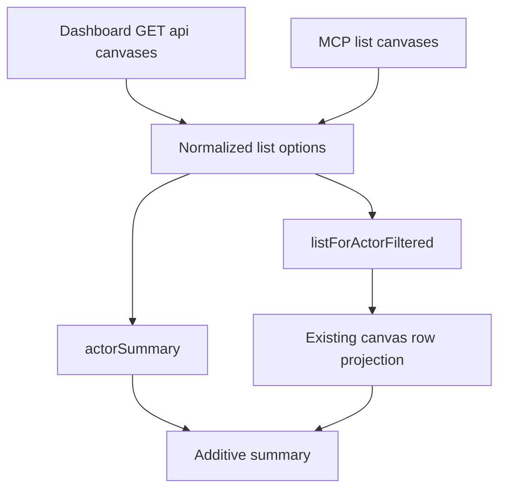
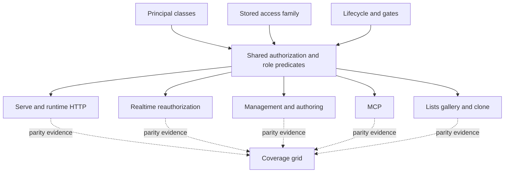

# MCP List Canvases Parity and Access Coverage - Plan

## Goal Capsule

- **Objective.** Agents can browse and page through the same owned-or-edited canvas inventory as dashboard users, and every current access/role/lifecycle decision from the editor-role and restricted-access rounds is proved consistently across HTTP, realtime, authoring, deploy, MCP, dashboard discovery, and clone surfaces.
- **Means.** Extend `list_canvases` through the existing `listForActorFiltered` and `actorSummary` service seam, then add characterization and regression coverage around the shipped decisions instead of creating parallel behavior (KTD1, KTD2).
- **Product authority.** Issue #90, the editor-role and restricted-access plans, their shipped learnings, and Mark's additions in this session. User-facing access terminology is **Restricted** everywhere; `private` remains only a persisted/API compatibility value. The authoring capability is presented with the runtime primitives on the marketing and documentation surfaces.
- **Execution profile.** Autonomous full-scope round on `feat/mcp-list-canvases-parity`: implement all units, run the full dual-dialect gates, run `/ce-code-review`, fix every real P0/P1 and high-value P2 finding, open one PR for #90, and merge only after the required CI matrix is green.
- **Stop conditions.** Stop if main becomes red, a shipped decision cannot be represented through the shared authorization/service seams, or coverage proves a behavior is wrong but the correct product behavior is not settled by the source plans. Record design asymmetries as owner decisions instead of silently normalizing them.

**Product Contract preservation:** direct planning from issue #90 and the user's follow-up requirements; no upstream requirements artifact was rewritten.

---

## Product Contract

### Summary

`list_canvases` gains the dashboard list's remaining filters, lifecycle scope, offset pagination, and inventory summary without changing its existing inputs or canvas row shape. The same round audits the two preceding permission-model changes against a principal × access × lifecycle × surface grid, fills meaningful dual-dialect gaps, makes Restricted the one user-facing name for the restricted access family, and presents authoring alongside the other canvas capabilities.

### Problem Frame

The dashboard can reach archived canvases, state chips, arbitrary pages, and summary counts that MCP cannot. This breaks the repository's agent-native parity rule even though both surfaces already have a shared repository service.

The editor-role and restricted-access rounds changed a wide authorization graph. Their focused suites are substantial, but residual risks remain around legacy request shapes, publish/revoke precedence, clone eligibility, realtime re-authorization, route projections, Share-tab async truthfulness, and tool-description drift. The follow-up should prove the shipped model rather than infer safety from isolated helpers.

User-facing language also still leaks the old **Private** term in creation, badges, filters, marketing, and docs. The stored/API enum stays `private`, but people should see the newer **Restricted** concept consistently. Authoring is a sixth page capability in practice and documentation, yet the landing page's capability showcase still presents only five primitives.

### Key Decisions

- KD1. **One list service on both surfaces.** MCP and dashboard call `listForActorFiltered` and `actorSummary`; neither reproduces filtering or summary logic. Governs R1-R4.
- KD2. **New MCP fields are additive.** Existing inputs and the canvas row projection stay unchanged. Governs R1-R4.
- KD3. **Restricted is the product term; private is compatibility vocabulary.** UI, prose, badges, filters, creation success/error copy, and marketing say Restricted where they describe the access choice. API examples may show `private` only when naming the literal stored/request value and must explain that it means Restricted. Governs R13-R14.
- KD4. **Review proves the shipped model before changing it.** Missing tests are added as characterization coverage. A behavior changes only when the source plans settle the intended result or a hard invariant is broken. Governs R5-R12.
- KD5. **Authoring is a capability alongside the runtime primitives.** Marketing and docs describe what it enables and distinguish its extra opt-in and higher privilege, while preserving the canonical five-primitives wording where the source specification is explicitly counting runtime primitives. Governs R15-R16.

### Requirements

**MCP list parity**

- R1. `list_canvases` accepts additive `scope` (`active` default or `archived`), `protected`, `listed`, `template`, `undeployed`, and `offset` inputs with the same semantics and clamping as `ownerListQuerySchema`.
- R2. `list_canvases` passes every filter through `listForActorFiltered`, calls `actorSummary` for the same actor scope, and returns additive `limit`, `offset`, and `summary` fields while preserving all existing inputs and each canvas row.
- R3. MCP and management list requests for the same actor return equivalent filtering, pagination totals, and summary counts on both database dialects.
- R4. The MCP `access` filter continues to accept `restricted` and each legacy single value (`private`, `specific_people`, `team`) plus `whole_org` and `public_link`; single legacy values narrow to that exact persisted value.

**Authorization coverage review**

- R5. The review maps owner, direct editor, editor-team member, direct viewer, viewer-team member, pending invite, retained legacy guest, unlisted org member, cross-org member, non-managing admin, and anonymous principals against the five stored access values and relevant lifecycle/gate states on every named surface.
- R6. Every meaningful allow/refusal cell is backed by a dual-dialect test or an existing dual-dialect test is cited in the coverage grid; wrong behavior is fixed only when the governing plan settles it, and undecided behavior is reported to the owner.
- R7. The legacy `teamIds: []` compatibility carve-out is pinned for both `access` and deprecated `shared: false` request shapes, based on the real transition away from a stored `team` value.
- R8. Every publish path clears canvas `revokedAt`; authoring route projections cover `draft`, `archived`, and `disabled`; deploy `GET` returns the additive access/lifecycle fields where its public contract requires them; and the frozen authoring `status` remains unchanged.
- R9. Clone tests preserve the documented asymmetry between direct-grant and team-grant viewers as an explicit owner decision, and prove that team-granted viewers cannot clone archived, disabled, unpublished, expired, or password-gated sources.
- R10. Realtime-to-HTTP parity covers password-gated, expired, tenancy-active cross-org, retained guest, and anonymous principals in addition to member principals.
- R11. Share-tab coverage proves pending invites do not inflate current-access copy, retained guests are never described as password-prompted, failed list loads do not claim an empty list, and navigation between canvases cannot show a stale mirror.
- R12. Every MCP tool's description is checked against its implementation, with explicit coverage for `update_canvas.teamIds` and the list changes in R1-R4.

**Terminology and capability communication**

- R13. Every relevant user-facing app surface uses **Restricted**, including canvas creation, fallback notices, visibility/access badges, filters, detail labels, and explanatory copy; no user-facing **Private** label remains for this access choice.
- R14. Documentation and generated docs use **Restricted** consistently, while literal `private` examples are retained only as API/storage compatibility values with a nearby explanation.
- R15. The signed-out marketing page lists authoring with the other canvas capabilities and explains that it lets a signed-in viewer create and manage canvases as themselves, with per-canvas and instance-level opt-in.
- R16. The docs give authoring a clear capability description, link to its SDK/runtime reference, document its gates and policy limits, and keep configuration guidance explicit that Restricted-family shares do not require expiry.

**Editor-flow completion**

- R17. Flows F1, F4, F6, and F7 from the editor-role plan have end-to-end integration coverage on SQLite and Postgres. The PR states that integration tests, not a human two-browser walkthrough, satisfy the remaining gate when dev auth cannot produce two identities.

### Acceptance Examples

- AE1. Given an owned active and archived canvas, default `list_canvases` returns only the active one; `scope: "archived"` returns only the archived one and reports the same inventory summary.
- AE2. Given canvases that are password-protected, listed, templatable, and never deployed, each matching MCP chip returns the same ids and total as `GET /api/canvases` for the same actor.
- AE3. Given more matches than one page, `limit` plus `offset` yields stable non-overlapping MCP pages and an unchanged full `total`.
- AE4. Given canvases stored with each restricted-family legacy value plus `public_link`, each literal `access` input returns only its exact value, while `restricted` returns the family.
- AE5. Given a newly created restricted canvas whose share settings fail, the dashboard tells the user it remains **Restricted**, never “private.”
- AE6. Given the signed-out marketing page, the capability showcase includes Authoring with a linkable, product-true description and no claim that it is enabled by default.
- AE7. Given a team-granted viewer and an archived or disabled source, management and MCP clone attempts both return opaque not-found.
- AE8. Given password, expiry, cross-org tenancy, guest, and anonymous access fixtures, realtime re-authorization returns the same allow/drop verdict as the HTTP authorization decision.

### Scope Boundaries

- In scope: issue #90, regression/characterization tests for the two shipped rounds, Restricted terminology on current app/docs/marketing surfaces, authoring capability positioning, generated docs, and one solutions entry.
- Out of scope: changing persisted access enum values, migrating `private`/legacy values, redesigning the access model, adding a seventh backend primitive, production deployment, and deleting the pinned production snapshot.
- Deferred to owner decision: whether direct-grant viewers should gain the same clone eligibility as team-granted viewers. This PR documents the current asymmetry and options but does not silently change it.

---

## Planning Contract

### Key Technical Decisions

- KTD1. **Mirror the dashboard query contract at the MCP boundary.** Define the additive MCP inputs with Zod, normalize defaults and clamps once in the handler, and pass the normalized values into the existing repository options. This implements KD1-KD2 and R1-R4.
- KTD2. **Fetch page and summary concurrently.** Use the same actor id and live tenancy scope for `listForActorFiltered` and `actorSummary`, matching the management route's data flow. This implements KD1 and R2-R3.
- KTD3. **Treat the coverage grid as evidence, not a Cartesian test generator.** Collapse cells only when they share the same centralized predicate and cite the proving test; add explicit tests at seams that can diverge, especially realtime, route projections, clone, MCP role gates, and dashboard async state. This implements KD4 and R5-R12.
- KTD4. **Centralize Restricted display language.** Reuse access label helpers in dashboard surfaces and test rendered output. Documentation keeps code-form `private` only when it is the literal API value. This implements KD3 and R13-R14.
- KTD5. **Add Authoring to the capability showcase without redefining the five runtime primitives.** The landing card array becomes a capability collection that contains the five primitives plus authoring; copy and tests state authoring's stronger gates. This implements KD5 and R15-R16.
- KTD6. **Use dual-dialect integration tests as the two-session proof.** Extend the existing `apps/server/src/integration/` scenarios for editor lifecycle and file conflicts rather than claiming a manual walkthrough that dev auth cannot perform. This implements R17.

### High-Level Technical Design

### System-Wide Impact

- Agent clients gain access to archived inventory, state filters, pagination metadata, and summary counts without a breaking response change.
- Authorization behavior should remain unchanged except where a hard invariant or an already-settled plan decision proves the implementation wrong.
- User-facing access vocabulary becomes consistent across dashboard, landing page, README, source docs, generated docs, and agent descriptions.
- Marketing and docs treat authoring as an opt-in canvas capability while retaining the canonical specification's five runtime primitives.

### Risks

- A broad coverage request can create repetitive tests that do not exercise independent seams. KTD3 requires traceable collapsing through shared predicates while keeping seam-specific tests.
- Terminology replacement can corrupt literal API values. KTD4 separates rendered prose from code-form compatibility vocabulary.
- Adding authoring to “primitives” can misstate the architecture. KTD5 preserves the five-primitives term when counting the BUILD_BRIEF runtime primitives and presents authoring as an additional capability.
- Generated docs can drift from source Markdown. `pnpm docs:build` and the docs integrity checks are required before merge.

---

## Implementation Units

### U1. MCP list parity

- **Goal:** Add the dashboard's remaining list controls and summary to `list_canvases` through the shared repository service.
- **Requirements:** R1-R4; AE1-AE4.
- **Dependencies:** None.
- **Files:** `apps/server/src/mcp/server.ts`, `apps/server/src/mcp/server.test.ts`, `docs/site/agents/mcp.md`.
- **Approach:** Extend the MCP input schema and handler per KTD1-KTD2. Preserve existing keys and rows. Add exact legacy-value filtering coverage in the same dual-dialect suite.
- **Execution note:** Start with failing MCP-vs-management parity scenarios, then extend the handler.
- **Patterns to follow:** `ownerListQuerySchema` and the `GET /api/canvases` handler in `apps/server/src/routes/management.ts`.
- **Test scenarios:**
  - Covers AE1. Active is the default; archived rows appear only under archived scope.
  - Covers AE2. Each boolean state input returns the same ids and total as the management route.
  - Covers AE3. Offset pages remain stable and report the unpaged total plus normalized limit and offset.
  - Covers AE4. `restricted` expands to the family; every legacy literal and `public_link` filters exactly.
  - Summary counts equal the management response for the same actor and remain independent of page filters.
- **Verification:** MCP schema, behavior, docs row, and View/return-shape prose agree on the additive contract on both dialects.

### U2. Restricted terminology and authoring communication

- **Goal:** Make the product vocabulary and capability story consistent across creation, dashboard, marketing, and docs.
- **Requirements:** R13-R16; AE5-AE6.
- **Dependencies:** None.
- **Files:** `apps/dashboard/src/routes/new.tsx`, `apps/dashboard/src/components/Badge.tsx`, relevant dashboard tests under `apps/dashboard/src/test/`, `apps/server/src/http/landing-page.ts`, `apps/server/src/http/landing-page.test.ts`, `README.md`, `docs/site/index.md`, `docs/site/authoring/create-and-publish.md`, `docs/site/authoring/capabilities.md`, `docs/site/self-hosting/configuration.md`, and any additional source docs found by the terminology audit.
- **Approach:** Apply KTD4-KTD5. Audit rendered strings rather than replacing identifier names. Add Authoring as an additional capability card with its safety gates and documentation links.
- **Test scenarios:**
  - Covers AE5. Creation and share-failure notices render Restricted.
  - Access and visibility badges plus access filters never render Private for the restricted family.
  - Covers AE6. The landing page renders all five primitives plus Authoring and states both opt-ins.
  - Documentation distinguishes the user-facing Restricted term from literal `private` API examples.
  - Configuration explicitly says expiry is not required for `private`, `specific_people`, or `team` shares.
- **Verification:** A repo-wide user-facing string audit finds no stale Private label for access, and docs build regenerates the bundled content.

### U3. Authorization and lifecycle coverage grid

- **Goal:** Prove the shipped role/access/lifecycle behavior at every independently implemented seam and fix only settled defects.
- **Requirements:** R5-R12; AE7-AE8.
- **Dependencies:** None.
- **Files:** `apps/server/src/canvas/authorization.test.ts`, `apps/server/src/realtime/hub.test.ts`, `apps/server/src/routes/management.test.ts`, `apps/server/src/routes/canvas-authoring.test.ts`, `apps/server/src/routes/deploy-api.test.ts`, `apps/server/src/mcp/server.test.ts`, `apps/server/src/teams/sharing.test.ts`, `apps/server/src/canvas/clone-service.test.ts`, and implementation files only where a proved defect requires a fix.
- **Approach:** Build a durable coverage table in the new solutions entry. Cite existing dual-dialect evidence for centralized decisions and add route/seam tests for uncited cells. Preserve opaque not-found and OWNER_ONLY ordering from the auth invariant checklist.
- **Execution note:** Add characterization tests first; change behavior only after the test expectation is traced to a source-plan decision or hard invariant.
- **Test scenarios:**
  - Deprecated `shared: false` plus `teamIds: []` is a no-op only on a real stored `team` transition; other shapes return `TEAM_REQUIRED`.
  - Every publish path clears `revokedAt`, including authoring bundle update, management/dashboard publish, deploy API, and MCP deploy.
  - Authoring routes project draft, archived, disabled, expired, unpublished, and published states while frozen `status` remains unchanged.
  - Covers AE7. Team-granted clone refuses archived, disabled, unpublished, expired, and protected sources as opaque not-found over management and MCP.
  - Covers AE8. Hub and HTTP decisions agree for password, expiry, cross-org tenancy, retained guest, and anonymous principals.
  - MCP owner/editor/viewer/no-role matrix and tool descriptions agree for every tool, including `update_canvas.teamIds`.
- **Verification:** Every grid row names dual-dialect evidence, an added test, a fixed defect, or an explicit owner decision.

### U4. Dashboard truthfulness and editor-flow proof

- **Goal:** Close the Share-tab async-copy risks and the editor-role plan's remaining two-browser Definition-of-Done gap with automated integration evidence.
- **Requirements:** R11, R17.
- **Dependencies:** U3 for any shared fixtures or clarified authorization expectations.
- **Files:** `apps/dashboard/src/routes/canvas.share.tsx`, `apps/dashboard/src/test/share.test.tsx`, `apps/server/src/integration/editor-flow.test.ts`, `apps/server/src/integration/editor-scenarios.test.ts`, and shared integration harness files only if required.
- **Approach:** Test the Share tab as a navigation/loading state machine. Extend existing dual-dialect integration flows for promotion, transfer, demotion/removal, and two-editor file conflicts per KTD6.
- **Test scenarios:**
  - Pending invite rows do not count as someone who can open today.
  - Retained guests never receive copy claiming they will face a password prompt.
  - A failed people-list load produces an unavailable/error state, not “Only you.”
  - Navigation from canvas A to B clears the prior list mirror before B's copy renders.
  - F1 promotes a colleague and proves editor management access.
  - F4 transfers ownership and proves the old owner becomes editor.
  - F6 removes or demotes an editor and proves next-request revocation.
  - F7 merges disjoint-file edits and rejects same-file stale saves.
- **Verification:** Dashboard tests and dual-dialect integration suites provide the evidence the PR reports in place of a human two-browser walkthrough.

### U5. Generated docs, review record, and learnings

- **Goal:** Keep generated artifacts current and leave a review record that explains confirmed behavior, defects, and owner decisions.
- **Requirements:** R6, R12, R14-R17.
- **Dependencies:** U1-U4.
- **Files:** `apps/server/src/docs/generated-content.ts`, `docs/solutions/2026-09-02-mcp-list-parity-and-access-coverage.md`, and `AGENTS.md` only if behavior changes.
- **Approach:** Run the docs generator after source edits. Capture the coverage grid, the direct-vs-team viewer clone asymmetry and options, any defects fixed, and the integration-test substitution for the manual walkthrough.
- **Test scenarios:** Test expectation: none — this unit records and regenerates evidence produced by U1-U4; generated-doc integrity and the full gates verify it.
- **Verification:** Generated docs are clean, the solutions entry is actionable, and any shipped behavior change is reflected in the AGENTS status sentence.

---

## Verification Contract

| Gate | Applies to | Done signal |
|---|---|---|
| Targeted server tests | U1, U3, U4 | New MCP, authorization, realtime, authoring, clone, and integration scenarios pass on SQLite and Postgres. |
| Dashboard tests | U2, U4 | Creation, badge/filter, and Share-tab state tests pass. |
| `pnpm docs:build` | U1, U2, U5 | Generated docs match their source pages. |
| `pnpm lint` | All | Biome reports no errors. |
| `pnpm typecheck` | All | Root, SDK, and dashboard TypeScript checks pass. |
| `pnpm test` | All | Full SQLite, Postgres/PGlite, and dashboard suite passes. |
| `pnpm build` | All | All workspace packages build. |
| `/ce-code-review` | All | Risk-selected reviewers run before the PR; all real P0/P1 and high-value P2 findings are fixed with regression coverage, weighted by `docs/solutions/2026-06-13-auth-invariant-checklist.md`. |
| GitHub CI matrix | All | Required lint/typecheck/docs, SQLite, dashboard, Postgres/MinIO, and build checks are green before squash merge. |

---

## Definition of Done

- `list_canvases` has additive dashboard-list parity for scope, chips, offset, normalized pagination metadata, and summary without changing existing fields.
- Both dialects prove archived scope, every chip, pagination/total, summary parity, and exact legacy access filtering.
- The functional coverage grid accounts for every requested principal, stored access value, lifecycle/gate state, and named surface through shared-predicate evidence or seam-specific tests.
- Residual-risk cases are tested, fixed when settled, or reported as explicit decisions; none are silently normalized.
- Restricted is the user-facing access term throughout creation, dashboard labels/badges/filters, marketing, README, source docs, and generated docs.
- Authoring appears with the marketing capability showcase and is accurately described and linked in the docs.
- F1, F4, F6, and F7 have dual-dialect end-to-end integration evidence, with the PR plainly stating that this replaces the unavailable human two-session walkthrough.
- The solutions entry captures durable lessons and the coverage grid; abandoned test helpers or experimental code are removed.
- Local gates and the required CI matrix are green, the PR is squash-merged with branch deletion, issue #90 is closed, and production is untouched.
