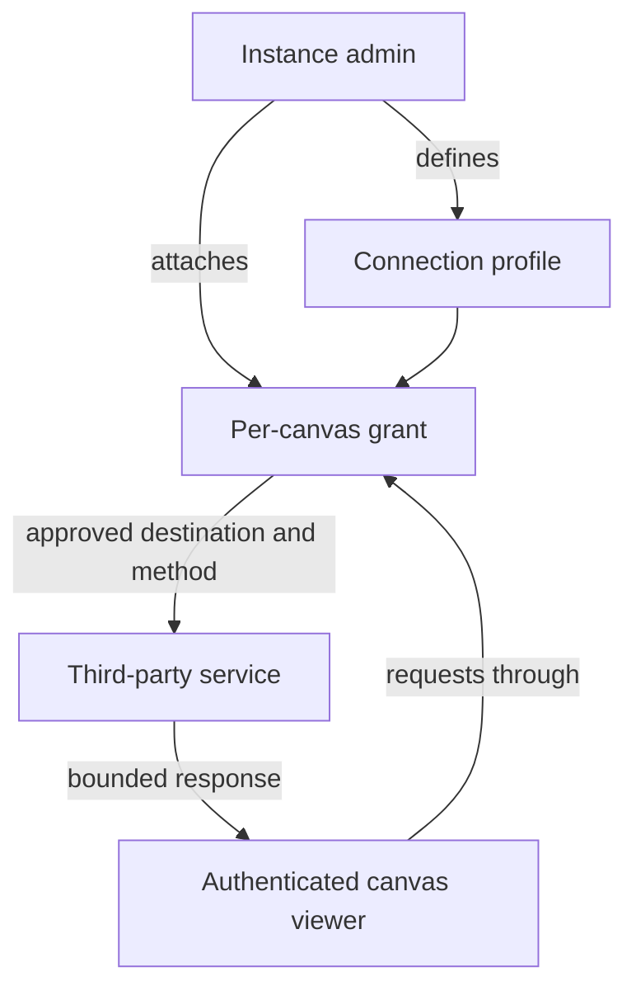
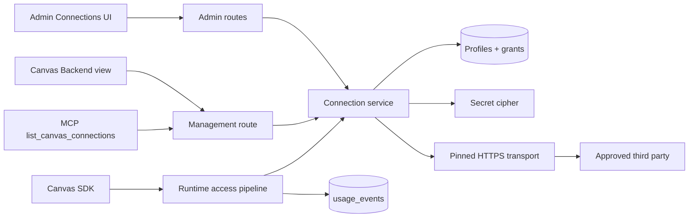
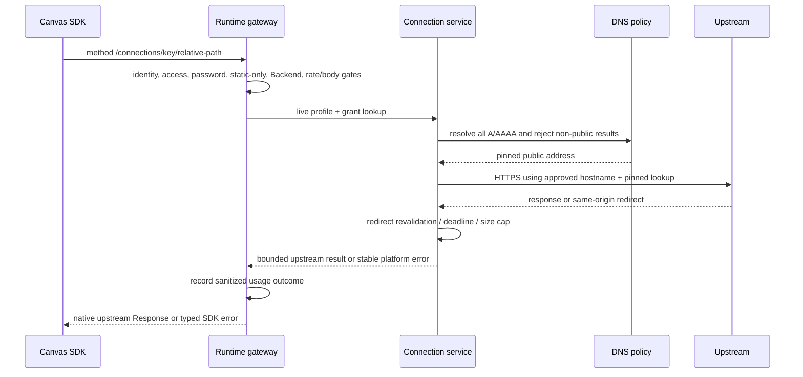
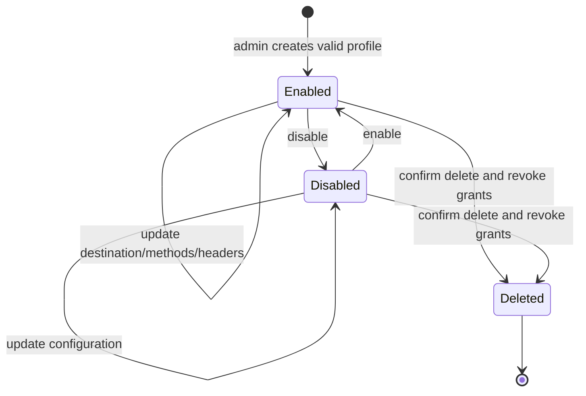

# Admin-Granted Outbound Connections - Plan

## Goal Capsule

- **Objective:** Canvas authors can retrieve CORS-blocked third-party data through controlled server-side requests without exposing credentials or gaining general backend execution.
- **Means:** Add an outbound Connections primitive based on reusable admin-managed profiles and explicit per-canvas grants.
- **Product authority:** This plan intentionally amends the static-first boundary in `BUILD_BRIEF.md` sections 4.3 and 4.4 by adding one fixed primitive; the rest of `BUILD_BRIEF.md` remains authoritative.
- **Execution profile:** One worktree branch and one PR, with one commit per unit, dual-dialect migrations/tests, dashboard and SDK coverage, security review, browser verification, and green CI before merge.
- **Stop conditions:** Stop if safe implementation requires arbitrary canvas-selected destinations, exposes protected profile values, weakens the existing access pipeline, or cannot prevent private-network resolution and redirect escape.
- **Tail ownership:** The implementing agent owns the tracking issue, PR, CI, squash merge, issue closure, and solution note. Production deployment is excluded.
- **Open blockers:** None.

---

## Product Contract

### Summary

Canvas Drop will add Connections as a narrow backend primitive for authenticated canvases.
Admins define approved third-party connection profiles and attach them to individual canvases, whose frontend code can then make transparent, bounded requests without receiving protected credentials.

### Problem Frame

Some useful canvases need third-party data that browsers cannot fetch directly because the provider rejects cross-origin requests or requires controlled headers such as a specific `User-Agent`.
Authors currently cannot solve that class of problem inside Canvas Drop's fixed primitives, while operating a separate proxy defeats its zero-friction publishing value.
The motivating case is fetching stock data from an external endpoint that cannot be called directly from canvas JavaScript.

### Key Decisions

- **Connections is a fixed request primitive, not executable backend code.** (session-settled: user-directed — chosen over sandboxed functions: forwarding controlled requests satisfies the concrete need with far less security and operational scope.) Governs R1, R14.
- **Every reachable host comes from an admin-managed connection profile.** (session-settled: user-directed — chosen over canvas-owner or unrestricted host selection: the operator retains the outbound network boundary.) Governs R2, R3, R9.
- **Profiles hold protected headers and credentials.** (session-settled: user-directed — chosen over canvas-owned credentials or a header-only first release: reusable admin configuration keeps secrets outside canvas files and browsers.) Governs R2, R4.
- **An admin grants each profile to each canvas explicitly.** (session-settled: user-directed — chosen over published or team-scoped self-service profiles: each credential grant remains deliberate.) Governs R5, R6.
- **An attached connection is transparent within its declared boundary.** (session-settled: user-directed — chosen over named operations or restricted path templates: canvas authors prefer request flexibility despite the profile's broader authority.) Governs R7, R8.
- **Each profile selects its allowed HTTP methods.** (session-settled: user-directed — chosen over globally read-only or globally unrestricted methods: the operator can match request authority to each integration.) Governs R3, R8.
- **Existing runtime access rules remain authoritative.** The new primitive inherits the current runtime access model rather than defining a parallel one. Governs R7, R11.

### Actors

- A1. **Instance admin:** Creates and governs connection profiles, then grants or revokes them per canvas.
- A2. **Canvas owner or editor:** Sees which connections are available to the canvas and authors frontend code that uses them, but cannot create or attach profiles.
- A3. **Authenticated canvas viewer:** Triggers a connection request through a canvas they can currently access and is attributable for limits and audit records.
- A4. **Third-party service:** Receives the server-side request and returns data or an upstream failure.

### Requirements

**Capability shape**

- R1. Canvas Drop provides Connections as an optional backend primitive without running canvas-supplied code, packages, commands, or processes on the server.
- R2. An admin can create, inspect, update, disable, and delete reusable named connection profiles containing one approved public HTTPS destination and its server-controlled request configuration.
- R3. Each profile declares the ordinary API methods it permits from `GET`, `HEAD`, `POST`, `PUT`, `PATCH`, and `DELETE`; `CONNECT`, `TRACE`, `OPTIONS`, and arbitrary method strings are unavailable to canvas requests.
- R4. A profile can supply fixed protected headers and credentials that Canvas Drop never returns through profile, management, SDK metadata, platform-error, audit, or usage surfaces and never writes into canvas content. Because the approved upstream controls its response body, admins must grant only trusted API origins and paths that do not reflect request credentials.
- R5. Only an admin can attach or detach a profile for a particular canvas, and a canvas may hold multiple independently named connection grants.
- R6. Owners, editors, and agents can inspect a canvas's granted connection names, approved origins, allowed methods, and availability without gaining access to protected header names or values; owner/editor-visible behavior has MCP parity through the same service rules.

**Runtime requests**

- R7. An authenticated, non-static viewer can invoke an attached connection only while that canvas's Backend capability, connection grant, access decision, password gate, and lifecycle state all permit the request.
- R8. Canvas code can choose the request path, query parameters, unprotected headers, and body within the attached profile's destination and allowed methods; it cannot replace protected headers or credentials.
- R9. Every outbound request remains bound to the profile's approved public HTTPS destination across redirects and name resolution, with no route to loopback, link-local, private-network, or other non-approved targets.
- R10. The caller receives the upstream status, a safe subset of response headers, and a bounded response body in a form suitable for common JSON and text data integrations.
- R11. Detaching or disabling a connection, disabling Backend, revoking canvas access, expiring a share, disabling the canvas, or deleting it prevents the next request without a stale grant window.

**Safety and operations**

- R12. Connection requests have operator-visible time, request-size, response-size, redirect, concurrency, and per-actor rate boundaries, with stable errors when a boundary rejects the request.
- R13. Attempts, outcomes, actor identity, canvas, profile, destination, method, latency, and bounded usage are auditable without recording protected headers, credentials, or sensitive bodies.
- R14. Instances with no configured or granted connections make no new outbound requests and require no additional runtime service.
- R15. The browser SDK, human documentation, and agent-readable documentation describe the same connection behavior, limits, errors, and static-only restriction.

The grant and request relationship is:

### Key Flows

- F1. Configure a reusable connection
  - **Trigger:** An admin wants canvases to reach a third-party service.
  - **Actors:** A1, A4
  - **Steps:** The admin names the profile, approves its public HTTPS destination, chooses allowed methods, supplies fixed headers or credentials, and enables it.
  - **Outcome:** The profile is available for explicit canvas grants but no canvas can use it yet.
  - **Covered by:** R2, R3, R4, R9.
- F2. Grant a connection to a canvas
  - **Trigger:** A particular canvas needs an existing profile.
  - **Actors:** A1, A2
  - **Steps:** The admin attaches the profile to the canvas; the owner or editor can see the connection name and whether it is available without seeing protected configuration.
  - **Outcome:** The canvas may use the profile whenever its runtime gates permit it.
  - **Covered by:** R5, R6, R7.
- F3. Fetch third-party data
  - **Trigger:** An authenticated viewer uses a canvas that requests stock or other third-party data.
  - **Actors:** A3, A4
  - **Steps:** Canvas Drop attributes and authorizes the caller, applies the connection boundary, makes the server-side request, and returns the bounded upstream result.
  - **Outcome:** The canvas receives useful data without browser CORS access or credential exposure.
  - **Covered by:** R7, R8, R9, R10, R12, R13.
- F4. Revoke a connection
  - **Trigger:** An admin detaches or disables a connection, or the canvas loses runtime eligibility.
  - **Actors:** A1, A2, A3
  - **Steps:** The relevant grant or lifecycle state changes; the next attempted request re-evaluates the live state.
  - **Outcome:** Further outbound requests fail without using stale authority.
  - **Covered by:** R11.

### Acceptance Examples

- AE1. Stock data through a controlled header
  - **Covers R2, R4, R7, R8, R10.**
  - **Given:** An admin profile for a stock-data host fixes the required `User-Agent`, permits `GET`, and is attached to a canvas with Backend enabled.
  - **When:** An authenticated viewer's canvas requests a quote path with a symbol query parameter.
  - **Then:** The provider receives the fixed `User-Agent`, and the canvas receives the bounded upstream result without seeing that protected header.
- AE2. Missing per-canvas grant
  - **Covers R5, R7.**
  - **Given:** A profile exists but is not attached to the requesting canvas.
  - **When:** That canvas tries to invoke the profile by name.
  - **Then:** Canvas Drop returns a stable unavailable-or-not-found error and makes no outbound request.
- AE3. Method boundary
  - **Covers R3, R8.**
  - **Given:** A profile permits `GET` and `HEAD` only.
  - **When:** Its attached canvas attempts `POST` or an unsupported method.
  - **Then:** Canvas Drop rejects the request before contacting the third party.
- AE4. Destination escape
  - **Covers R9.**
  - **Given:** An attached profile approves one public HTTPS destination.
  - **When:** A request, redirect, or resolved address attempts to reach another host or a non-public network address.
  - **Then:** Canvas Drop refuses the outbound hop and returns a stable boundary error.
- AE5. Public-link viewer
  - **Covers R7.**
  - **Given:** A canvas with an attached profile is published through a Public link.
  - **When:** An anonymous visitor opens it and canvas code attempts a connection request.
  - **Then:** The runtime remains static-only and makes no outbound request.
- AE6. Immediate revocation
  - **Covers R11.**
  - **Given:** A canvas has successfully used an attached profile.
  - **When:** The admin detaches the profile or the viewer's canvas access is revoked.
  - **Then:** The next request fails before contacting the third party.
- AE7. Observability without leakage
  - **Covers R4, R12, R13.**
  - **Given:** A connection request succeeds, fails upstream, or is rejected by a limit.
  - **When:** An operator inspects its audit and usage record.
  - **Then:** The record identifies the actor, canvas, profile, method, outcome, and bounded operational data without containing credentials, protected headers, or request and response bodies.

### Success Criteria

- An admin can configure the motivating stock-data connection once, attach it to a canvas, and let that canvas retrieve quotes with the required server-controlled `User-Agent` without a separate proxy or browser CORS failure.
- An operator can determine which third-party authority each canvas holds and revoke it without inspecting canvas source code.

### Scope Boundaries

**Deferred for later**

- Response caching and provider-specific rate-limit coordination.
- Named operations, path templates, request transformations, and response-schema validation layered above transparent connections.
- Inbound webhooks, scheduled requests, and asynchronous delivery.

**Outside this product's identity**

- Running canvas-supplied backend code, binaries, or containers.
- User-selected packages, shared runtime libraries, shell access, or machine filesystem access.
- A general-purpose Lambda, job queue, workflow engine, or serverless hosting product.
- Owner-created destinations, owner-managed credentials, or self-service connection attachment.

### Dependencies and Assumptions

- The instance admin is the authority for whether a third-party credential and its allowed methods are safe to expose to a particular canvas.
- A connection may authorize consequential third-party actions; Canvas Drop constrains the grant but cannot make an over-privileged upstream credential safe.
- Third-party terms, authentication schemes, and permission to proxy their responses remain the operator's responsibility.
- A transparent connection grants canvas code the upstream credential's usable authority within the approved origin/method boundary. If the upstream has an echo/debug/error endpoint that reflects request headers, it can reveal protected values in its response; the admin must treat that origin as unsafe for a credentialed transparent profile.
- Connection usage assumes Canvas Drop's existing authenticated organization model; the public-link restriction is governed by R7.
- A profile's approved destination is an exact HTTPS origin (`scheme + hostname + explicit/default port`), not a canvas-selected URL; canvas code supplies only a relative path and query.
- The first release is optimized for small data APIs: 8 KiB relative URLs, at most 32 caller headers and 16 KiB combined caller-header bytes, 256 KiB request bodies, 2 MiB responses, a 10 second deadline, at most 3 redirects, 5 concurrent requests per canvas, 50 concurrent requests instance-wide, 60 requests per minute per actor/canvas/profile, and 600 requests per minute per profile instance-wide.
- The connection encryption key is an operator-managed 32-byte secret outside the database. Database restore without that key restores metadata but leaves protected headers unusable until they are replaced.
- Response caching, upstream-credential rotation workflows beyond replace-in-place, and encryption-root-key re-encryption are deferred; runtime responses are always `private, no-store`. Rotating the root key in the first release requires re-entering every protected header map under the new key.

### Sources and Research

- `BUILD_BRIEF.md` sections 4.1-4.7 and 12.0-12.5 define the current product boundary, trusted-org posture, hard invariants, limits, and static-only public behavior.
- `README.md` sections "Backend primitives + authoring" and "Security model" describe the current browser SDK contract and operator-facing guarantees.
- `packages/shared/src/capabilities/index.ts` centralizes stored and effective backend capability rules.
- `apps/server/src/routes/canvas-api.ts` provides the shared runtime authorization, password, static-only, and origin-isolation seam inherited by existing primitives.
- `apps/server/src/http/canvas-api-isolation.ts` defines the current subdomain and path-mode cross-canvas request boundary.
- `packages/shared/src/db/schema.pg.ts` and `packages/shared/src/db/schema.sqlite.ts` show the dual-dialect capability state that planning must keep aligned.
- `docs/solutions/2026-06-13-auth-invariant-checklist.md` fixes the inherited access, lifecycle, same-origin, and rejection-path requirements.
- `docs/solutions/2026-06-13-dual-dialect-drizzle-seam.md` requires lockstep schema builders, both generated migrations, parity assertions, and dialect-parameterized repository tests.
- `docs/solutions/2026-06-14-admin-managed-config-and-sdk-dev-build.md` supplies the write-only secret and per-request effective-setting patterns.
- [OWASP SSRF Prevention Cheat Sheet](https://cheatsheetseries.owasp.org/cheatsheets/Server_Side_Request_Forgery_Prevention_Cheat_Sheet.html) requires exact allowlists, redirect control, A/AAAA validation, and network-layer defense in depth.
- [Node.js 24 HTTP documentation](https://nodejs.org/download/release/latest-v24.x/docs/api/http.html) documents the custom DNS `lookup` hook and `AbortSignal` support used to pin validated addresses and enforce cancellation.
- [Node.js 24 Net documentation](https://nodejs.org/download/release/latest-v24.x/docs/api/net.html) documents `net.BlockList`, used with the IANA special-purpose IPv4/IPv6 ranges to reject non-public destinations.
- [Node.js Crypto documentation](https://nodejs.org/docs/latest-v24.x/api/crypto.html) documents authenticated encryption, IV, and authentication-tag handling for protected profile data.

### Product Contract Preservation

Product Contract clarified at R4 and R6 after security/usability review: the platform-owned non-disclosure boundary now distinguishes third-party response content, and authors can see non-secret origin/method metadata. The feature scope, R/A/F/AE IDs, and all session-settled product decisions are unchanged.

---

## Planning Contract

### Key Technical Decisions

- KTD1. **A grant is the Connections capability switch.** Do not add a canvas-owned `capConnections` toggle. An attached enabled profile is available only when the existing Backend master is on and the normal runtime pipeline grants full access. This instantiates the admin-grant and inherited-access decisions in R5-R7 without giving owners a self-service authority switch.
- KTD2. **Profiles use a stable public key plus a human label.** Each profile has an immutable, unique lowercase key used by SDK code and an editable label used in admin and canvas-management views. The approved destination is a normalized exact HTTPS origin with no username, password, path, query, or fragment. Canvas paths are resolved against that origin and rejected if normalization changes the origin.
- KTD3. **Protected headers are an authenticated encrypted envelope.** Store the complete fixed-header map as an AES-256-GCM `v1` envelope with a random 96-bit IV, authentication tag, and profile id as additional authenticated data. `CANVAS_DROP_CONNECTIONS_ENCRYPTION_KEY` is a required base64-encoded 32-byte key only when protected values are created or used; it is read through typed config, never stored in the database, serialized, logged, or returned. Admin profile projections may expose normalized header names with `set: true` so the write-only configuration is maintainable, but never values; canvas-management, MCP, runtime, audit, and usage projections expose neither names nor values. Updates preserve the envelope when protected headers are omitted, replace it when a new map is supplied, and clear it only on an explicit empty map.
- KTD4. **DNS validation and connection are one pinned operation.** For every request and every redirect hop, resolve all A and AAAA records, reject the hop if any result is not globally routable, select one validated address, and pass it through Node's custom `lookup` while retaining the profile hostname for Host, SNI, and certificate verification. Reject IP-literal destinations, DNS failures, mixed public/private answers, userinfo, non-HTTPS schemes, and the IANA special-purpose IPv4/IPv6 ranges. Infrastructure egress rules remain recommended defense in depth, but application enforcement is mandatory.
- KTD5. **Redirects never widen authority.** Disable automatic redirects. Follow only 301, 302, 303, 307, and 308 up to three hops when the resolved `Location` has the exact approved origin; re-run KTD4 before each hop. For 301/302, rewrite POST to GET and otherwise preserve method/body; for 303, preserve HEAD and rewrite every other method to GET; for 307/308, preserve method/body. Re-check the resulting method against the profile allowlist before contacting the redirected target and fail with `METHOD_NOT_ALLOWED` when it was not approved. Drop entity headers when rewriting to GET, destroy the prior response before following, and never forward upstream `Location` to the browser.
- KTD6. **The route is transparent only inside a strict HTTP envelope.** Mount explicit GET/HEAD/POST/PUT/PATCH/DELETE handlers at `/v1/c/{slug}/connections/{profileKey}/*` behind the existing access/password/static-only pipeline; the existing canvas isolation check applies to every method, and POST/PUT/PATCH/DELETE additionally require the shared same-origin decision before any connection lookup. Reject relative URLs over 8 KiB, more than 32 caller headers, more than 16 KiB combined caller-header bytes, invalid header tokens/values, control characters in path/query/header input, or absolute/protocol-relative targets. Strip cookies, authorization, proxy/forwarding, origin/referrer, host/content-length, accept-encoding, and hop-by-hop request headers; reject protected-name overrides; force `Accept-Encoding: identity`; apply fixed headers last. Reject a non-identity upstream `Content-Encoding`. Return the upstream status and only safe data headers (`Content-Type`, `Content-Language`, `ETag`, `Last-Modified`, `Retry-After`) plus an internal upstream marker that upstream input cannot set, and force `Cache-Control: private, no-store`, `X-Content-Type-Options: nosniff`, and `Content-Security-Policy: sandbox` on the self-built response. Buffer within the 256 KiB request and 2 MiB response caps so an over-limit body is rejected and never partially delivered.
- KTD7. **Stable platform errors remain distinct from upstream responses.** The browser SDK exposes `canvasdrop.connections.fetch(profileKey, path, init): Promise<Response>`. Any response carrying the server-only upstream marker is returned as a native `Response`, including upstream 4xx/5xx. Platform refusals use stable JSON codes and the existing SDK error mapper: `CONNECTION_NOT_AVAILABLE`, `METHOD_NOT_ALLOWED`, `DESTINATION_BLOCKED`, `UPSTREAM_TIMEOUT`, `UPSTREAM_UNAVAILABLE`, `BODY_TOO_LARGE`, `RESPONSE_TOO_LARGE`, `RATE_LIMITED`, and `CONNECTION_LIMIT`.
- KTD8. **Admin mutations and manager inspection share services.** Admin-only profile CRUD and attach/detach routes call a connection service that owns validation, encryption, transactions, and audit events. Profile deletion atomically revokes every grant after a confirmation that names the affected-canvas count. Updating a destination, methods, headers, or enabled state takes effect on the next request across all grants. Admin projections include origin, methods, affected-canvas count, and protected header names with write-only `set` state. Owners/editors inspect key, label, origin, allowed methods, enabled/available state, and unavailability reason through one manager service exposed by HTTP and a new `list_canvas_connections` MCP tool; no protected header name or value crosses that boundary. The Admin Connections page also supports selecting one canvas to see and revoke all of its grants, so authority is inspectable from either profile or canvas.
- KTD9. **Runtime events use the bounded usage log.** Add `connection_op` to `usage_events` for each route attempt that resolves an authenticated actor and canvas, recording actor, canvas, method, normalized destination origin, outcome, upstream status, latency, byte counts, and the resolved profile id/key when one exists (otherwise only the requested key). Paths, query strings, bodies, and headers are never recorded because any may contain provider secrets or user data. Profile/grant mutations remain in `audit_log`. Runtime writes follow the repository's existing best-effort metering contract and 90-day retention/purge behavior; security decisions never depend on a successful telemetry write. Admin profile detail exposes paginated recent sanitized events within that window so R13 is operationally inspectable rather than database-only.
- KTD10. **Limits are explicit and separately enforced.** After a live grant resolves, apply a connection-specific limiter of 60 requests/minute keyed by the server-resolved actor, canvas id, and profile id plus a 600 requests/minute instance-wide profile bucket before DNS or outbound I/O; invalid/missing keys consume only the existing broad canvas bucket and cannot allocate profile buckets. Add per-canvas and instance-wide in-memory admission counters of 5 and 50 with idle-key cleanup; reject immediately with `CONNECTION_LIMIT` instead of queueing when either is full, and release both slots on every terminal path. Enforce 8 KiB relative-URL, 32 caller-header, 16 KiB caller-header-byte, and 256 KiB body request limits; a total 10 second `AbortSignal` deadline; three redirects; and a 2 MiB response cap. These first-release values are read-only typed config fields shown in Admin Configuration. Multi-process coordination is deferred because the shipped deployment is one server process.
- KTD11. **Admin-only mutation remains intentionally human/admin API only.** Per the repository's agent-native exception, cross-owner profile CRUD and grants stay on dedicated admin routes and are not added to the identity-scoped MCP server. Owner/editor connection inspection is Now and must have HTTP/dashboard/MCP parity; runtime fetching is available to canvas code, not as an MCP proxy tool.

### High-Level Technical Design

The sketches are directional. Unit bodies and the existing service seams remain authoritative.

**Authority and component flow**

**Runtime request sequence**

**Profile lifecycle**

### System-Wide Impact

- **Product boundary:** `BUILD_BRIEF.md`, README status/capability language, SDK docs, Runtime API, error catalog, and `/llms.txt` change from five to six fixed primitives while continuing to reject arbitrary server code.
- **Data:** Two new tables and one usage-event enum member require lockstep PG/SQLite schemas, generated migrations, repository parity, backup/restore coverage, and deletion transactions.
- **Security:** Canvas Drop becomes an outbound network principal. SSRF, secret leakage, redirect escape, DNS rebinding, request smuggling headers, credential overreach, and abuse limits are invariant-level review areas.
- **Authorization:** Runtime requests inherit the existing server-resolved actor, canvas access, password, lifecycle, and public-link static-only gates. Admin actions stay behind `requireAdmin` plus same-origin mutation protection. Manager inspection uses the shared role resolver and reads as not found without a role.
- **Operations:** Existing installations boot unchanged with no encryption key and make no new egress. The key becomes part of the backup/restore secret inventory once profiles exist. Single-process concurrency is explicit.
- **Agent parity:** The dashboard and MCP both consume the same sanitized manager listing. Tool inventory, role matrix, and generated agent docs must move together.

### Risks and Mitigations

- **SSRF through DNS or redirects:** KTD4-KTD5 require all-address validation, socket pinning, exact-origin redirects, and adversarial unit tests for IPv4, IPv6, mapped addresses, mixed answers, userinfo, alternate ports, and rebinding.
- **Credential leakage:** KTD3 and KTD6 make values write-only, encrypt at rest, strip diagnostic inputs, and test platform errors, logs, usage records, and projections with recognizable canary secrets. An approved upstream can still reflect a value in its own body, so admin warnings and documentation make that trust boundary explicit.
- **Over-privileged upstream credential:** Admin UI shows the allowed methods, origin, and affected canvases at every grant/update/delete decision. Canvas Drop cannot reduce the upstream credential's own authority; operator documentation calls this out.
- **Hot-path resource exhaustion:** KTD10 rejects before I/O where possible, cancels on timeout/client disconnect, bounds buffers, and limits per-canvas plus instance-wide concurrency. Tests prove slots release after success, abort, timeout, and error.
- **Restore without the encryption key:** Decryption fails closed with a visible admin status; metadata/grants remain inspectable and removable, and replacing protected headers recovers the profile. Ops docs include the key in backup prerequisites without copying it into backups.
- **Upstream compatibility:** Exact-origin redirects intentionally reject providers that redirect across hosts. Admins must configure the final API origin; cross-origin redirect support is deferred because it expands the grant model.

### Assumptions

- Node.js 24 remains the production runtime, so custom HTTP lookup, `AbortSignal`, `net.BlockList`, and AES-GCM APIs are available.
- The existing trusted-org rate model is sufficient for the first release; distributed limit and concurrency coordination becomes necessary only if the server is horizontally scaled.
- A profile key can be immutable after creation; admins may change its display label or create a replacement profile when canvas code needs a new key.
- Header values are UTF-8 strings. Duplicate request header names are normalized case-insensitively and rejected at validation rather than preserved as arrays.

### Sequencing

U0 first falsifies the highest-risk network assumptions with a pure pinned-transport proof. U1 then establishes persistence and cryptography, U2 adds shared services/admin APIs, and U3 composes the transport into the runtime pipeline. U4 adds manager/agent inspection, U5 builds the admin and owner/editor UI on those APIs, then U6 documents the contract and U7 supplies assembled evidence and landing gates.

---

## Implementation Units

### U0. Pinned HTTPS transport proof

- **Goal:** Prove the SSRF boundary and Node 24 socket-pinning approach before persistence and UI depend on it.
- **Requirements:** R3-R4, R8-R10, R12, R14; AE3-AE4; KTD4-KTD6.
- **Dependencies:** None.
- **Files:** `apps/server/src/connections/address-policy.ts`, `apps/server/src/connections/transport.ts`, `apps/server/src/connections/transport.test.ts`.
- **Approach:** Implement pure origin/path/redirect/header policies plus injectable DNS and HTTPS adapters. Resolve and validate every address, pin the selected address through the custom lookup while retaining the original hostname for TLS, force identity encoding, enforce exact-origin/manual redirects and identity-byte delivery limits, and expose a transport result independent of database or Hono types.
- **Execution note:** Start with the hostile address/redirect/header matrix and verify the exact production `https.request` options through an injected request adapter; do not use public network calls.
- **Test scenarios:**
  1. The adapter passes the approved hostname for certificate/SNI/Host while its custom lookup returns only the already-validated pinned IP.
  2. Every IANA special-purpose IPv4/IPv6 class, IPv4-mapped IPv6, mixed public/private answer, IP literal, DNS failure, and rebinding simulation rejects before socket creation.
  3. Relative-path normalization cannot change origin; control characters, absolute/protocol-relative paths, userinfo, and alternate scheme/host/port are rejected.
  4. Same-origin redirects re-resolve and re-pin every hop, enforce the method allowlist after rewriting, destroy prior responses, and reject cross-origin, invalid, looping, and over-limit chains.
  5. Request headers are bounded/stripped and fixed headers applied last; response headers are allowlisted; identity encoding is forced; a non-identity response is rejected; size/deadline/client aborts destroy the request without partial delivery.
- **Verification:** Focused transport tests prove the production adapter options and policy behavior without schema, app assembly, or external egress.

### U1. Connection data model, typed config, and secret cipher

- **Goal:** Establish the dual-dialect persistent contract and fail-closed encrypted storage seam.
- **Requirements:** R2-R5, R12-R14; AE7; KTD2-KTD3, KTD9-KTD10.
- **Dependencies:** None.
- **Files:** `packages/shared/src/db/schema.pg.ts`, `packages/shared/src/db/schema.sqlite.ts`, `packages/shared/src/db/types.ts`, `packages/shared/src/config/env.ts`, `.env.example`, `apps/server/src/connections/secret-cipher.ts`, `apps/server/src/connections/secret-cipher.test.ts`, `packages/shared/src/db/schema.test.ts`, `drizzle/pg/*`, `drizzle/sqlite/*`.
- **Approach:** Add `connection_profiles` and `canvas_connections` with identical columns, indexes, uniqueness, and foreign keys in both dialects; extend `UsageEventType` with `connection_op`; parse the optional encryption key and read-only limit settings centrally; implement an injectable `SecretCipher` and Node AES-GCM driver; generate both migrations. Protected values never appear in inferred public row types.
- **Execution note:** Write cipher tamper/missing-key and schema-parity tests before repository consumers.
- **Test scenarios:**
  1. Both dialect schemas and generated migrations expose identical profile/grant constraints and `connection_op` accepts usage writes.
  2. Both dialects reject duplicate profile keys at the unique constraint.
  3. Encrypting the same header map twice yields different envelopes, each decrypts with the right profile id, and swapping profile ids or changing ciphertext/tag fails closed.
  4. Missing, malformed, or wrong-length encryption keys do not prevent an unused instance from booting but refuse protected-header creation and decryption with no secret in the error.
  5. `.env.example` and config tests prove all environment reads stay in typed config and show the limit defaults.
- **Verification:** Schema parity, config, cipher, and migration-backed repository setup tests pass on SQLite and Postgres/PGlite.

### U2. Profile/grant services and admin API

- **Goal:** Let admins safely manage reusable profiles and explicit canvas grants through one transaction-owning service.
- **Requirements:** R2-R6, R11, R13; F1-F2, F4; AE2, AE6-AE7; KTD2-KTD3, KTD8-KTD9.
- **Dependencies:** U1.
- **Files:** `apps/server/src/db/repositories/connections.ts`, `apps/server/src/connections/service.ts`, `apps/server/src/connections/validation.ts`, `apps/server/src/routes/admin.ts`, `apps/server/src/routes/admin.test.ts`, `apps/server/src/audit/audit-log.ts` or its event taxonomy, app assembly/dependency types.
- **Approach:** Implement profile CRUD, normalized origin/method/header validation, write-only protected-header replacement semantics, attach/detach, sanitized list/detail projections, affected-canvas counts, and atomic delete-with-grant-revocation. Admin mutations reuse `requireAdmin` and same-origin middleware, re-read live rows, and record sanitized audit events.
- **Execution note:** Start with rejection tests for non-admins, cross-site writes, invalid origins/methods/headers, duplicate keys, and partial deletion before happy paths.
- **Test scenarios:**
  1. An admin creates a GET-only stock profile with a protected `User-Agent`; admin reads show its normalized name and `set: true` but no value, ciphertext, IV, or tag, while manager/MCP projections omit even the name.
  2. Profile keys reject uppercase, spaces, reserved segments, and duplicates; origins reject non-HTTPS, userinfo, path/query/fragment, and IP literals; method and header validation rejects empty, unknown, forbidden, duplicate, or control-character input.
  3. A non-admin and a cross-site admin mutation are rejected before repository writes or encryption.
  4. Omitting protected headers preserves the envelope, supplying a new map replaces it, and an explicit empty map clears it.
  5. Attach is idempotent; detach prevents the next service lookup; cross-org canvases may be granted only by the global admin but remain subject to their own runtime tenancy/access rules.
  6. Updating or disabling a profile affects all grants on the next read, with the sanitized affected-canvas count returned.
  7. Confirmed deletion revokes all grants and deletes the profile in one transaction on both dialects; injected failure rolls back both changes.
  8. Audit events identify admin/profile/canvas/action but omit query strings, bodies, headers, and protected values; recent runtime-event reads are paginated, profile-scoped, sanitized, and admin-only.
- **Verification:** Dialect-parameterized service/repository tests and admin route tests prove atomicity, authorization, same-origin enforcement, projections, and audit behavior.

### U3. Pinned outbound transport and runtime route

- **Goal:** Deliver bounded third-party data while proving canvas requests cannot escape the approved public origin.
- **Requirements:** R1, R3-R4, R7-R14; F3-F4; AE1-AE7; KTD1, KTD4-KTD7, KTD9-KTD10.
- **Dependencies:** U0, U1, U2.
- **Files:** `apps/server/src/connections/limits.ts`, `apps/server/src/routes/canvas-connections.ts`, `apps/server/src/routes/canvas-api.ts`, `apps/server/src/http/canvas-api-isolation.ts`, `apps/server/src/http/rate-limit.ts`, `apps/server/src/db/repositories/usage-events.ts`, focused tests and app assembly.
- **Approach:** Compose U0's transport behind the existing runtime pipeline, sanitize and bound Hono request/response conversion, enforce live profile/grant state and admission/rate limits per request, and record sanitized `connection_op` outcomes for success, upstream failure, and platform rejection.
- **Execution note:** Implement the SSRF and no-outbound rejection matrix first; use fakes to assert the selected IP, TLS hostname, headers, redirects, aborts, and byte accounting without depending on the public network.
- **Test scenarios:**
  1. A granted authenticated viewer fetches stock JSON; the upstream receives the fixed `User-Agent`, chosen relative path/query, and no canvas cookies/authorization, while the browser receives status/body/safe headers plus the forced no-store/nosniff/sandbox policy.
  2. Anonymous/public-static, no-role, password-ungated, expired, archived, disabled, deleted, Backend-off, missing-grant, disabled-profile, disallowed-method, and cross-site unsafe-method calls perform zero DNS or network I/O.
  3. Loopback, RFC1918, link-local, multicast, unspecified, documentation/test, IPv4-mapped IPv6, and other IANA special ranges are rejected for literal/resolved values; a mixed public/private A/AAAA answer rejects the entire request.
  4. A DNS answer changed between validation and connection cannot redirect the socket because the custom lookup returns the pinned address; a second request re-resolves and rejects a now-private answer.
  5. Same-origin redirects succeed within three hops with defined method behavior; a rewritten method not on the profile allowlist fails before the next hop; cross-host/scheme/port redirects, missing/invalid `Location`, loops, and hop four fail without contacting the escaped target.
  6. Canvas attempts to override protected or forbidden headers, send control characters, or request compression are rejected/stripped; fixed headers are applied last; non-identity encoded responses are rejected; and upstream cookies, redirects, CORS, server, and hop-by-hop headers never reach the browser.
  7. Oversize URLs, header counts/bytes, or request bodies reject before upstream I/O; oversize/chunked responses abort before returning partial data; timeout and client disconnect destroy the upstream request.
  8. Per-actor, per-profile, per-canvas concurrency, and instance-wide concurrency limits are keyed correctly and release slots on every terminal path; stable codes/statuses and retry headers reach callers.
  9. Usage rows cover success, upstream 4xx/5xx, DNS/boundary rejection, timeout, and limits without paths, query strings, request/response bodies, or recognizable canary secrets.
  10. A reflecting fake upstream demonstrates the documented residual: Canvas Drop never serializes protected values itself, but an unsafe approved endpoint can echo them in its own response, so the admin warning is accurate.
- **Verification:** Pure address/redirect/header tests plus dual-dialect composed runtime scenarios prove the full authorization and persistence path; no test requires public egress.

### U4. SDK, manager HTTP, and MCP inspection parity

- **Goal:** Give canvas authors an ergonomic fetch surface and give owners/editors/agents the same sanitized grant visibility.
- **Requirements:** R6-R8, R10, R12, R15; AE1-AE3, AE5; KTD6-KTD8, KTD11.
- **Dependencies:** U2, U3.
- **Files:** `packages/sdk/src/index.ts`, `packages/sdk/src/browser-entry.ts`, `packages/sdk/src/index.test.ts`, `apps/server/src/routes/management.ts`, `apps/server/src/routes/management.test.ts`, `apps/server/src/mcp/server.ts`, `apps/server/src/mcp/server.test.ts`, `apps/server/src/mcp/tool-roles.ts`, MCP inventory/role tests.
- **Approach:** Add `connections.fetch` with native `RequestInit` semantics limited to the supported methods/body/header types, distinguish upstream responses by the server marker before applying `errorFromResponse`, and add one shared sanitized manager-list service used by a management GET and `list_canvas_connections`. Declare the tool's minimum role once and keep no-role/not-found and disabled-canvas behavior consistent with the existing matrix.
- **Test scenarios:**
  1. SDK GET and POST construct the relative runtime URL, preserve upstream 2xx/4xx/5xx as `Response`, and throw typed platform errors for boundary, availability, rate, concurrency, timeout, and size failures.
  2. SDK rejects absolute/protocol-relative paths and unsupported methods before fetch; no client option can set a protected profile value because values are never present client-side.
  3. Owner and editor HTTP/MCP listings return the same ordered key/label/origin/methods/availability/reason rows; viewer/no-role callers get the established opaque response.
  4. Disabled profiles and a missing encryption key are visible only as sanitized unavailable reasons alongside the non-secret origin/method contract; protected header names/values and ciphertext remain absent.
  5. The MCP inventory and role matrix fail if the new tool is missing its centralized role declaration, implementation, or docs entry.
- **Verification:** SDK tests, management tests on both dialects, and MCP inventory/role tests pass with shared-service assertions.

### U5. Admin Connections and canvas Backend UI

- **Goal:** Make profile authority, affected canvases, grant changes, and owner/editor availability understandable without exposing protected configuration.
- **Requirements:** R2-R6, R11-R12; F1-F2, F4; AE1-AE3, AE6-AE7; KTD2-KTD3, KTD8, KTD10-KTD11.
- **Dependencies:** U2, U4.
- **Files:** `apps/dashboard/src/routes/admin.connections.tsx`, `apps/dashboard/src/routes/admin.tsx`, `apps/dashboard/src/router.tsx`, `apps/dashboard/src/routes/canvas.capabilities.tsx`, `apps/dashboard/src/lib/api.ts`, `apps/dashboard/src/lib/queries.ts`, `apps/dashboard/src/lib/mutations.ts`, dashboard tests.
- **Approach:** Add an Admin Connections tab with profile list/create/edit/disable/delete, an affected-canvases grant editor, and a canvas-centric authority inspector using existing admin canvas search data. Treat protected headers as write-only rows, show configured state and encryption-key availability, summarize exact origin/methods/limits, warn that transparent upstreams can reflect protected values, and require confirmation for updates/deletes affecting grants. Add a read-only Connections section to the canvas Backend page for owner/editor users, sourced from the manager endpoint.
- **Test scenarios:**
  1. Admin creates the stock profile, selects GET, enters a fixed `User-Agent`, and sees its name and configured state without the value being placed back in the DOM or query cache.
  2. Validation identifies malformed origin, no selected method, forbidden/duplicate header, missing encryption key, and duplicate profile key without losing safe form fields.
  3. Editing label leaves the immutable key stable; omitting header edits preserves values; explicit clear requires confirmation.
  4. Profile-centric and canvas-centric grant search attach/detach canvases, reflect live affected counts and complete authority, and invalidate both admin and canvas-manager caches.
  5. Disable and delete confirmations name their blast radius; delete removes the profile/grants from the UI after the atomic server result.
  6. Admin profile detail shows paginated recent request outcomes within the documented 90-day window, with no path, query, body, or header data.
  7. Owners/editors see only connection key, label, origin, methods, available/unavailable status, and remediation owner; they cannot mutate profiles or grants. Viewers and anonymous users have no management surface.
  8. Keyboard, loading, empty, error, narrow-width, and destructive-confirmation states use existing accessible admin/settings patterns.
- **Verification:** Dashboard interaction tests cover write-only behavior and cache invalidation; browser checks cover desktop/mobile admin and owner/editor views with keyboard navigation.

### U6. Product contract, SDK/runtime docs, and operations

- **Goal:** Make the sixth primitive and its security/restore contract equally clear to people, canvas code, and agents.
- **Requirements:** R1, R4, R9, R12-R15; AE1, AE4-AE5, AE7; KTD3-KTD7, KTD9-KTD11.
- **Dependencies:** U3, U4, U5.
- **Files:** `BUILD_BRIEF.md`, `README.md`, `AGENTS.md`, `docs/ops.md`, `docs/site/authoring/capabilities.md`, `docs/site/api/runtime-api.md`, `docs/site/api/errors.md`, `docs/site/agents/mcp.md`, SDK examples, generated docs under `apps/server/src/docs/`.
- **Approach:** Amend the five-primitives/static-first wording to six fixed primitives while preserving the prohibition on server-supplied code; document profile/grant authority, SDK usage, method/header/response behavior, stable errors, limits, public-link static-only behavior, SSRF guarantees, upstream reflection risk, upstream credential responsibility, encryption-key backup/restore, and defense-in-depth egress filtering; regenerate code-as-truth docs and update exact tool counts.
- **Test scenarios:**
  1. Generated docs and `/llms.txt` describe `canvasdrop.connections.fetch` and the same limits/error codes as the SDK/server constants.
  2. No documentation promises arbitrary backend code, cross-origin redirects, canvas-owned credentials, or anonymous/public-link runtime access.
  3. The ops restore drill states that connection profiles are unusable without the external key, describes replace-in-place recovery without printing the key, and warns that first-release root-key rotation requires re-entering every protected header map.
  4. README/BUILD_BRIEF/AGENTS status and primitive counts agree, and generated-doc currentness checks pass.
- **Verification:** `pnpm docs:build` leaves no generated diff after regeneration; docs/currentness and example compilation tests pass.

### U7. End-to-end hardening, learning capture, and landing gates

- **Goal:** Prove the motivating stock flow and every security boundary in the assembled product, then land the autonomous round cleanly.
- **Requirements:** R1-R15; F1-F4; AE1-AE7.
- **Dependencies:** U0-U6.
- **Files:** composed integration tests, `docs/security/` invariant evidence as appropriate, `docs/solutions/<date>-admin-granted-connections-*.md`, plan/status pointers, and any generated artifacts required by CI.
- **Approach:** Add a dual-dialect composed scenario with an injected upstream transport, run the complete SSRF/secret/auth matrix, verify both UI roles in-browser where dev auth permits, record any non-obvious implementation lesson, run simplification and adversarial code review, fix real findings with regressions, and complete the repo-authorized issue/PR/CI/squash-merge loop.
- **Test scenarios:**
  1. From admin profile creation through canvas grant and SDK fetch, a controlled stock `User-Agent` reaches only the approved upstream and the viewer receives JSON without the protected value appearing in any client/admin/usage/audit surface.
  2. Detach, disable, Backend-off, access revocation, password change, expiry, archive, admin disable, and delete each block the next request before DNS/network I/O.
  3. SQLite and Postgres/PGlite execute identical profile, grant, runtime-event, delete, and restore metadata behavior.
  4. A clean instance without the encryption key passes the existing product suite and performs no new outbound work.
  5. Browser walkthrough confirms admin management plus owner/editor read-only visibility at desktop/mobile widths; untestable multi-identity behavior receives composed integration evidence rather than a false manual claim.
  6. Security review findings for SSRF, auth, secret handling, migration safety, and resource exhaustion are either fixed with tests or recorded as explicit residual risk consistent with the trust model.
- **Verification:** Focused tests, full local gates, browser evidence, code review, and the GitHub CI matrix are green before squash merge; the issue closes and branch/worktree cleanup follows.

---

## Verification Contract

| Gate | Evidence |
|---|---|
| Schema/config/crypto | Both generated migrations apply on SQLite and Postgres/PGlite; schema parity, env parsing, AES-GCM tamper/AAD, and missing-key tests pass. |
| Admin/service | Dialect-parameterized CRUD/grant/atomic-delete tests plus admin route authorization, same-origin, write-only projection, and audit tests pass. |
| Network security | Pure and transport-level tests prove exact HTTPS origin, comprehensive special-address rejection, all-answer validation, pinned lookup, exact redirect rewriting, URL/header/body stripping and limits, cancellation, and response/deadline limits without public egress. |
| Runtime/auth | Composed dual-dialect tests prove the existing actor/access/password/static-only/lifecycle pipeline and immediate revocation perform zero outbound I/O on denial. |
| SDK/MCP parity | SDK response/error tests and HTTP/MCP sanitized-list parity, role-matrix, inventory, and generated-doc tests pass. |
| Dashboard | Admin and Backend-page interaction tests pin write-only credentials, blast-radius confirmations, grants, cache invalidation, role visibility, loading/error/empty states, and accessibility names. |
| Docs/ops | `pnpm docs:build` is current; BUILD_BRIEF/README/AGENTS/runtime/errors/MCP/ops language agrees on six fixed primitives, exact limits, static-only behavior, and key restore responsibility. |
| Full local | `pnpm lint`, `pnpm typecheck`, `pnpm test`, and `pnpm build` are green after formatting and generated artifacts are committed. |
| Visual | Live admin and canvas Backend views are checked at desktop and mobile widths with keyboard interaction; protected values never render. |
| Review | `/ce-code-review` runs with auth/security, data-integrity, API-contract, reliability, correctness, testing, maintainability, and project-standards lenses; all real P0/P1 and high-value P2 findings are fixed with regression coverage. |
| Landing | The GitHub CI matrix is green before squash merge; the tracking issue closes, the remote branch is deleted, and production is untouched. |

---

## Definition of Done

- An admin can create the motivating stock-data profile with a controlled `User-Agent`, grant it to one canvas, and that canvas can fetch JSON through the SDK without CORS failure or credential exposure.
- No canvas-controlled input can select a different origin, connect to a private/special address, bypass DNS pinning, widen authority through redirects, or forward forbidden/protected headers.
- Profile values are write-only and authenticated-encrypted at rest; missing/wrong keys fail closed and the backup/restore responsibility is documented.
- Every runtime access and lifecycle gate is re-evaluated per request, and every rejection path performs zero DNS/network I/O.
- Request/response/deadline/redirect/rate/concurrency limits produce stable documented errors and release resources on all terminal paths.
- Admin mutations, manager HTTP, browser SDK, MCP inspection, dashboard views, usage/audit records, and generated docs share the planned service rules and sanitized projections.
- Both dialect migrations and all focused/full tests, lint, typecheck, build, docs-currentness, browser verification, security/code review, and GitHub CI pass.
- The BUILD_BRIEF amendment, README/AGENTS status, ops notes, and durable solution learning are committed.
- The PR is squash-merged with its branch deleted, the tracking issue is closed, the worktree is cleaned up, production is untouched, and no abandoned experimental code remains.
