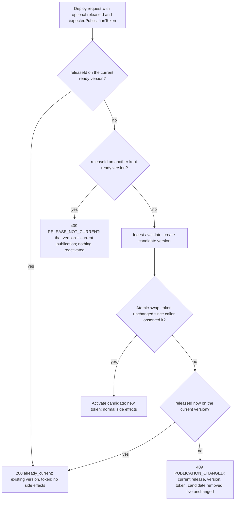
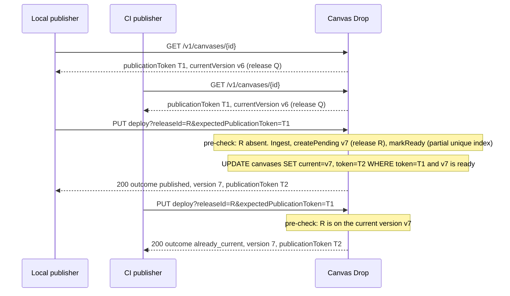
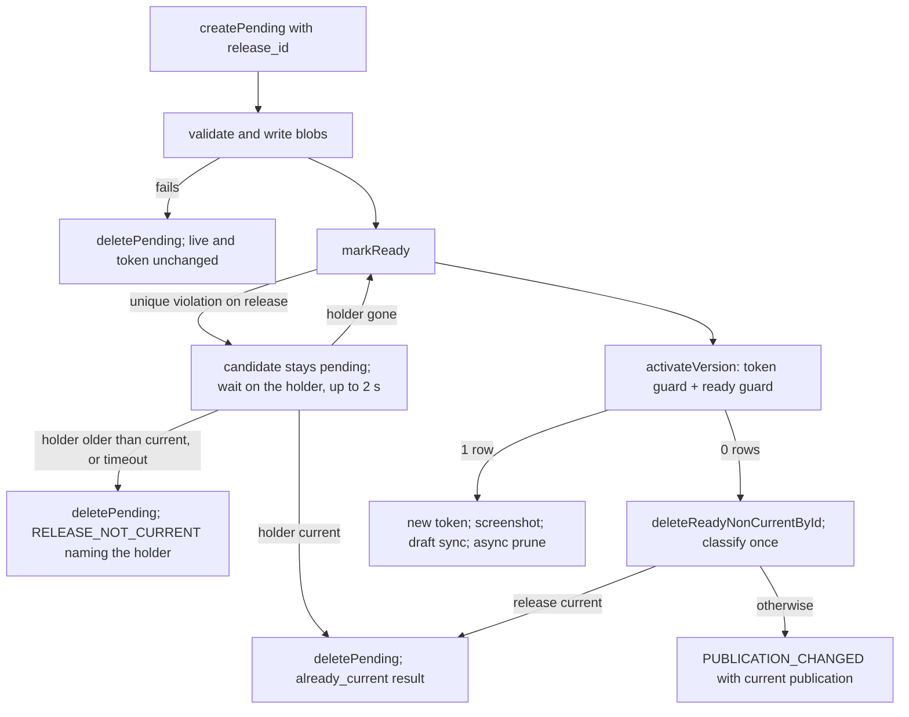
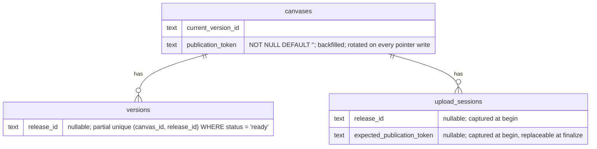

# Deployment Coordination - Plan

## Goal Capsule

- **Objective:** Two independent publishers of one canvas (a local tool that deploys after pushing a commit, and a CI job that builds every commit) can publish the same release without producing a duplicate live version or overwriting a newer publication, and either publisher can tell from Canvas Drop alone whether its release is the one that is live.
- **Means:** A caller-supplied release identity stored on each version (KTD2), a per-canvas publication token rotated by every live-pointer write (KTD1), and one atomic conditional activation on the deploy paths (KTD3), exposed on the keyed Deploy API and the MCP deploy tools (KTD5, KTD9).
- **Product authority:** The Product Contract's R-IDs win on behavior; the Planning Contract's KTDs win on mechanism within those Rs; units override neither. `AGENTS.md` project rules bind every unit: config is the only `process.env` reader, dual-dialect schemas stay in lockstep with generated migrations for both dialects, identity comes only from the server-side auth context, and every owner-facing capability ships with MCP parity. `BUILD_BRIEF.md` §9.5 and §11.4 remain the contract for the existing deploy routes, extended additively.
- **Execution profile:** One autonomous round on one feature branch in the primary checkout (no worktree). One commit per unit in dependency order (U1 to U6), each with `pnpm lint && pnpm typecheck && pnpm test` green on both dialects before the commit. Code review before the PR; the CI matrix green before merge.
- **Stop conditions:** Evidence that a settled decision or a §12.0 hard invariant cannot hold; the partial unique index of KTD2 cannot be expressed for one dialect by drizzle-kit or a hand-written migration that passes both test legs; a CI failure that needs a product decision.
- **Tail ownership:** The pipeline builds, reviews, pushes the branch and opens the PR. Merging waits for the owner's explicit approval. Nothing is deployed to production in this round.
- **Open blockers:** None.

---

## Product Contract

### Summary

Add two optional, backwards-compatible mechanisms to the keyed deploy paths: a release identity that a publisher attaches to a deploy and reads back later, and a publication token that a publisher observes and passes back so a deploy activates only if publication has not changed underneath it. A deploy of a release that is already live returns a successful "already current" result instead of a new version; a stale token or a release that only exists in history returns a distinguishable conflict and leaves the live site untouched. The same fields ride on the MCP deploy and readback tools, and the Deploy API docs gain a two-publisher recipe.

### Problem Frame

A roadmap editor can build and deploy a canvas locally right after it pushes a commit, while a CI job (GitHub Actions today) still builds and deploys every commit as the fallback, including commits made outside the editor. Both publishers can end up building the same commit at the same time. Today the Deploy API treats every deploy as a new version and swaps the live pointer unconditionally (`apps/server/src/deploy/engine.ts`, `commitReadyVersion`), so the second publisher creates a redundant version, repeats the deploy side effects (screenshot capture, draft reconciliation, audit), and, if it finishes later, silently overwrites whatever went live in between, including a human's editor publish or rollback. There is also no way for CI to notice that the local publisher already succeeded: readback (`GET /v1/canvases/{id}`) returns a version id, but nothing ties a version to the commit it was built from.

The platform must stay generic. It does not know which Git commit is newest, and it gains no GitHub integration, build service, webhook, or job queue. Publishers keep the freshness check; Canvas Drop only guarantees that concurrent publication changes cannot trample each other.

### Key Decisions

- **A dedicated per-canvas publication token, not the canvas's general last-modified stamp.** The authoring route already does a compare-and-swap on `updatedAt`, but that value moves on every settings edit, so a title change would fail an unrelated deploy. Governs R6, R7, R8, R9.
- **A release identity appears on at most one kept ready version per canvas.** "Found in history" means present on one of the kept versions; once that version is pruned or deleted the identity may be reused. Governs R4, R5.
- **The expected token is accepted on the deploy paths only.** Rollback, unpublish, editor publish and dashboard deploys stay unconditional but still advance the token (session-settled: user-approved — chosen over also gating rollback and unpublish: the two-publisher scenario does not need a conditional rollback, and it keeps the change smallest). Governs R8, R11.
- **Release identity and the token are exposed through the API and MCP only.** No dashboard change (session-settled: user-approved — chosen over a release label in the Versions tab: no UI unit, and the identity is opaque to humans anyway). Governs R2, R6, R13.
- **Every write of the live pointer advances the token.** The brief names deploy, rollback and unpublish; the editor, dashboard, authoring and purge paths write the same pointer and would otherwise let a publication change slip past a stale token. Governs R7.
- **A conflict at staged finalize keeps the upload session usable.** Re-staging blobs after a reassess would punish the caller for the platform's own conflict signal. Governs R11, R16.
- **"Already current" is a success, conflicts are conflicts.** The already-current result is a `200` with the same result shape plus an outcome marker; the two conflicts are `409` responses with stable codes and the current publication attached. Governs R3, R4, R9.
- **Two-phase check: a cheap pre-check, then the authoritative atomic activation.** The pre-check answers the common cases before any bytes are ingested; only the single conditional pointer swap is trusted for correctness. Governs R8, R12.



### Actors

- A1. **Local publisher** — a tool that builds and deploys right after pushing a commit (the roadmap's Go editor). Derives the release identity itself, reads back before deploying, and deploys with the identity and the observed token.
- A2. **CI fallback publisher** — a job that runs for every commit (GitHub Actions). Reads back to skip a release that is already live, otherwise builds and deploys with the same fields.
- A3. **Human operator** — publishes from the editor, deploys from the dashboard, rolls back or unpublishes. Never sees or supplies a token; their actions still advance it.
- A4. **Canvas Drop** — the arbiter. Stores release identities, owns the token, performs the atomic activation, and reports outcomes. Knows nothing about Git or which release is newest.

### Requirements

**Release identity**

- R1. A deploy request may carry an optional opaque `releaseId`, scoped to the canvas, of 1 to 200 characters with no control characters; Canvas Drop stores it verbatim on the version it creates and never parses it or infers ordering from it.
- R2. Authenticated readback exposes release identity: the keyed `GET /v1/canvases/{id}` and MCP `get_canvas` return the current version's release identity (null when absent or unpublished), and `GET /v1/canvases/{id}/versions` and MCP `list_versions` return each version's release identity and immutable version id.
- R3. When the requested release identity is already on the current, ready version, the deploy succeeds with outcome `already_current` and identifies the existing version (id, number, release identity, current token, file count and byte total) without creating or activating a version, recording a deploy audit event, triggering a screenshot, or touching the draft.
- R4. When the requested release identity is on a kept ready version that is not current, the deploy returns a `RELEASE_NOT_CURRENT` conflict naming that version and the current publication, and reactivates nothing; making it live again goes through the existing rollback route.
- R5. A release identity is present on at most one kept ready version per canvas at any time, including under concurrent requests.

**Publication token**

- R6. Every canvas has an opaque publication token at all times, including before its first publication and after unpublish, and readback (`GET /v1/canvases/{id}`, MCP `get_canvas`) returns it.
- R7. The token changes on every publication change, meaning every write of the live version pointer from any source (deploy by API, staged upload, ZIP, folder, paste, editor publish, authoring publish; rollback; unpublish; authoring revoke; the purge pointer clear), and a token value is not reused in practice (128 bits of randomness per token), so returning to an earlier version yields a token that version never had.
- R8. A deploy may carry an optional `expectedPublicationToken`; the candidate version is activated only if it equals the canvas's token at the instant of activation, and the comparison and the live-pointer swap are one atomic database operation that holds across concurrent requests and processes on both dialects, not an in-memory lock.
- R9. On a token mismatch the live version is unchanged: if the requested release identity is by then on the current version the result is R3's `already_current`; otherwise the deploy returns a `PUBLICATION_CHANGED` conflict carrying the current release identity, version and token, and the candidate version is not left in history.
- R10. The documentation states that both conflicts and `already_current` are reassess signals: the publisher re-checks source freshness and decides, rather than refreshing the token and retrying blindly.

**Surfaces and compatibility**

- R11. Both keyed deploy paths accept the fields: `PUT /v1/canvases/{id}/deploy` on the request, and the staged flow at begin (captured on the upload session) and at finalize, where a finalize-supplied token replaces the captured one and a release identity supplied at both must match or the finalize is rejected as an invalid request; enforcement happens at activation, never only at upload start.
- R12. Before ingesting a ZIP or opening an upload session, a request whose release identity is already current returns R3's result and one whose expected token already mismatches returns R9's conflict; the atomic check at activation remains authoritative for every outcome.
- R13. The MCP tools `deploy_canvas`, `begin_deploy` and `finalize_deploy` accept the same optional inputs and return the same outcomes, `get_canvas` and `list_versions` expose the same fields, and every tool keeps its existing role gate and audit behavior.
- R14. A caller that omits the new fields observes today's behavior, and every response shape is extended additively only.
- R15. Authorization, canvas scoping, content validation, immutable content-addressed storage, version history and the 10-version retention, draft reconciliation, screenshot capture, audit events and rate limiting behave exactly as today for a deploy that activates.
- R16. A conflict at staged finalize leaves the upload handle unconsumed so finalize can be called again until the session expires, and a conflict on the ZIP path leaves no version row behind (blobs are left to the existing garbage collection).
- R17. A retry after a successful activation whose response was lost returns R3's `already_current` for the same release identity and never creates a second version; success is returned only when the current version is ready and carries that identity.
- R18. Schema changes ship as additive migrations for both dialects, and existing canvases receive a token so R6 holds from the first boot after upgrade.

**Documentation**

- R19. The Deploy API page (`docs/site/api/deploy-api.md`) documents both fields, the `already_current` success, both conflicts, exact request and response examples for readback, ZIP deploy and staged finalize, and a "Coordinating two publishers" recipe for a local publisher plus a CI fallback (GitHub Actions as the worked example) that states the boundary: Canvas Drop does not know which commit is newest.
- R20. The MCP page, `llms.txt` source, agent skill page, error tables and `docs/project-status.md` are updated in the same change, and the generated docs module is rebuilt so the CI docs check stays green.
- R21. Migration and compatibility notes (new columns, token backfill, unchanged behavior for existing callers) are recorded for self-hosters alongside the existing upgrade guidance.

### Key Flows

- F1. **CI skips a release the local publisher already shipped**
  - **Trigger:** A2 starts for commit C while or after A1 published release R(C).
  - **Steps:** A2 derives R(C); reads back; the current release identity equals R(C); A2 skips the build. If A2 had already built and deploys R(C) anyway, the deploy returns `already_current`.
  - **Outcome:** One live version, no redundant work or side effects.
  - **Covers:** R2, R3, R12.
- F2. **Two publishers deploy the same release concurrently**
  - **Trigger:** A1 and A2 both deploy R(C) within the same seconds.
  - **Steps:** Both pass the pre-check; both ingest; exactly one activation succeeds; the other detects R(C) on the current version and returns `already_current`, discarding its candidate.
  - **Outcome:** One kept version carries R(C).
  - **Covers:** R3, R5, R8, R9.
- F3. **A newer publication invalidates an older in-flight deploy**
  - **Trigger:** A1 read token T1, then A3 published from the editor (token T2) while A1 was building.
  - **Steps:** A1 deploys R(C) with expected T1; the atomic swap fails; R(C) is not current; `PUBLICATION_CHANGED` returns T2 and the current release; A1 reassesses.
  - **Outcome:** A3's publication stays live.
  - **Covers:** R7, R8, R9, R10.
- F4. **The release exists only in history**
  - **Trigger:** A3 rolled back from R(C) to an older version; A2 re-runs for commit C.
  - **Steps:** The pre-check finds R(C) on a kept version that is not current; `RELEASE_NOT_CURRENT` returns.
  - **Outcome:** Nothing is reactivated; the operator uses rollback if R(C) should be live.
  - **Covers:** R4, R5.
- F5. **First publication**
  - **Trigger:** A never-published canvas.
  - **Steps:** Readback returns the initial token and no release; A1 deploys with it; the swap succeeds; the token changes.
  - **Outcome:** Published, token advanced.
  - **Covers:** R6, R7, R8.
- F6. **Staged upload with a stale token, then recovery**
  - **Trigger:** A1 began an upload with expected T1; publication changed to T2 before finalize.
  - **Steps:** Finalize returns `PUBLICATION_CHANGED`; the handle stays usable; A1 reassesses and, if still appropriate, finalizes again with T2 without re-staging.
  - **Outcome:** Either activation with T2 or an explicit decision not to publish.
  - **Covers:** R11, R16.
- F7. **Lost response and retry**
  - **Trigger:** A1's deploy of R(C) activated but the response never arrived.
  - **Steps:** A1 retries the same deploy; the pre-check finds R(C) current; `already_current` returns with the version and the new token.
  - **Outcome:** No second version.
  - **Covers:** R3, R17.

### Acceptance Examples

- AE1. **Covers R3, R5.** Given release R was deployed and is current, when the same release is deployed again, then the response is `200` with outcome `already_current`, the version count is unchanged, and no new deploy audit event exists.
- AE2. **Covers R5, R8, R9.** Given a canvas, when two separate requests deploy release R concurrently on each dialect, then exactly one ready version carries R, one response is a normal success and the other is `already_current`, and no ready-but-never-current version remains.
- AE3. **Covers R2, R3.** Given the local publisher's deploy of R succeeded while CI was still building, when CI reads back, then the current release identity is R; when CI deploys R anyway, then the result is `already_current`.
- AE4. **Covers R7, R8, R9.** Given a publisher observed token T1 and an editor publish then occurred, when the publisher deploys with expected T1, then the response is `409 PUBLICATION_CHANGED` carrying the current release, version and token, the live version is the editor's, and no new ready version exists.
- AE5. **Covers R4.** Given release R is on a kept version that is not current, when R is deployed, then the response is `409 RELEASE_NOT_CURRENT` naming that version, and the live pointer is unchanged.
- AE6. **Covers R6, R7.** Given token T1 was observed while version 3 was live, when a rollback to version 2 and then a rollback back to version 3 occur, then the token differs from T1 at both points and a deploy with T1 is refused; when the canvas is unpublished, then readback still returns a token and a deploy with it succeeds.
- AE7. **Covers R6, R8.** Given a never-published canvas, when its initial token is read back and used as the expected token, then the deploy activates and readback shows a different token.
- AE8. **Covers R15, R16.** Given a live version, when a ZIP deploy fails validation or a staged finalize is missing a blob, then the live version and the token are unchanged and no ready version was added.
- AE9. **Covers R17.** Given a deploy of R activated, when the same request is repeated, then the result is `already_current` and only one version carries R.
- AE10. **Covers R15.** Given canvases A and B, when A's key deploys to B or supplies B's token, then the deploy is refused as today (`403` for a foreign key; a foreign token is a plain mismatch) and B is unchanged; when no or an invalid key is sent, then `401`.
- AE11. **Covers R14, R7.** Given a caller that sends no new fields, when it deploys, rolls back and unpublishes, then every response matches today's shape with only additive fields, and each action advances the token.
- AE12. **Covers R11.** Given a staged upload begun with release R and expected token T1, when publication changes and finalize is called with expected T2, then the finalize activates with T2; when a different release identity is supplied at finalize, then the finalize is rejected as an invalid request.
- AE13. **Covers R13.** Given an editor over MCP, when `deploy_canvas`, `begin_deploy`/`finalize_deploy`, `get_canvas` and `list_versions` are used with and without the new fields, then the outcomes and fields match the HTTP routes and the role and audit behavior is unchanged.
- AE14. **Covers R18.** Given a database from the previous release with published and unpublished canvases, when migrations run at boot, then every canvas has a token and existing versions read back with a null release identity.

### Scope Boundaries

- Conditional rollback and unpublish (an expected token on those routes) — deferred; they advance the token but stay unconditional.
- Showing release identity or the token in the dashboard — deferred; API and MCP only.
- GitHub integration, webhooks, a build service, a job queue, a CLI — outside this product's identity, as the brief states.
- Any notion of release ordering or commit freshness — the publisher's responsibility; the token only protects against concurrent publication changes.
- Reactivating a historical release through the deploy routes — rollback remains the mechanism.
- Per-file draft conflicts and the editor's stale-draft notice — already exist and are untouched.

#### Deferred to Follow-Up Work

- Exposing the publication token on the dashboard's management HTTP view for a future conditional editor publish.

### Dependencies / Assumptions

- The repository avoids cross-dialect transactions and relies on single-statement conditional updates with correlated subqueries (`setCurrentVersionIfReady`, `pruneBeyond`, `claimForFinalize`); the atomic activation in R8 fits that pattern (KTD3).
- The deploy engine's caller-owned activation hook (`DeployCommitOptions.activateVersion`) and the staged finalize's lease and consumed markers are the existing seams the mechanisms attach to; the authoring route's `updateSettingsAtomic` compare-and-swap is prior art for a conditional activation.
- The production database persists across deploys, so both new columns arrive by additive migration with a token backfill; no data is rewritten destructively.
- The Deploy API key attributes every write to the canvas owner; the new fields change no attribution.

### Sources / Research

- `apps/server/src/deploy/engine.ts` — `commitReadyVersion` (mark ready, swap, draft sync, screenshot, prune) and the `activateVersion` hook.
- `apps/server/src/upload/service.ts` — begin/stage/finalize, lease, `markConsumed` before commit.
- `apps/server/src/db/repositories/canvases.ts` — `setCurrentVersion`, `setCurrentVersionIfReady`, `unpublish`, `revoke`, `clearCurrentVersion`, `updateSettingsAtomic`, the purge update (every live-pointer writer).
- `apps/server/src/db/repositories/versions.ts` and `packages/shared/src/db/schema.sqlite.ts` / `schema.pg.ts` — `versions`, `canvases` and `upload_sessions` columns; no release or token column exists today; `packages/shared/src/db/columns.ts` holds the per-dialect column helpers.
- `apps/server/src/routes/deploy-api.ts`, `apps/server/src/routes/deploy-common.ts`, `apps/server/src/deploy/errors.ts` — keyed routes, error status mapping, stable codes.
- `apps/server/src/mcp/server.ts`, `apps/server/src/mcp/tool-kit.ts`, `apps/server/src/mcp/tool-roles.ts` — `deploy_canvas`, `begin_deploy`, `finalize_deploy`, `get_canvas`, `list_versions`, `rollback_canvas`, `unpublish_canvas`, `failDeploy`, `canvasView`.
- `apps/server/src/routes/canvas-authoring.ts` — conditional activation via `updateSettingsAtomic` (prior art).
- `apps/server/src/draft/service.ts` — editor `publish` swaps the pointer directly.
- `apps/server/src/db/unique-violation.ts` and `docs/solutions/2026-06-17-dialect-unique-violation-catch.md` — dialect-aware unique-violation detection (pglite nests the driver error under `.cause`).
- `docs/solutions/2026-06-13-dual-dialect-drizzle-seam.md` — schema lockstep, parity test, and the "generate migrations for both dialects" gotcha.
- `drizzle/pg/0032_canvas_discoverability.sql` — precedent for a hand-added backfill `UPDATE` inside a generated migration; `drizzle/sqlite/0039_admin-purge-state.sql` and `drizzle/pg/0039_admin-purge-state.sql` — the plain `ADD COLUMN` shape; `0042_primitive-policies` is the latest migration on both dialects.
- `apps/server/src/db/testing.ts` — `makeTestDb` / `DIALECTS`; PGlite is single-connection and serializes statements.
- `apps/server/src/ops/backup.ts` (`restoreBackup`, `insertAll`), `apps/server/src/db/migrate.ts` (`runMigrations`), `apps/server/src/canvas/blob-gc.ts` (the live set built from ready versions, the draft and `listActiveByCanvas`), `apps/server/src/db/migrate-populated.test.ts` (SQLite-only today), `apps/server/src/integration/real-infra.test.ts` (`withIsolatedDatabase` on node-postgres, gated on `CANVAS_DROP_TEST_DATABASE_URL`, which the CI postgres leg sets).
- `apps/server/src/deploy/engine.test.ts` — the existing `Promise.all` concurrent-deploy test to mirror.
- `docs/site/api/deploy-api.md`, `docs/site/agents/mcp.md`, `docs/site/agents/llms.md`, `docs/site/agents/skill.md`, `skill/canvas-drop/SKILL.md`, `docs/site/self-hosting/install.md` — doc surfaces; `scripts/build-docs.mjs` regenerates `apps/server/src/docs/generated-content.ts`, which CI asserts is current.
- `docs/solutions/2026-06-13-purge-vs-deploy-race.md`, `docs/solutions/2026-06-17-agent-deploy-readback-and-endpoint-discovery.md` — prior learnings on deploy races and agent readback.

---

## Planning Contract

**Product Contract preservation:** restructured, no scope change: the Outstanding Questions section (five items, all Deferred to Planning) is resolved by KTD1, KTD5, KTD6, KTD7 and the Assumptions below and was removed; a "Deferred to Follow-Up Work" subsection was added under Scope Boundaries. Changed: R7 — "never reused" is stated as the 128-bit randomness guarantee it rests on (document review); no other R text changed. No R, A, F or AE ID changed.

### Key Technical Decisions

- KTD1. **Publication token as a `canvases.publication_token` column, NOT NULL, 32 lowercase hex characters (16 random bytes) minted app-side, rotated inside every live-pointer write.** Both schemas add `publication_token text NOT NULL DEFAULT ''`; the migration for each dialect backfills every existing row with a per-row random value in the same file (SQLite `lower(hex(randomblob(16)))`, Postgres `replace(gen_random_uuid()::text, '-', '')`, following the hand-added `UPDATE` precedent in `drizzle/pg/0032_canvas_discoverability.sql`; `gen_random_uuid()` is core from PostgreSQL 13, and CI runs 16). Every assignment of `currentVersionId` in the canvases repository goes through one `livePointerSet(fields)` helper that always spreads a fresh token, so `setCurrentVersion`, `setCurrentVersionIfReady`, `unpublish`, `revoke`, `clearCurrentVersion`, the purge update and `updateSettingsAtomic` (when `currentVersionId` is supplied) rotate by construction, and a source-scan test fails on any `.set(` block in `canvases.ts` that assigns `currentVersionId` outside the helper. `create()` mints a token. Rows written by other paths carry the `''` default until repaired: `mintMissingPublicationTokens()` (an idempotent `UPDATE … WHERE publication_token = ''` per dialect) runs inside `runMigrations` after the migrations and again at the end of `restoreBackup`, so a pre-0043 backup restored onto upgraded code satisfies R6 before it serves. A 128-bit random token makes a repeat practically impossible; the compare-and-swap compares only the current value by design and no historical uniqueness index is kept. Rejected: deriving the token from `updatedAt` (settings edits would cause spurious deploy conflicts) and a per-canvas monotonic counter (works, but a random value keeps the token opaque so callers cannot infer ordering). Governs R6, R7.
- KTD2. **Release identity as a nullable `versions.release_id` column set at `createPending`, protected by a partial unique index `versions_canvas_release_ready_uq` on `(canvas_id, release_id) WHERE status = 'ready' AND release_id IS NOT NULL` in both dialects.** The database enforces R5 under every interleaving: the loser of a same-release race fails at `markReady` with a unique violation, detected through `isUniqueViolation` with a new `RELEASE_READY_UNIQUE` target in `apps/server/src/db/unique-violation.ts`. Drizzle 0.45 supports `.where()` on `uniqueIndex` for both `pg-core` and `sqlite-core`, and drizzle-kit 0.31.10 emits the `WHERE` clause for both dialects (verified in its bundled create-index convertors); write the predicate with inline SQL literals exactly like the existing CHECK constraints (an `sql` template reading `${t.status} = 'ready' and ${t.releaseId} is not null`), never an interpolated JS value, which the serializer would render as a bind placeholder inside `CREATE INDEX`. The violation surfaces as `UNIQUE constraint failed: versions.canvas_id, versions.release_id` on better-sqlite3 and as code `23505` with constraint `versions_canvas_release_ready_uq` on Postgres and PGlite (verified). Rejected: a `NOT EXISTS` predicate alone (write skew under Postgres READ COMMITTED lets two concurrent statements both pass) and a unique index over pending rows too (a crashed pending row would block the release for the one-hour pending TTL). Governs R1, R5.
- KTD3. **Atomic conditional activation as one UPDATE on `canvases`: `activateVersion(canvasId, versionId, { expectedToken? })` sets `current_version_id`, `revoked_at = null`, a fresh `publication_token` and `updated_at` WHERE the id matches, purge has not started, the candidate is a ready version of this canvas (the existing `setCurrentVersionIfReady` EXISTS guard), and, when `expectedToken` is supplied, `publication_token = expectedToken`; it returns the new token or null.** An absent `expectedToken` omits the token guard, so the swap is unconditional (today's behavior for every caller that sends no token). It replaces the unconditional swap inside `commitReadyVersion`; the existing caller-owned `activateVersion` hook stays for the authoring route, whose `updateSettingsAtomic` rotates the token per KTD1, and after such a hook the engine re-reads the canvas to obtain the token for the result (the hook signature stays `Promise<void>`). On null the engine deletes the candidate through a status-guarded `deleteReadyNonCurrentById` (never the live version), classifies per KTD4, and throws a `PublicationConflictError`. Rejected: a transaction spanning `markReady` and the swap (the two Drizzle transaction APIs differ across dialects and the repository convention avoids them). Governs R8, R9, R16.
- KTD4. **One classifier, `classifyPublication(canvasId, releaseId)` in `apps/server/src/deploy/publication.ts`, feeds the pre-check, the unique-violation path and the failed-activation path, and one bounded wait resolves an in-flight holder.** The classifier reads the canvas and the kept ready version carrying the release (the holder) and returns `already_current` (the holder is the current version), `release_not_current` (the holder is another ready version, returned with it), or `absent`. After a `markReady` unique violation the candidate stays pending and the engine waits, polling up to 20 times at 100 ms behind an injectable clock: holder current → delete the pending candidate and return `already_current`; holder gone (the winner withdrew after its own activation failed) → retry `markReady` and continue the commit tail; holder ready and numbered above the current version (an in-flight winner) → keep waiting; holder ready and numbered below the current version (a historical release) → delete the candidate and throw `RELEASE_NOT_CURRENT` naming it. On timeout the candidate is deleted and `RELEASE_NOT_CURRENT` names the holder, which a crashed winner leaves behind as a ready row the caller can roll back to. The pre-check applies the same wait when it finds an in-flight holder. After a failed activation the classifier runs once: release on the current version → `already_current`; otherwise `PUBLICATION_CHANGED`. `RELEASE_NOT_CURRENT` is never emitted without a ready row to name, and `already_current` is always built from the current version row, so success is only reported for a ready, current version. Governs R3, R4, R12, R17.
- KTD5. **API shape.** `PUT /v1/canvases/{id}/deploy` reads `releaseId` and `expectedPublicationToken` from the query string (the body stays the raw ZIP). `POST /v1/canvases/{id}/uploads` accepts them as optional JSON fields stored on `upload_sessions.release_id` and `upload_sessions.expected_publication_token`; `POST …/finalize` accepts an optional JSON body with the same fields, where a finalize token replaces the stored one and a finalize `releaseId` must equal the stored one (`RELEASE_ID_MISMATCH`, 400). `DeployResult` gains `versionId`, `releaseId` (nullable), `publicationToken` and `outcome: "published" | "already_current"`. `GET /v1/canvases/{id}` gains `publicationToken` and `currentVersion: { id, number, releaseId, createdAt } | null`; `GET …/versions` entries gain `id` and `releaseId`. New `DeployErrorCode`s: `PUBLICATION_CHANGED` (409), `RELEASE_NOT_CURRENT` (409), `INVALID_RELEASE_ID` (400), `RELEASE_ID_MISMATCH` (400); conflict bodies carry `current: { publicationToken, versionId, version, releaseId }` and `RELEASE_NOT_CURRENT` adds `release: { versionId, version }`. `deployErrorStatus` maps the new codes, and `deployResponse` routes them through it while keeping today's blanket 400 for every other code. `deployEndpoints` gains `status: GET {apiBase}` so agents receive the readback URL. Exact examples are in the Appendix. Governs R1, R2, R3, R4, R9, R11, R13, R14.
- KTD6. **The pre-check runs after key auth and the deploy throttle and before ZIP parsing or session creation, so an `already_current` short-circuit consumes a deploy rate-limit token like any attempt.** The recipe tells CI to decide with the unthrottled readback first. Governs R12, R15.
- KTD7. **Non-activation outcomes have no side effects.** `already_current` and both conflicts record no `deploy` audit event, enqueue no screenshot, leave the draft alone, run no prune, and log at info; the candidate's blobs stay for the existing garbage collection. The `deploy` audit event is written by the callers, not the engine (`deployResponse`, the finalize route, `deploy_canvas`, `finalize_deploy`); each records it only when the result's `outcome` is `published`. Governs R3, R9, R15, R16.
- KTD8. **The editor, dashboard, authoring and purge paths advance the token by construction.** Rotation lives inside the repository writers (KTD1), so `draft/service.ts` publish, the management deploy routes, the authoring route, `revoke`, `unpublish`, `clearCurrentVersion` and purge need no route-level change; repository tests pin each writer. Governs R7.
- KTD9. **MCP parity without new tools.** `deploy_canvas`, `begin_deploy` and `finalize_deploy` gain optional `releaseId` and `expectedPublicationToken` inputs and return the extended `DeployResult` (begin returns the `already_current` result instead of a handle when the pre-check hits); `failDeploy` renders a `PublicationConflictError` as `PUBLICATION_CHANGED: …` or `RELEASE_NOT_CURRENT: …` with the conflict body serialized as JSON after the message; `get_canvas` adds `publicationToken` and `currentVersion`; `list_versions` adds `id` and `releaseId`. No tool is added, so `tool-roles.ts` and the inventory count (49) are unchanged. Instantiates the API-and-MCP-only Key Decision (session-settled: user-approved — chosen over a dashboard label: no UI unit). Governs R2, R6, R13.
- KTD10. **Rollback and unpublish keep their unconditional signatures.** Their repository writers rotate the token (KTD1), which is all the two-publisher scenario needs (session-settled: user-approved — chosen over accepting an expected token on rollback and unpublish: not needed for the scenario and it keeps the change smallest). Governs R8, R11.
- KTD11. **Staged finalize: pre-check before claiming, keep the consume-before-commit order, un-consume only on a publication conflict, and answer a repeated finalize of a live release with `already_current`.** Finalize first merges the coordination fields and runs the KTD4 classifier plus the token comparison before `claimForFinalize`, so the common stale-token case returns `already_current` or `PUBLICATION_CHANGED` with no version number, lease or consume churn; the atomic activation stays authoritative for every outcome. Today `markConsumed` runs before `commitReadyVersion` so a transient commit failure can never double-publish; that order is kept. A conflict raised by the atomic activation is detected before the pointer moves, so the service clears `consumed_at` and the lease (new `unconsume(id)` in the upload-sessions repository) and rethrows; every other post-consume failure stays terminal as today. A finalize on an already-consumed session whose captured release identity is on the current ready version returns `already_current` (R17 on the staged path); otherwise `UPLOAD_ALREADY_FINALIZED` as today. The blob-GC live set (`listActiveByCanvas`) also includes sessions consumed within the last `FINALIZE_LEASE_MS`, so a candidate deleted after a conflict never leaves the staged blobs uncovered before `unconsume` lands. Governs R11, R16, R17.
- KTD12. **Documentation is part of the change.** `docs/site/api/deploy-api.md` gains the fields, outcomes, error rows, exact examples and a "Coordinate two publishers" recipe; `docs/site/agents/mcp.md`, `docs/site/agents/llms.md`, `docs/site/agents/skill.md` and `skill/canvas-drop/SKILL.md` gain the tool inputs and the reassess rule; `docs/site/self-hosting/install.md` gains an upgrade note (migration 0043, token backfill); `docs/project-status.md`, `AGENTS.md` and `BUILD_BRIEF.md` §11.4 record the shipped capability; `pnpm docs:build` regenerates `apps/server/src/docs/generated-content.ts`. Governs R10, R19, R20, R21.

### High-Level Technical Design

Two publishers and the arbiter in the common case (F1/F2):



The engine commit tail with every failure branch (KTD3, KTD4, KTD7):



Data model delta (KTD1, KTD2, KTD5):



### Assumptions

Un-validated agent bets made without a synchronous user; each is cheap to reverse during review.

- The ZIP route carries the two fields as query parameters rather than custom headers; the token is a compare-and-swap value, not a secret, so appearing in access logs is acceptable.
- `releaseId` validation is "1 to 200 characters, no Unicode control characters"; the token is 32 lowercase hex characters (a random 16-byte value).
- Twenty polls at 100 ms (2 s) cover any live winner's gap between `markReady` and its swap (two sequential statements); only a crashed winner exceeds it.
- The PGlite test leg serializes statements, so the in-process concurrent tests prove interleaving and classification; snapshot-level concurrency is proven by the networked-Postgres scenario in U2, which runs in the CI postgres leg.
- The dashboard's management HTTP view does not gain the token or release fields; the settled API-and-MCP-only decision is read as covering it.
- Conflicts are logged at info and not audited.
- A finalize request with no JSON body behaves exactly as today.
- Existing tests that assert the full `DeployResult` shape with strict equality are updated to the additive shape rather than relaxed to partial matching.

### Deferred to Implementation

- Exact zod schemas for the query parameters and JSON bodies.
- Whether `deleteReadyNonCurrent` (by number) can serve the candidate cleanup or a `deleteReadyNonCurrentById` variant is cleaner.
- How the KTD4 wait injects its clock for deterministic tests (the upload service already injects `now`).

### System-Wide Impact

- **Every live-pointer writer changes shape.** `canvases.ts` writers rotate the token through the single `livePointerSet` helper (KTD1); the management routes, draft publish, authoring route and purge inherit it with no route change (KTD8). A future writer that assigns `currentVersionId` outside the helper fails the source-scan test, so R7 cannot degrade silently.
- **Schema and migrations.** Three additive columns and one partial unique index across both dialects (migration 0043); the parity test (`packages/shared/src/db/schema.test.ts`) and the populated-migration test cover them. Production applies the migration at boot with the token backfill; no manual step.
- **Deploy API contract.** Every response is extended additively (R14); two new 409 codes and two new 400 codes join the stable error set and the docs tables.
- **MCP surface.** Three tools gain optional inputs, two gain fields; no new tools, so inventory and role-matrix tests are unchanged.
- **Realtime and serving.** Untouched: the serve path resolves `current_version_id` as before; the realtime hub's revalidation on rollback and unpublish is unchanged.
- **Rate limiting.** Unchanged budget; pre-check short-circuits count as attempts (KTD6).

### Risks & Mitigations

- **A restored pre-upgrade backup carries empty tokens.** The restore CLI inserts rows verbatim, so every canvas would read back `''`. Mitigation: the idempotent repair in KTD1 runs at boot and at the end of restore, with a restore-fixture test in U1.
- **Wrong conflict in the winner's mark-ready-to-swap window.** A loser or a pre-check could see the release on a ready version that is milliseconds from becoming current. Mitigation: the KTD4 wait on every path that finds an in-flight holder, with the holder-gone branch letting the loser finish its own commit; only a winner that crashes in that window leaves a ready-but-never-current row, which the conflict names and keep-10 pruning removes.
- **Existing tests assert exact result shapes.** Mitigation: the additive fields are added to the expectations in the same unit that introduces them.
- **PGlite cannot reproduce snapshot races.** Mitigation: correctness rests on the unique index and the single-statement CAS, both dialect-native, and U2 adds a multi-connection scenario against the real Postgres in the CI postgres leg.
- **Callers on the ZIP route pass an `expectedPublicationToken` copied from a different canvas.** It is a plain mismatch (`PUBLICATION_CHANGED`), never a cross-canvas effect; the key-to-canvas check runs first.

### Documentation / Operational Notes

- Migration 0043 is additive and runs at boot; the token backfill is a single `UPDATE` per dialect, and the same repair runs after every boot and restore for rows still holding the empty default. PostgreSQL 13 or newer is required for `gen_random_uuid()` (CI runs 16). Self-hosters need no manual step; the usual pre-deploy backup applies.
- The Deploy API page gains a "Coordinate two publishers" section with the readback-first recipe, the reassess rule (R10) and the GitHub Actions example; the same rule is stated in the MCP page and the agent skill.
- A `docs/solutions/` note records the partial-unique-index + single-statement CAS pattern and the mark-ready race window for future features.

---

## Implementation Units

### U1. Data layer: columns, migrations, token rotation, conditional activation

- **Goal:** Persist the publication token and release identity on both dialects, rotate the token in every live-pointer writer, and provide the atomic conditional activation and release lookups the engine needs.
- **Requirements:** R5, R6, R7, R8, R18; KTD1, KTD2, KTD3; AE6, AE14.
- **Dependencies:** none.
- **Files:** `packages/shared/src/db/schema.sqlite.ts`, `packages/shared/src/db/schema.pg.ts`, `packages/shared/src/db/types.ts` (only if a type needs widening), `drizzle/sqlite/0043_deployment-coordination.sql` and `drizzle/sqlite/meta/*`, `drizzle/pg/0043_deployment-coordination.sql` and `drizzle/pg/meta/*`, `apps/server/src/db/repositories/canvases.ts`, `apps/server/src/db/repositories/canvases.test.ts`, `apps/server/src/db/repositories/versions.ts`, `apps/server/src/db/repositories/versions.test.ts`, `apps/server/src/db/repositories/upload-sessions.ts`, `apps/server/src/db/repositories/upload-sessions.test.ts`, `apps/server/src/db/unique-violation.ts`, `apps/server/src/db/unique-violation.test.ts`, `apps/server/src/db/migrate-populated.test.ts`, `apps/server/src/db/migrate.ts`, `apps/server/src/ops/backup.ts`, the existing ops backup/restore round-trip test in `apps/server/src/ops/`, `apps/server/src/canvas/blob-gc.ts`, `apps/server/src/canvas/blob-gc.test.ts`.
- **Approach:**
  1. Add the three columns and the partial unique index to both schemas per KTD1 and KTD2 (predicate written with inline SQL literals), then generate one migration per dialect (`--name deployment-coordination`), confirm both files carry the `WHERE` clause, and hand-add the backfill `UPDATE` to each SQL file.
  2. Canvases repository: add `mintPublicationToken()` and the `livePointerSet(fields)` helper and route every `currentVersionId` assignment through it (KTD1); set a token in `create()`; add `activateVersion(...)` per KTD3 returning the new token or null; keep `setCurrentVersion` and `setCurrentVersionIfReady` as thin wrappers over the same statement so the ready guard and rotation exist once; add `mintMissingPublicationTokens()`, call it inside `runMigrations` after the migrations apply and at the end of `restoreBackup` after the rows are inserted.
  3. Versions repository: `createPending` accepts an optional `releaseId`; add `findReadyByRelease(canvasId, releaseId)` and `deleteReadyNonCurrentById(canvasId, id)` (status-guarded, live-pointer excluded inside the DELETE like `deleteReadyNonCurrent`).
  4. Upload-sessions repository: `create` accepts optional `releaseId` and `expectedPublicationToken`; add `unconsume(id)` clearing `consumed_at` and `finalizing_at`; `listActiveByCanvas` also returns sessions consumed within the last `FINALIZE_LEASE_MS` so the blob-GC live set covers a reusable handle (KTD11).
  5. Add `RELEASE_READY_UNIQUE` to `unique-violation.ts`.
- **Patterns to follow:** `setCurrentVersionIfReady` and `pruneBeyond` (correlated-subquery guards inside one statement); `SLUG_UNIQUE` in `unique-violation.ts`; the `0032` migration for a hand-added backfill; `docs/solutions/2026-06-13-dual-dialect-drizzle-seam.md`.
- **Test scenarios:**
  - Covers AE14. On each dialect, `migrate-populated.test.ts` seeds canvases before the new migration and asserts every row has a distinct 32-character token afterwards and every version reads back with `releaseId` null; the harness gains a PGlite phase (a fresh instance migrated with the pre-0043 subset of `drizzle/pg`, then the full folder) because today it is SQLite-only.
  - Restore repair: a backup fixture taken before migration 0043 restored through `restoreBackup` onto a migrated database yields distinct 32-character tokens on every canvas; `mintMissingPublicationTokens()` on a database with no empty tokens changes nothing.
  - Source scan: a test reads `canvases.ts` and fails if any `.set(` block assigns `currentVersionId` outside `livePointerSet`.
  - GC live set: a session consumed 10 s ago is still returned by `listActiveByCanvas`; one consumed longer than `FINALIZE_LEASE_MS` ago is not; the blob GC keeps a recently consumed session's staged blobs.
  - Parity: `schema.test.ts` passes with the new columns on both dialects.
  - `create()` mints a token; two canvases never share one.
  - Each writer rotates: `setCurrentVersion`, `setCurrentVersionIfReady`, `unpublish`, `revoke`, `clearCurrentVersion`, the purge update, and `updateSettingsAtomic` with `currentVersionId` each leave a token different from before; `updateSettingsAtomic` without `currentVersionId` leaves it unchanged.
  - Covers AE6. Pointer A → B → A yields three distinct tokens and never restores the first.
  - `activateVersion` with the matching token swaps the pointer, clears `revokedAt`, returns a new token; with a stale token returns null and changes nothing; with no expected token swaps unconditionally; with a pending or foreign-canvas candidate returns null; on a purged canvas returns null.
  - Partial unique index: inserting two ready versions with the same release on one canvas throws and `isUniqueViolation(err, RELEASE_READY_UNIQUE)` is true on both dialects; a pending plus a ready row with the same release coexist; the same release on two canvases coexists; many ready rows with null release coexist.
  - `findReadyByRelease` returns the ready row only, never a pending one; `deleteReadyNonCurrentById` refuses the live version and deletes a non-current ready row.
  - `unconsume` clears both markers; upload-session `create` round-trips the two new fields.
- **Verification:** both migrations exist with meta snapshots and journals updated; `pnpm test` green on both dialects; the generated SQL contains the partial index `WHERE` clause on both dialects.

### U2. Deploy engine: release-aware commit, conditional activation, conflict classification

- **Goal:** Make `engine.deploy()` and `commitReadyVersion` honor a release identity and an expected token, return the extended result, and turn every non-activation outcome into `already_current` or a typed conflict with no side effects.
- **Requirements:** R1, R3, R4, R5, R8, R9, R12, R15, R16, R17; KTD3, KTD4, KTD6, KTD7; F2, F3, F4, F5, F7; AE1, AE2, AE4, AE5, AE7, AE8, AE9.
- **Dependencies:** U1.
- **Files:** `apps/server/src/deploy/engine.ts`, `apps/server/src/deploy/engine.test.ts`, `apps/server/src/deploy/errors.ts`, `apps/server/src/deploy/publication.ts` (new), `apps/server/src/deploy/publication.test.ts` (new), `apps/server/src/integration/real-infra.test.ts`.
- **Approach:**
  1. `errors.ts`: add the four codes from KTD5 and a `PublicationConflictError extends DeployError` carrying `current` and optional `release` (mirror `DraftConflictError`).
  2. `publication.ts`: `validateReleaseId`, `classifyPublication`, the KTD4 wait (`awaitHolder`, behind an injectable clock), and a `currentPublication(canvas)` view builder used by every response.
  3. `engine.deploy(canvas, source, entries, actorId, options)` gains `options.coordination: { releaseId?, expectedPublicationToken? }`; run the pre-check first (with the KTD4 wait when the holder is in flight) and return an `already_current` result or throw the conflict before creating a version.
  4. `createVersionWithRetry` passes `releaseId` into `createPending`.
  5. `commitReadyVersion`: wrap `markReady` to catch `RELEASE_READY_UNIQUE` and run the KTD4 wait with the candidate still pending (holder current → delete the pending row and return `already_current`; holder gone → retry `markReady`; holder older than current or timeout → delete the pending row and throw `RELEASE_NOT_CURRENT` naming the holder); replace the unconditional swap with `activateVersion` (KTD3) unless a caller-owned hook is supplied, re-reading the canvas for the token after a hook; on null delete the candidate, classify once, and return `already_current` or throw `PUBLICATION_CHANGED`; only after a successful swap run screenshot, draft sync and prune.
  6. `DeployResult` gains `versionId`, `releaseId`, `publicationToken`, `outcome`.
- **Patterns to follow:** the existing failure path in `deploy()` (pending cleanup, live untouched); `DraftConflictError` for a typed conflict; the `Promise.all` concurrent test in `engine.test.ts`.
- **Test scenarios (each on both dialects):**
  - Covers AE1. Deploy release R, deploy R again: the second returns `outcome: "already_current"` with the first version's id and number, only one ready version exists, and `versions.createPending` was not called again.
  - Covers AE2 / F2. `Promise.all` of two deploys with release R: exactly one ready version carries R, one result is `published`, the other `already_current`, and no ready-but-never-current row remains.
  - Covers AE4 / F3. Read token T1, publish through `setCurrentVersion` (simulating the editor), deploy with expected T1: `PublicationConflictError` with code `PUBLICATION_CHANGED`, `current` names the editor's version and the new token, the live pointer is unchanged, the candidate row is gone.
  - Covers AE5 / F4. Deploy R as v1 and S as v2, point the canvas back at v1 with `setCurrentVersionIfReady`, then deploy S again: `RELEASE_NOT_CURRENT` naming v2, pointer still v1.
  - Covers AE7 / F5. Never-published canvas: deploy with its initial token succeeds, returns `published`, and the token in the result differs from the initial one.
  - Covers AE8. A zip-slip entry or an oversized file with an expected token: the error is unchanged, the token and pointer are unchanged.
  - Covers AE9 / F7. Deploy R with token T0 succeeds; repeat the identical call with T0: `already_current` (the release check precedes the token check).
  - Deploy with no coordination options: result has `outcome: "published"`, a non-null `publicationToken`, `releaseId` null; behavior otherwise identical to today (existing tests updated for the additive fields).
  - `validateReleaseId` rejects empty, 201-character, and control-character values with `INVALID_RELEASE_ID` before any version row exists; accepts a 200-character printable value.
  - Non-activation outcomes have no engine side effects: with a spy on `screenshots.enqueue` and `drafts.markStale`/`resetToBase`, `already_current` and both conflicts call neither (the audit gate is proven in U4 and U5, where the audit calls live).
  - KTD4 wait, with an injected clock: a holder that becomes current during the wait yields `already_current`; a holder that disappears mid-wait makes the loser retry `markReady` and publish its own candidate; a holder older than the current version yields `RELEASE_NOT_CURRENT` at once; a holder that stays ready-not-current past 2 s yields `RELEASE_NOT_CURRENT` naming it, and no pending row remains.
  - Pre-check wait: with the release on a ready version newer than the current one, the pre-check waits and returns `already_current` once the holder becomes current.
  - Real Postgres (gated on `CANVAS_DROP_TEST_DATABASE_URL`, the CI postgres leg, in `real-infra.test.ts`): two node-postgres clients on one isolated database deploy release R concurrently; exactly one ready version carries R, the other request returns `already_current`, and a stale-token deploy from a third client returns `PUBLICATION_CHANGED` with the live pointer unchanged.
  - Caller-owned `activateVersion` hook still runs (the authoring path) and the result's token equals the canvas's token afterwards.
- **Verification:** `pnpm test` green on both dialects; the engine has one pointer-swap call site.

### U3. Upload service: capture at begin, enforce at finalize

- **Goal:** Carry the release identity and expected token through the staged flow, short-circuit at begin when possible, enforce at finalize, and keep the handle usable after a conflict.
- **Requirements:** R11, R12, R16, R17; KTD11; F6; AE12.
- **Dependencies:** U1, U2.
- **Files:** `apps/server/src/upload/service.ts`, `apps/server/src/upload/service.test.ts`.
- **Approach:**
  1. `begin(canvas, actorId, input, coordination?)`: validate `releaseId`; run the pre-check; return the `already_current` `DeployResult` instead of opening a session, or throw `PUBLICATION_CHANGED` early; otherwise store both fields on the session.
  2. `finalize(uploadId, callerId, canvasId, coordination?)`: merge finalize-supplied values over the session's (token replaces; release must match or `RELEASE_ID_MISMATCH`); before `claimForFinalize`, run the KTD4 classifier and the token comparison and return `already_current` or throw `PUBLICATION_CHANGED` with no state change (KTD11); when the session is already consumed and its release identity is on the current ready version, return `already_current` instead of `UPLOAD_ALREADY_FINALIZED`; otherwise claim, consume, create the pending version with the release id, and pass the merged coordination into `engine.commitReadyVersion` (a new `commitOptions.coordination`).
  3. On `PublicationConflictError` after `markConsumed`: `unconsume` the session, release the lease, rethrow (KTD11). Every other failure keeps today's handling.
- **Patterns to follow:** the existing `finalize` lease/consume sequence and its "no double-publish" test; `requireStageable` for binding checks.
- **Test scenarios (both dialects):**
  - begin with an already-current release returns `already_current` and creates no session row.
  - begin with a stale expected token throws `PUBLICATION_CHANGED` and creates no session row.
  - Covers AE12 / F6. begin with R and T1, stage, publish elsewhere (T2), finalize: `PUBLICATION_CHANGED`; the session is neither consumed nor leased; finalize again with expected T2 publishes with `source: "upload"` and the version carries R.
  - The pre-check path returns `PUBLICATION_CHANGED` before any version number is allocated or the session is claimed; the same conflict raised by the atomic activation (the token changes between the pre-check and the swap, simulated through a hook) un-consumes the session.
  - A repeated finalize of a consumed session whose release is current returns `already_current`; one whose release is not current returns `UPLOAD_ALREADY_FINALIZED`.
  - finalize with a `releaseId` different from begin's: `RELEASE_ID_MISMATCH`, session untouched.
  - finalize with no coordination inherits begin's values (a stale begin token still conflicts at finalize).
  - Two sessions for the same release finalized in sequence: the second returns `already_current`, one ready version.
  - Successful finalize marks the session consumed and the result carries `publicationToken` and `outcome`.
  - Existing scenarios (block-after-issue, missing blob, TTL, no double-publish after consume) still pass.
- **Verification:** `pnpm test` green on both dialects.

### U4. Deploy API routes and readback

- **Goal:** Expose the fields, outcomes, conflicts and readback additions on the keyed HTTP surface exactly as KTD5 specifies.
- **Requirements:** R1, R2, R3, R4, R9, R10, R11, R12, R14; KTD5, KTD6; AE1, AE3, AE4, AE5, AE8, AE10, AE11, AE12.
- **Dependencies:** U2, U3.
- **Files:** `apps/server/src/routes/deploy-api.ts`, `apps/server/src/routes/deploy-api.test.ts`, `apps/server/src/routes/deploy-common.ts`, `apps/server/src/canvas/url.ts`.
- **Approach:**
  1. `PUT /:id/deploy`: parse the two query parameters with zod, pass them to `deployResponse` → `engine.deploy`.
  2. `deploy-common.ts`: `deployErrorStatus` maps the four new codes; `deployResponse` uses it for those codes, renders the conflict body (`code`, `message`, `current`, optional `release`), and records the `deploy` audit event only when `result.outcome` is `published` (KTD7); the finalize route applies the same gate.
  3. `POST /:id/uploads`: accept the optional fields; return the `already_current` result when begin short-circuits. `POST …/finalize`: parse an optional JSON body.
  4. `GET /:id`: add `publicationToken` and `currentVersion` (one `versions.findById` on the current pointer). `GET /:id/versions`: add `id` and `releaseId`.
  5. `deployEndpoints` in `apps/server/src/canvas/url.ts`: add `status: GET {apiBase}`.
- **Patterns to follow:** the existing zod parse on `POST /:id/rollback`; `deployErrorResponse` for the stable body shape; the route tests' `setup()` helper.
- **Test scenarios (both dialects):**
  - Covers AE1. Two `PUT` deploys with `?releaseId=R`: second is `200` with `outcome: "already_current"`, same `version`, no new audit `deploy` row.
  - Covers AE3. After a deploy of R, `GET /:id` returns `currentVersion.releaseId === "R"` and a `publicationToken` equal to the deploy result's.
  - Covers AE4. Deploy with a stale `expectedPublicationToken`: `409 { code: "PUBLICATION_CHANGED", current: { publicationToken, versionId, version, releaseId } }`; `GET /files` still serves the previous content.
  - Covers AE5. Release in history: `409 RELEASE_NOT_CURRENT` with `release.version` and `current`.
  - Covers AE8. A zip-slip ZIP with an expected token: `400 ZIP_SLIP_REJECTED`; `GET /:id` token unchanged.
  - Covers AE10. Canvas A's key against `/v1/canvases/B/deploy?expectedPublicationToken=<B's token>`: `403`; A's key on A with B's token: `409 PUBLICATION_CHANGED`; no key: `401`.
  - Covers AE11. Deploy, rollback, unpublish with no new fields: response bodies match today's fields plus the additive ones; `GET /:id` shows a different token after each.
  - Covers AE12. Staged begin with `releaseId` and a token, finalize with `{ "expectedPublicationToken": "<fresh>" }` after a publication change succeeds; finalize with a mismatched `releaseId` is `400 RELEASE_ID_MISMATCH`.
  - `?releaseId=` empty or over 200 characters: `400 INVALID_RELEASE_ID`.
  - Unpublished canvas: `GET /:id` returns `currentVersion: null` and a non-empty `publicationToken`; a deploy with that token publishes.
  - `GET /:id/versions` entries carry `id` and `releaseId`.
  - The pre-check `already_current` consumes a deploy rate-limit token (with rate limiting enabled in the test config, the 11th attempt is `429`).
  - No `deploy` audit row is written for an `already_current` result on either `PUT …/deploy` or `POST …/finalize`; a `published` result writes exactly one.
- **Verification:** `pnpm test` green on both dialects; `docs/site/api/deploy-api.md` examples in U6 match these bodies byte-for-byte in field names.

### U5. MCP tool parity

- **Goal:** Give the MCP deploy tools the same optional inputs and outcomes, and the readback tools the same fields, wrapping the same service layer.
- **Requirements:** R2, R6, R13; KTD9; AE13.
- **Dependencies:** U2, U3 (U4 only for the shared zod schema of the two fields, if one is extracted).
- **Files:** `apps/server/src/mcp/server.ts`, `apps/server/src/mcp/server.test.ts`, `apps/server/src/mcp/tool-kit.ts`.
- **Approach:**
  1. `deploy_canvas`, `begin_deploy`, `finalize_deploy`: add optional `releaseId` and `expectedPublicationToken` inputs (zod), pass them through; `begin_deploy` returns the `already_current` result when the service short-circuits; `deploy_canvas` and `finalize_deploy` record the `deploy` audit event only when `outcome` is `published` (KTD7); descriptions state the reassess rule (R10).
  2. `failDeploy`: render `PublicationConflictError` as `<CODE>: <message> <json of current/release>`.
  3. `get_canvas`: add `publicationToken` and `currentVersion`; `list_versions`: add `id` and `releaseId`.
- **Patterns to follow:** `DRAFT_CONFLICT:` prefix rendering for typed conflicts; `viewWithIdentity` for per-tool extras; the existing `begin_deploy → add_files → finalize_deploy` test.
- **Test scenarios:**
  - Covers AE13. `deploy_canvas` with `releaseId` twice: second result has `outcome: "already_current"`; `get_canvas` shows `currentVersion.releaseId` and a `publicationToken`; `list_versions` rows carry `id` and `releaseId`.
  - `deploy_canvas` with a stale `expectedPublicationToken`: `isError` with text starting `PUBLICATION_CHANGED:` and containing the current version number and token.
  - `begin_deploy` with an already-current release returns the `already_current` result and no `uploadId`; `finalize_deploy` with a stale token fails with `PUBLICATION_CHANGED:` and a second `finalize_deploy` with the fresh token publishes.
  - An editor (not owner) can use the fields; a no-role member still reads `canvas not found`.
  - No `deploy` audit row for an `already_current` result from `deploy_canvas` or `finalize_deploy`.
  - Inventory and role-matrix tests unchanged (49 tools).
- **Verification:** `pnpm test` green; `docs/site/agents/mcp.md` tool rows updated in U6.

### U6. Documentation, agent skill, status ledger, generated content, learnings

- **Goal:** Document the mechanisms with exact examples and the two-publisher recipe on every agent-facing surface, record the shipped capability, and regenerate the docs module.
- **Requirements:** R10, R19, R20, R21; KTD12.
- **Dependencies:** U4, U5 (field names final).
- **Files:** `docs/site/api/deploy-api.md`, `docs/site/agents/mcp.md`, `docs/site/agents/llms.md`, `docs/site/agents/skill.md`, `skill/canvas-drop/SKILL.md`, `docs/site/self-hosting/install.md`, `docs/project-status.md`, `AGENTS.md`, `BUILD_BRIEF.md`, `apps/server/src/docs/generated-content.ts` (regenerated), `docs/solutions/2026-09-12-publication-token-and-release-identity.md` (new).
- **Approach:**
  1. Deploy API page: add `releaseId` and `expectedPublicationToken` to the route table and each route section; a "Publication outcomes" subsection with the `already_current` body and both conflict bodies; new rows in the error tables; the readback additions; the Appendix examples verbatim; a "Coordinate two publishers" section with the readback-first recipe, the reassess rule, the unpublish-then-redeploy note (roll back or mint a new release identity), a GitHub Actions job sketch and a Go-editor sequence in prose, and the boundary statement.
  2. MCP page and llms source: tool inputs, result fields, the conflict prefixes, one paragraph on the reassess rule; skill page and `skill/canvas-drop/SKILL.md`: the same in the deploy rows and the "Deploy over HTTP" section.
  3. `install.md` upgrade section: migration 0043, the token backfill and its boot-time repair (also after a restore), PostgreSQL 13 or newer for `gen_random_uuid()`, unchanged behavior for callers without the fields.
  4. `docs/project-status.md`, `AGENTS.md` shipped list and `BUILD_BRIEF.md` §11.4: one sentence each.
  5. Run `pnpm docs:build` and commit the regenerated module.
  6. Solutions note: the partial-unique-index + single-statement CAS pattern, the mark-ready race window and its bounded poll, the consume/unconsume decision.
- **Patterns to follow:** the existing route sections and error tables in `deploy-api.md`; the MCP table rows; prior `docs/solutions/` notes' frontmatter.
- **Test scenarios:** Test expectation: none beyond the docs pipeline — `apps/server/src/docs/integrity.test.ts` and `render.test.ts` pass, and `git diff --exit-code -- apps/server/src/docs/generated-content.ts` is clean after `pnpm docs:build`.
- **Verification:** every code and field name in the docs appears in `deploy-api.ts`, `errors.ts` or `server.ts`; CI's docs check is green.

---

## Verification Contract

| Gate | Command | Applies to | Done signal |
|---|---|---|---|
| Lint | `pnpm lint` | every unit | no Biome findings |
| Types | `pnpm typecheck` | every unit | tsc clean for root, sdk, dashboard |
| Dual-dialect suite | `pnpm test` | every unit | sqlite and pglite legs and the dashboard suite green |
| Postgres leg alone | `pnpm test:pg` | U1, U2, U3 when iterating on SQL | green |
| Real Postgres concurrency | `pnpm test:pg` with `CANVAS_DROP_TEST_DATABASE_URL` set | U2 | the gated scenarios in `apps/server/src/integration/real-infra.test.ts` run and pass (the CI postgres leg sets the variable) |
| Generated docs current | `pnpm docs:build && git diff --exit-code -- apps/server/src/docs/generated-content.ts` | U6 | no diff |
| Build | `pnpm build` | before the PR | all packages build |
| Code review | `/ce-code-review` on the branch | before the PR | P0/P1 and high-value P2 findings fixed with regression tests |
| CI matrix | GitHub Actions on the PR | before merge | lint, typecheck, test-sqlite, test-dashboard, test-postgres (real Postgres and MinIO), build all green |

---

## Definition of Done

**Global**

- Every acceptance example AE1 to AE14 is enforced by at least one test named with its `Covers AE<N>.` prefix, on both dialects where the behavior touches the database.
- Callers that send none of the new fields see today's behavior with additive response fields only (R14), proven by the existing route and MCP tests passing with only expectation additions.
- Migration 0043 exists for both dialects with the backfill, and a populated database upgrades with every canvas holding a token (AE14).
- The docs, llms source, agent skill, status ledger and generated module are updated and CI's docs check is green.
- No dead-end or experimental code remains in the diff; the engine has one pointer-swap call site.
- The PR is open with the CI matrix green; merging waits for the owner's approval.

**Per unit**

- U1: both migrations generated and hand-completed; parity test green; every writer rotates the token through `livePointerSet` and the source-scan test guards it; boot and restore repair empty tokens; `activateVersion` guards proven; partial unique index proven on both dialects.
- U2: pre-check, the KTD4 wait with all four exits, conditional swap and side-effect isolation proven in-process, and the real-Postgres concurrency scenario proven in the CI postgres leg; `DeployResult` extended.
- U3: begin and finalize short-circuit before any state change, the atomic conflict leaves the handle usable, a repeated finalize of a live release is `already_current`, mismatch rejected.
- U4: query, body and readback shapes match the Appendix; new statuses mapped; cross-canvas and unauthorized cases unchanged.
- U5: three tools take the inputs, two expose the fields, conflicts render with stable prefixes, inventory unchanged.
- U6: every documented field and code exists in the code; recipe and upgrade note present; solutions note written.

---

## Appendix

### A. Readback

```
GET {base}/v1/canvases/{id}
Authorization: Bearer cd_...
```

```json
{
  "id": "01J...",
  "slug": "roadmap",
  "url": "https://roadmap.canvases.example.com/",
  "title": "Roadmap",
  "status": "active",
  "publicationState": "published",
  "accessMode": "whole_org",
  "currentVersionId": "01J...v7",
  "publicationToken": "9f2c4e7a1b3d5f60718293a4b5c6d7e8",
  "currentVersion": { "id": "01J...v7", "number": 7, "releaseId": "gh:acme/roadmap@3f9c2e1:prod", "createdAt": 1789200000000 }
}
```

Unpublished: `"publicationState": "draft"`, `"currentVersionId": null`, `"currentVersion": null`, `"publicationToken"` still present.

### B. ZIP deploy

```
PUT {base}/v1/canvases/{id}/deploy?releaseId=gh%3Aacme%2Froadmap%403f9c2e1%3Aprod&expectedPublicationToken=9f2c4e7a1b3d5f60718293a4b5c6d7e8
Authorization: Bearer cd_...
Content-Type: application/zip

<ZIP bytes>
```

Published, `200`:

```json
{ "outcome": "published", "url": "https://roadmap.canvases.example.com/", "version": 8, "versionId": "01J...v8", "releaseId": "gh:acme/roadmap@3f9c2e1:prod", "publicationToken": "c0ffee1234567890abcdef1234567890", "fileCount": 12, "totalBytes": 348201, "warnings": [] }
```

Already current, `200`:

```json
{ "outcome": "already_current", "url": "https://roadmap.canvases.example.com/", "version": 8, "versionId": "01J...v8", "releaseId": "gh:acme/roadmap@3f9c2e1:prod", "publicationToken": "c0ffee1234567890abcdef1234567890", "fileCount": 12, "totalBytes": 348201, "warnings": [] }
```

Publication changed, `409`:

```json
{ "code": "PUBLICATION_CHANGED", "message": "Publication changed since token 9f2c… was read; reassess before retrying.", "current": { "publicationToken": "c0ffee1234567890abcdef1234567890", "versionId": "01J...v8", "version": 8, "releaseId": "gh:acme/roadmap@77aa01b:prod" } }
```

Release in history, `409`:

```json
{ "code": "RELEASE_NOT_CURRENT", "message": "Release gh:acme/roadmap@3f9c2e1:prod exists as version 7 but is not live; roll back to it or publish a new release.", "release": { "versionId": "01J...v7", "version": 7 }, "current": { "publicationToken": "c0ffee1234567890abcdef1234567890", "versionId": "01J...v6", "version": 6, "releaseId": null } }
```

### C. Staged finalize

```
POST {base}/v1/canvases/{id}/uploads
Content-Type: application/json

{ "manifest": [ { "path": "index.html", "hash": "<sha256>", "size": 1234 } ], "releaseId": "gh:acme/roadmap@3f9c2e1:prod", "expectedPublicationToken": "9f2c4e7a1b3d5f60718293a4b5c6d7e8" }
```

`200 { "uploadId": "up_...", "missingHashes": ["<sha256>"] }`, or the `already_current` body from B when the release is live already, or the `409 PUBLICATION_CHANGED` body when the token is already stale.

```
POST {base}/v1/canvases/{id}/uploads/{uploadId}/finalize
Content-Type: application/json

{ "expectedPublicationToken": "c0ffee1234567890abcdef1234567890" }
```

Returns the same bodies as B. A body is optional; an omitted field keeps the value captured at begin. A `releaseId` that differs from begin's returns `400 { "code": "RELEASE_ID_MISMATCH" }`. After a `409`, the handle stays usable until it expires.

### D. Recipe sketch (documented in full in U6)

1. Derive `releaseId` from repository, commit and effective build configuration.
2. `GET` readback. If `currentVersion.releaseId` equals yours, stop: it is live. Otherwise remember `publicationToken`.
3. Check source freshness on the Git host (Canvas Drop cannot).
4. Build, then deploy with `releaseId` and `expectedPublicationToken`.
5. `already_current`: done. `PUBLICATION_CHANGED`: reassess from step 2. `RELEASE_NOT_CURRENT`: someone moved off this release on purpose; roll back to it only if that is intended. A lost response on the staged path: repeat the finalize; a live release answers `already_current`, and `UPLOAD_ALREADY_FINALIZED` means read back and, if your release is not live, begin again.
