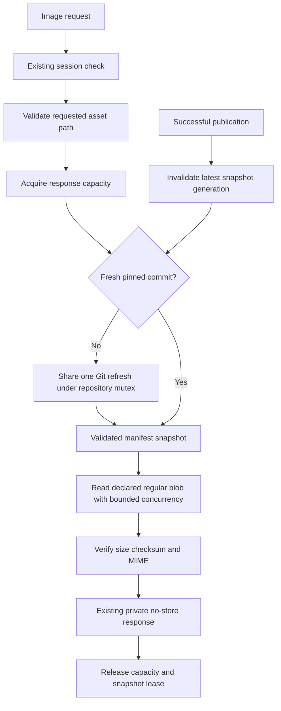

# Resource serving performance - Plan

## Goal Capsule

**Objective:** Roadmap editors can open image previews without a multi-second request queue, and repeat visits reuse unchanged generated assets without unnecessary network revalidation.

**Means:** Commit-based image reads in the roadmap API (KTD1–KTD3), and conservative recognition of Astro asset names in Canvas Drop (KTD4–KTD5).

**Authority:** The user requested one plan for previously identified fixes 2 and 3. This document proposes implementation; it does not authorize implementation or production deployment. Current repository instructions and Canvas Drop's `BUILD_BRIEF.md` govern execution. The direct-main emergency exception applied to fix 1 only.

**Execution boundary:** One coordinated round, two repository changes, independently releasable. The implementing agent owns both changes, validation, review and release evidence once that work is authorized. Stop shipping if an access-control regression, unexplained byte mismatch, failed required CI check, or unacceptable freshness behavior remains.

**Target repositories:** `product-roadmap` (Roadmap) and `canvas-drop` (Canvas Drop). All paths below are relative to the named repository. This Canvas Drop document is the canonical combined plan. Use isolated worktrees; preserve the existing staged roadmap build-timing/worktree-cleanup work.

---

## Product Contract

### Summary

Remove expensive repeated repository preparation from the image-content API and make Canvas Drop recognize the generated asset filenames used by the roadmap. Keep the static-first preview hotfix already deployed as roadmap commit `2bf0c8862cb898f4ee774fb50322db3e30a709c5`, Canvas version 223.

### Problem Frame

The supplied HAR recorded seven API image requests taking approximately 0.97–4.53 seconds, largely waiting for the server. The same images from the static canvas completed in approximately 52–106 ms with 304 responses. The API handler currently fetches Git, creates a temporary checkout, validates all assets, and reads one image while holding the repository mutex. Seven requests repeat that work serially.

The static host was not the main source of the multi-second delay. Its separate issue is avoidable repeat revalidation: the content-hash classifier accepts hexadecimal suffixes, while observed Astro output includes names such as `_astro/sections.B3rvd3pb.js` and `_astro/preload-helper.CxFQXtKk.js`.

### Requirements

- **R1 — Fast image reads:** Concurrent authenticated image requests must avoid a separate Git fetch and temporary checkout for every image. Meet the operation-count and latency gates in the Verification Contract.
- **R2 — Access stays enforced:** Every network request passes the existing authentication and authorization checks before serving bytes or a conditional response. Cached content must not cache permission decisions. Restricted static resources remain private to the browser cache; the roadmap API retains its existing signed-session access model.
- **R3 — Correct image bytes:** Only a declared asset revision may be returned, with its expected size, checksum, MIME type and path validation. Missing, malformed, oversized or corrupt resources must not produce successful image responses. Preserve existing URL, HTTP response, range and download behavior.
- **R4 — Bounded freshness and resources:** Successful publication through the service invalidates image metadata before returning success. External Git changes may remain undiscovered for up to the proposed five-second refresh interval; after that interval a request must refresh successfully before serving. Memory, concurrent reads and retained Git references must be bounded.
- **R5 — Correct static caching:** Recognized generated Astro assets receive the existing immutable cache policy. Stable entry documents and ordinary mutable filenames continue to revalidate. Existing hexadecimal-hash behavior remains supported.
- **R6 — No exposure expansion:** Cache changes must not turn restricted, password-protected, expired, archived or disabled canvases into anonymously cacheable responses. Public-link behavior continues to follow the existing cache policy and access ladder.
- **R7 — Verifiable releases:** Each service change has green repository checks, before/after performance evidence, a verified deployed source revision and an independent rollback path. Keep fix 1 working throughout.

### Scope Boundaries

No optimization of `/api/items` or the asset-list/usage scan; no new image transformation service, CDN, shared response cache, authentication system, upload policy, API option, MCP tool, database migration or UI setting. Staged uploads retain their existing per-account ownership checks and storage path. The server-side image metadata cache contains committed repository resources only.

### Acceptance Examples

- **AE1:** Seven authorized requests for the HAR's original images return matching bytes concurrently. A warm burst does not fetch Git; a cold burst shares one refresh and creates no worktrees.
- **AE2:** An anonymous request and a logged-in user lacking access to a restricted canvas receive no asset bytes, even after an authorized request warmed the resource. An unauthorized conditional request also receives no 304 that bypasses the access gate.
- **AE3:** After a successful service publication, a newly added revision is available and a removed revision is unavailable on the next request. A concurrent older refresh cannot restore stale metadata.
- **AE4:** A normal repeat navigation reuses recognized unchanged Astro bundles from the browser cache. HTML revalidates and a new deployment's changed bundle URL loads new bytes.

---

## Planning Contract

### Key Technical Decisions

**KTD1 — Reuse immutable Git snapshots, with one coalesced refresh.** Implement a small asset-specific snapshot reader on the existing `GitHub` service, following `edit-service/item_snapshot.go` and its copy/eviction tests. Resolve the current remote main commit under the existing repository mutex; coalesce concurrent refresh callers. Reuse that commit for five seconds, measured from successful validation, then require refresh. Do not serve stale snapshots after refresh failure. Requests may cancel their wait without cancelling the shared refresh for other callers. Use a bounded service-owned refresh context and check cancellation again after acquiring the existing mutex. This reduces GitHub traffic while making the freshness tradeoff explicit (R1, R4).

Cache validated manifest metadata by commit, with at most eight retained snapshots and an 8 MiB metadata budget. Oversized metadata fails safely rather than allocating without limit. Keep each retained/in-flight commit reachable through a service-owned Git reference; release references after eviction and the last active reader. Restart cleanup may touch only this cache's reference namespace. Do not hold the publication mutex during image body reads. No application cache of original image bytes is needed initially; Git's object store already holds them.

**KTD2 — Read the requested original directly from Git objects.** Replace only `handleAssetContent`'s `withRepository` dependency. Read the exact asset manifest and original from the pinned commit without materializing a checkout. Share structural manifest validation with the existing path, but keep full repository validation on publication. Require regular Git blob modes for both manifest and original, exact manifest-to-request matching, bounded blob sizes, and validation of the requested original's checksum and detected MIME before calling `serveAsset`. Treat request strings as data, never shell commands or Git revision expressions. Resolve validated paths through the pinned tree and read resulting object IDs. Git supports direct type, size and content inspection without a checkout ([Git cat-file documentation](https://git-scm.com/docs/git-cat-file)). This avoids re-reading every unrelated original for each preview (R1, R3).

Limit simultaneous original responses to four; each retains the existing 25 MiB upload limit. Acquire capacity before obtaining a snapshot lease and hold it until the response finishes, including a slow client's body transfer. This bounds original buffers to approximately 100 MiB, excluding metadata, Git processes and HTTP overhead. Queued callers hold no snapshot lease. At most four evicted snapshots may remain pinned by active responses in addition to the eight cached snapshots. Waiters are cancellation-aware; release both capacity and leases on every return. Preserve `serveAsset`'s `private, no-store`, `nosniff`, MIME/disposition, and `http.ServeContent` range behavior. Infrastructure errors retain the current external response contract, with useful server-side diagnostics that omit credentials and asset content.

**KTD3 — Invalidate at the publication owner.** Trace all successful Git publication paths, including legacy synchronization, coordinated publication and recovery/idempotent success. Invalidate the latest-head entry under the same serialization boundary as publication success. Use a generation check so a refresh started before invalidation cannot publish its result afterwards. A cache miss does not independently force a Git fetch: requests share the normal refresh window, preventing repeated unknown paths from producing fetch storms. No authorization result enters this cache. Existing API sessions are signed, time-limited grants; this change does not add a live GitHub-permission lookup to each request (R2, R4).

**KTD4 — Recognize a conservative Astro naming convention.** Keep the existing hexadecimal classifier. Add a separately tested branch for files under the `_astro/` directory whose final filename suffix is exactly eight URL-safe base64 characters, contains at least one uppercase letter, and precedes a generated asset extension: `js`, `mjs`, `css`, `woff`, `woff2`, `ttf`, `otf`, `png`, `jpg`, `jpeg`, `webp`, `avif`, `gif` or `svg`. Match the resolved manifest path, not a query string or unnormalized request URL. Ordinary HTML, JSON, source maps and generic filenames remain outside this new branch (R5).

This deliberately covers the observed build while leaving ambiguous all-lowercase non-hex suffixes on the safe revalidation path. It is a naming convention, not proof that arbitrary uploaded files are immutable. Document that publishers must never reuse a recognized generated URL for different bytes, including manually named files inside `_astro/`. A name such as `_astro/config.Settings.js` also fits the convention and must not be used for mutable content. General producer-supplied cache metadata is outside this fix. Astro's generated asset directory defaults to `_astro`; Rolldown supports URL-safe base64 hashes ([Astro configuration](https://docs.astro.build/en/reference/configuration-reference/#buildassets), [Rolldown hash characters](https://rolldown.rs/reference/OutputOptions.hashCharacters)).

**KTD5 — Preserve the existing access/cache split.** Classification supplies only `contentHashed` to `apps/server/src/http/cdn-cache.ts`; it does not decide whether a response is public. Keep `canvasAccess` and password/lifecycle checks before serving or evaluating conditional requests. Recognized restricted assets receive `private, max-age=31536000, immutable`; only already anonymously accessible public assets may receive the existing public equivalent (R2, R6).

Private immutable responses can remain in an authorized user's browser after logout or access revocation. Future network requests are gated, but previously downloaded bytes cannot be revoked. This is a material extension of long-lived browser caching to these Astro assets, not a promise of immediate removal from a device. The HTTP immutable directive suppresses revalidation while fresh; it does not authenticate users ([RFC 8246](https://httpwg.org/specs/rfc8246.html)).

**KTD6 — Coordinate independent releases.** U1 and U2 form one Roadmap PR; U3 forms one Canvas Drop PR. U4 verifies and releases the roadmap API first, then Canvas Drop, with a check between them. Neither change depends on a simultaneous frontend deployment or protocol switch. Do not conflate the roadmap's static-site Actions deployment with deployment of its Go service. Capture and preserve the previously running binaries/images. Rollback reverts only the affected service; it does not roll back roadmap content or restore a database (R7).

### High-Level Design

### Assumptions and Operational Constraints

The five-second external-change discovery interval and conservative filename convention are proposed defaults, not prior user-approved decisions. They are part of the plan being approved. There are no unresolved implementation blockers; production host/release identities are inspected during U4 rather than assumed from an old deployment.

The existing repository mutex can still be occupied by a long publication. Cold refresh requests may wait for it; this fix removes per-image checkout serialization and does not redesign publication locking. Warm reads must remain independent of that mutex. Concurrent reads must not interfere with publication worktrees or cleanup, including the unrelated cleanup changes currently staged in Roadmap.

Follow Canvas Drop's cache incident learnings in `docs/solutions/2026-06-18-cdn-readiness-cache-headers-and-client-ip.md`, writer/invalidation rules in `docs/solutions/2026-07-16-repo-audit-storage-sweeps-and-cache-invariants.md`, and denial-first checks in `docs/solutions/2026-06-13-auth-invariant-checklist.md`. No new user action is introduced, so MCP parity is preserved through the existing shared server paths.

---

## Implementation Units

### U1. Add bounded committed-asset snapshots

**Goal:** Establish the repository read lifecycle required by R1, R3 and R4. **Dependencies:** None.

**Files:** Roadmap `edit-service/github.go`, `edit-service/gitstore.go`, `edit-service/publication.go`, proposed `edit-service/asset_snapshot.go` and `edit-service/asset_snapshot_test.go`. Reference `edit-service/item_snapshot.go`, `edit-service/item_snapshot_test.go` and `edit-service/gitstore_test.go`.

**Approach:** Implement KTD1 and KTD3 beside the item snapshot pattern. Keep cache locks separate from publication locking, with one documented lock order. Centralize invalidation at successful repository-write boundaries instead of adding unrelated per-handler copies. Pin commit lifetimes and enforce cache budgets. Use local bare Git repositories and an injected clock/operation recorder for deterministic tests.

**Test scenarios:** Seven concurrent cold readers share one fetch; warm reads complete while the repository mutex is held; expiry requires a successful refresh; a failed refresh does not return stale success; cancellation of one waiter leaves others usable; publication invalidates on normal and recovery paths; stale refresh completion cannot undo invalidation; eviction respects active readers and budgets; copied metadata cannot mutate a cached snapshot; force-push/pruning does not remove an active reader's objects.

**Verification:** Focused snapshot tests and `go test -race ./...` pass. Recorded Git operations prove no per-image worktree creation. No staged work from the shared checkout enters this unit's diff.

### U2. Serve authenticated image originals through the snapshot reader

**Goal:** Deliver R1–R4 and AE1/AE3 through the existing endpoint. **Dependencies:** U1.

**Files:** Roadmap `edit-service/assets.go`, `edit-service/authoring_test.go`, proposed `edit-service/asset_content_test.go`, `edit-service/README.md`; preserve `site/src/lib/edit/resourceClient.ts` and `site/src/lib/edit/imagePreview.test.ts` behavior.

**Approach:** Apply KTD2 without changing asset list or staged-upload behavior. Reuse the existing manifest rules and response helper. Add bounded original reads, cancellation/error cleanup, operation counters in tests, and a reproducible benchmark using the seven HAR resource paths. Keep tokens out of benchmark output.

**Test scenarios:** Exact valid bytes and MIME; byte range and HEAD compatibility; wrong revision, traversal, encoded separators, symlink or gitlink, malformed manifest, invalid digest, oversized body and MIME mismatch all reject; unauthenticated request after cache warmup returns no bytes and does no repository work; slow response writers and repeated publications cannot exceed the buffer/lease bounds; cancellation releases both resources; unrelated asset corruption does not make an otherwise valid requested asset require reading all originals; staged upload access remains account-scoped.

**Verification:** Go race tests and vet pass, frontend hotfix regression tests pass, and warm/cold operation counts meet the Verification Contract. Record actual memory and latency rather than claiming the configured buffer bound equals total process memory.

### U3. Recognize Astro hashes without changing access policy

**Goal:** Deliver R2, R5, R6 and AE2/AE4. **Dependencies:** None; implement after U2 in the single-agent round.

**Files:** Canvas Drop `apps/server/src/canvas/serve.ts`, `apps/server/src/canvas/serve.test.ts`, `apps/server/src/http/cdn-cache.test.ts`, `apps/server/src/app.test.ts` or `apps/server/src/integration/tenancy-scenarios.test.ts`, `docs/site/self-hosting/cdn.md`, regenerated `apps/server/src/docs/generated-content.ts` if required by the existing docs generator.

**Approach:** Apply KTD4–KTD5 with a focused classifier helper or named predicate. Extend header tests with real filenames from the HAR and negative naming examples. Exercise the assembled app for access tests: `serve.test.ts` alone injects an authorized context and cannot prove middleware ordering. Document the reserved naming convention and browser-cache revocation limitation.

**Test scenarios:** Observed Astro JS/CSS/font filenames become immutable; valid hyphen/underscore tokens match; existing hex names still work; HTML, `app.js`, `_astro/config.settings.js`, lowercase ambiguous tokens and lookalike names outside `_astro/` remain revalidating. Test restricted, public, password-protected and expired states; anonymous, authorized and authenticated-but-ungranted users; grant removal after warmup; unauthorized conditional requests; path and subdomain routing. Confirm successful conditional responses retain the correct cache scope.

**Verification:** Focused tests plus full Canvas Drop lint, typecheck, dual-dialect test suite, generated-doc checks and build pass. No schema, deployment configuration, middleware ordering or public-access defaults change.

### U4. Measure and release both fixes

**Goal:** Prove R7 and all acceptance examples in the running systems. **Dependencies:** U1–U3, approved execution/release scope, green CI in both repositories.

**Files:** Roadmap `edit-service/README.md` and a dated entry under `docs/solutions/`; Canvas Drop a dated entry under `docs/solutions/` and `docs/project-status.md` if the release adds a status entry. Store sanitized measurement/deployment receipts as release evidence, not secret-bearing HAR files in Git.

**Approach:** Follow KTD6. Capture a fresh baseline against the actual Go image endpoint because fix 1 now avoids these calls in normal published previews. Inspect the current deployment method before changing either service. Build the Go binary with its source revision embedded; deploy it using the existing service procedure and verify `/health`, capabilities, service health and image behavior. Deploy the Canvas Drop build through its existing production procedure, verify the running revision, and inspect authenticated response headers on the existing restricted roadmap. A static canvas republish alone cannot deploy either server change.

**Test scenarios:** Cold/warm seven-image bursts, a real missing-static-image API fallback, ordinary repeat browser navigation with cache enabled, a changed-URL release, anonymous and wrong-account denials after authorized warmup, current permission/lifecycle rejection, and independent rollback smoke checks.

**Verification:** Preserve exact Git SHAs, green CI run IDs, running service identities, header/status evidence, operation counts and latency measurements. If a static release also occurs, require authenticated manifest sizes/SHA-256 plus `version.json.commit` matching the release commit. Do not claim static deployment from CI success alone. Record any failure before proceeding to the second service.

---

## Verification Contract

**Roadmap gates:** In `edit-service`, run `go test -race ./...` and `go vet ./...`. From the repository root, run `npm --prefix site test`, `npm --prefix site run check`, and the build required by the existing CI workflow. Follow the current `edit-service/README.md` service-release procedure. All applicable `Check application` jobs must finish successfully.

**Canvas Drop gates:** Run `pnpm lint`, `pnpm typecheck`, `pnpm test` (SQLite, Postgres and dashboard), and `pnpm build`. Run `pnpm docs:build` and verify the committed generated module matches; retain CI's `pnpm docs:mermaid` reproducibility check. Required CI includes the real Postgres/object-storage integration leg. Run the repository's code-review workflow before merging; fix material auth, race and caching findings with regression coverage. Use normal PRs; do not bypass protection based on the earlier hotfix permission.

**Performance gates:** Use the same seven originals, commit, client/network region, request concurrency and service capacity before and after. Run at least 20 warm bursts, reporting per-request p50/p95 TTFB and full-burst completion time. The target is at least a 75% reduction in median seven-image burst completion versus the captured same-environment API baseline, and warm p95 TTFB below 500 ms. These are acceptance targets, not measured results. Cold bursts perform at most one shared fetch and zero worktrees; warm bursts inside the refresh window perform zero fetches and zero worktrees. CI asserts these operation counts with controlled barriers rather than fragile timing thresholds. A missed latency target requires investigation and an explicit outcome report, not silent relaxation.

**Browser gates:** Use ordinary navigation with browser cache enabled, not a hard reload. After warming, recognized unchanged Astro assets should require no origin request while fresh. HTML still revalidates. Changed generated URLs return changed bytes. Repeat negative network checks after warmup and grant removal; distinguish those checks from locally cached copies, which remain readable under KTD5.

**Rollback gates:** A previous Go binary or Canvas Drop image can be restored independently without data restoration. Already cached immutable responses cannot be purged by reverting server headers; any correction to bytes at a previously cached URL must use a new URL. Capture that limitation in release notes before enabling U3.

---

## Definition of Done

U1's cache lifecycle and writer invalidation are race-tested; U2 meets image integrity and performance gates; U3 proves the cache/header and access matrix through the assembled app; U4 records green CI and verified running revisions for both services. All acceptance examples pass, fix 1 remains intact, and the measured improvement is reported separately for API fallback and repeat static loads.

No unauthorized image response, unexplained stale publication, unbounded cache, abandoned experimental code, unrelated staged change, unresolved high-severity review finding or unverified deployment claim remains. The combined plan and repository learnings identify the shipped commits and evidence without storing credentials.
