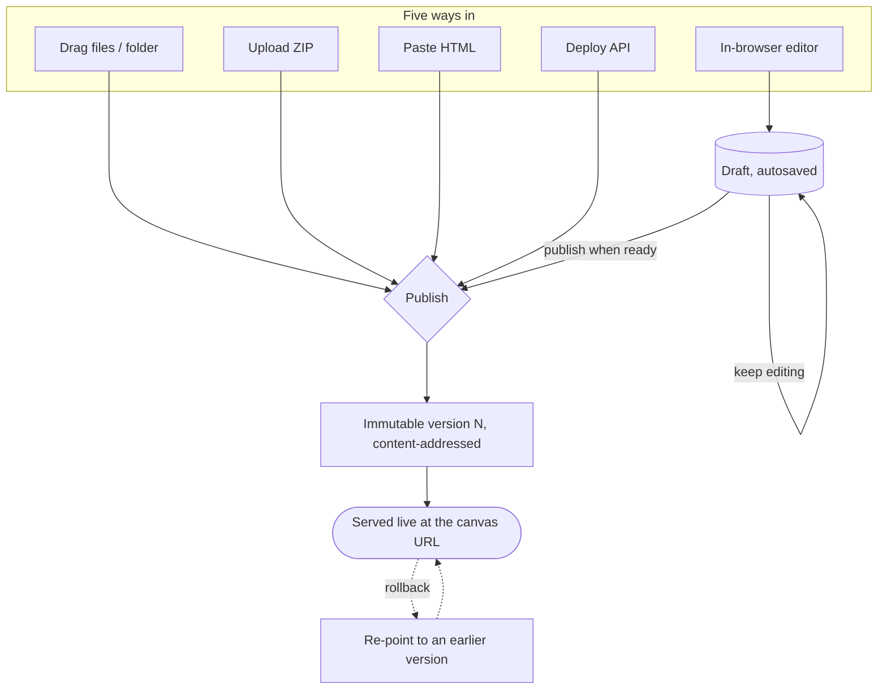

# Create & publish

You have files (or HTML, or a build directory) and want a live, shareable URL.
This page covers the ways to get there and how publishing works.

A canvas serves an **immutable, versioned set of static files** at its canvas URL.
The create flow at `/new` mints the canvas and offers four sources: drag a
folder/files, upload a ZIP, paste HTML, or **API** (mint an empty canvas plus a
key for the programmatic [Deploy API](/docs/api/deploy-api)). The first three
publish a version directly; each is also available on an existing canvas to
publish its next version. The in-browser [editor](/docs/authoring/editor) is the
one source that saves a **draft** first and lets you publish when you're ready.



Only the editor saves a draft first; the other four publish a version directly.
Every publish mints an **immutable version** (content-addressed files), and the
live URL is just a pointer at one version — so **rollback** is instant and
non-destructive.

The create flow also has an **Enable backend** toggle (off by default; turns on
the five primitives — KV, files, AI, identity, realtime) and an optional
**custom slug** field. If a folder or ZIP deploy fails right after the canvas is
created, the empty canvas is cleaned up for you.

## Drag-and-drop files or a folder

The fastest path for an existing project. From the create flow, drop individual
files or a whole folder. Relative paths are preserved at the canvas root, so an
`index.html` at the folder root is served at the canvas URL. The files upload, a
version is created, and the canvas is published in one step.

## Upload a ZIP

Upload a `.zip` and the server extracts it. Extraction is path-safe (zip-slip
archives are rejected). As with a folder, an `index.html` at the archive root is
the entry point.

## Paste HTML

For a one-file canvas, paste HTML directly. canvas-drop wraps it into a single
`index.html` and publishes it. From the create flow this both creates the canvas
and publishes it; on an existing canvas, pasting publishes the next version.

## In-browser editor

Create and edit files with syntax highlighting in the browser. Your work is saved
as a **draft** as you type; you choose when to **publish** a version. This is the
only source that uses the draft/publish loop — the other three publish a version
directly. See [The editor](/docs/authoring/editor).

## Custom slug

The slug identifies the canvas in its URL (`{base}/c/{slug}/` in path mode,
`{slug}.{base}` in subdomain mode). By default a new canvas gets a readable random
slug; you can choose your own at create time (the slug field in `/new`) or change
it later from the canvas **Settings** tab → URL & routing. The grammar is one DNS
label: lowercase `a–z`, digits, and hyphen, 1–63 characters, no leading or
trailing hyphen. Reserved words are rejected, and if the one you want is taken you
get `409 slug_taken`. Changing a slug takes effect on the next request and the old
URL stops resolving.

A custom slug is guessable, so for any link-reachable canvas rely on the access
rung, not on the URL being secret. See [Sharing & access](/docs/authoring/sharing).

## Deploy API

Ship from CI or an agent with a per-canvas secret key over HTTP — no human and no
dashboard session required. The body is a ZIP archive; the response is
machine-readable. This path publishes a version **directly to live** (no draft
loop). "Deploy" is the API term for this publish-from-files contract:

```bash
curl -X PUT "{base}/v1/canvases/{id}/deploy" \
  -H "Authorization: Bearer cd_..." \
  --data-binary @site.zip
```

Create a canvas wired for this path from the **API** method in the create flow
(`/new`): it mints the canvas and a one-time secret key. The key (format `cd_...`)
is shown once and can be regenerated later from the **Settings** tab (Deploy API
section). It is a Bearer secret, not a session cookie, and works **only on its
own canvas** (a key for a different canvas returns `403`; an unknown or missing
key returns `401`).

On success you get the new version's details:

```json
{ "url": "...", "version": 7, "fileCount": 12, "totalBytes": 48213, "warnings": [] }
```

On a failure you get a stable `{ code, message, path? }` body, so an agent can
repair and retry:

```json
{ "code": "CANVAS_TOO_LARGE", "message": "..." }
```

A single-shot `PUT .../deploy` returns `400` with the failure's `code` for
validation errors (e.g. `EMPTY_DEPLOY`, `INVALID_PATH`, `ZIP_SLIP_REJECTED`); a
request body over the size cap is rejected with `413 CANVAS_TOO_LARGE` before it
is parsed. Limits: 100 MB/canvas, 25 MB/file, 2000 files. Once the Bearer key is
verified the endpoint is rate-limited per canvas (default 10 deploys/min, admin-
tunable; `429 {"error":"rate_limited"}` with a `Retry-After` header).
`warnings[]` carries non-fatal notices — e.g. a file that may contain a canvas API
key you should remove before publishing, or a path that will be served as
`text/plain`.

For large or repeat deploys, the **staged upload** flow sends only changed files:
`POST .../uploads` with a manifest of `{ path, hash, size }` entries returns an
`uploadId` plus the subset of hashes not already stored, you
`PUT .../uploads/:uploadId/blobs/:hash` each missing blob (`204` per blob), then
`POST .../uploads/:uploadId/finalize` publishes the version. The Deploy API also
exposes `GET /v1/canvases/:id` (status JSON), `GET .../versions`, `GET .../files`
(read-back; `?path=foo.js` returns raw bytes), `POST .../unpublish`, and
`POST .../rollback` (body `{ version }`). See the
[Deploy API reference](/docs/api/deploy-api).

## Versions and rollback

Every publish creates a new immutable version; the canvas always serves its
**current** version. Roll back to an earlier version from the dashboard (the
**Versions** tab → **Make current**) or the API (`POST /v1/canvases/:id/rollback`).
Files are content-addressed — only changed files are stored and re-publishing
identical files is cheap. The last 10 versions are kept.
