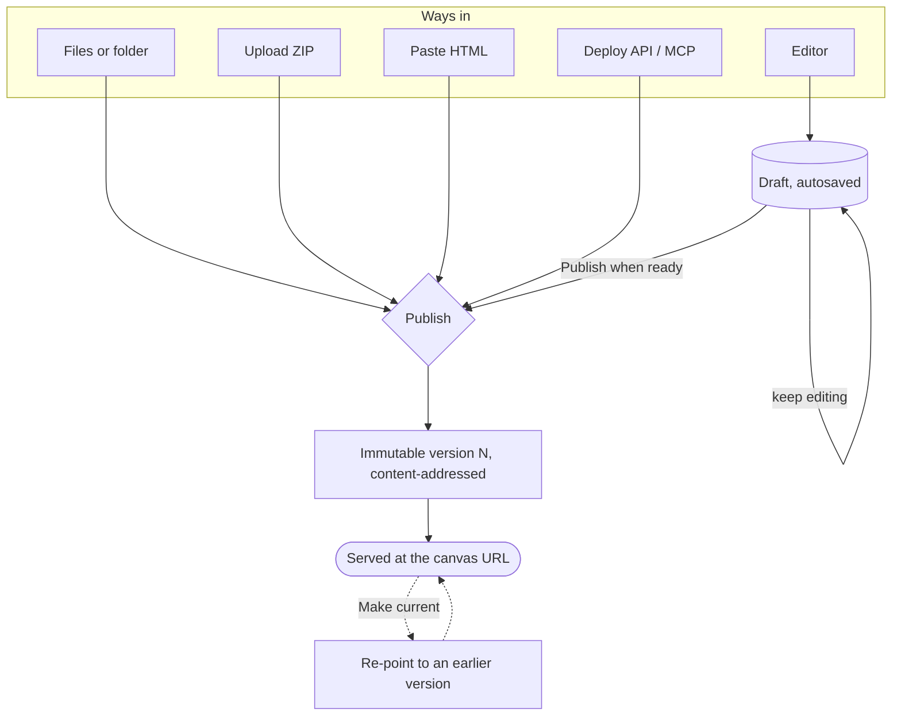

# Create & publish

You have HTML, a folder of static files, or a build directory, and you want a live URL that people in your org can open. By the end of this page you will have published a canvas, know what a publish does, and be able to control its URL.

The shortest path, from a signed-in dashboard:

1. Open `/new` and pick **Paste HTML**.
2. Paste your markup, optionally give it a title, and click **Create and publish**.
3. Save the key from the dialog (it is shown once), then **Go to canvas**. The **Overview** tab has the URL: `{base}/c/{slug}/` in `path` mode, `https://{slug}.canvases.example.com/` in `subdomain` mode.

The same from a terminal, with the canvas id and key shown when you create a canvas:

```bash
curl -fsS -X PUT "{base}/v1/canvases/{id}/deploy" \
  -H "Authorization: Bearer $CANVAS_KEY" \
  --data-binary @site.zip
# 200 {"url":"…","version":1,"fileCount":12,"totalBytes":48213,"warnings":[]}
```

## Ways in

| Source | Where | What it does |
|---|---|---|
| **Paste HTML** | `/new`, or **New version** on a canvas | Stores your markup as `index.html` and publishes it in one step |
| **Files or folder** | `/new`, or **New version** | Uploads with relative paths preserved and publishes |
| **Upload ZIP** | `/new`, or **New version** | Extracts the archive server-side and publishes |
| **Use the API** | `/new` | Mints an empty canvas plus its key; the first `PUT …/deploy` publishes |
| **Editor** | The **Editor** tab | Autosaves a **draft**; you click **Publish** when ready |
| **Deploy API / MCP** | Scripts and agents | Publishes directly to live with a key or over MCP |


```mermaid
flowchart TD
    subgraph Sources["Ways in"]
      DnD[Files or folder]
      Zip[Upload ZIP]
      Paste[Paste HTML]
      API[Deploy API / MCP]
      Ed[Editor]
    end
    DnD --> Pub{Publish}
    Zip --> Pub
    Paste --> Pub
    API --> Pub
    Ed --> Draft[(Draft, autosaved)]
    Draft -->|keep editing| Draft
    Draft -->|Publish when ready| Pub
    Pub --> V[Immutable version N, content-addressed]
    V --> Live([Served at the canvas URL])
    Live -.->|Make current| Prev[Re-point to an earlier version]
    Prev -.-> Live
```

Every publish writes an **immutable version**: files are stored by content hash, and the live URL is a pointer at one version. Rolling back re-points; nothing is rewritten. The last 10 versions are kept.

The editor is the one source with a draft step. Everything else publishes the moment it succeeds. Two words for the same event: the dashboard says **publish**, the API and code say **deploy**.

Owners and editors can do everything on this page. A viewer opens the canvas but cannot change it; only the owner can delete it. See [Sharing & access](/docs/authoring/sharing).

## Options at create time

After you pick a source, `/new` asks for:

- **Title** (optional, up to 200 characters). Rename later from the **Overview** tab.
- **Slug** (optional). Leave it empty for a readable random slug, or choose your own; availability is checked as you type. See [Custom slug](#custom-slug).
- **Workspace**, shown only when your account belongs to an org. **Personal** means only you and the people you specifically add. Picking your org homes the canvas there so it can later open to the **Whole org** rung. This choice is fixed once the canvas exists: a Personal canvas cannot be opened to Whole org later. Guests never see this choice.
- **Audience** (not shown for **Use the API**). **Restricted** is the default: only you and people or teams you add can open it. A workspace canvas offers **Everyone in {workspace}** with a **List in Shared** toggle (off by default) so members can find it. A Personal canvas offers **Public link**, when the instance and your account allow public links, with an optional **Require password**. Changing the Workspace resets the audience to Restricted. The audience is applied after the first publish; if that fails, the canvas stays Restricted and the key dialog says so (**Save key and open Share**). The full ladder, named people, teams, and expiry live on the **Share** tab.
- **Enable backend** (off by default). Turns on identity and, subject to what your instance allows, KV, files, AI, and realtime. Change it any time on the **Backend** tab. See [Capabilities](/docs/authoring/capabilities).

For **Files or folder** and **Upload ZIP**, the create and the publish start as soon as you drop the files. If the publish fails, the empty canvas is removed and the error is shown so you can retry. On success the key is shown once; copy it if you plan to use the API.

## Files or folder

Drop individual files or a whole folder, or use the file and folder pickers. Relative paths are preserved at the canvas root, so an `index.html` at the folder root is served at the canvas URL. Upload, version, and publish happen in one step, with progress shown while files transfer.

## Upload a ZIP

Upload a `.zip` (not a tar) and the server extracts it. Extraction is path-safe: entries that escape the canvas root are rejected (`ZIP_SLIP_REJECTED`, `INVALID_PATH`), an entry that declares more than 25 MB, or inflates past it, is rejected before it can fill memory (`ZIP_BOMB_REJECTED`), and an unreadable archive is `INVALID_ZIP`. As with a folder, an `index.html` at the archive root is the home page.

## Paste HTML

For a one-file canvas, paste HTML directly. canvas-drop stores it as a single `index.html` and publishes it. From `/new` this creates and publishes in one request; on an existing canvas it publishes the next version.

## New version on an existing canvas

The **New version** button sits on every tab of a canvas you own or edit. It opens the same three sources (**Paste HTML**, **Files or folder**, **ZIP**) and publishes the next version to everyone as soon as it succeeds. Use it when your files are built elsewhere. An archived canvas refuses new versions (`NOT_ACTIVE`) until you unarchive it.

## Editor

Create and edit files in the browser with syntax highlighting. Changes autosave to a **draft** that only you and other editors see; you choose when to **Publish**. See [The editor](/docs/authoring/editor).

If a direct publish (folder, ZIP, paste, or API) lands while the draft has unpublished edits, the draft is marked **stale** rather than overwritten, so nothing you typed is lost. A clean draft simply follows the new version.

## What every publish enforces

| Rule | Detail |
|---|---|
| Size | 100 MB per canvas, 25 MB per file, 2000 files. Over the cap fails with `CANVAS_TOO_LARGE`, `FILE_TOO_LARGE`, or `TOO_MANY_FILES`. |
| Dotfiles | Files and directories whose name starts with `.` (`.git`, `.env`, `.DS_Store`) are dropped from every publish. |
| Home page | `index.html` at the root is the home page. If there is no `index.html` but exactly one HTML file, that file is served at the root and the Overview tab reports an inferred home page. No `index.html` and zero or several HTML files means the root returns 404 and the Overview tab shows **Root page missing**. |
| Single-page app mode | Off by default. Turn it on under **Settings** → URL & routing to serve the home page for any path that does not match a file (or a directory's own `index.html`), for client-side routing. |
| Key lint | A text file that contains something shaped like a canvas key (`cd_...`) produces a warning. Remove the key and publish again. |

Warnings never block a publish. They come back in the `warnings[]` array of the deploy response, in three forms: a file that will be served as `text/plain`, a file that may contain a canvas key, and a missing `index.html`.

## Custom slug

The slug identifies the canvas in its URL: `{base}/c/{slug}/` in `path` mode, `https://{slug}.canvases.example.com/` in `subdomain` mode. A new canvas gets a readable random slug such as `quiet-otter-x7k2m9p3q1r5t`: an adjective, a noun, and a 13-character random suffix that carries the unguessability. Choose your own at create time, or change it later from **Settings** → URL & routing → **Change slug** (enter a new slug, or leave the field empty for a fresh random one). Over MCP the tool is `set_canvas_slug`.

The grammar is one DNS label: lowercase `a-z`, digits, and hyphen, 1 to 63 characters, no leading or trailing hyphen. Reserved words (`api`, `v1`, `sdk`, `auth`, `mcp`, `healthz`, `welcome`, `docs`, `gallery`, `privacy`, `terms`, `skill`, `www`, `app`, `admin`, `mail`, `static`, `assets`) are refused with `400 invalid_slug`, and a slug someone else holds returns `409 slug_taken`.

A slug change takes effect on the next request: the old URL stops resolving and live realtime connections are dropped so clients reconnect under the new slug. A custom slug is guessable, so rely on the access rung, not on the URL being secret; the Share tab reminds you of this on a link-reachable canvas. See [Sharing & access](/docs/authoring/sharing).

## Deploy API

Ship from CI or an agent with a per-canvas secret key over HTTP; no dashboard session is involved. The body is a ZIP archive and the response is machine-readable. This path publishes **directly to live** with no draft step.

```bash
curl -fsS -X PUT "{base}/v1/canvases/{id}/deploy" \
  -H "Authorization: Bearer $CANVAS_KEY" \
  --data-binary @site.zip
```

**The key.** Every canvas has one key, format `cd_...`. It is shown once when the canvas is created (the **Use the API** source shows the id, the key, and a ready-to-run `curl` with the exact URL for your instance), and you can regenerate it any time from **Settings** → Deploy API → **Regenerate key**; the old key stops working on the next request, and when an editor rotates it the owner is emailed. The key is a Bearer secret, not a session cookie, and works only on its own canvas: a key for a different canvas returns `403`, and a missing, unknown, or revoked key returns `401`. A key stops working the moment its canvas is archived, disabled, or deleted. Deploys made with the key are attributed to the canvas owner in the Versions tab.

**Success** returns the new version's details:

```json
{ "url": "…", "version": 7, "fileCount": 12, "totalBytes": 48213, "warnings": [] }
```

**Failure** returns a stable `{ code, message, path? }` body so an agent can repair and retry:

```json
{ "code": "FILE_TOO_LARGE", "message": "…", "path": "media/intro.mp4" }
```

Validation errors (`EMPTY_DEPLOY`, `INVALID_ZIP`, `INVALID_PATH`, `ZIP_SLIP_REJECTED`, and the rest) come back as `400`. A body over the size cap is refused with `413 CANVAS_TOO_LARGE` before it is parsed. Once the key is verified, the endpoint is rate-limited per canvas: 10 deploys per minute by default (the operator sets `CANVAS_DROP_RATELIMIT_DEPLOY_PER_MIN`); over the limit you get `429 {"error":"rate_limited"}` with a `Retry-After` header.

**Staged upload** for large or repeat deploys sends only the files that changed. `POST {base}/v1/canvases/{id}/uploads` with a manifest of `{ path, hash, size }` entries returns an `uploadId` plus the hashes the server does not already hold; `PUT .../uploads/{uploadId}/blobs/{hash}` each missing blob (`204` per blob); `POST .../uploads/{uploadId}/finalize` publishes the version. An upload session lasts 15 minutes.

**Read-back and lifecycle** on the same key: `GET {base}/v1/canvases/{id}` (status JSON, including `slug` and `url`), `GET .../versions`, `GET .../files` (the live manifest; `?path=app.js` returns that file's bytes), `POST .../unpublish`, and `POST .../rollback` with body `{ "version": 3 }`. Full contract in the [Deploy API reference](/docs/api/deploy-api); error codes in [Error codes](/docs/api/errors).

**Over MCP**, `deploy_canvas` takes either `zipBase64` or a `files[]` array (text as `utf8`, binary as `base64`), and `begin_deploy` / `add_files` / `finalize_deploy` mirror the staged flow. See [MCP server](/docs/agents/mcp).

## Versions and rollback

Every publish creates a new immutable version and the canvas always serves its **current** one. The **Versions** tab lists them newest first with source, who published, file count, and size. For any version you can:

- **Make current**: roll back (or forward) by re-pointing the live URL. Instant and non-destructive; no new version is written. With the key: `POST {base}/v1/canvases/{id}/rollback`.
- **Download ZIP**: the exact files of that version.
- **Restore**: copy its files into the editor draft (confirms first if the draft has unpublished changes).
- **Delete**: permanently remove a historical version. The current version cannot be deleted.

Because files are content-addressed, only changed files cost storage and republishing identical files is cheap. The last 10 versions are kept; older ones are pruned on publish.

To take a canvas offline without deleting it, use **Settings** → Lifecycle → **Unpublish** (or `POST .../unpublish` with the key). The canvas returns to draft state, the URL stops serving, sharing and gallery listing are cleared, and live realtime connections are dropped; publish again to bring it back.
