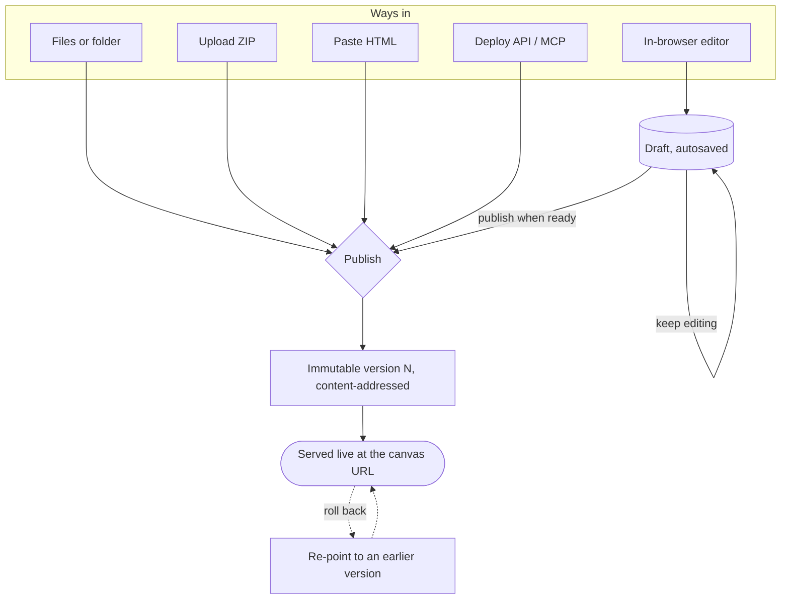

# Create & publish

You have HTML, a folder of static files, or a build directory, and you want a live URL that people in your org can open. This page covers every way to get there, what happens when you publish, and how to control the URL.

The shortest path, from a signed-in dashboard:

1. Open `/new` and pick **Paste HTML**.
2. Paste your markup, optionally give it a title, and click **Publish**.
3. Copy the URL from the result screen. The canvas is live at `{base}/c/{slug}/` (path mode) or `https://{slug}.canvases.example.com/` (subdomain mode).

The same from a terminal, once you have a canvas id and its deploy key (both shown when you create a canvas):

```bash
curl -X PUT "{base}/v1/canvases/{id}/deploy" \
  -H "Authorization: Bearer cd_..." \
  --data-binary @site.zip
```

## How the sources fit together

The create flow at `/new` mints the canvas and offers four sources: **Paste HTML**, **Files or folder**, **Upload ZIP**, and **Use the API**. The first three publish a version immediately, and each is also available on an existing canvas through the **New version** button to publish its next version. The in-browser [editor](/docs/authoring/editor) is the one source that saves a **draft** first and lets you publish when you are ready. Agents reach the same engine over the [Deploy API](/docs/api/deploy-api) and [MCP](/docs/agents/mcp).


```mermaid
flowchart TD
    subgraph Sources["Ways in"]
      DnD[Files or folder]
      Zip[Upload ZIP]
      Paste[Paste HTML]
      API[Deploy API / MCP]
      Ed[In-browser editor]
    end
    DnD --> Pub{Publish}
    Zip --> Pub
    Paste --> Pub
    API --> Pub
    Ed --> Draft[(Draft, autosaved)]
    Draft -->|keep editing| Draft
    Draft -->|publish when ready| Pub
    Pub --> V[Immutable version N, content-addressed]
    V --> Live([Served live at the canvas URL])
    Live -.->|roll back| Prev[Re-point to an earlier version]
    Prev -.-> Live
```

Every publish writes an **immutable version**: files are stored by content hash, and the live URL is a pointer at one version. Rolling back re-points; nothing is rewritten. The last 10 versions are kept.

Owners and editors can publish. Someone added as a viewer sees the canvas but cannot change it; see [Sharing & access](/docs/authoring/sharing).

## Options at create time

After you pick a source, `/new` asks for:

- **Title** (optional). Defaults are fine; you can rename from the Overview tab later.
- **Slug** (optional). Leave it empty for a readable random slug, or choose your own. Availability is checked as you type. See [Custom slug](#custom-slug).
- **Workspace**, shown only when your account belongs to an org. **Personal** means only you and the people you specifically add. Picking your org homes the canvas there so it can later open to the **Whole org** rung. This choice is fixed once the canvas is created; a Personal canvas cannot be opened to Whole org later. Guests (accounts outside the org) never see this choice.
- **Audience** (not shown for the API source). The canvas stays **Only me** unless you widen it. A Workspace canvas offers **Everyone in {workspace}** with an optional **List in Shared** toggle so members can discover it (off by default). A Personal canvas offers **Public link**, when the instance and your account allow public links, with an optional **Require password**. Switching the Workspace selector resets the audience to Only me. Audience is applied after the first publish; if applying it fails, the canvas stays private and the result screen tells you. The full ladder, named people, teams, and expiry live on the canvas's **Share** tab.
- **Enable backend** (off by default). Turns on identity and, subject to what your instance allows, KV, files, AI, and realtime. See [Capabilities](/docs/authoring/capabilities).

If a folder or ZIP deploy fails right after the canvas is created, the empty canvas is removed and the error is shown so you can retry. The one-time deploy key is revealed once on the result screen; copy it if you plan to use the API.

## Files or folder

Drop individual files or a whole folder. Relative paths are preserved at the canvas root, so an `index.html` at the folder root is served at the canvas URL. Upload, version, and publish happen in one step, with progress shown while files transfer.

## Upload a ZIP

Upload a `.zip` and the server extracts it. Extraction is path-safe: archives with traversal entries or absolute paths are rejected (`ZIP_SLIP_REJECTED`), and archives whose declared sizes do not match what inflates are rejected (`ZIP_BOMB_REJECTED`). As with a folder, an `index.html` at the archive root is the entry point.

## Paste HTML

For a one-file canvas, paste HTML directly. canvas-drop stores it as a single `index.html` and publishes it. From `/new` this creates and publishes in one request; on an existing canvas, pasting publishes the next version.

## In-browser editor

Create and edit files in the browser with syntax highlighting. Changes autosave to a **draft**; you choose when to **Publish**. This is the only source that uses the draft/publish loop. See [The editor](/docs/authoring/editor).

If you deploy directly (folder, ZIP, paste, or API) while the draft has unpublished edits, the draft is marked **stale** rather than overwritten, so nothing you typed is lost.

## What every deploy enforces

| Rule | Detail |
|---|---|
| Size | 100 MB per canvas, 25 MB per file, 2000 files. Over the cap fails with `CANVAS_TOO_LARGE`, `FILE_TOO_LARGE`, or `TOO_MANY_FILES`. |
| Dotfiles | Files and directories whose name starts with `.` (`.git`, `.env`, `.DS_Store`) are dropped from every deploy. |
| Home page | `index.html` at the root is the home page. A deploy whose only HTML file has another name is still served at the root, and the Overview tab reports the inferred home page. Several HTML files with no `index.html` means the root returns 404 and the Overview tab shows **Root page missing**. |
| SPA fallback | Off by default. Turn it on in **Settings** → URL & routing to serve the home page for any path that does not match a file, for client-side routing. |
| Key lint | A file that contains something shaped like a canvas deploy key (`cd_...`) produces a warning. Remove the key and publish again. |

Warnings never block a publish; they come back in the `warnings[]` array of the deploy response, and the Overview tab flags a missing or ambiguous root page after the fact.

## Custom slug

The slug identifies the canvas in its URL: `{base}/c/{slug}/` in path mode, `https://{slug}.canvases.example.com/` in subdomain mode. A new canvas gets a readable random slug such as `quiet-otter-x7k2m9p3q1r5t`. Choose your own at create time, or change it later from **Settings** → URL & routing → **Change slug** (enter a new slug, or leave the field empty for a fresh random one). Over MCP the tool is `set_canvas_slug`.

The grammar is one DNS label: lowercase `a-z`, digits, and hyphen, 1 to 63 characters, no leading or trailing hyphen. Reserved words (`api`, `v1`, `sdk`, `auth`, `mcp`, `healthz`, `welcome`, `docs`, `gallery`, `privacy`, `terms`, `skill`, `www`, `app`, `admin`, `mail`, `static`, `assets`) are refused with `400 invalid_slug`, and a slug someone else holds returns `409 slug_taken`.

A slug change takes effect on the next request: the old URL stops resolving and any live realtime connections are dropped so clients reconnect under the new slug. A custom slug is guessable, so rely on the access rung, not on the URL being secret. See [Sharing & access](/docs/authoring/sharing).

## Deploy API

Ship from CI or an agent with a per-canvas secret key over HTTP; no dashboard session is involved. The body is a ZIP archive (ZIP only, not tar) and the response is machine-readable. This path publishes **directly to live** with no draft step.

```bash
curl -X PUT "{base}/v1/canvases/{id}/deploy" \
  -H "Authorization: Bearer cd_..." \
  --data-binary @site.zip
```

**The key.** Every canvas has one deploy key, format `cd_...`. It is shown once when the canvas is created (the **Use the API** source shows the id, the key, and a ready-to-run `curl`), and you can regenerate it any time from **Settings** → Deploy API; the old key stops working on the next request. The key is a Bearer secret, not a session cookie, and works only on its own canvas: a key for a different canvas returns `403`, and a missing, unknown, or revoked key returns `401`. A key stops working the moment its canvas is archived, disabled, or deleted. Deploys made with the key are recorded as the canvas owner in the Versions tab.

**Success** returns the new version's details:

```json
{ "url": "...", "version": 7, "fileCount": 12, "totalBytes": 48213, "warnings": [] }
```

**Failure** returns a stable `{ code, message, path? }` body so an agent can repair and retry:

```json
{ "code": "FILE_TOO_LARGE", "message": "...", "path": "media/intro.mp4" }
```

Validation errors (`EMPTY_DEPLOY`, `INVALID_ZIP`, `INVALID_PATH`, `ZIP_SLIP_REJECTED`, and the rest) come back as `400`. A body over the size cap is refused with `413 CANVAS_TOO_LARGE` before it is parsed. Once the key is verified, the endpoint is rate-limited per canvas (default 10 deploys per minute, admin-tunable); over the limit you get `429 {"error":"rate_limited"}` with a `Retry-After` header. `warnings[]` carries non-fatal notices: a file that looks like it contains a deploy key, a path that will be served as `text/plain`, or a missing `index.html`.

**Staged upload** for large or repeat deploys sends only the files that changed. `POST {base}/v1/canvases/{id}/uploads` with a manifest of `{ path, hash, size }` entries returns an `uploadId` plus the hashes the server does not already hold; `PUT .../uploads/{uploadId}/blobs/{hash}` each missing blob (`204` per blob); `POST .../uploads/{uploadId}/finalize` publishes the version. An upload session lasts 15 minutes.

**Read-back and lifecycle** on the same key: `GET {base}/v1/canvases/{id}` (status JSON, including `slug` and `url`), `GET .../versions`, `GET .../files` (the current manifest; `?path=app.js` returns that file's bytes), `POST .../unpublish`, and `POST .../rollback` with body `{ "version": 3 }`. Full contract in the [Deploy API reference](/docs/api/deploy-api); error codes in [Error codes](/docs/api/errors).

**Over MCP**, `deploy_canvas` takes either `zipBase64` or a `files[]` array, and `begin_deploy` / `add_files` / `finalize_deploy` mirror the staged flow. See [MCP server](/docs/agents/mcp).

## Versions and rollback

Every publish creates a new immutable version and the canvas always serves its **current** one. The **Versions** tab lists them newest first with source, who published, file count, and size. For any version you can:

- **Make current**: roll back (or forward) with `POST {base}/v1/canvases/{id}/rollback` behind it. Instant, and non-destructive.
- **Download ZIP**: the exact files of that version.
- **Restore**: copy its files into the editor draft (confirms first if the draft has unpublished changes).
- **Delete**: permanently remove a historical version. The current version cannot be deleted.

Because files are content-addressed, only changed files cost storage and republishing identical files is cheap. The last 10 versions are kept; older ones are pruned on publish.

To take a canvas offline without deleting it, use **Settings** → Lifecycle → **Unpublish** (or `POST .../unpublish` with the key). The canvas returns to draft state, the URL stops serving, and any live realtime connections are dropped; publish again to bring it back.
