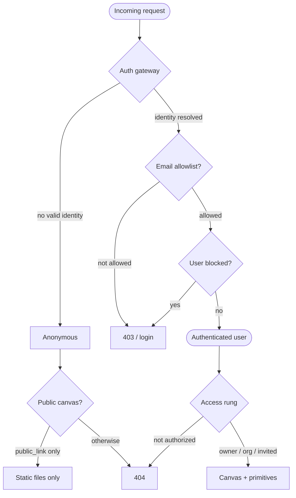

# Security model

Two config choices carry most of the security weight of a canvas-drop instance.
Set them deliberately, then read on for why.

canvas-drop hosts arbitrary, sometimes AI-generated, web artifacts for a trusted
organization — everyone who reaches a canvas has already passed SSO and the
email-domain allowlist. It is not built to defend against the hostile internet.
Inside that trust boundary it holds five hard invariants; beyond them it stays
simple and permissive. This page tells you, as an operator, where the boundary
is and how your config decisions keep it intact.

The two settings that matter most:

| Env var | Production choice | Why it matters |
| --- | --- | --- |
| `CANVAS_DROP_AUTH_MODE` | `proxy` (or `oidc` if you don't front it with a proxy) | Decides how identity is established (invariant #1). |
| `CANVAS_DROP_URL_MODE` | `subdomain` | Gives each canvas its own origin so the browser isolates them (invariant #4). |

Both are config swaps, not code changes. See
[Configuration](/docs/self-hosting/configuration) for the full setup of each.

## The trust boundary

A request only becomes a *user* after the auth gateway resolves a server-side
identity, checks the email allowlist (the env domain list **or** an admin-managed
list of individual emails), maps it to a user, and rejects blocked users. Identity
always comes from the server-side strategy — never from anything the client sends.

The gateway is the single choke point every request crosses on its way to a
canvas or the dashboard:

Pick the strategy with `CANVAS_DROP_AUTH_MODE`:

- `dev` — auto-logs-in a fixed local user, no external verification. Localhost
  only; a stub for trying the product.
- `proxy` — an identity-aware reverse proxy in front of the app asserts identity.
  This is the production profile when you run such a proxy.
- `oidc` — the app runs the OIDC Authorization-Code + PKCE flow itself and owns
  the session. The built-in fallback when you don't front it with a proxy, so
  you're never forced to stand up a proxy just to try it.

## The five hard invariants

These are the guarantees the platform upholds (`BUILD_BRIEF.md` §12.0):

1. **No impersonation.** A user is always who the resolved identity says they
   are. Identity (`me()`, write attribution, presence) comes from the
   server-side auth context, never from the client.
2. **No credential or canvas theft.** No user can read another user's session,
   canvas API key, or canvas content. API keys and session tokens are
   SHA-256-hashed at rest (only the hash is stored); a canvas API key is shown
   once at creation, and a session token rides only in an HttpOnly cookie.
3. **No unauthorized access.** A canvas is reachable only by its owner; at
   the `whole_org` rung, allowed org members (when [tenancy](#the-org-boundary-member-vs-guest)
   is on, that means members of the canvas's *home* org — not brought-in guests); at the
   `team` rung, a member of one of the canvas's granted teams — re-checked on every request
   by re-joining the principal's **live** org membership (a stale `team_members` row can't
   widen access, so a user removed from the org is denied immediately, and a `team` canvas
   under inert tenancy or with no home org is a deny to everyone); at `specific_people`, a principal on
   its allowlist (an org member, or an invited guest whose magic-link session is
   for *that* canvas); at `public_link`, anyone — but static-only and only while
   the owner account holds the admin-granted publish capability. All subject to
   not revoked/expired and any password. An **admin has no special access to
   canvases it doesn't own** — for someone else's canvas an admin is treated as an
   ordinary org member: the rung applies (a non-owned private or unlisted canvas
   `404`s for them) and a password-protected rung prompts the admin too. Cross-owner
   admin power is limited to the dedicated admin routes (the all-canvases list +
   disable/enable/restore); it never extends to canvas content, the owner
   management/editor surface, the runtime API, or realtime. Everything else returns
   `404`; a guest can never reach a canvas it wasn't invited to, and an anonymous
   public visitor gets no backend primitives.
4. **No cross-canvas reach in subdomain mode.** One canvas (or its code, SDK, or
   socket) cannot read, write, or act on another canvas's data, files, AI quota,
   or realtime channels. Path mode has reduced browser isolation (see below).
5. **Lifecycle is honored instantly.** Revoke, expiry, disable, delete, slug
   regen, key regen, rung lowering, allowlist removal, guest-invite revocation,
   and unpublish take effect on the next request and drop live realtime sockets
   (guest sockets included) — no stale grants. A guest session never outlives its
   invite's expiry or revocation.

## The org boundary (member vs guest)

By default any signed-in user is treated as one org — `whole_org` means "anyone
who passed sign-in." If you name an org (`CANVAS_DROP_ORG_NAME`, off by default),
canvas-drop draws a **member-vs-guest boundary**:

- A signed-in user whose **verified email domain** matches a configured org domain
  is a **member**; everyone else who can sign in (an allowlisted contractor, an
  admin on another domain, a Gmail guest) is a **guest**.
- Each canvas has a **home org** (set once at create: a member picks Personal or
  the org; a guest only gets Personal). `whole_org` now means **"members of the
  canvas's home org"** — a brought-in guest cannot see it, and a guest-owned (home
  = Personal) `whole_org` canvas is an explicit deny to everyone but the owner.
- Membership is resolved **server-side** from the session identity (invariant #1);
  a client can never assert which org it belongs to. **Admin is orthogonal** — it
  grants no membership and no content bypass.

The boundary is **inert until an org is named**, so it's an opt-in tightening, not
a default. Turning it on for an existing instance is a one-time, dry-run-first
cutover — see [Configuration → Tenancy](/docs/self-hosting/configuration) and the
`docs/tenancy.md` runbook.

## Invites are auth-delegated (no app-owned credentials)

When you invite someone who doesn't have an account yet — to a personal team, a canvas, or
via the admin **Add users** page — canvas-drop records a **pending invitation**, not a new
login. There is **no app-owned magic-link account and no app-stored password**. The grant
materializes the *first time that email authenticates* through the instance's configured auth
(`oidc` / `proxy` / `dev`) — the identity provider is the only authority, so there's nothing
to take over. The verified login email is the match key; a pending invitation can never grant
access on its own.

Who may permit a **brand-new email** to sign in is gated (a load-bearing rule):

- An **admin** can, via [Add users](/docs/self-hosting/configuration#add-users--invites).
- A **member** can only if the operator turns on `email.allowMemberInvitesToNewEmails` (off by
  default), **or** the email already authenticates (its domain is allowlisted, or it's already
  a permitted user). Otherwise a self-serve invite of an unknown external email is **rejected**
  — a member can't widen who may sign in to your instance.

This replaces the older guest **magic-link** flow for these surfaces. (Per-canvas guest invites
on the *Specific people* rung still use a scoped magic link in `oidc`/`dev` mode; see
[Sharing](/docs/authoring/sharing#inviting-specific-people).) Invite volume is bounded
per-actor (`invites.maxPerActorPerHour`, `invites.pendingCap`).

## Identity is always server-side (invariant #1)

In `proxy` mode exactly one trust path is active, chosen by config — they do not
compose, so an attacker can't omit the JWT to downgrade to the weaker path:

- **JWKS / JWT path (preferred, cryptographic).** When you configure a JWKS URL,
  identity comes only from the proxy's signed JWT, verified against the
  configured issuer and audience. The identity header is never honored in this
  mode; a stray identity header with no valid JWT resolves to anonymous and is
  logged as a downgrade probe.
- **Trusted-header path (only when no JWKS is configured).** The forwarded email
  header is trusted only when the request's immediate hop is in
  `CANVAS_DROP_TRUSTED_PROXY_IPS`. The check gates on the socket peer IP, never
  on a client-influenced `X-Forwarded-For` value. `/0` is rejected, so "trust
  every source" is impossible by construction. A header from an untrusted source
  is ignored and logged.

Proxy mode refuses to start without either a JWKS URL or a trusted-proxy IP set,
so an unguarded "trust any header" config is impossible by construction. The app
must never be directly reachable — only through the proxy. On the trusted-header
path, configure the proxy to overwrite (not append) the identity headers so a
client can't smuggle a second value.

In `oidc` mode the app mints its own session: the `__canvasdrop_session` cookie
carries a high-entropy token whose SHA-256 hash is what the server stores and
looks up — the raw token never lands in the database. The cookie is HttpOnly
always, Secure in prod, SameSite=Lax, with a 14-day rolling expiry; subdomain
mode scopes it to `.{baseHost}`.

## No secrets in the browser (invariant #2)

AI provider keys and canvas API keys are server-side only. Canvas files never
contain a key — the deploy engine even lints uploads and warns when a file may
contain a canvas API key. The browser SDK rides the session, so canvases call
the primitives (KV, files, AI, identity, realtime) without secrets in code.

Deploy API keys are `cd_…` Bearer secrets, hashed at rest and shown once. A key
operates only on its own canvas. See [the Deploy API](/docs/api/deploy-api).

## Path mode vs subdomain mode (invariant #4)

This is the most consequential deployment choice (`CANVAS_DROP_URL_MODE`):

- **Path mode** (`{base}/c/{slug}`) — every canvas shares one origin with the
  others and with the dashboard, so the browser does not isolate them. A
  malicious or XSS'd canvas could make same-origin requests against other
  canvases' client-side state. Fine for localhost and trusted single-user
  hosting. Multi-user path mode must be opted into explicitly with
  `CANVAS_DROP_ALLOW_MULTI_USER_PATH_MODE=true` and surfaces an admin warning.
- **Subdomain mode** (`{slug}.{base}`) — each canvas is its own origin, so the
  browser isolates them and invariant #4 holds. This is the production profile,
  fronted by an identity-aware proxy with wildcard TLS.

If you don't run an identity-aware proxy, run subdomain mode with `oidc` so you
keep per-canvas origin isolation without standing up a proxy.

## Reducing canvas XSS blast radius

Subdomain mode contains the blast radius of a compromised canvas; private-by-
default limits exposure. Tell canvas authors to prefer `textContent` over
`innerHTML`.

## No telemetry

canvas-drop does not phone home. There is no analytics or usage reporting in the
product — nothing leaves your instance unless you configure an outbound
integration (e.g. an OIDC provider or AI provider) yourself.
