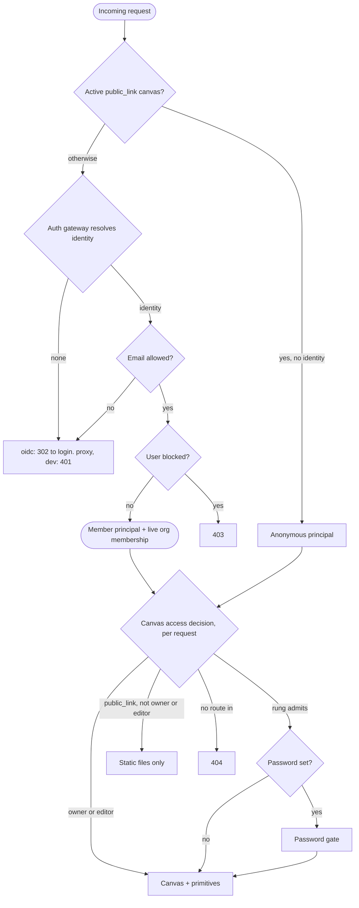

# Security model

This page tells you, as the operator, where the trust boundary of a canvas-drop
instance is, which five guarantees hold inside it, and which config choices keep
them intact. Read it before you put an instance in front of colleagues.

canvas-drop hosts arbitrary, often AI-generated, web artifacts for a trusted
organization. Everyone who reaches a canvas has already passed your sign-in and the
email allowlist. It is not built to defend against the hostile internet. Inside that
boundary it holds five hard invariants; beyond them it stays open and permissive,
because the product is meant to be frictionless among colleagues.

## The two settings that matter most

| Env var | Production choice | Why it matters |
| --- | --- | --- |
| `CANVAS_DROP_AUTH_MODE` | `proxy` (or `oidc` when nothing fronts the app) | Decides how identity is established (invariant 1). |
| `CANVAS_DROP_URL_MODE` | `subdomain` | Gives each canvas its own origin so the browser isolates canvases from each other (invariant 4). |

A production baseline behind an identity-aware proxy that forwards a signed JWT:

```bash
CANVAS_DROP_AUTH_MODE=proxy
CANVAS_DROP_URL_MODE=subdomain
CANVAS_DROP_BASE_URL=https://canvases.example.com
CANVAS_DROP_ALLOWED_EMAIL_DOMAINS=example.com
CANVAS_DROP_AUTH_PROXY_JWT_JWKS_URL=https://<your-proxy>/<its-jwks-path>
CANVAS_DROP_AUTH_PROXY_JWT_ISSUER=https://<your-proxy>
CANVAS_DROP_AUTH_PROXY_JWT_AUDIENCE=<audience-your-proxy-sets>
CANVAS_DROP_SESSION_SECRET=<32 or more random characters>
```

Without a proxy, let the app own login instead:

```bash
CANVAS_DROP_AUTH_MODE=oidc
CANVAS_DROP_URL_MODE=subdomain
CANVAS_DROP_BASE_URL=https://canvases.example.com
CANVAS_DROP_ALLOWED_EMAIL_DOMAINS=example.com
CANVAS_DROP_OIDC_ISSUER=https://<your-openid-provider>
CANVAS_DROP_OIDC_CLIENT_ID=<client id>
CANVAS_DROP_OIDC_CLIENT_SECRET=<client secret>
CANVAS_DROP_SESSION_SECRET=<32 or more random characters>
```

Both are config swaps, never code changes. Config is validated at boot and refuses to
start on an unsafe combination; the guards are listed under each invariant below. See
[Configuration](/docs/self-hosting/configuration) for every variable and
[Deploy](/docs/self-hosting/deploy) for the proxy layout.

## The trust boundary

A request becomes a *member* only after the auth gateway resolves an identity
server-side, checks the email allowlist (the `CANVAS_DROP_ALLOWED_EMAIL_DOMAINS`
domains, or an individual sign-in permit an admin added), maps it to a user, and
rejects blocked users. The gateway runs on every request; nothing is cached between
requests. The only way past it without an identity is the public-link carve-out, which
grants an anonymous principal for an active `public_link` canvas and nothing else.


```mermaid
flowchart TD
    Req([Incoming request]) --> Carve{Active public_link canvas?}
    Carve -->|yes, no identity| Anon[Anonymous principal]
    Carve -->|otherwise| Gate{Auth gateway resolves identity}
    Gate -->|none| Unauth["oidc: 302 to login. proxy, dev: 401"]
    Gate -->|identity| Allow{Email allowed?}
    Allow -->|no| Unauth
    Allow -->|yes| Blocked{User blocked?}
    Blocked -->|yes| Forbidden[403]
    Blocked -->|no| Member([Member principal + live org membership])
    Member --> Access{Canvas access decision, per request}
    Anon --> Access
    Access -->|owner or editor| Full[Canvas + primitives]
    Access -->|rung admits| PwGate{Password set?}
    PwGate -->|no| Full
    PwGate -->|yes| Gate2[Password gate] --> Full
    Access -->|public_link, not owner or editor| Static[Static files only]
    Access -->|no route in| NotFound[404]
```

What each denial looks like, so you can read your logs and support tickets:

| Situation | Response | Audit row |
| --- | --- | --- |
| No identity | `oidc`: `302` to `/auth/login?returnTo=`; `proxy` and `dev`: `401 {"error":"unauthorized"}` | `auth_denied` / `no_identity` |
| Email not on the domain list or the permit list | same as no identity | `auth_denied` / `domain_not_allowed` |
| User blocked by an admin | `403 {"error":"forbidden"}` | `auth_denied` / `blocked` |
| Signed in, but no route into the canvas | `404 {"error":"not_found"}`, never a "forbidden" that confirms the canvas exists | none (the gateway already logged `auth_ok`) |
| Canvas disabled by an admin | `403` disabled page, shown to the owner and to admins too | none |
| Canvas archived or deleted | `404`, opaque even to the owner | none |

If the allowlist lookup itself fails (a database error), the gateway denies. It fails
closed, never open.

Pick the strategy with `CANVAS_DROP_AUTH_MODE`:

- `dev`: auto-logs-in a fixed local user (`CANVAS_DROP_DEV_USER_EMAIL`, default
  `dev@example.com`) with no verification, and makes that user the bootstrap admin.
  Localhost only. Refused at boot when `NODE_ENV=production`.
- `proxy`: an identity-aware proxy in front of the app asserts identity. The app is
  sessionless; the proxy owns the session. The recommended production profile.
- `oidc`: the app runs the OpenID Connect Authorization Code + PKCE flow itself and owns
  the session cookie. The built-in path when you do not run a proxy.

## The five hard invariants

These are the guarantees the platform upholds (`BUILD_BRIEF.md` §12.0). Each section
after this one names the mechanism behind one of them.

1. **No impersonation.** Identity (`me()`, write attribution, presence) comes from the
   server-side auth context, never from anything the client sends.
2. **No credential or canvas theft.** No user can read another user's session, canvas
   API key, or canvas content. Session tokens and API keys are stored only as SHA-256
   hashes; an API key is shown once; a session token rides only in an HttpOnly cookie.
3. **No unauthorized access.** A canvas is reachable by its owner and its editors, and
   otherwise only through the access rung the owner chose. Admins get no special access
   to canvases they do not own. Anyone without a route in gets `404`.
4. **No cross-canvas reach in subdomain mode.** One canvas, its code, its SDK calls, or
   its socket cannot read, write, or act on another canvas's data, files, AI quota, or
   realtime channels. Path mode has reduced browser isolation and must be opted into.
5. **Lifecycle is honored instantly.** Revoke, expiry, disable, delete, slug regen, key
   regen, rung lowering, removal from a list, team, or org, and unpublish take effect on
   the next request, and sharing changes revalidate live realtime sockets. Nothing
   grants access from a cache.

## Identity is always server-side (invariant 1)

| Mode | Identity comes from | App session | Unauthenticated request |
| --- | --- | --- | --- |
| `dev` | the configured dev user | cookie, used only by `/auth/logout` | never happens |
| `proxy`, JWT path | the proxy's signed JWT: signature against the JWKS, `iss`, `aud`, `exp`, `nbf`, and a string `email` claim | none | `401` |
| `proxy`, trusted-header path | `X-Auth-Request-Email` (configurable), accepted only from a TCP peer in `CANVAS_DROP_TRUSTED_PROXY_IPS` | none | `401` |
| `oidc` | the app's own session cookie, minted by the OIDC callback | `__canvasdrop_session`, 14-day rolling expiry | `302` to `/auth/login` |

Each mode namespaces the stored identity (`dev:`, `proxy:`, `oidc:` prefixes on the
provider subject), so switching modes never merges accounts across trust sources.

### `proxy` mode: one trust path, never two

Exactly one trust path is active, selected by whether
`CANVAS_DROP_AUTH_PROXY_JWT_JWKS_URL` is set. The two do not compose, so a client cannot
omit the JWT to fall back to the weaker header path.

- **JWT / JWKS path (preferred, cryptographic).** With a JWKS URL configured, identity
  comes only from the token in `CANVAS_DROP_AUTH_PROXY_JWT_HEADER` (default
  `Cf-Access-Jwt-Assertion`), verified against the remote JWKS and the configured issuer
  and audience. The email header is never consulted in this mode. A request that carries
  an identity header but no valid JWT resolves to anonymous and is logged as a downgrade
  probe. `CANVAS_DROP_AUTH_PROXY_JWT_ISSUER` and `CANVAS_DROP_AUTH_PROXY_JWT_AUDIENCE` are
  required when the JWKS URL is set.
- **Trusted-header path (only when no JWKS URL is set).** The email header (default
  `X-Auth-Request-Email`) is honored only when the request's socket peer matches an entry
  in `CANVAS_DROP_TRUSTED_PROXY_IPS`. The check gates on the real TCP peer address, never
  on `X-Forwarded-For` or any other header. A header from any other source is ignored
  and logged as "ignored identity header from untrusted source".

Boot guards for `proxy` mode: the app refuses to start without a JWKS URL or a non-empty
trusted-IP list, so an unguarded "trust any header" config cannot exist. Every
`CANVAS_DROP_TRUSTED_PROXY_IPS` entry is validated: malformed IPv4 is rejected, `/0` is
rejected (at boot and again at runtime), and IPv6 entries are rejected; use the JWT path
for IPv6 proxies. Two operational rules follow: the app must never be directly
reachable, only through the proxy; and on the trusted-header path the proxy must
overwrite (not append) the identity headers so a client cannot smuggle a second value.

Two IPs, two purposes. The **peer IP** gates identity trust. The **client IP**, read from
`CANVAS_DROP_CLIENT_IP_HEADER` or the rightmost untrusted `X-Forwarded-For` hop and only
when the peer is a trusted proxy, keys login rate limits and audit rows. It is never an
auth input. That is why `CANVAS_DROP_TRUSTED_PROXY_IPS` is worth setting in `oidc` mode
too (for example `127.0.0.1` for a local reverse proxy), even though header-asserted
identity fires only in `proxy` mode.

### `oidc` mode: the app owns the session

Login uses PKCE (S256), a random `state`, and `prompt=login`. The callback rejects a
missing or mismatched state, a failed code exchange, a missing `email` claim, and
`email_verified=false`, and only then runs the same allowlist and blocked checks as every
other request. Every rejection writes an `auth_denied` audit row.

The session token is 256 bits of randomness; only its SHA-256 hash is stored, so the raw
token never lands in the database. The cookie is HttpOnly always, Secure in production,
`SameSite=Lax`, and scoped to `.{baseHost}` in subdomain mode. `/auth/logout` revokes the
session (audit `session_revoke`). `CANVAS_DROP_SESSION_SECRET` must be at least 32
characters outside `dev` mode; it also signs the password-gate grants below.

### Agents

Agents connect over MCP with OAuth 2.1 tokens the instance issues itself. Every tool
resolves the caller's user server-side and runs the same owner-or-editor role gate as
the dashboard. The keyed [Deploy API](/docs/api/deploy-api) has no user at all: its
writes are attributed to the canvas owner. See [MCP server](/docs/agents/mcp).

## Access is decided on every request (invariant 3)

Per-canvas roles and the access ladder are resolved from the server-side principal on
each request, never cached on a session or an agent's token. Owner and **editor** are
the management roles: an editor is owner-equivalent except for deleting, transferring,
and the guest-AI switch (an editor attempting those gets `OWNER_ONLY`). Only org members
can be editors. Viewers and everyone else are admitted, or not, by the rung:

| Rung | Who is admitted | Password and expiry |
| --- | --- | --- |
| Private | the owner and editors only | not applicable |
| Specific people | signed-in principals on the canvas list: an existing user, or a pending email once that exact email has signed in through your configured auth | both apply |
| Team | members of a granted team. A personal team admits by membership alone; an org team also requires the viewer to be a current member of that team's org, re-joined live on every request, so a stale team row cannot widen access | both apply |
| Whole org | any signed-in member. When an org is named (below), members of the canvas's home org only | both apply |
| Public link | anyone, static files only, while the instance-wide switch is on and the owner still holds the publish-public capability | both apply; an anonymous visitor reaches the password prompt |

The owner and editors are admitted at every rung, never see the password prompt, and
are unaffected by expiry. A canvas that admits no one at the current rung returns
`404`. A password is checked with argon2; a successful attempt sets an HttpOnly grant
cookie (`__canvasdrop_gate`) bound to the canvas id and its password version, so
changing the password invalidates every outstanding grant at once. In subdomain mode
the grant is host-only; in path mode it is scoped to the canvas path. The gate is rate
limited (`CANVAS_DROP_RATELIMIT_PASSWORD_GATE_PER_MIN`, default 5).

**Public links are doubly gated.** Admin → Configuration → `access.publicLinksEnabled`
(default on) is the instance switch; turning it off returns every public-link canvas to
private. Each owner also needs the publish-public capability, granted and revoked per
user under Admin → People; revoking it sweeps that owner's public-link canvases back to
private. A public-link visitor gets files only: every runtime API call is refused with
`403 {"code":"STATIC_ONLY"}`, including for signed-in members who are not the owner or
an editor. In `proxy` mode a public link works only for requests your proxy lets reach
the app.

**Admins have no back door.** For a canvas they do not own, an admin is an ordinary
member: a private canvas returns `404`, a password prompts them, and they cannot open
the editor or change settings. Cross-owner admin power lives on the dedicated admin
routes: the all-canvases list, disable / enable / restore, reassigning the owner when
someone leaves, and gallery featuring. It never extends to canvas content, the runtime
API, or realtime. One recorded exception: the authoring API (off by default) still lets
an admin manage an authored share it does not own.

The retired guest magic-link flow is gone. Old `/guest/<token>` links return an
invalid-link page, never set a cookie, and never consume a token; the sharing paths
below record pending access against your configured auth instead.

## The org boundary (member vs guest)

By default any signed-in user is treated as one org, so `whole_org` means "anyone who
passed sign-in". Naming an org with `CANVAS_DROP_ORG_NAME` draws a member-vs-guest
boundary:

- A signed-in user whose **verified email domain** is in `CANVAS_DROP_ORG_DOMAINS`
  (default: the allowed-email domains) is a **member**. Everyone else who can sign in,
  such as an allowlisted contractor or an admin on another domain, is a **guest**.
  Membership is independent of the sign-in permit list and of `CANVAS_DROP_ADMIN_EMAILS`;
  those grant sign-in, not membership.
- Each canvas has a **home org**, set once at creation: a member picks Personal or the
  org; a guest only gets Personal. `whole_org` then means "members of the canvas's home
  org". A guest cannot see it, and a Personal `whole_org` canvas is an explicit deny to
  everyone but its owner and editors.
- Membership is derived server-side from the identity the gateway resolved. A client can
  never assert which org it belongs to. Admin is orthogonal: it grants no membership and
  no content bypass.

The boundary is inert until an org is named, so it is an opt-in tightening. Turning it on
for an existing instance is a one-time, dry-run-first cutover; see
[Configuration → Tenancy](/docs/self-hosting/configuration) and the `docs/tenancy.md`
runbook in the repo.

## Adds are auth-delegated (no app-owned credentials)

When someone adds a person who has no account yet, whether to a canvas, to a personal
team, or under Admin → People → Sign-in permits, canvas-drop records **pending access**,
not a login. There is no app-owned magic-link account and no app-stored password. The
grant materializes the first time that email authenticates through your configured auth
(`proxy`, `oidc`, or `dev`); the identity provider stays the only authority, so there is
nothing to take over. The verified login email is the match key, and pending access
never grants anything on its own.

Who may permit a **brand-new email** to sign in is gated:

- In `proxy` mode, an email that cannot already sign in (its domain is not allowed and
  it holds no permit) must be admitted at the proxy first. canvas-drop cannot widen an
  upstream IAP, so the add is refused with `auth_admission_required` until then.
- An **admin** can add a permit under Sign-in permits.
- A **member** can only when the admin setting `invites.allowMemberNewEmails` is on (off
  by default), or when the email already authenticates. Otherwise the add is rejected; a
  member cannot widen who may sign in to your instance.

Add volume is bounded per actor with `invites.maxPerActorPerHour` (default 20) and
`invites.pendingCap` (default 50). Both are DB-managed admin settings; see
[Sign-in permits & access emails](/docs/self-hosting/configuration#sign-in-permits--access-emails).

## No secrets in the browser (invariant 2)

The AI provider key (`CANVAS_DROP_AI_API_KEY`) and every canvas API key are server-side
only. The browser SDK rides the viewer's session, so a canvas calls the primitives (KV,
files, AI, identity, realtime) with no secret in its code. The deploy engine lints every
upload and warns when a file appears to contain a canvas API key.

Deploy keys are `cd_` Bearer secrets: 32 random bytes, stored only as a SHA-256 hash,
shown once at creation or regeneration. A key works only on its own canvas (`403` on any
other), only while that canvas is active (`401` the moment it is archived or disabled),
and dies the moment it is regenerated. Cloning a canvas mints a fresh key; it never
copies the source's. See the [Deploy API](/docs/api/deploy-api).

## Path mode vs subdomain mode (invariant 4)

`CANVAS_DROP_URL_MODE` is the most consequential deployment choice.

- **Path mode** (`{base}/c/{slug}/`): every canvas shares one origin with the others and
  with the dashboard, so the browser does not isolate them. A malicious or compromised
  canvas could make same-origin requests against other canvases' client-side state. Fine
  for localhost and single-user hosting. Running `proxy` or `oidc` auth in path mode is
  multi-user, and the app refuses to boot unless you set
  `CANVAS_DROP_ALLOW_MULTI_USER_PATH_MODE=true` to accept the tradeoff.
- **Subdomain mode** (`{slug}.canvases.example.com`): each canvas is its own origin, so
  the browser isolates them and invariant 4 holds in full. Needs a wildcard DNS record
  and wildcard TLS at the proxy, and a non-localhost `CANVAS_DROP_BASE_URL`.

Server-side isolation holds in both modes: blobs, KV, files, AI usage, and realtime
channels are keyed by canvas id, and management mutations require a same-origin request
(`Sec-Fetch-Site`, else a matching `Origin`). Subdomain mode adds the browser's origin
boundary on top. If you do not run an identity-aware proxy, run subdomain mode with
`oidc` so you keep that boundary without standing up a proxy.

## Lifecycle changes land on the next request (invariant 5)

Nothing about access is cached. Concretely:

- Roles and rungs are resolved per request, so removing an editor, lowering a rung,
  or removing someone from a list, team, or org denies them on their very next request.
  Share, people-list, ownership, password, and unpublish changes also revalidate that
  canvas's live realtime sockets right away, and sockets that lost access are dropped.
- A blocked user is refused at the gateway on the next request, whatever session or
  agent token they hold.
- An archived, disabled, or deleted canvas rejects its own deploy key with `401`.
- Regenerating a slug invalidates the old URL and drops every live socket so clients
  reconnect under the new one. Regenerating a key invalidates the old key at once.
- Changing a canvas password invalidates every outstanding gate grant.
- Turning off public links, or revoking one owner's publish-public capability, returns
  the affected canvases to private immediately.

## Reducing canvas XSS blast radius

Subdomain mode contains the blast radius of a compromised canvas to that canvas's
origin; private-by-default limits who can be exposed to it. Canvas responses carry
`X-Content-Type-Options: nosniff`, `Referrer-Policy: same-origin`,
`Cross-Origin-Opener-Policy: same-origin`, and a `Content-Security-Policy` of
`frame-ancestors 'self'` plus the dashboard origin, so no other canvas can frame it. The
dashboard itself runs under a strict CSP (`script-src 'self'`, `frame-ancestors 'none'`).
Tell canvas authors to prefer `textContent` over `innerHTML`.

## What gets audited

The audit log records `auth_ok` and `auth_denied` (with the reason) on every gateway
decision, `session_create` and `session_revoke` in `oidc` mode, and every OIDC callback
rejection. Canvas actions are attributed to the acting user or agent: `deploy`,
`rollback`, `canvas_unpublish`, `share_change`, `password_change`, `slug_regen`, and key
rotation, among others. Admin actions are audited by name: `canvas_disable`,
`canvas_enable`, `canvas_restore`, `user_block`, `user_unblock`, `user_promote`,
`user_demote`, `user_grant_public`, `user_revoke_public`, `allowed_email_add`,
`allowed_email_remove`. Rows carry the client IP described above. Login attempts are
limited to `CANVAS_DROP_RATELIMIT_LOGIN_PER_MIN` (default 10) per client IP; see
[Rate limiting](/docs/self-hosting/configuration#rate-limiting).

## No telemetry

canvas-drop does not phone home. There is no analytics, usage reporting, or third-party
beacon in the product. Nothing leaves your instance unless you configure an outbound
integration yourself, such as an OIDC provider, an AI provider, or a mail transport.
